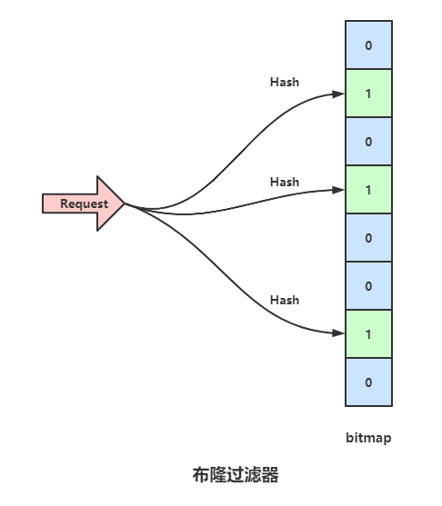

# 布隆过滤器 Bloom Filter

大概的思路就是,当你请求的信息来的时候,先检查一下你查询的数据我这有没有,有的话将请求压给数据库,没有的话直接返回

- 存入过程

  通过三个hash函数计算出三个哈希值，然后将三个值映射到数组中将0改成1。

- 查询过程

  通过三个hash函数计算出查询数据的哈希值，然后检查布隆过滤器对应位置上的值是否为1，如果有一个不为1表示该值不存在，如果都为1表示该值可能存在。（查询时间复杂度为O(k)，k为哈希函数个数）

- 删除过程

  不能进行删除，因为会删除掉其他数据。

- 更新过程

  不能进行更新。

## 原理

### 布隆过滤器基础版

原理就是一个对一个key进行k个hash算法获取k个值，在比特数组中将这k个值散列后设定为1，然后查的时候如果特定的这几个位置都为1，那么布隆过滤器判断该key存在。



一个bitmap用于记录，bitmap原始数值全都是0。当一个数据存进来的时候，用三个Hash函数分别计算三次Hash值,并且将bitmap对应的位置设置为1,上图中,bitmap 的1,3,6位置被标记为1,这时候如果一个数据请求过来,依然用之前的三个Hash函数计算Hash值,如果是同一个数据的话,势必依旧是映射到1,3,6位,那么就可以判断这个数据之前存储过,如果新的数据映射的三个位置,有一个匹配不上,假如映射到1,3,7位,由于7位是0,也就是这个数据之前并没有加入进数据库,所以直接返回。

Redis的bitmap只支持2^32大小，对应到内存也就是512MB，误判率万分之一，可以放下2亿左右的数据，性能高，空间占用率及小，省去了大量无效的数据库连接。

<!-- more -->

#### 布隆过滤器基础版的问题

###### 误判

如果它说不存在那肯定不存在，如果它说存在，那数据有可能实际不存在

假如有这么一个情景,放入数据包1时,将bitmap的1,3,6位设置为了1,放入数据包2时将bitmap的3,6,7位设置为了1,此时一个并没有存过的数据包请求3,做三次哈希之后,对应的bitmap位点分别是1,6,7,这个数据之前并没有存进去过,但是由于数据包1和2存入时将对应的点设置为了1,所以请求3也会压倒数据库上,这种情况,会随着存入的数据增加而增加。


###### 无法删除数据

- 由于有误判的可能,并不确定数据是否存在数据库里,例如数据包3。
- 当你删除某一个数据包对应位图上的标志后,可能影响其他的数据包,例如上面例子中,如果删除数据包1,也就意味着会将bitmap1,3,6位设置为0,此时数据包2来请求时,会显示不存在,因为3,6两位已经被设置为0。


### 布隆过滤器增强版

为了解决上面布隆过滤器的问题,出现了一个增强版的布隆过滤器(Counting Bloom Filter),这个过滤器的思路是将布隆过滤器的bitmap更换成数组,当数组某位置被映射一次时就+1,当删除时就-1,这样就避免了普通布隆过滤器删除数据后需要重新计算其余数据包Hash的问题,但是依旧没法避免误判。


##  应用


1. redis缓存穿透（大量查询不存在于数据库中的数据）：使用布隆过滤器进行过滤，如果不存在直接跳过查询数据库，返回结果。
2. 新闻客户端的推送去重功能，当推荐系统推荐新闻时会从每个用户的历史记录里进行筛选，过滤掉那些已经存在的记录。它在起到去重的同时，在空间上还能节省 90% 以上，只是稍微有那么点不精确，也就是有一定的误判概率。
3. 黑白名单
4. 块索引是HBase固有的一个特性，因为HBase的底层数据是存储在HFile中的，而每个HFile中存储的是有序的键值对，HFile文件内部由连续的块组成，每个块中存储的第一行数据的行键组成了这个文件的块索引，这些块索引信息存储在文件尾部。当HBase打开一个HFile时，块索引信息会优先加载到内存；HBase首先在内存的块索引中进行二分查找，确定可能包含给定键的块，然后读取磁盘块找到实际想要的键。
   但实际应用中，仅仅只有块索引满足不了需求，这是因为，块索引能帮助我们更快地在一个文件中找到想要的数据，但是我们可能依然需要扫描很多文件。而布隆过滤器就是为解决这个问题而生。因为布隆过滤器的作用是，用户可以立即判断一个文件是否包含特定的行键，从而帮我们过滤掉一些不需要扫描的文件。

## 代码实现

### Redisson

#### Dependence

```xml
<dependency>
  <groupId>org.redisson</groupId>
  <artifactId>redisson</artifactId>
  <version>3.6.5</version>
</dependency>
```

#### Code

```java
public class RedissonBloomFilter {

  public static void main(String[] args) {
    Config config = new Config();
    config.useSingleServer().setAddress("redis://192.168.32.128:6379");
    //        config.useSingleServer().setPassword("");
    // 构造Redisson
    RedissonClient redissonClient = Redisson.create(config);

    // 初始化布隆过滤器：预计元素为100000000L个，误差率为3%
    RBloomFilter<Object> bloomFilter = redissonClient.getBloomFilter("phoneList");
    bloomFilter.tryInit(100000000L, 0.03);

    // 将号码插入到布隆过滤器中
    bloomFilter.add("10086");

    // 判断下面的号码是否在布隆过滤器中
    System.out.println(bloomFilter.contains("10000"));
    System.out.println(bloomFilter.contains("10086"));

  }
}
```


### Guava

调用谷歌的guava包的api就可以。

**缺点：guava版实现主要问题在于无法支持集群环境. 为了支持集群环境主要考虑通过redis setbit来实现BloomFilter。**

- 创建布隆过滤器对象：

  ```java
  // 参数Funnels.integerFunnel()是默认参数，size是预计存入的数据量，fpp是设置的误判率
  public static <T> BloomFilter<T> create(
    Funnel<? super T> funnel, int expectedInsertions, double fpp) {
    return create(funnel, (long) expectedInsertions, fpp);
  }
  ```

> 误判率越低，哈希函数个数和布隆过滤器数组长度越大，运算效率越低。

- 放入数据：

  ```java
  @CanIgnoreReturnValue
  public boolean put(T object) {
    return strategy.put(object, funnel, numHashFunctions, bits);
  }
  ```

- 判断是否存在：

  ```java
  public boolean mightContain(T object) {
    return strategy.mightContain(object, funnel, numHashFunctions, bits);
  }
  ```

  

## 布隆过滤器的缺点

- 查询性能弱

  布隆过滤器使用多个hash函数计算位图多个不同位点，由于多个位点在内存中不连续，这些位点在内存上跨度很大，会导致 CPU 缓存行命中率低，CPU寻址花销较大。

- 空间利用率低

  在相同的误判率下，布谷鸟过滤器的空间利用率要明显高于布隆，空间上大概能节省 40% 多。不过布隆过滤器并没有要求位图的长度必须是 2 的指数，而布谷鸟过滤器必须有这个要求。从这一点出发，似乎布隆过滤器的空间伸缩性更强一些

- 不支持反向删除操作（元素）

  一旦对位数组进行了赋值，无法将其删除。可以通过增加每个数组元素大小使用增强版过滤器实现删除功能。

- 不支持计数

# 布谷鸟哈希

最简单的布谷鸟哈希结构是一维数组结构，会有两个 hash 算法将新来的元素映射到数组的两个位置。如果两个位置中有一个位置为空，那么就可以将元素直接放进去。但是如果这两个位置都满了，它就不得不「鸠占鹊巢」，随机踢走一个，然后自己霸占了这个位置。

```c
p1 = hash1(x) % l
p2 = hash2(x) % l
```

布谷鸟哈希算法会帮这些受害者（被挤走的蛋）寻找其它的窝。因为每一个元素都可以放在两个位置，只要任意一个有空位置，就可以塞进去。所以这个伤心的被挤走的蛋会看看自己的另一个位置有没有空，如果空了，自己挪过去也就皆大欢喜了。但是如果这个位置也被别人占了呢？好，那么它会再来一次「鸠占鹊巢」，将受害者的角色转嫁给别人。然后这个新的受害者还会重复这个过程直到所有的蛋都找到了自己的巢为止。

### 布谷鸟哈希的问题

------

但是会遇到一个问题，那就是如果数组太拥挤了，连续踢来踢去几百次还没有停下来，这时候会严重影响插入效率。这时候布谷鸟哈希会设置一个阈值，当连续占巢行为超出了某个阈值，就认为这个数组已经几乎满了。这时候就需要对它进行扩容，重新放置所有元素。

还会有另一个问题，那就是可能会存在挤兑循环。比如两个不同的元素，hash 之后的两个位置正好相同，这时候它们一人一个位置没有问题。但是这时候来了第三个元素，它 hash 之后的位置也和它们一样，很明显，这时候会出现挤兑的循环。不过让三个不同的元素经过两次 hash 后位置还一样，这样的概率并不是很高，除非你的 hash 算法太挫了。

布谷鸟哈希算法对待这种挤兑循环的态度就是认为数组太拥挤了，需要扩容（实际上并不是这样）。

### 优化

上面的布谷鸟哈希算法的平均空间利用率并不高，大概只有 50%。到了这个百分比，就会很快出现连续挤兑次数超出阈值。这样的哈希算法价值并不明显，所以需要对它进行改良。

改良的方案之一是增加 hash 函数，让每个元素不止有两个巢，而是三个巢、四个巢。这样可以大大降低碰撞的概率，将空间利用率提高到 95%左右。

另一个改良方案是在数组的每个位置上挂上多个座位，这样即使两个元素被 hash 在了同一个位置，也不必立即「鸠占鹊巢」，因为这里有多个座位，你可以随意坐一个。除非这多个座位都被占了，才需要进行挤兑。很明显这也会显著降低挤兑次数。这种方案的空间利用率只有 85%左右，但是查询效率会很高，同一个位置上的多个座位在内存空间上是连续的，可以有效利用 CPU 高速缓存。

所以更加高效的方案是将上面的两个改良方案融合起来，比如使用 4 个 hash 函数，每个位置上放 2 个座位。这样既可以得到时间效率，又可以得到空间效率。这样的组合甚至可以将空间利用率提到高 99%，这是非常了不起的空间效率。

# 布谷鸟过滤器 Cuckoo Filter

## 原理


**布谷鸟哈希结构：**布谷鸟过滤器由一个数组组成，数组中元素大小为4个字节，可以存储4个指纹，每个指纹占一个字节(128种)。同一个数组元素 上的多个座位在内存空间上是连续的，可以有效利用 CPU 高速缓存。

```c
type bucket [4]byte   // 一个桶，4个座位
type cuckoo_filter struct {
    buckets [size]bucket  // 一维数组
    nums int   // 容纳的元素个数
    kick_max   // 最大挤兑次数
}
```

### 插入：

首先计算数据的指纹和哈希值，并通过指纹和哈希值计算另一个哈希值，两个哈希值映射到两个位置(因为计算得到两个位置，每个位置存储4个指纹，所以相同对象最多存储8个)。接下来进行插入，会尝试插入两个位置，如果都失败，随机挤走一个指纹，并重新为该指纹寻找新的位置(超过最大挤兑次数后扩容)。

### 扩容：

如果数组过小，会发生循环挤兑的情况，就可以设置最大挤兑次数，如果超过该次数，进行扩容，重新计算每个指纹的位置。

### 查找：

通过计算哈希值得到两个元素，对两个元素中的8个位置进行指纹对比，如果对比成功则表示数据存在。如果哈希值和指纹相同时会发生误判(小概率)。

### 删除：

因为每个对象的指纹会存储到一个位置中，所以可以通过删除这个指纹来删除数据。删除功能无法使用的情况：如果相同对象存储超过8个，就无法使用删除功能；如果俩数据的哈希值和指纹相同时，会出现误删除情况。

### 更新：

即删除后再添加新指纹。

## 与布谷鸟哈希区别

布谷鸟过滤器和布谷鸟哈希结构一样，它也是一维数组，但是不同于布谷鸟哈希的是，布谷鸟哈希会存储整个元素，而布谷鸟过滤器中只会存储元素的指纹信息（几个bit，类似于布隆过滤器）。这里过滤器牺牲了数据的精确性换取了空间效率。正是因为存储的是元素的指纹信息，所以会存在误判率，这点和布隆过滤器如出一辙。

首先布谷鸟过滤器还是只会选用两个 hash 函数，但是每个位置可以放置多个座位。这两个 hash 函数选择的比较特殊，因为过滤器中只能存储指纹信息。当这个位置上的指纹被挤兑之后，它需要计算出另一个对偶位置。而计算这个对偶位置是需要元素本身的，我们来回忆一下前面的哈希位置计算公式。

```go
fp = fingerprint(x)
p1 = hash1(x) % l
p2 = hash2(x) % l
```

我们知道了 p1 和 x 的指纹，是没办法直接计算出 p2 的。

### 特殊的 hash 函数

布谷鸟过滤器巧妙的地方就在于设计了一个独特的 hash 函数，使得可以根据 p1 和 元素指纹 直接计算出 p2，而不需要完整的 x 元素。

```go
fp = fingerprint(x)
p1 = hash(x)
p2 = p1 ^ hash(fp)  // 异或
```

从上面的公式中可以看出，当我们知道 fp 和 p1，就可以直接算出 p2。同样如果我们知道 p2 和 fp，也可以直接算出 p1 —— 对偶性。

```go
p1 = p2 ^ hash(fp)
```

所以我们根本不需要知道当前的位置是 p1 还是 p2，只需要将当前的位置和 hash(fp) 进行异或计算就可以得到对偶位置。而且只需要确保 hash(fp) != 0 就可以确保 p1 != p2，如此就不会出现自己踢自己导致死循环的问题。

也许你会问为什么这里的 hash 函数不需要对数组的长度取模呢？实际上是需要的，但是布谷鸟过滤器强制数组的长度必须是 2 的指数，所以对数组的长度取模等价于取 hash 值的最后 n 位。在进行异或运算时，忽略掉低 n 位 之外的其它位就行。将计算出来的位置 p 保留低 n 位就是最终的对偶位置。

## 应用

同布隆过滤器。

## 代码实现

貌似目前没有现成的java实现。
可以参考如下项目：

- [https://github.com/kristoff-it/redis-cuckoofilter](https://link.zhihu.com/?target=https%3A//links.jianshu.com/go%3Fto%3Dhttps%3A%2F%2Fgithub.com%2Fkristoff-it%2Fredis-cuckoofilter)
- 通过redis中强有力的第三方扩展module, 让redis支持sql及布谷鸟过滤器。
  [https://github.com/RedBeardLab/rediSQL](https://link.zhihu.com/?target=https%3A//links.jianshu.com/go%3Fto%3Dhttps%3A%2F%2Fgithub.com%2FRedBeardLab%2FrediSQL)


## 布谷鸟过滤器的优缺点

### 对比布隆过滤器：

布谷鸟过滤器在错误率小于3%的时候空间性能是优于布隆过滤器的，而这个条件在实际应用中常常满足，所以一般来说它的空间性能是要优于布隆过滤器的。布谷鸟过滤器按照普通设计，只有两个Hash表，在查找的时候可以确保两次访存就可以做完，相比于布隆过滤器的K个Hash函数K次访存，在数据量很大不能全部装载在内存中的情况下，多次访问内存性能较差。
当然，布谷过滤器也有其相应的缺点，当装填数据过多的时候，容易出现循环的问题，即插入失败的情况。另外，它还跟布隆过滤器共有的一个缺点，就是访问空间地址不连续，内存寻址消耗大。

### 优点：

- 访问内存次数低
- Hash函数计算简单
- 存在删除操作。如果相同数据个数不超过8个，那么删除操作可用；但是因为存储的是计算后的指纹信息，存在误删除的可能，所以不好用。

### 缺点：

- 内存空间不联系，CPU消耗大。
- 容易出现装填循环问题：Hash冲突踢出原数据，原数据还是存在冲突。
- 删除数据时，Hash冲突会引起误删：查询有误判，那么删除也会有误删。


###### 来源：

https://zhuanlan.zhihu.com/p/462815302

https://blog.csdn.net/Ch97CKd/article/details/123700044

https://blog.csdn.net/zyf7764029/article/details/125476171
