# DDD与中台、微服务的关系

- 什么是中台
- 企业中台组成
- 基于DDD的微服务设计
- 微服务拆分和设计原则
- 中台、微服务与DDD的关系

<!-- more -->

# 中台

## 什么是中台

中台是一个基础的理念和架构，与前台、后台相对应，是为前台而生的平台，**「是在系统中被共用的中间件的集合。它的目的就是服务前台规模化创新，进而更好的服务用户，使企业与用户持续对接。」**

**「中台是前台的支撑系统，基础设施层之上的通用业务层，具体由通用的业务领域能力和与其对应的后台系统共同组成。」**

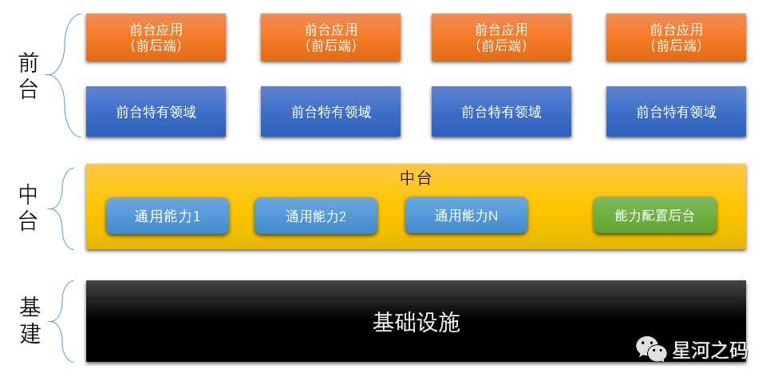

- **「中台的关键词」**

- - **「共享」**

    数据、业务、人工智能等各个领域的数据信息化的不断地发展，**「中台将通用的服务共享给前台服务，达到敏捷、复用、解耦的目的」**。

  - **「联通」**

    将前台与各个业务板块联通

  - **「融合」**

    将前台业务流程和数据的融合，并以共享的方式支持前台业务的发展与创新

  - **「创新」**

- **「中台的三个能力」**

- - 对前台的快速相应能力
  - 企业级的复用，解耦能力
  - 前台，中台，后台的服务与数据的融合与联通能力

## 传统中台的建设策略

企业中台的建设一般会有【分】与【合】两个阶段

- 【分】：将业务拆分，划分边界，建立单一职能的稳定模型，使得服务与业务更加贴合，并具有良好的复用能力和扩展能力。

- 【合】：包含数据融合、业务融合两部分

- - **「业务融合」**：作用在前台，实现不同业务的的联通、组合与创新
  - **「数据融合」**：作用在数据中台，实现企业级不同业务数据的汇集，智能分析。

企业中台的搭建一般需要将通用能力与核心能力分别建设中台，实现通用能力与核心能力的共享与复用。

- **「中台的实施原则」**

  **「专注领域复用能力建设、配置大于研发」**。

- **「中台的本质」**

  **「通过抽象通用能力和开放设计达到系统复用的目的」**

## **前中后台的协同**

### 前中后台的职责定位

首先我们要理清楚前中后台的职责定位，才能使得前中后台更好的协同工作

- **「前台」**：面向客户与终端，实现营销推广与业务开展
- **「中台」**：主要面向运营人员，支撑前台业务开展，支撑企业业务运营
- **「后台」**：面向管理人员，实现内部管理与后勤支持

### 前台

- 在早期，一般系统都是独立的前端和后端，呈现一种竖井式的架构。

- 前台建设应保证：

- - 拥有完整的解决方案，实现各种不同中台的前端操作、流程和界面的组合、联通和融合。
  - 不管有多少个中台，前端用户感受到的始终只有一个前台系统。

- **「通过微前端的设计思想，将企业级应用与微前端应用集成」**：

- - **「可以实现前端页面逻辑的解耦和页面级服务的复用。」**
  - **「可以根据企业核心业务链路和业务流程，通过对不同业务板块微前端页面的动态组合和编排，实现企业级前台业务的融合。」**
  - **「微前端页面还可以融合到不同终端和渠道应用的核心业务链路中，实现前端页面，流程和功能的组合和复用，以此满足场景化的要求，实现微前端应用的灵活快速发布」**。

### 中台

中台可以通过业务中台与数据中台解决传统的业务和数据应用建设的问题

- **「业务中台」**

  通过DDD领域驱动设计的理论思想搭建业务中台，通过领域建模，将可复用的公共能力从各个单体应用中剥离，沉淀并组合。

- **「数据中台」**

- - 完成企业级所有领域的数据采集与存储，通过对数据的智能分析，实现不同业务类别中台数据的集中管理与应用。

  - 按照标准的数据规范或数据模型，基于不同业务或场景对数据进行加工处理，面向不同业务和场景提供数据应用。

    > ❝
    >
    > 比如客户视图，业务视图，渠道视图，运运营视图等不同的数据服务体系
    >
    > ❞

  - 建立数据驱动的运营体系，基于各个维度的数据，萃取数据价值，组合企业各种能力，支持业务智能化和商业模式的创新，实现精细的数字化运营。

### 后台

**「后台是指系统的后端平台，终端用户是感知不到他的存在的。后台的价值是存储和计算企业的核心数据。」**

在设计后台功能的时候，按照业务导向以及服务主体对功能进行聚合，将一些复杂的管理需求从前台的核心业务链中剥离，**「通过特定程序入口嵌入前台App或应用中，专门供后台管理人员使用」**。而对于**「中台与后台的数据交换则可以采用事件驱动的异步化的数据最终一致性模式实现数据复制，减轻中台业务压力。」**

# 企业中台组成

**「中台是企业级能力复用平台，本质上是企业的业务模型」**。企业级能力往往是前台、中台、后台协作能力的体现。前面提到了前中后台职责的定位，

- 前台主要面向客户以及终端销售者，实现营销推广以及交易转换。
- 中台主要面向运营人员，完成运营支撑。
- 后台主要面向后台管理人员，实现流程审核、内部管理、后勤支撑，比如采购、人力、财务、OA等系统。

基于此，中台也会被具体划分，不同的中台提供不同的企业级能力。

## **中台能力总体框架**

中台能力总体框架主要由为**「业务中台，数据中台，技术中台」**组成，通过不同中台之间相互协助提供服务于企业场景不同能力。

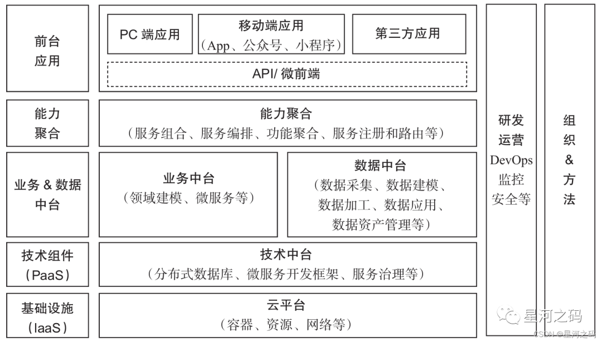

以上架构图从业务、数据、技术，组织四个方向体现了中台提供的能力

- **「业务能力」**

- - 中台领域模型的构建能力
  - 对领域模型的持续演进能力
  - 企业级业务能力的复用，融合和产品化运营能力
  - 速响应市场的商业模式创新能力

- **「数据能力」**

- - 企业级的数据融合能力、数据服务能力
  - 对商业模式创新和企业数字化运营的支撑能力

- **「技术能力」**

- - 对设备、网络等基础资源的自动化运维和管理能力
  - 对微服务等分布式技术架构体系化的设计、开发和架构演进能力

- **「组织能力」**

- - 一体化的研发运营能力和敏捷的中台产品化运营能力
  - 快速建设自适应的组织架构和 中台建设方法体系等方面的能力。

## 业务中台

**「业务中台是具备业务属性并支持多种业务属性的共性能力集合，以实现企业级业务能力的复用，提升业务快速响应能力为目标。」**

- 从广义上来说，**「一切的中台都是业务中台，它们源自业务并服务于业务。」**
- 具像的描述，**「业务中台一般指在线业务为典型特征的中台。」**

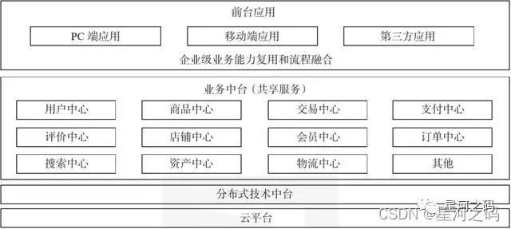

- 业务中台的应用场景

- - 业务中台适用于涉及领域比较多，需求变化快，业务逻辑复杂的场景。
  - 业务中台的建设就是面向众多的业务系统，提取出它们共有业务系统的集合进行重复利用，减少用户中心、订单中心、售后服务中心等通用系统的重复开发，帮助业务系统实现快速的开发，满足业务查询等业务需求。

## **数据中台**

数据中台：实现数据的分层与水平解耦，沉淀公共的数据能力：

- 主要作用就是**「提取各个业务的数据，统一标准和口径，通过数据计算和加工为用户提供数据服务。其核心就是构建一个共享数据服务体系」**。
- 企业级的数据中台一般包含**「数据模型存储、数据资产管理、对外提供数据服务、数据更深层次的分析挖掘等各方面过程」**。

数据中台支撑着前台应用，细分之下有采集，计算，运营等主要作用：

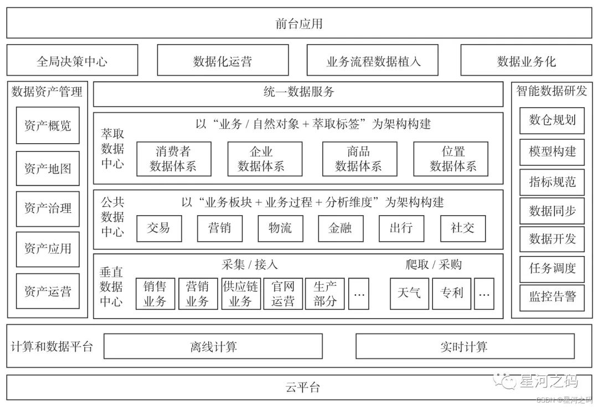

通过上面这张业务架构图，在数据中台建设中我们应该关注三个方向：**「数据模型、数据服务与数据开发」**

- **「数据模型」**

  通过数据建模构建企业级数据标准指标体系，解决数据来源多元化和标准不统一的问题，实现跨域数据整合和沉淀。

- **「数据服务」**

  通过数据服务实现对于数据的封装和开放，快速、灵活满足前台应用的要求，构建支持前台一线业务的数据中台。

- **「数据开发」**

  通过数据服务实现对于数据的封装和开放，快速、灵活满足前台应用的要求，构建支持前台一线业务的数据中台。

**「总结」**：数据中台支撑着前台应用，解决数据开发和应用开发不同步的问题，通过构建一个统一的数据体系，将其转化为数据开发的能力，实现数据服务的可重用性。

## **技术中台**

**「技术中台是业务中台建设的基础，业务中台的落地需要有很多的技术组件支撑，这些不同领域的技术组件组成了技术中台」**。而业务中台一般业务量，访问量都会很庞大，**「为了以保障系统高可用性，有效应对高频海量业务访问场景，业务中台大多采用微服务架构」**。所以技术中台一般都是微服务相关的技术组件。

技术中台架构图：

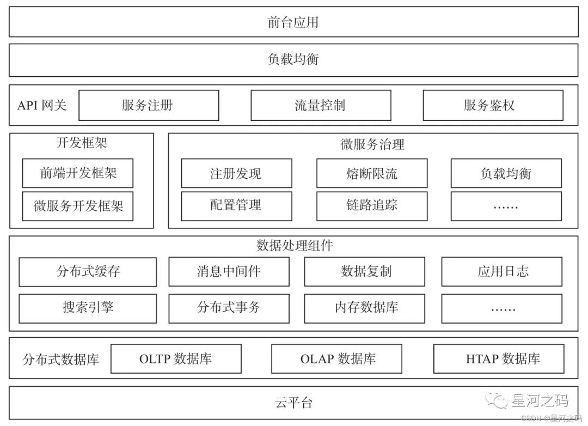

以上架构图主要呈现了技术中台的组成：

- **「API 网关」**

  **「主要包括鉴权、降级限流、流量分析、负载均衡、服务路由和访问日志等功能」**

- - 微服务架构一般采用前后端分离设计，前后端独立开发、独立部署，通过网关实现前后端集成。
  - **「【前台应用】接入中台微服务的技术组件一般是API网关」**。API网关可以帮助用户，方便地管理微服务API接口，实现安全的前后端分离，实现高效的系统集成和精细的服务监控。

- **「开发框架」**

- - 前端开发框架：Vue、React
  - 微服务开发框架：SpringCloud

- **「微服务治理」**

  **「微服务治理主要应用于微服务运行状态监控、运行异常时的治理策略等场景，保障微服务在常见异常场景下的自恢复能力，使其能够持续稳定运行。」**

  微服务治理技术组件：

- - **「服务注册」**
  - **「服务发现」**
  - **「服务通信」**
  - **「配置中心」**
  - **「服务熔断」**
  - **「服务容错」**
  - **「微服务监控」**

- **「分布式数据库」**

  **「分布式数据库具有较强的数据线性扩展能力，采用数据多副本机制实现数据库高可用」**。分布式数据库包括三类：

- - **「交易型分布式数据库」**

    用于解决交易型业务的数据库计算能力，支持数据分库、分片、数据多副本，具有高可用的特性，提供统一的运维界面，具备高性能的交易型业务数据处理能力。

    > 主要应用于具有跨区域部署和高可用需求，需支持高并发和高频访问的核心交易类业务场景。

  - **「分析型分布式数据库」**

    通过横向扩展能力和并行计算能力，提升数据整体计算能力和吞吐量，支持海量数据的分析。

    > 主要应用于大规模结构化数据的统计分析、高性能交互式分析等场景，如数据仓库、数据集市等。

  - **「交易分析混合型分布式数据库」**

    通过资源隔离、分时和数据多副本等技术手段，基于不同的数据存储、访问性能和容量等需求，使用不同的存储介质和分布式计算引擎，同时满足业务交易和分析需求。

    > 主要应用于数据规模大和访问并发量大，需要解决交易型数据同步到分析型数据库时成本高的问题，需要解决数据库入口统一的问题，需要支持高可用和高扩展性等数据处理业务场景。

- **「数据处理组件」**

  提高应用性能和业务承载能力，降低微服务的耦合度，技术中台引入了许多基础技术组件。

- - **「分布式缓存」**

    将高频热点数据集分布于多个内存集群节点，以复制、分发、分区和失效相结合的方式进行维护，解决高并发热点数据访问性能问题，降低后台数据库访问压力，提升系统吞吐能力。如：Redis。

  - **「搜索引擎」**

    解决大数据量的快速搜索和分析等问题，提供可扩展和近实时的搜索能力。

  - **「数据复制」**

    实现不同数据库间或跨数据中心间的数据同步。主要应用于基于表或库的业务数据迁移、业务数据向数据仓库复制等数据迁移场景。

    > 数据复制技术组件大多采用数据库日志捕获和解析技术

  - **「消息中间件」**

    适用于**「数据最终一致性」**的业务场景，通过削峰填谷的设计提高业务吞吐量和承载能力。通过【高内聚，松耦合】的设计原则实现微服务之间的解耦。如：Kafka，rabbitMq，rocketmq

  - **「分布式事务」**

    解决**「分布式架构下事务一致性」**的问题，基于分布式事务模型，保证跨数据库或跨微服务调用场景下的数据一致性。**「分布式事务是实时保证数据的一致性的，会导致系统性能下降」**，所以一般优先采用基于消息中间件实现最终数据一致性机制，尽量避免使用分布式事务。

## **研发运营**

- **「研发运营一体化（DevOps)」**

  通过组织协同、流程优化和工具平台三者结合，基于整个研发运营团队进行组织协作优化，将软件需求、开发、测试、部署、运维、和运营相关流程统一起来，实现项目管理、开发测试、持续交付和应用运营的无缝集成，快速交付高质量的软件和服务。

- **「全链路监控」**

- - **「应用日志监控」**

    通过日志采集、集中存储、实时检索、统计分析等，利用计算引擎对日志数据处理，快速定位问题。

  - **「服务链路通用监控」**

    用于跨服务之间的调用链路监控，通过捕获调用链路上每次服务调用的性能指标，分析应用的整体局部性能，达到快速定位到性能瓶颈点，缩短问题排查时间的目的。

  - **「基础资源监控」**

    以服务器、网络设备等基础资源为中心的监控方式，建立基础层运维的专业技术体系，提高运营效率，保障设施的高可用，为系统扩容、规划等提供权威的数据支持。

## **云中台**

云平台一般会有云服务，云运营和云运维三个基本管理能力

- **「云服务」**

- - IaaS 层基础资源云服务化是将计算、存储、网络等IaaS层基础资源完成云服务化，实现基础资源的统一管理、快速扩容、统一调度和自动分配。
  - PaaS 层技术组件云服务化是基于K8S、容器等云原生技术，将数据库、微服务等PaaS层技术组件完成云服务化。
  - SaaS 层基于应用软件将应用组件通过网页或者接口的形式完成服务化。

- **「云运营」**

  提供租户管理、服务目录管理、流量管理和计量计费等运营所需的云平台日常管理能力。

- **「云运维」**

  提供云平台日常运维的各种能力，包括服务水平管理、容量管理、权限管理、日志管理、监控告警和报表分析等。

# 基于DDD的微服务设计

## **微服务拆分和设计的困境**

微服务的特点就是一个【微】字，它可以**「提高系统的扩展性、弹性伸缩能力、小规模团队的敏捷开发」**。但是由此也衍生出一系列的问题：

- 微服务的粒度应该多大？
- 微服务应该如何拆分和设计？
- 微服务的边界应该在哪里？

产生这些问题的根本原因：**「不知道业务或者微服务的边界在什么地方。\**「这些问题如果没有在前期做好设计，后期就会」\**导致微服务拆分过度，项目复杂度过高，甚至无法上线和运维」**。

基于此：基于DDD的微服务设计就很有必要了，**「DDD 核心思想就是通过领域驱动设计得方法论定义领域模型，确定业务和应用边界，保证业务模型与代码模型的一致性。」**

## **DDD为什么适合微服务**

DDD的设计理念恰好弥补了微服务拆分和设计的困境，**「通过战略设计和战术设计分离技术实现的复杂性，围绕业务构建领域模型划定边界。通过边界划分将复杂业务领域简单化，设计出清晰的领域和应用边界，实现服务的内部高内聚，外部低耦合，可持续演进的微服务架构。」**

- **「战略设计」**

  **「从业务视角出发，划分业务的领域边界，建立通用语言和限界上下文（业务边界：微服务拆分和设计的边界），构建领域模型。」**

- - 实现领域边界划分的重要方法是【**「事件风暴」**】

    | 步骤     | 说明                                                         |
    | -------- | ------------------------------------------------------------ |
    | 事件风暴 | 是一个发散到收敛的过程、常用方法有：用例分析，场景分析，用户旅程分析；  会进行业务领域的分解，并梳理领域对象之间的关系； 会产生很多的实体，命令，事件； 最后将这些领域对象按照不同的维度进行聚类，聚合，限界上下文边界，建立领域模型； |

- **「构建领域模型和划分微服务的边界」**

- - 在事件风暴中根据业务场景分析，梳理用户操作、领域事件以及外部依赖等，分析业务对象产生的操作或行为等实体**「梳理出领域对象」**

  - 根据业务实体之间的业务关联性，**「确定聚合根、值对象和实体。将业务紧密相关的，相互依赖的实体组合形成聚合。」**

    > 聚合是第一层边界，属于同一个微服务中。

  - 根据业务语义环境及上下文边界等，将一个或者多个聚合划定在一个限界上下文内，构建领域模型。

    > 限界上下文是第二层边界，属于微服务的物理边界。

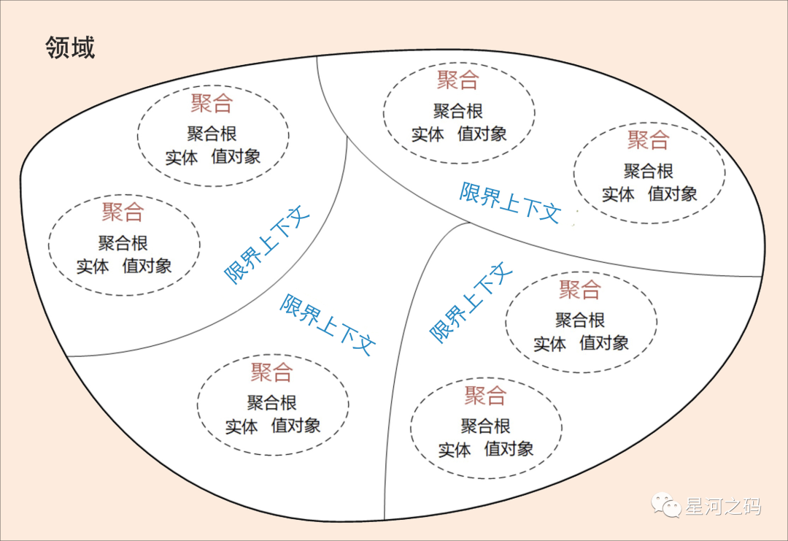

- **「战术设计」**

- - **「从技术视角出发，按照领域模型完成微服务的技术落地。」**

  - **「在战术设计中会将【聚合、聚合根、实体、值对象、领域服务、领域事件、应用服务和仓储】等领域对象映射到微服务的实际代码落地中，完成微服务设计和系统落地。」**

    领域模型中的领域对象跟代码模型中的对象对应，将业务架构和系统架构进行绑定，当业务架构和领域模型调整的时候，系统架构也会随之调整；

- **「微服务和DDD之间的映射」**

<table>
    <tr>
        <th></th><th>DDD</th><th>微服务</th>
    </tr>
    <tr>
        <td>本质</td><td>架构设计方法论</td><td>架构风格</td>
    </tr>
    <tr>
        <td>关注点</td><td>业务领域视角划分领域边界，构建通用语言进行高效沟通，通过业务抽象出领域模型，维持业务和代码的逻辑一致性</td><td>运行时的进程间通信，容错，故障隔离，实现去中心化的数据管理，去中心化的服务治理，关注的是微服的独立的开发，测试，构建，部署</td>
    </tr>
    <tr>
        <td>共同目标1</td><td colspan="2">追求高响应力，从业务视角分离应用系统建设复杂度的手段</td>
    </tr>
      <tr>
        <td>共同目标2</td><td colspan="2">强调从业务出发，合理划分领域边界，持续调整现有架构，优化现有的代码，保持架构和代码的生命力，即演进式架构</td>
    </tr>
</table>

# 微服务拆分和设计原则

## **微服务的演进策略**

**「由单体应用到微服务应用的演进过程中，服务的拆分是微服务建设的基础，一般基于不同的业务进行拆分。但是业务往往与数据有较大耦合性，所以进行业务拆分接需要将【业务和数据】两大维度结合起来对服务拆分。」**

- 业务体现在各种功能代码中，通过确定业务的边界，使用领域模型与界限上下文、领域事件等技术手段实现拆分。

- 数据的拆分则体现在如何将集中式的中心化数据转变为各个微服务各自拥有的独立数据。

  > **「业务和数据两个维度的拆分没有先后，但是因为在数据库中，可能存在各种跨表连接查询、跨库连接查询以及不同业务模块的代码与数据耦合的场景，所以导致数据层面拆分服务变的非常的困难。因此更多的是数据库先行。数据模型能否彻底分开，很大程度上决定了微服务的边界功能是否彻底划清。」**

总结：服务拆分有【业务和数据】两大维度，**「实现的方法根据系统自身的特点和运行状态，分为绞杀者与修缮者两种模式。」**

### 绞杀者策略（Strangler Pattern）

绞杀者模式由Martin Fowler提出，**「指在原有系统外围将【新功能】用【新的方式】构建为【新的服务】，逐步剥离原有系统的业务能力，用微服务逐步替代原有系统的策略」**。不修直接改原有系统，两者通过服务或异步化的数据进行业务关联，逐步实现对老系统替换。

- **「应用场景」**

  绞杀者策略，随着时间的推移，新的服务就会逐渐【绞杀】老的系统。**「对于规模很大而又难以对现有架构进行修改的原有系统」**，推荐采用绞杀者模式。

  > 之前做的一个系统重构就是使用的绞杀者模式推进整个重构的进程。

- **「绞杀者模式演进示意图」**

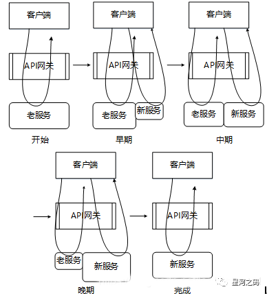

通过示意图，可以看到随着功能演进和时间的推移，老的遗留系统功能逐步被微服务所替代，最终完成从量变到质变，完全下线旧服务。

- **「绞杀者模式实施原则」**

  **「任何新功能都要在完整微服务架构中开发」**，分为两种：

- - **「完全独立的新功能」**：独立在新服务中开发。
  - **「原始业务变更」**：对于涉及到原始业务变更，需要我们通过【**「在新服务中对整体业务进行重构」**】来实现。

- 

### 修缮者模式（Repairer Pattern）

在现有系统的基础上，剥离影响整体业务的部分功能对其进行单独重构，独立为微服务。**「是一种维持原有系统整体能力不变，通过优化局部以提升系统整体能力的策略。」**

- **「应用场景」**

  修缮者模式更多的是体现在重构技术上，在重构的同时保障原有功能的正常，新功能的逐步迭代。

- **「修缮者模式演进示意图」**

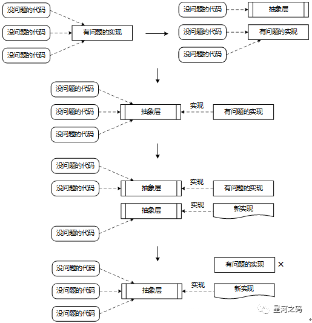

- 通过示意图，可以将修缮者模式的实现分为三个过程：

- - **「抽象层提取」**

    增加依赖抽象层，识别原有功能，对其进行改造，实现该抽象层。

  - **「抽象层实现」**

    采用微服务方式为抽象层提供新的实现。

  - **「抽象层替换」**

    **「通过抽象层使用新的实现对原有实现进行逐步替换」**，从而完成新老实现方式之间的替换。

### 另起炉灶模式

这个方式就简单粗暴，**「将原有的系统推到重做，也就是系统重构，建设微服务。」**

在此期间，原有单体系统照常运行，一般会停止接受和开发新需求。而新系统则按照原有系统的功能域，重构领域模型，开发新的微服务，完成数据迁移，新旧系统切换。

## 不同场景下的微服务建设策略

微服务建设策略一般分为新建系统、单体遗留系统两种方式，需要我们按照实际情况进行取舍。

### 新建系统

新建微服务系统需要根据实际业务的大小划分：简单领域建模，复杂领域建模

- **「简单领域建模」**

  **「当前问题域就是一个子域，通过事件风暴进行业务场景分析，建立领域模型，完成微服务设计。」**

- **「复杂领域建模」**

  当前问题域是个复杂的领域时，需要对其进行拆分成各个子域。通过子域建立领域模型，完成微服务的设计和拆分

### 单体遗留系统

无论是系统重构，还是新系统的建设，如果涉及到原始遗留系统，我们就要考虑在迁移过程中新旧系统的平缓过渡、数据迁移等诸多问题，总的来说分为应用与数据两部分

- **「应用」**

  应用有分为**「保留」**原有单体应用和**「不保留」**原有单体应用两个方向

- - **「当业务领域小」**，不必分解子域时，可直接采用事件风暴构建领域模型。
  - **「当业务领域大」**，将业务领域进行子域分解。通过事件风暴完成领域建，使用绞杀者策略完成新旧系统的迁移
  - **「保留」**原有单体应用，使用修缮者策略将部分特定功能独立为子域
  - **「不保留」**原有单体应用

- **「数据」**

  当我们建设新系统的时候，不可避免的需要考虑数据的迁移问题，而数据迁移就需要考虑新旧系统**「数据模型的兼容性」**，往往这是很难达到统一的，因此可以借鉴CQRS的设计思想， 不做数据迁移

- - 新服务只负责业务逻辑处理和业务数据变更，存储自身产生的业务数据。
  - 基于CQRS的读写分离思想建立CQRS查询库，存储查询全量业务数据，并基于查询库构建**「查询微服务」**。
  - 新服务完成业务逻辑处理后，先写本地数据库，然后通过领域事件驱动机制将数据复制到CQRS查询库。

## 微服务设计原则

### AKF拆分原则

在《架构即未来》书中有介绍的**「可扩展架构的方法论【AKF扩展立方体（Scalability Cube）】，它是一种可扩展模型，每个轴线描述扩展性的一个维度。」**

- **「X轴」**

  **「水平复制」**：代表无差别的克隆服务和数据，工作可以很均匀的分散在不同的服务实例上

- **「Y轴」**

  **「数据分区」**：关注应用中职责的划分，比如数据类型，交易执行类型的划分

- **「Z轴」**

  **「业务拆分」**：关注服务和数据的优先级划分，如分地域划分。

**「理论上按照XYZ三个扩展维度，可以将一个单体系统进行无限扩展。」**

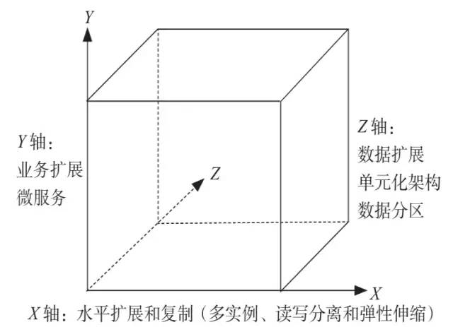

### 前后端分离原则

前后端分离并不陌生，**「前端和后端的代码在技术上和物理上的分离」**，分别单独开发、运维、部署。使得前后端交互界面更加清晰，容易维护。后端服务采用统一的数据和模型支撑多个前端客户端。

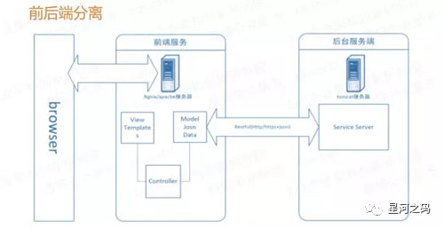

### 无状态服务原则

- **「状态」**

  当某个数据需要被多个服务共享，以此完成一个操作，则这个数据称为状态。而**「依赖这个状态数据的服务被称为有状态服务，反之称为无状态服务。」**

- **「无状态服务原则」**

  **「把有状态的业务服务改变为无状态的计算类服务，则状态数据也就迁移到对应的有状态数据服务中。」**

  通俗的讲就是将有状态的数据集中缓存

  > 例如：我们在本地内存中建立的数据缓存、Session缓存，而在微服务架构中就应该把这些数据迁移到分布式缓存中存储，让业务服务变成一个无状态的计算节点。以此达到动态伸缩，在运行时动态增删节点的目的，不需要考虑缓存数据如何同步的问题。

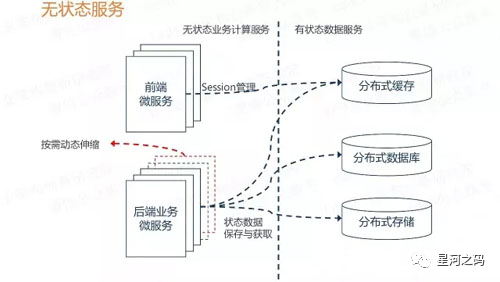

### 无状态通信原则

**「每次通信都是独立的，不存在共用的数据（状态），不相互依赖某一数据。」**

无状态通信的最佳实践就是**「RESTful通信风格」**，RESTful具有如下优势：

- 天生适合无状态的HTTP协议，具有很强的扩展能力（HTTPS）。
- JSON报文序列化，轻量简单，人机均可读，学习成本低，对搜索引擎友好。
- RESTful具有语言无关性，各大热门语言都有成熟的API框架。

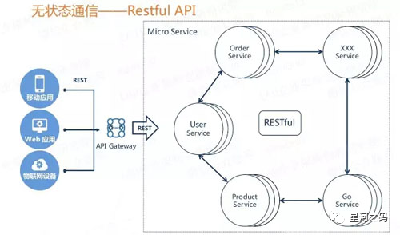

## 分布式架构的关键设计

- **「选择什么样的分布式数据库」**

  分布式数据库的选择一般分为三类：

- - 原生分布式数据库方案，支持数据多副本，高可用，多采用Paxos协议。
  - 集中式数据库+数据库中间件方案 如MyCat+ MySQL
  - 集中式数据库+分库类库方案，分库类库是一个jar 包，与应用软件部署在一起。如ShardingSphere.

- **「如何设计数据库分库主键」**

- **「数据库的数据同步和复制」**

  一般采用数据库日志捕获技术（CDC)

- **「跨库关联查询如何处理」**

- **「如何处理高频热点数据」**

  加载到Redis ，ES等搜素引擎

- **「数据中台与企业级数据集成」**

- - 第一：按照统一数据标准，完成不同微服务和渠道业务数据的汇集和存储，解决数据孤岛和初级数据共享的问题。
  - 第二：建立主题数据模型，按照不同主题和场景对数据进行加工处理，建立面向不同主题的数据视图。
  - 第三：建立业务需求驱动的数据体系，支持业务和商业模式创新。

- **「BFF与企业级业务编排和协同」**

  BFF的主要职责是处理微服务之间的服务组合和编排，将可复用的服务往下沉淀。避免跨中心的服务调用。

- **「分布式事务」**

  分布式事务或者事件驱动机制实现

- **「多中心多活设计」**

- - 【选择合适的分布式数据库】

    多数据中心部署，满足数据多副本以及数据底层复制和同步的要求。

  - 【单元化架构设计】

    将业务单元集合部署的基本单位，所有业务流程都可在本单元集合内完成。任何单元故障不影响其他同类单元的正常运行，尽量避免跨数据中心和跨单元的调用。

  - 【访问路由】

    授权认证业务单元

  - 【全局配置数据管理】。

    统一管理各数据中心全局配置数据，所有数据中心全局配置数据可实现实时同步。保证所有数据中心配置数据一致性，可以一键切换。

# 中台、微服务与DDD的关系

## 中台、微服务与DDD的本质

- 中台的本质：提炼各个业务板块的共同需求，进行业务和系统抽象，形成通用的业务模型。
- 微服务的本质：**「是可以独立的部署、运行、升级，承载某一个维度的业务的基础架构。」**
- DDD的本质：通过统一语言、业务抽象、领域划分和领域建模等一系列手段来控制软件复杂度的方法论。

**「中台是抽象出来的业务模型，微服务是业务模型的系统实现，DDD 作为方法论可以同时指导中台业务建模和微服务建设，三者相辅相成。」**

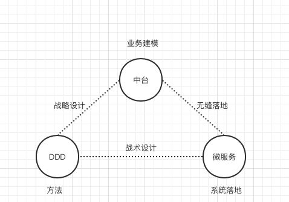

## DDD、中台和微服务的协作

DDD、中台以及微服务虽然属于不同层面的东西，但可以将它们进行分解对照，以此理解它们之间的关系：

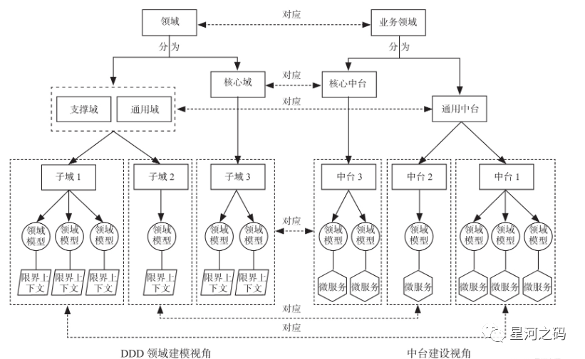

在将企业级业务作为一个领域进行领域细分时，也可以从不同视角来划分：

- **「DDD 视角」**

  整个业务的问题域可以划分为不同的子域，**「子域又可分为核心域、通用域和支撑域。」**

- **「中台视角」**

  **「业务域细分后的业务中台，可分为核心中台和通用中台」**。通用中台对应 DDD 的通用域和支撑域，核心中台对应 DDD 的核心域。

- **「微服务视角」**

  **「领域模型所在的限界上下文对应微服务」**，一个微服务由一个或多个限界上下文组成。

## 中台业务建模怎么实现

通过DDD建设中台总的来说沉淀为两步：

- **「战略设计」**：业务抽象实现中台业务建模的过程
- **「战术设计」**：系统抽象搭建微服务的建设过程

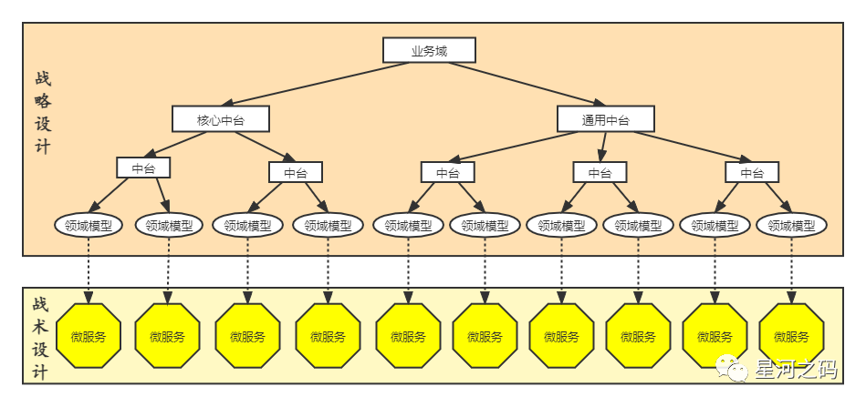

而在**「具体实施过程」**中可以分为五步

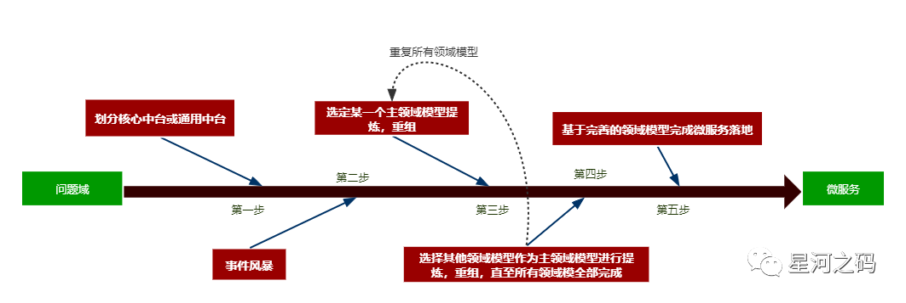

- **「第一步」**

  根据问题域的业务划分中台，并以企业能力规划确定核心中台或通用中台。**「核心中台要考虑企业核心竞争力，通用中台要考虑企业级的共享和复用能力。」**

- **「第二步」**

  **「根据中台所在的业务领域，运用事件风暴，确定实体、聚合和限界上下文，建立领域模型。」**

- **「第三步」**

  将【**「当前」**】领域（中台）作为主领域模型，并以此为基础，针对不同领域的中台，将重复或需要重组的领域对象、功能，提炼至主领域模型，使得主领域模型更加丰满，达到**「高内聚」**的设计思想，完成领域模型设计。

- **「第四步」**

  将【**「其他」**】领域（中台）作为主领域模型，重复第三步，直至所有领域模型完成领域对象、功能的提炼，完善领域模型的建设。

- **「第五步」**

  将完善后的各个领域模型作为微服务设计的基础，完成微服务的拆分和设计，完成微服务落地

## 案例

根据以上的流程下来，中台的基本map就可以建设出来，以我所在的保险行业为案例作为分析对象，保险域是一个大域，属于企业级。**「按照DDD的战略设计，可以将保险域划分为【承保，核保，客户，用户，产品】等几个子域」**，而在保险企业中，

- 【承保，核保】关乎企业受益，显然是核心业务，属于核心域。
- 【客户，用户，产品】作为核心域的支撑，并具有企业级的单一特性，属于通用域。

基于此，我们可以画出保险域的中台建设基本的架构图，并**「以此按照DDD的战术设计落地保险域的中台建设与微服务落地」**：

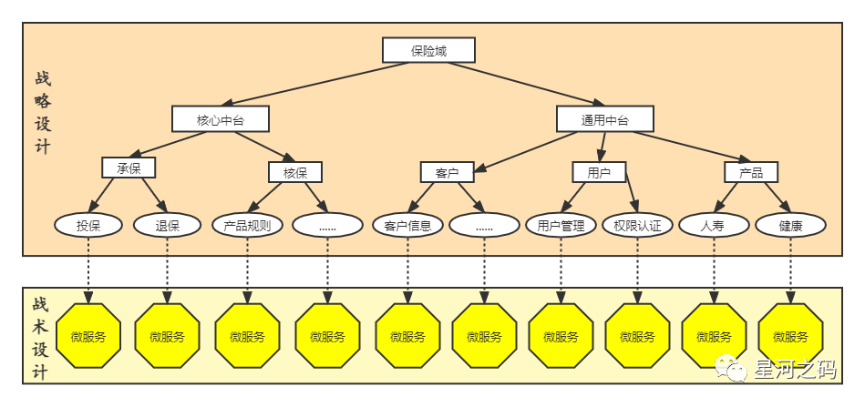

###### 来源：

https://www.modb.pro/db/388536

https://www.modb.pro/db/388535

https://www.modb.pro/db/388534

https://www.modb.pro/db/388533

https://www.modb.pro/db/388532
