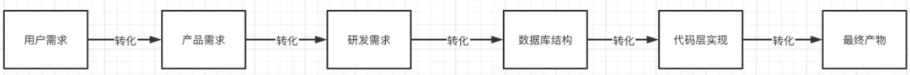
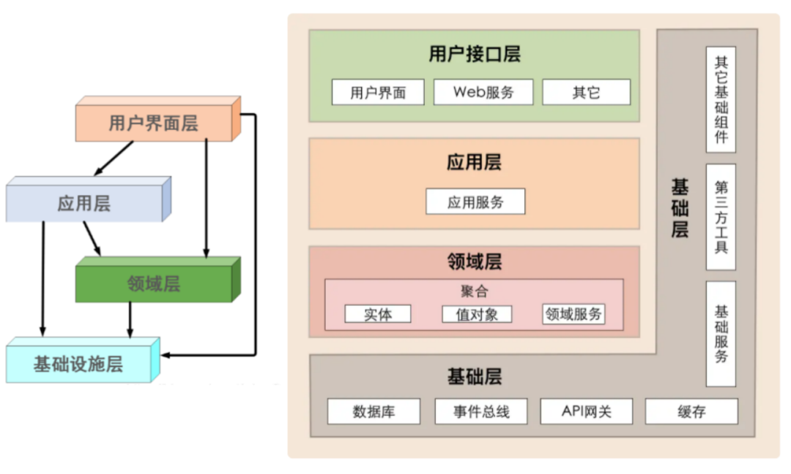
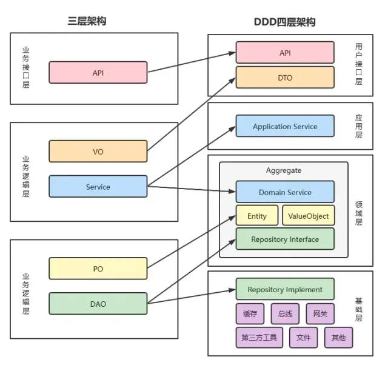
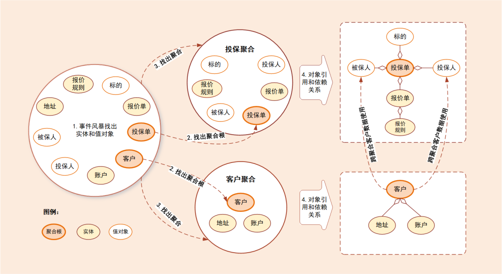

# DDD领域驱动设计

## 为什么要用 DDD

- 面向对象设计，数据行为绑定，告别贫血模型
- 降低复杂度，分而治之
- 优先考虑领域模型，而不是切割数据和行为
- 准确传达业务规则，业务优先
- 代码即设计
- 它通过边界划分将复杂业务领域简单化，帮我们设计出清晰的领域和应用边界，可以很容易地实现业务和技术统一的架构演进
- 领域知识共享，提升协助效率
- 增加可维护性和可读性，延长软件生命周期
- 中台化的基石

<!-- more -->

## DDD 作用

说到 DDD，绕不开 MVC，在 MVC 三层架构中，我们进行功能开发的之前，拿到需求，解读需求。

往往最先做的一步就是先设计表结构，在逐层设计上层 dao，service，controller。对于产品或者用户的需求都做了一层自我理解的转化。

用户需求在被提出之后经过这么多层的转化后，特别是研发需求在数据库结构这一层转化后，将业务以主观臆断行为进行了转化。

一旦业务边界划分模糊，考虑不全，大量的逻辑补充堆积到了代码层实现，变得越来越难维护。

假如我们现在要做一个电商订单下单的需求，涉及到用户选定商品，下订单、支付订单、对用户下单时的订单发货。

**MVC 架构：**我们常见的做法是在分析好业务需求之后，就开始设计表结构了，订单表，支付表，商品表等等。然后编写业务逻辑。

这是第一个版本的需求，功能迭代饿了，订单支付后我可以取消，下单的商品我们退换货，是不是又需要进行加表，紧跟着对于的实现逻辑也进行修改。功能不断迭代，代码就不断的层层往上叠。

**DDD 架构：**我们先进行划分业务边界。这里面核心是订单。那么订单就是这个业务领域里面的聚合逻辑体现。支付，商品信息，地址等等都是围绕着订单实体。

订单本身的属性决定之后，类似于地址只是一个属性的体现。当你将订单的领域模型构建好之后，后续的逻辑边界与仓储设计也就随之而来了。

### 从 DDD 的角度看 MVC 架构的问题

代码角度：

- 瘦实体模型：只起到数据类的作用，业务逻辑散落到 service，可维护性越来越差
- 面向数据库表编程，而非模型编程
- 实体类之间的关系是复杂的网状结构，成为大泥球，牵一发而动全身，导致不敢轻易改代码
- service 类承接的所有的业务逻辑，越来越臃肿，很容易出现几千行的 service 类
- 对外接口直接暴露实体模型，导致不必要开放内部逻辑对外暴露，就算有 DTO 类一般也是实体类的直接 copy
- 外部依赖层直接从 service 层调用，字段转换、异常处理大量充斥在 service 方法中

项目管理角度：

- **交付效率：**越来越低。
- **稳定性差：**不好测试，代码改动的影响范围不好预估。
- **理解成本高：**新成员介入成本高，长期会导致模块只有一个人最熟悉，离职成本很大。

### DDD 整体作用总结：

- 消除信息不对称
- 常规MVC三层架构中自底向上的设计方式做一个反转，以业务为主导，自顶向下的进行业务领域划分
- 将大的业务需求进行拆分，分而治之

## DDD基本概念

- 统一语言
- 限界上下文
- 领域、子域、支撑域
- 聚合、实体、值对象
- 分层：用户接口层、应用层、领域层、基础层

## DDD 分层架构

- **严格分层架构：**某层只能与直接位于的下层发生耦合。
- **松散分层架构：**允许上层与任意下层发生耦合。

在领域驱动设计（DDD）中采用的是松散分层架构，层间关系不那么严格。每层都可能使用它下面所有层的服务，而不仅仅是下一层的服务。

每层都可能是半透明的，这意味着有些服务只对上一层可见，而有些服务对上面的所有层都可见。

分层的作用，从上往下：

- **用户交互层：**web 请求，rpc 请求，mq 消息等外部输入均被视为外部输入的请求，可能修改到内部的业务数据。
- **业务应用层：**与 MVC 中的 service 不同的不是，service 中存储着大量业务逻辑。但在应用服务的实现中，它负责编排、转发、校验等。
- **领域层：**或称为模型层，系统的核心，负责表达业务概念，业务状态信息以及业务规则。即包含了该领域所有复杂的业务知识抽象和规则定义。该层主要精力要放在领域对象分析上，可以从实体，值对象，聚合（聚合根），领域服务，领域事件，仓储，工厂等方面入手。
- **基础设施层：**主要有 2 方面内容，一是为领域模型提供持久化机制，当软件需要持久化能力时候才需要进行规划；一是对其他层提供通用的技术支持能力，如消息通信，通用工具，配置等的实现。

在设计和开发时，不要将本该放在领域层的业务逻辑放到应用层中实现，因为庞大的应用层会使领域模型失焦，时间一长你的服务就会演化为传统的三层架构，业务逻辑会变得混乱。

### MVC 架构到 DDD 分层架构的映射

### 各层数据转换

每一层都有自己特定的数据，可以做如下区分：

- **VO（View Object）：**视图对象，主要对应界面显示的数据对象。对于一个 WEB 页面，或者 SWT、SWING 的一个界面，用一个 VO 对象对应整个界面的值。
- **DTO（Data Transfer Object）：**数据传输对象，主要用于远程调用等需要大量传输对象的地方。比如我们一张表有 100 个字段，那么对应的 PO 就有 100 个属性。但是我们界面上只要显示 10 个字段，客户端用 WEB service 来获取数据，没有必要把整个 PO 对象传递到客户端，这时我们就可以用只有这 10 个属性的 DTO 来传递结果到客户端，这样也不会暴露服务端表结构。到达客户端以后，如果用这个对象来对应界面显示，那此时它的身份就转为 VO。在这里，我泛指用于展示层与服务层之间的数据传输对象。
- **DO（Domain Object）：**领域对象，就是从现实世界中抽象出来的有形或无形的业务实体。
- **PO（Persistent Object）：**持久化对象，它跟持久层（通常是关系型数据库）的数据结构形成一一对应的映射关系，如果持久层是关系型数据库，那么，数据表中的每个字段（或若干个）就对应 PO 的一个（或若干个）属性。最形象的理解就是一个 PO 就是数据库中的一条记录，好处是可以把一条记录作为一个对象处理，可以方便的转为其它对象。

### DDD 基础

学习 DDD 前，有很多基础概念需要掌握，这幅图总结的很全，他把 DDD 划分不同的层级：

- 最里层是值、属性、唯一标识等，这个是最基本的数据单位，但不能直接使用。
- 然后是实体，这个把基础的数据进行封装，可以直接使用，在代码中就是封装好的一个个实体对象。
- 之后就是领域层，它按照业务划分为不同的领域，比如订单领域、商品领域、支付领域等。
- 最后是应用服务，它对业务逻辑进行编排，也可以理解为业务层。

#### 领域和子域

领域（domain）是个模块，包含以下组成部分，传统的 service 按功能可能拆分到任何一个地方，各司其职：

- 1 个聚合
- 1 到多个实体
- 若干值对象
- 多个 DomainService
- 1 个 Factory：新建聚合
- 1 个 Repository：聚合仓储服务

在研究和解决业务问题时，DDD 会按照一定的规则将业务领域进行细分，当领域细分到一定的程度后，DDD 会将问题范围限定在特定的边界内，在这个边界内建立领域模型，进而用代码实现该领域模型，解决相应的业务问题。

简言之，DDD 的领域就是这个边界内要解决的业务问题域。

领域可以进一步划分为子领域。我们把划分出来的多个子领域称为子域，每个子域对应一个更小的问题域或更小的业务范围。

领域的核心思想就是将问题域逐级细分，来降低业务理解和系统实现的复杂度。通过领域细分，逐步缩小服务需要解决的问题域，构建合适的领域模型。

举个简单的例子，对于保险领域，我们可以把保险细分为承保、收付、再保以及理赔等子域，而承保子域还可以继续细分为投保、保全（寿险）、批改（财险）等子子域。

#### 核心域、通用域和支撑域

子域可以根据重要程度和功能属性划分为如下：

- **核心域：**决定产品和公司核心竞争力的子域，它是业务成功的主要因素和公司的核心竞争力。
- **通用域：**没有太多个性化的诉求，同时被多个子域使用的通用功能的子域。
- **支撑域：**但既不包含决定产品和公司核心竞争力的功能，也不包含通用功能的子域。

核心域、支撑域和通用域的主要目标：通过领域划分，区分不同子域在公司内的不同功能属性和重要性，从而公司可对不同子域采取不同的资源投入和建设策略，其关注度也会不一样。

很多公司的业务，表面看上去相似，但商业模式和战略方向是存在很大差异的，因此公司的关注点会不一样，在划分核心域、通用域和支撑域时，其结果也会出现非常大的差异。

比如同样都是电商平台的淘宝、天猫、京东和苏宁易购，他们的商业模式是不同的。淘宝是 C2C 网站，个人卖家对个人买家，而天猫、京东和苏宁易购则是 B2C 网站，是公司卖家对个人买家。

即便是苏宁易购与京东都是 B2C 的模式，苏宁易购是典型的传统线下卖场转型成为电商，京东则是直营加部分平台模式。

因此，在公司建立领域模型时，我们就要结合公司战略重点和商业模式，重点关注核心域。

#### 通用语言和限界上下文

- **通用语言：**就是能够简单、清晰、准确描述业务涵义和规则的语言。
- **限界上下文：**用来封装通用语言和领域对象，提供上下文环境，保证在领域之内的一些术语、业务相关对象等（通用语言）有一个确切的含义，没有二义性。

##### ①通用语言

通用语言是团队统一的语言，不管你在团队中承担什么角色，在同一个领域的软件生命周期里都使用统一的语言进行交流。

那么，通用语言的价值也就很明了，它可以解决交流障碍这个问题，使领域专家和开发人员能够协同合作，从而确保业务需求的正确表达。

这个通用语言到场景落地，大家可能还很模糊，其实就是把领域对象、属性、代码模型对象等，通过代码和文字建立映射关系，可以通过 Excel 记录这个关系。

这样研发可以通过代码知道这个含义，产品或者业务方可以通过文字知道这个含义，沟通起来就不会有歧义，说的简单一点，其实就是统一产品和研发的话术。

##### **②限界上下文**

通用语言也有它的上下文环境，为了避免同样的概念或语义在不同的上下文环境中产生歧义，DDD 在战略设计上提出了“限界上下文”这个概念，用来确定语义所在的领域边界。

限界上下文是一个显式的语义和语境上的边界，领域模型便存在于边界之内。边界内，通用语言中的所有术语和词组都有特定的含义。把限界上下文拆解开看，限界就是领域的边界，而上下文则是语义环境。

通过领域的限界上下文，我们就可以在统一的领域边界内用统一的语言进行交流。

边界体现在以下几方面：

- **领域逻辑层：**确定了领域模型的业务边界，维护了模型的完整性与一致性，从而降低系统的业务复杂度。
- **团队合作层：**限界上下文一般也是用户换分团队的依据。
- **技术实现层：**限界上下文可当成是微服务的划分边界。

#### 实体和值对象

##### ①实体

实体 = 唯一身份标识 + 可变性【状态 + 行为】

DDD 中要求实体是唯一的且可持续变化的。意思是说在实体的生命周期内，无论其如何变化，其仍旧是同一个实体。唯一性由唯一的身份标识来决定的。可变性也正反映了实体本身的状态和行为。

实体以 DO（领域对象）的形式存在，每个实体对象都有唯一的 ID。我们可以对一个实体对象进行多次修改，修改后的数据和原来的数据可能会大不相同。

但是，由于它们拥有相同的 ID，它们依然是同一个实体。比如商品是商品上下文的一个实体，通过唯一的商品 ID 来标识，不管这个商品的数据如何变化，商品的 ID 一直保持不变，它始终是同一个商品。

##### ②值对象

值对象 = 将一个值用对象的方式进行表述，来表达一个具体的固定不变的概念。

当你只关心某个对象的属性时，该对象便可作为一个值对象。我们需要将值对象看成不变对象，不要给它任何身份标识，还应该尽量避免像实体对象一样的复杂性。

还是举个订单的例子，订单是一个实体，里面包含地址，这个地址可以只通过属性嵌入的方式形成的订单实体对象，也可以将地址通过 json 序列化一个 string 类型的数据，存到 DB 的一个字段中，那么这个 Json 串就是一个值对象。

#### 聚合和聚合根

##### ①聚合

聚合：我们把一些关联性极强、生命周期一致的实体、值对象放到一个聚合里。聚合是领域对象的显式分组，旨在支持领域模型的行为和不变性，同时充当一致性和事务性边界。

聚合有一个聚合根和上下文边界，这个边界根据业务单一职责和高内聚原则，定义了聚合内部应该包含哪些实体和值对象，而聚合之间的边界是松耦合的。按照这种方式设计出来的服务很自然就是“高内聚、低耦合”的。

聚合在 DDD 分层架构里属于领域层，领域层包含了多个聚合，共同实现核心业务逻辑。跨多个实体的业务逻辑通过领域服务来实现，跨多个聚合的业务逻辑通过应用服务来实现。

比如有的业务场景需要同一个聚合的 A 和 B 两个实体来共同完成，我们就可以将这段业务逻辑用领域服务来实现；而有的业务逻辑需要聚合 C 和聚合 D 中的两个服务共同完成，这时你就可以用应用服务来组合这两个服务。

##### ②聚合根

如果把聚合比作组织，那聚合根就是这个组织的负责人。

聚合根也称为根实体，它不仅是实体，还是聚合的管理者：聚合可以包含其他实体，其他实体不能脱离聚合而单独提供服务

- 首先它作为实体本身，拥有实体的属性和业务行为，实现自身的业务逻辑。
- 其次它作为聚合的管理者，在聚合内部负责协调实体和值对象按照固定的业务规则协同完成共同的业务逻辑。
- 最后在聚合之间，它还是聚合对外的接口人，以聚合根 ID 关联的方式接受外部任务和请求，在上下文内实现聚合之间的业务协同。也就是说，聚合之间通过聚合根 ID 关联引用，如果需要访问其它聚合的实体，就要先访问聚合根，再导航到聚合内部实体，外部对象不能直接访问聚合内实体。

看图理解

简单概括一下：

- 通过事件风暴（我理解就是头脑风暴，不过我们一般都是先通过个人理解，然后再和相关核心同学进行沟通），得到实体和值对象；
- 将这些实体和值对象聚合为“投保聚合”和“客户聚合”，其中“投保单”和“客户”是两者的聚合根；
- 找出与聚合根“投保单”和“客户”关联的所有紧密依赖的实体和值对象；
- 在聚合内根据聚合根、实体和值对象的依赖关系，画出对象的引用和依赖模型。

#### 领域服务和应用服务

##### ①领域服务

当一些逻辑不属于某个实体时，可以把这些逻辑单独拿出来放到领域服务中，理想的情况是没有领域服务，如果领域服务使用不恰当，慢慢又演化回了以前逻辑都在 service 层的局面。

可以使用领域服务的情况：

- 执行一个显著的业务操作
- 对领域对象进行转换
- 以多个领域对象作为输入参数进行计算，结果产生一个值对象

##### ②应用服务

应用层作为展现层与领域层的桥梁，是用来表达用例和用户故事的主要手段。

应用层通过应用服务接口来暴露系统的全部功能。在应用服务的实现中，它负责编排和转发，它将要实现的功能委托给一个或多个领域对象来实现，它本身只负责处理业务用例的执行顺序以及结果的拼装。通过这样一种方式，它隐藏了领域层的复杂性及其内部实现机制。

应用层相对来说是较“薄”的一层，除了定义应用服务之外，在该层我们可以进行安全认证，权限校验，持久化事务控制，或者向其他系统发生基于事件的消息通知，另外还可以用于创建邮件以发送给客户等。

#### 领域事件

领域事件 = 事件发布 + 事件存储 + 事件分发 + 事件处理

领域事件是一个领域模型中极其重要的部分，用来表示领域中发生的事件。忽略不相关的领域活动，同时明确领域专家要跟踪或希望被通知的事情，或与其他模型对象中的状态更改相关联。

下面简单说明领域事件：

- **事件发布：**构建一个事件，需要唯一标识，然后发布
- **事件存储：**发布事件前需要存储，因为接收后的事建也会存储，可用于重试或对账等
- **事件分发：**服务内直接发布给订阅者，服务外需要借助消息中间件，比如 Kafka，RabbitMQ 等
- **事件处理：**先将事件存储，然后再处理

比如下订单后，给用户增长积分与赠送优惠券的需求。如果使用瀑布流的方式写代码。一个个逻辑调用，那么不同用户，赠送的东西不同，逻辑就会变得又臭又长。

这里的比较好的方式是，用户下订单成功后，发布领域事件，积分聚合与优惠券聚合监听订单发布的领域事件进行处理。

#### 资源库【仓储】

仓储介于领域模型和数据模型之间，主要用于聚合的持久化和检索。它隔离了领域模型和数据模型，以便我们关注于领域模型而不需要考虑如何进行持久化。

我们将暂时不使用的领域对象从内存中持久化存储到磁盘中。当日后需要再次使用这个领域对象时，根据 key 值到数据库查找到这条记录，然后将其恢复成领域对象，应用程序就可以继续使用它了，这就是领域对象持久化存储的设计思想。

## DDD 的不足

DDD 架构作为一套先进的方法论，在很多场景能发挥很大价值，但是 DDD 也不是银弹。高级的架构师把 DDD 架构当成一种工具，结合其他架构经验一起为业务服务。

DDD 的不足有几个方面：

- **性能：**DDD 是基于聚合来组织代码，对于高性能场景下，加载聚合中大量的无用字段会严重影响性能，比如报表场景中，直接写 SQL 会更简单直接。
- **事务：**DDD 中的事务被限定在限界上下文中，跨多个限界上下文的场景需要开发者额外考虑分布式事务问题。
- **难度系数高，推广成本大：**DDD 项目需要领域专家专家，且需要特别熟悉业务、建模、OOP，对于管理者来说评估一个人是否真的能胜任也是一件困难的事情。

## MVC与DDD两者如何选择：

- **MVC：**上来就可以开干，短平快，前期用起来很香，整体开发效率也更高，所以对于紧急，或者不那么重要的项目，我会直接用 MVC 怼，不好的地方就是，后面会越来越复杂，可能最后就是一坨屎山，但是很多时候，比如老板进度催的紧，我哪想到那么多以后呢？
- **DDD：**前期需要花大量时间设计好领域模型，对于一些基础组件，或者一些核心服务，如果对象模型非常复杂，建议采用 DDD，前期可能会稍微痛苦一些，但是后期维护起来会非常方便。

