# Domain-Driver Design

## 软件设计类别

### DL驱动开发

DeadLine驱动开发，给定一个截止日期，只要在这个DL之前完成即可。

> DL驱动开发只追求短期的业务目标，不关注程序设计，缺乏过程管理，程序难以扩展维护。

### 数据驱动设计

针对需求进行数据库表设计，再通过数据流串联对应的业务流程，是最常用的软件设计方式，基本可以应对大多数的应用服务场景。

### DDD领域驱动设计

随着系统越来越庞大，传统的软件设计方式已经不能满足我们应对复杂系统的设计。**而DDD由业务为导向，通过领域建模限定边界，提供了应对大型复杂系统与业务的方法论。**

|      | 方案一 数据模型驱动                                          | 方案二领域模型驱动                                           |
| ---- | ------------------------------------------------------------ | ------------------------------------------------------------ |
| 优点 | 开发成本相对较低，可部分复用原代码 更好的可读性，新人易上手 有成熟的解决方案，可借鉴经验多 | 业务导向，领域模型优先，**边界规范易维持** 核心业务**逻辑内聚**于领域内，易于长期维护 领域模型能更准确的反映业务模型 |
| 缺点 | 数据库优先，贫血模型，不能准确反映业务 面向过程，功能**逻辑易分散** 业务模块问易产生依赖，**边界不易维持** | 前期学习成木高 代码改动量大，开发成本高 新人不易接手 可借鉴经验少 |

<!-- more -->

## 什么是DDD

2004年著名建模专家Eric Evans发表了他最具影响力的书籍：《Domain-Driven Design –Tackling Complexity in the Heart of Software》（中文译名：领域驱动设计—软件核心复杂性应对之道），书中提出了“领域驱动设计（简称 DDD）”的概念。

- **DDD不是一种架构形式，它是一种架构设计的指导思想，是一种应对复杂域问题的方法论。**

  >领域驱动设计事实上是针对OOAD的一个扩展和延伸，DDD基于面向对象分析与设计技术，对技术架构进行了分层规划，同时对每个类进行了策略和类型的划分。

- DDD将一个软件系统的核心业务功能集中在一个核心域里面，其中包含了**实体、值对象、领域服务、资源库和聚合等概念**。在此基础上，DDD提出了一套完整的支撑这样的核心领域的基础设施。

  > 领域模型是领域驱动的核心。采用DDD的设计思想，业务逻辑不再集中在几个大型的类上，而是由大量相对小的领域对象(类)组成，这些类具备自己的状态和行为，每个类是相对完整的独立体，并与现实领域的业务对象映射。

领域模型就是由这样许多的细粒度的类组成。基于领域驱动的设计，保证了系统的可维护性、扩展性和复用性，在处理复杂业务逻辑方面有着先天的优势。

### 中台、微服务与DDD

微服务架构能让系统的开发与运维管理变得简单高效，还能提高系统的可用性。但是微服务也有其不足之处，在微服务拆分时，拆分的粒度总是不好把控，拆分的过细，会导致服务增多，增加维护和运维成本。拆分粒度粗，随着业务的增长，单个服务也会变得臃肿，丧失了微服务的初衷。而DDD则可以有效帮助我们确定服务边界，DDD从业务出发，确定各个领域边界，划定职责。

**DDD 的本质是一种软件设计方法，而微服务架构是具体的实现方式。DDD 强调领域模型和微服务设计的一体性，微服务设计依托于领域模型**。

- **DDD 关注**：从业务视角划分领域边界，构建通用语言，通过业务抽象建立领域模型，维持业务和代码的一致性。
- **微服务关注**：侧重于运行时的进程间通信、容错和故障隔离，实现去中心化数据管理和去中心化服务治理，关注微服务的独立开发、测试、构建和部署。

**总结：中台本质是领域模型，微服务是领域模型的系统落地，DDD 是一种设计思想，它可以同时指导中台领域建模型和微服务设计，即 DDD、中台和微服务的铁三角关系**。

**中台本质上就是通过 DDD 方法从业务领域细分出来的某个子域**

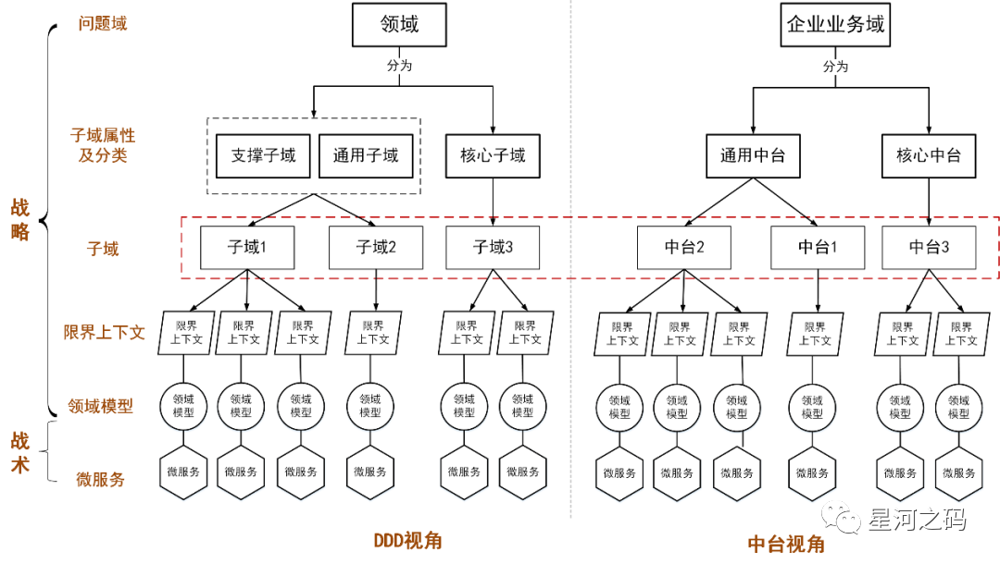

## 适用场景

上DDD理论可以指导所有业务系统的分析设计与开发。但实际上DDD并不适用于所有的系统开发：

- DDD的学习成本巨大，入手门槛高；
- 在DDD过程中引入领域专家梳理通用语言很难，现实中能做到的人很少并且需要耗费大量的时间和精力；
- 需要开发人员从产品出发，从技术思维转为产品思维，从数据模型设计转为业务模型设计；
- 系统构建、架构设计、编码与传统实现差异很大，对于开发人员是一个挑战。

但是单从系统的角度来衡量，如果系统符下几下几点之一：

- 业务复杂：系统越来越大，业务越来越复杂，所有的业务都杂糅在一起，系统庞大不容易维护。
- 需求迭代快：对于核心需求和非核心需求的需求频率都非常大；非核心需求占用了大量资源。
- 系统中涉及到的垂直业务多：不同的业务可以化为不同的领域；

## 特点

领域驱动的核心应用场景就是解决复杂业务的设计问题，其特点与这一核心主题息息相关：

- 分层架构与职责划分：领域驱动设计很好的遵循了关注点分离的原则，提出了成熟、清晰的分层架构。同时对领域对象进行了明确的策略和职责划分，让领域对象和现实世界中的业务形成良好的映射关系，为领域专家与开发人员搭建了沟通的桥梁。
- 复用：在领域驱动设计中，领域对象是核心，每个领域对象都是一个相对完整的内聚的业务对象描述，所以可以形成直接的复用。同时设计过程是基于领域对象而不是基于数据库的Schema，所以整个设计也是可以复用的。

## 为什么要用 DDD

- 统一业务语言：通过使用统一的领域语言，消除了团队间的分歧，提升团队间的沟通效率。
- 沉淀业务知识：通过领域模型沉淀领域知识，提升业务建模能力，清晰表达业务核心语义。
- 清晰业务边界：通过领域模型界定需求实现范围，统一各个子域的边界。
- 提升变化应对：通过领域模型与数据模型分离，将核心与非核心业务隔离，提升架构应变能力。

- DDD可以解决软件复杂度

- - 对于业务量大的系统，可以借助限界上下文进行分而治之
  - 对于结构复杂的系统，可以通过DDD的分层架构进行层之间关注点分离。
  - 对于业务复杂的系统，可以以领域为核心，识别变化，通过高内聚低耦合的设计，来提高程序的扩展性。

- DDD是如何解决复杂度的问题

  DDD通过战略和战术两个方向来解决复杂度的问题。

- - 战略方向：强调以领域为核心，通过限界上下文和分层架构将关注点分离。借助六边形模型、用户故事等方式提炼领域知识，进而形成统一语言。建立领域模型，指导程序设计。
  - 战术方向：引入了实体、值对象、聚合、领域服务、领域事件、工厂、仓储、应用服务等概念，指导我们进行程序设计。

## DDD怎么实现

DDD的实现过程主要分为以下几个步骤：

- 分析业务需求
- 提炼统一语言
- 建立领域模型
- 完成程序设计
- 编码实现

在实现以上步骤时由分为两个阶段：

- **战略设计阶段**

  此阶段属于**业务架构**，通过 DDD 的理论，从业务的角度梳理出相应的限界上下文，通过统一的领域语言从战略层面进行**领域划分以及构建领域模型**。

  战略设计主要包括：

- - **领域/子域**
  - **通用语言**
  - **限界上下文**
  - **架构风格**

- **战术设计阶段**

  此阶段属于**技术架构**，战术设计则将战略设计进行具体化和细节化，以领域模型为战术设计的输入，以限界上下文作为微服务划分的边界进行微服务拆分，在每个微服务中进行领域分层，实现领域模型对于代码的映射，从而实现 DDD 的落地实施。

  战术设计主要包括：

- - **领域模型**（值对象、实体、领域服务、领域事件）
  - **资源库**（从存放资源的位置获取、添加、删除或者修改领域对象）
  - **工厂**(负责领域对象的创建，用于封装复杂或者可能变化的创建逻辑）
  - **聚合**(封装一到多个实体与值对象，表示边界，并维持边界范围之内的业务完整性）
  - **应用服务**
  - **实体**
  - **值对象**

## 领域名词

### 通用语言

在我们程序开发过程中会涉及到两个角色：开发人员与领域专家，角色决定了认知，对于开发人员脑子想都是类，方法，设计模式，算法，继承，封装，多态，如何面向对象等，而领域专家是不懂这些的，在双方沟通过程中就产生误差，最终会导致程序开发的偏差。

**「通用语言就是开发人员和领域专家的沟通桥梁，使得在建立领域模型，两者交换、描述知识范围及领域模型的各个元素的时候能够无障碍沟通。」**

统一语言如何形成，对DDD没有标准的定义，可以是图，也可以是文字，UML类图是常见的表达方式。

战略设计、战术设计和技术实现都是基于统一语言环境下开展的。

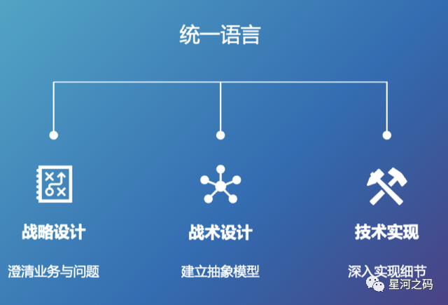

### 领域和子域

#### 领域

在研究和解决业务问题时，DDD 会按照一定的规则 **将业务领域进行细分** ，当领域细分到一定的程度后，**DDD 会将问题范围限定在特定的边界内** ，在这个边界内建立领域模型，进而用代码实现该领域模型，解决相应的业务问题。简言之，**DDD 的领域就是这个边界内要解决的业务问题域** 。

既然领域是用来限定业务边界和范围的，那么就会有大小之分，领域越大，业务范围就越大，反之则相反。

#### 子域

**领域可以进一步划分为子领域。我们把划分出来的多个子领域称为子域** ，每个子域对应一个更小的问题域或更小的业务范围。

**子域可以根据自身重要性和功能属性划分为三类子域** ，它们分别是：核心域、通用域和支撑域。

##### 核心域、通用域和支撑域

- 核心域：决定产品和公司核心竞争力的子域是核心域，它是业务成功的主要因素和公司的核心竞争力。
- 通用域：没有太多个性化的诉求，同时被多个子域使用的通用功能子域是通用域。
- 支撑域：还有一种功能子域是必需的，但既不包含决定产品和公司核心竞争力的功能，也不包含通用功能的子域，它就是支撑域。

###### 为什么要划分核心域、通用域和支撑域，主要目的是什么

**商业模式的不同会导致核心域划分结果的不同** 。有的公司核心域可能在客户服务，有的可能在产品质量，有的可能在物流。在公司领域细分、建立领域模型和系统建设时，我们就要结合公司战略重点和商业模式，找到核心域了，且重点关注核心域。

### 限界上下文

限界上下文（Bounded Context）可以分为**「限界和上下文」**两个词来理解

- **「限界」**：一个界限，具体的某一个范围
- **「上下文」**：特定环境下的语境

**「限界上下文是一个显式的边界，主要用来封装通用语言和领域对象。领域模型存在于这个边界之内。在边界内的通用语言有特定的含义，而模型需要准确地反映通用语言」**

1. 限界上下文定义了每个子域的应用范围，在每个上下文中确保领域模型的一致性。不同的限界上下文中，领域模型可以不用保证一致性。
2. 通常我们根据团队的组织、软件系统的每个部分的用法及物理表现（如组件划分，数据库模式）来设置模型的边界。
3. **「限界上下文根据业务单一职责和高内聚原则，定义了聚合内部应该包含哪些实体和值对象」**

- 限界上下文的命名

  - **「限界上下文只是一个统一的命名，在划分子域后，每个子域一般对应一个上下文，也可以对应多个上下文」**

    > 但如果子域对应多个上下文的时候，就要考虑一下是不是子域能否继续划分。

  - **「命名方式：领域名+上下文。」**
  
    > 比如我们的销售子域对应销售上下文，物流子域对应物流上下文。

- 总结
  - 子域和限界上下文保持一对一的关系。
  - 识别限界上下文将那些不属于其中的概念放在另一个上下文中，再在通过上下文映射图标明两个限界上下文之间的关系。

#### 上下文映射图

**「多个系统之间存在交互，需要在各自的限界上下文上有所表现。上下文图（Context Map）便是表示各个系统之间关系的总体视图」**

在Context Map中可以有如下几种形式来表征限界上下文之间的关系：

- **「共享内核（Shared Kernel）」**

  **「共享内核是业务领域中公共的部分，同时也是团队间容易达成且必须达成共识的领域部分」**

  > 当不同团队共同开发应用程序时，团队之间需要进行协调，通常将两个团队共享的子集剥离出来形成共享内核，双方进行持续集成。

- **「客户/供应商（Customer/Supplier）」**

  上下游关系，由上游完成模型的构建和开发，并交付给下游系统使用。

- **「追随者（Conformist）」**

  上下游关系，**「上游团队无法提供下游所需要的东西」**。此时客户/供应商就不生效了，下游系统只能去追随上游系统，下游系统严格遵从上游系统的模型，简化集成。

- **「防腐层（Anticorrupttion Layer）」**

  **「即ACL，某些上下游关系无法顺利实施，该层作为上游系统的代理向你的系统提供服务」**

  > 如果上游的模型不适合下游的场景，下游系统又必须依赖于这些模型，此时需要使用防腐层模式将上游系统的影响降低。

- **「开放主机服务（open host service）」**

  即OHS，定义一种协议，允许系统将一组service公开出去公其他系统访问，在互通模型的同时，减少了系统间的耦合。

  > 微服务架构可以理解为此模式的实现形式。

- **「发布语言（published language）」**

  即PL，**「发布一种共享语言完成集成交流，通常和开放主机服务一起使用」**

- **「各行其道（Separate Way）」**

  当两个系统之间的关系并非必不可少时，声明两个上下文，两者完全可以彼此独立，各自独立建模，独立发展，互不影响。

### 事件风暴

在DDD的落地实践中我们需要去分析两个问题：

- 如何发现系统中的聚合 (Aggregate)，
- 如何划分限界上下文 (Bounded Context)

为解决以上两个问题，DDD引入了事件风暴的概念。

**「事件风暴（Event Storming）是一种轻量级的系统分析方法，基于 DDD 的概念，能够梳理系统中的各种相关元素」**。在官方网站中有四个词解释：

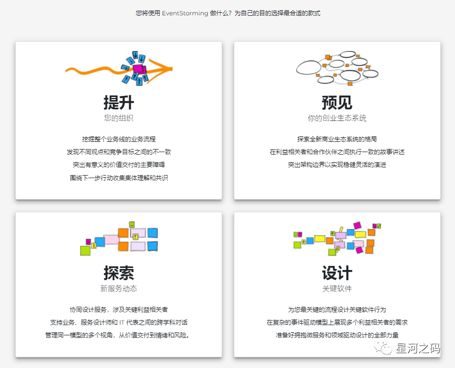

#### 事件风暴能做什么

**「EventStorming」**是一种灵活的研讨会形式，用于协作探索复杂的业务领域。它有不同的风格，可以在不同的场景中使用：

- 评估现有业务线的健康状况并发现最有效的改进领域；
- 探索新的创业商业模式的可行性；
- 设想新的服务，最大限度地为所有相关方带来积极成果；
- 设计干净且可维护的事件驱动软件，以支持快速发展的业务。

EventStorming 的自适应特性允许具有不同背景的利益相关者之间进行复杂的跨学科对话，从而提供超越孤岛和专业界限的新型协作。

#### 事件风暴流程

- 物料准备

- 参与人员

  - **「组织者」**：组织者应当熟悉事件风暴的整个流程，能够组织大家顺利完成事件风暴；
  - **「领域专家」**：领域专家应该是精通业务的人，在事件风暴过程中，要负责澄清一些业务上的概念，思考业务上有没有遗漏的事件；
  - **「项目成员」**：负责开发这个项目的成员，所有角色都可参加，包括系统开发人员，业务分析师，业务人员，测试工程师，UX 设计师，项目管理人员等。

- 识别领域事件

  **「事件风暴将系统拆分为不同的元素，用不同颜色表示」**

  领域专家和团队成员通过头脑风暴把领域事件（业务行为）都梳理出来

- 分析命令和事件

  在梳理完领域事件后，我们可以在此基础上进一步探索系统核心事件的运行机制。这里我们在之前的领域事件的基础上加入事件，命令和角色的概念。

  - **「事件(Event)」**

    **「事件风暴中的核心概念，是领域专家关心的，在业务上真实发生的「业务行为」，描述的形似为宾语+动词的过去式」**。

    > 例如: 「订单已提交」，「账户已锁定」，「商品已发出」。使用**「橙色」**表示。

  - **「命令(Command)」**

    **「产生事件的对象。命令可以理解为是一个动作，执行了动作之后就会产生相应的事件。」**

    > 例如:「取消订单」。使用**「深蓝色」**的即时贴表示。

  - **「角色(User)」**

    执行命令的对象，一般是指自然人。

- 分析领域模型和聚合

  - **「领域模型」**：**「相同概念指令和事件的集合」**，一般用黄色表示。

    > 领域模型相关的命令放到左边，事件放到右边。

  - **「聚合」**

    当某一个领域模型不能作为一个独立存在的对象。它被另一个领域模型持有和使用。此时我们将两个模型结合起来形成一个聚合。

- 划分子域和限界上下文

  **「当确定领域模型以后，就可以划分子域和限界上下文」**。子域划分在【领域划分】会有详细说明。

  在划分限界上下文的时候可以**「检验领域模型和通用语言的正确性」**。

### 实体&值对象

#### 实体（Entity）

**「DDD中的实体是拥有唯一标识符，经历各种状态变更后仍然可以保持不变的对象。」**

> 实体可以被多次修改，一个实体对象可能和它先前的状态大不相同。由于它们拥有相同的身份标识，他们依然是同一个实体。比如人会经历幼年，少年，中年，老年几个状态，但是始终都是这个人没变。
>
> 这里就有了唯一标识符是这个人，并且在多个状态都还是这个人体现了连续性。

实体有两个重要特性，它们可以超出软件的生命周期：

- 标识（identity）
- 连续性（continuity）

**「对与实体而言重要的是标识与连续性，而非实体的属性」\**。\****

在DDD不同的设计过程中，实体的展现形式不一样

| 业务状态                                                     | 代码状态                                                     |
| ------------------------------------------------------------ | ------------------------------------------------------------ |
| 战略设计阶段：实体是领域模型的一个重要对象：  实体包含：多个属性，操作，行为；  事件风暴阶段：根据命令，事件，操作，找出这些行为的业务实体对象，井按照一定的业务规则吧依存度高，业务联系紧密的实体对象和值对象进行聚类，形成聚合 | 代码模型中：实体对应实体类：  实体类包含：属性，方法 方法实规的是实体自身的业务逻辑  实体采用的是充血模型；  跟实体相关的所有的业务逻辑都在实体类的方法中实现； 跨多个实体的领域逻辑则在领域服务中实现； |
| 运行状态                                                     | 数据库状态                                                   |
| 实体以DO（领境对象）的形式样在，可以对实体对象多次修改，但是它的标识不会变 | DDD先构建领域，针对实际业务场景构建实体对象和行为。再把实体对象映射到数据持久化对象 一个实体跟数据库中持久化对象的关系：一对一、一对多、多对一抖有可能，甚至有些实体不需要持久化到数据库中；  #举例： 权限提醒：对应两个持久化对象 用户，角色，这是一对多的关系： 客户和账户实体：对应了一个持久化对象用户信息，这是多对一的关系； |

#### 值对象（ValueObject）

**「通过对象的属性值来识别的对象，它将多个相关属性组合为一个概念整体，是没有标识符的对象。值对象本质就是一个集合」**

值对象描述了领域中的**「一个不可变的东西」**，它将不同的相关属性组合成了一个概念整体，**「当度量和描述改变的时候可以用另外一个值对象替换，并可以进行相等性比较」**

- 作用：

  **「领域建模过程中，值对象可以保证属性的清晰和概念的完整性」**

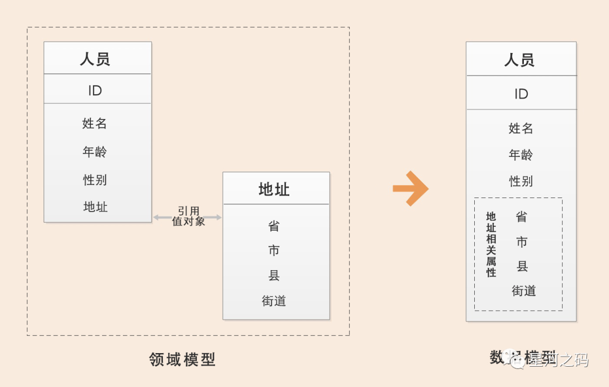

在这个图中，当我们的领域对象是人员的时候，我们关注的是人员本身，而地址是人员的一个属性，我们把地址构成一个集合，即地址值对象。

### 聚合

#### 聚合根

在理解集合之前，先来理解一下什么是聚合根

**「聚合根：如果把聚合比作组织，聚合根则是组织的负责人，聚合根也叫做根实体，它是实体并且还是实体的管理者」**

**「聚合根的特点」**

- 作为实体，具备自己的业务属性，业务行为，业务逻辑

- 作为聚合的管理者：

  - 在聚合内部：负责协调实体和值对象完成共同的业务逻辑

  - 在聚合之间：聚合根是聚合对外的接口人，以聚合根ID的方式接受外部请求和任务，实现上下文中的聚合之间的业务协同。

**「聚合之间通过聚合根关联引用，如果需要访问其他聚合的实体，先访问聚合根，再定位到聚合内部的实体；外部对象不能直接访问聚合内的实体」**

- 领域模型根据领域分成多个聚合，每个聚合都有一个实体作为**「聚合根」**。
- 聚合确定了实体生命周期的关注范围，即当某个实体被创建时，同时需要创建以其所在的整个聚合。而当持久化某个实体时，同样也需要持久化整个聚合。即：**「CRUD操作都应该作用在聚合根上」**，而不是单独的某个实体。

#### 聚合（Aggregate）

- 聚合是什么

  在DDD中，实体和值对象都是很基础的领域对象，那么聚合就是它们的集合

  - **「让实体和值对象协同工作的组织就是聚合，用来确保这些领域对象在实现公共的业务逻辑的时候，可以保持数据的一致性」\**。\****
  - **「聚合是数据修改和持久化的基本单元，一个聚合中必然有一个聚合根，而一个聚合根对应一个数据的持久化」\**。\****

  聚合的组成：

  - 限界上下文
  - 聚合根

- 聚合的作用

  **「聚合在DDD分层架构中属于领域层，领域层包含了多个聚合，共同实现核心业务逻辑，聚合内的实体以充血模型实现个体业务能力，以及业务逻辑的高内聚」\**。\****

  跨多个实体的业务逻辑通过**「领域服务」**来实现，跨多个聚合的业务逻辑通过**「应用服务」**来实现；

  - **「领域服务：业务场景需要一个聚合中的A实体和B实体共同完成」**
  - **「应用服务：业务逻辑需要聚合C和聚合D共同完成」**

- 聚合如何设计

以下是一张保单投保的聚合过程（网图），从下图中可以很清晰的看出来聚合的设计步骤，以及方式方法

- 聚合设计原则

  - **「设计小聚合」**

  - - 聚合设计过大，聚合会因为包含过多实体，实体间管理复杂，高频操作时会出现并发冲突或数据库锁，导致系统可用性降低。
    - 设计小聚合降低实体间复杂度，复用性高，领域模型更能适应业务变化。

  - **「在一致性边界内建模真正的不变条件（高内聚）」**

    不变条件是一个业务规则，应该保持一致性：

    **「聚合封装的是不变的领域对象，而非简单地组合对象。内部的实体和值对象按照固定的规则实现数据的一致性，边界外的任何东西都与该聚合无关。」**

  - - 事务一致性
    - 最终一致性

  - **「通过唯一标识符引用其它聚合」**

    **「聚合之间通过聚合根的唯一ID来关联，而不是直接对象引用的方式」\**。\****

    > 外部的聚合对象不能在该聚合内管理，容易导致边界不清晰，增加聚合之间的耦合度；

  - **「边界之外使用最终一致性」**

  - - **「聚合内部数据强一致性，聚合之间数据最终一致性」**

    - **「在一次事务中，最多只能更改一个聚合的状态」**

      > 如果一次业务操作涉及多个聚合状态的更改，应采用领域事件的方式异步修改相关的聚合，实现聚合间解耦。

  - **「通过应用层实现跨聚合的服务调用」**

    > 在不持有对象引用的情况下，不能修改其他聚合，所以要避免在同一个事务中修改多个聚合。**「但在领域模型中我们总需要对象之间的关联关系来完成一些任务。\**「此时就需要用到」\**通过应用层实现跨聚合的服务调用，也就是应用服务的服务编排」\**。\****

    **「通过应用服务的服务编排实现微服务内聚合之间的解耦，以及以聚合为单位的服务组合和拆分，应避免跨聚合的领域服务调用和跨聚合的数据库表关联。」**

#### 特点比较

- **「聚合」**

  **「高内聚、低耦合，是领域模型中最底层的边界，可作为拆分微服务的最小单位」**

  > 聚合可独立作为一个微服务，以满足版本的高频发布和弹性伸缩要求。一个微服务也可包含多个聚合。

- **「聚合根」**

- - 聚合根是实体，有实体的特点，具有全局唯一标识，有独立的生命周期。
  - 一个聚合只有一个聚合根。
  - 聚合根在聚合内对实体和值对象采用直接对象引用的方式进行组织和协调。
  - 聚合根与聚合根之间通过ID关联的方式实现聚合之间的协同。

- **「实体」**

- - 有ID标识，ID在聚合内唯一。
  - 状态可变，依附于聚合根，其生命周期由聚合根管理。
  - 实体可以持久化，但与数据库持久化对象不一定是一对一的关系。
  - 实体可引用聚合内的聚合根、实体和值对象。

- **「值对象」**

- - 无ID，不可变，无生命周期，用完则销毁。
  - 值对象之间通过属性值判断相等性。
  - 本质是值，是一组概念完整的属性组成的集合，用于描述实体的状态和特征。
  - 值对象尽量只引用值对象。

### 资源库(Repository)

**「资源库用于保存和获取聚合对象」**。领域对象不需通过基础设施得到领域中对其他对象的引用。只需从资源库中获取。

资源库会保存对某些对象的引用。当一个对象被创建出来后，可以保存到资源库中，使用时可从资源库中检索到。如果客户程序从资源库中请求一个对象，而资源库中并没有它，就会从存储介质中获取它。**「资源库作为一个全局的可访问对象的存储而存在」**

资源库与DAO的区别：

- DAO只是对数据库的一层很薄的封装，而资源库则更加具有领域特征。
- 实体都可以有相应的DAO，但只有聚合对象才有相应的资源库。

Repository以**「领域」**为中心，把ORM框架与领域模型隔离，对外隐藏封装了数据访问机制。

时序图

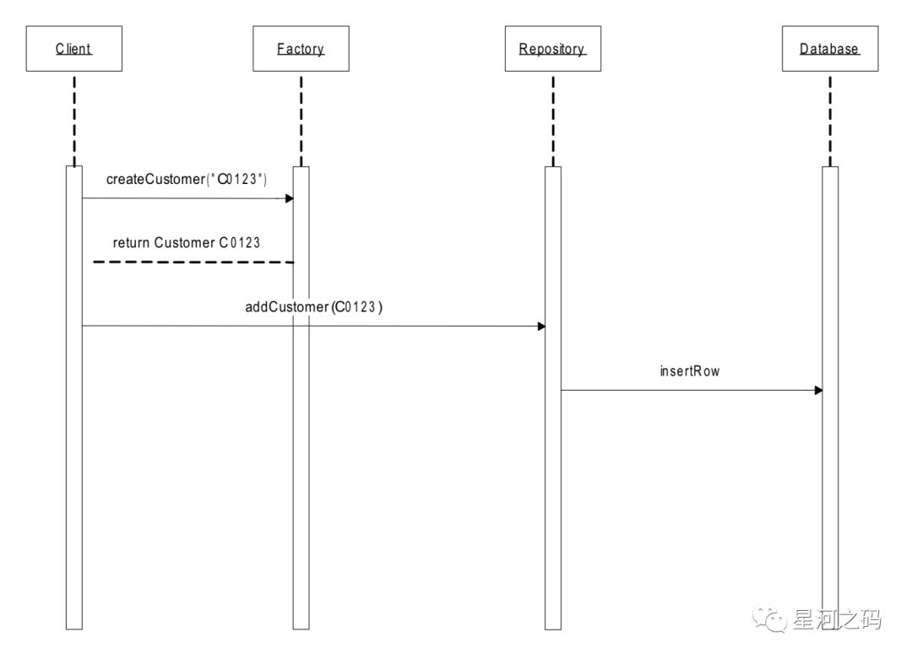

### 工厂

**「DDD中工厂的主要目标：隐藏对象的复杂创建逻辑，清晰的表达对象实例化的意图。」**

工厂模式是计模式中的创建类模式之一。我们可以借助**「工厂模式实现DDD中领域对象的创建」**。

**「工厂的设计要点」**

- 每个创建对象的方法都应该是原子的，并保证生成的对象处于一致的状态。

- **「可以使用独立的工厂或者在聚合根上使用工厂方法」**

  > 当 A 对象的创建主要使用了 B 对象的数据或者规则时，那么可以在 B 对象上创建一个工厂方法来生成 A 对象。

- 以下情况只需使用构造函数即可

  - 类仅仅是一种类型，没有其他子类，没有实现多态性。

  - 客户端关心的是实现类。
  - 客户端可以访问对象的所有属性，因此向客户公开的构造函数中没有嵌套的对象创建。
  - 公共构造函数必须遵守与工厂相同的规则，必须是原子操作且满足所有固定规则。
  - 不要在构造函数中调用其他构造函数，应保持构造函数的简单。

- 工厂方法的参数应该是较低层的对象。

### 领域服务&应用服务

**「服务是行为的抽象」**。根据DDD的分层架构，**「应用服务属于应用层，领域服务属于领域层」**

**「应用服务是用来表述应用行为，而领域服务用来表述领域行为」**。

- 应用行为描述了一个具体操作从开始到结束的每一个环节。
- 领域行为是对应用行为的细化，用来处理具体的某一个环节。

#### 应用服务

应用服务是用来**「表达用例和用户故事（User Story)的主要方式」**。

- 应用层通过应用服务接口来暴露系统的全部功能。

- 应用服务主要负责**「编排和转发」**

  将要实现的功能委托给一个或多个领域对象来实现，它本身只负责处理业务用例的执行顺序以及结果的拼装。**「从而隐藏了领域层的复杂性及其内部实现机制」**

- 应用层在四层架构中是比较【薄】的一层。

- 除了服务编排，在该层还可以进行安全认证，权限校验，持久化事务控制，外部系统访问等。

- 应用层是防腐层与领域层的桥梁。

- - 防腐层使用VO（视图模型）进行界面展示，
  - 防腐层与应用层通过DTO（数据传输对象）进行数据交互，使得防腐层与领域层Entity（领域对象）解耦的。

**「小结」**

- **「应用服务的职责」**

  跨限界上下文业务逻辑。DTO转换。事务AOP、权限AOP、日志AOP、异常AOP。外部系统访问：邮件、消息队列。

- **「应用服务的设计原则」**

  用来封装业务逻辑。面向用例和用户故事，一个请求对应一个方法。应用服务之间互不依赖。

#### 领域服务

**「领域服务是用来协调领域对象完成某个操作，用来处理业务逻辑的，它本身是一个无状态的行为。状态由领域对象（具有状态和行为）保存」**

> 当领域中的某个操作过程或转换过程不是实体或值对象的职责时，我们便应该将该操作放在一个单独的接口中，即领域服务。

**「领域层是在四层架构中是比较【充实】的一层。，它实现了全部业务逻辑（业务流程、业务策略、业务规则、完整性约束等）并且通过各种校验手段保证业务正确性」**

**「小结：」**

- **「领域服务的职责」**

  处理聚合实例业务逻辑。没办法合理放到实体中的其它业务逻辑。

- **「领域服务的设计原则」**

  组织业务逻辑。面向业务逻辑，一个请求对应多个服务的多个方法，领域服务之间会存在依赖。

#### 总结

当应用服务中的逻辑过于复杂时，我们应该重新考虑领域服务的划分，避免领域逻辑泄露到应用服务中去。而在使用领域服务时，因为有些操作更适合放到领域对象（实体和值对象）中去，这可能会导致贫血领域模型。

- 服务是行为的抽象。
- 应用服务**「通过服务编排来委托领域对象和领域服务来表达用例和用户故事」\**。\****
- 领域对象（实体和值对象）负责单一操作。
- 领域服务用于协调多个领域对象共同完成某个业务操作。
- 应用服务不处理业务逻辑，领域服务处理业务逻辑。

## DDD战略设计与战术设计

DDD的的具体落地分为战略设计阶段和战术设计阶段。这两个阶段指导着系统需求分析一直到编码实现，是由战略设计到战术设计推进的过程。主要包含需求分析——统一语言——领域模型——程序设计——编码实现。

### 战略设计

战略设计也叫战略建模，**通过DDD的理论，对业务需求进行拆解分析，划分子域，梳理限界上下文，通过领域语言从战略层面进行领域划分以及构建领域模型**。并且在在构建领域模型的过程中梳理出业务对应的聚合、实体、以及值对象。

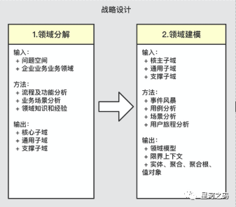

在战略设计中最主要的工作只有两个：

- 领域划分

  通过对业务的拆解以及公司团队的业务定位，将业务场景分解，识别出核心领域、通用域、支撑域。并确定领域的边界以及领域间关系。

- **领域建模**

  通过业务场景，对用户故事以及用例的分析，梳理限界上下文，确定领域边界以及上下文映射图(Context Map)，建立领域模型，分析领域事件，聚合、实体、以及值对象。

### 战术设计

战术设计也称为战术建模，以领域模型基础，通过限界上下文作为服务划分的边界进行微服务拆分，在每个微服务中进行领域分层，实现领域服务，从而实现领域模型对于代码映射目的，最终实现DDD的落地实施。

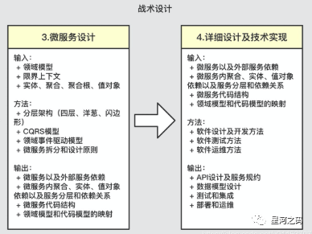

战术设计是DDD的最终落地实现的阶段：

- **服务划分**

  通过战略设计输出各个领域与限界上下文后，可以籍此进行微服务划分与设计，一个服务可以有多个聚合。

- **领域模型**

  通过战略设计中的领域建模，落地值对象、实体、领域服务、领域事件

- **资源库**

  确定聚合根之后，建立资源库，对领域对象的CRUD都通过资源库实现

- **工厂**

  负责领域对象的创建，用于封装复杂或者可能变化的创建逻辑

- **聚合**

  根据限界上下文，封装实体与值对象，并维持业务的完整性与统一性。

- **应用服务**

  隔离防腐层与领域层，**对领域进行服务编排与转发。**

### 总结

- 战略设计与战术设计是DDD落地的基础，战略设计是支撑战术设计实施的前提
- 战略设计可以控制和分解战术设计的边界和粒度
- 战术设计则以实证角度验证领域模型的有效性、完整性与一致性
- 战术设计以演进的方式对之前的战略设计阶段进行迭代，形成螺旋式上升的迭代设计

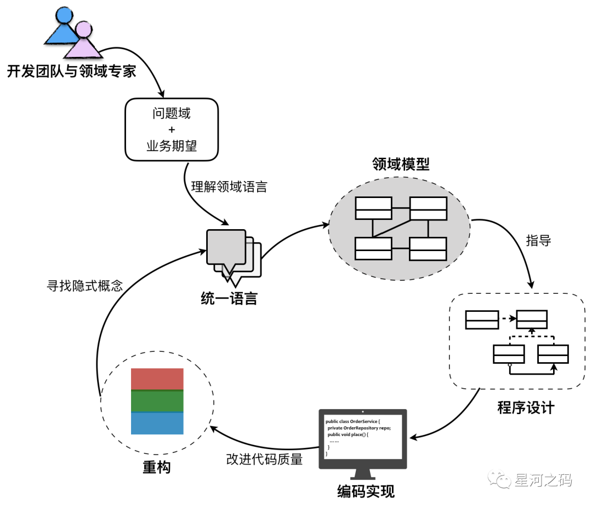

## 贫血模型与充血模型

### 贫血模型

**领域对象只有属性值与get和set方法，没有任何业务逻辑**。所有的业务逻辑都放在业务层的service上。基于贫血模型的MVC架构非常常见的，具体原因：

- 我们一般的业务中就是基于SQL 的 CRUD ，贫血模型就足以应付这种业务开发

- 当我们的业务比较简单的时候，充血模型包含的业务逻辑很简单，领域模型比较薄，跟贫血模型相差不大。

- 设计风格不同

  面向过程编程风格违反了 OOP 的封装特性，会使得数据和操作不受限制。充血模型的面向对象编程风格会使得我们在**设计之初就确定好了对数据操作暴露的操作，在 Service 层定义操作即可，不需要设计数据的CRUD。**

- - 充血模型：面向对象的编程风格
  - 贫血模型：面向过程的编程风格

- 贫血模型的思维已普及固化，开发人员从贫血模型到充血模型的思想转变是很难的，学习成本也高。

#### 贫血模型优缺点

- 优点
  - 各层单向依赖，代码结构清楚，易于实现和维护。
  - 设计简单，底层模型稳定。

- 不足
  - 领域对象的领域事件被分离到Service层，在一定程度上违反了OOP特性的封装性
  - service上的业务过于厚重，依赖性强，不利于扩展与维护。

### 充血模型

充血模型是指数据和业务逻辑被封装到同一个类中。**即领域对象拥有此领域相关行为，包含此领域相关的业务逻辑，同时也包含对领域对象的持久化操作**。充血模型满足面向对象的封装特性，是典型的面向对象编程风格。

#### 充血模型优缺点

- 优点
  - 符合单一职责，领域对象处理与自己相关的所有行为。不像在贫血模型所有的业务逻辑都在领域service中，沉重，臃肿。
  - 将我们的业务逻辑与其他动作（控制事务、权限等）分离。

- 缺点
  - 很多时候，我们并**不能很清晰的区分什么逻辑应该放在领域服务中，什么样的逻辑应该放在领域对象中**。这需要我们根据业务以及自身对DDD的理解加以权衡。

### DDD为什么使用充血模型

- 在我们MVC的开发模式中，都是**SQL 驱动的开发模式**。**先确定业务涉及到的数据库表，根据表结构编写 SQL 语句来CRUD，然后在Service中添加调用，往往很小业务的区别，我们要写不同SQL来实现，SQL的复用性很差**。对于复杂业务系统，这种开发方式会让代码越来越混乱，最终导致无法维护。
- 在充血模型的 DDD 的开发模式中，我们在**领域建模的时候就会先理清楚所有的业务，定义领域模型所包含的属性和方法，新功能需求的开发是基于领域模型来完成**。领域模型相当于的业务中间层，提供代码的可复用性。

## DDD 分层架构

- **严格分层架构：**某层只能与直接位于的下层发生耦合。
- **松散分层架构：**允许上层与任意下层发生耦合。

DDD的分层架构理念源于整洁架构的思想，在具体实践中一共提供了四层架构，五层架构，六边形架构分层架构的指导思想，而在DDD的落地中使用的比较多的就是四层架构，有时候也称之为经典四层架构。

在领域驱动设计（DDD）中采用的是松散分层架构，层间关系不那么严格。每层都可能使用它下面所有层的服务，而不仅仅是下一层的服务。

### 整洁架构

**「在领域驱动设计的分层架构中，对传统的自上而下的依赖提出了挑战。采用依赖倒置原则：」**

- 要求高层模块不应依赖于底层模块，二者都应依赖于抽象。
- 抽象不应该依赖于细节，细节应该依赖于抽象。

基于此，**「我们不能再用传统MVC的上下层的一维思想去看待DDD的四层架构，而应该以水平的二维眼光去看待。」**

**「整洁架构模型」**

整洁架构：又称为**「干净架构」**，有时也称为**「洋葱架构」**，它是**「在水平的二维上进行分层，类似于一个内核模式的内外层架构」**，由内及外分为四层。每层仅**「取决于直接位于其内部的层」**。最独立的层显示在最内圈，属于领域层。

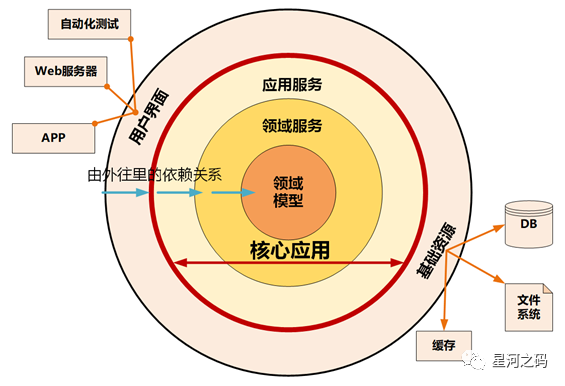

- 越靠内的层组件依赖的内容越少，处于核心的 Entities 不依赖与任何层。
- 越靠内的层组件与业务的关系越紧密，具有业务唯一性。
- 领域服务层封装了业务规则，是一个面向业务的领域模型。
- 应用服务层是内部业务与外部资源的一个隔离，它对外展现其应用逻辑，对内进行业务编排。
- 用户界面实现应用业务与外层框架和驱动器的交互，给外部资源提供访问的入口。
- 基础资源负责对接外部资源，BD，缓存，中间件等。

### DDD四层架构

每层都可能是半透明的，这意味着有些服务只对上一层可见，而有些服务对上面的所有层都可见。

#### 四层架构结构模型

- **用户交互层**

  当服务应用面向多个前端应用时，可能由于渠道而导致数据的返回不同，为保证核心业务逻辑不暴露，防止数据外泄，也为提高应用服务或领域服务的复用性与扩展性。用户界面层为前端应用提供不同的服务适配，保证应用层和领域层核心领域逻辑的稳定。

  - 封装应用服务，适配不同前端应用，提供不同类型的服务接口。
  - 根据前端应用的要求，完成数据的组装和转换。

  web 请求，rpc 请求，mq 消息等外部输入均被视为外部输入的请求，可能修改到内部的业务数据。

- **业务应用层**

  - 应用层用户隔离用户接口层和领域层
  - **「主要用于协调领域服务和领域对象完成组合、编排和转发，处理执行结果的拼装。」**
  - **「远程的服务调用、安全认证、权限校验、事务控制、领域事件发布或订阅等都在应用服务中进行。」**

- **领域层：**

  - 领域层实现领域模型的核心业务逻辑，是领域模型的核心。

- - 领域模型的业务逻辑主要由**「实体(充血模型)和领域服务」**来实现。

    负责表达业务概念，业务状态信息以及业务规则。即包含了该领域所有复杂的业务知识抽象和规则定义。该层主要精力要放在领域对象分析上，可以从实体，值对象，聚合（聚合根），领域服务，领域事件，仓储，工厂等方面入手。

    **「当单一实体或值对象不能实现时，就由领域服务进行组合和协调聚合内多个实体或值对象，实现复杂的业务逻辑。」**

- **基础设施层：**

  - 为领域模型提供持久化机制，当软件需要持久化能力时候才需要进行规划；
  - 一是对其他层提供通用的技术支持能力，如消息通信，通用工具，配置等的实现。**「基础设施层采用依赖倒置的设计思想，与其他层解耦。」**

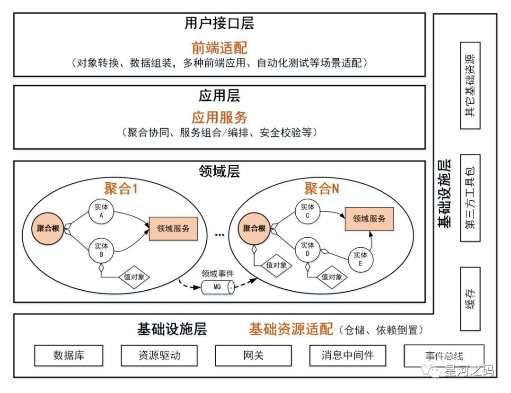

在设计和开发时，不要将本该放在领域层的业务逻辑放到应用层中实现，因为庞大的应用层会使领域模型失焦，时间一长你的服务就会演化为传统的三层架构，业务逻辑会变得混乱。

#### MVC 架构到 DDD 分层架构的映射

DDD四层架构**「并非」**是字面上在MVC三层架构上加一层，两者最大的区别：

- **「思想上的转变」**

- - MVC三层架构是上下层设计思想
  - DDD四层架构一个内核模式的内外层架构

- **「各层自己的职责重新划分」**

- - **「用户接口层」**

    封装应用服务，给前端应用提供灵活的数据和接口适配能力。

  - **「业务逻辑层」**

    **「业务逻辑层拆分到应用层和领域层，应用服务实现服务的组合和编排，领域服务完成核心领域逻辑。」**

  - **「数据访问层」**

    数据访问层从DAO方式改为**「仓储模式，领域层可以用过仓储接口访问基础资源的实现逻辑。」**

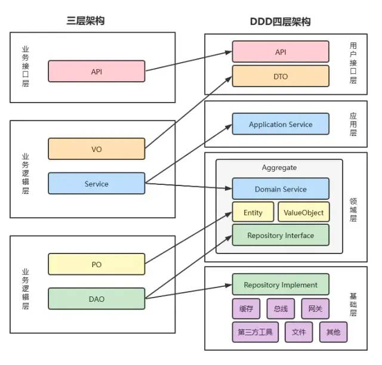

## CQRS

### 什么是CQRS

**命令查询职责分离：简称CQRS（Command Query Resposibility Segregation）。它是将软件设计中的命令-查询分离并应用在架构模式中的设计原则**。

在《Object-Oriented Software Construction》书中有一个概念：

> Every method should either be a command that performs an action, or a query that returns data to the caller, but never both.
>
> 译文：一个方法要么作为一个【命令】执行一个操作，要么作为一次【查询】向调用方返回数据，但两者不能共存。

**CQRS从模型层面，将即【命令】和【查询】分别使用不同的对象模型来表示。**

- 【**命令**】：Command ，**修改了对象的状态**

  > 不应该返回数据，在Java中，方法应该声明为void。

- 【**查询**】：Query ，**不应该通过直接或者间接的方式修改对象状态**

  > 返回数据，在Java中，方法应该声明返回的数据类型。

**在DDD架构中，通常会将查询和命令操作分开。具体落地时，可以将Command和Query分成两个工程，但是大多数情况下放在一个项目可以提高业务内聚性**。

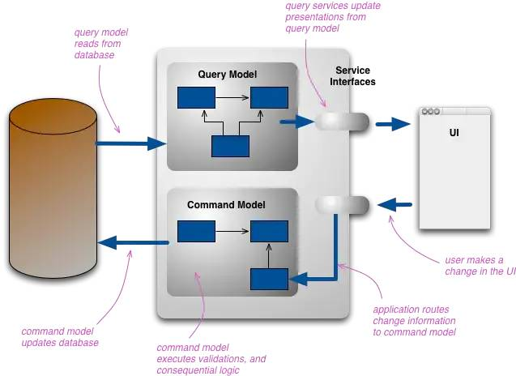

- 这张图读写体现的是**逻辑分离，物理层面使用的是同一个数据库，而实际上可以将数据库改成读库和写库的物理分离，只需要同步两个库即可。常用的解决方案是当写库发生更改时，通过Event事件机制通知读库进行同步。**

- 在实际的CQRS落地时，我们即使物理层面使用的是同一个数据库，但是可能还是会用到其他的物理存储，比如Elasticsearch，Redis等。当数据库发生更改时：

- - **发送Event事件通知ES/Redis进行数据更新同步。**
  - **通过监听Mysql的binlog更新ES/Redis。**

### CQRS实现方式

#### 读模型的数据源

读写模型可以将Command和Query分成两个工程使用不同的物理库，也可以放在一起使用同一个物理库。无论是那种方式**数据的来源应该都来自于业务实体对象（比如聚合根）**。

读模型的**数据源形式**分为：

- **单进程单实体**：数据来源于同一个进程空间的单个实体
- **单进程跨实体**：数据来源于同一个进程空间中的多个实体
- **跨进程跨实体**：数据来源于不同进程空间中的多个实体

进程空间：指某个单体应用或者单个微服务。

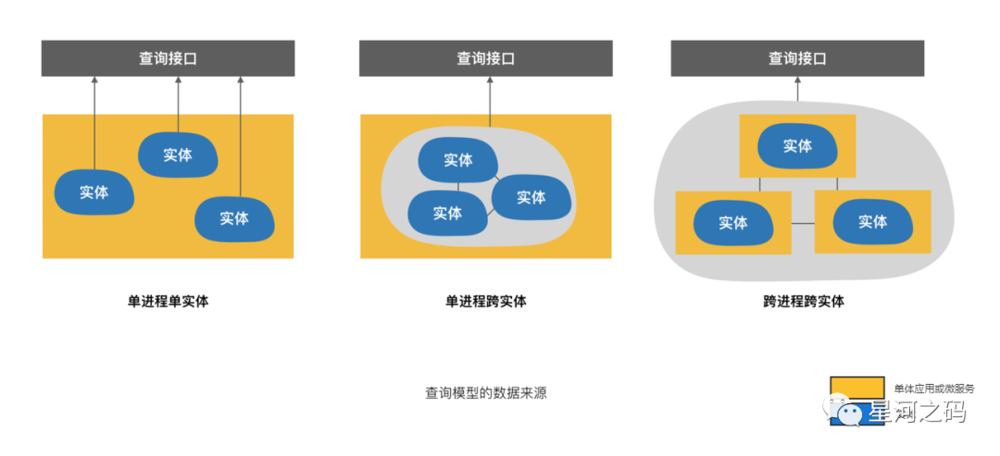

#### 读写分离的形式

读写分离的形式基于数据来源的不同，**CQRS可以在代码中实现读写分离（共享模型/分离模型），也可以在物理存储中实现读写分离（共享存储/分离存储）**。两种方式是结合起来使用的：

- **共享存储/共享模型**

  共享存储（读写同一个数据库），共享模型(读写同一个领域服务，领域对象)，数查询据通过模型转换后返回给调用方。

- **共享存储/分离模型**

  共享数据存储，代码中**分别建立写模型和读模型**，读模型是基于查询方式进行的建模。

- **分离存储/分离模型**

  **数据存储和代码模型都是分离的，通常用于需要聚合查询多个子系统**（比如微服务系统）。

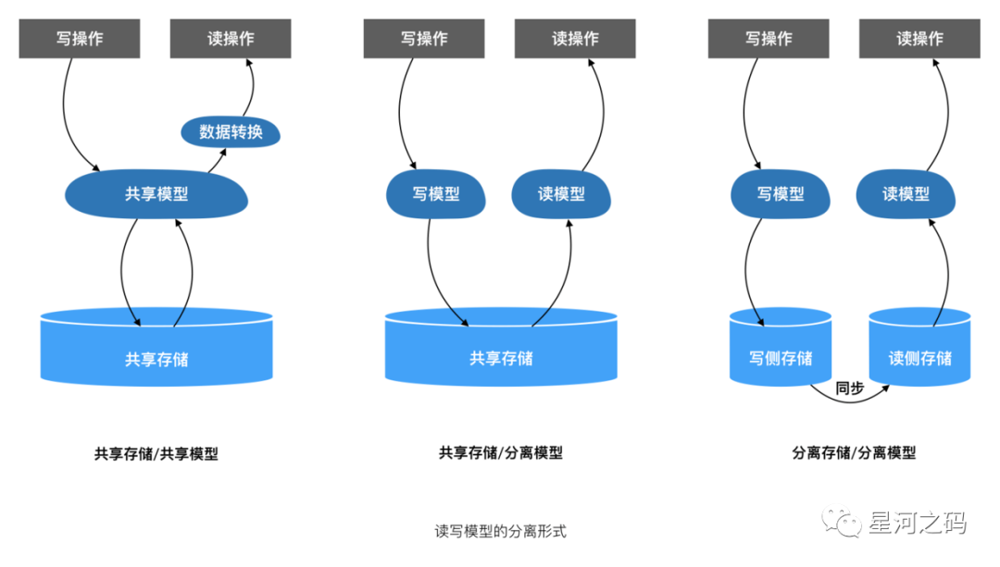

#### CQRS模式

**在DDD实践中，CQRS模式是由【读模型的数据源】与【读写模型的分离形式】组合使用**。

主要分为：

- 单进程单实体 + 共享存储/共享模型
- 单进程单实体 + 共享存储/分离模型
- 单进程跨实体 + 共享存储/分离模型
- 单进程跨实体 + 分离存储/分离模型
- 跨进程跨实体 + 分离存储/分离模型

通过以上5中方式基本上可以覆盖常用的一些业务场景。

##### 单进程单实体 + 共享存储/共享模型

对于简单的单体或者微服务应用，这种方式是最直接的，**在单个领域实体模型同时用于读写操作，在向调用方返回查询数据时，只需要转换相应的领域模型即可。**

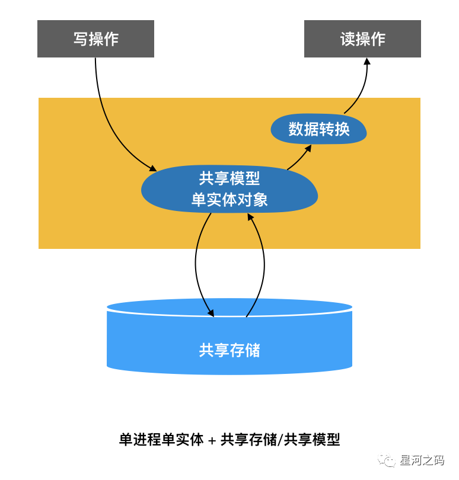

##### 单进程单实体 + 共享存储/分离模型

当单个实体的查询很复杂时，可以对读模型和写模型分别建模，以此维护读写过程彼此的清晰性。

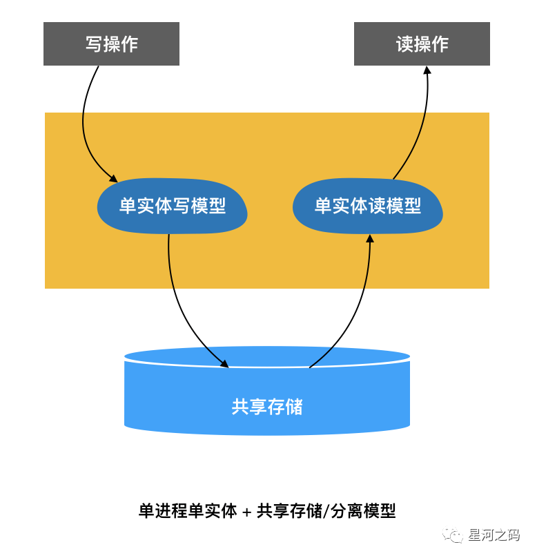

##### 单进程跨实体 + 共享存储/分离模型

**在同一个进程空间中的跨实体查询时时候可以使用分离模型的形式**。做join联合查询即可。

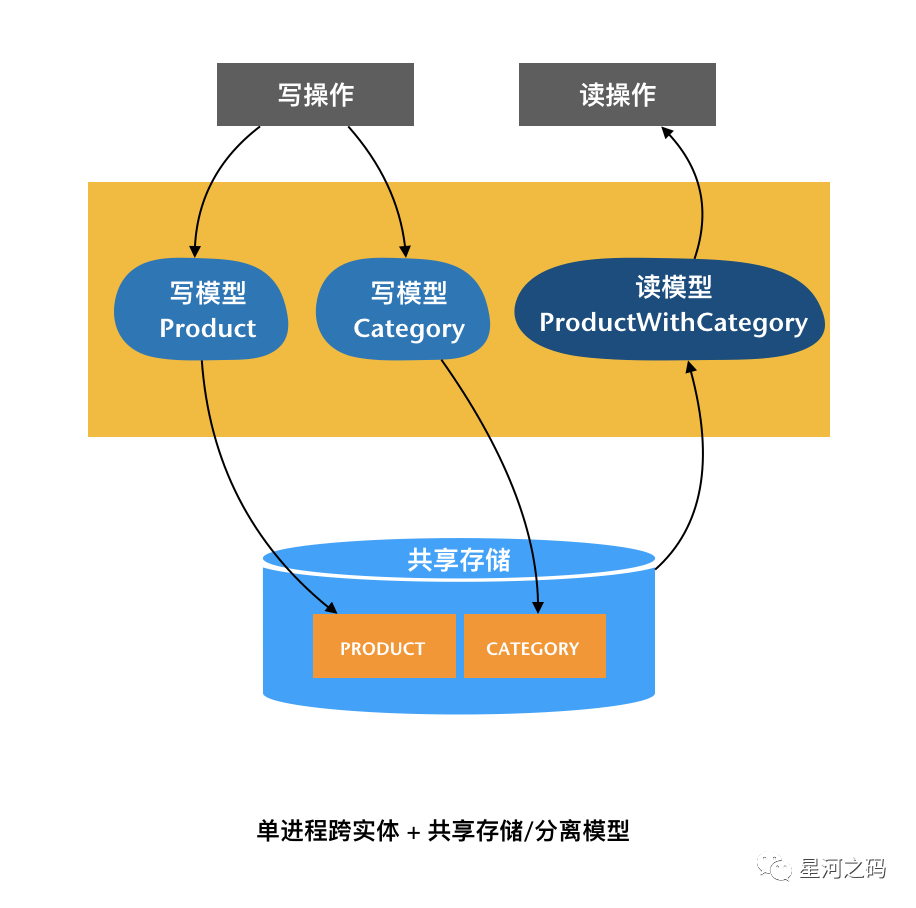

##### 单进程跨实体 + 分离存储/分离模型

当系统数据量比较大，并发比较大，对性能要求比较高得时候，我们可以采用分离存分离存储/分离模型的方式，采用专门的数据库来简化查询提升效率。

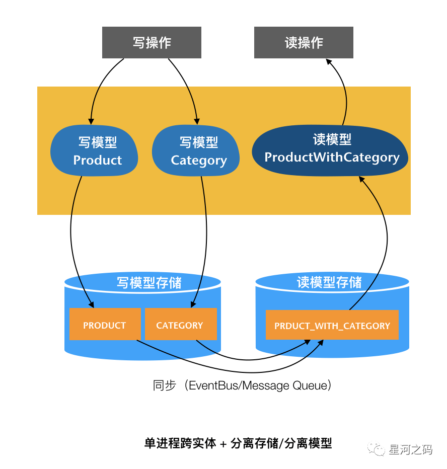

##### 跨进程跨实体 + 分离存储/分离模型

**在微服务中，每个服务都内聚性地管理自身的聚合根对象，意味着分离模型。而微服务的数据存储如果是独占式的，则数据存储一定是分离的**。

在这种方式中，查询的数据通常**通过事件机制从不同的其他业务服务中同步得到**，通过API向外暴露。

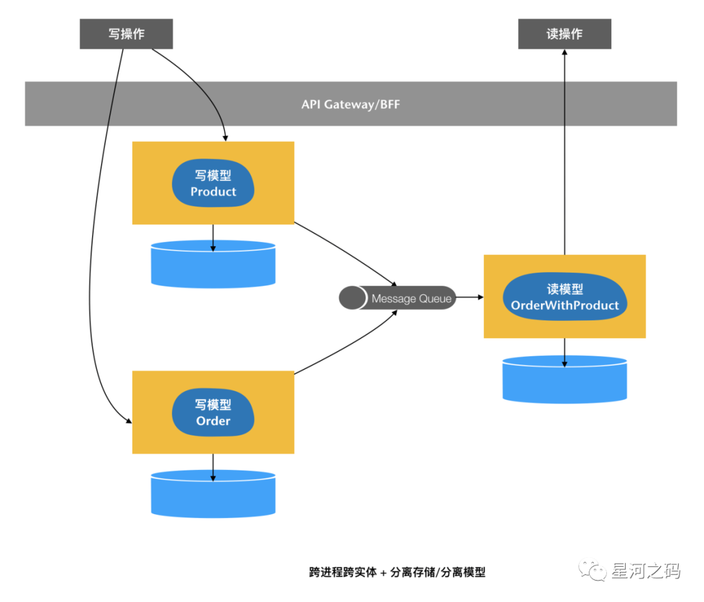

### DDD、CQRS架构落地

在DDD+CQRS的架构落地时，Web、RPC、DB、MQ等基础设施层会依赖内部的抽象，属于一个对称性架构

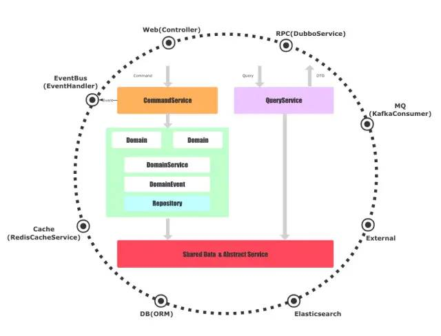

**所有的抽象都定义在圆圈内部，实现都在基础设施**。而针对读写的应该都在应用层划分：

- 当一个命令Command请求过来时，会通过应用层的CommandService去协调领域层工作，
- 当一个查询Query请求过来时，则直接通过基础实施的实现与数据库或者外部服务交互。

在实际开发中，我们会发现Query和Command的有一些数据和抽象服务是公用的，为了提高代码的复用性，可以单独抽离出来一个公用的数据对象和抽象模块Shared

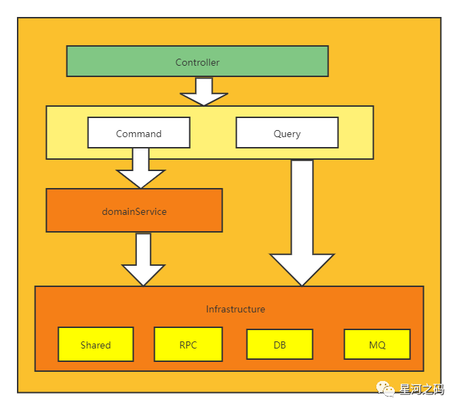

## 领域事件

领域事件是一个领域模型中极其重要的部分，用来表示领域中发生的事件。忽略不相关的领域活动，同时明确领域专家要跟踪或希望被通知的事情，或与其他模型对象中的状态更改相关联。

领域事件 = 事件发布 + 事件存储 + 事件分发 + 事件处理

- 简述

  - **事件发布：**构建一个事件，需要唯一标识，然后发布
  - **事件存储：**发布事件前需要存储，因为接收后的事建也会存储，可用于重试或对账等
  - **事件分发：**服务内直接发布给订阅者，服务外需要借助消息中间件，比如 Kafka，RabbitMQ 等
  - **事件处理：**先将事件存储，然后再处理

### 领域事件设计

#### 构建和发布

##### 基本属性

至少包括如下：

- 事件唯一标识（全局唯一，事件能够无歧义在多个限界上下文中传递）
- 发生时间
- 事件类型
- 事件源

即主要记录事件本身以及事件发生背景的数据。

##### 业务属性

记录事件发生那刻的业务数据，这些数据会随事件传输到订阅方，以开展后续业务操作。

事件基本属性和业务属性一起构成事件实体，事件实体依赖聚合根。领域事件发生后，事件中的业务数据不再修改，因此业务数据可以以序列化值对象的形式保存，这种存储格式在消息中间件中也比较容易解析和获取。

为保证事件结构的统一，通常创建事件的基类，子类可自行继承扩展。由于事件没有太多业务行为，实现一般比较简单。

事件发布前需先构建事件实体并持久化。
事件实体的业务数据推荐按需发布，避免泄露不必要业务信息。

##### 事件发布方式

- 可通过应用服务或者领域服务发布到事件总线或MQ
- 也可从事件表中利用定时程序或数据库日志捕获技术获取增量事件数据，发布到MQ

#### 事件数据持久化

##### 意义

- 系统之间数据对账
- 实现发布方和订阅方事件数据的审计

当遇到MQ、订阅方系统宕机或网络中断，在问题解决后仍可继续后续业务流转，保证数据一致性。
毕竟虽然MQ都有持久化功能，但中间过程或在订阅到数据后，在处理之前出问题，需要进行数据对账，这样就没法找到发布时和处理后的数据版本。关键的业务数据推荐还是落库。

##### 实现方案

- 持久化到本地业务DB的事件表，利用本地事务保证业务和事件数据的一致性
- 持久化到共享的事件DB。业务、事件DB不在同一DB，它们的数据持久化操作会跨DB，因此需分布式事务保证业务和事件数据强一致性，对系统性能有影响

#### 事件总线(EventBus)

##### 意义

实现**同一微服务内的聚合之间的**领域事件，提供事件分发和接收等服务。
是进程内模型，会在微服务内聚合之间遍历订阅者列表，采取同步或异步传递数据。

因为在微服务内部在同一个进程，事件总线相对好配置，它可以配置为异步的也可以配置为同步的。如果是同步就不需要落库。推荐少用微服务内聚合之间的领域事件，它会增加开发复杂度。
而微服务之间的事件，在事件数据落库后，通过应用服务直接发布到MQ。

##### 事件分发流程

- 若是微服务内的订阅者（其它聚合），则直接分发到指定订阅者
- 微服务外的订阅者，将事件数据保存到事件库（表）并异步发送到MQ
- 同时存在微服务内和外订阅者，则先分发到内部订阅者，将事件消息保存到事件库（表），再异步发送到MQ

#### MQ

跨微服务的领域事件大多会用到MQ，实现跨微服务的事件发布和订阅。
虽然MQ自身有持久化功能，但中间过程或在订阅到数据后，在处理之前出问题，需要进行数据对账，这样就没法找到发布时和处理后的数据版本。关键的业务数据推荐还是落库。

#### 接收&&处理

微服务订阅方在应用层采用监听机制，接收MQ中的事件数据，完成事件数据的持久化后，就可以开始进一步的业务处理。领域事件处理可在领域服务中实现。

- 事件是否被消费成功（消费端成功拿到消息或消费端业务处理成功），如何通知消息生产端?
  因为事件发布方有事件实体的原始的持久化数据，事件订阅方也有自己接收的持久化数据。一般可以通过定期对账的方式检查数据的一致性。
- 在采取最终一致性的情况下，事件消费端如果出现错误，消费失败，但之前的业务都成功了，虽然记录了event dB，但后续如何处理，人工介入吗？如果人工介入再解决，前端用户会不会看到数据不一致，体验不好？
  失败的情况应该比例是很少的。失败的信息可采用多次重试，如果这个还解决不了，只能将有问题的数据放到一个问题数据区，人工解决。当然要确保一个前提，要保证数据的时序性，不能覆盖已产生的数据。

一般发布方不会等待订阅方反馈结果。发布方有发布的事件表，订阅方有消费事件表，可采用对账方式发现问题数据。

#### 管理

大型系统的领域事件有很多：

- 做好源端和目的端数据的对账处理，发现并识别处理过程中的异常数据
  异步的方式一般都有源端和目的端定期对账的机制。比如采用类似财务冲正的方式。如果在发布和订阅之间事件表的数据发现异步数据有问题，需要回退，会有相应的代码进行数据处理，不过不同的场景，业务逻辑会不一样，处理的方式会不一样。有的甚至还需要转人工处理。
- 发现异常数据后，要有相应的处理机制
- 选择适合自己场景的技术，保证数据正确传输

### 领域事件 V.S CQRS

CQRS主要是想读写分离，将没有领域模型的查询功能，从命令中分离出来。领域事件主要目的还是为了微服务解耦，在连续的业务处理过程中，以异步化的方式完成下一步的业务处理，降低微服务之间的直连。
它们的共同点就是通过消息中间件实现从源端数据到目的端数据的交互和分离。

如果你就是不想用领域事件，聚合之间还可以通过应用层来协调和交互。应用服务是所有聚合之上的服务，负责服务的组合和编排，以及聚合之间的协调。

## 领域模型-规格模式

**SPECIFICATION**（规格）模式提供了用于表达特定类型的规则的精确方式，它把这些规则从条件逻辑中提取出来，并在模型中把它们显式地表示出来。

业务规则通常不适合作为ENTITY或VALUE OBJECT的职责，而且规则的变化和组合也会掩盖领域对象的基本含义。但是将规则移出领域层的结果会更糟糕，因为这样一来，领域代码就不再表达模型了。

逻辑编程提供了一种概念，即“**谓词**”这种可分离、可组合的**规则对象**，值得我们参考。我们可以借用谓词概念来创建可计算出布尔值的特殊对象。那些用于测验的方法，都是些小的真值测试，可以提取到单独的VALUE OBJECT中。而这个新对象则可以用来计算另一个对象，看看谓词对那个对象的计算是否为“真”。

这个新的对象（InvoiceDelinquency）就是一个**规格**。SPECIFICATION（规格）中声明的是限制另一个对象状态的约束，被约束对象可以存在，也可以不存在。SPECIFICATION有多种用途，其中一种体现了最基本的概念，这种用途是：SPECIFICATION可以测试任何对象以检验它们**是否满足指定的标准**。

### 何时采用SPECIFICATION

对于Specification模式的主要应用场景书里面谈到三点，即：

- 验证对象，检验对象本身是否满足某些业务要求
- 从集合中选择符合特定业务规则的对象或对象子集
- 指定在创建新对象的时候必须要满足某种业务要求

如果从以上几点来看的话，对于规格模式可以更多的看做是对业务实现过程中业务规则的单独剥离，放到独立的规格类来实现，主要就是处理业务规则。在谈到这里的时候我们再回顾下领域模型中的几个特定对象：

- 实体（Entity）：拥有唯一标识的对象。
- 值对象（Value Object）：没有唯一标识的对象。
- 工厂（Factory）：定义创建实体的方法。
- 资源库（Repository）：管理实体的集合并封装其持久化过程。
- 服务（Service）：实现不能指派或封装在一个单一对象上的操作。

如果基于这些核心对象来看，需要增加一些对整个领域模型和模式使用的一些分析。

对于最简单的业务对象的业务操作，比如就一个单表用户信息的维护，这种场景下Repository对象下的实体CRUD方法已经够用，但是还是要通过Service对象进一步封装再暴露为服务接口。只有对于复杂对象的时候才启用聚合和工厂模式，这从减轻架构的复杂性上是可以的。

对于Service对象中的每一个方法最好都是对应明确的业务方法，这些业务方法往往是对应到业务系统前台具体的业务功能或业务操作的。如一个转账操作可以是service层的一个方法，但是在转账操作的实现过程中需要判断用户账户是否有效，用户是否有欠款，那么这些就是业务规则。

对于业务规则不需要暴露为Service对象中的具体方法，在不考虑Specification模式的时候可以将具体的业务规则直接写到Service方法里面，但是可以看到会导致Service对象变重，而对于Service对象更多应该只是下层对象的方法调用和方法组合。因此才会出现将业务规则单独抽取为独立的方法，同时新增加一个规则类类存储这些规则和方法。

在这样处理后，整个逻辑和思路和常见的SOA架构方法论就能够更好的对应和映射，即：

- 实体和仓储类：更多的是承载对象的CRUD数据操作，不承载过多的业务规则。
- 规格类：承载业务规则，是在实体和仓储类外的业务规则和逻辑校验实现等。
- Service类：对上面两类对象中方法的调用和组合，本身并没有太多的业务和规则实现。

如果按照这种方法来实现，那么Service中的方法更多都可以转化为后期的BPEL服务编排方式来实现。另外对于规则类是否可以直接访问DAO层，在书里面是可以的，即这部分规则实现是不走实体和仓储类的。

## DDD 整体作用总结

- 消除信息不对称
- 常规MVC三层架构中自底向上的设计方式做一个反转，以业务为主导，自顶向下的进行业务领域划分
- 将大的业务需求进行拆分，分而治之

### DDD 的角度看 MVC 架构的问题

代码角度：

- 贫血模型：只起到数据类的作用，业务逻辑散落到 service，可维护性越来越差
- 面向数据库表编程，而非模型编程
- 实体类之间的关系是复杂的网状结构，成为大泥球，牵一发而动全身，导致不敢轻易改代码
- service 类承接的所有的业务逻辑，越来越臃肿，很容易出现几千行的 service 类
- 对外接口直接暴露实体模型，导致不必要开放内部逻辑对外暴露，就算有 DTO 类一般也是实体类的直接 copy
- 外部依赖层直接从 service 层调用，字段转换、异常处理大量充斥在 service 方法中

项目管理角度：

- **交付效率：**越来越低。
- **稳定性差：**不好测试，代码改动的影响范围不好预估。
- **理解成本高：**新成员介入成本高，长期会导致模块只有一个人最熟悉，离职成本很大。

### DDD 的不足

DDD 架构作为一套先进的方法论，在很多场景能发挥很大价值，但是 DDD 也不是银弹。高级的架构师把 DDD 架构当成一种工具，结合其他架构经验一起为业务服务。

DDD 的不足有几个方面：

- **性能：**DDD 是基于聚合来组织代码，对于高性能场景下，加载聚合中大量的无用字段会严重影响性能，比如报表场景中，直接写 SQL 会更简单直接。
- **事务：**DDD 中的事务被限定在限界上下文中，跨多个限界上下文的场景需要开发者额外考虑分布式事务问题。
- **难度系数高，推广成本大：**DDD 项目需要领域专家专家，且需要特别熟悉业务、建模、OOP，对于管理者来说评估一个人是否真的能胜任也是一件困难的事情。

### MVC与DDD如何选择

- **MVC：**上来就可以开干，短平快，前期用起来很香，整体开发效率也更高，所以对于紧急，或者不那么重要的项目，我会直接用 MVC 怼，不好的地方就是，后面会越来越复杂，可能最后就是一坨屎山，但是很多时候，比如老板进度催的紧，我哪想到那么多以后呢？
- **DDD：**前期需要花大量时间设计好领域模型，对于一些基础组件，或者一些核心服务，如果对象模型非常复杂，建议采用 DDD，前期可能会稍微痛苦一些，但是后期维护起来会非常方便。

###### 来源：

http://dockone.io/article/989230

https://www.modb.pro/db/388542

https://www.modb.pro/db/388541

https://www.modb.pro/db/388540

https://www.modb.pro/db/388539

https://www.modb.pro/db/388538

https://www.modb.pro/db/388537

https://zq99299.github.io/note-book2/ddd/01/02.html#如何理解领域和子域

https://cloud.tencent.com/developer/article/1709312

https://segmentfault.com/a/1190000040185308

https://bbs.huaweicloud.com/blogs/274092
