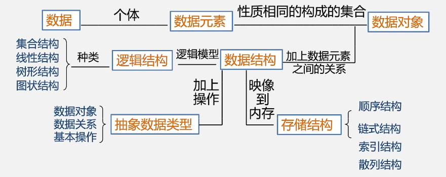

<style type="text/css">
.tg  {border-collapse:collapse;border-spacing:0;}
.tg td{border-color:black;border-style:solid;border-width:1px;font-family:Arial, sans-serif;font-size:14px;
  overflow:hidden;padding:10px 5px;word-break:normal;}
.tg th{border-color:black;border-style:solid;border-width:1px;font-family:Arial, sans-serif;font-size:14px;
  font-weight:normal;overflow:hidden;padding:10px 5px;word-break:normal;}
.tg .tg-nrix{text-align:center;vertical-align:middle}
</style>
<table class="tg">
<thead>
  <tr>
    <td class="tg-nrix" rowspan="9"><span style="font-weight:400;font-style:normal;text-decoration:none;">数据结构</span></td>
    <td class="tg-nrix" rowspan="6"><span style="font-weight:400;font-style:normal;text-decoration:none;">数据的逻辑结构</span></td>
    <td class="tg-nrix" rowspan="4"><span style="font-weight:400;font-style:normal;text-decoration:none;">线性结构</span></td>
    <td class="tg-nrix"><span style="font-weight:400;font-style:normal;text-decoration:none;">线性表</span></td>
  </tr>
  <tr>
    <td class="tg-nrix"><span style="font-weight:400;font-style:normal;text-decoration:none;">栈（特殊线性表）</span></td>
  </tr>
  <tr>
    <td class="tg-nrix"><span style="font-weight:400;font-style:normal;text-decoration:none;">队列（特殊线性表）</span></td>
  </tr>
  <tr>
    <td class="tg-nrix"><span style="font-weight:400;font-style:normal;text-decoration:none;">字符串、数组、广义表</span></td>
  </tr>
  <tr>
    <td class="tg-nrix" rowspan="2"><span style="font-weight:400;font-style:normal;text-decoration:none;">非线性结构</span></td>
    <td class="tg-nrix"><span style="font-weight:400;font-style:normal;text-decoration:none;">树形结构</span></td>
  </tr>
  <tr>
    <td class="tg-nrix"><span style="font-weight:400;font-style:normal;text-decoration:none;">图形结构</span></td>
  </tr>
  <tr>
    <td class="tg-nrix" rowspan="2"><span style="font-weight:400;font-style:normal;text-decoration:none;">数据的存储结构</span></td>
    <td class="tg-nrix" colspan="2"><span style="font-weight:400;font-style:normal;text-decorcolor:black">顺序存储</span></td>
  </tr>
  <tr>
    <td class="tg-nrix" colspan="2"><span style="font-weight:400;font-style:normal;text-decorcolor:black">链式存储</span></td>
  </tr>
  <tr>
    <td class="tg-nrix"><span style="font-weight:400;font-style:normal;text-decoration:none;">数据的运算</span></td>
    <td class="tg-nrix" colspan="2"><span style="font-weight:400;font-style:normal;text-decoration:none;">插入、修改、检索、删除、排序</span></td>
  </tr>
</thead>
</table>

[HTML Tables generator – TablesGenerator.com](https://www.tablesgenerator.com/html_tables#)

TODO状态！！

<!-- more -->

# 术语

## 数据（Data）

- 是描述客观事物的符号，是计算机中可以操作的对象，是能被计算机识别，并输入给计算机处理的符号集合。

- 这些符号必须具备两个前提：
  - 可以输入到计算机中
  - 能被计算机程序处理

## 数据元素（Data Element）

- 是组成数据的基本单位，在计算机中通常作为整体处理。

  简称为 `元素`，也被称为：记录、结点、顶点

## 数据项（Data Item）

- 数据项是数据不可分割的最小单位

  数据项：一个数据元素可以由若干个数据项组成

## 小结

`数据 > 数据元素 > 数据项`

## 数据对象（Data object）

- 是性质相同的数据元素的集合，是数据的子集。

### 数据元素与数据对象对比

- 数据元素（Data Element）是组成数据的基本单位，
  - 与数据关系：是集合的个体
- 数据对象是性质相同的数据元素的集合
  - 与数据关系：集合的子集

## 数据结构

- 不同数据元素之间不是独立的，而是存在特定的关系，我们将这些**数据元素之间的关系称为结构**（Structure）
- 是指相**互之间存在的一种或多种特定关系的数据元素集合**或者说，数据结构是**带结构的数据元素的集合**

### 逻辑结构

- 数据对象中数据元素之间的相互关系
- 与数据的存储无关，独立于计算机
- 是从具体问题抽象出来的数学模型

#### 集合结构

集合结构（Collection Structure）中的数据元素除了同属于一个集合外，它们之间没有其他关系。

各个数据元素是“平等”的，它们的共同属性是“同属于一个集合”。


#### 线性结构

- 线性结构(Linear Structure)中的数据元素之间是一对一的线性关系

  即有且仅有一个开始和一个终端结点，并且所有结点都最多只有一个直接前趋和一个直接后继

  如：线性表、栈、队列、串


#### 树结构

- 树结构(Tree Structure)数据元素之间存在一种一对多的层次关系


#### 图结构

- 图结构(Graphic Structure)数据元素之间存在多对多的任意关系


#### 小结

逻辑结构是针对具体问题的，是为了解决某个问题，在对问题理解

用示意图表示数据的逻辑结构时，要注意两点

- 将每一个数据元素看做一个结点，用圆圈表示
- 元素之间的逻辑关系用结点之间的连线表示，如果这个关系是有方向的，那么用带箭头的连线表示。

### 物理结构（存储结构）

- 数据元素及其关系在计算机存储器中的结构（存储方式）
- 数据的逻辑结构在计算机中的存储形式

#### 顺序存储结构

- 是把数据元素**依次**存放在一组地址**连续**的存储单元里，数据元素之间的逻辑关系由元素的**存储位置**表示其数据间的，逻辑关系和物理关系是一致的

数组结构:


#### 链式存储结构

- 是把数据元素存放在**任意**的存储单元里，这组存储单元可以是连续的，也可以是不连续的，数据元素之间的逻辑关系用**指针**来表示。

  

  

  结点存储本身数据同时存储下一个结点的地址

  

#### 索引存储结构

- 在存储结点信息的同时，还建立了附加的**索引表**
- 索引表中的每一项为一个**索引项**
- 索引项的**一般形式**：关键字，地址
- 关键字是能**唯一标识**一个结点的那些数据项
- 若每个结点在索引表中都有一个索引项，则该索引表称之为稠密索引（Dense Index）。若一组结点在索引表中只对应一个索引项，则该索引表称之为稀疏索引（Sparse Index）

#### 散列存储结构

- 根据**结点的关键字**直接计算出该结点的存储地址

  

#### 逻辑结构与存储结构的关系

- 存储结构是逻辑关系的映像与元素本身的映像
- 逻辑结构是数据结构的映像，存储结构是数据结构的实现
- 两者综合建立了数据元素之间的结构关系

### 数据类型和抽象数据类型

- 数据类型的作用
  - 约束变量或常量的**取值范围**
  - 约束变量或常量的**操作**

#### 数据类型（Data Type）

- 指一组性质相同的**值的集合**及定义在此集合上的**一组操作**的总称。

  数据类型 =  值的集合 + 此集合上的一组操作

在C语言中，按照取值的不同，数据类型可以分为两类：

- 原子类型：是不可以再分解的基本类型，包括整型、实型、字符型等。
- 结构类型：由若干个类型组合而成，是可以再分解的。

#### 抽象数据类型（Abstract Data Type，ADT）

抽象是指抽取出事物具有的普遍性的本质

- 抽象数据类型是指一个数学模型及定义在该模型上的一组操作。
  - 由用户定义，从问题抽象出**数据模型**（逻辑结构）
  - 还包括定义在数据模型上的一组**抽象运算**（相关操作）
  - 不考虑计算机内的具体存储结构与运算的具体实现方法
- “抽象”的意义在于数据类型的数学抽象特性
- 抽象数据类型体现了程序设计中问题分解、抽象和信息隐藏的特性


##### 抽象数据类型的形式定义

抽象数据类型可用（D,S,P）三元组表示

- D 是数据对象
- S是D上的关系集
- P是对D的基本操作集

##### 抽象数据类型的定义格式

ADT 抽象数据类型名 {

数据对象：<数据对象的定义>
数据关系：<数据关系的定义>
基本操作：<基本操作的定义>

} ADT 抽象数据类型名

- 其中数据对象、数据关系的定义用伪代码描述

- 基本操作的定义格式

  - 基本操作名（参数表）

    参数表：赋值参数 只为操作提供输入值

    ​				引用参数 以&大头，出可提供输入值外，还将返回操作结果

  - 初始条件：<初始条件描述>

    描述操作执行之前数据结构和参数应满足的条件，若条件不足则操作失败，并返回相应出错信息。若初始条件为空，则忽略。

  - 操作结果：<操作结果描述>

    说明操作正常完成之后，数据结构的变化状况和应返回的结果

### 总结


| 逻辑结构 | 物理结构     |
| -------- | ------------ |
| 集合结构 | 顺序存储结构 |
| 线性结构 | 链式存储结构 |
| 树结构   | 索引存储结构 |
| 图结构   | 哈希存储结构 |



# 算法和算法分析

## 算法

算法是解决特定问题**求解方法和步骤的描述**，在计算机中表现为**指令**的有限序列，并且每条指令表示一个或多个操作

### 算法与程序

- **算法**是解决问题的一种方法或一个过程，考虑如何将输入转换成输出，一个问题可以有多种算法

- **程序**是用某种程序设计语言对算法的具体实现

  程序 = 数据结构 + 算法

  - 数据结构提供算法实现操作
  - 算法根据数据结构设计程序

### 算法的特性

#### 输入性

算法具有零个或多个输入

#### 输出性

至少有一个或多个输出

#### 有穷性

指算法在执行有穷的步骤之后，自动结束而不会出现无限循环，并且每一个步骤在有穷的时间内完成。

#### 确定性

算法的每一步骤都具有确定的含义，不会出现二义性。算法在任何条件下，只有唯一的一条执行路径，即对于相同的输入只能有唯一的输出结果。

#### 可行性

算法的每一步都必须是可执行的，算法描述的操作可以通过已经实现的基本操作执行有限次来实现

### 算法设计的要求

#### 正确性（Correctness）

- 算法的正确性是指算法至少应该具有输入、输出和加工处理无歧义性、能正确反映问题的需求、能够得到问题的正确答案
  - 算法程序没有语法错误
  - 算法程序对于合法的输入数据能够产生满足要求的输出结果
  - 算法程序对于精心选择的，甚至刁难的测试数据都有满足要求的输出结果
  - 算法程序对于非法的输入数据能够得出满足规格说明的结果

#### 可读性（Readability）

- 算法设计的另一目的是为了便于阅读、理解和交流
  - 可读性高有助于人们理解算法
  - 晦涩难懂的算法往往隐含错误，不易被发现，并且难于调试和修改

#### 健壮性（Robustness）

- 当输入数据不合法时，算法也能做出相关处理，而不是产生异常或莫名其妙的结果
- 处理出错的方法，不应是中断程序的执行，而应该是返回一个表示错误或错误性质的值，以便在更高的抽象层次上进行处理

#### 高效性（Efficiency）

设计算法应该尽量满足时间效率高和存储量低的需求

### 算法效率的度量方法

通过对算法的数据测试，利用计算机的计时功能，来计算不同算法的效率是高还是低

#### 事后统计方法

这种方法主要是通过设计好的测试程序和数据，利用计算机计时器对不同算法编制的程序的运行时间进行比较，从而确定算法效率的高低

##### 缺陷

- 必须依据算法事先编制好程序，这通常需要花费大量的时间和精力
- 时间的比较依赖计算机硬件和软件等环境因素，有时会掩盖算法本身的优劣
- 算法的测试数据设计困难，并且程序的运行时间往往还与测试数据的规模有很大关系，效率高的算法在小的测试数据面前往往得不到体现

#### 事前分析估算方法

在计算机程序编制前，依据统计方法对算法进行估算。

一个用高级程序语言编写的程序在计算机上运行时所消耗的时间取决于下列因素：

- 算法采用的策略、方法
- 编译产生的代码质量
- 问题的输入规模
- 机器执行指令的速度

一个程序的运行时间，依赖于算法的好坏和问题的输入规模。所谓问题输入规模是指输入量的多少。

在分析程序的运行时间时，最重要的是把程序看成是独立于程序设计语言的算法或一系列步骤。

一个算法的运行时间是指一个算法在计算机上运行锁耗费的时间大致可以等于计算机执行一种简单的操作（如赋值、比较、移动等）所需的**时间**与算法中进行的简单操作**次数乘积**

算法运行时间 = 一种简单的操作 * 简单操作次数

即 **算法运行时间 = ∑每条语句频度 * 该语句执行一次所需时间**


#### 函数的渐近增长

- 为了便于比较不同算法的效率，可仅比较数量级

- 判断一个算法的效率时，函数中的常数和其他次要项常常可以忽略，而更应该关注主项（最高阶项）的阶数。

  判断一个算法好不好，我们只通过少量的数据是不能做出准确判断的。如果我们可以对比这几个算法的关键执行次数函数的渐近增长性，基本就可以分析出：某个算法，随着n的增大，它会越来越优于另一算法，或者越来越差于另一算法。

- 若有某个辅助函数f(n)使得当n趋近于无穷大时，T(n)/f(n)的极限值为**不等于零的常数**，则称f(n)是T(n)的同数量级函数。记作T(n)=O(f(n))，称 O(f(n)) 为**算法的渐进时间复杂度**（O上数量级的符号），简称**时间复杂度**。其中f（n）是问题规模n的某个函数。

#### 算法时间复杂度

##### 算法时间复杂度定义

- 算法中**基本语句重复执行的次数**是**问题规模n**的某个函数f(n)，算法的时间量度记作 ： **T(n)=O(f(n))**

  > 它表示随着n的增大，算法执行的时间增长率和f(n)的增长率相同，称`渐进时间复杂度`。
  >
  > 其中f（n）是问题规模n的某个函数
  >
  > 这样用大写O()来体现算法时间复杂度的记法，称为**大O记法**
  >
  > 一般情况下，随着n的增大，T(n)增长最慢的算法为最优算法
  >

- 时间复杂度是由嵌套最深层语句的频度决定的

##### 推导大O阶方法

- 推导大O阶
  - 用常数1取代运行时间中的所有加法常数
  - 在修改后的运行次数函数中，只保留最高阶项
  - 如果最高阶项存在且不是1，则去除与这个项相乘的常数。得到的结果就是大O阶。

##### 常数阶

- 无论n为多少，执行时间恒定的算法，称之为具有O(1)的时间复杂度，又叫常数阶。

注意：不管这个常数是多少，我们都记作O(1)，而不能是O(3)、O(12)等其他任何数字。对于分支结构而言，无论是真，还是假，执行的次数都是恒定的，不会随着n的变大而发生变化，所以单纯的分支结构（不包含在循环结构中），其时间复杂度也是O(1)。

##### 线性阶

- 线性阶的循环结构会复杂很多。要确定某个算法的阶次，我们常常需要确定某个特定语句或某个语句集运行的次数。因此，**分析算法的复杂度，关键就是要分析循环结构的运行情况**。

##### 平方阶

- 循环的时间复杂度等于循环体的复杂度乘以该循环运行的次数

##### 常见的时间复杂度

- 时间复杂度T(n)按数量级递增顺序为


##### 最坏情况与平均情况

- 最坏情况运行时间是一种保证，那就是运行时间将不会再坏了。在应用中，这是一种最重要的需求，通常，除非特别指定，我们提到的运行时间都是最坏情况的运行时间。
- 平均运行时间是所有情况中最有意义的，因为它是期望的运行时间
- 一般在没有特殊说明的情况下，都是指最坏时间复杂度。

#### 算法空间复杂度

- 算法的空间复杂度通过计算算法所需的存储空间实现，算法空间复杂度的计算公式记作：S(n)=O(f(n))，其中，n为问题的规模，f(n)为语句关于n所占存储空间的函数。
- 算法要占据的空间
  - 算法本身要占据的空间，I/O，指令，常数，变量等
  - 算法要使用的**辅助空间**

# 基本数据结构

## 逻辑数据结构

### 线性结构

#### 线性表

##### 线性表的定义

- 具有**相同特性**的零个或多个数据元素的**有限序列**

  - 数据元素的个数n定义为表的长度

  - 当n=0时称为**空表**

  - 同一线性表中的元素必定具有相同特性，数据元素之间关系是线性关系

    

  - 在较复杂的线性表中，一个数据元素可以由若干个数据项组成

    | 学号 | 姓名 | 性别 | 出生年月 | 家庭地址          |
    | ---- | ---- | ---- | -------- | ----------------- |
    | 1    | 张三 | 男   | 1995.3   | 东街西巷1号 203室 |
    | 2    | 李四 | 女   | 1994.8   | 北路4弄5号6室     |
    | ……   | ……   | ……   | ……       | ……                |

- 逻辑特征
  - 在非空的线性表，有且仅有一个开始结点a<sub>1</sub>，它没有直接前趋而仅有一个直接后继a<sub>2</sub>;
  - 有且仅有一个终端结点a<sub>n</sub>，它没有直接后继，而仅有一个直接前趋a<sub>n-1</sub>
  - 其余的内部结点a<sub>i</sub>>(2≤i≤n-1)都有且仅有一个直接前趋a<sub>i-1</sub>,和一个直接后继a<sub>i+1</sub>。

##### 抽象数据类型

AD List{
Data
	线性表的数据对象集合为{a<sub>1</sub>,a<sub>2</sub>,……,a<sub>n</sub>}，每个元素的类型均为 DataType。其中，除第一个元素a<sub>1</sub>外，每一个元素有且只有一个直接前驱元素，除了最后一个元素a<sub>n</sub>外，每一个元素有且只有一个直接后继元素。数据元素之间的关系是一对一的关系。
Operation

|                        |                                              |
| ---------------------- | --------------------------------------------|
| InitList (&L)         | 初始化操作，建立一个空的线性表L                 |
| DestoryList(&L) | 初始条件：线性表L已经存在<br/>操作结果：销毁线性表L |
| Clearlist(&L)       | 将线性表清空（重置为空表）             |
| ListEmpty (L)          | 若线性表为空，返回true，否则返回 false。    |
| Listlength (L)         | 返回线性表L的元素个数 |
| GetElem (L,i,&e) | 将线性表L中的第i个位置元素值返回给e |
| LocateElem (L,e,compare()） | 初始条件：线性表L已经存在,compare()是数据元素判定函数<br/>操作结果：在线性表L中查找与给定值e相等的元素，如果查找成功，返回该元素在表中序号表示成功；否则，返回0表示失败 |
| PiorElem(L,cur_e,&pre_e) | 初始条件：线性表L已经存在<br/>操作结果：若cur_e是L的数据元素，且不是第一个，则用pre_e返回它的前驱，否则操作失败，pre_e无意义 |
| NextElem(L,cur_e,&next_e) | 初始条件：线性表L已经存在<br/>操作结果：若cur_e是L的数据元素，且不是最后一个，则用next_e返回它的后继，否则操作失败，next_e无意义 |
| ListInsert (&L,i,e) | 在线性表L中的第i个位置插入新元素e，L的长度加一（1<=i<=ListLength(L)+1) |
| ListDelete (&L,i,&e) | 删除线性表L中第i个位置元素，并用e返回其值，L的长度减一 |
| ListTraverse(&L,visited()) | 依次对线性表中每个元素调用visited() |

}ADT

##### 线性表的顺序存储结构

###### 顺序存储定义

- 线性表的顺序表示**顺序存储结构**或**顺序映像**，指的是用一段**物理地址连续的存储单元**依次存储**逻辑上相邻的线性表的数据元素**。

  | a<sub>1</sub> | a<sub>2</sub> | ...... | a<sub>i-1</sub> | a<sub>i</sub> | ...... |a<sub>n</sub>|
  | ------------ | ------------ | ---- | ------------ | ------------ | ---- | ------------ |
  

###### 顺序存储方式

顺序表特性：地址连续，依次存放，随机存取，类型相同，即

- 用一维数组来实现顺序存储结构顺序表
- 用变量表示顺序表的长度属性

顺序存储结构需要三个属性

- 存储空间的起始位置：数组data，它的存储位置就是存储空间的存储位置
- 线性表的最大存储容量：数组长度MaxSize
- 线性表的当前长度：length

###### 数组长度与线性表长度区别

线性表的长度是线性表中数据元素的个数，随着线性表插入和删除操作的进行，这个量是变化的。

在任意时刻，线性表的长度应该小于等于数组的长度 


###### 地址计算方法

存储器中的每个存储单元都有自己的编号，这个编号称为地址

所有数据元素的存储位置均可由第一个数据元素的存储位置得到：LOC(a<sub>i</sub>) = LOC(a<sub>i</sub>) + (i-1)*l  其中l为每个元素占有的存储单元

###### 查询、插入与删除

- 获取元素GetElem

  - 操在线性表L中查找与指定值e相通的数据元素的位置
  - 从表的一端开始，逐个进行记录的关键字和给定值的比较。找到返回该元素的位置序号，未找到返回0
  - 查找**算法**分析：平均查找长度ASL(Average Search Length)
    - 为确定记录在表中的位置，需要给指定值进行比较的关键字的个数的期望值教唆查找算法的**平均查找长度**
      - 成功：ASL = ∑<sup>n</sup><sub>i=i</sub>P<sub>i</sub>C<sub>i</sub>       -- P<sub>i</sub>第i个记录被查找的概率C<sub>i</sub>找到第i个记录需要比较的次数

- 插入操作ListInsert (&L,i,e)

  - 如果插入位置不合理，抛出异常

  - 如果线性表长度大于等于数组长度，则抛出异常或动态增加容量

  - 从最后一个元素开始向前遍历到第i个位置，分别将它们都向后移动一个位置

  - 将要插入元素填入位置i处

  - 表长加1。

    

- 删除操作ListDelete

  - 如果删除位置不合理，抛出异常

  - 取出删除元素

  - 从删除元素位置开始遍历到最后一个元素位置，分别将它们都向前移动一个位置

  - 表长减1

    

###### 线性表顺序存储结构的优缺点

线性表的顺序存储结构，在存、读数据时，不管是哪个位置，时间复杂度都是O(1)；而插入或删除时，时间复杂度都是O(n)

- 优点
  - 存储密度大
  - 无须为表示表中元素之间的逻辑关系而增加额外的存储空间
  - 可以快速存取表中任一位置的元素
- 缺点
  - 插入和删除需要移动大量元素
  - 当线性表长度变化较大时，难以确定存储空间的容量
  - 属于静态存储形式，数据元素的个数吧你自由扩充
  - 浪费存储空间


##### 线性表的链式存储结构

###### 链式存储结构定义

- 结点在存储器中的位置是任意的，即逻辑上相邻的数据元素在物理上不一定相邻
- 线性表的链式表示又称为**非顺序映像**或**链式映像**

为了表示每个数据元素a<sub>i</sub>与其直接后继数据元素a<sub>i+1</sub>之间的逻辑关系，对数据元素a<sub>i</sub>来说，除了存储其本身的信息之外，还需存储一个指示其直接后继的信息（即直接后继的存储位置）。

- 把存储数据元素信息的域称为**数据域**

- 把存储直接后继位置的域称为**指针域**。
  - 指针域中存储的信息称做**指针**或**链**。
  
- 这两部分信息组成数据元素a<sub>i</sub>的存储映像，称为**结点**（Node）

  

- n个结点（a<sub>i</sub>的存储映像）链结成一个**链表**，即为线性表（a<sub>1</sub>，a<sub>2</sub>，…，a<sub>n</sub>）的链式存储结构

  - 因为此链表的**每个结点中只包含一个指针域**，所以叫做**单链表**
  - 结点中有**两个指针**域的链表，称为**双链表**
  - **首位相接**的链表称为**循环链表**
    - 单循环链表
    - 双循环链表

  

- 链表中**第一个结点**的**存储位置**叫做**头指针**，仅仅是个指针

  整个链表的存取就必须是从头指针开始进行。最后一个就意味着直接后继不存在了，线性链表的最后一个结点指针为“空”（通常用NULL或“^”符号表示）

  

- 在单链表的第一个结点前附设一个结点（首元结点之前附设的一个结点），称为**头结点**

  **头结点的数据域可以不存储任何信息**，也可以放线性长度等附加信息，但此结点不能计入链表长度值

  

  - **无头结点时**，**头指针为空时**表示**空表**
  - **有头结点时**，当**头结点的指针域为空时**表示**空表** 

  

- 在链表中存储第一个数据元素a<sub>1</sub>的结点，称为**首元结点**

  

- 头结点

  - 优点

    - 便于首元结点的处理

      首元结点的地址保存在头结点的指针域中，所以在链表的第一个位置上的操作和其他位置一致，无需特殊处理

    - 便于空表和非空表的统一处理

      无论链表是否为空，头指针都是指向头结点的非空指针，因此空表和非空表可以统一处理

  - 头结点数据域
  
    头结点数据域可以为空，也可以存放线性表长度等附加信息，但此结点不能计入链表长度值

###### 头指针与头结点的异同

- 头指针
  - 头指针是指链表指向第一个结点的指针 ，若链表有头结点，则是指向头结点的指针
  - 头指针具有标识作用，所以常用头指针冠以链表的名字
  - 无论链表是否为空，头指针均不为空。头指针是链表的必要元素
- 头结点
  - 头结点是为了操作的统一和方便而设立的 ，放在第一元素的结点之前，其数据域一般无意义（也可存放链表的长度）
  - 有了头结点，对在第一元素结点前插入结点和删除第一结点其操作与其它结点的操作就统一了
  - 头结点不一定是链表必须要素

##### 链表

- 结点在存储器中的位置上任意的，即逻辑上相邻的元素在物理上不一定相邻

- 访问时只能通过头指针进入链表，并通过每个结点的指针域依次向后顺序扫描其余结点（顺序存取法），因此最坏情况的时间复杂度是O(n)

  | 存储方式 | 存取方式 | 时间复杂度 |
  | -------- | -------- | ---------- |
  | 顺序表   | 随机存取 | O(1)       |
  | 链表     | 顺序存取 | O(n)       |

##### 单链表

- 带头结点的单链表

  - 单链表是由表头唯一确定，因此单链表可以用头指针的名字来命名。若头指针名是L，则将链表称为表L

    

- 单链表的存储结构

  结点由存放数据元素的数据域存放后继结点地址的指针域组成

  ```C
  //声明结点的类型和指向结点的指针类型
  typedef struct Lnode{
    //结点的数据域
    ElemType data;
    //结点的指针域
    struct Lnode *next;
  }Lnode, *LinkList;/*定义LinkList为指向结构体Lnode的指针类型*/
  ```

  假设p是指向线性表第i个元素的指针，则该结点ai的数据域我们可以用p>data来表示，p>data的值是一个数据元素，结点a<sub>i</sub>的指针域可以用p>next来表示，p>next的值是一个指针。p>next指向谁呢？当然是指向第i+1个元素，即指向a<sub>i+1</sub>的指针。也就是说，如果p>data=a<sub>i</sub>，那么p>next>data=a<sub>i+1</sub>

  

  

###### 单链表基本操作 

- 单链表的表长

  - 算法思路

    - 从首元结点开始，依次计数所有结点

  - 算法描述

    ```C
    int ListLength_L(LinkList L){
      LinkList p;
      p = L->next;
      i = 0;
      while(p){
        i++;
        p = p->next;
      }
      
      return i;
    }
    ```

- 单链表的读取 -- 获取第i个元素的数据

  就是从头开始找，直到第i个元素为止。最坏情况的时间复杂度是O(n)。

  由于单链表的结构中没有定义表长，所以不能事先知道要循环多少次，因此也就不方便使用for来控制循环。

  其主要核心思想就是“工作指针后移”，这其实也是很多算法的常用技术

  - 算法思路

    - 声明一个结点p指向链表第一个结点，初始化j从1开始
    - 当j<i时，就遍历链表，让p的指针向后移动，不断指向下一结点，j累加1
    - 若到链表末尾p为空，则说明第i个元素不存在
    - 否则查找成功，返回结点p的数据

  - 算法描述

    ```C++
    /*初始条件：顺序线性表L已存在，1≤i≤ListLength(L)*/
    /*操作结果：用e返回L中第i个数据元素的值*/
    Status GetElem(LinkList L,int i,ElemType *e){
      int j;
      LinkList p;/*声明一结点p*/
      p = L->next;/*让p指向链表L的第一个结点*/
      j = 1;/*j为计数器*/
      while(p && j<i){		/*p不为空或者计数器j还没有等于i时，循环继续*/
        p = p->next;/*让p指向下一个结点*/
        ++j;
      }
      if(!p || j>i)
        return ERROR;/*第i个元素不存在*/
      *e = p->data;/*取第i个元素的数据*/
      return OK;
    }
    ```

    

- 单链表的读取 -- 按值查找

  根据指定数据获取该数据位置（地址）

  - 算法思路

    - 从第一个结点起，依次和e相比较
    - 如果找到一个其值与e相等的元素，则返回其在链表中的“位置”或地址
    - 如果遍历全表都没有，则返回0 或 NULL

  - 算法描述 -- 返回地址

    ```C
    Lnode *LocateElem_L(LinkList L,Elemtype e){
      //在线性表L中查找值为e的数据元素
      //找到返回地址，失败返回NULL
      p = L->next;
      while(p && p->data!=e)
        p = p->next;
      return p;
    }
    ```

    

  - 算法描述 -- 返回位置号

    ```C
    //在线性表L中查找值为e的数据元素的位置号
    int LocateElem_L(LinkList L, Elemtype e){
      //返回L中值为e的数据元素的位置序号，查找失败返回0
      p = L->next;
      j = 1;
      while(p & p->data!=e){
        p = p->next;
        j++;
      }
      if(p) {
        return j;
      }
      return 0;
    }
    ```

    

- 单链表的插入

  - 算法思路

    - 声明一结点p指向链表第一个结点，初始化j从1开始
    - 当j<i时，就遍历链表，让p的指针向后移动，不断指向下一结点，j累加1
    - 若到链表末尾p为空，则说明第i个元素不存在
    - 否则查找成功，在系统中生成一个空结点s
    - 将数据元素e赋值给s->data
    - 单链表的插入标准语句s->next=p->next;p->next=s
    - 返回成功

  - 代码描述

    ```C
    /*初始条件：顺序线性表L已存在，1≤i≤ListLength(L)，*/
    /*操作结果：在L中第i个位置之前插入新的数据元素e，L的长度加1*/
    Status ListInsert(LinkList *L,int i,ElemType e){
      int j;
      LinkList p,s;
      p = *L;
      j = 1;
      while(p && j<i){		/*寻找第i个结点*/
        p = p->next;
        ++j;
      }
      if(!p || j>i)
        return ERROR;/*第i个元素不存在*/
      s = (LinkList) malloc (sizeof(Node));/*生成新结点(C标准函数)*/
      s->data = e;
      s->next = p->next;/*将p的后继结点赋值给s的后继*/
      p->next = s;/*将s赋值给p的后继*/
      return OK;
    }
    ```

    

- 单链表的删除

  对于插入或删除数据越频繁的操作，单链表的效率优势就越是明显。

  - 算法思路

    - 声明一结点p指向链表第一个结点，初始化j从1开始
    - 当j<i时，就遍历链表，让p的指针向后移动，不断指向下一个结点，j累加1
    - 若到链表末尾p为空，则说明第i个元素不存在
    - 否则查找成功，将欲删除的结点p>next赋值给q
    - 单链表的删除标准语句p>next=q>next
    - 将q结点中的数据赋值给e，作为返回
    - 释放q结点
    - 返回成功。

  - 代码描述

    ```C
    /*初始条件：顺序线性表L已存在，1≤i≤ListLength(L)*/
    /*操作结果：删除L的第i个数据元素，并用e返回其值，L的长度减1*/
    Status ListDelete(LinkList *L,int i,ElemType *e){
      int j;
      LinkList p,q;
      p = *L;
      j = 1;
      while(p->next && j<i){			/*遍历寻找第i个元素*/
        p = p->next;
        ++j;
      }
      if(!(p->next) || j>i)
        return ERROR;/*第i个元素不存在*/
      q = p->next;
      p->next = q->next;/*将q的后继赋值给p的后继*/
      *e = q->data;/*将q结点中的数据给e*/
      free(q);/*让系统回收此结点，释放内存*/
      return OK;
    }
    ```

- 整表创建-空表

  - 算法思路
    - 生成新结点作头结点，用头指针L指向头结点
    - 将头结点的指针域置空

  - 算法描述

    ```C++
    Status InitList_L(LinkList &L){
      L = new LNode;
      L -> Next = NULL;
      return OK;
    }
    ```

- 整表创建 -- 非空表

  创建单链表的过程就是一个动态生成链表的过程。即从“空表”的初始状态起，依次建立各元素结点，并逐个插入链表

  - 算法思路

    - 声明一结点p和计数器变量i
    - 初始化一空链表L
    - 让L的头结点的指针指向NULL，即建立一个带头结点的单链表
    - 循环
      - 生成一新结点赋值给p
      - 随机生成一数字赋值给p的数据域p>data
      - 将p插入到头结点与前一新结点之间

  - 算法描述 -- 头插法

    始终让新结点在第一的位置。我也可以把这种算法简称为头插法

    ```C
    /*随机产生n个元素的值，建立带表头结点的单链线性表L(头插法)*/
    void CreateListHead(LinkList *L,int n){
      LinkList p;
      int i;
      srand(time(0));/*初始化随机数种子*/
      *L = (LinkList)malloc(sizeof(Node));
      (*L)->next = NULL;/*先建立一个带头结点的单链表*/
      for(i=0;i<n;i++){
        p = (LinkList) malloc (sizeof(Node));/*生成新结点*/
        p->data= rand() %100 + 1;/*随机生成100以内的数字*/
        p->next = (*L) ->next;
        (*L)->next = p;/*插入到表头*/
      }
    }
    ```

  - 算法描述 -- 尾插法

    把每次新结点都插在终端结点的后面，这种算法称之为尾插法。

    ```C
    /*随机产生n个元素的值，建立带表头结点的单链线性表L（尾插法）*/
    void CreateListTail(LinkList *L,int n){
      LinkList p,r;
      int i;
      srand(time(0));/*初始化随机数种子*/
      *L = (LinkList) malloc (sizeof(Node));/*为整个线性表*/
      r = *L;/*r为指向尾部的结点*/
      for(i=0;i<n;i++){
        p = (Node*) malloc (sizeof(Node));/*生成新结点*/
        p->data = rand() %100 + 1;/*随机生成100以内的数字*/
        r->next = p;/*将表尾终端结点的指针指向新结点*/
        r = p;/*将当前的新结点定义为表尾终端结点*/
      }
      r->next = NULL;/*表示当前链表结束*/
    }
    ```

    

- 判断链表是否为空

  - 算法步骤

    - 判断头结点指针域是否为空

  - 算法描述

    ```C++
    int ListEmpty(LinkList L){
      if(L->next){
        return 0;
      }
      return 1;
    }
    ```

- 单链表的销毁：单链表销毁后不存在

  - 算法步骤

    - 从头指针开始，依次释放所有结点
    
  - 算法描述
  
    ```C
    Status DestoryList(LinkList &L){
      Lnode p;
      while(L){			/*没到表尾*/
    		p = L;
    		L = L->next;
        delete p;
      }
      return OK;
    }
    ```

- 单链表的清空

  链表仍存储，但链表中无元素，成为空链表（头指针和头结点仍然存在）

  - 算法步骤 -- 依次释放所有的结点，并将头结点指针域设置为空

    - 声明一结点p和q
    - 将第一个结点赋值给p
    - 循环
      - 将下一结点赋值给q
      - 释放p
      - 将q赋值给p

  - 算法描述

    ```C
    /*初始条件：顺序线性表L已存在，操作结果：将L重置为空表*/
    Status ClearList(LinkList *L){
      LinkList p,q;
      p= (*L)->next;/*p指向第一个结点*/
      while(p){			/*没到表尾*/
        q = p->next;
        free(p);
        p = q;
      }
      (*L)->next = NULL;/*头结点指针域为空*/
      return OK;
    }
    ```


##### 静态链表

种用数组描述的链表叫做静态链表，这种描述方法还有起名叫做游标实现法。

###### 存储结构

```C
/*线性表的静态链表存储结构*/
#define MAXSIZE 1000/*假设链表的最大长度是1000*/
typedef struct{
  ElemType data;
  int cur;/*游标（Cursor），为0时表示无指向*/
}Component,StaticLinkList[MAXSIZE];
```


详见：程杰. 大话数据结构 (Chinese Edition) (Kindle Locations 1754-1755). Kindle Edition. 

###### 优缺点

| 优点                                                         | 缺点                                                         |
| ------------------------------------------------------------ | ------------------------------------------------------------ |
| •在插入和删除操作时只需要修改游标 ，不需要移动元素，从而改进了在顺序存储结构中的插入和删除操作需要移动大量元素的缺点 | 没有解决连续存储分配带来的表长难以确定的问题<br/>失去了顺序存储结构机存取的特性 |


##### 循环链表

将单链表中终端结点的指针端由空指针改为指向头结点，就使整个单链表形成一个环，这种头尾相接的单链表称为单循环链表，简称循环链表（circularlinkedlist）


- 空表：头结点的指针域指向自己

###### 优点

- 从表中任一结点出发均可找到表中其他结点

###### 注意

由于循环链表没有NULL指针，因此涉及遍历操作时，终止条件不再像非循环链表判断p或者p->next是否为空，而是判断是否等于头指针

循环条件：

```C
p != NULL 					-> 			p != L
p->next != NULL 		-> 			p->next != L
```

###### 尾指针循环链表

<table>
  <tr>
    <td rowspan="2">头指针表示单循环链表</td><th>找a<sub>1</sub>的时间复杂度: O(1)</th>
  </tr>
  <tr>
    <th>找a<sub>n</sub>的时间复杂度: O(<sub>n</sub>)</th>
  </tr>
</table>

<table>
  <tr>
    <td rowspan="2">尾指针表示单循环链表</td><th>a<sub>1</sub>的存储位置：R->next->next</th>
    <th rowspan="2">时间复杂度O(1)</th>
  </tr>
  <tr>
    <th>a<sub>n</sub>的存储位置: R</th>
  </tr>
</table>

- 表的操作常常是在表的首尾位置上进行

###### 表合并


- 算法步骤
  - p存表头结点
  - Tb表头连接到Ta结尾
  - 是否Tb表头结点
  - 修改指针

```C
p=rearA>next;/*保存A表的头结点，即①*/
rearA>next=rearB>next>next;/*将本是指向B表的第一个结点（不是头结点）*/
/*赋值给reaA>next，即②*/
rearB>next=p;/*将原A表的头结点赋值给rearB>next，即③*/
free（p）;/*释放p*/
```

- 算法描述 -- 带尾指针循环链表合并 O(1)

  ```C
  /*假设Ta、Tb都是非空的单循环链表*/
  LinkList Connext(LinkList Ta,LinkList Tb){
    //p存表头结点
    p = Ta->next;
    //Tb表头连接Ta表尾
    Ta->next = Tb->next->next;
    //释放Tb表头结点
    free(Tb->next);
    //修改指针
    Tb->next = p;
    
    return Tb;
  }
  ```

  

##### 双向链表

双向链表（doublelinkedlist）是在单链表的每个结点中，再设置一个指向其前驱结点的指针域

| prior | data | next |
| ----- | ---- | ---- |

###### 存储结构

```C
/*线性表的双向链表存储结构*/
typedef struct DulNode{
  ElemType data;
  struct DuLNode *prior;/*直接前驱指针*/
  struct DuLNode *next;/*直接后继指针*/
}DulNode,*DuLinkList;
```


###### 双循环双向链表

- 让头结点的前驱指向链表的最后一个结点
- 让最后一个结点的后继指向头结点


由于这是双向链表，那么对于链表中的某一个结点p，它的后继的前驱是谁？当然还是它自己。它的前驱的后继自然也是它自己，即：

```C
p->next->prior=p=p->prior->next
```

###### 双向链表的插入


```C
s->prior = p;/*把p赋值给s的前驱，如图中①*/
s->next = p->next;/*把p>next赋值给s的后继，如图中②*/
p->next->prior = s;/*把s赋值给p>next的前驱，如图中③*/
p->next = s;/*把s赋值给p的后继，如图中④*/
```

- 代码描述

  ```C
  void ListInsert_DuL(DuLinkList &L, int i, ElemType e){
    //在头结点的双向循环链表L中第i个位置之前插入元素e
    if(!(p = GetElemP_DuL(L,i))) return ERROR;
    s = new DuLNode;
    s->date = e;
    s->prior = p;
    s->next = p->next;
    p->next->prior = s;
    p->next = s;
    return OK 
  }
  ```

  


###### 双向链表的删除


```C
p->prior->next = p->next;/*把p>next赋值给p>prior的后继，如图中①*/
p->next->prior = p->prior;/*把p>prior赋值给p>next的前驱，如图中②*/
free（p）;/*释放结点*/
```

- 代码描述

  ```C
  void ListDelete_DuL(DuLinkList &L, int i, ElemType &e){
    //删除带头结点的双向循环链表L的第i个元素，并用e返回
    if(!(p = GetElemP_DuL(L,i))) return ERROR;
    e = p->data;
    p->prior->next = p->next;
    p->next->prior = p->prior;
    free（p）;
    return OK 
  }
  ```

##### 总结

<table>
  <tr>
    <td colspan="5" style="text-align: center;">线性表</td>  
  </tr>
  <tr>
  	<td style="text-align: center;">顺序存储结构</td><td  colspan="4" style="text-align: center;">链式存储结构</td>
  </tr>
  <tr>
  	<td></td>
    <td style="text-align: center;">单链表</td>
    <td style="text-align: center;">静态链表</td>
    <td style="text-align: center;">循环链表</td>
    <td style="text-align: center;">双向链表</td>
  </tr>
</table>

| -                                       | 查找表头结点（首元结点） | 查找表尾结点                        | 查找结点* P的前驱结点                        |
| --------------------------------------- | ------------------------ | ----------------------------------- | -------------------------------------------- |
| 带头结点的单链表L                       | L->next时间复杂度O(1)    | 从L->next依次向后遍历时间复杂度O(n) | 通过p->next无法找到其前驱                    |
| 带头结点**仅设头指针L**的**循环**单链表 | L->next时间复杂度0(1)    | 从L->next依次向后遍历时间复杂度O(n) | 通过p->next可以找到其前驱<br/>时间复杂度O(n) |
| 带头结点**仅设尾指针R**的**循环**单链表 | R->next时间复杂度O(1)    | R时间复杂度O(1)                     | 通过p->next可以找到其前驱<br/>时间复杂度O(n) |
| 带头结点的**双向循环**链表L             | L-> next时间复杂度0(1)   | L->prior时间复杂度0(1)              | p->prior<br/>时间复杂度O(1)                  |

###### 单链表结构与顺序存储结构优缺点 

|          | 存储分配方式                                                 | 时间性能                                                     | 空间性能                                                     | 存储密度                                                     |
| -------- | ------------------------------------------------------------ | ------------------------------------------------------------ | ------------------------------------------------------------ | ------------------------------------------------------------ |
| 顺序存储 | 顺序存储结构用一段连续的存储单元依次存储线性表的数据元素     | 查找性能：O(1)<br/>插入和删除：需要平均移动表长一半的元素，时间为 O(n) | 顺序存储结构需要预分配存储空间，分大了，浪费分小了易发生上溢 | 不用为表示结点间的逻辑关系而增加额外的存储开销，存储密度等于1 |
| 单链表   | 单链表采用链式存储结构，用一组任意的存储单元存放线性表的元素 | 查找性能：O(n)<br/>插入和删除：单链表在线出某位置的指针后，插入和删除时间仅为O(1) | 单链表不需要分配存储空间，只要有就可以分配元素个数也不受限制 | 需要借助指针来体现元素间的逻辑关系，存储密度小于1            |

- 经验性的结论
  - 若线性表需要频繁查找，很少进行插入和删除操作时，宜采用顺序存储结构。
  - 当线性表中的元素个数变化较大或者根本不知道有多大时，最好用单链表结构，这样可以不需要考虑存储空间的大小问题。而如果事先知道线性表的大致长度，用顺序存储结构效率会高很多。
  - 总之，需要根据实际情况，来综合平衡采用哪种数据结构更能满足和达到需求和性能


#### 栈

#### 队列

#### 字符串、数组、广义表

### 非线性结构

#### 树结构

#### 图结构

## 数据存储结构

### 顺序存储

### 链式存储

## 数据运算


# 基本数据处理技术

## 查找

## 排序


参考：

程杰. 大话数据结构 (Chinese Edition) 

[青岛大学--王卓的个人空间_哔哩哔哩_bilibili](https://space.bilibili.com/40323036)
