# 分布式事务

## 什么是分布式系统

部署在不同结点上的系统通过网络交互来完成协同工作的系统

## 事务

### 什么是事务

事务是指由一组操作组成的一个工作单元，这个工作单元具有原子性（atomicity）、一致性（consistency）、隔离性（isolation）和持久性（durability）。

### 什么是本地事务

本地事务就是用关系数据库来控制事务，关系数据库通常都具有ACID特性，传统的单体应用通常会将数据全部存储在一个数据库中，会借助关系数据库来完成事务控制。

### 什么是分布式事务

在分布式系统中一次操作由多个系统协同完成，这种一次事务操作涉及多个系统通过网络协同完成的过程称为分布式事务。这里强调的是多个系统通过网络协同完成一个事务的过程，并不强调多个系统访问了不同的数据库，即使多个系统访问的是同一个数据库也是分布式事务，

另外一种分布式事务的表现是，一个应用程序使用了多个数据源连接了不同的数据库，当一次事务需要操作多个数据源，此时也属于分布式事务，当系统作了数据库拆分后会出现此种情况

<!-- more -->

#### CAP理论

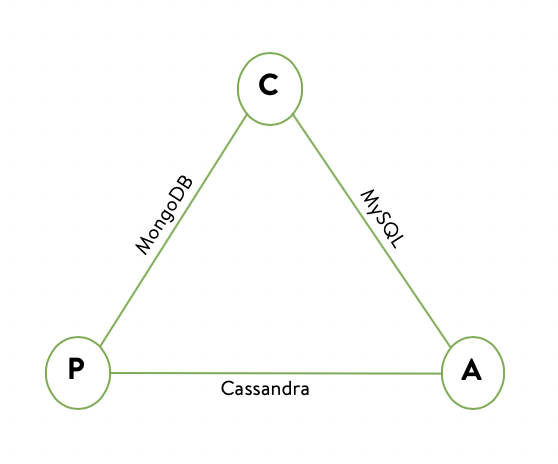

C、A、P分别代表了3个特性，不能全部共存，只能共存2个

##### C(consistency，一致性)

所有节点在同一时间的看到的数据相同

如：S1、S2上有a=0，然后client向S1修改了a=1，此时client再去S2读取a也要等于1 就是S1更改完值后要立即同步到S2

不同角度看：

- 客户端：并发来访问数据，都要能访问到最新值
- 服务务端：某个服务里的数据变化了，要更新到整个分布式系统，保证各个服务的数据是一致的

根据一致性程度分：

- 强一致性：更新后的值会被立即同步到整个系统，这会导致同步时访问服务会被阻塞
- 弱一致性：更新后的值没有立即同步到整个系统，但会在一定时间内同步好
- 最终一致性：是特殊的弱一致性，即达到同步的这一段时间会比较长，但保证最终数据都是一致的

##### A(availability，可用性)

只要用户发起请求，就要立即给出反应，读、写永远都能成功，即，服务一直可用

##### P(partition tolerance，分区容错性)

即使系统的某个分区遇到严重的故障，系统能继续提供服务，这是设计分布式系统的基础
所以P在分布式系统中一般是必备的，不然就和单机系统没区别了

##### 为什么3个特性不能共存

先假设P存在，则C(一致性)和A(可用性)就会矛盾了
`注意`：这里的一致性其实是针对强一致性，弱一致性和可用性还是可以共存的

> 分区容错下，多个服务间通信一定会有网络问题
>
> - 满足强一致性时，一定会有数据同步的阻塞时间，导致客户端访问被阻塞，就达不到可用性了
> - 满足可用性时，客户端访问要立即返回，这时数据还没同步好，得到的是不一致的数据

那假设P不存在，则CA可以共存，这就类似一个单机应用，没了分布式可言

#### ACID

关系型数据库事务的特性，其实它也是满足CA的情况

- 原子性（atomicity）

  执行单元中的操作要么全部执行成功，要么全部失败。如果有一部分成功一部分失败那么成功的操作要全部回滚到执行前的状态。

- 一致性（consistency）

  执行一次事务会使用数据从一个正确的状态转换到另一个正确的状态，执行前后数据都是完整的。

- 隔离性（isolation）

  在该事务执行的过程中，任何数据的改变只存在于该事务之中，对其他事物没有影响，事务与事务之间是完全的隔离的。只有事务提交后其它事务才可以查询到最新的数据。

- 持久性（durability）

  事务完成后对数据的改变会永久性的存储起来，即使发生断电宕机数据依然在。

#### BASE

这是CAP的延伸，权衡了可用性和一致性而提出的理论，相当于满足PA的情况

> 为什么说相当于呢，因为并没有完全舍弃C，只是舍弃强一致性，保留了最终一致性

下面说说BASE的各个特性

##### BA(basically vavilable，基本可用)

- 响应时间上：可能因为网络故障导致响应时间延长一点点
- 功能上：由于某个服务突然被大量访问，那新来的访问被降级到其他服务，如返回网络繁忙等等

##### S(soft state，软状态)

允许系统中的某些数据处于中间状态，且这些中间状态不影响整体的可用性，即允许各个节点之间的数据同步存在延迟

##### E(eventually consistent，最终一致性)

不能保证每时每刻访问的都是最新的数据，但保证一段时间后，最终数据都是一致的

#### 小结

所以CAP、ACID、BASE说的都是分布式系统设计的理论，还没具体地说到分布式事务的相关理论
从上面看来，貌似ACID、BASE是不能共存，不过在实际的系统设计中，根据各个功能的要求，有机地结合ACID、BASE，寻找最优的协调方案才是最合适的

#### 事务分类

刚性事务：通常无业务改造，强一致性，原生支持回滚/隔离性，低并发，适合短事务。

柔性事务：有业务改造，最终一致性，实现补偿接口，实现资源锁定接口，高并发，适合长事务。

- 刚性事务

  XA 协议（2PC、JTA、JTS）、3PC

- 柔型事务

  TCC/FMT、Saga（状态机模式、Aop模式）、本地事务消息、消息事务（半消息）

## 分布式事务的应用场景

分布式事务的应用场景

- 电商的订单和库存系统

  一般大型电商系统中，下单过程会被分为订单和库存会分为两个系统协作完成。

- 金融系统的银行充值扣款

  在众多的金融系统（支付宝/微信等）平台通过银行卡充值扣款，会由金融系统与银行系统协作完成。

- SNS系统的消息推送

  应用系统发送邮件或者短信，需要应用系统与通信系统（运营商）协作完成。

## DTP模型

这个模型主要使用了两段提交(2PC - Two-Phase-Commit)来保证分布式事务的完整性。

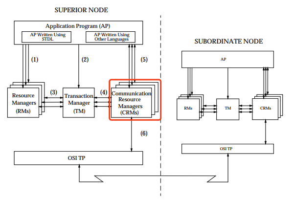

- AP是应用程序，应用程序。

  也就是业务层，定义事务边界并指定构成事务的操作。直白一点，哪些操作属于一个事务，就是AP定义的

- RM是资源管理器，主要负责管理每个数据库的连接数据源

  一般是数据库，也可以是其他的资源管理器，如消息队列(如JMS数据源)，文件系统等。提供对共享资源的访问。

- TM是事务管理器，负责事务的全局管理

  接收AP的事务请求，对全局事务进行管理，管理事务分支状态，协调RM的处理，通知RM哪些操作属于哪些全局事务以及事务分支等等。这个也是整个事务调度模型的核心部分。

- CRM是通信资源管理器，常见的通信资源管理器（ CRM ）是消息中间件

  CRM允许模型的一个实例访问当前TM域内部或外部的另一个实例。

### XA协议

是X/OPEN 提出的分布式事务处理规范。XA则规范了TM与RM之间的通信接口，在TM与多个RM之间形成一个双向通信桥梁，从而在多个数据库资源下保证ACID四个特性。基于数据库的XA协议来实现2PC又称为XA方案。

- RM,TM,AP之间的交互方式如下 ：
  1）TM向AP提供应用程序编程接口，AP通过TM提交及回滚事务。
  2）TM交易中间件通过XA接口来通知RM数据库事务的开始、结束以及提交、回滚等。
  总结 ：
  整个2PC的事务流程涉及到三个角色AP、RM、TM。AP指的是使用2PC分布式事务的应用程序；RM指的是资源管理器，它控制着分支事务；TM指的是事务管理器，它控制着整个全局事务。
  1）在准备阶段RM执行实际的业务操作，但不提交事务，资源锁定；
  2）在提交阶段TM会接收RM在准备阶段的执行回复，只要有任一个RM执行失败，TM会通知所有RM执行回滚操作，否则，TM将会通知所有RM提交该事务。提交阶段结束资源锁释放。
  XA方案的问题 ：
  1、需要本地数据库支持XA协议。
  2、资源锁需要等到两个阶段结束才释放，性能较差。

#### XA接口详解

X/Open XA接口是双向的系统接口，在事务管理器（Transaction Manager）以及一个或多个资源管理器（Resource Manager）之间形成通信桥梁。事务管理器控制着JTA事务，管理事务生命周期，并协调资源。在JTA中，事务管理器抽象为javax.transaction.TransactionManager接口，并通过底层事务服务（即JTS）实现。资源管理器负责控制和管理实际资源（如数据库或JMS队列）。

- 事务管理器、资源管理器，以及典型JTA环境中客户端应用之间的关系：

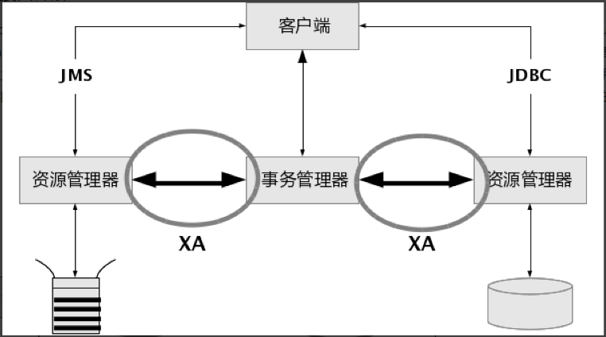

注意，上图中XA接口形成了事务管理器和资源管理器之间的通信桥梁。因为XA接口的双向特质，XA支持两阶段提交协议

#### 什么时候应该使用XA

最佳实践仅在同一个事务上下文中需要协调多种资源（即数据库，以及消息主题或队列）时，才有必要使用X/Open XA接口。

但仅当多个资源必须在同一个事务范畴内被协调时，才有必要用到XA。多个资源的情形包括访问两个或更多的数据库（并不止是多个表，而是彼此分开的多个数据库），或者一个数据库加上一个消息队列，又或者是多个消息队列。您可能有一个应用同时使用到一个数据库和一个消息队列。如果这些资源并不在同一个事务中使用，就没有必要去用XA。

如果是协调一个操作型数据库和一个只读数据库（即参考数据库），就不需要XA

- XA隐含的问题
  - 两阶段提交（2PC，two-phase commit process）
  - 经验异常
  - XA驱动的使用。

#### XA各个阶段的流程示意图

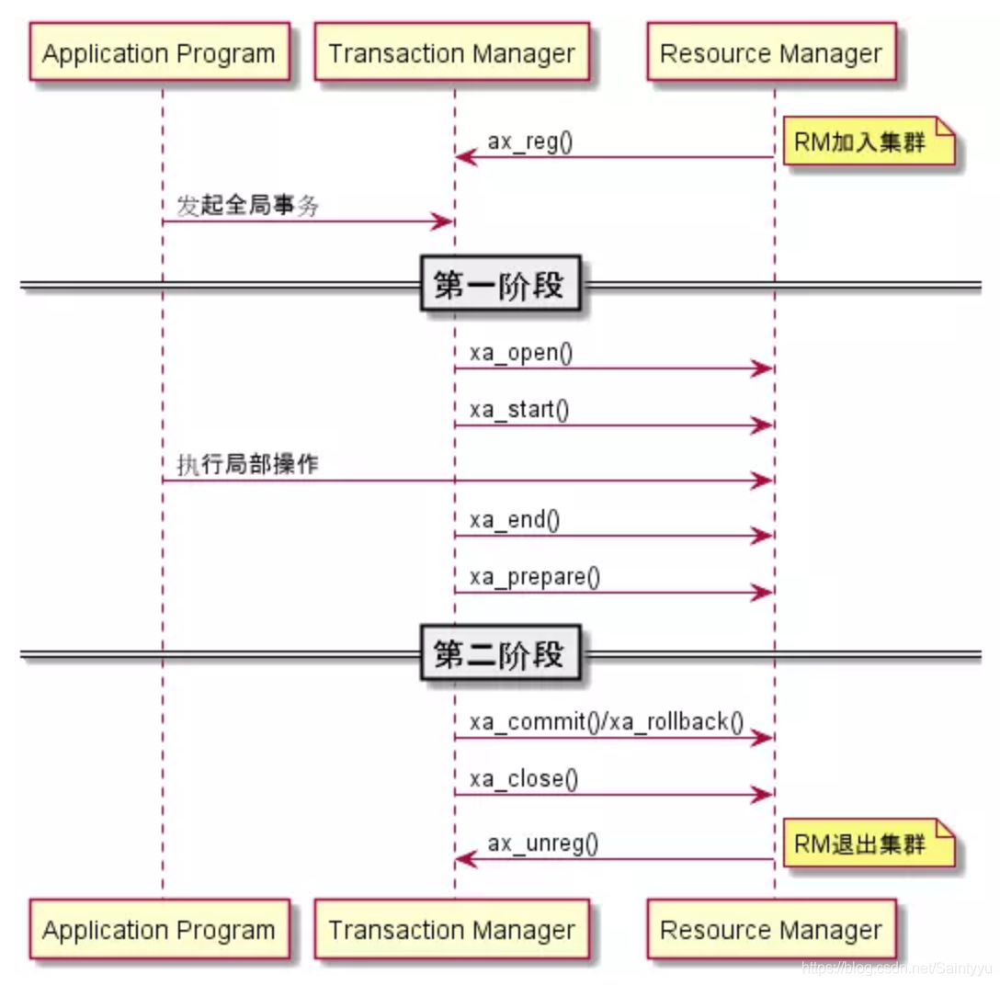

1. 在开始一个全局事务之前，涉及的RM必须通过ax_regr()，向TM注册以加入集群；对应的，在没有事务需要处理的时候，RM可以通过ax_unreg()向TM要求注销，离开集群。 

2.  TM在对一个RM执行xa_开头的具体操作前，必须先通过xa_open()打开这个RM（本质是建立对话）——这其实也是分配XID的一个行为；与之相应的，TM执行xa_close()来关闭RM。 

3.  TM对RM调用的xa_start()和xa_stop()这对组合，一般用于标记局部事务的开头和结尾。这里需要注意的有三点： 

4.  对于同一个RM，根据全局事务的要求，可以前后执行多对组合——比如，先标记一个流水账INSERT的局部事务操作，然后再标记账户UPDATE的局部事务操作。 

   也就是说，对同一个RM，在一个事务中可能会执行多次业务操作，其中有些业务操作可能会成功，有的则可能失败。每次业务操作的结果都会记录在当前XID所标记的事务上下文中，当AP通知TM结束事务时，TM通过两阶段来结束事务：先通过准备阶段询问业务操作是否都成功，然后再决定事务是该提交还是该回滚。因而可以说，DTP模型在使用2PC时，是将第一阶段进一步细分成了两个步骤：其一是业务操作阶段；其二是询问业务操作结果阶段。

5.  TM执行该组合只是起到标记事务的作用，具体的业务命令是由AP交给RM的。 

6.  该组合除了执行这些标记工作外，其实还能在RM中实现多线程的join/suspend/resume管理。 

7.  TM调用RM的xa_prepare()来进行第一阶段，调用xa_commit()或xa_rollback()执行第二阶段。

### TCC事务模型 VS DTP事务模型

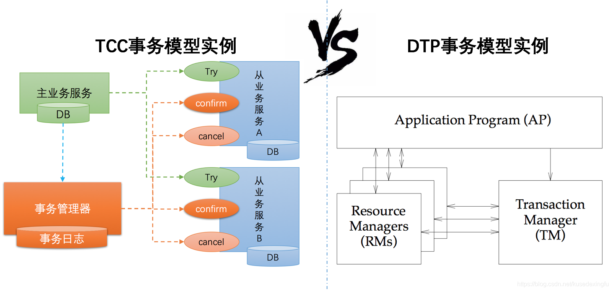

1、TCC模型中的主业务服务 相当于 DTP模型中的AP，TCC模型中的从业务服务 相当于 DTP模型中的RM
      在DTP模型中，应用AP操作多个资源管理器RM上的资源；而在TCC模型中，是主业务服务操作多个从业务服务上的资源。例如航班预定案例中，美团App就是主业务服务，而川航和东航就是从业务服务，主业务服务需要使用从业务服务上的机票资源。不同的是DTP模型中的资源提供者是类似于Mysql这种关系型数据库，而TCC模型中资源的提供者是其他业务服务。
2、TCC模型中，从业务服务提供的try、confirm、cancel接口 相当于 DTP模型中RM提供的prepare、commit、rollback接口
    XA协议中规定了DTP模型中定RM需要提供prepare、commit、rollback接口给TM调用，以实现两阶段提交。
    而在TCC模型中，从业务服务相当于RM，提供了类似的try、confirm、cancel接口。
3、事务管理器
     DTP模型和TCC模型中都有一个事务管理器。不同的是：
     在DTP模型中，阶段1的(prepare)和阶段2的(commit、rollback)，都是由TM进行调用的。
     在TCC模型中，阶段1的try接口是主业务服务调用(绿色箭头)，阶段2的(confirm、cancel接口)是事务管理器TM调用(红色箭头)。这就是 TCC 分布式事务模型的二阶段异步化功能，从业务服务的第一阶段执行成功，主业务服务就可以提交完成，然后再由事务管理器框架异步的执行各从业务服务的第二阶段。这里牺牲了一定的隔离性和一致性的，但是提高了长事务的可用性。

## 实现分布式事务解决方案

常见的分布式事务解决方案大致分为以下几种：

- 两阶段提交（2PC）
- 三阶段提交（3PC）
- 补偿事务（TCC）
- 本地消息表（异步确保）
- MQ 事务消息
- Sagas 事务模型

### 两阶段提交XA（2PC）

2PC即两段提交协议，是将整个事务提交分成两个阶段来完成：

- P-准备阶段（ Prepare phase ）
- C-提交阶段（ commit phase ）

两阶段提交由协调者和参与者组成，共经过两个阶段和三个操作

- 二阶段提交的算法思路：

  参与者将操作成败通知协调者，再由协调者根据所有参与者的反馈情况决定各参与者是否要提交操作还是中止操作。

##### 成功执行事务 执行过程

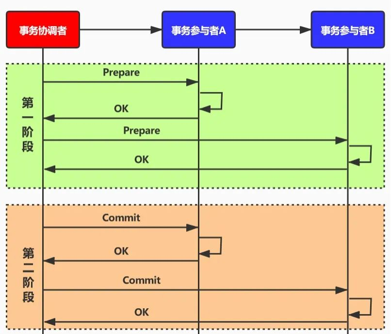

- 阶段一 准备阶段

  > ACK 确认字符，在数据通信中，接收站发给发送站的一种传输类控制字符。表示发来的数据已确认接收无误。只有当所有参与者返回yes时，才会进行阶段二。

- - 第一步：事务询问

    协调者向各个参与者发出事务请求，询问各个参与者是否可以执行事务提交操作，并开始等待各参与者的回复。

  - 第二步：执行事务

    写本地的undo和redo (此时还没有提交事务)。

  - 第三步：各参与者向协调者反馈事务询问结果。

- 阶段二：提交阶段

- - 第一步：发送提交请求

    协调者向所有参与者发送commit请求。

  - 第二步：事务提交

    参与者接收到commit请求后，会正式执行事务提交操作，并在完成事务提交之后释放所占用的所有资源。

  - 第三步：反馈事务提交结果

    完成事务提交操作，参与者向协调者发送Ack信息。

  - 第四步：完成事务

    事务协调者接收到所有参与者发送的Ack信息之后，完成事务操作。

##### 中断事务 执行过程

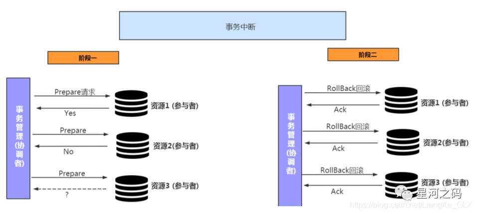

- 阶段一 准备阶段

  这一阶段与上述成功执行事务的准备阶段是一样的。

- - 第一步：事务询问

    协调者向各个参与者发出事务请求，询问各个参与者是否可以执行事务提交操作，并开始等待各参与者的回复。

  - 第一步：执行事务

    写本地的undo和redo (此时还还没有提交事务)。

  - 第一步：各参与者向协调者反馈事务询问结果。

- 阶段二：提交阶段

- - 第一步：发送回滚请求

    协调者向所有参与者发出 Rollback 请求。

  - 第二步：事务回滚

    参与者接收到 Rollback 请求后，会利用其在阶段一中记录的 Undo 信息来执行事务回滚操作，并在完成

    回滚之后释放在整个事务执行期间占用的资源。

  - 第三步：反馈事务回滚结果

    参与者在完成事务回滚之后，向协调者发送 Ack 信息。

  - 第四步：中断事务

    协调者接收到所有参与者反馈的 Ack 信息后，完成事务中断。

#### 解决方案

##### 传统XA方案

##### Seata-AT方案

AT 模式是增强型2pc模式

|                                                           |        XA        |         AT          |
| :-------------------------------------------------------: | :--------------: | :-----------------: |
|  [脏回滚](https://dtm.pub/practice/at.html#dirty-write)   |        无        |        存在         |
| [SQL支持度](https://dtm.pub/practice/at.html#sql-support) |     全部支持     |      部分支持       |
|    [脏读](https://dtm.pub/practice/at.html#dirty-read)    |        无        |         有          |
|   [应用侵入性](https://dtm.pub/practice/at.html#invade)   |      无侵入      |       无侵入        |
|   [性能](https://dtm.pub/practice/at.html#performance)    |       较低       |        较低         |
| [数据库支持](https://dtm.pub/practice/at.html#db-support) | 主流数据库都支持 | 理论上可扩展至NoSQL |

这是阿里开源项目Seata中的一种事务模式，在蚂蚁金服也被称为FMT。优点是该事务模式使用方式，类似XA模式，业务无需编写各类补偿操作，回滚由框架自动完成，该模式缺点也较多，一方面类似XA，存在较长时间的锁，不满足高并发的场景；另一方面存在脏回滚之类的问题，容易引发数据不一致。

###### 脏读

###### 脏回滚

#### 2PC优缺点

##### 优点

- 原理简单、实现方便
- 一定程度上保证了数据的强一致（无法100%保证强一致），适合对数据强一致要求很高的关键领域。

##### 缺点

- 同步阻塞

  所有事务参与者在等待其它参与者响应的时候都处于同步阻塞状态，无法进行其它操作。

- 单点问题

  协调者在 2PC 二阶段中用来控制事物的提交与回滚，发生故障将会造成很大影响。特别是在阶段二发生

  故障，所有参与者将会处于一直锁定事务资源的状态中，无法完成其它操作。

- 存在数据不一致问题

    当提交阶段协调者向所有的参与者发送 commit 请求之后，由于某些局部网络异常或者是协调者在尚未发

    送完所有 commit 请求之前自身发生了崩溃，导致最终只有部分参与者收到了 commit请求，将导致数据不一致问题。

### 三阶段提交（3PC）

3PC是2PC的改进版，将2PC的准备阶段一分为二，将事物执行过程分为三个阶段，以此保证在提交阶段之前，各参与者节点的状态都一致：

- 准备阶段（CanCommit）
- 预提交阶段（PreCommit）
- 提交阶段（DoCommit）

同时在协调者和参与者中都引入超时机制，当`参与者`各种原因未收到`协调者`的commit请求后，会对本地事务进行commit，不会一直阻塞等待，解决了`2PC`的单点故障问题，但`3PC`还是没能从根本上解决数据一致性的问题。

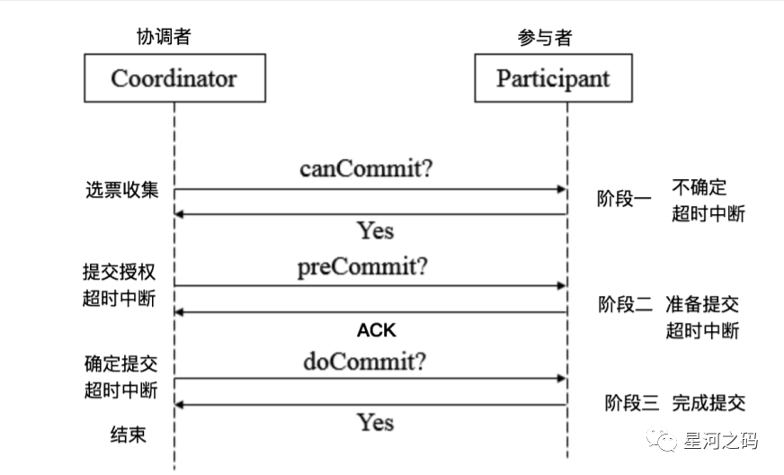

#### 三阶段提交执行流程

- 阶段一 CanCommit阶段

- - 协调者向所有参与者发出包含事务内容的CanCommit请求，询问是否可以提交事务，并等待所有参与者答复。
  - 参与者收到CanCommit请求后，如果认为可以执行事务操作，则反馈YES并进入预备状态，否则反馈NO。

- 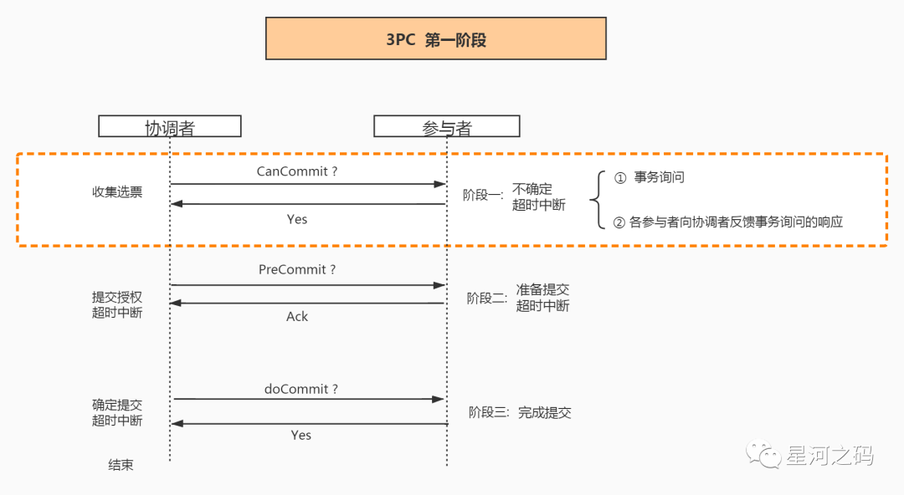

- 阶段二 PreCommit阶段

  此阶段分两种情况：

- - 事务预提交

    所有参与者在CanCommit阶段均反馈YES，即执行事务预提交。

  - 中断事务

    任何一个在参与者CanCommit阶段反馈NO，或者等待超时后协调者尚无法收到所有参与者的反馈，即执行中断事务。

- 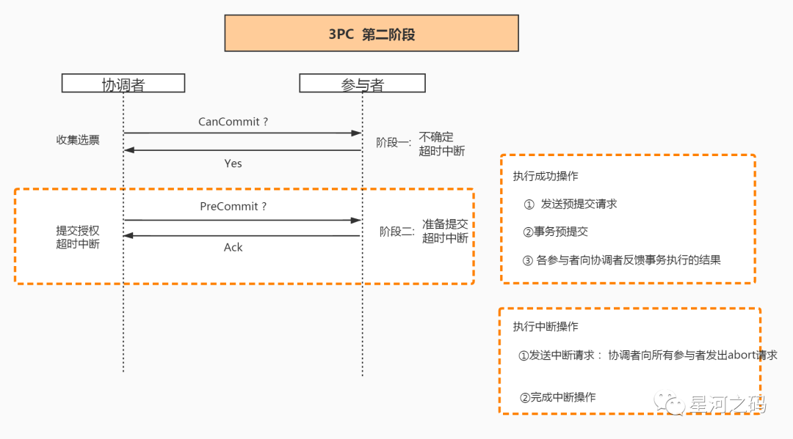

- 1. 协调者向所有参与者发出abort请求。
  2. 无论收到协调者发出的abort请求，或者在等待协调者请求过程中出现超时，参与者均会中断事务。
  3. 协调者向所有参与者发出PreCommit请求，进入预提交阶段。
  4. 参与者收到PreCommit请求后,执行事务操作,将Undo和Redo信息写入事务日志中（不提交事务）。
  5. 各参与者向协调者反馈Ack响应或No响应，并等待最终指令。

- 阶段三 DoCommit阶段

  此阶段也存在两种情况：

  进入阶段三后，无论协调者是否出现问题，或者协调者与参与者网络出现问题，都会导致参与者无法接收到协调者发出的do Commit请求或abort请求。此时，参与者都会在等待超时之后，继续执行事务提交。

- - 提交事务

    所有参与者均反馈Ack响应，即执行真正的事务提交。

  - 中断事务：

    任何一个参与者反馈NO，或者等待超时后协调者尚无法收到所有参与者的反馈，即中断事务。

    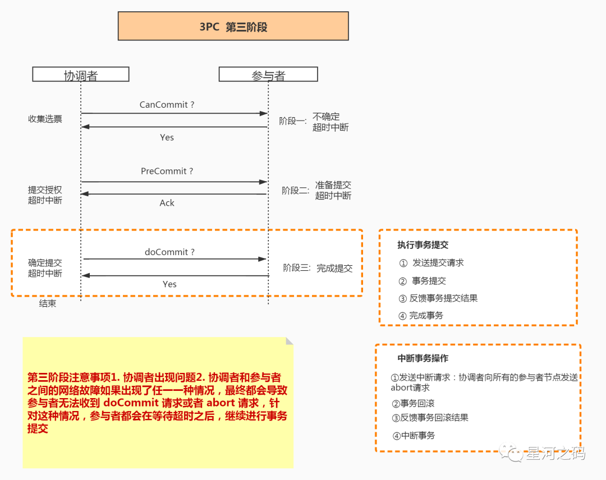

    1. 如果协调者处于工作状态，向所有参与者发出abort请求。
    2. 参与者使用阶段1中的Undo信息执行回滚操作，并释放整个事务期间占用的资源。
    3. 各参与者向协调者反馈Ack完成的消息。
    4. 协调者收到所有参与者反馈的Ack消息后，即完成事务中断。
    5. 如果协调者处于工作状态，则向所有参与者发出do Commit请求。
    6. 参与者收到do Commit请求后，会正式执行事务提交，并释放整个事务期间占用的资源。
    7. 各参与者向协调者反馈Ack完成的消息。
    8. 协调者收到所有参与者反馈的Ack消息后，即完成事务提交。

    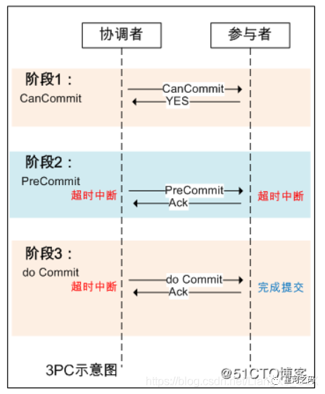

#### 3PC的优缺点

##### 优点

降低了阻塞范围，在等待超时后协调者或参与者会中断事务。

避免了协调者单点问题，阶段3中协调者出现问题时，参与者会继续提交事务。

##### 缺陷

脑裂问题依然存在，即在参与者收到PreCommit请求后等待最终指令，如果此时协调者无法与参与者正常通信，会导致参与者继续提交事务，造成数据不一致。

### 补偿事务（TCC）

TCC 其实就是采用的补偿机制，其核心思想是：针对每个操作，都要注册一个与其对应的确认和补偿（撤销）操作。它分为三个阶段：

- Try 阶段主要是对业务系统做检测及资源预留
- Confirm 阶段主要是对业务系统做确认提交，对try阶段预留的资源正式执行，默认 Confirm阶段是不会出错的。即：只要Try成功，Confirm一定成功。
- Cancel 阶段主要是在业务执行错误，需要回滚的状态下执行的业务取消，预留资源释放。

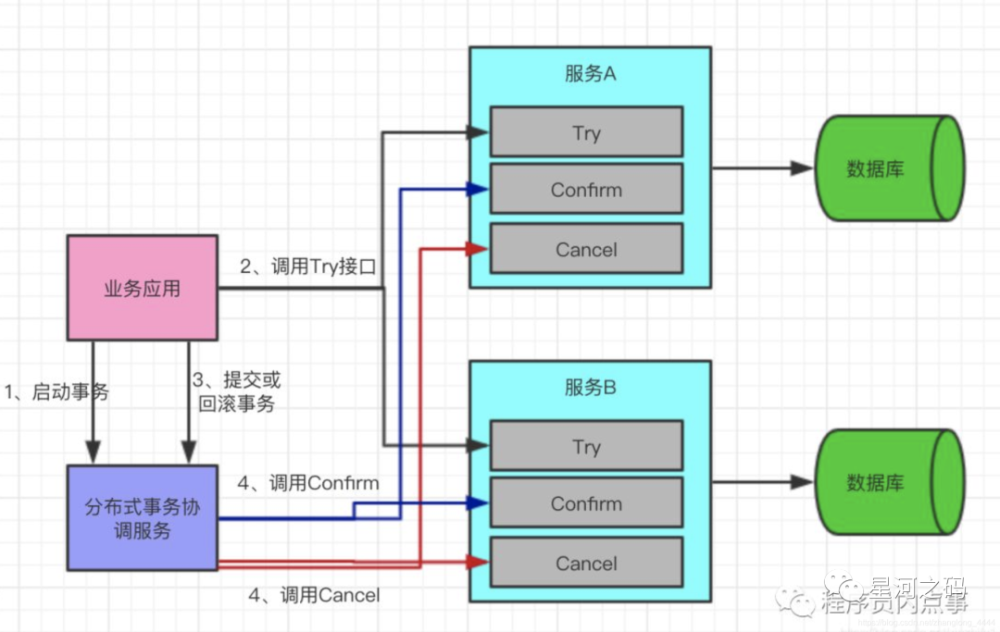

TCC的Confirm/Cancel阶段在业务逻辑上是不允许返回失败的，如果因为网络或者其他临时故障，导致不能返回成功，TM会不断的重试，直到Confirm/Cancel返回成功。

#### TCC特点

- 并发度较高，无长期资源锁定。
- 开发量较大，需要提供Try/Confirm/Cancel接口。
- 一致性较好，不会发生SAGA已扣款最后又转账失败的情况
- TCC适用于订单类业务，对中间状态有约束的业务

#### 解决方案

##### Seata-TCC

#### 异常情况

##### 空回滚

　　在没有调用 TCC 资源 Try 方法的情况下，调用了二阶段的 Cancel 方法，Cancel 方法需要识别出这是一个空回滚，然后直接返回成功。

　　出现原因是当一个分支事务所在服务宕机或网络异常，分支事务调用记录为失败，这个时候其实是没有执行Try阶段，当故障恢复后，分布式事务进行回滚则会调用二阶段的Cancel方法，从而形成空回滚。

##### 幂等性

幂等性是指同一个操作无论请求多少次，其结果都相同。

幂等操作实现方式有：

- 操作之前在业务方法进行判断如果执行过了就不再执行。
- 缓存所有请求和处理的结果，已经处理的请求则直接返回结果。
- 在数据库表中加一个状态字段（未处理，已处理），数据操作时判断未处理时再处理。

##### 悬挂

悬挂就是对于一个分布式事务，其二阶段 Cancel 接口比 Try 接口先执行。

　　出现原因是在 RPC 调用分支事务try时，先注册分支事务，再执行RPC调用，如果此时 RPC 调用的网络发生拥堵，RPC 超时以后，TM就会通知RM回滚该分布式事务，可能回滚完成后，Try 的 RPC 请求才到达参与者真正执行。

下面看一个网络异常的时序图，更好的理解上述几种问题

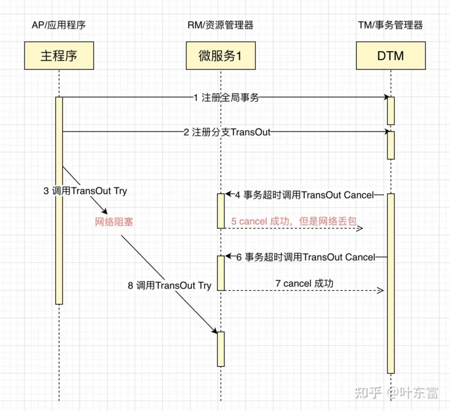

- 业务处理请求4的时候，Cancel在Try之前执行，需要处理空回滚
- 业务处理请求6的时候，Cancel重复执行，需要幂等
- 业务处理请求8的时候，Try在Cancel后执行，需要处理悬挂

面对上述复杂的网络异常情况，目前看到各家建议的方案都是业务方通过唯一键，去查询相关联的操作是否已完成，如果已完成则直接返回成功。相关的判断逻辑较复杂，易出错，业务负担重。

#### TCC的优缺点

##### 优点

最终保证数据的一致性，在业务层实现事务控制，灵活性好。

##### 缺点

应用侵入性强：TCC由于基于在业务层面，导致每个操作都需要有 `try`、`confirm`、`cancel`三个接口。

开发难度大：代码开发量很大，要保证数据一致性 `confirm`和 `cancel`接口还必须实现幂等性。

> 注意：TCC的try/confirm/cancel接口都要实现幂等性，在为在try、confirm、cancel失败后要不断重试。

### 本地消息表（异步确保）

本地消息表这种实现方式应该是业界使用最多的，其核心思想是将分布式事务拆分成本地事务进行处理，这种思路是来源于ebay。我们可以从下面的流程图中看出其中的一些细节：

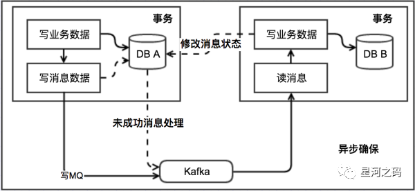

写本地消息和业务操作放在一个事务里，保证了业务和发消息的原子性，要么他们全都成功，要么全都失败。

#### 基本思路

- 消息生产方

  需要额外建一个消息表，并记录消息发送状态。消息表和业务数据要在一个事务里提交，也就是说他们要在一个数据库里面。然后消息会经过MQ发送到消息的消费方。如果消息发送失败，会进行重试发送。

- 消息消费方

  需要处理这个消息，并完成自己的业务逻辑。此时如果本地事务处理成功，表明已经处理成功了，如果处理失败，那么就会重试执行。如果是业务上面的失败，可以给生产方发送一个业务补偿消息，通知生产方进行回滚等操作。

- 生产方和消费方定时扫描本地消息表

  把还没处理完成的消息或者失败的消息再发送一遍。如果有靠谱的自动对账补账逻辑，这种方案还是非常实用的。

这种方案遵循BASE理论，采用的是最终一致性，比较适合实际业务场景的，即不会出现像2PC那样复杂的实现(当调用链很长的时候，2PC的可用性是非常低的)，也不会像TCC那样可能出现确认或者回滚不了的情况。

#### 容错机制

- 扣减余额事务 失败时，事务直接回滚，无后续步骤
- 轮序生产消息失败， 增加余额事务失败都会进行重试

#### 特点

- 不支持回滚
- 轮询生产消息难实现，如果定时轮询会延长事务总时长，如果订阅binlog则开发维护困难

适用于可异步执行的业务，且后续操作无需回滚的业务

#### 本地消息表优缺点

##### 优点

一种非常经典的实现，避免了分布式事务，实现了最终一致性。在 .NET中 有现成的解决方案。

##### 缺点

消息表会耦合到业务系统中，如果没有封装好的解决方案，会有很多杂活需要处理。

### MQ 事务消息

有一些第三方的MQ是支持事务消息的，比如RocketMQ，他们支持事务消息的方式也是类似于采用的二阶段提交，但是市面上一些主流的MQ都是不支持事务消息的，比如 RabbitMQ 和 Kafka 都不支持。

以阿里的 RocketMQ 中间件为例，其思路大致为：

- 第一阶段Prepared消息，会拿到消息的地址。
- 第二阶段执行本地事务，
- 第三阶段通过第一阶段拿到的地址去访问消息，并修改状态。

在业务方法内要想消息队列提交两次请求，一次发送消息和一次确认消息。如果确认消息发送失败了RocketMQ会定期扫描消息集群中的事务消息，这时候发现了Prepared消息，它会向消息发送者确认，所以生产方需要实现一个check接口，RocketMQ会根据发送端设置的策略来决定是回滚还是继续发送确认消息。这样就保证了消息发送与本地事务同时成功或同时失败。

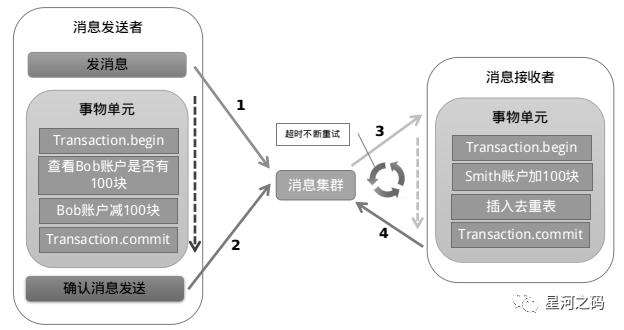

#### 事务消息发送及提交

- 发送消息（half消息）
- 服务端存储消息，并响应消息的写入结果
- 根据发送结果执行本地事务（如果写入失败，此时half消息对业务不可见，本地逻辑不执行）
- 根据本地事务状态执行Commit或者Rollback（Commit操作发布消息，消息对消费者可见）

#### 补偿流程

对没有Commit/Rollback的事务消息（pending状态的消息），从服务端发起一次“回查”
Producer收到回查消息，返回消息对应的本地事务的状态，为Commit或者Rollback
事务消息方案与本地消息表机制非常类似，区别主要在于原先相关的本地表操作替换成了一个反查接口

#### 特点

- 长事务仅需要分拆成多个任务，并提供一个反查接口，使用简单
- 事务消息的回查没有好的方案，极端情况可能出现数据错误

适用于可异步执行的业务，且后续操作无需回滚的业务

#### MQ 事务消息优缺点

##### 优点

实现了最终一致性，不需要依赖本地数据库事务。

##### 缺点

实现难度大，主流MQ不支持，没有.NET客户端，RocketMQ事务消息部分代码也未开源

### Sagas 事务模型

- 什么是Saga

  Saga事务模型又叫做长时间运行的事务（Long-running-transaction）, 它是由普林斯顿大学的H.Garcia-Molina等人提出，它描述的是另外一种在没有两阶段提交的的情况下解决分布式系统中复杂的业务事务问题。

  该模型其核心思想就是拆分分布式系统中的长事务为多个短事务，或者叫多个本地事务，然后由 Sagas 工作流引擎负责协调，如果整个流程正常结束，那么就算是业务成功完成，如果在这过程中实现失败，每个本地事务有相应的执行模块和补偿模块，那么Sagas工作流引擎就会以相反的顺序调用补偿操作，重新进行业务回滚，达到事务的最终一致性。

  它与2PC不同，2PC是同步的，而Saga模式是异步和反应性的。在Saga模式中，分布式事务由所有相关微服务上的异步本地事务完成。微服务通过事件总线相互通信。

因为长事务被拆分了很多个业务流，所以 Sagas 事务模型最重要的一个部件就是工作流或者也可以叫流程管理器（Process Manager），工作流引擎和Process Manager虽然不是同一个东西，但是在这里，他们的职责是相同的。在选择工作流引擎之后，最终的代码也许看起来是这样的

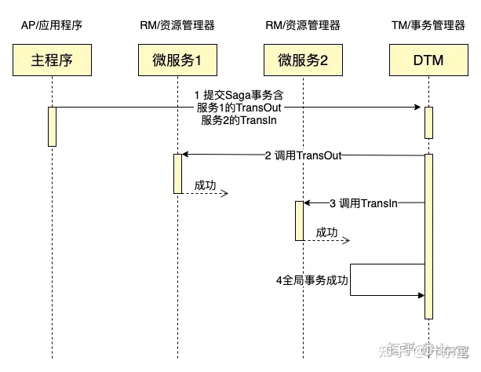

Saga一旦到了Cancel阶段，那么Cancel在业务逻辑上是不允许失败了。如果因为网络或者其他临时故障，导致没有返回成功，那么TM会不断重试，直到Cancel返回成功。

#### 特点

- 并发度高，不用像XA事务那样长期锁定资源
- 需要定义正常操作以及补偿操作，开发量比XA大
- 一致性较弱，对于转账，可能发生A用户已扣款，最后转账又失败的情况

#### 解决方案

##### Seata-SAGA

#### Saga模式优缺点

##### 优点

Saga模式的一大优势是它支持长事务。因为每个微服务仅关注其自己的本地原子事务，所以如果微服务运行很长时间，则不会阻止其他微服务。这也允许事务继续等待用户输入。此外，由于所有本地事务都是并行发生的，因此任何对象都没有锁定。

##### 缺点

为了解决Saga模式的复杂性问题，将流程管理器添加为协调器是很正常的。流程管理器负责监听事件和触发端点。

- - Saga模式很难调试，特别是涉及许多微服务时。此外，如果系统变得复杂，事件消息可能变得难以维护。

  - Saga模式的另一个缺点是它没有读取隔离。

    > 例如，客户可以看到正在创建的订单，但在下一秒，订单将因补偿交易而被删除。

- 结论

  Saga模式是解决基于微服务的体系结构的分布式事务问题的优选方式。

  但是它还引入了一些新的问题，例如

  1.如何以原子方式更新数据库并发出事件。

  2.采用Saga模式需要改变开发和测试的思维方式。

### 最大努力通知

发起通知方通过一定的机制最大努力将业务处理结果通知到接收方。具体包括：

有一定的消息重复通知机制。因为接收通知方可能没有接收到通知，此时要有一定的机制对消息重复通知。
消息校对机制。如果尽最大努力也没有通知到接收方，或者接收方消费消息后要再次消费，此时可由接收方主动向通知方查询消息信息来满足需求。
前面介绍的的本地消息表和事务消息都属于可靠消息，与这里介绍的最大努力通知有什么不同？

可靠消息一致性，发起通知方需要保证将消息发出去，并且将消息发到接收通知方，消息的可靠性关键由发起通知方来保证。

最大努力通知，发起通知方尽最大的努力将业务处理结果通知为接收通知方，但是可能消息接收不到，此时需要接收通知方主动调用发起通知方的接口查询业务处理结果，通知的可靠性关键在接收通知方。

解决方案上，最大努力通知需要：

- 提供接口，让接受通知放能够通过接口查询业务处理结果
- 消息队列ACK机制，消息队列按照间隔1min、5min、10min、30min、1h、2h、5h、10h的方式，逐步拉大通知间隔 ，直到达到通知要求的时间窗口上限。之后不再通知

最大努力通知适用于业务通知类型，例如微信交易的结果，就是通过最大努力通知方式通知各个商户，既有回调通知，也有交易查询接口

###### 来源：

https://www.modb.pro/db/429731

https://segmentfault.com/a/1190000040321750

https://blog.csdn.net/weixin_40857593/article/details/121451951

https://zhuanlan.zhihu.com/p/93459200

https://blog.csdn.net/truelove12358/article/details/107266465

https://www.cnblogs.com/agilestyle/p/11623047.html

https://cloud.tencent.com/developer/article/1903537

https://cloud.tencent.com/developer/article/1541686

X/Open XA接口规范 http://www.opengroup.org/onlinepubs/009680699/toc.pdf

https://www.6aiq.com/article/1535548571818

https://www.ai2news.com/blog/1573709/

https://seata.io/zh-cn/docs/dev/mode/at-mode.html

https://medium.com/@pranabj.aec/acid-cap-and-base-cc73dee43f8c

https://monkeysayhi.github.io/2018/03/09/分布式理论：CAP、BASE与ACID/

https://dtm.pub/practice/at.html#原理

https://blog.csdn.net/kusedexingfu/article/details/103484198
