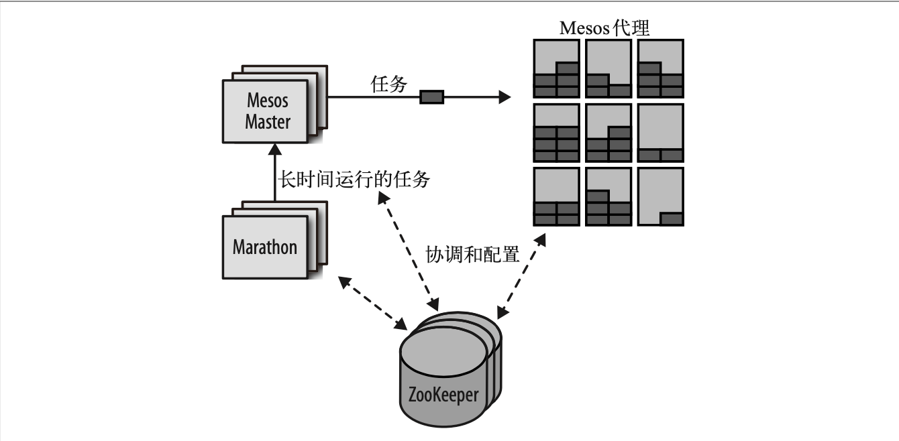
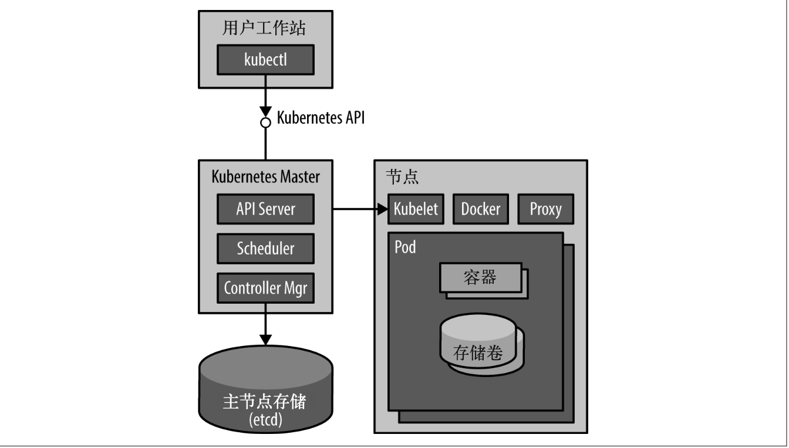
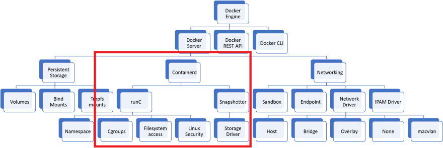
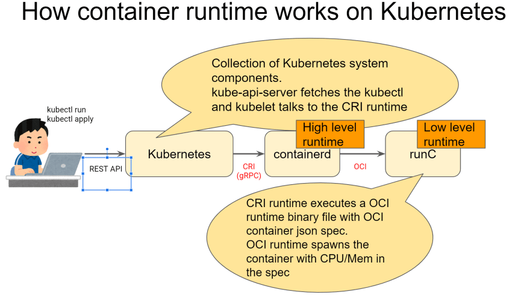

# Docker-Kubernetes关联与演变

## Docker

### 什么是Docker

是指容器化技术，用于支持创建和使用 [Linux® 容器](https://www.redhat.com/zh/topics/containers)

### 为什么使用Docker

- 更高效的利用系统资源
- 更快速的启动时间
- 一致的运行环境
- 持续交付和部署
- 更轻松的迁移
- 更轻松的维护和扩展

### Docker基本概念

- 镜像（`Image`）

- 容器（`Container`）

  容器的实质是进程

- 仓库（`Repository`）

<!-- more -->

### Docker原理

Docker 技术使用[ Linux 内核](https://www.redhat.com/zh/topics/linux/what-is-the-linux-kernel)和内核功能（例如 [Cgroups](https://access.redhat.com/documentation/en-US/Red_Hat_Enterprise_Linux/6/html/Resource_Management_Guide/ch01.html) 和 [namespaces](https://lwn.net/Articles/528078/)）来分隔进程，以便各进程相互独立运行。这种独立性正是采用容器的目的所在；它可以独立运行多种进程、多个应用，更加充分地发挥基础设施的作用，同时保持各个独立系统的[安全性](https://www.redhat.com/zh/topics/security)。

Docker 守护进程通过一个“执行驱动程序”(execution driver)来创建容器。默认情况下， 它是 Docker 项目自行开发的 runc 驱动程序，但仍支持旧有的 LXC。runc 与下面提到的内 核功能密不可分。

libcontainer代码， 这是关于容器运行时标准的早期实现。这个运行时被称为 runc

- cgroups，负责管理容器使用的资源(例如 CPU 和内存的使用)。它还负责冻结和解冻 容器这两个 docker pause 命令所需的功能

- Namespaces(命名空间)，负责容器之间的隔离;它确保系统的其他部分与容器的文件 系统、主机名、用户、网络和进程都是分开的。

- 底层技术就是UFS(联合文件系统)，它负责储 存容器的镜像层。UFS 由数个存储驱动中的其中之一提供，可以是 AUFS、devicemapper、 BTRFS 或 Overlay。

Libcontainer 还支持 SElinux 和 AppArmor，它们可以给容器更稳固的安全保障

### Docker辅助技术

- Compose
  Docker Compose 是负责构建和运行由多个 Docker 容器所组成的应用程序的工具。它主要用于开发和测试，而不太用于生产

- Swarm

  Docker 的集群方案。Swarm 可以把多个 Docker 主机组合起来，使其资源能整合为一 体

- Libnetwork

  整个网络部分的功能都是通过 Docker 拆分出来的 libnetwork 实现的，它提供了一个连接不同容器的实现，同时也能够为应用给出一个能够提供一致的编程接口和网络层抽象的容器网络模型。

- 服务发现

  当 Docker 容器启动时，它需要通过某种方法来找出与之通信的服务，而这些服务一般 也是运行在容器内的。容器的 IP 地址是动态分配的，因此在大型系统中要解决这个问 题并非易事。 这方面的解决方案包括 Consul、Registrator、SkyDNS， 以及 etcd。

- 服务编排及集群管理

  在大型的容器部署上的监控和管理系统的工具必不可少。 系统需要对故障的出现或负 载的改变作出反应，实际情况下可能是搬迁、启动或停止容器。 包括来自谷歌的 Kubernetes、Marathon 来自 Mesos的 框 架 ]、 CoreOS 的 Fleet，以及 Docker 自家的 Swarm

- 数据卷插件(volume plugin)

  用于与其他 存储系统集成。比较著名的数据卷插件有 Flocker，以及用于分布式存储的 GlusterFS

## 编排、集群和管理

- 集群(Clustering) 

  把“主机”组合并通过网络连接起来，虚拟机或裸机皆可。集群看起来应该像一个单一资源，而不是一组互不相干的机器。

- 编排(Orchestration) 

  协调各组件使它们共同运作。在适合的主机上启动容器并把它们连接起来。编排系统也可能包括扩展的支持、自动故障切换，以及节点的负载均衡。 

- 管理(Management)

   监督系统及支持各种管理任务。

### Docker-Compose

责实现对 Docker 容器集群的快速编排(单机)

`Compose` 定位是 「定义和运行多个 Docker 容器的应用（Defining and running multi-container Docker applications）

#### 特征

撰写使其有效的功能包括：

- [单个主机上的多个隔离环境](https://docs.docker.com/compose/#multiple-isolated-environments-on-a-single-host)
- [创建容器时保留卷数据](https://docs.docker.com/compose/#preserve-volume-data-when-containers-are-created)
- [仅重新创建已更改的容器](https://docs.docker.com/compose/#only-recreate-containers-that-have-changed)
- [变量和在环境之间移动组合](https://docs.docker.com/compose/#variables-and-moving-a-composition-between-environments)

#### 重要的概念

- 服务 (`service`)：一个应用的容器，实际上可以包括若干运行相同镜像的容器实例。
- 项目 (`project`)：由一组关联的应用容器组成的一个完整业务单元，在 `docker-compose.yml` 文件中定义。

### Docker Swarm

Docker Swarm是一个由Docker开发的调度框架。

Swarm 的基本架构相当简单:每台主机上运行一个 Swarm 的代理(agent)，以及在一台主 机上运行一个 Swarm 的主管(manager，对于小规模的测试集群，这台主机也可以同时运 行代理)。主管负责所有主机上容器的编排和调度。Swarm 能够以高可用性模式运行，通 过利用 etcd、Consul 或 ZooKeeper，使得故障发生时能够切换到备份的主管主机。Swarm把寻找主机和将主机加入集群称为发现(discovery)，这个功能有好几种实现方法，其中 默认使用的是基于令牌(token)的方法，它会把主机的地址保存在 Docker Hub 的一个列 表上。

#### 过滤器(filter)

过滤器 的作用是控制哪些节点可用于运行容器，有几种过滤器是默认使用的

为了在节点子集中调度容器，Swarm提供了两个节点过滤器（constraint和health），还有三个容器配置过滤器（affinity，dependency和port）。

- 约束过滤器（Constraint filter）

  约束(constraint)过滤器可按键值对挑选可用的节点子集，也可用于过滤各种主机信息，例如主机名、存储驱动和操作系统。

  这个过滤器还可以安排容器在特定的地域(例如 constraint:region!=europe)或特定的硬 件上(例如 constraint:disk==ssd 或 constraint:gpu==true)启动

- 健康过滤器（Health filter）

  只安排容器运行在“健康的”(healthy)主机上。

- 关联过滤器（Affinity filter）

  允许用户定义容器与其他容器或主机之间的“吸引度”。例如，可以指定容器必须与某 个已存在的容器共同安排在一台主机上，或指定容器只能在已经下载了某个镜像的主机 上运行。

- 依赖过滤器（Dependency filter）

  编排容器时会把依赖它的其他容器一同安排(例如，与它共享数据卷的容器，或互相连接的容器，将会被安排在相同的主机上运行)。

- 端口过滤器（Port filter）

  如果你想要在具有特定开发端口的节点上运行容器，你就可以使用端口过滤器了。如果集群中没有任何一个节点该端口可用的话，系统就会给出一个错误的提示信息。

#### 策略(Strategies)

Swarm采用了三个策略（比如说，策略可以是如何选择一个节点来运行容器）[22]:

- 分散(spread) 将容器放置在负载最小的主机上。
- 集装(binpack) 将容器放置在负载最多且还有可用空间的容器上。
- 随机(random) 将容器随机安排在任何主机上。

分散策略使容器均匀地分布到所有主机上。这种方法的主要优点是，当主机停机时，受影 响的容器数量将降到最少。集装策略将会尽可能利用主机，从而优化机器的使用率。随机 策略主要用于调试。

如果多个节点被选中，调度器会从中随机选择一个。在启动管理器（manager）时，策略需要被定义好，否则“spread”策略会被默认使用。

### Apache Mesos & Mesosphere Marathon

Mesos 的架构围绕高可用性和高度复原能力而设计。

#### Mesos 

集群的主要组成部分列举如下。 

- Mesos 代理节点(agent node)

  负责实际运行任务。所有代理把它们的可用资源提交给 master。一般会有几十到上千个 代理节点。

- Mesos master

  负责把任务分发至代理，并维护一个可用资源列表，以供框架使用。master 按分配策 略决定可提供多少资源。通常有两个或四个备用的 master，以备故障发生时可以随时 替换。

- ZooKeeper
   用于选举以及查找当前 master 的地址。通常有三个或五个 ZooKeeper 实例处于运行状态，以确保高可用性以及应对故障发生。 

- 框架(framework)

  框架通过与 master 协调，把任务安排到代理节点上运行。框架由两部分组成:executor 和 scheduler，前者运行在代理之中，负责执行任务，后者需要通过 master 注册，并根 据 master 提供的可用资源信息来选择使用的资源。在一个 Mesos 集群中，为了处理不 同类型的任务，可能有多个框架运行着。任务的提交应该向框架提出，而不应直接向 Mesos 提交。

Mesos主服务器使用Zookeeper进行服务选举和发现。它有一个注册器记录了所有运行任何和从服务器信息，使用MultiPaxos进行日志复制实现一致性。

Mesos有一个从服务器恢复机制，无论什么时候一个从服务器死机了，用户的任务还是能够继续运行，从服务器会将一些关键点信息如任务信息 状态更新持久化到本地磁盘上，重新启动时可以从磁盘上恢复运行这些任务(类似Java中的钝化和唤醒)

#### Marathon

针对长时间运行的应 用程序而设计，用于应用的启动、监控和扩展。Marathon 启动应用的设计非常灵活，甚至 可以用来启动其他诸如 Chronos(即“cron”的数据中心版本)的辅助框架。Marathon 直 接支持 Docker 容器，使它成为一个运行 Docker 容器不错的框架。与之前介绍过的其他编 排框架一样，Marathon 支持各种关联度和约束的规则。客户端通过 REST API 与 Marathon进行交互。其他功能还包括健康检查，以及可用于集成负载均衡器或分析数据的事件流

上图展示了一个使用 Marathon 框架作为调度器的 Mesos 集群。Marathon 调度器通 过 ZooKeeper 找到当前的 Mesos master，并将任务提交给它。Marathon 调度器和 Mesos master 都有后备的进程运行着，以备 master 不可用时还能准备开始工作。

通常 ZooKeeper 与 Mesos master 和它的后备进程运行在同一台主机上。在小型的集群中， 主机上还可以运行代理，但规模较大的集群则需要与 master 进行通信，使得这样做不太可 行。Marathon 也可以在相同的主机上运行，或运行在网络边界的其他主机上，成为客户端 的接入点，从而使客户端与 Mesos 集群本身分开。

#### 约束（Constraints）

约束使得操作人员能够操控应用在哪些节点上运行，它主要由三个部分组成：一个字段名（field name）（可以是slavve的hostname或者任何Mesos slave属性），一个操作符和一个可选的值。5个操作符如下：

操作符：角色（role）

- UNIQUE：使得属性唯一，比如说越苏[“hostname”,”UNIQUE”]使得每个host上只有一个应用在运行。
- CLUSTER：使得运行应用的slaves必须共享同一个特定属性。比如说约束 [“rack id”, “CLUSTER”, “rack-1”] 强制应用必须运行在rack-1上，或者处于挂起状态知道rack-1有了空余的CPU/RAM。
- GROUP_BY：根据某个特性的属性，将应用平均分配到节点上，比如说特定的host或者rack。
- LIKE：使得应用只运行在拥有特定属性的slaves上。尽管只有CLUSTER可用，但由于参数是一个正则表达式，因此很多的值都能够被匹配到。
- UNLIKE：和LIKE相反。

#### 健康检查（Health checks）

健康检查是应用依赖的，需要被手动实现。这是因为只有开发者知道他们自己的应用如何判断健康状态。（这是一个Swarm和Mesos之间的不同点）

Mesos提供了很多选项来声明每个健康检查之间需要等待多少秒，或者多少次连续的健康检查失败后，这个不健康的任务需要被终结。

#### 服务发现和负载均衡（Service discovery and load balancing）

为了能够发送数据到正在运行的应用，我们需要服务发现。Apache Mesos提供了基于DNS的服务发现，称之为Mesos-DNS[44]，它能够在多个框架（不仅仅是Marathon）组成的集群中很好的工作。

如果一个集群只由运行容器的节点组成，Marathon足以承当起管理的任务。在这种情况下，主机可以运行一个TCP的代理，将静态服务端口的连接转发到独立的应用实例上。Marathon确保所有动态分配的服务端口都是唯一的，这种方式比手动来做好的多，毕竟多个拥有同样镜像的容器需要同一个端口，而这些容器可以运行在同一个主机上。

### Kubernetes

Kubernetes是一个Docker容器的编排系统，它使用label和pod的概念来将容器换分为逻辑单元。

#### 增强功能

- 可靠的容器重启
   Kubernetes 可以监视容器的运行状况，并在出现故障时重新启动容器。

- 自愈
  如果一个节点失效了，Kubernetes 管理系统会自动将失效节点上的任务重新调度到健康 的节点上。动态服务归属机制可以确保这些新启动的容器能被发现并使用。

- 高集群利用率

  通过在一组通用的计算机上调度一组不同类型的工作负载，与静态的手动配置方式相比，用户可以大幅提高计算机的利用率。集群越大，工作负荷种类越多，计算机的利用率就越高。

- 组织和分组
   在大型集群中，追踪所有正在运行的容器可能非常困难。Kubernetes 提供了一个灵活 的标签(label)系统，让用户和其他系统可以以一组容器为单位来进行处理。此外， Kubernetes 支持命名空间功能，让不同的用户或团队在集群中看到相互隔离的不同视图。

- 水平扩展和复制
   Kubernetes 的目标是让横向扩展能够轻松进行。扩展和负载平衡都是大规模计算机中最 基本的概念。

- 微服务友好
   Kubernetes 集群是采用微服务架构团队的一个完美伴侣。应用程序可以被分解成更易于开发、扩展和推导的更小单位。Kubernetes 提供了服务发现以及与其他服务进行通信的 方式。

- 简化运维
   Kubernetes 可以由专门的团队来负责运维。对 Kubernetes 集群和其所运行节点的管理可以由专门的团队来负责或外包给云服务。指定应用程序的运维团队(或者开发团队自 己)可以专注于应用程序的运行，而不必去具体地管理各个节点。

#### 基本概念

- 节点（`Node`）：一个节点是一个运行 Kubernetes 中的主机。
- 容器组（`Pod`）：一个 Pod 对应于由若干容器组成的一个容器组，同个组内的容器共享一个存储卷(volume)。
- 容器组生命周期（`pos-states`）：包含所有容器状态集合，包括容器组状态类型，容器组生命周期，事件，重启策略，以及 replication controllers。
- Replication Controllers：主要负责指定数量的 pod 在同一时间一起运行。
- 服务（`services`）：一个 Kubernetes 服务是容器组逻辑的高级抽象，同时也对外提供访问容器组的策略。
- 卷（`volumes`）：一个卷就是一个目录，容器对其有访问权限。
- 标签（`labels`）：标签是用来连接一组对象的，比如容器组。标签可以被用来组织和选择子对象。
- 接口权限（`accessing_the_api`）：端口，IP 地址和代理的防火墙规则。
- web 界面（`ux`）：用户可以通过 web 界面操作 Kubernetes。
- 命令行操作（`cli`）：`kubectl`命令。

#### Kubernetes架构（V1.2.0之前）

##### 控制平面

###### 主节点服务

- Kubernetes master 服务
   这些集中式服务(可以在 Docker 容器中运行)提供了 API 来收集和展现群集的当前状 态，并在节点之间分配 pod。大多数用户将始终与 master API 直接交互。这为整个集群 提供了一个统一视图。
  - `apiserver` 是整个系统的对外接口，提供一套 RESTful 的 [Kubernetes API](https://kubernetes.io/zh/docs/concepts/overview/kubernetes-api/)，供客户端和其它组件调用；
  - `scheduler` 负责对资源进行调度，分配某个 pod 到某个节点上。是 pluggable 的，意味着很容易选择其它实现方式；
  - `controller-manager` 负责管理控制器，包括 endpoint-controller（刷新服务和 pod 的关联信息）和 replication-controller（维护某个 pod 的复制为配置的数值）。

###### Etcd

- 主节点存储
   目前，Kubernetes 所有的持久化状态都保存在 etcd 中。随着时间的推进，新的存储引 擎会不断增加。

  

  这里 Etcd 即作为数据后端，又作为消息中间件。

  通过 Etcd 来存储所有的主节点上的状态信息，很容易实现主节点的分布式扩展。

  组件可以自动的去侦测 Etcd 中的数值变化来获得通知，并且获得更新后的数据来执行相应的操作。

##### 工作节点

- kubelet
   这个代理(agent)运行在每个节点之上，负责控制 Docker，向 master 报告自己的状态， 以及配置节点级别的资源(比如远程磁盘存储)。
- Kubernetes proxy 这个代理(proxy)运行于每个节点之上(也能在其他地方运行)，为本地容器提供了一 个单一的网络接口，以连接到一组 pod。

#### Kubernetes架构（V1.2.0之后）

##### 控制平面组件（Control Plane Components）

- kube-apiserver

  API 服务器是 Kubernetes [控制平面](https://kubernetes.io/zh-cn/docs/reference/glossary/?all=true#term-control-plane)的组件， 该组件负责公开了 Kubernetes API，负责处理接受请求的工作。 API 服务器是 Kubernetes 控制平面的前端。

  Kubernetes API 服务器的主要实现是 [kube-apiserver](https://kubernetes.io/zh-cn/docs/reference/command-line-tools-reference/kube-apiserver/)。 `kube-apiserver` 设计上考虑了水平扩缩，也就是说，它可通过部署多个实例来进行扩缩。 你可以运行 `kube-apiserver` 的多个实例，并在这些实例之间平衡流量。

- etcd

  `etcd` 是兼顾一致性与高可用性的键值数据库，可以作为保存 Kubernetes 所有集群数据的后台数据库。

  你的 Kubernetes 集群的 `etcd` 数据库通常需要有个[备份](https://kubernetes.io/zh-cn/docs/tasks/administer-cluster/configure-upgrade-etcd/#backing-up-an-etcd-cluster)计划。

  如果想要更深入的了解 `etcd`，请参考 [etcd 文档](https://etcd.io/docs/)。

- kube-scheduler

  `kube-scheduler` 是[控制平面](https://kubernetes.io/zh-cn/docs/reference/glossary/?all=true#term-control-plane)的组件， 负责监视新创建的、未指定运行[节点（node）](https://kubernetes.io/zh-cn/docs/concepts/architecture/nodes/)的 [Pods](https://kubernetes.io/docs/concepts/workloads/pods/pod-overview/)， 并选择节点来让 Pod 在上面运行。

  调度决策考虑的因素包括单个 Pod 及 Pods 集合的资源需求、软硬件及策略约束、 亲和性及反亲和性规范、数据位置、工作负载间的干扰及最后时限。

- kube-controller-manager

  [kube-controller-manager](https://kubernetes.io/zh-cn/docs/reference/command-line-tools-reference/kube-controller-manager/) 是[控制平面](https://kubernetes.io/zh-cn/docs/reference/glossary/?all=true#term-control-plane)的组件， 负责运行[控制器](https://kubernetes.io/zh-cn/docs/concepts/architecture/controller/)进程。

  从逻辑上讲， 每个[控制器](https://kubernetes.io/zh-cn/docs/concepts/architecture/controller/)都是一个单独的进程， 但是为了降低复杂性，它们都被编译到同一个可执行文件，并在同一个进程中运行。

  这些控制器包括：

  - 节点控制器（Node Controller）：负责在节点出现故障时进行通知和响应
  - 任务控制器（Job Controller）：监测代表一次性任务的 Job 对象，然后创建 Pods 来运行这些任务直至完成
  - 端点控制器（Endpoints Controller）：填充端点（Endpoints）对象（即加入 Service 与 Pod）
  - 服务帐户和令牌控制器（Service Account & Token Controllers）：为新的命名空间创建默认帐户和 API 访问令牌

- cloud-controller-manager

  `cloud-controller-manager` 是指嵌入特定云的控制逻辑之 [控制平面](https://kubernetes.io/zh-cn/docs/reference/glossary/?all=true#term-control-plane)组件。 `cloud-controller-manager` 允许你将你的集群连接到云提供商的 API 之上， 并将与该云平台交互的组件同与你的集群交互的组件分离开来。

  `cloud-controller-manager` 仅运行特定于云平台的控制器。 因此如果你在自己的环境中运行 Kubernetes，或者在本地计算机中运行学习环境， 所部署的集群不需要有云控制器管理器。

  与 `kube-controller-manager` 类似，`cloud-controller-manager` 将若干逻辑上独立的控制回路组合到同一个可执行文件中， 供你以同一进程的方式运行。 你可以对其执行水平扩容（运行不止一个副本）以提升性能或者增强容错能力。

  下面的控制器都包含对云平台驱动的依赖：

  - 节点控制器（Node Controller）：用于在节点终止响应后检查云提供商以确定节点是否已被删除
  - 路由控制器（Route Controller）：用于在底层云基础架构中设置路由
  - 服务控制器（Service Controller）：用于创建、更新和删除云提供商负载均衡器

#### Node 组件

节点组件会在每个节点上运行，负责维护运行的 Pod 并提供 Kubernetes 运行环境。

- kubelet

  `kubelet` 会在集群中每个[节点（node）](https://kubernetes.io/zh-cn/docs/concepts/architecture/nodes/)上运行。 它保证[容器（containers）](https://kubernetes.io/zh-cn/docs/concepts/overview/what-is-kubernetes/#why-containers)都运行在 [Pod](https://kubernetes.io/docs/concepts/workloads/pods/pod-overview/) 中。

  kubelet 接收一组通过各类机制提供给它的 PodSpecs， 确保这些 PodSpecs 中描述的容器处于运行状态且健康。 kubelet 不会管理不是由 Kubernetes 创建的容器。

- kube-proxy

  [kube-proxy](https://kubernetes.io/zh-cn/docs/reference/command-line-tools-reference/kube-proxy/) 是集群中每个[节点（node）](https://kubernetes.io/zh-cn/docs/concepts/architecture/nodes/)所上运行的网络代理， 实现 Kubernetes [服务（Service）](https://kubernetes.io/zh-cn/docs/concepts/services-networking/service/) 概念的一部分。

  kube-proxy 维护节点上的一些网络规则， 这些网络规则会允许从集群内部或外部的网络会话与 Pod 进行网络通信。

  如果操作系统提供了可用的数据包过滤层，则 kube-proxy 会通过它来实现网络规则。 否则，kube-proxy 仅做流量转发。

- 容器运行时（Container Runtime）

  容器运行环境是负责运行容器的软件。

  Kubernetes 支持许多容器运行环境，例如 [Docker](https://kubernetes.io/zh-cn/docs/reference/kubectl/docker-cli-to-kubectl/)、 [containerd](https://containerd.io/docs/)、 [CRI-O](https://cri-o.io/#what-is-cri-o) 以及 [Kubernetes CRI (容器运行环境接口)](https://github.com/kubernetes/community/blob/master/contributors/devel/sig-node/container-runtime-interface.md) 的其他任何实现。

#### 插件（Addons）

插件使用 Kubernetes 资源（[DaemonSet](https://kubernetes.io/zh-cn/docs/concepts/workloads/controllers/daemonset/)、 [Deployment](https://kubernetes.io/zh-cn/docs/concepts/workloads/controllers/deployment/) 等）实现集群功能。 因为这些插件提供集群级别的功能，插件中命名空间域的资源属于 `kube-system` 命名空间。

下面描述众多插件中的几种。有关可用插件的完整列表，请参见 [插件（Addons）](https://kubernetes.io/zh-cn/docs/concepts/cluster-administration/addons/)。

- DNS

  尽管其他插件都并非严格意义上的必需组件，但几乎所有 Kubernetes 集群都应该 有[集群 DNS](https://kubernetes.io/zh-cn/docs/concepts/services-networking/dns-pod-service/)， 因为很多示例都需要 DNS 服务。

  集群 DNS 是一个 DNS 服务器，和环境中的其他 DNS 服务器一起工作，它为 Kubernetes 服务提供 DNS 记录。

  Kubernetes 启动的容器自动将此 DNS 服务器包含在其 DNS 搜索列表中。

- Web 界面（仪表盘）

  [Dashboard](https://kubernetes.io/zh-cn/docs/tasks/access-application-cluster/web-ui-dashboard/) 是 Kubernetes 集群的通用的、基于 Web 的用户界面。 它使用户可以管理集群中运行的应用程序以及集群本身， 并进行故障排除。

- 容器资源监控

  [容器资源监控](https://kubernetes.io/zh-cn/docs/tasks/debug/debug-cluster/resource-usage-monitoring/) 将关于容器的一些常见的时间序列度量值保存到一个集中的数据库中， 并提供浏览这些数据的界面。

- 集群层面日志

  [集群层面日志](https://kubernetes.io/zh-cn/docs/concepts/cluster-administration/logging/) 机制负责将容器的日志数据保存到一个集中的日志存储中， 这种集中日志存储提供搜索和浏览接口。

## K8s弃用Docker原因

Kubelet 之前使用的是一个名为 dockershim 的模块，用以实现对 Docker 的 CRI 支持。但 Kubernetes 社区发现了与之相关的维护问题，因此建议大家考虑使用包含 CRI 完整实现（兼容 v1alpha1 或 v1）的可用容器运行时。

- Kubernetes 只能与 CRI 通信，因此要与 Docker 通信，就必须使用桥接服务

  Dockershim 能够转换 Docker API 与 CRI，但在后续版本当中，Kubernetes 将不再提供这项桥接服务。

  

- Docker原本功能聚合在K8S可能带来安全隐患

  

### 运行时分为两种

- CRI 运行时
- OCI 运行时

#### CRI 运行时

正如之前所提到，CRI 是 Kubernetes 提供的 API，用于同容器运行时进行通信以创建/删除容器化应用程序。

各容器化应用程序作为 kubelet 通过 IPC 在 gRPC 内通信，而且运行时也运行在同一主机之上；CRI 运行时负责从 kubelet 获取请求并执行 OCI 容器运行时以运行容器。

因此，CRI 运行时将执行以下操作：

- 从 kubelet 获取 gRPC 请求。
- 根据规范创建 OCI json 配置。

CRI 运行时的实现方案主要有两种。

##### Containerd

如果大家只是想从 Docker 迁移出来，那么 containerd 就是最好的选择。因为它实际上就是在 Docker 之内起效，可以完成所有“运行时”工作，如上图所示。更重要的是，它提供的 CRI 其实 100% 就是由 Docker 所提供。

##### CRI-O

CRI-O 是主要由 Red Hat 员工开发的 CRI 运行时。它的最大区别在于并不依赖于 Docker，而且目前已经在 Red Hat OpenShift 中得到使用

#### OCI 运行时

OCI 运行时负责使用 Linux 内核系统调用（例如 cgroups 与命名空间）生成容器。即 runC 、 gVisor

###### 来源:

[Docker 引擎概述 |Docker 文档](https://docs.docker.com/engine/)

[一文带你秒懂 Docker 是什么？Docker 有什么用? (redhat.com)](https://www.redhat.com/zh/topics/containers/what-is-docker)

[前言 - Docker — 从入门到实践 (gitbook.io)](https://yeasy.gitbook.io/docker_practice/)

[Apache Mesos - Docker Containerizer](https://mesos.apache.org/documentation/latest/docker-containerizer/)

[Kubernetes 文档 | Kubernetes](https://kubernetes.io/zh-cn/docs/home/)

[K8s宣布弃用Docker，千万别慌！ - 腾讯云开发者社区-腾讯云 (tencent.com)](https://cloud.tencent.com/developer/article/1758588)
