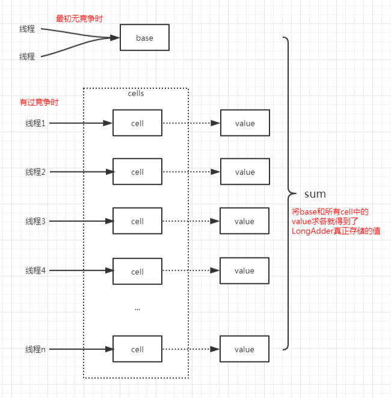

# CAS

## 什么是CAS

> `CAS(compare and swap)`,字面意思比较并交换,是解决多线程并行情况下使用锁造成性能损耗的一种机制.

```java
public final boolean compareAndSet(int expect, int update) {        
  return unsafe.compareAndSwapInt(this, valueOffset, expect, update);
}
```

> `CAS`有三个操作数,`valueOffset`内存值,`expect`期望值,`update`要更新的值。如果内存值(`valueOffset`)和期望值(`expect`)是一样的。那么处理器会将该位置的值更新为(`update`),否则不做任何操作。
>
> CAS 有效地说明了“我认为位置`valueOffset`应该包含值`expect`，如果包含该值，则将`update`放到这个位置；否则，不要更改该位置，只告诉我这个位置现在的值即可。”在 Java 中，sun.misc.Unsafe类提供了硬件级别的原子操作来实现这个 CAS，java.util.concurrent包下的大量类都使用了这个Unsafe类的 CAS 操作

<!--more-->

## CAS的应用

> `java.util.concurrent.atomic`包下的类大多数是使用`CAS`实现的,如`AtomicInteger`,`AtomicBoolean`和`AtomicLong`等。
>
> ```java
> public class AtomicInteger extends Number implements java.io.Serializable {
>     private static final long serialVersionUID = 6214790243416807050L;
>     // setup to use Unsafe.compareAndSwapInt for updates
>     private static final Unsafe unsafe = Unsafe.getUnsafe();
>     private volatile int value;// 初始int大小
>     // 省略了部分代码...
>     // 带参数构造函数，可设置初始int大小
>     public AtomicInteger(int initialValue) {
>         value = initialValue;
>     }
>     // 不带参数构造函数,初始int大小为0
>     public AtomicInteger() {
>     }
>     // 获取当前值
>     public final int get() {
>         return value;
>     }
>     // 设置值为 newValue
>     public final void set(int newValue) {
>         value = newValue;
>     }
>     //返回旧值，并设置新值为　newValue
>     public final int getAndSet(int newValue) {
>         /**
>         * 这里使用for循环不断通过CAS操作来设置新值
>         * CAS实现和加锁实现的关系有点类似乐观锁和悲观锁的关系
>         * */
>         for (;;) {
>             int current = get();
>             if (compareAndSet(current, newValue))
>                 return current;
>         }
>     }
>     // 原子的设置新值为update, expect为期望的当前的值
>     public final boolean compareAndSet(int expect, int update) {
>         return unsafe.compareAndSwapInt(this, valueOffset, expect, update);
>     }
>     // 获取当前值current，并设置新值为current+1
>     public final int getAndIncrement() {
>         for (;;) {
>             int current = get();
>             int next = current + 1;
>             if (compareAndSet(current, next))
>                 return current;
>         }
>     }
>     // 此处省略部分代码，余下的代码大致实现原理都是类似的
> }
> ```
>
> 

> 一般，在竞争不是特别激烈的时候，使用该包下的原子操作性能比使用synchronized关键字的方式高效的多。通过查看getAndSet()方法，可知如果资源竞争十分激烈的话，这个for循环可能换持续很久都不能成功跳出。在这种情况下，我们可能需要考虑如何降低对资源的竞争。在较多的场景下，我们可能会使用到这些原子类操作。一个典型应用就是计数，在多线程的情况下需要考虑线程安全问题。

```java
//有线程安全问题
public class Counter {   
  private int count;  
  public Counter(){}   
  public int getCount(){  
    return count; 
  }  
  public void increase(){   
    count++;   
  }
}
//悲观锁,线程安全,缺点性能差
public class Counter {    
  private int count;   
  public Counter(){}   
  public synchronized int getCount(){      
    return count;   
  } 
  public synchronized void increase(){ 
    count++;   
  }
}
```

> 这是悲观锁的实现，如果我们需要获取这个资源，那么我们就给它加锁，其他线程都无法访问该资源，直到我们操作完后释放对该资源的锁。我们知道，悲观锁的效率是不如乐观锁的，上面说了atomic包下的原子类的实现是乐观锁方式，因此其效率会比使用synchronized关键字更高一些，推荐使用这种方式。

```java
//乐观锁,线程安全,性能好
public class Counter {    
  private AtomicInteger count = new AtomicInteger();    
  public Counter(){}   
  public int getCount(){     
    return count.get();    
  }    
  public void increase(){  
    count.getAndIncrement(); 
  }
}
```


### CAS的三大缺点

#### ABA问题

> 因为 CAS 需要在操作值的时候检查下值有没有发生变化，如果没有发生变化则更新，但是如果一个值原来是A，变成了B，又变成了A，那么使用 CAS 进行检查时会发现它的值没有发生变化，但是实际上却变化了。ABA 问题的解决思路就是使用版本号，在变量前面追加上版本号，每次变量更新的时候把版本号加一，那么A－B－A就会变成1A-2B－3A。
>
> 从 Java 1.5 开始 JDK 的atomic包里提供了一个类AtomicStampedReference来解决 ABA 问题。这个类的compareAndSet方法作用是首先检查当前引用是否等于预期引用，并且当前标志是否等于预期标志，如果全部相等，则以原子方式将该引用和该标志的值设置为给定的更新值。

#### 循环时间长开销大

> CAS 自旋如果长时间不成功，会给 CPU 带来非常大的执行开销。如果 JVM 能支持处理器提供的pause指令那么效率会有一定的提升，pause指令有两个作用，一是它可以延迟流水线执行指令，使 CPU 不会消耗过多的执行资源，延迟的时间取决于具体实现的版本，在一些处理器上延迟时间是零；二是它可以避免在退出循环的时候因内存顺序冲突而引起 CPU 流水线被清空，从而提高 CPU 的执行效率。

#### 只能保证一个共享变量的原子操作

> 当对一个共享变量执行操作时，我们可以使用循环 CAS 的方式来保证原子操作，但是对多个共享变量操作时，循环 CAS 就无法保证操作的原子性，这个时候就需要用锁，或者有一个取巧的办法，就是把多个共享变量合并成一个共享变量来操作。比如有两个共享变量i＝2,j=a，合并一下ij=2a，然后用 CAS 来操作ij。从 Java 1.5 开始 JDK 提供了AtomicReference类来保证引用对象之间的原子性，我们可以把多个变量放在一个对象里来进行 CAS 操作。

# 原子类

## AtomicReference原子性引用

### AtomicReference

> AtomicReference类提供了一个可以原子读写的对象引用变量。 原子意味着尝试更改相同AtomicReference的多个线程（例如，使用比较和交换操作）不会使AtomicReference最终达到不一致的状态。 AtomicReference甚至有一个先进的compareAndSet（）方法，它可以将引用与预期值（引用）进行比较，如果它们相等，则在AtomicReference对象内设置一个新的引用。

### AtomicStampReference 安全的修改一个变量的值

```java
package com.keytech.task;
import org.junit.platform.commons.logging.LoggerFactory;
import java.util.concurrent.atomic.AtomicInteger;
import java.util.concurrent.atomic.AtomicReference;
/**
 * @className: AtomicIntegerTest
 * @description: TODO 类描述
 * @author: mac
 * @date: 2020/12/29
 **/
//线程安全
public class AtomicIntegerTest {
  private static AtomicReference<Integer> count=new AtomicReference<>(0);
  public static void main(String[] args) {
    //如果期望值是0,则修改成2
    count.compareAndSet(0, 2); //ok
    //如果期望值是1,则修改成4
    count.compareAndSet(1, 4); //no ok
    //如果期望值是2,则修改成8
    count.compareAndSet(2, 8); //ok
    System.out.println(count.get());
  }
}
//输出8
```

### 如果`AtomicReference<T>`中`T`是一个自定义的对象,线程安全?

```java
public class AtomicReference<V> implements java.io.Serializable {
  private static final long serialVersionUID = -1848883965231344442L;
  private static final Unsafe unsafe = Unsafe.getUnsafe();
  private static final long valueOffset;
  static {
    try {
      valueOffset = unsafe.objectFieldOffset
        (AtomicReference.class.getDeclaredField("value"));
    } catch (Exception ex) { throw new Error(ex); }
  }
  private volatile V value;
  /**
     * Creates a new AtomicReference with the given initial value.
     *
     * @param initialValue the initial value
     */
  public AtomicReference(V initialValue) {
    value = initialValue;
  }
  /**
     * Creates a new AtomicReference with null initial value.
     */
  public AtomicReference() {
  }
  /**
     * 不需要安全防护
     */
  public final V get() {
    return value;
  }
  /**
     * 设值值不需要进行对象安全防护
     */
  public final void set(V newValue) {
    value = newValue;
  }
  /**
     * 很明显调用的是csa操作
     * 比较对象是否相同，进行设值
     * 设值成功返回true，否则返回false
     */
  public final boolean compareAndSet(V expect, V update) {
    return unsafe.compareAndSwapObject(this, valueOffset, expect, update);
  }
  /**
     * 设置新的值并且返回旧的值
     * 原子操作
     */
  @SuppressWarnings("unchecked")
  public final V getAndSet(V newValue) {
    return (V)unsafe.getAndSetObject(this, valueOffset, newValue);
  }
}
```

compareAndSet采用CAS保证并发

AtomicReference 所提供的某些方法可以进行原子性操作，如compareAndSet、getAndSet，这仅仅是对引用进行原子性操作

AtomicReference 不能保证对象中若存在属性值修改是线程安全的，如假设引用对象是person，修改person中name和age，多个线程同时从引用中获得对象，并进行修改，会出现线程不安全情况。下面我们通过代码来验证一下这条结论。

### `AtomicReference`不安全的修改自定义对象属性的值

```java
package com.keytech.task;
import java.util.concurrent.ExecutorService;
import java.util.concurrent.Executors;
import java.util.concurrent.Semaphore;
import java.util.concurrent.atomic.AtomicReference;
/**
 * @className: AtomicReferenceTest
 * @description: TODO 类描述
 * @author: mac
 * @date: 2020/12/29
 **/
public class AtomicReferenceTest {
  private static Integer clientTotal=5000;
  private static Integer threadTotal=200;
  private static Rumenz rumenz=new Rumenz(0,0);
  private static AtomicReference<Rumenz> rumenzReference=new AtomicReference<>(rumenz);
  public static void main(String[] args) {
    ExecutorService executorService = Executors.newCachedThreadPool();
    Semaphore semaphore=new Semaphore(threadTotal);
    for (int i = 0; i < clientTotal; i++) {
      final  Integer n=i;
      executorService.execute(()->{
        try{
          semaphore.acquire();
          update(n);
          semaphore.release();
        }catch (Exception e){
          e.printStackTrace();
        }
      });
    }
    executorService.shutdown();
    System.out.println("rumenzReference="+rumenzReference.get().getAge());
    System.out.println("rumenzReference="+rumenzReference.get().getName());
  }
  //如果线程安全的话，age的值和name的值是一致的
  //如果线程不安全的话，age的值和name是不一样的。
  private static void update(int i){
    rumenzReference.get().setAge(rumenzReference.get().getAge()+i);
    rumenzReference.get().setName(rumenzReference.get().getName()+i);
  }
}
class Rumenz{
  private Integer age;
  private Integer name;
  public Rumenz(Integer age, Integer name) {
    this.age = age;
    this.name = name;
  }
  public Integer getAge() {
    return age;
  }
  public void setAge(Integer age) {
    this.age = age;
  }
  public Integer getName() {
    return name;
  }
  public void setName(Integer name) {
    this.name = name;
  }
}
```

在低并发情况下可以得到正确的结果,但是高并发情况下就会出现差异.因为自定义的对象在访问时用的是`set`,`get`没有`CAS`,所以导致线程不安全.

### 通过`AtomicintegerFieldUpdater`安全的修改自定义对象

`atomic`包中提供`AtomicReferenceFieldUpdater`、`AtomicIntegerFieldUpdater`、`AtomicLongFieldUpdater`，原子性的更新某一个类实例的指定的某一个字段.

### AtomicIntegerFieldUpdater

通过CAS修改变量值

```java
package com.keytech.task;
import java.util.concurrent.atomic.AtomicIntegerFieldUpdater;
/**
 * @className: AtomicIntegerFieldUpdaterTest
 * @description: TODO 类描述
 * @author: mac
 * @date: 2020/12/29
 **/
public class AtomicIntegerFieldUpdaterTest {
  private static AtomicIntegerFieldUpdater<AtomicIntegerFieldUpdaterTest> upCount=AtomicIntegerFieldUpdater.newUpdater(AtomicIntegerFieldUpdaterTest.class,"count");
  public int getCount() {
    return count;
  }
  public volatile int count=100;
  public static void main(String[] args) {
    AtomicIntegerFieldUpdaterTest obj=new AtomicIntegerFieldUpdaterTest();
    if(upCount.compareAndSet(obj,100,200)){
      System.out.println("修改成功"+obj.getCount());
    }
    if(upCount.compareAndSet(obj,100,200)){
      System.out.println("修改成功");
    }else{
      System.out.println("修改失败");
    }
  }
}
//修改成功200
//修改失败
```

### `AtomicIntegerFieldUpdater`源码分析

```java
public abstract class AtomicIntegerFieldUpdater<T> {
  /**
     *
     * @param tclass 持有某字段的类
     * @param fieldName 字段名字
     */
  @CallerSensitive
  public static <U> AtomicIntegerFieldUpdater<U> newUpdater(Class<U> tclass,
                                                            String fieldName)     {
    return new AtomicIntegerFieldUpdaterImpl<U>
      (tclass, fieldName, Reflection.getCallerClass());
  }
  /**
     * 原子性设置
     */
  public int getAndSet(T obj, int newValue) {
    int prev;
    do {
      prev = get(obj);
    } while (!compareAndSet(obj, prev, newValue));
    return prev;
  }
  private static class AtomicIntegerFieldUpdaterImpl<T>
    extends AtomicIntegerFieldUpdater<T> {
    private static final Unsafe unsafe = Unsafe.getUnsafe();
    private final long offset;
    private final Class<T> tclass;
    private final Class<?> cclass;
    AtomicIntegerFieldUpdaterImpl(final Class<T> tclass,
                                  final String fieldName,
                                  final Class<?> caller) {
      final Field field;
      final int modifiers;
      try {
        field = AccessController.doPrivileged(
          new PrivilegedExceptionAction<Field>() {
            public Field run() throws NoSuchFieldException {
              //字段不存在会抛异常
              return tclass.getDeclaredField(fieldName);
            }
          });
        //检查访问级别
        modifiers = field.getModifiers();
        sun.reflect.misc.ReflectUtil.ensureMemberAccess(
          caller, tclass, null, modifiers);
        ClassLoader cl = tclass.getClassLoader();
        ClassLoader ccl = caller.getClassLoader();
        if ((ccl != null) && (ccl != cl) &&
            ((cl == null) || !isAncestor(cl, ccl))) {
          sun.reflect.misc.ReflectUtil.checkPackageAccess(tclass);
        }
      } catch (PrivilegedActionException pae) {
        throw new RuntimeException(pae.getException());
      } catch (Exception ex) {
        throw new RuntimeException(ex);
      }
      Class<?> fieldt = field.getType();
      //必须是int
      if (fieldt != int.class)
        throw new IllegalArgumentException("Must be integer type");
      //必须用volatile修饰
      if (!Modifier.isVolatile(modifiers))
        throw new IllegalArgumentException("Must be volatile type");
      this.cclass = (Modifier.isProtected(modifiers) &&
                     caller != tclass) ? caller : null;
      this.tclass = tclass;
      //用Unsafe里的那一坨方法去原子更新
      offset = unsafe.objectFieldOffset(field);
    }
  }
}
```

### AtomicIntegerFieldUpdater线程安全的更新自定义对象的属性值

```java
package com.keytech.task;
import java.util.concurrent.ExecutorService;
import java.util.concurrent.Executors;
import java.util.concurrent.Semaphore;
import java.util.concurrent.atomic.AtomicIntegerFieldUpdater;
/**
 * @className: AtomicReferenceTest
 * @description: TODO 类描述
 * @author: mac
 * @date: 2020/12/29
 **/
public class AtomicReferenceTest {
  private static Integer clientTotal=5000;
  private static Integer threadTotal=200;
  public static Rumenz rumenz=new Rumenz(0,0);
  public static AtomicIntegerFieldUpdater<Rumenz> rumenzReferenceAge= AtomicIntegerFieldUpdater.newUpdater(Rumenz.class,"age");
  private static AtomicIntegerFieldUpdater<Rumenz> rumenzReferenceName= AtomicIntegerFieldUpdater.newUpdater(Rumenz.class,"name");
  public static void main(String[] args) {
    ExecutorService executorService = Executors.newCachedThreadPool();
    Semaphore semaphore=new Semaphore(threadTotal);
    for (int i = 0; i < clientTotal; i++) {
      final  Integer n=i;
      executorService.execute(()->{
        try{
          semaphore.acquire();
          update(n);
          semaphore.release();
        }catch (Exception e){
          e.printStackTrace();
        }
      });
    }
    executorService.shutdown();
    System.out.println("rumenzReference="+ rumenz.getAge());
    System.out.println("rumenzReference="+ rumenz.getName());
  }
  public static void update(int i){
    rumenzReferenceAge.incrementAndGet(rumenz);
    rumenzReferenceName.incrementAndGet(rumenz);
  }
}
class Rumenz{
  //必须加volatile 如果是整数不能写包装类型:如不能为Integer
  public volatile  int age;
  public volatile  int name;
  public Rumenz(Integer age, Integer name) {
    this.age = age;
    this.name = name;
  }
  public Integer getAge() {
    return age;
  }
  public void setAge(Integer age) {
    this.age = age;
  }
  public Integer getName() {
    return name;
  }
  public void setName(Integer name) {
    this.name = name;
  }
}
//rumenzReference=5000
//rumenzReference=5000
```


## 线程安全之原子性Atomic(AtomicInteger|LongAdder|AtomicLong)

### 线程安全性

> 当多线程访问某个类时,不管运行环境采用何种调度方式或者这些进程将如何交替执行,并且在主调代码中不需要任何的同步或者协同,这个类都能表现出正确的行为,那么这个类就是线程安全的.

### 原子性

> 提供互斥访问,同一时刻只有一个线程对它进行访问.

## Atomic包

> 位于`java.util.concurrent.atomic`,AtomicXXX : CAS、Unsafe.compareAndSwapXXX
>
> `CAS(Compare and swap)`比较和替换是设计并发算法用的的一项技术,比较和替换是用一个期望值和一个变量的当前值进行比较,如果变量的值和期望值相等,那么就用一个新值替换变量的值.

### 案例

> ### 线程安全
>
> ```java
> package com.keytech.task;
> import java.util.concurrent.Executor;
> import java.util.concurrent.ExecutorService;
> import java.util.concurrent.Executors;
> import java.util.concurrent.Semaphore;
> import java.util.concurrent.atomic.AtomicInteger;
> import java.util.concurrent.atomic.LongAdder;
> /**
>  * @className: AtomicTest
>  * @description: TODO 类描述
>  * @author: mac
>  * @date: 2020/12/27
>  **/
> public class AtomicTest {
>   private static Integer clientTotal=5000;
>   private static Integer threadTotal=200;
>   private static AtomicInteger count=new AtomicInteger(0);
>   public static void main(String[] args) {
>     ExecutorService executorService = Executors.newCachedThreadPool();
>     Semaphore semaphore= new Semaphore(threadTotal);
>     for (int i = 0; i <clientTotal ; i++) {
>       executorService.execute(()->{
>         try{
>           semaphore.acquire();
>           update();
>           semaphore.release();
>         }catch (Exception e){
>           e.printStackTrace();
>         }
>       });
>     }
>     executorService.shutdown();
>     System.out.println("count:"+count);
>   }
>   private static void update(){
>     count.incrementAndGet();
>   }
> }
> ```
>
> ### getAndAddInt源码
>
> ```java
> public final int getAndAddInt(Object var1, long var2, int var4) {
>   int var5;
>   do {
>     var5 = this.getIntVolatile(var1, var2);
>   } while(!this.compareAndSwapInt(var1, var2, var5, var5 + var4));
>   return var5;
> }
> ```
>
> `compareAndSwapInt(this, stateOffset, expect, update)`这个方法的作用就是通过cas技术来预测stateOffset变量的初始值是否是expect，如果是，那么就把stateOffset变量的值变成update，如果不是，那么就一直自旋转，一直到stateOffset变量的初始值是expect，然后在在修改stateOffset变量的值变成update

### LongAddr

> 线程安全

```java
package com.keytech.task;
import java.util.concurrent.ExecutorService;
import java.util.concurrent.Executors;
import java.util.concurrent.Semaphore;
import java.util.concurrent.atomic.LongAdder;
/**
 * @className: LongAddrTest
 * @description: TODO 类描述
 * @author: mac
 * @date: 2020/12/28
 **/
public class LongAddrTest {
    private static Integer clientTotal=5000;
    private static Integer threadTotal=200;
    private static LongAdder count=new LongAdder();
    public static void main(String[] args) {
        ExecutorService executorService = Executors.newCachedThreadPool();
        Semaphore semaphore=new Semaphore(threadTotal);
        for (int i = 0; i < clientTotal; i++) {
            try{
                semaphore.acquire();
                update();
                semaphore.release();
            }catch (Exception e){
                e.printStackTrace();
            }
        }
        executorService.shutdown();
        System.out.println("count"+count);
    }
    private static void update(){
        count.increment();
    }
}
```

## AtomicLong

> 线程安全

```java
package com.keytech.task;
import java.util.concurrent.ExecutorService;
import java.util.concurrent.Executors;
import java.util.concurrent.Semaphore;
import java.util.concurrent.atomic.AtomicLong;
/**
* @className: AtomicLongTest
* @description: TODO 类描述
* @author: mac
* @date: 2020/12/28
**/
public class AtomicLongTest {
  private static Integer clientTotal=5000;
  private static Integer threadTotal=200;
  private static AtomicLong count=new AtomicLong();
  public static void main(String[] args) {
    ExecutorService executorService = Executors.newCachedThreadPool();
    Semaphore semaphore=new Semaphore(threadTotal);
    for (int i = 0; i < clientTotal; i++) {
      try{
        semaphore.tryAcquire();
        update();
        semaphore.release();
      }catch (Exception e){
        e.printStackTrace();
      }
    }
    executorService.shutdown();
    System.out.println("count"+count);
  }
  private static void update(){
    count.incrementAndGet();
  }
}
```

## LongAddr与AtomicLong的区别

> AtomicLong的原理是依靠底层的cas来保障原子性的更新数据，在要添加或者减少的时候，会使用死循环不断地cas到特定的值，从而达到更新数据的目的。如果竞争不激烈，修改成功几率很高，否则失败概率很高，在失败几率很高的情况下，这些原子操作就会进行多次的循环操作尝试，因此性能会受到影响。
>
> 

## LongAddr与AtomicLong的使用场景

> 实际使用中，在处理高并发时，可以优先使用LongAdder，而不是继续使用AtomicLong，当然，在线程竞争很低的情况下，使用AtomicLong更简单更实际一些，并且效率会高些。其他情况下，比如序列号生成，这种情况下需要准确的数值，全局唯一的AtomicLong才是正确的选择，而不是LongAdder

###### 来源:

https://rumenz.com/rumenbiji/java-cas-aqs.html

https://rumenz.com/rumenbiji/java-atomicinteger-longaddr-atomiclong.html

https://rumenz.com/rumenbiji/java-atomicreference.html
