# HashMap面试题

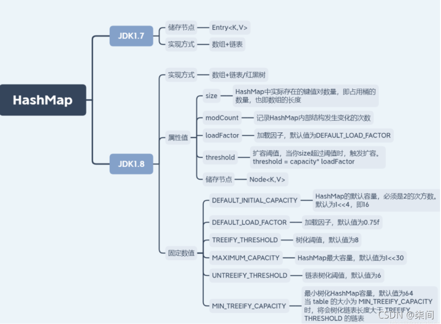

## HashMap的数据结构?

- JDK 1.7的数据结构是

  ```
  数组 + 链表
  ```

- JDK 1.8的数据结构是

  ```
  数组 + 链表 + 红黑树
  ```

  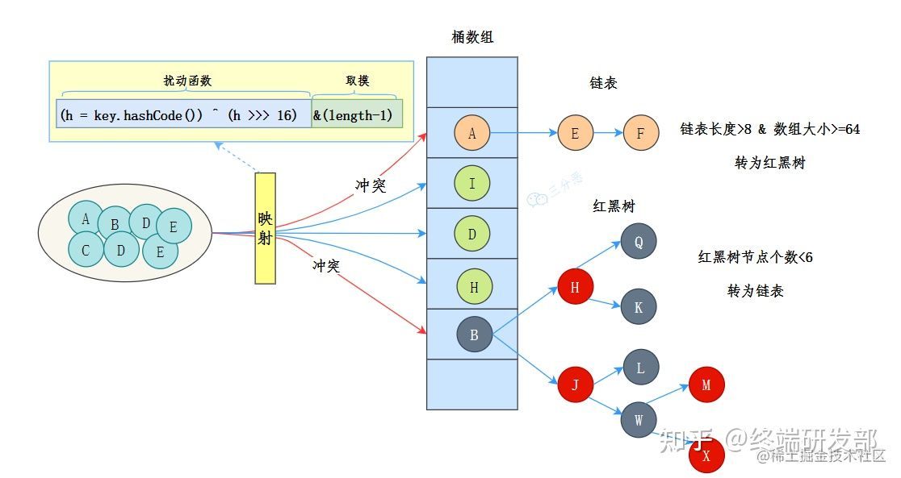

  其中，桶数组是用来存储数据元素，链表是用来解决冲突，红黑树是为了提高查询的效率。

- 数据元素通过映射关系，也就是散列函数，映射到桶数组对应索引的位置
- 如果发生冲突，从冲突的位置拉一个链表，插入冲突的元素
- 如果链表长度>8&数组大小>=64，链表转为红黑树
- 如果红黑树节点个数<6 ，转为链表


<!-- more -->

## 为什么不直接使用红黑树

因为树节点所占的空间是普通节点的两倍，所以只有当节点足够多的时候，才会使用树节点，也就是说，当节点少的时候，尽管时间复杂度上，红黑树比链表要好一些，但是红黑树所占的空间比较大，综合考虑，认为只能在节点太多的时候，红黑树占空间大这一劣势不太明显的时候，才会舍弃链表使用红黑树


## 什么是红黑树？为什么不用二叉树/平衡树？

红黑树本质上是一种二叉查找树，为了保持平衡，它又在二叉查找树的基础上增加了一些规则：

1. 每个节点要么是红色，要么是黑色；
2. 根节点永远是黑色的；
3. 所有的叶子节点都是是黑色的（注意这里说叶子节点其实是图中的 NULL 节点）；
4. 每个红色节点的两个子节点一定都是黑色；
5. 从任一节点到其子树中每个叶子节点的路径都包含相同数量的黑色节点；

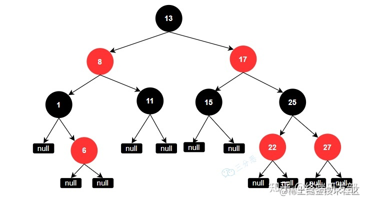

> 之所以不用二叉树：

红黑树是一种平衡的二叉树，插入、删除、查找的最坏时间复杂度都为 O(logn)，避免了二叉树最坏情况下的O(n)时间复杂度。

> 之所以不用平衡二叉(AVL)树：

平衡二叉树是比红黑树更严格的平衡树，为了保持保持平衡，所以他的查找速度更快，但是在进行插入和删除操作时，需要旋转的次数更多，所以速度也就更慢，也就是说平衡二叉树保持平衡的效率更低，所以平衡二叉树插入和删除的效率比红黑树要低。


### 红黑树如何保持平衡？

#### 红黑树有两种方式保持平衡：

- 旋转

  旋转分为两种，左旋和右旋

  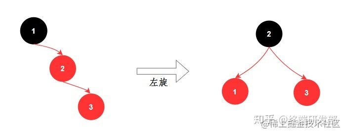

  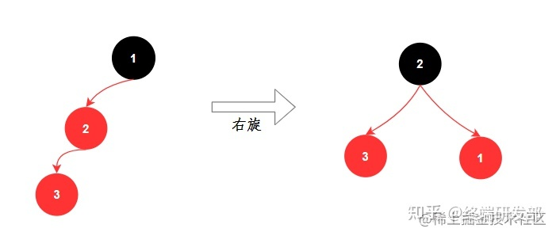

- 染色

  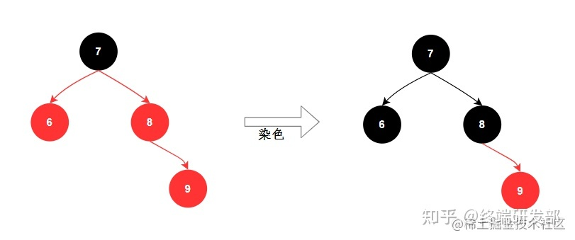

## HashMap工作原理

- put原理

  使用key，生成对应的hashCode 值，在对应hash值范围内，生成下标index并存储在对应index链表中。

- get原理

  根据key，解析出对应的hashCode 值，在解析出对应的index 下标，获取存储的数据

### HashMap的put流程？

1. 首先进行哈希值的扰动，获取一个新的哈希值。
   (key == null) ? 0 : (h = key.hashCode()) ^ (h >>> 16);

   

2. 判断tab是否位空或者长度为0，如果是则进行扩容操作。
   \``` if ((tab = table) == null || (n = tab.length) == 0) n = (tab = resize()).length;
   \```

3. 根据哈希值计算下标，如果对应小标正好没有存放数据，则直接插入即可否则需要覆盖。
   tab[i = (n - 1) & hash])

   

4. 判断tab![[公式]](https://www.zhihu.com/equation?tex=i)是否为树节点，否则向链表中插入数据，是则向树中插入节点。

5. 如果链表中插入节点的时候，链表长度大于等于8，则需要把链表转换为红黑树。
   treeifyBin(tab, hash);

6. 最后所有元素处理完成后，判断是否超过阈值；threshold，超过则扩容。

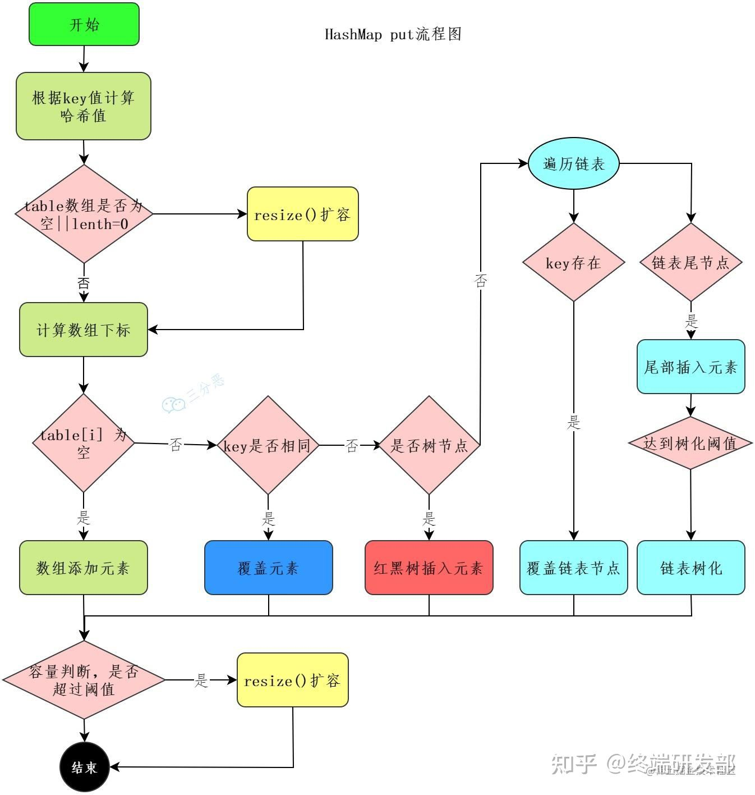


### HashMap怎么查找元素？

1. 使用扰动函数，获取新的哈希值
2. 计算数组下标，获取节点
3. 当前节点和key匹配，直接返回
4. 否则，当前节点是否为树节点，查找红黑树
5. 否则，遍历链表查找

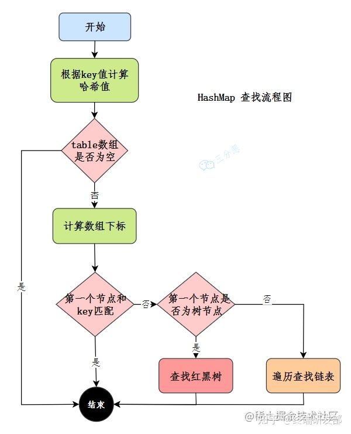

## Hashing的概念

Hashing是一种技术。

哈希只有简单的插入，查找，删除这3种操作，而且哈希并不能支持排序信息，也就是在哈希表中的信息都是无序的。但是哈希最大的优点就是执行插入，查找，删除这3种操作只需要常数时间，尤其对于查找，哈希表的查找时间是O(1)。

哈希的应用很广泛，主要利用的就是它查找很快的优点。

例如编译器对于声明的变量的检查，声明了新的变量，只要O(1)的时间就可以插入；要查询某个变量是否被声明过，也只需要O(1)的时间就可以知道结果。


## 两个键hashCode相同，如何获取对象

找到bucket位置之后，会调用keys.equals()或==方法去找到链表中正确的节点，最终找到要找的值对象

## HashMap的哈希/扰动函数是怎么设计的?

HashMap的哈希函数是先拿到 key 的hashcode，是一个32位的int类型的数值，然后让hashcode的高16位和低16位进行异或操作。

```java
static final int hash(Object key) {
  int h;
  // key的hashCode和key的hashCode右移16位做异或运算
  return (key == null) ? 0 : (h = key.hashCode()) ^ (h >>> 16);
}
```

这么设计是为了降低哈希碰撞的概率。


## 为什么哈希/扰动函数能降hash碰撞？

因为 key.hashCode() 函数调用的是 key 键值类型自带的哈希函数，返回 int 型散列值。int 值范围为 **-2147483648~2147483647**，加起来大概 40 亿的映射空间。

只要哈希函数映射得比较均匀松散，一般应用是很难出现碰撞的。但问题是一个 40 亿长度的数组，内存是放不下的。

假如 HashMap 数组的初始大小才 16，就需要用之前需要对数组的长度取模运算，得到的余数才能用来访问数组下标。

源码中模运算就是把散列值和数组长度 - 1 做一个 "与&" 操作，位运算比取余 % 运算要快。

```java
bucketIndex = indexFor(hash, table.length);

static int indexFor(int h, int length) {
  return h & (length-1);
}
```

这也正好解释了为什么 HashMap 的数组长度要取 2 的整数幂。因为这样（数组长度 - 1）正好相当于一个 “低位掩码”。

**`与&`**操作的结果就是散列值的高位全部归零，只保留低位值，用来做数组下标访问。以初始长度 16 为例，16-1=15。2 进制表示是 

0000 0000 0000 0000 0000 0000 0000 1111 和某个散列值做 **`与&`**操作如下，结果就是截取了最低的四位值。

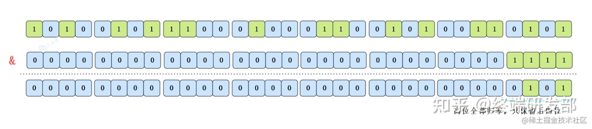

这样是要快捷一些，但是新的问题来了，就算散列值分布再松散，要是只取最后几位的话，碰撞也会很严重。如果散列本身做得不好，分布上成等差数列的漏洞，如果正好让最后几个低位呈现规律性重复，那就更难搞了。

这时候 **`扰动函数`**的价值就体现出来了，看一下扰动函数的示意图：

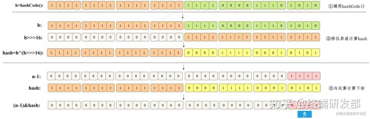

右移 16 位，正好是 32bit 的一半，自己的高半区和低半区做异或，就是为了混合原始哈希码的高位和低位，以此来加大低位的随机性。而且混合后的低位掺杂了高位的部分特征，这样高位的信息也被变相保留下来。


## 在HashMap中，为什么（String, Interger）这样的wrapper类适合作为键？

因为String是不可变的，也是final 的，而且已经重写了equals()和hashCode()方法了。

其他的wrapper类也有这个特点。不可变性是必要的，因为为了要计算 hashCode()，就要防止键值改变，如果键值在放入时和获取时返回不同的hashcode的话，那么就不能从HashMap中找到你想要的对象。

在native（底层C/C++）中, hashCode是int 类型

## 在HashMap中，我们可以使用自定义的对象，作为键吗？

只要它遵守了equals()和hashCode()方法的定义规则，并且当对象插入到Map中之 后将不会再改变了。如果这个自定义对象时不可变的，那么它已经满足了作为键的条件，因为当它创建之后就已经不能改变了。

当key值为对象时必须要求重写hashcode()和equals()方法。因为默认的hashcode()使用的是该值在内存中的地址作为该值的hash值，如果两个具有相同意义的对象进行比较时，由于其地址不同会导致计算出的hash值也不同。而重写equals()可以确保两个对象具有相同意义的属性。


## equals()和hashCode()的应用在HashMap中的重要性

Java中HashMap根据hashCode()和equals()方法来获取键值对的索引，同时也通过这两个方法由key值获取value值。如果没有这两个方法，那么当有两个相同的

hash值时，可能会被集合认为是相等的。同时，hashCode()和equals()方法也能发现相同的元素。所以hashCode()和equals()对于HashMap的准确性是至关重要的。


## 不可变对象的好处

线程安全。如果你可以仅仅通过将某个field声明成final就能保证hashCode是不变的，那么请这么做吧。因为获取对象 的时候要用到equals()和hashCode()方法，那么键对象正确的重写这两个方法是非常重要的。如果两个不相等的对象返回不同的 hashcode的话，那么碰撞的几率就会小些，这样就能提高HashMap的性能。

## 为什么HashMap的容量是2的倍数？

- 第一个原因是为了方便哈希取余：

将元素放在table数组上面，是用hash值%数组大小定位位置，而HashMap是用hash值&(数组大小-1)，却能和前面达到一样的效果，这就得益于HashMap的大小是2的倍数，2的倍数意味着该数的二进制位只有一位为1，而该数-1就可以得到二进制位上1变成0，后面的0变成1，再通过&运算，就可以得到和%一样的效果，并且位运算比%的效率高得多

HashMap的容量是2的n次幂时，(n-1)的2进制也就是1111111***111这样形式的，这样与添加元素的hash值进行位运算时，能够充分的散列，使得添加的元素均匀分布在HashMap的每个位置上，减少hash碰撞。

- 第二个方面是在扩容时，利用扩容后的大小也是2的倍数，将已经产生hash碰撞的元素完美的转移到新的table中去

我们可以简单看看HashMap的扩容机制，HashMap中的元素在超过**`负载因子*HashMap`**大小时就会产生扩容。

java.util.HashMap#putVal

```java
final V putVal(int hash, K key, V value, boolean onlyIfAbsent,boolean evict) {
  Node<K,V>[] tab; Node<K,V> p; int n, i;

  ...
  
  ++modCount;
  //put时，当大小超过threshold，就会扩容
  if (++size > threshold)
    resize();
  afterNodeInsertion(evict);
  return null;
}
```


## 如果初始化HashMap，传一个17的值new HashMap<>，它会怎么处理？

简单来说，就是初始化时，传的不是2的倍数时，HashMap会向上寻找**`离得最近的2的倍数`**，所以传入17，但HashMap的实际容量是32。

在HashMap的初始化中，有这样⼀段⽅法；

```java
public HashMap(int initialCapacity, float loadFactor) {
  ...
    this.loadFactor = loadFactor;
  this.threshold = tableSizeFor(initialCapacity);
}
```

- 阀值 threshold ，通过⽅法 tableSizeFor
  进⾏计算，是根据初始化传的参数来计算的。
- 同时，这个⽅法也要要寻找⽐初始值⼤的，最⼩的那个2进制数值。⽐如传了17，我应该找到的是32。

```java
static final int tableSizeFor(int cap) {
  int n = cap - 1;
  n |= n >>> 1;
  n |= n >>> 2;
  n |= n >>> 4;
  n |= n >>> 8;
  n |= n >>> 16;
  return (n < 0) ? 1 : (n >= MAXIMUM_CAPACITY) ? MAXIMUM_CAPACITY : n + 1; }
```

- MAXIMUM_CAPACITY = 1 << 30，这个是临界范围，也就是最⼤的Map集合。
- 计算过程是向右移位1、2、4、8、16，和原来的数做|
  运算，这主要是为了把⼆进制的各个位置都填上1，当⼆进制的各个位置都是1以后，就是⼀个标准的2的倍数减1了，最后把结果加1再返回即可。

以17为例，看一下初始化计算table容量的过程：

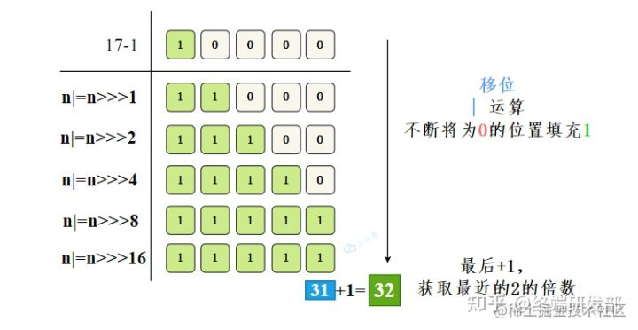


## 还有哪些哈希函数的构造方法？

- **除留取余法**：H（key)=key%p（p<=N）,关键字除以一个不大于哈希表长度的正整数p，所得余数为地址，当然HashMap里进行了优化改造，效率更高，散列也更均衡。

H除此之外，还有这几种常见的哈希函数构造方法：

- **直接定址法**
  直接根据
  key
  来映射到对应的数组位置，例如1232放到下标1232的位置。
- **数字分析法**
  取
  key
  的某些数字（例如十位和百位）作为映射的位置
- **平方取中法**
  取
  key
  平方的中间几位作为映射的位置
- **折叠法**
  将
  key
  分割成位数相同的几段，然后把它们的叠加和作为映射的位置

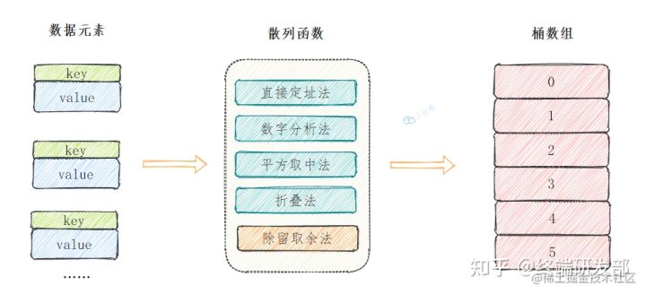


## 解决哈希冲突有哪些方法？

HashMap使用链表的原因为了处理哈希冲突，这种方法就是所谓的：

- **链地址法**：在冲突的位置拉一个链表，把冲突的元素放进去。

除此之外，还有一些常见的解决冲突的办法：

- **开放定址法**：开放定址法就是从冲突的位置再接着往下找，给冲突元素找个空位。
  找到空闲位置的方法也有很多种：

- - 线行探查法: 从冲突的位置开始，依次判断下一个位置是否空闲，直至找到空闲位置
  - 平方探查法: 从冲突的位置x开始，第一次增加1^2
    个位置，第二次增加2^2
    …，直至找到空闲的位置
  - ……

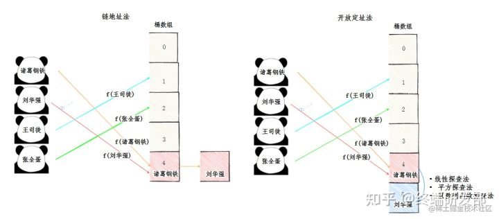


- **再哈希法**：换种哈希函数，重新计算冲突元素的地址。
- **建立公共溢出区**：再建一个数组，把冲突的元素放进去。


## 什么情况下会转化为红黑树

如果链表的长度大于8，并且数组长度大于等于64的话，就会进化为红黑树，因为跟据统计，链表中节点数是8的概率已经接近千分之一了，此时链表的性能已经很差了，但是又不能直接转为红黑树，因为链表转为红黑树也是比较消耗性能的，所以综合考虑之下，如果数组长度还没有达到64，就进行扩容处理，因为通过扩容也可能减小部分链表的长度，一旦链表的长度8，并且数组长度大于等于64的话，说明链表性能非常差了，只能采用红黑树提高性能，这是一种应对策略


## 为什么HashMap链表转红黑树的阈值为8？

树化发生在table数组的长度大于64，且链表的长度大于8的时候。

源码的注释:

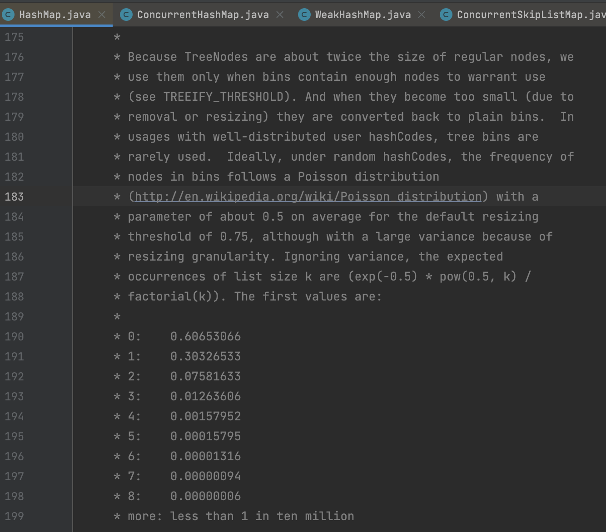

红黑树节点的大小大概是普通节点大小的两倍，所以转红黑树，牺牲了空间换时间，更多的是一种兜底的策略，保证极端情况下的查找效率。

阈值为什么要选8呢？和统计学有关。理想情况下，使用随机哈希码，链表里的节点符合泊松分布，出现节点个数的概率是递减的，节点个数为8的情况，发生概率仅为0.00000006。

至于红黑树转回链表的阈值为什么是6，而不是8？是因为如果这个阈值也设置成8，假如发生碰撞，节点增减刚好在8附近，会发生链表和红黑树的不断转换，导致资源浪费。


## 扩容在什么时候？

为了减少哈希冲突发生的概率，当当前HashMap的元素个数达到一个临界值的时候，就会触发扩容，把所有元素rehash之后再放在扩容后的容器中，这是一个相当耗时的操作。

```java
//size达到临界值，则扩容
if (++size > threshold)
  resize();
```

而这个**`临界值threshold`**就是由加载因子和当前容器的容量大小来确定的，假如采用默认的构造方法：


> 临界值（threshold ）= 默认容量（DEFAULT_INITIAL_CAPACITY） * 默认扩容因子（DEFAULT_LOAD_FACTOR）

```java
else {               // zero initial threshold signifies using defaults
  newCap = DEFAULT_INITIAL_CAPACITY;
  //临界值计算
  newThr = (int)(DEFAULT_LOAD_FACTOR * DEFAULT_INITIAL_CAPACITY);
}
if (newThr == 0) {
  float ft = (float)newCap * loadFactor;
  newThr = (newCap < MAXIMUM_CAPACITY && ft < (float)MAXIMUM_CAPACITY ?
            (int)ft : Integer.MAX_VALUE);
}
//
threshold = newThr;
```

那就是大于**`16x0.75=12`**时，就会触发扩容操作。


## 为什么扩容因子是0.75？

简单来说，这是对**`空间`**成本和**`时间`**成本平衡的考虑。

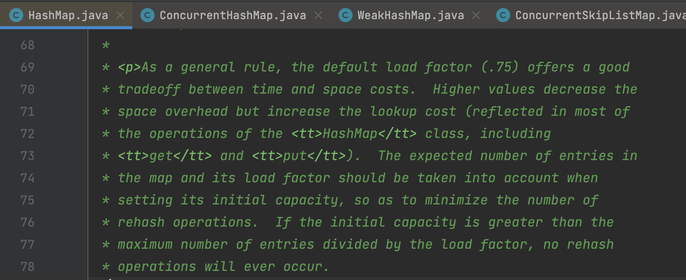

HashMap的散列构造方式是Hash取余，负载因子决定元素个数达到多少时候扩容。

假如我们设的比较大，元素比较多，空位比较少的时候才扩容，那么发生哈希冲突的概率就增加了，查找的时间成本就增加了。

我们设的比较小的话，元素比较少，空位比较多的时候就扩容了，发生哈希碰撞的概率就降低了，查找时间成本降低，但是就需要更多的空间去存储元素，空间成本就增加了。


## HashMap扩容存在什么问题

- 在hashMap 空间扩容之后，原存储的数据，会重新轮询，rehash存储到新node中，带来时间上的浪费。

- JDK1.7 多线程的情况下，可能产生条件竞争(race condition)。

  rehash提高hash值的散列性，减小hash碰撞的产生，扩容时，缩短了链表的长度
  
  但如果两个线程都发现HashMap需要重新调整大小了，它们会同时试着调整大小。在调 整大小的过程中，存储在链表中的元素的次序会反过来，因为移动到新的bucket位置的时候，HashMap并不会将元素放在链表的尾部，而是放在头部， 这是为了避免尾部遍历(tail  traversing)。如果条件竞争发生了，那么就死循环了。

### HashMap的死锁

由于HashMap的容量是有限的，如果HashMap中的数组的容量很小，假如只有2个，那么如果要放进10个keys的话，碰撞就会非常频繁，此时一个O(1)的查找算法，就变成了链表遍历，性能变成了O(n)，这是Hash表的缺陷。

为了解决这个问题,HashMap设计了一个阈值，其值为容量的0.75，当HashMap所用容量超过了阈值后，就会自动扩充其容量。

在多线程的情况下，当重新调整HashMap大小的时候，就会存在条件竞争，因为如果两个线程都发现HashMap需要重新调整大小了，它们会同时试着调整大小。在调整大小的过程中，存储在链表中的元素的次序会反过来，因为移动到新的bucket位置的时候，HashMap并不会将元素放在链表的尾部，而是放在头部，这是为了避免尾部遍历。如果条件竞争发生了，那么就会产生死循环了。

### JDK 1.8 扩容不再进行rehash

## 扩容机制是什么？

HashMap是基于数组+链表和红黑树实现的，但用于存放key值的桶数组的长度是固定的，由初始化参数确定。

那么，随着数据的插入数量增加以及负载因子的作用下，就需要扩容来存放更多的数据。而扩容中有一个非常重要的点，就是jdk1.8中的优化操作，可以不需要再重新计算每一个元素的哈希值。

因为HashMap的初始容量是2的次幂，扩容之后的长度是原来的二倍，新的容量也是2的次幂，所以，元素，要么在原位置，要么在原位置再移动2的次幂。


如图：n为table的长度，a表示扩容前的key1和key2两种key确定索引的位置，b表示扩容后key1和key2两种key确定索引位置。

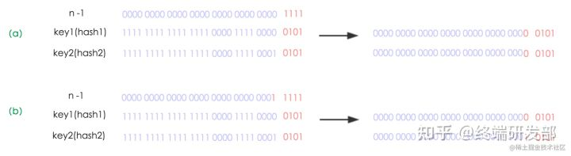

元素在重新计算hash之后，因为n变为2倍，那么n-1的mask范围在高位多1bit(红色)，因此新的index就会发生这样的变化：

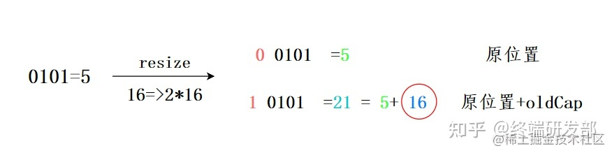

所以在扩容时，只需要看原来的hash值新增的那一位是0还是1就行了，是0的话索引没变，是1的化变成**`原索引+oldCap`**，看看如16扩容为32的示意图

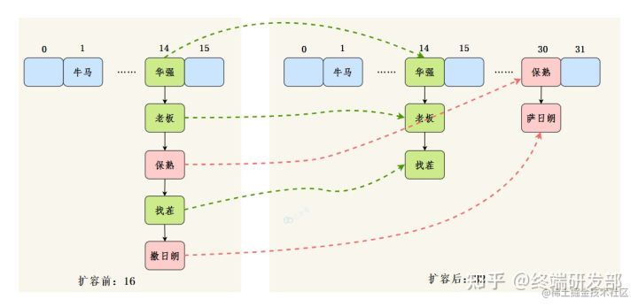

扩容节点迁移主要逻辑

java.util.HashMap#resize -- line:712

```java
if (e.next == null)
  //未形成链表，直接分配到新table
  newTab[e.hash & (newCap - 1)] = e;
else if (e instanceof TreeNode)
  //树节点分割
  ((TreeNode<K,V>)e).split(this, newTab, j, oldCap);
else { // preserve order
  //链表拆成两个链表lo、hi，两个链表的头、尾节点
  Node<K,V> loHead = null, loTail = null;
  Node<K,V> hiHead = null, hiTail = null;
  Node<K,V> next;
  do {
    //遍历链表，将节点放到对应的新链表
    next = e.next;
    if ((e.hash & oldCap) == 0) {
      if (loTail == null)
        loHead = e;
      else
        loTail.next = e;
      loTail = e;
    }
    else {
      if (hiTail == null)
        hiHead = e;
      else
        hiTail.next = e;
      hiTail = e;
    }
  } while ((e = next) != null);
  //lo链表放到新table的原位置
  if (loTail != null) {
    loTail.next = null;
    newTab[j] = loHead;
  }
  //hi链表放到 j + oldCap 位置
  if (hiTail != null) {
    hiTail.next = null;
    newTab[j + oldCap] = hiHead;
  }
}
```


## jdk1.8对HashMap主要做了哪些优化？为什么？

jdk1.8 的HashMap主要有五点优化：

1. **数据结构**：数组 + 链表改成了数组 + 链表或红黑树

   原因：发生 hash 冲突，元素会存入链表，链表过长转为红黑树，将时间复杂度由O(n)
   降为O(logn)

   

2. **链表插入方式**：链表的插入方式从头插法改成了尾插法
   简单说就是插入时，如果数组位置上已经有元素，1.7 将新元素放到数组中，原始节点作为新节点的后继节点，1.8 遍历链表，将元素放置到链表的最后。

   原因：因为 1.7 头插法扩容时，头插法会使链表发生反转，多线程环境下会产生环。

3. **扩容rehash**：扩容的时候 1.7 需要对原数组中的元素进行重新 hash 定位在新数组的位置，1.8 采用更简单的判断逻辑，不需要重新通过哈希函数计算位置，新的位置不变或索引 + 新增容量大小。

   原因：提高扩容的效率，更快地扩容。

4. **扩容时机**：在插入时，1.7 先判断是否需要扩容，再插入，1.8 先进行插入，插入完成再判断是否需要扩容；

5. **散列函数**：1.7 做了四次移位和四次异或，jdk1.8只做一次。

   原因：做 4 次的话，边际效用也不大，改为一次，提升效率。

   

   

## 为什么HashMap不用LinkedList,而选用数组?ArrayList，底层也是数组，为什么不用ArrayList?

因为用数组效率最高！
在HashMap中，定位桶的位置是利用元素的key的哈希值对数组长度取模得到。此时，我们已得到桶的位置。显然数组的查找效率比LinkedList大。
因为采用基本数组结构，扩容机制可以自己定义，HashMap中数组扩容刚好是2的次幂，在做取模运算的效率高。
而ArrayList的扩容机制是1.5倍扩容   

  

   

## 自己设计实现一个HashMap？

- 散列函数：hashCode()+除留余数法
- 冲突解决：链地址法
- 扩容：节点重新hash获取位置

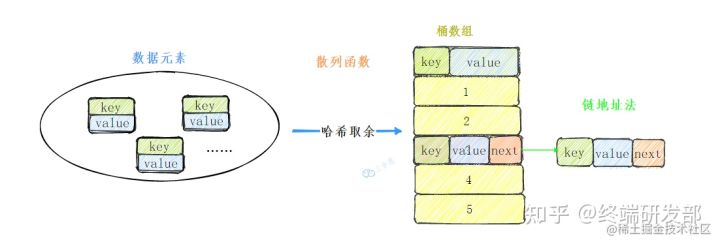

代码:

```java
public class CustomizeHashMap<K, V> {

  /**
     * 节点类
     *
     * @param <K>
     * @param <V>
     */
  class Node<K, V> {
    private K key;
    private V value;

    private Node<K, V> next;

    public Node(K key, V value) {
      this.key = key;
      this.value = value;
    }

    public Node(K key, V value, Node<K, V> next) {
      this.key = key;
      this.value = value;
      this.next = next;
    }
  }

  // aka 16 默认容量
  static final int DEFAULT_INITIAL_CAPACITY = 1 << 4;

  //负载因子
  static final float DEFAULT_LOAD_FACTOR = 0.75f;

  //HashMap大小
  private int size;

  //桶数组
  Node<K, V>[] buckets;

  /**
     * 无参构造 设置桶数组默认容量
     */
  public CustomizeHashMap() {
    buckets = new Node[DEFAULT_INITIAL_CAPACITY];
    size = 0;
  }

  /**
     * 多构造器 指定桶数组容量
     *
     * @param capacity
     */
  public CustomizeHashMap(int capacity) {
    buckets = new Node[capacity];
    size = 0;
  }

  /**
     * 哈希函数 获取地址
     *
     * @param key
     * @param length
     * @return
     */
  private int getIndex(K key, int length) {
    //获取hash code
    int hashCode = key.hashCode();
    //跟取桶数组长度取余
    int index = hashCode % length;
    return Math.abs(index);
  }

  /**
     * put方法
     *
     * @param key
     * @param value
     */
  public void put(K key, V value) {
    //判断是否需要扩容
    if (size >= buckets.length * DEFAULT_LOAD_FACTOR) {
      resize();
    }
    putVal(key, value, buckets);
  }

  /**
     * 将元素存入指定的node数组
     *
     * @param key
     * @param value
     * @param table
     */
  private void putVal(K key, V value, Node<K, V>[] table) {
    //获取位置
    int index = getIndex(key, table.length);
    Node node = table[index];
    //插入的位置为空
    if (node == null) {
      table[index] = new Node<>(key, value);
      size++;
      return;
    }
    //插入的位置不为空，说明发生冲突，使用链地址法，遍历列表
    while (node != null) {
      //如果key相同 就覆盖
      if ((node.key.hashCode() == key.hashCode()) && (node.key == key || node.key.equals(key))) {
        node.value = value;
        return;
      }
      node = node.next;
    }
    //当前key不在链表中，插入链表头部
    Node newNode = new Node(key, value, table[index]);
    table[index] = newNode;
    size++;
  }

  /**
     * 扩容
     */
  private void resize() {
    //创建一个两倍容量的桶数组
    Node<K, V>[] newBuckets = new Node[buckets.length * 2];
    //将当前元素重新散列到新的桶数组
    rehash(newBuckets);
    buckets = newBuckets;
  }

  /**
     * 重新散列当前元素
     *
     * @param newBuckets
     */
  private void rehash(Node<K, V>[] newBuckets) {
    //map大小重新计算
    size = 0;
    //将旧的桶数组的元素全部刷入新的桶数组中
    for (int i = 0; i < buckets.length; i++) {
      //为空，跳过
      if (buckets[i] == null) {
        continue;
      }
      Node<K, V> node = buckets[i];
      while (node != null) {
        //将元素放入新数组
        putVal(node.key, node.value, newBuckets);
        node = node.next;
      }
    }
  }

  /**
     * 获取元素
     *
     * @param key
     * @return
     */
  public V get(K key) {
    //获取key对应的地址
    int index = getIndex(key, buckets.length);
    if (buckets[index] == null) {
      return null;
    }
    Node<K, V> node = buckets[index];
    //查找链表
    while (node != null) {
      if ((node.key.hashCode() == key.hashCode()) && (node.key == key || node.key.equals(key))) {
        return node.value;
      }
      node = node.next;
    }
    return null;
  }

  /**
     * 返回HashMap大小
     *
     * @return
     */
  public int size() {
    return size;
  }
}
```


## HashMap 是否线程安全？多线程下会有什么问题？

HashMap不是线程安全的，可能会发生这些问题：

- 多线程下扩容死循环。JDK1.7 中的 HashMap 使用头插法插入元素，在多线程的环境下，扩容的时候有可能导致环形链表的出现，形成死循环。因此，JDK1.8 使用尾插法插入元素，在扩容时会保持链表元素原本的顺序，不会出现环形链表的问题。

- 多线程的 put 可能导致元素的丢失。多线程同时执行 put 操作，如果计算出来的索引位置是相同的，那会造成前一个 key 被后一个 key 覆盖，从而导致元素的丢失。此问题在 JDK 1.7 和 JDK 1.8 中都存在。

- put 和 get 并发时，可能导致 get 为 null。线程 1 执行 put 时，因为元素个数超出 threshold 而导致 rehash，线程 2 此时执行 get，有可能导致这个问题。这个问题在 JDK 1.7 和 JDK 1.8 中都存在。

  

### 如何解决HashMap线程不安全问题？

Java 中有 HashTable、Collections.synchronizedMap、以及 ConcurrentHashMap 可以实现线程安全的 Map。

- HashTable 是直接在操作方法上加 synchronized 关键字，锁住整个table数组，粒度比较大；
- Collections.synchronizedMap 是使用 Collections 集合工具的内部类，通过传入 Map 封装出一个 SynchronizedMap 对象，内部定义了一个对象锁，方法内通过对象锁实现；
- ConcurrentHashMap 在jdk1.7中使用分段锁，在jdk1.8中使用CAS+synchronized。

#### 能具体说一下ConcurrentHashmap的实现吗？

- ConcurrentHashmap线程安全在jdk1.7版本是基于**`分段锁`**实现
- jdk1.8是基于**`CAS+synchronized`**实现。

##### 分段锁

从结构上说，1.7版本的ConcurrentHashMap采用分段锁机制，里面包含一个Segment数组，Segment继承于ReentrantLock，Segment则包含HashEntry的数组，HashEntry本身就是一个链表的结构，具有保存key、value的能力能指向下一个节点的指针。

实际上就是相当于每个Segment都是一个HashMap，默认的Segment长度是16，也就是支持16个线程的并发写，Segment之间相互不会受到影响。

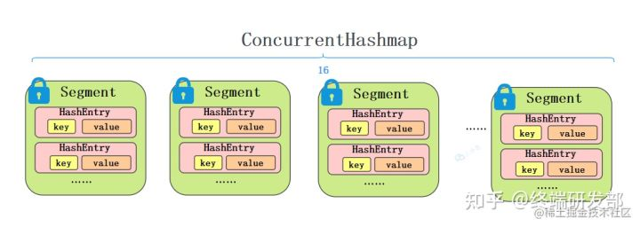

###### put流程

整个流程和HashMap非常类似，只不过是先定位到具体的Segment，然后通过ReentrantLock去操作而已，后面的流程，就和HashMap基本上是一样的。

1. 计算hash，定位到segment，segment如果是空就先初始化
2. 使用ReentrantLock加锁，如果获取锁失败则尝试自旋，自旋超过次数就阻塞获取，保证一定获取锁成功
3. 遍历HashEntry，就是和HashMap一样，数组中key和hash一样就直接替换，不存在就再插入链表，链表同样操作

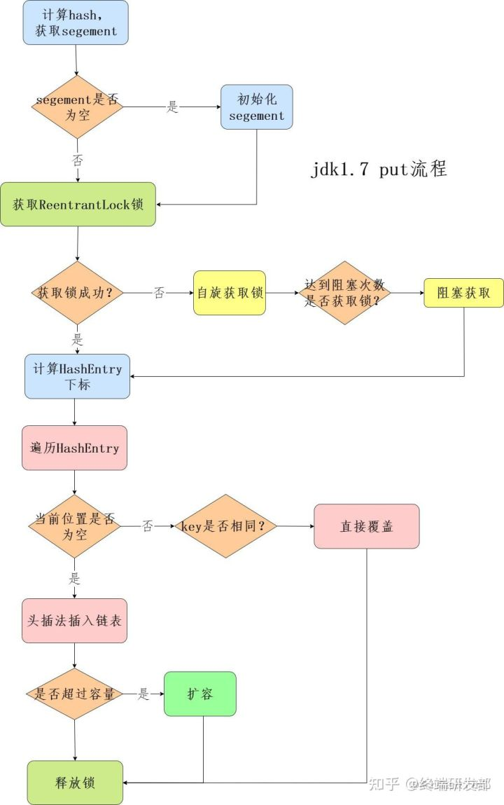

###### get流程

get也很简单，key通过hash定位到segment，再遍历链表定位到具体的元素上，需要注意的是value是volatile的，所以get是不需要加锁的。


##### CAS+synchronized

JDK 1.8 实现线程安全不是在数据结构上下功夫，它的数据结构和HashMap是一样的，数组+链表+红黑树。它实现线程安全的关键点在于put流程。

**put流程**

1. 首先计算hash，遍历node数组，如果node是空的话，就通过CAS+自旋的方式初始化

```text
 tab = initTable();
```

node数组初始化：

```java
private final Node<K,V>[] initTable() {
  Node<K,V>[] tab; int sc;
  while ((tab = table) == null || tab.length == 0) {
    //如果正在初始化或者扩容
    if ((sc = sizeCtl) < 0)
      //等待
      Thread.yield(); // lost initialization race; just spin
    else if (U.compareAndSwapInt(this, SIZECTL, sc, -1)) {   //CAS操作
      try {
        if ((tab = table) == null || tab.length == 0) {
          int n = (sc > 0) ? sc : DEFAULT_CAPACITY;
          @SuppressWarnings("unchecked")
          Node<K,V>[] nt = (Node<K,V>[])new Node<?,?>[n];
          table = tab = nt;
          sc = n - (n >>> 2);
        }
      } finally {
        sizeCtl = sc;
      }
      break;
    }
  }
  return tab;
}
```

2.如果当前数组位置是空则直接通过CAS自旋写入数据

```java
static final <K,V> boolean casTabAt(Node<K,V>[] tab, int i,
                                    Node<K,V> c, Node<K,V> v) {
  return U.compareAndSwapObject(tab, ((long)i << ASHIFT) + ABASE, c, v);
}
```

1. 如果hash==MOVED，说明需要扩容，执行扩容

```java
else if ((fh = f.hash) == MOVED)
  tab = helpTransfer(tab, f);


final Node<K,V>[] helpTransfer(Node<K,V>[] tab, Node<K,V> f) {
  Node<K,V>[] nextTab; int sc;
  if (tab != null && (f instanceof ForwardingNode) &&
      (nextTab = ((ForwardingNode<K,V>)f).nextTable) != null) {
    int rs = resizeStamp(tab.length);
    while (nextTab == nextTable && table == tab &&
           (sc = sizeCtl) < 0) {
      if ((sc >>> RESIZE_STAMP_SHIFT) != rs || sc == rs + 1 ||
          sc == rs + MAX_RESIZERS || transferIndex <= 0)
        break;
      if (U.compareAndSwapInt(this, SIZECTL, sc, sc + 1)) {
        transfer(tab, nextTab);
        break;
      }
    }
    return nextTab;
  }
  return table;
}
```

1. 如果都不满足，就使用synchronized写入数据，写入数据同样判断链表、红黑树，链表写入和HashMap的方式一样，key hash一样就覆盖，反之就尾插法，链表长度超过8就转换成红黑树

```java
synchronized (f){
  ……
}
```

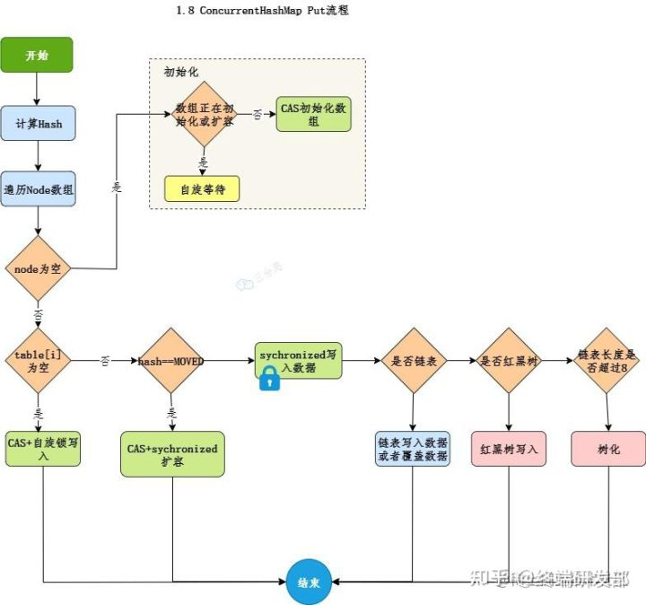

**get查询**

get很简单，和HashMap基本相同，通过key计算位置，table该位置key相同就返回，如果是红黑树按照红黑树获取，否则就遍历链表获取。


## HashMap和HashTable的区别

1.HashMap允许Key-value为null，hashTable不允许；

2.hashMap没有考虑同步，是线程不安全的。hashTable是线程安全的，给api套上了一层synchronized修饰;

3.HashMap继承于AbstractMap类，hashTable继承与Dictionary类。

4.迭代器(Iterator)。HashMap的迭代器(Iterator)是fail-fast迭代器，而Hashtable的enumerator迭代器不是fail-fast的。所以当有其它线程改变了HashMap的结构（增加或者移除元素），将会抛出ConcurrentModificationException。

5.容量的初始值和增加方式都不一样：HashMap默认的容量大小是16；增加容量时，每次将容量变为"原始容量x2"。Hashtable默认的容量大小是11；增加容量时，每次将容量变为"原始容量x2 + 1"；

6.添加key-value时的hash值算法不同：HashMap添加元素时，是使用自定义的哈希算法。Hashtable没有自定义哈希算法，而直接采用的key的hashCode()。


## 可以使用CocurrentHashMap来代替Hashtable吗？

HashTable虽然性能上不如ConcurrentHashMap，单并不能完全被取代，两者的迭代器的一致性不同的，HashTable的迭代器是强一致性的，而ConcurrentHashMap是弱一致性的。 ConcurrentHashMap的get，clear，iterator都是弱一致性的。Doug Lea也将这个判断留给用户自己决定是否使用ConcurrentHashMap。

### 什么是强一致性和弱一致性？

get方法是弱一致的，是什么含义？

可能你期望往ConcurrentHashMap底层数据结构中加入一个元素后，立马能对get可见，但ConcurrentHashMap并不能如你所愿。换句话说，put操作将一个元素加入到底层数据结构后，get可能在某段时间内还看不到这个元素，若不考虑内存模型，单从代码逻辑来看，却是应该可以看到的。

### 总结

ConcurrentHashMap的弱一致性主要是为了提升效率，是一致性与效率之间的一种权衡。要成为强一致性，就得到处使用锁，甚至是全局锁，这就与Hashtable的同步HashMap一样了。


## HashMap 内部节点是有序的吗？

HashMap是无序的，根据 hash 值随机插入。如果想使用有序的Map，可以使用LinkedHashMap 或者 TreeMap。

### 讲讲 LinkedHashMap 怎么实现有序的？

LinkedHashMap维护了一个双向链表，有头尾节点，同时 LinkedHashMap 节点 Entry 内部除了继承 HashMap 的 Node 属性，还有 before 和 after 用于标识前置节点和后置节点。

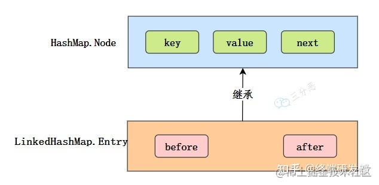

可以实现按插入的顺序或访问顺序排序。

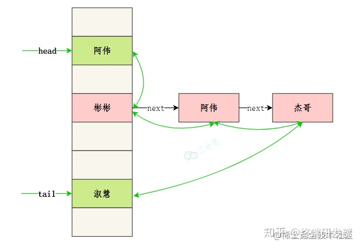

### 讲讲 TreeMap 怎么实现有序的？

TreeMap 是按照 Key 的自然顺序或者 Comprator 的顺序进行排序，内部是通过红黑树来实现。所以要么 key 所属的类实现 Comparable 接口，或者自定义一个实现了 Comparator 接口的比较器，传给 TreeMap 用于 key 的比较。

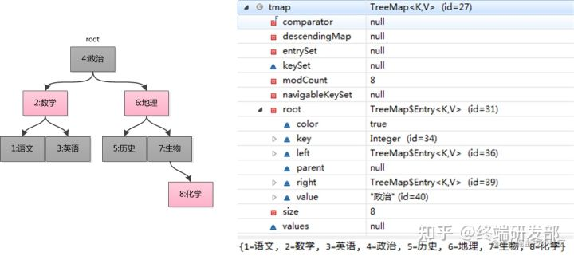


## 讲讲HashSet的底层实现？

HashSet 底层就是基于 HashMap 实现的。（ HashSet 的源码⾮常⾮常少，因为除了 clone() 、 writeObject() 、 readObject() 是 HashSet⾃⼰不得不实现之外，其他⽅法都是直接调⽤ HashMap 中的⽅法。

HashSet的add方法，直接调用HashMap的put方法，将添加的元素作为key，new一个Object作为value，直接调用HashMap的put方法，它会根据返回值是否为空来判断是否插入元素成功。

```java
public boolean add(E e) {
  return map.put(e, PRESENT)==null;
}
```

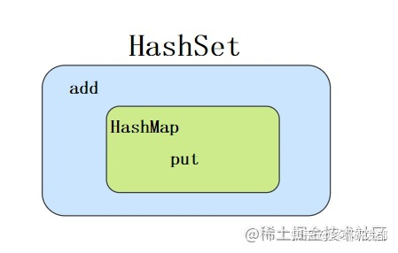

而在HashMap的putVal方法中，进行了一系列判断，最后的结果是，key在HashMap中存在，就会返回旧值。HashSet add方法就会返回false。

```java
if (e != null) { // existing mapping for key
  V oldValue = e.value;
  if (!onlyIfAbsent || oldValue == null)
    e.value = value;
  afterNodeAccess(e);
  return oldValue;
}
```


## 术语

- Java中散列表用链表数组实现，每个链表被称为桶，想要查找表中对象的位置，就要先计算它的散列码，然后与桶的总数取余数，所得到的结果就是保存这个元素桶的索引。
- hash：翻译为”散列表“，就是把任意长度的输入，通过散列算法，变成固定长度输出，该输出结果是散列值。这种转换是一种压缩映射，散列表的空间通常小于输入的空间，不同的输入可能会散列成相同的输出，所以不能从散列表来唯一的确定输入值。
- hash冲突：就是根据key即经过一个函数f(key)得到的结果的作为地址去存放当前的key value键值对(这个是hashmap的存值方式)，但是却发现算出来的地址上已经有人先来了。就是说这个地方要挤一挤啦。这就是所谓的hash冲突啦。
- 散列冲突：Java8中，桶满时会丛链表变为平衡二叉树（红黑树）。如果选择的散列函数不当，会产生很多的冲突，或者如果有恶意的代码试图在散列表中填充多个有相同散列码的值。转变成红黑树就能够提高性能。
- 加载因子（装填因子）：决定何时对散列表进行在散列。例如默认为0.75，则表中超过75%的位置已经填入元素，这个表就会用双倍的桶数（bucket）自动的进行在散列。
- 拉链法：将链表与数组结合。也就是说创建一个链表数组，数组中每一格就是一个数组。若遇到哈希冲突，则将冲突的值加到链表中就可以了。
- 桶的个数就是数组的长度，默认为16。


###### 来源:

https://blog.csdn.net/qq_43663493/article/details/121066974

https://rumenz.com/rumenbiji/hashmap-interview.html

https://coolshell.cn/articles/9606.html

https://zhuanlan.zhihu.com/p/524639821

https://bbs.huaweicloud.com/blogs/363086

https://javarevisited.blogspot.com/2011/04/difference-between-concurrenthashmap.html

https://blog.csdn.net/fhxyryxc/article/details/115068339

https://blog.csdn.net/m0_60907200/article/details/123475580

https://blog.csdn.net/wozhendeb/article/details/112340757

https://blog.csdn.net/weixin_40695212/article/details/79388994
