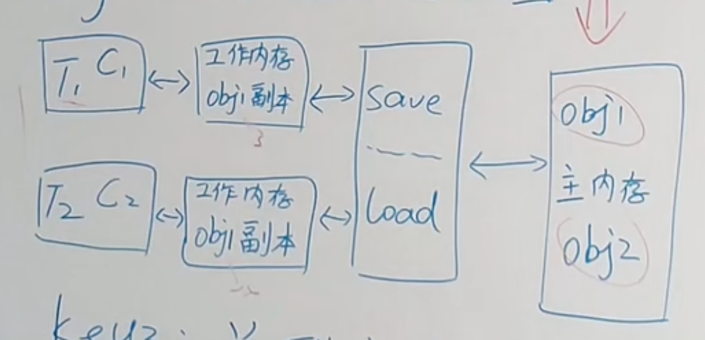
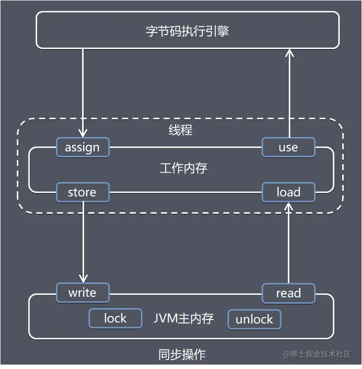
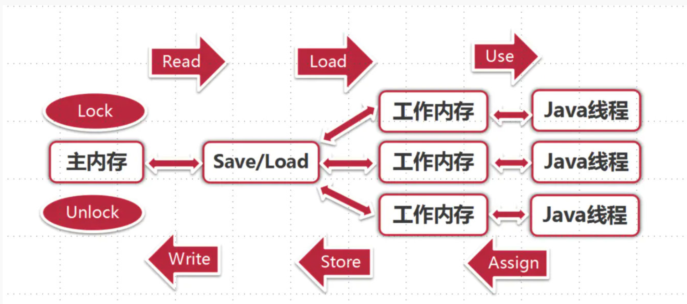
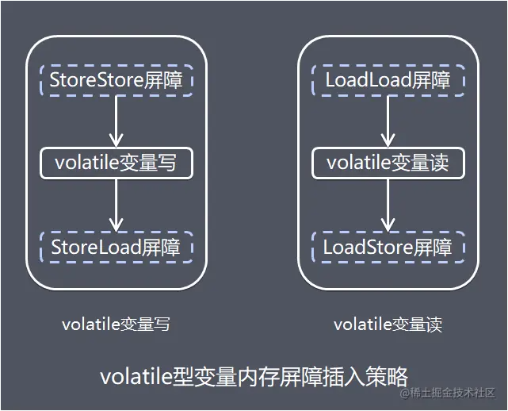

# Java内存模型概念

java内存模型（java memory model，简称JMM）用来屏蔽掉各种硬件和操作系统的内存访问差异，以实现让java程序在各种平台下都能达到一致的内存访问效果。

目标：定义程序中各个变量的访问规则，即在虚拟机中将变量从内存中进行存储和取出这样的底层细节。

- 内存模型的组成

  - 主内存

    java内存模型规定，所有变量都存储在主内存（Main Memory）中

- - 工作内存

    每条线程都有自己的工作内存（working memory，又称本地内存），工作内存是JMM的一个抽象概念，并不真实存在，它涵盖了：缓存、写缓冲区、寄存器以及其他硬件和编译器优化



**「线程T1和线程T2是通过共享变量Obj副本在进行【隐式通信】，如果线程T1更新后数据并没有立即写回到主存，而此时线程T2去读取数据，则读到的是过期的数据，即【脏读】现象」**。

> 为避免脏读，一般通过同步机制（控制不同线程间操作发生的相对顺序）来解决，或通过volatile关键字使变量都能够强制刷新到主存，从而对每个线程都是可见的。

<!-- more -->

# 内存交互

关于主内存和工作内存之间的具体交互协议，即一个变量如何从主内存拷贝到工作内存、如何从工作内存同步回主内存之类的实现细节，java内存模型中定义了8种操作

​    

  - lock（锁定）

    作用于主内存变量，它把一个变量标识为一条线程独占的状态。

  - unlock（解锁）

    作用于主内存变量，它把一个处于锁定状态的变量释放出来，释放后的变量才可以被其他变量锁定

  - read（读取）

    作用于主内存变量，它把一个变量的值从主内存传输到线程的工作内存中，以便于随后的load动作使用

  - load（载入）

    作用于工作内存的变量，它把read操作从主内存中得到的变量值放入工作内存的变量副本中

  - use（使用）

    作用于工作内存的变量，它把工作内存中一个变量的值传递给执行引擎，每当虚拟机遇到一个需要使用到变量的值的字节码指令时就会执行这个操作

  - assign（赋值）

    作用于工作内存的变量，它把一个从执行引擎收到的值赋给工作内存的变量，每当虚拟机遇到一个给变量赋值的字节码指令时就会执行这个操作

  - store（存储）

    作用于工作内存的变量，它把工作内存中一个变量的值传送到主内存中，以便随后write操作使用

  - write（写入）

    作用于主内存的变量，它把store操作从主内存中得到的变量的值放入到主内存中



# 指令重排序

## 重排序概念

在执行程序时**「为了提高性能，编译器和处理器常常会对指令做重排序」**。从 java 源代码到最终实际执行的指令序列，会分别经历下面三种重排序：

- **「编译器优化的重排序」**

  编译器在不改变单线程程序语义的前提下，可以重新安排语句的执行顺序。

- **「指令级并行的重排序」**

  处理器将多条指令重叠执行。如果不存在数据依赖性，处理器可以改变语句对应机器指令的执行顺序。

- **「内存系统的重排序」**

  处理器使用缓存和读/写缓冲区，使得加载和存储操作看上去可能是在乱序执行。

## 数据依赖性

**「如果两个操作访问同一个变量，且这两个操作中有一个为【写操作】，此时这两个操作之间就存在数据依赖性，存在数据依赖关系的两个操作，不可以重排序」**。

> **「指令重排序需要遵守数据依赖性」**

数据依赖性存在三种情况：

- **「写后读」**

  写一个变量之后，再读这个位置。

- **「写后写」**

  写一个变量之后，再写这个变量。

- **「读后写」**

  读一个变量之后，再写这个变量。

数据依赖性仅针对单个处理器中执行的指令序列和单个线程中执行的操作，不同处理器之间和不同线程之间的数据依赖性不被编译器和处理器考虑。

## as-if-serial

**「即：不管怎么重排序（编译器和处理器为了提高并行度），（单线程）程序的执行结果不能被改变」**。

## happens-before

### 什么是happens-before

happen-before是JMM最核心的概念，JMM可以通过happen-before关系向程序提供跨线程的内存可见性保证（**「如果A线程的写操作a与B线程的读操作b之间存在happens-before关系，尽管a操作和b操作在不同的线程中执行，但JMM向程序保证a操作将对b操作可见」**）。

- 如果操作A  happens-before  操作B，那么操作A的执行结果将对操作B可见，而且操作A的执行顺序排在操作B之前。

- 两个操作之间存在happens-before关系，并不意味着Java平台的具体实现必须要按照happens-before关系指定的顺序来执行。

  > 如果重排序之后的执行结果，与按happens-before关系来执行的结果一致，那么JMM是允许这种重排序。

### happen-before具体的规则

- **「程序顺序规则」**一个线程内，按照代码顺序，前面的操作先行发生（happens-before）于后面的操作

- **「监视器锁规则」**一个解锁操作先行发生（happens-before）于后面对同一个锁额lock操作（即先解锁后加锁）。

- **「volatile变量规则」**对一个volatile变量的写操作先行发生（happens-before）于后面对这个变量的读操作（即先写后读）。

- **「传递规则」**如果操作A先行发生于操作B，而操作B又先行发生于操作C，那么操作A先行发生于操作C。

  > 即：如果A happens-before B，且B happens-before C，那么A happens-before C。

- **「线程启动规则(start()规则)」**如果线程A执行操作ThreadB.start()（启动线程B），那么A线程的ThreadB.start()操作happens-before于线程B中的任意操作。

- **「线程中断规则」**对线程interrupt()方法的调用先行发生于被中断线程的代码检测到中断事件的发生。

- **「线程终结规则(Join()规则)」**如果线程A执行操作ThreadB.join()并成功返回，那么线程B中的任意操作先行发生(happens-before)于线程A从ThreadB.join()操作成功返回。

- **「对象终结规则(对象finalize规则)」**一个对象的初始化完成（构造函数执行结束）先行于发生它的finalize()方法的开始。

# 同步规则

- 不允许 read 和 load、store 和 write 操作之一单独出现，即不允许一个变量从主内存读取了但工作内存不接受，或者从工作内存发起回写了但主内存不接受的情况出现。
- 不允许一个线程丢弃它的最近的 assign 操作，即变量在工作内存中改变了之后必须把该变化同步回主内存。
- 不允许一个线程无原因地（没有发生过任何 assign 操作）把数据从线程的工作内存同步回主内存中。
- 一个新的变量只能在主内存中 “诞生”，不允许在工作内存中直接使用一个未被初始化（load 或 assign）的变量，换句话说就是对一个变量实施 use 和 store 操作之前，必须先执行过了 assign 和 load 操作。
- 一个变量在同一个时刻只允许一条线程对其进行 lock 操作，但 lock 操作可以被同一条线程重复执行多次，多次执行 lock 后，只有执行相同次数的 unlock 操作，变量才会被解锁。
- 如果对一个变量执行 lock 操作，将会清空工作内存中此变量的值，在执行引擎使用这个变量前，需要重新执行 load 或 assign 操作初始化变量的值。
- 如果一个变量事先没有被 lock 操作锁定，则不允许对它执行 unlock 操作，也不允许去 unlock 一个被其他线程锁定住的变量。

# JVM内存操作的并发问题

**1.工作内存数据一致性** 

各个线程操作数据时会保存使用到的主内存中的共享变量副本，当多个线程的运算任务都涉及到同一个共享变量时，将导致各自的共享变量副本不一致，如果发生这种情况，以谁的副本为准呢?

**2.指令重排序优化** 

java中重排序通常是编译器或运行时环境为了优化程序性能而采取的对指令进行重新排序的一种手段。重排序分为两类：**编译器重排序和运行期重排序**，分别对应编译器和运行时环境，指令重排序满足两个条件：

1.单线程情况下，要给程序一个顺序执行的假象，即经过重排序的执行结果与顺序执行的结果保持一致

2.存在数据依赖关系的不允许重排序

# 内存交互的3个基本特征

1. **原子性** 
2. **可见性** 
3. **有序性**

# 内存屏障

1.java中如何保证底层操作的有序性和可见性呢？可以通过内存屏障。

内存屏障是被插入两个CPU指令之间的一种指令，用来**禁止**处理器指令发生**重排序**，从而保障**有序性**的。

为了达到屏障的效果，它也会使处理器写入、读取之前，将**主内存的值写入高速缓存**，**清空无效队列**，从而**保障可见性**。

例：

```
Store1; 

Store2;   

Load1;   

StoreLoad;  //内存屏障

Store3;   

Load2;   

Load3;
```


2.常见的四种屏障

1）LoadLoad屏障：对于这样的语句：Load1；LoadLoad；Load2，在load2及后续读操作要读取的数据被访问前，保证Load1要读取的数据被读取完毕。

2）StoreStore屏障：例：Store1;StoreStore;Store2，在Store2及后续写入操作执行前，保证Store1的写入操作对其他处理器可见。

3）LoadStore屏障：例：Load1;LoadStore;Store2，在Store2及后续写入操作执行前，保证Load1要读取的数据被读取完毕。

4）StoreLoad屏障：例：Store1;StoreLoad;Load2,在Load2及后续所有读操作执行前，保证Store1的写入对所有处理器可见（开销最大，冲刷写缓冲区，清空无效队列）。在大多数处理器中，这个屏障是个万能屏障

# Volatile

volatile的中文意思是不稳定的、易变的，用volatile修饰的变量是为了**保证变量的可见性**。

volatile有两种语义：

1.**保证可见性**，

线程写volatile变量的过程：

1）改变线程工作内存中volatile变量副本的值

2）将改变后的副本的值从工作内存刷到主内存中

线程读volatile变量值的过程

1）从主内存中读取volatile变量的最新值到线程的工作内存中

2）从工作内存中读取volatile变量的副本

**2.禁止进行指令重排序**

1）当程序执行到volatile变量的**读操作或者写操作时**，在**其前面的操作的更改肯定已经全部进行**，**且结果对后面的操作可见**（happens-before）；在**其后面的操作肯定还没有进行**

2）在进行指令优化时，不能将在对volatile变量访问的语句放在其后面执行，也不能讲volatile变量后面的语句放在其前面执行（不能改变volatile变量前后的语句顺序）

**3.实现原理**




###### 来源：

https://rumenz.com/rumenbiji/java-jmm-synchronize-eight-operations.html

https://www.modb.pro/db/443675

https://www.modb.pro/db/448549
