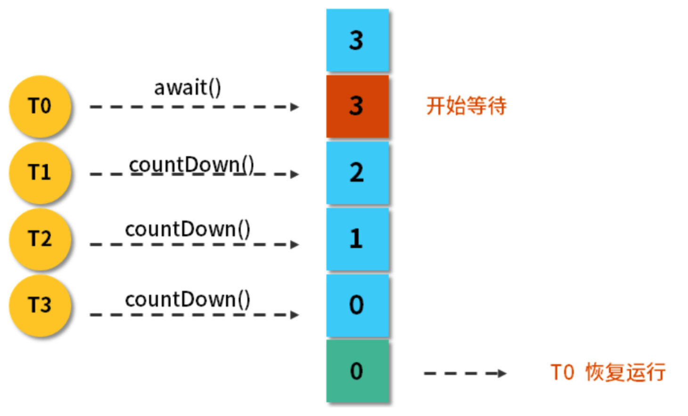
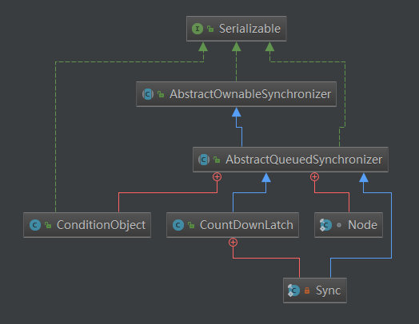
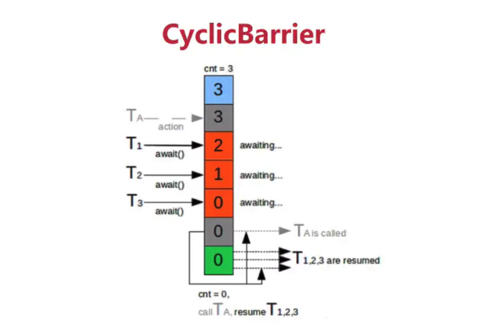
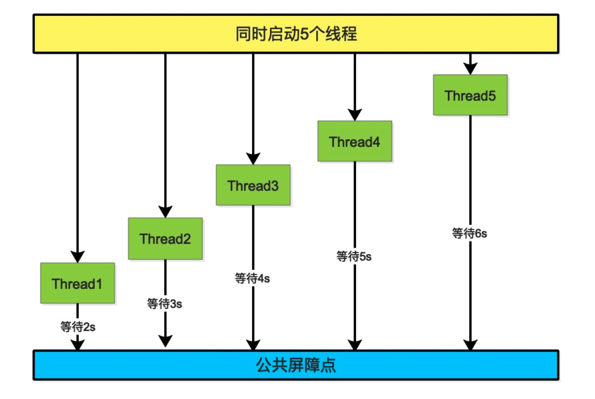

# Java同步组件概况

- **CountDownLatch** : 是闭锁,通过一个计数来保证线程是否一直阻塞
- **Semaphore**: 控制同一时间,并发线程数量
- CyclicBarrier:字面意思是回环栅栏,通过它可以实现让一组线程等待至某个状态之后再全部同时执行。
- ReentrantLock:是一个重入锁,一个线程获得了锁之后仍然可以反复加锁,不会出现自己阻塞自己的情况。
- Condition:配合`ReentrantLock`,实现等待/通知模型
- FutureTask:FutureTask实现了接口Future，同Future一样，代表异步计算的结果。

<!-- more -->

# CountDownLatch

## 概述

> CountDownLatch 允许一个或多个线程等待直到在其他线程中执行的一组操作完成的同步辅助。简单来说，就是 CountDownLatch 内部维护了一个计数器，每个线程完成自己的操作之后都会将计数器减一，然后会在计数器的值变为 0 之前一直阻塞，直到计数器的值变为 0.



> 假设计数器的值是3,线程A调用`await()`方法后,当前线程就进入了等待状态,之后其它线程中执行`CountDownLatch`,计数器就会减1,当计数器从3变成0,线程A继续执行,`CountDownLatch`这个类可以阻塞当前线程,保证线程在某种条件下,继续执行。
>
> 构造器中的计数值(count)实际上就是闭锁需要等待的线程数量,这个值只能被设置一次,而且`CountDownLatch`没有提供任何机会修改这个计数值。

### CountDownLatch是一种灵活的闭锁实现

闭锁：闭锁是一种**同步工具**，可以延迟线程的进度直到其达到终止状态。

CountDownLatch：**是一种灵活的闭锁实现**，它可以使一个或者多个线程等待一组时间的发生

闭锁状态包含一个计数器，该计数器被初始化为一个正数，表示需要等待的事件数量。**countDownLatch方法递减计数器**，表示有一个事件已经发生了。而await方法等待计数器达到0，这表示所有需要等待的事件都已经发生。**如果计数器为非0，则await会一直阻塞**，直到计数器为0，或者等待中的线程中断或超时。

CountDownLatch强调的是**一个线程或者多个线程**需要**等待另外N个线程干完某件事之后才能继续执行**。


## 应用场景

> 这个例子主要演示了，如何利用 CountDownLatch 去协调多个线程同时开始运行。这个时候的 CountDownLatch 中的计数器的现实含义是等待创建的线程个数，每个线程在开始任务之前都会调用 await() 方法阻塞，直到所有线程都创建好，每当一个线程创建好后，都会提交调用 countDown() 方法将计数器的值减一 (代表待创建的线程数减一)。

```java
public static void main(String[] args) {
  Test countDownLatchTest=new Test();
  countDownLatchTest.runThread();
}
//计数器为10，代表有10个线程等待创建
CountDownLatch countDownLatch=new CountDownLatch(10);
/**
 * 创建一个线程
 * @return
 */
private Thread createThread(int i){
  Thread thread=new Thread(new Runnable() {
    @Override
    public void run() {
      try {
        //在此等待，直到计数器变为0
        countDownLatch.await();
        System.out.println("thread"+Thread.currentThread().getName()+"准备完毕"+System.currentTimeMillis());
      }catch (InterruptedException e){
        e.printStackTrace();
      }
    }
  });
  thread.setName("thread-"+i);
  return  thread;
}
public void runThread(){
  ExecutorService executorService= Executors.newFixedThreadPool(10);
  try {
    for(int i=0;i<10;i++){
      Thread.sleep(100);
      executorService.submit(createThread(i));
      //一个线程创建好了，待创建的线程数减一
      countDownLatch.countDown();
    }
  }catch (InterruptedException e){
    e.printStackTrace();
  }
}
```


## CountDownLatch源码分析

### 继承体系



### 计数器的本质是什么？

> 我们通过构造方法来查看：
> 我们的代码`CountDownLatch countDownLatch=new CountDownLatch(10);`背后实际上是调用了下面这个方法：

```java
public CountDownLatch(int count) {
    if (count < 0) throw new IllegalArgumentException("count < 0");
    this.sync = new Sync(count);
}
```

> 而这个 Sync 的实例化又做了什么工作呢？

```java
Sync(int count) {
  setState(count); //就是修改了AQS中的state值
}
```

> 现在已经解决了我们的第一个问题，实际上 AQS 中的 state 充当了计数器。

#### await 方法

- await 方法实际上是调用了 sync 的一个方法

  ```java
  public void await() throws InterruptedException {
    sync.acquireSharedInterruptibly(1);
  }
  ```

- sync 的`void acquireSharedInterruptibly(int arg)`的实现如下

  ```java
  public final void acquireSharedInterruptibly(int arg)
    throws InterruptedException {
    if (Thread.interrupted())
      //如果线程中断了，则抛异常。
      //证明了之前所说的CountDownLatch是会响应中断的
      throw new InterruptedException();
    if (tryAcquireShared(arg) < 0)
      doAcquireSharedInterruptibly(arg);
  }
  ```

- 如果没有中断，就会调用`tryAcquireShared(arg)`
  它的实现非常的简单，如果 state 为 0，就返回 1，否则返回 - 1

  ```java
  protected int tryAcquireShared(int acquires) {
    return (getState() == 0) ? 1 : -1;
  }
  ```

- 如果 state 不为 0，就会返回 - 1，if 条件成立，就会调用`doAcquireSharedInterruptibly(arg)`
  这个方法的实现，稍微复杂一点，但这个方法也不陌生了，它的功能就是把该线程加入等待队列中并阻塞，但是在入队之后，不一定会立即 park 阻塞，它会判断自己是否是第二个节点，如果是就会再次尝试获取。

  ```java
  private void doAcquireSharedInterruptibly(int arg)
    throws InterruptedException {
    final Node node = addWaiter(Node.SHARED);
    boolean failed = true;
    try {
      for (;;) {
        final Node p = node.predecessor(); //获取当前节点的前驱节点
        if (p == head) {//前一个节点是头节点
          int r = tryAcquireShared(arg); //去看一看state是否为0，步骤3分析过
          if (r >= 0) {
            //如果state目前为0，就出队
            setHeadAndPropagate(node, r);
            p.next = null; // help GC
            failed = false;
            return;
          }
        }
        if (shouldParkAfterFailedAcquire(p, node) &&
            parkAndCheckInterrupt())
          //进入阻塞队列阻塞，如果发生中断，则抛异常
          throw new InterruptedException();
      }
    } finally {
      if (failed)
        cancelAcquire(node);
    }
  ```

  

> CountDownLatch 的 await 方法比其它几个锁的实现简单得多。不过需要注意的一点就是 CountDownLatch 是会响应中断的，这一点在源码中也有多处体现。

#### countDown 方法

- countDown 方法实际上是调用 sync 中的一个方法

  ```java
  public void await() throws InterruptedException {
    sync.acquireSharedInterruptibly(1);
  }
  ```

  

- `boolean releaseShared(int arg)`的具体实现如下：

  ```java
  public final boolean releaseShared(int arg) {
    if (tryReleaseShared(arg)) {
      doReleaseShared();
      return true;
    }
    return false;
  }
  ```

  

- `tryReleaseShared(arg)`方法的具体实现如下：

  ```java
  protected boolean tryReleaseShared(int releases) {
    // Decrement count; signal when transition to zero
    for (;;) {//自旋
      int c = getState();
      if (c == 0)//计数器已经都是0了，当然会释放失败咯
        return false;
      int nextc = c-1;//释放后，计数器减一
      if (compareAndSetState(c, nextc))//CAS修改计数器
        return nextc == 0;
    }
  }
  ```

  > 这个方法就是去尝试直接修改 state 的值。如果 state 的修改成功，且修改后的 state 值为 0，就会返回 true。就会执行`doReleaseShared();`方法。

- `doReleaseShared();`的实现如下，它的作用就是 state 为 0 的时候，去唤醒等待队列中的线程。

  ```java
  
  private void doReleaseShared() {
    /*
           * Ensure that a release propagates, even if there are other
           * in-progress acquires/releases.  This proceeds in the usual
           * way of trying to unparkSuccessor of head if it needs
           * signal. But if it does not, status is set to PROPAGATE to
           * ensure that upon release, propagation continues.
           * Additionally, we must loop in case a new node is added
           * while we are doing this. Also, unlike other uses of
           * unparkSuccessor, we need to know if CAS to reset status
           * fails, if so rechecking.
           */
    for (;;) { //自旋
      Node h = head;
      if (h != null && h != tail) {
        int ws = h.waitStatus;
        if (ws == Node.SIGNAL) {
          if (!compareAndSetWaitStatus(h, Node.SIGNAL, 0))
            continue;            // loop to recheck cases
          unparkSuccessor(h);
        }
        else if (ws == 0 &&
                 !compareAndSetWaitStatus(h, 0, Node.PROPAGATE))
          continue;                // loop on failed CAS
      }
      if (h == head)                   // loop if head changed
        break;
    }
  }
  ```

# Semaphore

## 概述

> `Semaphore`经常用于限制获取某种资源的线程数量,其内部是基于`AQS`的共享模式,AQS的状态可以表示许可证的数量,许可证数量不够线程被挂起;而一旦有一个线程释放资源,那么可唤醒等待队列中的线程继续执行。
>
> 计数信号量用来控制同时访问某个特定资源的操作数量，或者同时执行某个指定操作的数量。信号量还可以用来实现某种资源池，或者对容器施加边界。


> `Semaphore`翻译过来就是信号量,`Semaphore`可以阻塞进程并控制同时访问的线程数,通过`acquire()`获取一个许可,如果没有就等待,而`release()`释放一个许可,`Semaphore`有点类似锁。
>
> `CountDownLatch`和`Semaphore`在使用时,通过和线程池配合使用。
> `Semaphore`适合控制并发,`CountDownLatch`比较适合保证线程执行完后再执行其它处理,因此模拟并发两者结合最好。

## 应用场景

> `Semaphore`适合做流量控制,特别是共享的有限资源,比如数据库连接,假如有一个需求，要读取几万个文件的数据，因为都是IO密集型任务，我们可以启动几十个线程并发的读取，但是如果读到内存后，还需要存储到数据库中，而数据库的连接数只有10个，这时我们必须控制只有十个线程同时获取数据库连接保存数据，否则会报错无法获取数据库连接。这个时候，我们就可以使用Semaphore来做流控。

```java
import java.util.concurrent.ExecutorService;
import java.util.concurrent.Executors;
import java.util.concurrent.Semaphore;

public class SemaphoreExample1 {
    private static Integer clientTotal=30;
    private static Integer threadTotal=3;
    public static void main(String[] args) throws Exception {
        ExecutorService executorService = Executors.newCachedThreadPool();
        Semaphore semaphore=new Semaphore(threadTotal);
        for (int i = 0; i < clientTotal; i++) {
            final Integer j=i;
            executorService.execute(()->{
                try{
                    semaphore.acquire(); // 获取一个许可
                    update(j);
                    semaphore.release(); // 释放一个许可
                }catch (Exception e) {
                    e.printStackTrace();
                }
            });
        }
        executorService.shutdown();
    }
    private static void update(Integer j) throws Exception {
        System.out.println(j);
        Thread.sleep(2000);
    }
}
```

> 每2秒打印3个数字。

```java
import java.util.concurrent.ExecutorService;
import java.util.concurrent.Executors;
import java.util.concurrent.Semaphore;

public class SemaphoreExample1 {
  private static Integer clientTotal=30;
  private static Integer threadTotal=3;
  public static void main(String[] args) throws Exception {
    ExecutorService executorService = Executors.newCachedThreadPool();
    Semaphore semaphore=new Semaphore(threadTotal);
    for (int i = 0; i < clientTotal; i++) {
      final Integer j=i;
      executorService.execute(()->{
        try{
          semaphore.acquire(3); // 获取多个许可
          update(j);
          semaphore.release(3); // 释放多个许可
        }catch (Exception e) {
          e.printStackTrace();
        }
      });
    }
    executorService.shutdown();
  }
  private static void update(Integer j) throws Exception {
    System.out.println(j);
    Thread.sleep(2000);
  }
}
```

> 每2秒打印一个数字。

### tryAcquire

> 尝试获取许可，如果获取不成功，则放弃操作，tryAcquire方法提供几个重载

- tryAcquire() : boolean
- tryAcquire(int permits) : boolean 尝试获取指定数量的许可
- tryAcquire(int permits,long timeout,TimeUnit timeUnit) : boolean
- tryAcquire(long timeout,TimeUnit timeUnit) : boolean 尝试获取许可的时候可以等待一段时间，在指定时间内未获取到许可则放弃

## `Semaphore`源码分析

> Semaphore有两种模式，公平模式和非公平模式。公平模式就是调用acquire的顺序就是获取许可证的顺序，遵循FIFO；而非公平模式是抢占式的，也就是有可能一个新的获取线程恰好在一个许可证释放时得到了这个许可证，而前面还有等待的线程。

```java
// 非公平模式
public Semaphore(int permits) {
  sync = new NonfairSync(permits);
}
// fair=true为公平模式，false=非公平模式
public Semaphore(int permits, boolean fair) {
  sync = fair ? new FairSync(permits) : new NonfairSync(permits);
}
```

```java
public class Semaphore implements java.io.Serializable {
  /*
     * 只指定许可量，构造不公平模式
     */
  public Semaphore(int permits) {
    sync = new NonfairSync(permits);
  }
  /*
     * 指定许可量，并指定模式
     */
  public Semaphore(int permits, boolean fair) {
    sync = fair ? new FairSync(permits) : new NonfairSync(permits);
  }
  //Semaphore内部基于AQS的共享模式，所以实现都委托给了Sync类。 
  abstract static class Sync extends AbstractQueuedSynchronizer {}
  /**
     * NonFair version
     */
  static final class NonfairSync extends Sync {
    private static final long serialVersionUID = -2694183684443567898L;
    NonfairSync(int permits) {
      // 可以看到调用了setState方法，也就是说AQS中的资源就是许可证的数量。
      super(permits);
    }
    protected int tryAcquireShared(int acquires) {
      return nonfairTryAcquireShared(acquires);
    }
  }
  /**
     * Fair version
     */
  static final class FairSync extends Sync {
    private static final long serialVersionUID = 2014338818796000944L;
    FairSync(int permits) {
      // 可以看到调用了setState方法，也就是说AQS中的资源就是许可证的数量。
      super(permits);
    }
    protected int tryAcquireShared(int acquires) {
      for (;;) {
        if (hasQueuedPredecessors())
          return -1;
        int available = getState();
        int remaining = available - acquires;
        if (remaining < 0 ||
            compareAndSetState(available, remaining))
          return remaining;
      }
    }
  }
}
```


# CyclicBarrier

## 概述

> `CycliBarrier`是一个同步辅助类,它允许一组线程相互等待,直到到达某个公共的屏障点(common barrier point),也称之为栅栏点。通过它可以多个线程之间的相互等待,只有当每个线程都准备就绪后,才能各自完成后续的操作。它和`CountDownLatch`有相似的地方,都是通过计数器实现。当某个线程调用`await()`方法之后,该线程就进去了等待状态,计数器执行的是加一操作,当计数器到达初始值,前面调用`await()`的线程会被唤醒,继续执行后面的操作。由于`CyclicBarrier`在等待线程释放后,可以被重用,所以被称为循环屏障。





## 与`CountDownLatch`比较

### 相同点

- 都是同步辅助类
- 使用计数器实现

### 不同点

- `CyclicBarrier`允许一个或多个线程,等待其它一组线程完成操作,再继续执行。
- `CyclicBarrier`允许一组线程之间相互等待,到达一个共同点,再继续执行。
- `CountDownLatch`不能被复用。
- `CyclicBarrier`适合更复杂的业务场景,如计算发生错误,通过重置计数器,并让线程重新执行。
- `CyclicBarrier`还提供其它有用的方法,比如`getNumberWaiting`方法可以获得`CyclicBarrier`阻塞的线程数量,`isBroken`方法用来知道阻塞的线程是否被中断。

## 应用场景

你希望创建一组任务，它们并行的执行工作，然后在下一个步骤之前等待，直到所有任务都完成。栅栏和闭锁的关键区别在于，所有线程必须同时达到栅栏位置，才能继续执行。

闭锁用于等待事件，而栅栏用于线程之间的彼此等待。等到都到的时候再做下一件事。

### `CountDownLatch`和`CyclicBarrier`的场景比较

> `CyclicBarrier` : 好比一扇门，默认情况下关闭状态，堵住了线程执行的道路，直到所有线程都就位，门才打开，让所有线程一起通过。
>
> `CyclicBarrier`可以用于多线程计算数据，最后合并计算结果的应用场景。比如我们用一个Excel保存了用户所有银行流水，每个Sheet保存一个帐户近一年的每笔银行流水，现在需要统计用户的日均银行流水，先用多线程处理每个sheet里的银行流水，都执行完之后，得到每个sheet的日均银行流水，最后，再用`barrierAction`用这些线程的计算结果，计算出整个Excel的日均银行流水。
>
> `CountDownLatch` : 监考老师发下去试卷，然后坐在讲台旁边玩着手机等待着学生答题，有的学生提前交了试卷，并约起打球了，等到最后一个学生交卷了，老师开始整理试卷，贴封条

```java
import java.util.concurrent.CyclicBarrier;
import java.util.concurrent.ExecutorService;
import java.util.concurrent.Executors;
public class CyclicBarrierExample {
  public static void main(String[] args) {
    CyclicBarrier cyclicBarrier=new CyclicBarrier(2,new Runnable(){
      @Override
      public void run() {
        System.out.println("汇总计算----");
      }
    });
    ExecutorService executorService = Executors.newCachedThreadPool();
    executorService.execute(()->{
      try{
        System.out.println("计算昨天的数据");
        Thread.sleep(5000);
        cyclicBarrier.await();
      }catch (Exception e){
        e.printStackTrace();
      }
    });
    executorService.execute(()->{
      try{
        System.out.println("计算今天的数据");
        Thread.sleep(3000);
        cyclicBarrier.await();
      }catch (Exception e){
        e.printStackTrace();
      }
    });
    executorService.shutdown();
  }
}
//计算昨天的数据
//计算今天的数据
//汇总计算----
```


# ReentrantLock

## 概述

`JAVA`中的锁分两类:`synchronized`关键字与`J.U.C`所提供的锁。`J.U.C`的核心锁是`ReentrantLock`,本质上都是`lock`与`unlock`的操作。

### `ReentrantLock`(可重入锁)和`synchronized`的区别

> 可重入性：ReentrantLock字面意思即为再进入锁，称为可重入锁，其实synchronize所使用的锁也是可以重入的，两者关于这个区别不大，它们都是同一个线程进入一次，锁的计数器进行自增，要等到锁的计数器下降为零时，才能释放锁
>
> 锁的实现：synchronized依赖于JVM实现无法了解底层源码，而ReentrantLock基于JDK实现。通过阅读源码，区别就类似于操作系统控制实现与用户使用代码实现。
>
> 性能区别：在synchronized优化以前，性能比ReentrantLock差很多，但自从synchronize引入了偏向锁、轻量级锁（自选锁）后 ，也就是自循锁后，两者性能差不多（JDK1.6以后，为了减少获得锁和释放锁所带来的性能消耗，提高性能，引入了“轻量级锁”和“偏向锁”）。在两种场景下都可以使用，官方更推荐使用synchronized，因为写法更容易。synchronized的优化其实是借鉴了ReentrantLock中的CAS技术，都是试图在用户态就把加锁问题解决，避免进入内核态的线程阻塞。

### `ReentrantLock`与`synchronized`的功能区别

- `synchronized`更加便利,它由编译器保证加锁与释放。`ReentrantLock`需要手动声明和释放锁,所以为了避免忘记手动释放锁造成死锁,所以最好在`finally`中声明释放锁。
- `ReentrantLock`的锁粒度更细更灵活。

### `ReentrantLock`特有功能

- `ReentrantLock`可以指定为公平或者非公平,`synchronized`是非公平锁。(公平锁的意思就是先等待的锁先获得锁)
- 提供一个`Condition`类,它可以分组唤醒需要唤醒的线程。不像`synchronized`要么随机唤醒一个,要么全部唤醒。
- 提供能够中断等待锁的线程的机制，通过lock.lockInterruptibly()实现，这种机制ReentrantLock是一种自选锁，通过循环调用CAS操作来实现加锁。性能比较好的原因是避免了进入内核态的阻塞状态。想进办法避免线程进入内核阻塞状态， 是我们分析和理解锁设计的关键

> 如果满足ReentrantLock三个独有的功能，那么必须使用ReentrantLock。其他情况下可以根据性能、业务场景等等来选择synchronized还是ReentrantLock

## 应用场景

>  synchronized能做的，ReentrantLock都能做；而ReentrantLock能做的，而synchronized却不一定做得了。性能方面，ReentrantLock不比synchronized差

- J.U.C包中的锁定类是用于高级情况和高级用户的工具，除非说你对Lock的高级特性有特别清楚的了解以及有明确的需要，或这有明确的证据表明同步已经成为可伸缩性的瓶颈的时候，否则我们还是继续使用synchronized
- 相比较这些高级的锁定类，synchronized还是有一些优势的，比如synchronized不可能忘记释放锁。 在退出synchronized块时，JVM会自动释放锁，会很容易忘记要使用finally释放锁，这对程序非常有害。
- 还有当JVM使用synchronized管理锁定请求和释放时，JVM在生成线程转储时能够包括锁定信息，这些信息对调试非常有价值，它们可以标识死锁以及其他异常行为的来源。 而Lock类知识普通的类，JVM不知道哪个线程具有Lock对象，而且几乎每个开发人员都是比较熟悉synchronized

```java
import com.google.common.net.InternetDomainName;
import java.util.concurrent.CountDownLatch;
import java.util.concurrent.ExecutorService;
import java.util.concurrent.Executors;
import java.util.concurrent.Semaphore;
import java.util.concurrent.locks.Lock;
import java.util.concurrent.locks.ReentrantLock;
public class ReentrantLockExample {
  private static Integer clientTotal=5000;
  private static Integer threadTotal=200;
  public static Integer count=0;
  // 声明锁的实例,调用构造方法，默认生成一个不公平的锁 
  private final static Lock lock=new ReentrantLock();
  public static void main(String[] args) throws Exception{
    ExecutorService executorService = Executors.newCachedThreadPool();
    final Semaphore semaphore=new Semaphore(threadTotal);
    final CountDownLatch countDownLatch=new CountDownLatch(clientTotal);
    for (int i = 0; i < clientTotal; i++) {
      executorService.execute(()->{
        try{
          semaphore.acquire();
          update();
          semaphore.release();
        }catch (Exception e){
          e.printStackTrace();
        }
        countDownLatch.countDown();
      });
    }
    countDownLatch.await();
    executorService.shutdown();
    System.out.println("count:"+count);
  }
  private static void update() {
    lock.lock();
    try{
      count++;
    }finally {
      lock.unlock();
    }
  }
}
//count:5000
```

## `ReentrantLock`常用方法

```java
tryLock()：仅在调用时锁定未被另一个线程保持的情况下才获取锁定。
  tryLock(long timeout, TimeUnit unit)：如果锁定在给定的时间内没有被另一个线程保持且当前线程没有被中断，则获取这个锁定。
  lockInterruptbily()：如果当前线程没有被中断的话，那么就获取锁定。如果中断了就抛出异常。
  isLocked()：查询此锁定是否由任意线程保持
  isHeldByCurrentThread：查询当前线程是否保持锁定状态。
  isFair：判断是不是公平锁
```


## `ReentrantReadWriteLock` 读写锁

```java
public class ReentrantReadWriteLock
  implements ReadWriteLock, java.io.Serializable {
  /** 内部类提供的读锁 */
  private final ReentrantReadWriteLock.ReadLock readerLock;
  /** 内部类提供的读锁 */
  private final ReentrantReadWriteLock.WriteLock writerLock;
}
```

>`ReentrantReadWriteLock`提供了`ReadLock`和`WriteLock`,在没有任何读写锁时,才可以取得写入锁。如果进行读取时,可能有另外一个写入的请求,为了保持同步,读取锁定。
>
>`ReentrantReadWriteLock`写锁是互斥的,也就是说,读和读是不互斥的,但是读和写,写和读是互斥的。
>
>在没有任何读写锁的时候才可以取得写入锁(悲观读取，容易写线程饥饿)，也就是说如果一直存在读操作，那么写锁一直在等待没有读的情况出现，这样我的写锁就永远也获取不到，就会造成等待获取写锁的线程饥饿。所以，此类不能乱用，在使用时一定要掌握其特性与实现方式。
>
>ReentrantReadWriteLock是Lock的另一种实现方式，我们已经知道了ReentrantLock是一个排他锁，同一时间只允许一个线程访问，而ReentrantReadWriteLock允许多个读线程同时访问，但不允许写线程和读线程、写线程和写线程同时访问。相对于排他锁，提高了并发性。在实际应用中，大部分情况下对共享数据（如缓存）的访问都是读操作远多于写操作，这时ReentrantReadWriteLock能够提供比排他锁更好的并发性和吞吐量。

#### `ReentrantReadWriteLock`代码演示

```java
import java.util.Map;
import java.util.Set;
import java.util.TreeMap;
import java.util.concurrent.CountDownLatch;
import java.util.concurrent.ExecutorService;
import java.util.concurrent.Executors;
import java.util.concurrent.Semaphore;
import java.util.concurrent.locks.Lock;
import java.util.concurrent.locks.ReentrantReadWriteLock;

public class ReentrantLockExample {
  private static Integer clientTotal=5000;
  private static Integer threadTotal=200;
  private static LockMap map=new LockMap();
  public static void main(String[] args) throws Exception {
    ExecutorService executorService = Executors.newCachedThreadPool();
    final CountDownLatch countDownLatch=new CountDownLatch(clientTotal);
    final Semaphore semaphore=new Semaphore(threadTotal);
    for (int i = 0; i < 2500; i++) {
      final Integer m=i;
      executorService.execute(()->{
        try{
          semaphore.acquire();
          map.put(m+"",m+"");
          semaphore.release();
        }catch (Exception e){
          e.printStackTrace();
        }
        countDownLatch.countDown();
      });
    }
    for (int j = 0; j< 2500; j++) {
      final Integer n=j;
      executorService.execute(()->{
        executorService.execute(()->{
          try{
            semaphore.acquire();
            String s = map.get(n + "");
            System.out.println("===="+s);
            semaphore.release();
          }catch (Exception e){
            e.printStackTrace();
          }
          countDownLatch.countDown();
        });
      });
    }
    countDownLatch.await();
    executorService.shutdown();
  }
}
//线程安全的一个Map
class LockMap {
  private final Map<String,String> map=new TreeMap<>();
  //声明读写锁
  private final ReentrantReadWriteLock reentrantReadWriteLock=new ReentrantReadWriteLock();
  //获得读写锁中的读锁
  private final Lock rlock=reentrantReadWriteLock.readLock();
  //获得读写锁中的写锁
  private final Lock wlock=reentrantReadWriteLock.writeLock();
  //读取数据
  public String get(String key){
    rlock.lock();
    try{
      return map.get(key);
    }finally {
      rlock.unlock();
    }
  }
  //写入数据
  public String put(String k,String v){
    wlock.lock();
    try{
      return map.put(k,v);
    }finally {
      wlock.unlock();
    }
  }
  //读取数据
  public Set<String> getAllKeys(){
    rlock.lock();
    try {
      return map.keySet();
    }finally {
      rlock.unlock();
    }
  }
}
```

## `StampedLock`

>在JDK1.8中，新增 StampedLock ，它是ReentrantReadWriteLock的增强版，是为了解决ReentrantReadWriteLock的一些不足。正因为ReentrantReadWriteLock出现了读和写是互斥的情况，需要优化，因此就出现了StampedLock！
>
>它控制锁有三种模式（写、读、乐观读）。一个StempedLock的状态是由版本和模式两个部分组成。锁获取方法返回一个数字作为票据（stamp），他用相应的锁状态表示并控制相关的访问。数字0表示没有写锁被锁写访问，在读锁上分为悲观锁和乐观锁。
>
>乐观读： 如果读的操作很多写的很少，我们可以乐观的认为读的操作与写的操作同时发生的情况很少，因此不悲观的使用完全的读取锁定。程序可以查看读取资料之后是否遭到写入资料的变更，再采取之后的措施。
>
>它的思想是读写锁中读不仅不阻塞读，同时也不应该阻塞写。 在读的时候如果发生了写，则应当重读而不是在读的时候直接阻塞写。使用StampedLock就可以实现一种无障碍操作，即读写之间不会阻塞对方，但是写和写之间还是阻塞的

#### 案例

```java
import java.util.concurrent.locks.StampedLock;
class Point {
  private double x, y;
  // 锁实例
  private final StampedLock sl = new StampedLock();
  // 排它锁-写锁（writeLock）
  void move(double deltaX, double deltaY) {
    long stamp = sl.writeLock();
    try {
      x += deltaX;
      y += deltaY;
    } finally {
      sl.unlockWrite(stamp);
    }
  }
  //乐观读锁（tryOptimisticRead）
  double distanceFromOrigin() {
    // 尝试获取乐观读锁（1）
    long stamp = sl.tryOptimisticRead();
    // 将全部变量拷贝到方法体栈内（2）将两个字段读入本地局部变量
    double currentX = x, currentY = y;
    // 检查在（1）获取到读锁票据后，锁有没被其他写线程排它性抢占（3）
    if (!sl.validate(stamp)) {
      // 如果被抢占则获取一个共享读锁（悲观获取）（4）
      stamp = sl.readLock();
      try {
        currentX = x; // 将两个字段读入本地局部变量(5)
        currentY = y; // 将两个字段读入本地局部变量(5)
      } finally {
        // 释放共享读锁（6）
        sl.unlockRead(stamp);
      }
    }
    // 返回计算结果（7）
    return Math.sqrt(currentX * currentX + currentY * currentY);
  }
  // 使用悲观锁获取读锁，并尝试转换为写锁
  void moveIfAtOrigin(double newX, double newY) {
    // 这里可以使用乐观读锁替换（1）
    long stamp = sl.readLock();
    try {
      // 如果当前点在原点则移动（2）
      while (x == 0.0 && y == 0.0) {
        // 尝试将获取的读锁升级为写锁（3）
        long ws = sl.tryConvertToWriteLock(stamp);
        // 升级成功，则更新票据，并设置坐标值，然后退出循环（4）
        if (ws != 0L) { //这是确认转为写锁是否成功
          stamp = ws; //如果成功 替换票据
          x = newX; //进行状态改变
          y = newY; //进行状态改变
          break;
        }
        else {
          // 读锁升级写锁失败则释放读锁，显示获取独占写锁，然后循环重试（5）
          sl.unlockRead(stamp); //我们显式释放读锁
          stamp = sl.writeLock(); //显式直接进行写锁 然后再通过循环再试
        }
      }
    } finally {
      sl.unlock(stamp); //释放读锁或写锁(6)
    }
  }
}
```

# Condition

## 概述

> `Condition`是多线程之间协调通信的工具类,除了有`AQS`,还有可能存在`Condition`队列(不存在或者存在一个以上,即多个等待队列)
>
> 某个或某些线程等待某个`Condition`,只有当该条件具备(`signal`或者`signAll`方法被调用)时,这些等待线程才会被唤醒,从而重新争夺锁。
>
> Condition`是同步器`AbstractQueuedSynchronized`的内部类,因为`Condition`的操作需要获取相关的锁,所以作为同步器的内部类比较合理
>
> 一个 Condition 包含一个等待队列，Condition拥有首节点firstWaiter和尾节点lastWaiter。当前线程调用Condition.await()方法时，将会以当前线程构造节点，并将节点从尾部加入等待队列。

## 代码演示

```java
import java.util.concurrent.ExecutorService;
import java.util.concurrent.Executors;
import java.util.concurrent.atomic.AtomicInteger;
import java.util.concurrent.locks.Condition;
import java.util.concurrent.locks.ReentrantLock;

public class ConditionExample {
  public static void main(String[] args) {
    ReentrantLock reentrantLock=new ReentrantLock();
    Condition condition=reentrantLock.newCondition();
    ExecutorService executorService = Executors.newCachedThreadPool();
    AtomicInteger  atomicInteger=new AtomicInteger(0);
    executorService.execute(()->{
      try{
        reentrantLock.lock();
        System.out.println("计算1====开始");
        int i = atomicInteger.addAndGet(10);
        System.out.println("计算1====结果"+i);
        condition.await();
        atomicInteger.incrementAndGet();
        System.out.println("最后结果"+atomicInteger.get());
      } catch (InterruptedException e) {
        e.printStackTrace();
      } finally {
        reentrantLock.unlock();
      }
    });
    executorService.execute(()->{
      try{
        reentrantLock.lock();
        Thread.sleep(5000);
        System.out.println("计算====2");
        int i = atomicInteger.addAndGet(40);
        System.out.println("计算2====结果"+i);
        condition.signal();
      } catch (InterruptedException e) {
        e.printStackTrace();
      } finally {
        reentrantLock.unlock();
      }
    });
    executorService.shutdown();
  }
}
//计算1====开始
//计算1====结果10
//计算====2
//计算2====结果50
//最后结果51
```


# FutureTask

## 概述

>`FutureTask`可用于异步获取执行结果或取消执行任务的场景。通过传入Runnable或者Callable的任务给FutureTask，直接调用其run方法或者放入线程池执行，之后可以在外部通过FutureTask的get方法异步获取执行结果，因此，FutureTask非常适合用于耗时的计算，主线程可以在完成自己的任务后，再去获取结果。另外，FutureTask还可以确保即使调用了多次run方法，它都只会执行一次Runnable或者Callable任务，或者通过cancel取消FutureTask的执行等。

## 代码演示

```java
import java.util.ArrayList;
import java.util.List;
import java.util.concurrent.ExecutorService;
import java.util.concurrent.Executors;
import java.util.concurrent.FutureTask;

public class FutureTaskExample {
  public static void main(String[] args) throws Exception{
    List<FutureTask<Integer>>  futureTasks=new ArrayList<>();
    ExecutorService pool = Executors.newFixedThreadPool(5);
    for (int i = 0; i <10; i++) {
      FutureTask<Integer> futureTask=new FutureTask<>(()->{
        int res=0;
        for (int j = 0; j < 50; j++) {
          res+=10;
        }
        return res;
      });
      futureTasks.add(futureTask);
      pool.submit(futureTask);
    }
    System.out.println("所有任务都已经提交,主线程开始干活");
    Thread.sleep(5000);//模拟主线程的任务
    System.out.println("主进程任务完成,开始获取子线程任务结果");
    int res=0;
    for(FutureTask<Integer> task:futureTasks){
      try{
        res+=task.get();
      }catch (Exception e){
        e.printStackTrace();
      }
    }
    pool.shutdown();
    System.out.println("最终计算结果:"+res);
  }
}
//所有任务都已经提交,主线程开始干活
//主进程任务完成,开始获取子线程任务结果
//最终计算结果:5000
```


# 总结

- synchronized是在JVM层面上实现的，不但可以通过一些监控工具监控synchronized的锁定，而且在代码执行时出现异常，JVM会自动释放锁定；
- ReentrantLock、ReentrantReadWriteLock,、StampedLock都是对象层面的锁定，要保证锁定一定会被释放，就必须将unLock()放到finally{}中；
- StampedLock 对吞吐量有巨大的改进，特别是在读线程越来越多的场景下；
- StampedLock有一个复杂的API，对于加锁操作，很容易误用其他方法;
- 当只有少量竞争者的时候，synchronized是一个很好的通用的锁实现;
- 当线程增长能够预估，ReentrantLock是一个很好的通用的锁实现;


###### 来源:

https://rumenz.com/rumenbiji/java-countdownlatch-sourcecode.html

https://rumenz.com/rumenbiji/java-countdownlatch-semaphore.html

https://rumenz.com/rumenbiji/java-cyclicbarrier-reentrantlock.html

https://rumenz.com/rumenbiji/java-condition-futuretask.html
