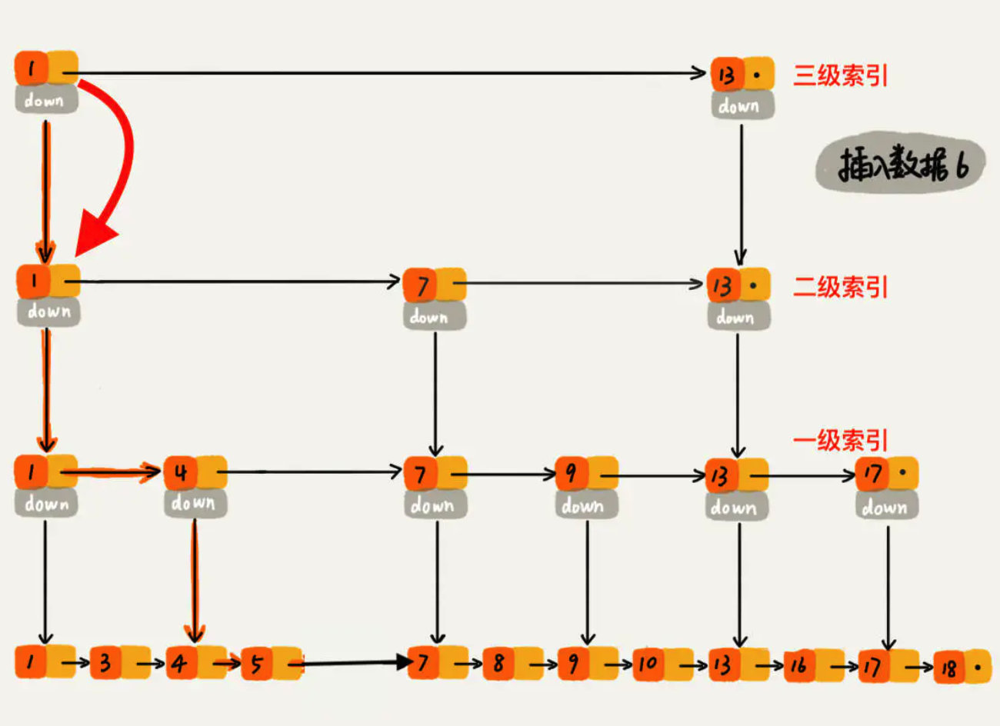
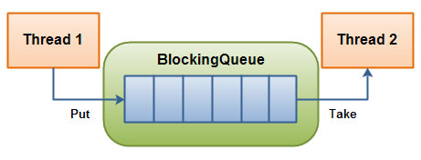
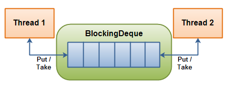

# J.U.C

`J.U.C`是`java.util.concurrent`的简写,里面提供了很多线程安全的集合。

- CopyOnWriteArrayList
- CopyOnWriteArraySet
- ConcurrentSkipListSet
- ConcurrentHashMap
- ConcurrentSkipListMap
- BlockingQueue
- BlockingDeque

<!-- more -->

# CopyOnWriteArrayList

## 介绍

`CopyOnWriteArrayList`相比于`ArrayList`是线程安全的,字面意思是`写操作时复制`。`CopyOnWriteArrayList`使用`写操作时复制`技术,当有新元素需要加入时,先从原数组拷贝一份出来。然后在新数组里面加锁添加,添加之后,将原来数组的引用指向新数组。

```java
public boolean add(E e) {
  final ReentrantLock lock = this.lock;
  lock.lock(); //加锁
  try {
    Object[] elements = getArray();
    int len = elements.length;
    Object[] newElements = Arrays.copyOf(elements, len + 1);
    newElements[len] = e;
    //引用指向更改
    setArray(newElements);
    return true;
  } finally {
    lock.unlock(); //释放锁
  }
}
```

从上面的源码中得到`CopyOnWriteArrayList`的`add`操作是在加锁的保护下完成的。加锁是为了多线程对`CopyOnWriteArrayList`并发`add`时,复制多个副本,把数据搞乱。

```java
public E get(int index) {
  return get(getArray(), index);
}
```

> 以上代码显示`get`是没有加锁的
>
> 如果出现并发`get`,会有以下3种情况。

- 如果写操作未完成，那么直接读取原数组的数据；
- 如果写操作完成，但是引用还未指向新数组，那么也是读取原数组数据；
- 如果写操作完成，并且引用已经指向了新的数组，那么直接从新数组中读取数据。

## 使用场景

- 由于在`add`的时候需要拷贝原数组,如果原数组内容比较多,比较大,可能会导致`young gc`和`full gc`。
- 不能用于实时读的场景,像拷贝数组,新增元素都需要时间,所以调用`get`操作后,有可能得到的数据是旧数据,虽然`CopyOnWriteArrayList`能做到最终一致性,但是没有办法满足实时性要求。
- `CopyOnWriteArrayList`适合读多写少的场景,比如白名单，黑名单等场景
- `CopyOnWriteArrayList`由于`add`时需要复制数组,所以不适用高性能的互联网的应用。


# CopyOnWriteArraySet

## 介绍

```java
public CopyOnWriteArraySet() {
  al = new CopyOnWriteArrayList<E>();
}
```

`CopyOnWriteArraySet`底层是用`CopyOnWriteArraySet`来实现的。可变操作(add,set,remove等)都需要拷贝原数组进行操作,一般开销很大。迭代器支持`hasNext()`,`netx()`等不可变操作,不支持可变的`remove`操作,使用迭代器速度很快,并且不会与其它线程冲突,在构造迭代器时,依赖不变的数组快照。

## 使用场景

- 适用于set大小一般很小，读操作远远多于写操作的场景


# ConcurrentSkipListSet

## 介绍

```java
public ConcurrentSkipListSet() {
  m = new ConcurrentSkipListMap<E,Object>();
}
```

`ConcurrentSkipListSet<E>`是`jdk6`新增的类,支持自然排序,位于`java.util.concurrent`。`ConcurrentSkipListSet<E>`都是基于`Map`集合的,底层由`ConcurrentSkipListMap`实现。

在多线程环境下,`ConcurrentSkipListSet<E>`的`add`,`remove`,`contains`是线程安全的。但是对于批量操作`addAll`,`removeAll`,`containsAll`并不能保证原子操作,所以是线程不安全的,原因是`addAll`,`removeAll`,`containsAll`底层调用的还是`add`,`remove`,`contains`方法,在批量操作时,只能保证每一次的`add`,`remove`,`contains`是原子性的(即在进行`add`,`remove`,`contains`,不会被其它线程打断),而不能保证每一次批量操作都不会被其它线程打断,因此在`addAll`、`removeAll`、`retainAll` 和 `containsAll`操作时，需要添加额外的同步操作。

```java
public boolean addAll(Collection<? extends E> c) {
  boolean modified = false;
  for (E e : c)
    if (add(e))
      modified = true;
  return modified;
}
public boolean removeAll(Collection<?> c) {
  Objects.requireNonNull(c);
  boolean modified = false;
  Iterator<?> it = iterator();
  while (it.hasNext()) {
    if (c.contains(it.next())) {
      it.remove();
      modified = true;
    }
  }
  return modified;
}
public boolean containsAll(Collection<?> c) {
  for (Object e : c)
    if (!contains(e))
      return false;
  return true;
}
```


# ConcurrentHashMap

**`ConcurrentHashMap`中`key`和`value`都不允许为`null`**,`ConcurrentHashMap`针对读操作做了大量的优化。在高并发场景很有优势。

在多线程环境下,使用`HashMap`进行`put`操作会引起死循环,导致`CPU`利用率到`100%`,所以在多线程环境不能随意使用`HashMap`。原因分析:`HashMap`在进行`put`的时候,插入的元素超过了容量就会发生`rehash`扩容,这个操作会把原来的元素`hash`到新的扩容新的数组,在多线程情况下,如果此时有其它线程在进行`put`操作,如果`Hash`值相同,可能出现在同一数组下用链表表示,造成闭环,导致`get`的时候出现死循环,所以是线程不安全的。

`HashTable`它是线程安全的,它涉及到多线程的操作都`synchronized`关键字来锁住整个`table`,这就意味着所有的线程都在竞争同一把锁,在多线程环境下是安全的,但是效率很低。

`HashTable`有很多的优化空间，锁住整个table这么粗暴的方法可以变相的柔和点，比如在多线程的环境下，对不同的数据集进行操作时其实根本就不需要去竞争一个锁，因为他们不同hash值，不会因为rehash造成线程不安全，所以互不影响，这就是锁分离技术，将锁的粒度降低，利用多个锁来控制多个小的table，多线程访问容器里不同数据段的数据时，线程间就不会存在锁竞争，从而可以有效的提高并发访问效率，这就是ConcurrentHashMapJDK1.7版本的核心思想。

不能为null原因:

>The main reason that nulls aren't allowed in ConcurrentMaps (ConcurrentHashMaps, ConcurrentSkipListMaps) is that ambiguities that may be just barely tolerable in non-concurrent maps can't be accommodated. The main one is that if map.get(key) returns null, you can't detect whether the key explicitly maps to null vs the key isn't mapped.
>In a non-concurrent map, you can check this via map.contains(key),but in a concurrent one, the map might have changed between calls.
>
>
>Further [digressing](https://www.zhihu.com/search?q=digressing&search_source=Entity&hybrid_search_source=Entity&hybrid_search_extra={"sourceType"%3A"answer"%2C"sourceId"%3A2474146881}): I personally think that allowing
>nulls in Maps (also Sets) is an open invitation for programs
>to contain errors that remain undetected until
>they break at just the wrong time. (Whether to allow nulls even
>in non-concurrent Maps/Sets is one of the few design issues surrounding
>Collections that Josh Bloch and I have long disagreed about.)
>
>It is very difficult to check for null keys and values
>in my entire application .
>Would it be easier to declare somewhere
>static final Object NULL = new Object();
>and replace all use of nulls in uses of maps with NULL?
>
>
>-Doug


# ConcurrentSkipListMap

`ConcurrentSkipListMap`内部使用`SkipList`结构实现。跳表是一个链表,但是通过跳跃式的查找方式使得`插入`,`读取`数据时的时间复杂度变成`O(log n)`。

跳表(SkipList):使用空间换时间的算法,令链表的每个结点不仅记录next结点位置，还可以按照level层级分别记录后继第level个结点。



## `ConcurrentHashMap`与`ConcurrentSkipListMap`的对比

- `ConcurrentHashMap`比`ConcurrentSkipListMap`性能要好一些。
- `ConcurrentSkipListMap`的`key`是有序的,`ConcurrentHashMap`做不到。
- `ConcurrentSkipListMap`支持高并发,它的时间复杂度是`log(N)`,和线程数无关,也就是说任务一定的情况下,并发的线程越多,`ConcurrentSkipListMap`的优势就越能体现出来。


# BlockingQueue

> 多线程中通过队列很容易共享数据,比如经典的`生产者`和`消费者`模型中,通过队列可以很方便的实现数据共享。假设我们有若干生产者线程,又有若干消费者线程,生产者线程可以通过队列将数据共享给消费者。但是生产者和消费者在某个时间段内,万一发生数据处理速度不匹配的情况呢?如果生产者生产数据的速度远大于消费者消费数据的速度,理想情况下是当生产者产生的数据到达一个阈值之后,那么生产者必须暂停一下(阻塞生产者线程),以便消费者可以把数据消费掉。在`concurrent`包出现之前,开发人员必须手动控制这些细节,导致开发高性能程序难度较大(兼顾效率和安全)。`concurrent`出来之后,带来了`BlockingQueue`(在多线程中,在某些情况下挂起线程(即阻塞),一旦条件满足,被挂起的线程又会被自动唤醒)



> `BlockingQueue`即为阻塞队列,是一个先进先出的队列,在某些情况下,对阻塞队列的访问可能会造成阻塞,被阻塞的情况主要有两种。

- 当对列满时,进行入队操作时。当一个线程试图对一个已经满了的队列进行入队操作时,也将会被阻塞,除非有一个线程进行了出队列操作。
- 当队列空时,进行出队操作时。当一个线程试图对一个为空的队列进行出队列操作时,也将会被阻塞,除非有一个线程进行了出队列操作。

阻塞队列是线程安全的,主要用在生产者消费者的场景上。负责生产的线程不断的制造新对象并插入到阻塞队列中,直到到达队列的上限值,从而被阻塞,直到消费线程对队列进行消费。同理,负责消费的线程不断的从队列中取出对象进行消费,直到这个队列为空,这时消费队列会被阻塞,除非队列中有新的对象被加入进来。

```java
public interface BlockingQueue<E> extends Queue<E> {}
public interface Queue<E> extends Collection<E> {}
```

`BlockingQueue`是一个接口,继承自`Queue`,所以实现类也可以作为`Queue`的实现来使用,而`Queue`又继承自`Collection`接口。

`BlockingQueue`对插入操作,移除操作,获取元素操作提供了四种不同的方法用于不同的场景,使用不同的方法,会有不同的效果。`BlockingQueue`的各个实现都遵循这些规则。

| Throws Exception | Special Value | Blocks   | Times Out      |                           |
| :--------------- | :------------ | :------- | :------------- | ------------------------- |
| insert           | add(o)        | offer(o) | put(o)         | offer(o,timeout,timeunit) |
| remove           | remove(o)     | poll()   | take()         | poll(timeout,timeunit)    |
| examine          | element()     | peek()   | not applicable | not applicable            |

- Throws Exception：抛出异常。如果不能马上进行，则抛出异常。
- Special Value：如果不能马上进行，则返回特殊值，一般是True或False
- Blocks：如果不能马上进行，则操作会被阻塞，直到这个操作成功
- Times Out：如果不能马上进行，操作会被阻塞指定的时间。如果指定时间还未执行，则返回特殊值，一般是True或False。

>对于`BlockingQueue`,关注点应该在它的`put`和`take`方法上,因为这两个方法是带阻塞。

`BlockingQueue`不接受`null`值的插入,相应的方法在碰到`null`的插入时会抛出`NullPointerException`异常,`null`值通常用于特殊值返回(表格中的第三列),代表`poll`失败。所以如果允许插入`null`值的话,那获取的时候,就不能很好的用`null`来判断到底是失败还是获取的值为`null`。

`BlockingQueue`实现了`java.util.Collection`接口,我们可以使用`remove(x)`来删除任意一个元素,但是这类操作并不高效,所以尽量在少数场合使用,比如一条消息已经入队,但是需要取消操作的时候。

`BlockingQueue`的实现都是线程安全的,但是批量的集合操作`addAll`,`containsAll`,`retainAll`,`removeAll`不一定是原子操作,如`addAll(c)`添加了一些元素后抛出异常,此时`BlockingQueue`中已经添加了部分元素,这个是允许的,取决于具体实现。

`BlockingQueue`在生产者-消费者的场景中,是支持多消费者和多消费者的,说的其实就是线程安全问题。`BlockingQueue`是一个比较简单的线程安全容器。作为`BlockingQueue`的使用者,我们再不用考虑何时阻塞线程,什么时候唤醒线程,因为这一些`BlockingQueue`都实现了。

无界队列,并不是大小不限制,只是它的大小是`Integer.MAX_VALUE`,即int类型能表示的最大值(2的31次方)-1

## `BlockingQueue`具体实现类

- ArrayBlockingQueue
- LinkedBlockingQueue
- DelayQueue
- PriorityBlockingQueue
- SynchronousQueue

> 常用的是`ArrayBlockingQueue`和`LinkedBlockingQueue`

## BlockingQueue重要的实现类

### ArrayBlockingQueue

> 有界的阻塞队列,内部是一个数组,有边界的意思是:容量是有限的,必须进行初始化,指定它的容量大小,以先进先出的方式存储数据,最新插入的在对尾,最先移除的对象在头部。

```java
public class ArrayBlockingQueue<E> extends AbstractQueue<E>
  implements BlockingQueue<E>, java.io.Serializable {
  /** 队列元素 */
  final Object[] items;
  /** 下一次读取操作的位置, poll, peek or remove */
  int takeIndex;
  /** 下一次写入操作的位置, offer, or add */
  int putIndex;
  /** 元素数量 */
  int count;
  /*
     * Concurrency control uses the classic two-condition algorithm
     * found in any textbook.
     * 它采用一个 ReentrantLock 和相应的两个 Condition 来实现。
     */
  /** Main lock guarding all access */
  final ReentrantLock lock;
  /** Condition for waiting takes */
  private final Condition notEmpty;
  /** Condition for waiting puts */
  private final Condition notFull;
  /** 指定大小 */
  public ArrayBlockingQueue(int capacity) {
    this(capacity, false);
  }
  /** 
     * 指定容量大小与指定访问策略 
     * @param fair 指定独占锁是公平锁还是非公平锁。非公平锁的吞吐量比较高，公平锁可以保证每次都是等待最久的线程获取到锁；
     */
  public ArrayBlockingQueue(int capacity, boolean fair) {}
  /** 
     * 指定容量大小、指定访问策略与最初包含给定集合中的元素 
     * @param c 将此集合中的元素在构造方法期间就先添加到队列中 
     */
  public ArrayBlockingQueue(int capacity, boolean fair,
                            Collection<? extends E> c) {}
}
```

- `ArrayBlockingQueue`在生产者放入数据和消费者获取数据,都是共用一个锁对象,由此也意味着两者无法真正并行运行。按照实现原理来分析,`ArrayBlockingQueue`完全可以采用分离锁,从而实现生产者和消费者操作的完全并行运行。然而事实上并没有如此,因为`ArrayBlockingQueue`的数据写入已经足够轻巧,以至于引入独立的锁机制,除了给代码带来额外的复杂性外,其在性能上完全占不到任何便宜。
- 通过构造函数得知,参数`fair`控制对象内部是否采用公平锁,默认采用非公平锁。
- `items、takeIndex、putIndex、count`等属性并没有使用`volatile`修饰,这是因为访问这些变量(通过方法获取)使用都在锁内,并不存在可见性问题,如`size()`。
- 另外有个独占锁`lock`用来对出入对操作加锁,这导致同时只有一个线程可以访问入队出队。

#### `Put`源码分析

```java
/** 进行入队操作 */
public void put(E e) throws InterruptedException {
  //e为null，则抛出NullPointerException异常
  checkNotNull(e);
  //获取独占锁
  final ReentrantLock lock = this.lock;
  /**
         * lockInterruptibly()
         * 获取锁定，除非当前线程为interrupted
         * 如果锁没有被另一个线程占用并且立即返回，则将锁定计数设置为1。
         * 如果当前线程已经保存此锁，则保持计数将递增1，该方法立即返回。
         * 如果锁被另一个线程保持，则当前线程将被禁用以进行线程调度，并且处于休眠状态
         * 
         */
  lock.lockInterruptibly();
  try {
    //空队列
    while (count == items.length)
      //进行条件等待处理
      notFull.await();
    //入队操作
    enqueue(e);
  } finally {
    //释放锁
    lock.unlock();
  }
}
/** 真正的入队 */
private void enqueue(E x) {
  // assert lock.getHoldCount() == 1;
  // assert items[putIndex] == null;
  //获取当前元素
  final Object[] items = this.items;
  //按下一个插入索引进行元素添加
  items[putIndex] = x;
  // 计算下一个元素应该存放的下标，可以理解为循环队列
  if (++putIndex == items.length)
    putIndex = 0;
  count++;
  //唤起消费者
  notEmpty.signal();
}
```

>这里由于在操作共享变量前加了锁,所以不存在内存不可见问题,加锁后获取的共享变量都是从主内存中获取的,而不是在CPU缓存或者寄存器里面的值,释放锁后修改的共享变量值会刷新到主内存。
>
>另外这个队列使用循环数组实现,所以在计算下一个元素存放下标时候有些特殊。另外`insert`后调用`notEmpty.signal()`;是为了激活调用`notEmpty.await();`阻塞后放入`notEmpty`条件队列的线程。

#### `Take`源码分析

```java
public E take() throws InterruptedException {
  final ReentrantLock lock = this.lock;
  lock.lockInterruptibly();
  try {
    while (count == 0)
      notEmpty.await();
    return dequeue();
  } finally {
    lock.unlock();
  }
}
private E dequeue() {
  // assert lock.getHoldCount() == 1;
  // assert items[takeIndex] != null;
  final Object[] items = this.items;
  @SuppressWarnings("unchecked")
  E x = (E) items[takeIndex];
  items[takeIndex] = null;
  if (++takeIndex == items.length)
    takeIndex = 0;
  count--;
  //这里有些特殊
  if (itrs != null)
    //保持队列中的元素和迭代器的元素一致
    itrs.elementDequeued();
  notFull.signal();
  return x;
}
```

> `Take`操作和`Put`操作很类似

```java
//该类的迭代器，所有的迭代器共享数据，队列改变会影响所有的迭代器
transient Itrs itrs = null; //其存放了目前所创建的所有迭代器。
/**
* 迭代器和它们的队列之间的共享数据，允许队列元素被删除时更新迭代器的修改。
*/
class Itrs {
  void elementDequeued() {
    // assert lock.getHoldCount() == 1;
    if (count == 0)
      //队列中数量为0的时候，队列就是空的，会将所有迭代器进行清理并移除
      queueIsEmpty();
    //takeIndex的下标是0，意味着队列从尾中取完了，又回到头部获取
    else if (takeIndex == 0)
      takeIndexWrapped();
  }
  /**
         * 当队列为空的时候做的事情
         * 1. 通知所有迭代器队列已经为空
         * 2. 清空所有的弱引用，并且将迭代器置空
         */
  void queueIsEmpty() {}
  /**
         * 将takeIndex包装成0
         * 并且通知所有的迭代器，并且删除已经过期的任何对象（个人理解是置空对象）
         * 也直接的说就是在Blocking队列进行出队的时候，进行迭代器中的数据同步，保持队列中的元素和迭代器的元素是一致的。
         */
  void takeIndexWrapped() {}
}
```

#### Itrs迭代器创建的时机

```java
//从这里知道，在ArrayBlockingQueue对象中调用此方法，才会生成这个对象
//那么就可以理解为，只要并未调用此方法，则ArrayBlockingQueue对象中的Itrs对象则为空
public Iterator<E> iterator() {
  return new Itr();
}
private class Itr implements Iterator<E> {
  Itr() {
    //这里就是生产它的地方
    //count等于0的时候，创建的这个迭代器是个无用的迭代器，可以直接移除，进入detach模式。
    //否则就把当前队列的读取位置给迭代器当做下一个元素，cursor存储下个元素的位置。
    if (count == 0) {
      // assert itrs == null;
      cursor = NONE;
      nextIndex = NONE;
      prevTakeIndex = DETACHED;
    } else {
      final int takeIndex = ArrayBlockingQueue.this.takeIndex;
      prevTakeIndex = takeIndex;
      nextItem = itemAt(nextIndex = takeIndex);
      cursor = incCursor(takeIndex);
      if (itrs == null) {
        itrs = new Itrs(this);
      } else {
        itrs.register(this); // in this order
        itrs.doSomeSweeping(false);
      }
      prevCycles = itrs.cycles;
      // assert takeIndex >= 0;
      // assert prevTakeIndex == takeIndex;
      // assert nextIndex >= 0;
      // assert nextItem != null;
    }
  }
}
```

### `LinkedBlockingQueue`

>基于链表的阻塞队列,通`ArrayBlockingQueue`类似,其内部也维护这一个数据缓冲队列(该队列由一个链表构成),当生产者往队列放入一个数据时,队列会从生产者手上获取数据,并缓存在队列的内部,而生产者立即返回,只有当队列缓冲区到达最大值容量时(LinkedBlockingQueue可以通过构造函数指定该值),才会阻塞队列,直到消费者从队列中消费掉一份数据,生产者会被唤醒,反之对于消费者这端的处理也基于同样的原理。
>
>`LinkedBlockingQueue`之所以能够高效的处理并发数据,还因为其对于生产者和消费者端分别采用了独立的锁来控制数据同步,这也意味着在高并发的情况下生产者和消费者可以并行的操作队列中的数据,以调高整个队列的并发能力。
>
>如果构造一个`LinkedBlockingQueue`对象,而没有指定容量大小,`LinkedBlockingQueue`会默认一个类似无限大小的容量`Integer.MAX_VALUE`,这样的话,如果生产者的速度一旦大于消费者的速度,也许还没有等到队列满阻塞产生,系统内存就有可能已经被消耗殆尽了。
>
>`LinkedBlockingQueue`是一个使用链表完成队列操作的阻塞队列。链表是单向链表,而不是双向链表。

```java
public class LinkedBlockingQueue<E> extends AbstractQueue<E>
  implements BlockingQueue<E>, java.io.Serializable {
  //队列的容量，指定大小或为默认值Integer.MAX_VALUE
  private final int capacity;
  //元素的数量
  private final AtomicInteger count = new AtomicInteger();
  //队列头节点，始终满足head.item==null
  transient Node<E> head;
  //队列的尾节点，始终满足last.next==null
  private transient Node<E> last;
  /** Lock held by take, poll, etc */
  //出队的锁：take, poll, peek 等读操作的方法需要获取到这个锁
  private final ReentrantLock takeLock = new ReentrantLock();
  /** Wait queue for waiting takes */
  //当队列为空时，保存执行出队的线程：如果读操作的时候队列是空的，那么等待 notEmpty 条件
  private final Condition notEmpty = takeLock.newCondition();
  /** Lock held by put, offer, etc */
  //入队的锁：put, offer 等写操作的方法需要获取到这个锁
  private final ReentrantLock putLock = new ReentrantLock();
  /** Wait queue for waiting puts */
  //当队列满时，保存执行入队的线程：如果写操作的时候队列是满的，那么等待 notFull 条件
  private final Condition notFull = putLock.newCondition();
  //传说中的无界队列
  public LinkedBlockingQueue() {}
  //传说中的有界队列
  public LinkedBlockingQueue(int capacity) {
    if (capacity <= 0) throw new IllegalArgumentException();
    this.capacity = capacity;
    last = head = new Node<E>(null);
  }
  //传说中的无界队列
  public LinkedBlockingQueue(Collection<? extends E> c){}
  /**
     * 链表节点类
     */
  static class Node<E> {
    E item;
    /**
         * One of:
         * - 真正的继任者节点
         * - 这个节点，意味着继任者是head.next
         * - 空，意味着没有后继者（这是最后一个节点）
         */
    Node<E> next;
    Node(E x) { item = x; }
  }
}
```

> 通过其构造函数,得知其可以当做无界队列也可以当做有界队列来使用。
>
> 这里用了两把锁分别是`takeLock`和`putLock`,而`Condition`分别是`notEmpty`和`notFull`,它们是这样搭配的。

- 如果需要获取(take)一个元素,需要获取`takeLock`锁,但是获取了锁还不够,如果队列此时为空,还需要队列不为空(notEmpty)这个条件(Condition)。
- 如果要插入(put)一个元素,需要获取`putLock`锁,但是获取了锁还不够,如果队列此时已满,还是需要队列不满(notFull)的这个条件(Condition)。

> 从上面的构造函数中可以看到,这里会初始化一个空的头结点,那么第一个元素入队的时候,队列中就会有两个元素。读取元素时,也是获取头结点后面的一个元素。count的计数值不包含这个头结点。

#### Put源码分析

```java
public class LinkedBlockingQueue<E> extends AbstractQueue<E>
  implements BlockingQueue<E>, java.io.Serializable {    
  /**
     * 将指定元素插入到此队列的尾部，如有必要，则等待空间变得可用。
     */
  public void put(E e) throws InterruptedException {
    if (e == null) throw new NullPointerException();
    // 如果你纠结这里为什么是 -1，可以看看 offer 方法。这就是个标识成功、失败的标志而已。
    int c = -1;
    //包装成node节点
    Node<E> node = new Node<E>(e);
    final ReentrantLock putLock = this.putLock;
    final AtomicInteger count = this.count;
    //获取锁定
    putLock.lockInterruptibly();
    try {
      /** 如果队列满，等待 notFull 的条件满足。 */
      while (count.get() == capacity) {
        notFull.await();
      }
      //入队
      enqueue(node);
      //原子性自增
      c = count.getAndIncrement();
      // 如果这个元素入队后，还有至少一个槽可以使用，调用 notFull.signal() 唤醒等待线程。
      // 哪些线程会等待在 notFull 这个 Condition 上呢？
      if (c + 1 < capacity)
        notFull.signal();
    } finally {
      //解锁
      putLock.unlock();
    }
    // 如果 c == 0，那么代表队列在这个元素入队前是空的（不包括head空节点），
    // 那么所有的读线程都在等待 notEmpty 这个条件，等待唤醒，这里做一次唤醒操作
    if (c == 0)
      signalNotEmpty();
  }
  /** 链接节点在队列末尾 */
  private void enqueue(Node<E> node) {
    // assert putLock.isHeldByCurrentThread();
    // assert last.next == null;
    // 入队的代码非常简单，就是将 last 属性指向这个新元素，并且让原队尾的 next 指向这个元素
    //last.next = node;
    //last = node;
    // 这里入队没有并发问题，因为只有获取到 putLock 独占锁以后，才可以进行此操作
    last = last.next = node;
  }
  /**
     * 等待PUT信号
     * 仅在 take/poll 中调用
     * 也就是说：元素入队后，如果需要，则会调用这个方法唤醒读线程来读
     */
  private void signalNotFull() {
    final ReentrantLock putLock = this.putLock;
    putLock.lock();
    try {
      notFull.signal();//唤醒
    } finally {
      putLock.unlock();
    }
  }
}
```

#### Take源码分析

```java
public class LinkedBlockingQueue<E> extends AbstractQueue<E>
  implements BlockingQueue<E>, java.io.Serializable {   
  public E take() throws InterruptedException {
    E x;
    int c = -1;
    final AtomicInteger count = this.count;
    final ReentrantLock takeLock = this.takeLock;
    //首先，需要获取到 takeLock 才能进行出队操作
    takeLock.lockInterruptibly();
    try {
      // 如果队列为空，等待 notEmpty 这个条件满足再继续执行
      while (count.get() == 0) {
        notEmpty.await();
      }
      //// 出队
      x = dequeue();
      //count 进行原子减 1
      c = count.getAndDecrement();
      // 如果这次出队后，队列中至少还有一个元素，那么调用 notEmpty.signal() 唤醒其他的读线程
      if (c > 1)
        notEmpty.signal();
    } finally {
      takeLock.unlock();
    }
    if (c == capacity)
      signalNotFull();
    return x;
  }
  /**
     * 出队
     */
  private E dequeue() {
    // assert takeLock.isHeldByCurrentThread();
    // assert head.item == null;
    Node<E> h = head;
    Node<E> first = h.next;
    h.next = h; // help GC
    head = first;
    E x = first.item;
    first.item = null;
    return x;
  }
  /**
     * Signals a waiting put. Called only from take/poll.
     */
  private void signalNotFull() {
    final ReentrantLock putLock = this.putLock;
    putLock.lock();
    try {
      notFull.signal();
    } finally {
      putLock.unlock();
    }
  }
}
```

#### 与`ArrayBlockingQueue`对比

> ArrayBlockingQueue是共享锁，粒度大，入队与出队的时候只能有1个被执行，不允许并行执行。LinkedBlockingQueue是独占锁，入队与出队是可以并行进行的。当然这里说的是读和写进行并行，两者的读读与写写是不能并行的。总结就是LinkedBlockingQueue可以并发读写。
>
> ArrayBlockingQueue和LinkedBlockingQueue间还有一个明显的不同之处在于，前者在插入或删除元素时不会产生或销毁任何额外的对象实例，而后者则会生成一个额外的Node对象。这在长时间内需要高效并发地处理大批量数据的系统中，其对于GC的影响还是存在一定的区别。

### DelayQueue

> DelayQueue是一个无界阻塞队列，只有在延迟期满时才能从中提取元素。该队列的头部是延迟期满后保存时间最长的Delayed元素。
> 存放到DelayDeque的元素必须继承Delayed接口。Delayed接口使对象成为延迟对象，它使存放在DelayQueue类中的对象具有了激活日期，该接口强制执行下列两个方法：

- CompareTo(Delayed o)：Delayed接口继承了Comparable接口，因此有了这个方法
- getDelay(TimeUnit unit):这个方法返回到激活日期的剩余时间，时间单位由单位参数指定

### DelayQueue使用场景

- 关闭空闲链接。服务器中,有很多客户端链接,空闲一段时间

### SynchronousQueue

> 它是一个特殊的队列交做同步队列,特点是当一个线程往队列里写一个元素,写入操作不会理解返回,需要等待另外一个线程来将这个元素拿走。同理,当一个读线程做读操作的时候,同样需要一个相匹配写线程的写操作。这里的`Synchronous`指的就是读写线程需要同步,一个读线程匹配一个写线程,同理一个写线程匹配一个读线程。
>
> 不像`ArrayBlockingQueue`、`LinkedBlockingDeque`之类的阻塞队列依赖AQS实现并发操作，`SynchronousQueue`直接使用CAS实现线程的安全访问。
>
> 较少使用到 SynchronousQueue 这个类，不过它在线程池的实现类 ScheduledThreadPoolExecutor 中得到了应用。

```java
public class SynchronousQueue<E> extends AbstractQueue<E>
  implements BlockingQueue<E>, java.io.Serializable {
  //内部栈
  static final class TransferStack<E> extends Transferer<E> {}
  //内部队列
  static final class TransferQueue<E> extends Transferer<E> {}
  public SynchronousQueue() {this(false);}
  public SynchronousQueue(boolean fair) {
    transferer = fair ? 
      new TransferQueue<E>() : new TransferStack<E>();
  }
}
```

# BlockingDeque

`BlockingDeque`接口和`BlockingQueue`接口一样都是在`java.util.concurrent`中定义的，它代表了一个线程安全的“双端队列”，以线程安全的方式向队列中添加元素或获取元素。

> `deque`是 "Double Ended Queue "的缩写。因此“双端队列”的含义就是可以从两端(队首或队尾)插入和取出元素的队列。

如果某个线程既生产又消费同一个队列的元素，那么就可以使用`BlockingDeque`双端队列。如果生产线程需要在队列的两端插入，而消费线程需要从队列的两端删除，也可以只使用`BlockingDeque`双端队列



一个线程生产元素并将它们插入到队列两端中的任何一端。如果`BlockingDeque`当前是满的，插入线程将被阻塞，直到移除线程从`BlockingDeque`中取出一个元素。如果`BlockingDeque`当前为空，那么移除线程将被阻塞，直到插入线程将一个元素插入到`BlockingDeque`中。

```java
public interface BlockingDeque<E> extends BlockingQueue<E>, Deque<E>
```

## BlockingDeque 方法

`BlockingDeque`有4组不同的方法，用于插入、删除和检查deque中的元素。每组方法在所要求的操作不能被立即执行的情况下表现也有所不同。参考下面的表格

| 队首操作     | 抛出异常       | 返回特定值    | 阻塞后一直等待 | 阻塞后等待超时                   |
| ------------ | -------------- | ------------- | -------------- | -------------------------------- |
| 插入对象     | addFirst(o)    | offerFirst(o) | putFirst(o)    | offerFirst(o, timeout, timeunit) |
| 移除对象     | removeFirst(o) | pollFirst()   | takeFirst()    | pollFirst(timeout, timeunit)     |
| 检查对象存在 | getFirst()     | peekFirst()   |                |                                  |

| 队尾操作     | 抛出异常      | 返回特定值   | 阻塞后一直等待 | 阻塞后等待超时                  |
| ------------ | ------------- | ------------ | -------------- | ------------------------------- |
| 插入对象     | addLast(o)    | offerLast(o) | putLast(o)     | offerLast(o, timeout, timeunit) |
| 移除对象     | removeLast(o) | pollLast()   | takeLast()     | pollLast(timeout, timeunit)     |
| 检查对象存在 | getLast()     | peekLast()   |                |                                 |

这些方法和和`BlockingQueue`的方法有些相似，只是在方法的基础上加了xxxFirst和xxxLast，所以可以参考我之前的文章对比学习)，上面的方法的四种行为分别的含义是

1. **抛出异常**: 如果调用方法后不能立即响应结果（空队列或满队列），则抛出异常。
2. **返回特定值**: 如果调用方法后不能立即响应结果（空队列或满队列），则返回特定的值（通常是true/false），true表示方法执行成功，否则表示方法执行失败。
3. **阻塞后一直等待**: 如果调用方法后不能立即响应结果（空队列或满队列），该方法将被阻塞一直处于等待状态。
4. **阻塞后等待超时**: 如果调用方法后不能立即响应结果（空队列或满队列），该方法将在一定时间范围内被阻塞等待，也就是在超时时间范围内阻塞。当超出超时时间之后，方法线程将不再阻塞，而是返回一个特定的值（通常是true/false），true表示方法执行成功，否则表示方法执行失败。

## BlockingDeque继承BlockingQueue

BlockingDeque接口继承了BlockingQueue接口。这意味着你可以将BlockingDeque作为一个**FIFO** 的单向队BlockingQueue使用。如果你这样做，各种插入方法将把元素添加到deque的末尾，而移除方法将从deque的队首移除元素。BlockingQueue接口的插入和删除方法，就是这样做的。

下面是BlockingQueue的方法在BlockingDeque实现中的作用对照表

| 对比                 | BlockingQueue            | BlockingDeque |
| -------------------- | ------------------------ | ------------- |
| 插入                 | add(e)                   | addLast(e)    |
| offer(e)             | offerLast(e)             |               |
| put(e)               | putLast(e)               |               |
| offer(e, time, unit) | offerLast(e, time, unit) |               |
| 取出                 | remove()                 | removeFirst() |
| poll()               | pollFirst()              |               |
| take()               | takeFirst()              |               |
| poll(time, unit)     | pollFirst(time, unit)    |               |
| 检索                 | element()                | getFirst()    |
| peek()               | peekFirst()              |               |

## BlockingDeque 接口实现类

`BlockingDeque`是一个接口,所以当我们真正对它进行实例化的时候，需要使用它的接口实现类。在`java.util.concurrent`包中的`LinkedBlockingDeque`方法实现了`BlockingDeque`接口。

```java
//初始化一个LinkedBlockingDeque
BlockingDeque<String> deque = new LinkedBlockingDeque<String>();

deque.addFirst("1");//向队首添加元素
deque.addLast("2"); //向队尾添加元素

String two = deque.takeLast(); //从队尾获取元素
String one = deque.takeFirst(); //从队首获取元素
```


### LinkedBlockingDeque

基于 **链表** 实现的 **BlockingDeque**

Node

```java
static final class Node<E> {

  // 元素
  E item;

  // 前置
  Node<E> prev;

  // 后置
  Node<E> next;

  Node(E x) {
    item = x;
  }
}
```

链表的节点以内部类 **Node** 维护，属性包括 **元素**、**前置节点** 和 **后置节点**

#### 属性、构造方法

```java
// 头节点
transient Node<E> first;

// 尾节点
transient Node<E> last;

// 元素个数
private transient int count;

// 容量
private final int capacity;

// 锁对象
final ReentrantLock lock = new ReentrantLock();

// take 操作的阻塞队列
private final Condition notEmpty = lock.newCondition();

// put 操作的阻塞队列
private final Condition notFull = lock.newCondition();

----------------- 构造方法 ----------------------

  // 默认容量 Integer.MAX_VALUE
  public LinkedBlockingDeque() {
  this(Integer.MAX_VALUE);
}

// 自定义容量
public LinkedBlockingDeque(int capacity) {
  if (capacity <= 0) throw new IllegalArgumentException();
  this.capacity = capacity;
}

// 以指定集合初始化
public LinkedBlockingDeque(Collection<? extends E> c) {
  this(Integer.MAX_VALUE);
  addAll(c);
}
```

不同于 **ArrayBlockingQueue** 的是，可以不指定 **容量**，默认为 `Integer.MAX_VALUE`

#### 头插入操作

```java
public void addFirst(E e) {
  // 插入失败抛出异常
  if (!offerFirst(e))
    throw new IllegalStateException("Deque full");
}

public boolean offerFirst(E e) {
  if (e == null) throw new NullPointerException();
  Node<E> node = new Node<E>(e);
  final ReentrantLock lock = this.lock;
  lock.lock();
  try {
    return linkFirst(node);
  } finally {
    lock.unlock();
  }
}

public void putFirst(E e) throws InterruptedException {
  if (e == null) throw new NullPointerException();
  Node<E> node = new Node<E>(e);
  final ReentrantLock lock = this.lock;
  lock.lock();
  try {
    // 如果插入失败（队列满了）则阻塞直到插入成功
    while (!linkFirst(node))
      notFull.await();
  } finally {
    lock.unlock();
  }
}

public boolean offerFirst(E e, long timeout, TimeUnit unit)
  throws InterruptedException {
  if (e == null) throw new NullPointerException();
  Node<E> node = new Node<E>(e);
  long nanos = unit.toNanos(timeout);
  final ReentrantLock lock = this.lock;
  lock.lockInterruptibly();
  try {
    // 如果插入失败（队列满了）则阻塞指定时间（nanos）
    while (!linkFirst(node)) {
      if (nanos <= 0L)
        return false;
      nanos = notFull.awaitNanos(nanos);
    }
    return true;
  } finally {
    lock.unlock();
  }
}

private boolean linkFirst(Node<E> node) {
  /**
         * 必须持有锁
         * 容量已满插入失败，返回 false
         *
         * f 指向 first
         * node 的 next 指向 first
         * first 指向 node
         * 如果 last == null，即首次插入
         * 则 last 也指向 node
         * 否则 f 的 prev 指向 node
         *
         * 元素个数累加
         * notEmpty 唤醒一个 take 线程
         */
  if (count >= capacity)
    return false;
  Node<E> f = first;
  node.next = f;
  first = node;
  if (last == null)
    last = node;
  else
    f.prev = node;
  ++count;
  notEmpty.signal();
  return true;
}
```

最终由 `linkFirst` 实现节点插入，具体的细节可见注释

#### 尾插入操作

跟 **头插入操作** 同理，略

#### 头获取操作

```java
public E removeFirst() {
  E x = pollFirst();
  // 获取失败（队列为空），则抛出异常
  if (x == null) throw new NoSuchElementException();
  return x;
}

public E pollFirst() {
  final ReentrantLock lock = this.lock;
  lock.lock();
  try {
    return unlinkFirst();
  } finally {
    lock.unlock();
  }
}

public E takeFirst() throws InterruptedException {
  final ReentrantLock lock = this.lock;
  lock.lock();
  try {
    E x;
    // 若队列为空，则阻塞直到取到元素
    while ( (x = unlinkFirst()) == null)
      notEmpty.await();
    return x;
  } finally {
    lock.unlock();
  }
}

public E pollFirst(long timeout, TimeUnit unit)
  throws InterruptedException {
  long nanos = unit.toNanos(timeout);
  final ReentrantLock lock = this.lock;
  lock.lockInterruptibly();
  try {
    E x;
    // 若队列为空，则阻塞指定时间（nanos）
    while ( (x = unlinkFirst()) == null) {
      if (nanos <= 0L)
        return null;
      nanos = notEmpty.awaitNanos(nanos);
    }
    return x;
  } finally {
    lock.unlock();
  }
}

private E unlinkFirst() {
  /**
         * 必须持有锁
         *
         * f 指向 node
         * f == null，即队列为空，返回 null
         * n 指向 f 的 next
         * item 指向 f 的 item
         * f 的 item 置为 null
         * f 的 next 指向 f，此时 f 可以被 GC 回收了
         *
         * first 指向 n
         * 如果 n == null，则队列为空了，last 也指向 null
         * 否则 n 的 prev 指向 null
         * 元素个数递减
         * 唤醒一个 put 操作线程
         */
  Node<E> f = first;
  if (f == null)
    return null;
  Node<E> n = f.next;
  E item = f.item;
  f.item = null;
  f.next = f; // help GC
  first = n;
  if (n == null)
    last = null;
  else
    n.prev = null;
  --count;
  notFull.signal();
  return item;
}

```

最终由 `unlinkFirst` 实现节点获取，具体的细节可见注释

#### 尾获取操作

跟 **头获取操作** 同理，略

#### 检索操作

```java
public E getFirst() {
  E x = peekFirst();

  // 没有元素则抛出异常
  if (x == null) throw new NoSuchElementException();
  return x;
}

public E peekFirst() {
  final ReentrantLock lock = this.lock;
  lock.lock();
  try {
    // 返回 first 的 item
    return (first == null) ? null : first.item;
  } finally {
    lock.unlock();
  }
}
```

头检索 即返回 first.item，同理 尾检索 返回 last.item

#### BlockingQueue 方法委托

上文提到 **BlockingDequ**e 也是一个 **BlockingQueue**，也给出了方法的对应关系，那么实现就是简单的方法委托

```java
public boolean add(E e) {
  addLast(e);
  return true;
}

public boolean offer(E e) {
  return offerLast(e);
}

public void put(E e) throws InterruptedException {
  putLast(e);
}

public boolean offer(E e, long timeout, TimeUnit unit)
  throws InterruptedException {
  return offerLast(e, timeout, unit);
}

public E remove() {
  return removeFirst();
}

public E poll() {
  return pollFirst();
}

public E take() throws InterruptedException {
  return takeFirst();
}

public E poll(long timeout, TimeUnit unit) throws InterruptedException {
  return pollFirst(timeout, unit);
}

public E element() {
  return getFirst();
}

public E peek() {
  return peekFirst();
}
```

#### Stack 方法委托

同理，**BlockingDeque** 也可以是个 **Stack（栈）**

```java
public void push(E e) {
  addFirst(e);
}

public E pop() {
  return removeFirst();
}
```

#### 其他方法

**LinkedBlockingDeque** 还实现了诸如 `remove(Object o)` `size()` `contains(Object o)` `addAll(Collection<? extends E> c)` 等很多方法，不再一一解读了

#### 总结

本文介绍了 **BlockingDeque** 接口和基于链表实现的 **LinkedBlockingDeque** ，同时支持 **队列**、**双端队列** 的 **可阻塞** 操作，十分强大


###### 来源:

https://rumenz.com/rumenbiji/java-concurrent-container.html

https://rumenz.com/rumenbiji/java-blockingqueue.html

https://rumenz.com/rumenbiji/java-blockingqueue.html

https://rumenz.com/rumenbiji/java-blockingqueue-implementation-class.html

https://rumenz.com/rumenbiji/java-blockingqueue-implementation-class2.html

https://www.cnblogs.com/zimug/p/14867749.html

https://blog.csdn.net/weixin_42189048/article/details/108529875
