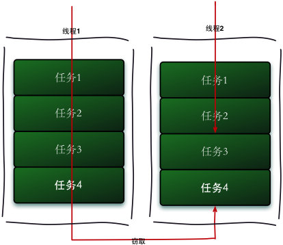
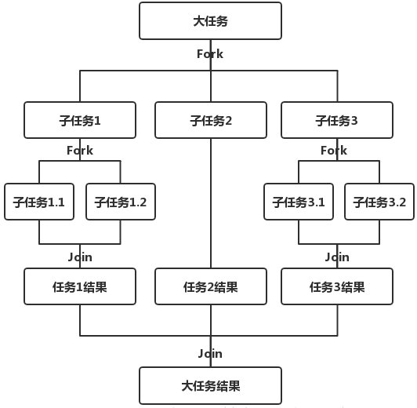
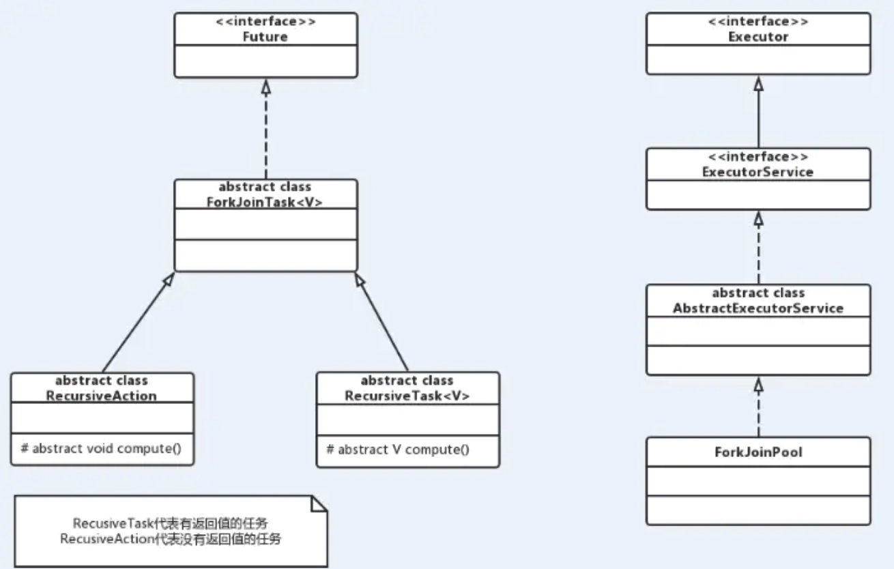
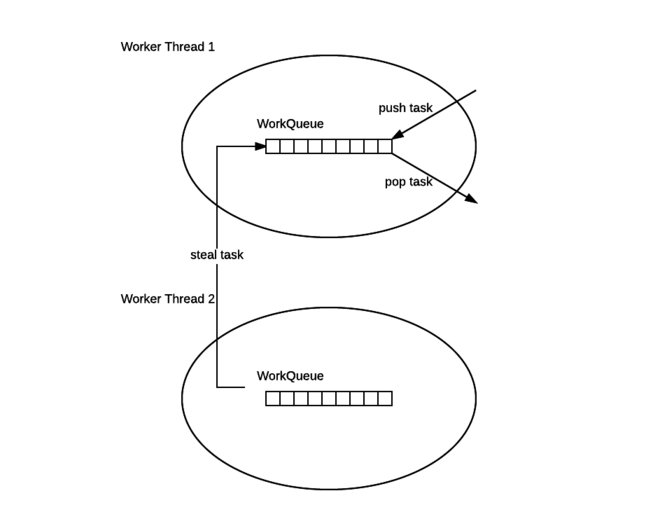
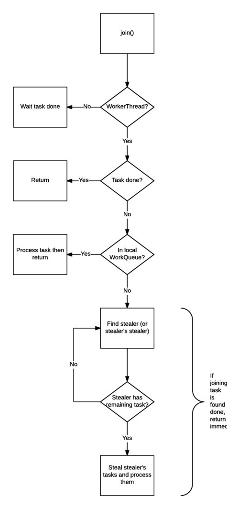

- Fork,join

- ForkJoinTask和ForkJoinPool

<!-- more -->

# Fork/join

## 介绍

> `Fork/join`框架是`java7`提供的并行执行任务的框架,是把大任务分割成若干小任务,最后汇总若干小任务的执行结果得到最终的结果。它的思想与`MapReduce`类似。`Fork`把一个大任务分割成若干小任务,`Join`用于合并小任务的结果,最后得到大框架的结果。主要采取工作窃取算法。
>
> 工作窃取(work-stealing)算法是指某个线程从其它队列窃取任务执行。



<!-- more -->

> 假如我们需要做一个比较大的任务，我们可以把这个任务分割为若干互不依赖的子任务，为了减少线程间的竞争，于是把这些子任务分别放到不同的队列里，并为每个队列创建一个单独的线程来执行队列里的任务，线程和队列一一对应，比如A线程负责处理A队列里的任务。但是有的线程会先把自己队列里的任务干完，而其他线程对应的队列里还有任务等待处理。干完活的线程与其等着，不如去帮其他线程干活，于是它就去其他线程的队列里窃取一个任务来执行。而在这时它们会访问同一个队列，所以为了减少窃取任务线程和被窃取任务线程之间的竞争，通常会使用双端队列，被窃取任务线程永远从双端队列的头部拿任务执行，而窃取任务的线程永远从双端队列的尾部拿任务执行。
>
> 工作窃取算法的优点是充分利用线程进行并行计算，并减少了线程间的竞争，其缺点是在某些情况下还是存在竞争，比如双端队列里只有一个任务时。并且消耗了更多的系统资源，比如创建多个线程和多个双端队列。
>
> 对于Fork/Join框架而言，当一个任务正在等待它使用Join操作创建的子任务结束时，执行这个任务的工作线程，寻找其他并未被执行的任务，并开始执行，通过这种方式，线程充分利用它们的运行时间，来提高应用程序的性能。为了实现这个目标，Fork/Join框架执行的任务有一些局限性：

- 任务只能使用Fork、Join操作来作为同步机制，如果使用了其他同步机制，那他们在同步操作时，工作线程则不能执行其他任务。如：在框架的操作中，使任务进入睡眠，那么在这个睡眠期间内，正在执行这个任务的工作线程，将不会执行其他任务
- 所执行的任务，不应该执行IO操作，如读和写数据文件
- 任务不能抛出检查型异常，必须通过必要的代码处理它们

> 核心是两个类：`ForkJoinTask`与`ForkJoinPool`。Pool主要负责实现，包括上面所介绍的工作窃取算法，管理工作线程和提供关于任务的状态以及它们的执行信息；Task主要提供在任务中，执行Fork与Join操作的机制。



## `Fork/join`代码演示

```java
package com.rumenz.task;
import java.util.concurrent.ExecutionException;
import java.util.concurrent.ForkJoinPool;
import java.util.concurrent.ForkJoinTask;
import java.util.concurrent.RecursiveTask;
public class ForkJoinExample extends RecursiveTask<Integer> {
  public final static int threshold=2;
  private int start;
  private int end;
  public ForkJoinExample(int start, int end) {
    this.start = start;
    this.end = end;
  }
  @Override
  protected Integer compute() {
    int sum=0;
    boolean b = (end - start) <= threshold;
    if(b){
      //任务足够小的时候，直接计算，不进行分裂计算
      for (int i = start; i <=end ; i++) {
        sum+=i;
      }
    }else{
      int mid=(start+end)/2;
      //继续分裂任务
      ForkJoinExample task1=new ForkJoinExample(start,mid);
      ForkJoinExample task2=new ForkJoinExample(mid+1,end);
      // 执行子任务
      task1.fork();
      task2.fork();
      // 等待任务执行结束合并其结果
      Integer m = task1.join();
      Integer n = task2.join();
      sum=m+n;
    }
    return sum;
  }
  public static void main(String[] args) throws ExecutionException, InterruptedException {
    //生成一个池
    ForkJoinPool forkJoinPool=new ForkJoinPool();
    ForkJoinTask task=new ForkJoinExample(1, 100000);
    ForkJoinTask<Integer> submit = forkJoinPool.submit(task);
    Integer sum = submit.get();
    System.out.println("最后的结果是:"+sum);
  }
}
```

> 通过这个例子让我们再来进一步了解ForkJoinTask，任务类继承RecursiveTask，ForkJoinTask与一般的任务的主要区别在于它需要实现compute()方法，在这个方法里，首先需要判断任务是否足够小，如果足够小就直接执行任务。如果不足够小，就必须分割成两个子任务，每个子任务在调用fork()方法时，又会进入compute()方法，看看当前子任务是否需要继续分割成孙任务，如果不需要继续分割，则执行当前子任务并返回结果。使用join()方法会等待子任务执行完并得到其结果。

# ForkJoinTask和ForkJoinPool

> `Fork/Join`框架中两个核心类`ForkJoinTask`与`ForkJoinPool`,声明`ForkJoinTask`后,将其加入`ForkJoinPool`中,并返回一个`Future`对象。

- `ForkJoinPool`:`ForkJoinTask`需要通过`ForkJoinPool`来执行,任务分割的子任务会添加到当前工作维护的双端队列中,进入队列的头部。当一个工作线程的队列里暂时没有任务时,它会随机从其它工作线程的队列尾部获取一个任务。
- `ForkJoinTask`:我们需要使用`ForkJoin`框架,首先要创建一个`ForkJoin`任务。它提供在任务中执行`Fork()`和`Join()`操作的机制,通常情况下不需要直接继承`ForkJoinTask`类,而只需要继承它的子类,`Fork/Join`框架提供以下两个子类。
- `RecursiveAction`:用于没有返回值的任务。
- `RecursizeTask`:用于有返回值的任务。



## `Exception`

> `ForkJoinTask`在执行的时候可能会抛出异常,但是我们没有办法直接在主线程里捕获异常,所以`ForkJoinTask`提供了`isCompletedAbnormally()`方法来检查任务是否已经抛出异常或已经被取消了,并且可以通过`ForkJoinTask`的`getException`方法捕获异常。

```java
public abstract class ForkJoinTask<V> implements Future<V>, Serializable {
  /** ForkJoinTask运行状态 */
  volatile int status; // 直接被ForkJoin池和工作线程访问
  static final int DONE_MASK   = 0xf0000000;  // mask out non-completion bits
  static final int NORMAL      = 0xf0000000;  // must be negative
  static final int CANCELLED   = 0xc0000000;  // must be < NORMAL
  static final int EXCEPTIONAL = 0x80000000;  // must be < CANCELLED
  static final int SIGNAL      = 0x00010000;  // must be >= 1 << 16
  static final int SMASK       = 0x0000ffff;  // short bits for tags
  /**
     * @Ruturn 任务是否扔出异常或被取消
     */
  public final boolean isCompletedAbnormally() {
    return status < NORMAL;
  }
  /**
     * 如果计算扔出异常，则返回异常
     * 如果任务被取消了则返回CancellationException。如果任务没有完成或者没有抛出异常则返回null
     */
  public final Throwable getException() {
    int s = status & DONE_MASK;
    return ((s >= NORMAL)    ? null :
            (s == CANCELLED) ? new CancellationException() :
            getThrowableException());
  }
}
```

## `ForkJoinPool`源码

```java
public class ForkJoinPool extends AbstractExecutorService {
  /**
     * ForkJoinPool，它同ThreadPoolExecutor一样，也实现了Executor和ExecutorService接口。它使用了
     * 一个无限队列来保存需要执行的任务，而线程的数量则是通过构造函数传入，如果没有向构造函数中传入希
     * 望的线程数量，那么当前计算机可用的CPU数量会被设置为线程数量作为默认值。
     */
  public ForkJoinPool() {
    this(Math.min(MAX_CAP,Runtime.getRuntime().availableProcessors()),
         defaultForkJoinWorkerThreadFactory, null, false);
  }
  public ForkJoinPool(int parallelism) {
    this(parallelism, defaultForkJoinWorkerThreadFactory, null, false);
  }
  //有多个构造器，这里省略
  volatile WorkQueue[] workQueues;     // main registry
  static final class WorkQueue {
    final ForkJoinWorkerThread owner; // 工作线程
    ForkJoinTask<?>[] array;   // 任务
    //传入的是ForkJoinPool与指定的一个工作线程
    WorkQueue(ForkJoinPool pool, ForkJoinWorkerThread owner) {
      this.pool = pool;
      this.owner = owner;
      // Place indices in the center of array (that is not yet allocated)
      base = top = INITIAL_QUEUE_CAPACITY >>> 1;
    }
  }
}
```

## `FrokJoinPool` work stealing算法



>
>
>```ForkJoinPool`维护了一组`WorkQueue`,也就是工作队列,工作队列中又维护了一个工作线程`ForkJoinWorkerThread`与一组工作任务`ForkJoinTask
>
>WorkQueue`是一个双端队列`Deque(Double Ended Queue)`,`Deque`是一种具有队列和栈性质的数据结构,双端队列中的元素可以从两端弹出,其限定插入和删除操作在表的两端进行。
>
>每个工作线程在运行中产生新的任务(通常因为调用了`fork()`)时,会放在工作队列的对尾,并且工作线程在处理自己的工作队列时,使用的是`LIFO`,也就是说每次从队列尾部取任务来执行。
>
>每个工作线程在处理自己的工作队列同时，会尝试窃取一个任务（或是来自于刚刚提交到 pool 的任务，或是来自于其它工作线程的工作队列），窃取的任务位于其他线程的工作队列的队首，也就是说工作线程在窃取其他工作线程的任务时，使用的是 FIFO 方式。
>
>在遇到`Join()`时,如果需要`Join`的任务尚未完成,则会优先处理其它任务,并等待其完成。
>
>在没有自己的任务时,也没有任何可以窃取时,则进入休眠。

```java
public class ForkJoinPool extends AbstractExecutorService {
  public <T> ForkJoinTask<T> submit(ForkJoinTask<T> task) {}
  public <T> ForkJoinTask<T> submit(Callable<T> task) {}
  public <T> ForkJoinTask<T> submit(Runnable task, T result) {}
  public ForkJoinTask<?> submit(Runnable task) {}
}
```

> `ForkJoinPool`自身也拥有工作队列，这些工作队列的作用是用来接收由外部线程（非 `ForkJoinThread`线程）提交过来的任务，而这些工作队列被称为 `submitting queue` 。

## `ForkJoinTask`

```java
public abstract class ForkJoinTask<V> implements Future<V>, Serializable {
  /**
     * 在当前任务正在运行的池中异步执行此任务（如果适用）
     * 或使用ForkJoinPool.commonPool()（如果不是ForkJoinWorkerThread实例）进行异步执行 
     */
  public final ForkJoinTask<V> fork() {
    Thread t;
    if ((t = Thread.currentThread()) instanceof ForkJoinWorkerThread)
      ((ForkJoinWorkerThread)t).workQueue.push(this);
    else
      ForkJoinPool.common.externalPush(this);
    return this;
  }
  public final V join() {
    int s;
    if ((s = doJoin() & DONE_MASK) != NORMAL)
      reportException(s);
    return getRawResult();
  }
  private int doJoin() {
    int s; Thread t; ForkJoinWorkerThread wt; ForkJoinPool.WorkQueue w;
    return (s = status) < 0 ? s :
    ((t = Thread.currentThread()) instanceof ForkJoinWorkerThread) ?
      (w = (wt = (ForkJoinWorkerThread)t).workQueue).
      tryUnpush(this) && (s = doExec()) < 0 ? s :
    wt.pool.awaitJoin(w, this, 0L) :
    externalAwaitDone();
  }
}
```

> `fork()`做的工作只有一件事,就是把当前任务推入当前线程的工作队列里。
>
> `join()`的工作就比较复杂,也是`join()`可以使线程免于被阻塞的原因。

- 检查调用`join()`的线程是否是`ForkJoinThread`线程。如果不是(例如main线程),则阻塞当前线程,等待任务完成。如果是,则不阻塞。
- 检查任务的完成状态,如果已经完成,则直接返回结果。
- 如果任务尚未完成,但是处理自己的工作队列,则完成它。
- 如果任务已经被其它线程偷走,则这个小偷工作队列的任务以先进先出的方式执行,帮助小偷线程尽快完成`join`
- 如果偷走任务的小偷也已经把自己的任务全部做完,正在等待需要`join`的任务时,则找到小偷的小偷(递归执行),帮助它完成它的任务。



## `ForkJoinPool.submit`方法

```java
public static void main(String[] args) throws ExecutionException, InterruptedException {
  //生成一个池
  ForkJoinPool forkJoinPool=new ForkJoinPool();
  ForkJoinTask task=new ForkJoinExample(1, 100000);
  ForkJoinTask<Integer> submit = forkJoinPool.submit(task);
  Integer sum = submit.get();
  System.out.println("最后的结果是:"+sum);
}
```

>每个工作线程自己拥有的工作队列以外,`ForkJoinPool`自身也拥有工作队列,这些工作队列的作用是用来接收有外部线程(非`ForkJoinPool`)提交过来的任务,而这些工作队列被称为`submitting queue`。
>
>`submit()`和`fork()`没有本质区别,只是提交对象变成了`submitting queue`(还有一些初始化,同步操作)。`submitting queue`和其它`work queue`一样,是工作线程窃取的对象,因此当其中的任务被一个工作线程成功窃取时,也就意味着提交的任务真正开始进入执行阶段。


###### 来源

https://rumenz.com/rumenbiji/java-juc-fork-join.html

https://rumenz.com/rumenbiji/java-forkjointask-forkjoinpool.html
