# JVM判断对象是否存活

## 引用计数器算法

通过给对象中添加一个引用计数器，每当有一个地方引用该对象时，计数器就加1；当引用失效时，计数器就减1

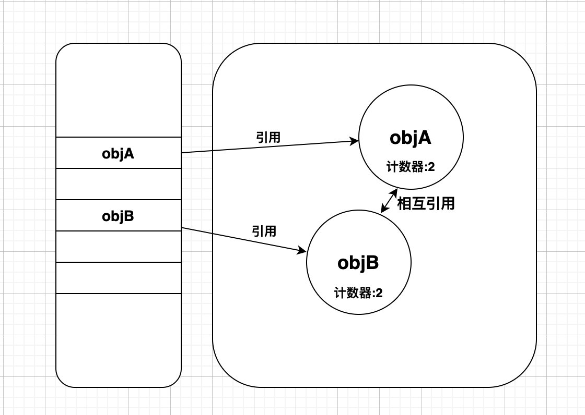

引用计数法缺陷：

1.有对象被引用和被销毁的时候都必须修改引用计数，影响性能

2.当程序出现循环引用时，引用计数算法无法检测出来，被循环引用的对象就变成了无法回收的对象，导致内存泄漏

## 可达性分析

首先，有一系列GCRoots对象作为起始点，从这些起始点开始搜索，起始点走过的路径称之为引用连，当一个对象到GC Roots没有任何引用连相连时，则证明此对象不可用

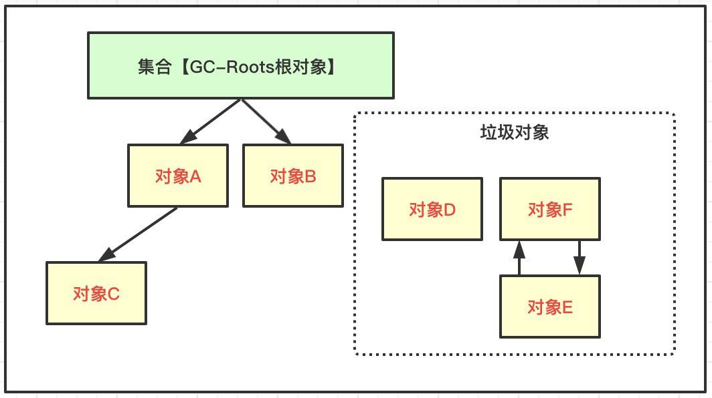

### JDK1.8中GC Roots对象包括以下几种

- 虚拟机栈（栈帧中的本地变量表）中引用的对象。
- 方法区中类静态属性引用的对象。
- 方法区中常量引用的对象。
- 本地方法栈中 JNI（即一般说的 Native 方法）引用的对象。

<!-- more -->

# JVM运行时数据区(规范)

## 运行时数据区(规范定义)

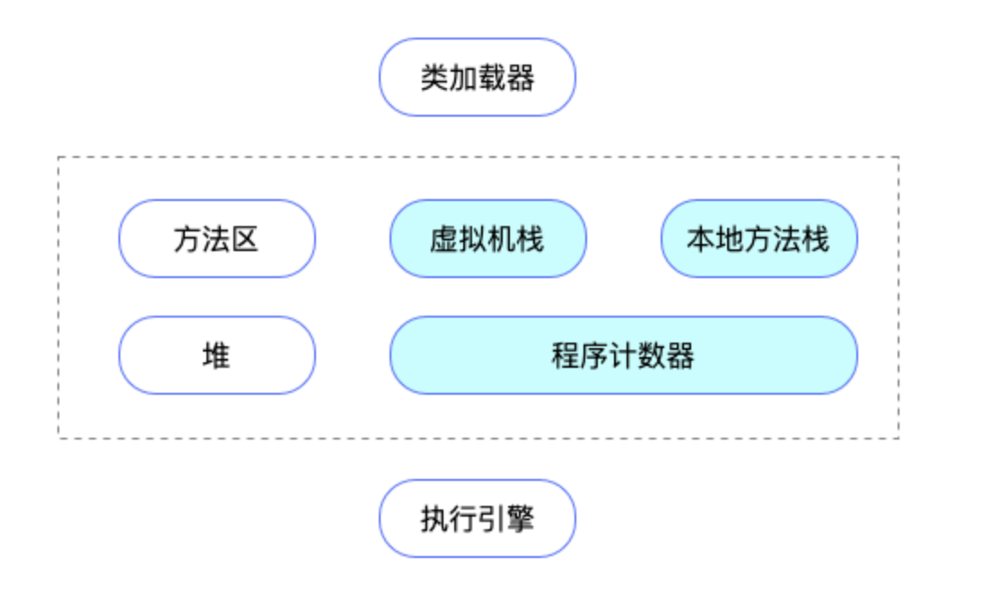

# JVM虚拟机内存模型

## 总览

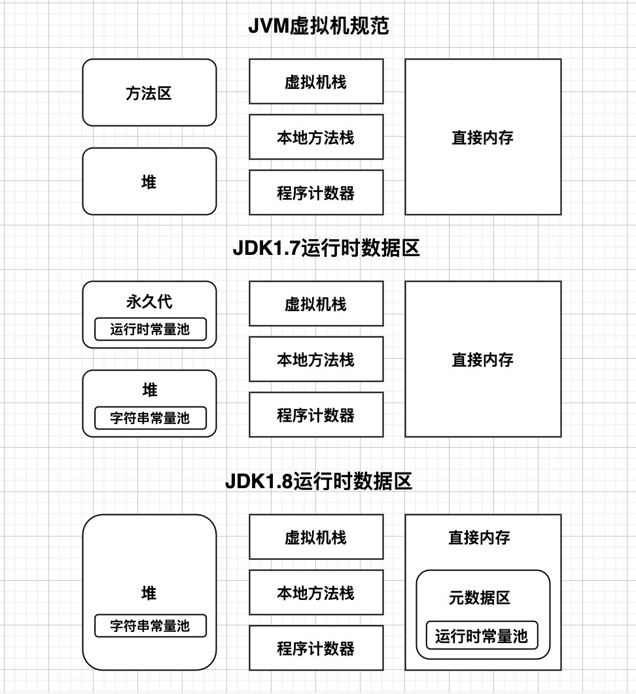

## JVM标准中的五个组成部分

### 方法区

- 存放已被虚拟机加载的类的数据

  方法区是一个各个线程共享的区域，存放的是被虚拟机加载的类的基本信息（类名，类还是接口，访问修饰符等等），字段信息（类中每个字段的名称，类型，修饰符等），方法信息，ClassLoader 引用，JIT 编译后的代码等等。

- 运行时常量池

- 就是存放类的信息、方法元信息、Klass类元信息、常量信息、常量池信息、包括字符串字面量和数字常量等。

 方法区中的信息一般需要长期存在，因此在 JDK 1.8 以前，HotSpot 使用永久代来实现方法区，通过 PermSize 相关参数控制内存占用，从 1.8 开始，方法区被移至 Meta 空间，直接位于本地内存中，而非虚拟机内存中，并且使用 MetaspaceSize 相关参数控制内存占用。

  > 注：方法区是 JVM 虚拟机中的概念，永久代或者 Meta 空间是不同的实现方式。

### 堆（**Java Heap**）

- 在JVM启动时创建

- 存放对象实例数据

- 是发生GC的主要区域

堆一般是 Java 虚拟机中管理的内存最大的一块，在运行时会动态分配堆内存的大小，主要用来存放对象的内存空间，几乎运行时所有的对象都是存储在堆中的。


堆内存可以进一步分为新生代，老年代和永久代：

  - 新生代

    用于存放新创建的对象，以及尚未进入老年代的对象，可以通过 - Xmn 参数来控制起大小。

    新生代内部又分为 Eden，From（S0），To（S1），三者默认的比例为，可以通过 - XX:SurvivorRation 来控制比例。

  - 老年代

    用于存放经过多次新生代 GC 之后，仍然存活的对象。如果满足如下两个条件之一，则新创建的对象也会直接进入热老年代：

    - 大对象，通过参数 - XX:PretenureSizeThreshold 来控制；
  - 大的数组对象，且数组中无外部对象的引用。

  老年代的内存大小，即是整个堆的内存大小 - Xmn 设置的大小，生代和老年代内存的默认比例为。

- 永久代
  
  JDK 1.8 开始从堆内存中移除，被 MetaData Space 代替，直接放到本地内存中

### 程序计数器

- 记录到程序运行到哪一行

  > 程序计数器是一块较小的内存空间，它可以看做是当前线程所执行的字节码的行号指示器。在虚拟机的概念模型里（仅是概念模型，各种虚拟机可能会通过一些更高效的方式去实现），字节码解释器工作时就是通过改变这个计数器的值来选取下一条需要执行的字节码指令，分支、循环、跳转、异常处理、线程恢复等基础功能都需要依赖这个计数器来完成。
  >
  > 它记录了程序执行字节码的行号和指令，字节码解释器的工作就是改变程序计数器的值，切换下一条需要执行的指令(分支,循环,跳转,异常等)。
  >
  > 由于 Java 虚拟机的多线程是通过线程轮流切换并分配处理器执行时间的方式来实现的。在任何一个确定的时刻，一个处理器都只会执行一条线程中的指令。因此，为了线程切换后能恢复到正确的执行位置，每条线程都需要有一个独立的程序计数器，各个线程之间计数器互不影响，独立存储。因此程序计数器是线程私有的一块存储空间，它的生命周期与线程相同。
  >
  > 如果线程正在执行的是一个 Java 方法，那这个计数器记录的是正在执行的字节码指令的地址；
  >
  > 如果正在执行的是 Native 方法，这个计数器值则为空。
  

### 虚拟机栈

- 服务于java虚拟机
- 存放栈桢
- 存放抛出的异常
- 处于物理内存的连续空间

> 栈帧
>
> 栈帧虚拟机进行方法调用和方法执行的数据结构,它是虚拟机运行时数据区虚拟机栈的栈元素。栈帧存储了方法的局部变量表,操作数栈,动态链接和方法返回地址信息。在程序编译期,栈帧需要多大的局部变量表内存,多深的操作数栈已经确定。在活动线程中,栈顶的栈帧才是有效的,与这个栈帧关联的方式是当前方法,执行引擎运行的所有字节码指令都只会作用于当前栈帧。
>
> 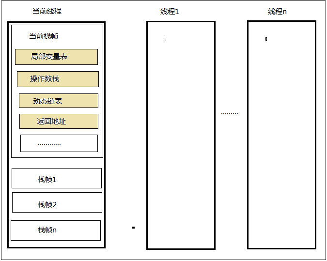
>
> 每个 Java 方法在被执行之前，会创建一个称之为`栈帧`的数据结构，里面保存了方法的一些信息，包括局部变量表，操作数栈，动态链接，方法出口等等
>
>   虚拟机栈是描述 Java 方法运行过程中的内存模型，当调用一个方法时，方法对应的栈帧被入栈，当方法调用完成之后，栈帧被出栈。  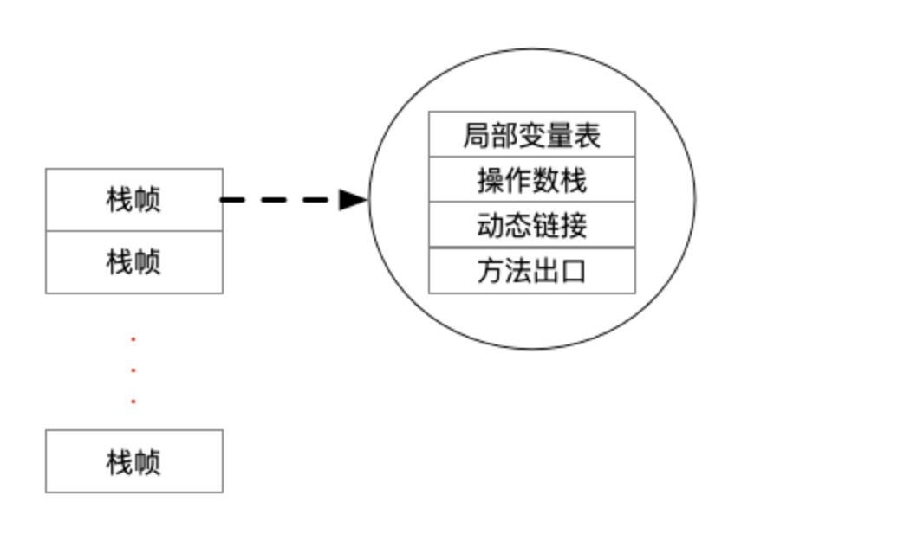
>
>   与程序计数器一样，java 虚拟机栈也是线程私有的，它的生命周期与线程相同，可以在启动的时候使用 - Xss 来设置虚拟机栈的内存大小。
>
>   一个虚拟机栈可能会抛出如下两种异常：
>
> - StackOverflowError：当线程请求的栈深度超过最大值的时候，会抛出此异常；
> - OutOfMemoryError：栈进行动态扩展时，需要申请内存，如果无法申请到足够的内存，则会抛出此异常。

### 本地方法栈

- 本地方法栈与虚拟机栈的功能类似，区别在于，虚拟机栈记录的是 Java 方法运行过程中的内存模型，而**本地方法栈记录的是 native 方法**运行过程中的内存模型。
- Hotspot虚拟机将本地方法栈与虚拟机方法栈合二为一

>**Navtive 方法是 Java 通过 JNI 直接调用本地 C/C++ 库**，可以认为是 Native 方法相当于 C/C++ 暴露给 Java 的一个接口，Java 通过调用这个接口从而调用到 C/C++ 方法。当线程调用 Java 方法时，虚拟机会创建一个栈帧并压入 Java 虚拟机栈。然而当它调用的是 native 方法时，虚拟机会保持 Java 虚拟机栈不变，也不会向 Java 虚拟机栈中压入新的栈帧，虚拟机只是简单地动态连接并直接调用指定的 native 方法。
>
>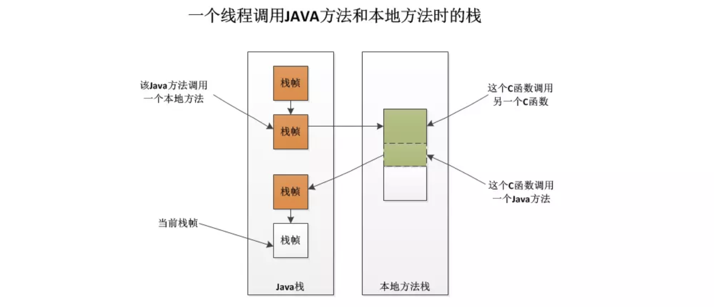
>
>- 本地方法栈是一个后入先出（Last In First Out）栈。
>- 由于是**线程私有**的，生命周期随着线程，线程启动而产生，线程结束而消亡。
>- 本地方法栈会抛出 **StackOverflowError** 和 **OutOfMemoryError** 异常。
>
>当一个线程调用本地方法时,就会进入了一个不受java虚拟机限制的世界,它和虚拟机有着同样的权限。本地方法可以通过本地接口访问虚拟机运行时数据区。它可以直接使用本地处理器的寄存器。并不是所有的JVM都支持本地方法。如果JVM产品不打算支持Native方法,也可以不用实现本地方法栈。

## 会发生内存溢出的区域有哪些

### 堆（**Java Heap**）内存溢出

不断创建对象，并且对象不被GC（没有内存可分配），OutOfMemoryError 异常

### 栈内存溢出

不断循环调用方法，递归

### 方法区内存溢出

类的信息、常量、静态变量以及编译器编译后的代码，没有足够的空间存储，就会内存溢出


## 什么情况下会发生栈内存溢出

- java栈中一般存放的是栈桢，所以栈内存溢出就是栈桢的数量太多了超过了预期设置的值，所以导致内存溢出。
- 一般原因就是**方法的循环调用**，**死递归**


## JDK1.7的运行时数据区


- 永久代是方法区的实现

- jdk1.6之前`字符串常量池`在方法区

- jdk1.7之后`字符串常量池`被移动到堆区

  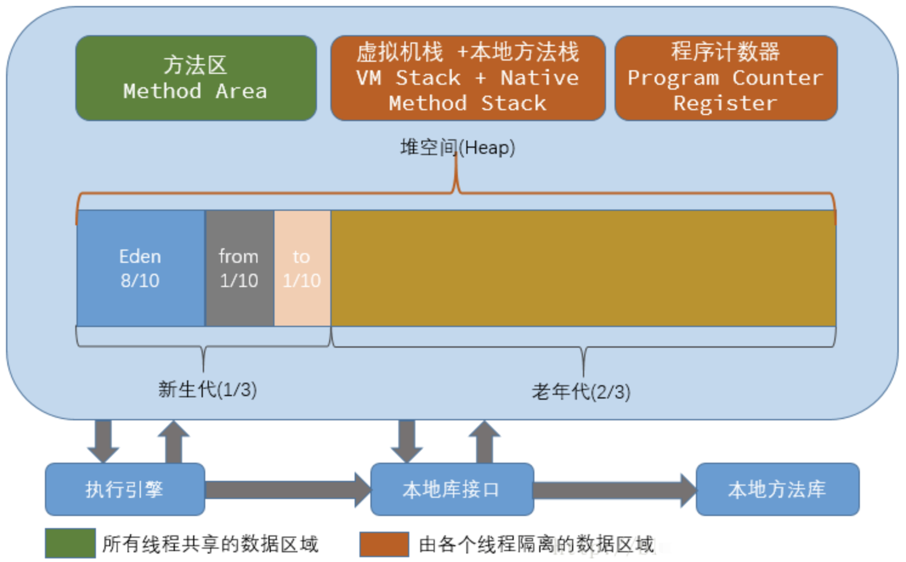

## JDK1.8的运行时数据区

- jdk1.8去掉了永久代

- 引入了元数据区

- Jdk1.7中的`运行时常量池`移动到`元数据区`

- `元数据区`存在于直接内存中

  

  JDK1.8 做了如下调整

  >- 新生代：Eden+From Survivor+To Survivor
  >
  >- 老年代：OldGen
  >
  >- 永久代（方法区的实现） : PermGen——-> 替换为 Metaspace(本地内存中)
  >
  >  
  >
  >  元空间是方法区的在 HotSpot jvm 中的实现，方法区主要用于存储类的信息、常量池、方法数据、方法代码等。方法区逻辑上属于堆的一部分，但是为了与堆进行区分，通常又叫 “非堆”。
  >
  >  元空间的本质和永久代类似，都是对 JVM 规范中方法区的实现。不过**元空间与永久代之间最大的区别在于：元空间并不在虚拟机中，而是使用本地内存。**，理论上取决于 32 位 / 64 位系统可虚拟的内存大小。可见也不是无限制的，需要配置参数。
  >
  >  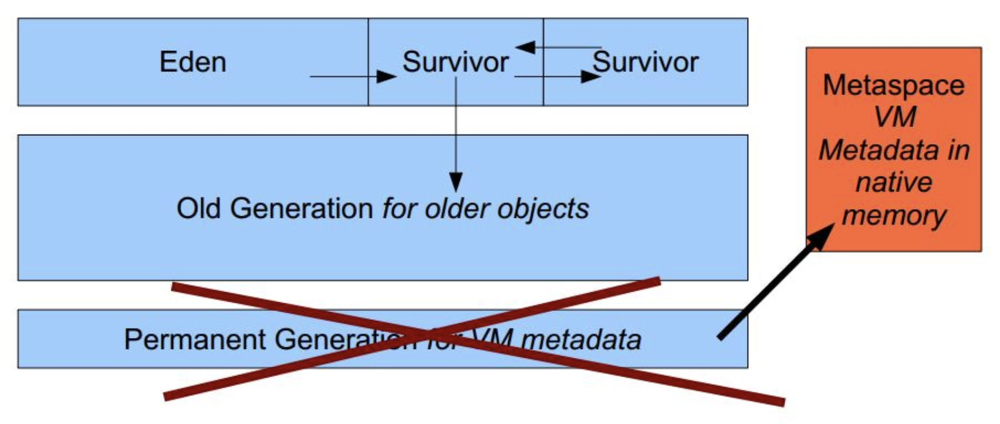

## 为什么移除永久代

> 方法区大小难以设定,容易发生内存溢出。永久代存放着Class相关信息，一般信息在编译期就能确定，但是如果在一些动态生成的Class的应用中,如:Spring中的动态代理,大量的JSP页面或动态生成的JSP页面,由于方法区在一开始就要分配好,因此难以确定大小,容易发生内存溢出。
> GC复杂效率低,方法区存放元数据和各种常量,但是这些数据被类的实例所引用,导致垃圾回收非常困难.
> 促进HotSpot VM和JRockit VM融合,JRockit VM没有方法区

## 什么是元空间

> Java8中，HotSpots取消了永久代，方法存放在永久代中；同时元空间不再与堆连续，而是存放在本地内存。

## 元空间特点

- 每个加载器都有自己的空间
- 不会单独回收某个类
- 元空间对象的位置是固定的
- 如果发现某个加载器不在存活，则将整个空间回收

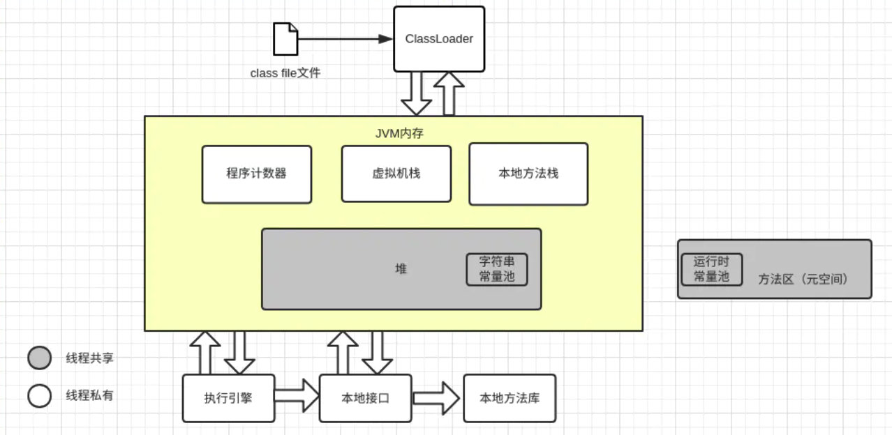


## 对象的创建


### 类型检查

当 JVM 执行到一条 new 指令时，会在方法区的常量池中，查找对象类型的符号引用，如果查找到了符号引用，说明这个类已经被类加载器加载到了方法区，则可以继续执行 new 指令；否则就调用 Class Loader 先执行类的加载方法。

### 内存分配

创建一个对象所需要的内存大小，在类加载的时候就已经确定了，因此当类型准备完毕之后，虚拟机开始在堆中分配指定的内存大小，其中分为两种内存分配方式：

- 内存规整

  内存绝对规整，已经被分配的内存是连续的，在已分配的内存末尾，会放置一个指针，这个指针也相当于是指向未分配的内存区域的起始地址。每次分配内存之后，移动当前指针即可。

  由于内存是规整的，当某个对象被 GC 回收之后，需要进行一些内存迁移，来继续保持内存规整。

- 内存未规整

  这种情况下，被分配和未被分配的内存会夹杂在一起，会有一个列表来记录堆内存的使用情况。当需要新创建对象时，会根据新对象的内存大小来查找满足条件的内存区域进行分配，分配之后更新记录表。

在多线程环境下，比如两个线程同时需要分配内存，则会出现内存分配的并发问题，如果每次对象分配都要加锁，则代价就太大了，所以 JVM 设计了 TLAB（Thread Local Allocation Buffer）：

- 每一个线程预先被分配一小块内存，这块内存很小（默认只有 Eden 区的 1%），每个线程优先在自己的 TLAB 中进行内存分配。

- 由于 TLAB 都很小，所以可能面领着需要分配的内存大小，大于 TLAB 剩余的内存大小，比如 TLAB 为 100KB，剩余 20KB，此时需要分配一块 30KB 的内存。

- JVM 内部有一个 refill_waste 值，表示最大的可浪费空间，默认是 64，代表 TLAB 的 1/64。

  - 如果 TLAB 的剩余空间小于最大的可浪费空间，则该 TLAB 所属的线程会重新向 Eden 区申请一个 TLAB 空间，然后分配对象；
  - 如果 TLAB 的剩余空间大于最大的可浪费空间，则新的内存分配需求，会直接分配到 Eden 区。

  当有多个线程都需要分配新的 TLAB 时，又会面临并发的问题，虚拟机采用 CAS 的方式，配合失败重试，来解决多个线程分配 TLAB 时的并发问题。

### 初始化内存数据

- 初始化零值

  内存分配完成之后，虚拟机会将分配到的内存空间都初始化为零值（不包括对象头）。

- 设置对象头

  零值初始化完成之后，会初始化对象头部分的数据。对象头一般包含了两部分的信息：类型指针（确定对象是哪个类的实例的类型指针），运行时信息（哈希吗，GC 分代年龄，锁状态，线程持有的锁等等）。

### 调用 init 方法

当内存初始化完毕之后，开始调用 init 方法对对象进行初始化。init 完成之后，则会返回这个对象在堆中的引用。


## 内存分配概念

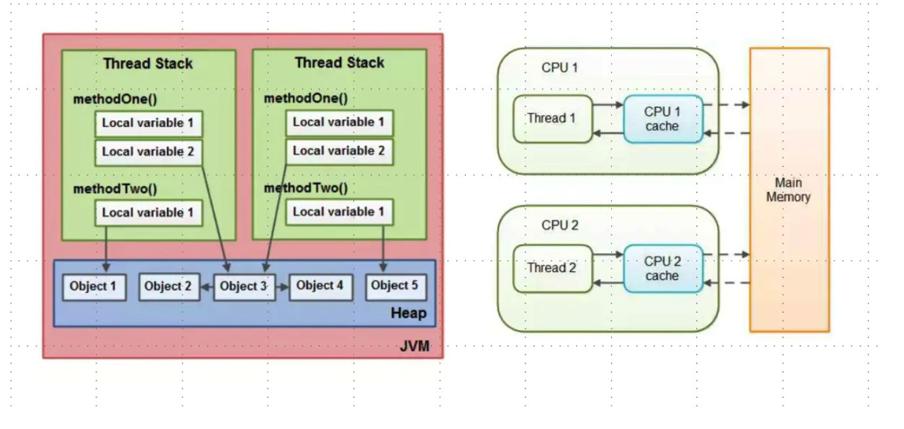


## Java的对象都是分配在堆内存中吗？为什么？

参考文章：https://www.cnblogs.com/javastack/p/11023044.html

不一定，逃逸分析，简单来讲就是Java Hotspot虚拟机可以分析新创建的对象使用范围，并决定是否在java堆上分配内存

### 逃逸分析的JVM参数：

- 开启逃逸分析：-XX:+DoEscapeAnalysis
- 关闭逃逸分析：-XX:-DoEscapeAnalysis
- 显示逃逸分析结果：-XX:+PrintEscapeAnalysis

### 对象的逃逸状态：

#### 全局逃逸

- 对象是一个静态变量
- 对象是一个已经逃逸的对象
- 对象作为当前方法的返回值

#### 参数逃逸

- 一个对象被作为方法参数传递或者被参数引用，但在调用过程中不会发生逃逸

#### 没有逃逸

方法中的对象没有发生逃逸

### 逃逸分析优化

#### 消除锁

- 当编译器确定当前对象只有当前线程使用，那么就会移除该对象的同步锁
- 例如StringBuffer和Vector都是使用synchronized修饰线程安全的，但大部分情况下它们都只是在当前线程中用到，这样，编译器就会优化移除掉这些锁操作。
- 消除锁的JVM参数配置：
  - ①开启消除锁：-XX:+EliminateLocks
  - ②关闭消除锁：-XX:-EliminateLocks
  - 
- JDK1.8中默认是开启的，并且消除锁都要建立在逃逸分析的基础之上。

#### 标量替换

- 基础类型和对象的引用可以理解为标量，它们不能被进一步分解，而可以被进一步分解的称之为：聚合量
- 对象时聚合量，他又可以被进一步分解成标量，将其成员变量分解为分散的变量，这就叫做标量替换。
- 如果一个对象没有发生逃逸，就压根不用创建它，只会在栈或者寄存器上创建它用到的成员标量，节省了空间，也提升了程序性能
- 标量替换JVM参数配置：
  - 开启标量替换：-XX:+EliminateAllocations
  - 关闭标量替换：-XX:-EliminateAllocations
  - 显示标量替换详情：-XX:+PrintEliminateAllocations
- 标量替换在JDK1.8中也是默认开启的，并且建立在逃逸分析的基础上


## JVM两个重要的概念:`堆(Heap)`和`栈(Stack)`

Java中Heap是运行时数据区,有垃圾收集器负责,它的优势的是动态分配内存,生命周期不必事先告诉编译器,在运行时动态分配内存,JVM垃圾收集器会自动回收不再使用的数据.缺点是:由于是在运行时分配的内存,所以存取速度相对较慢。

Java中的Stack比Heap存取速度快,仅次于寄存器,Stack中的数据可以是共享的。但是栈的缺点是生命周期在编译器就已经确定,缺乏灵活性,主要放一些基本类型的变量。

JMM要求调用栈和局部变量(本地变量)放在Stack上,对象放在Heap上。一个局部变量可以引用一个对象,而这个对象是放在Heap上。一个类可能有方法,方法中的局部变量也是放在线程栈上,即使这些方法所属的对象依然在Heap上。一个对象的成员变量可能会随着这个对象存放在Heap上,不管这个成员变量是基本类型还是引用类型,静态成员变量跟随类的定义一起放在Heap上。存放在堆上对象，可以被持有这个对象的线程访问。

当一个线程可以访问一个对象,它可以访问该对象的成员变量,如果两个线程同时调用一个对象的同一个方法,将会都访问该对象的成员变量,但是每个线程都有了该成员变量的私有拷贝。


# JAVA的对象访问定位

创建对象是为了访问对象，Java程序通过栈的引用(reference)数据来操作堆上的对象。由于reference类型在Java虚拟机规范中只规定了`一个指向对象的引用`。并没有规定通过该引用怎么定位，访问堆中的对象。具体需要看虚拟机的实现。

两种访问方式:

- 句柄访问
- 直接访问

## 句柄访问

> Java堆中会划分一个句柄池,reference存储的就是对象的句柄地址,而句柄中存放的是对象的实例数据和类型数据的地址信息。

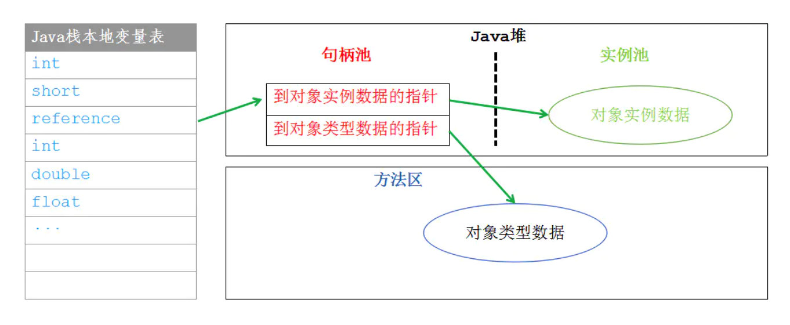

## 直接访问

> Java堆对象布局就必须考虑如何存放访问类型数据的相关信息，reference存储的就是对象的地址。

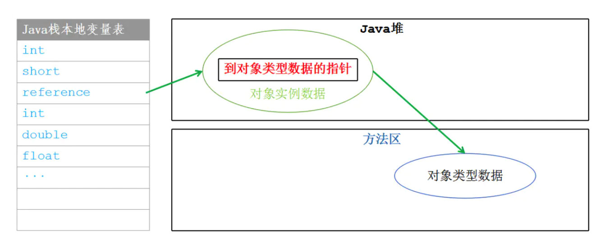

### 句柄访问和直接访问的特点

- 句柄访问:reference存放的是句柄地址(比较稳定),在对象移动时(垃圾回收),只会改变句柄中实例数据的地址，而reference无需改变。
- 直接访问:由于节省了一次指针开销访问速度比较快,由于对象的访问在Java堆上访问特别频繁。Sun HotSpot虚拟机采用的是直接访问。


# JVM如何加载字节码

> 当 Java 编译器编译好. class 文件之后，我们需要使用`JVM`来运行这个 class 文件。那么最开始的工作就是要把`字节码`从磁盘输入到内存中，这个过程我们叫做【**加载** 】。加载完成之后，我们就可以进行一系列的运行前准备工作了，比如： 为类静态变量开辟空间，将常量池存放在方法区内存中并实现常量池地址解析，初始化类静态变量等等。这篇文章我们要好好谈谈 JVM 是如何加载 class 文件的？

**类加载机制**

类从被加载到虚拟机内存到卸载出内存的生命周期包括：加载 ->连接 (验证 -> 准备 ->解析)->初始化 ->使用 ->卸载

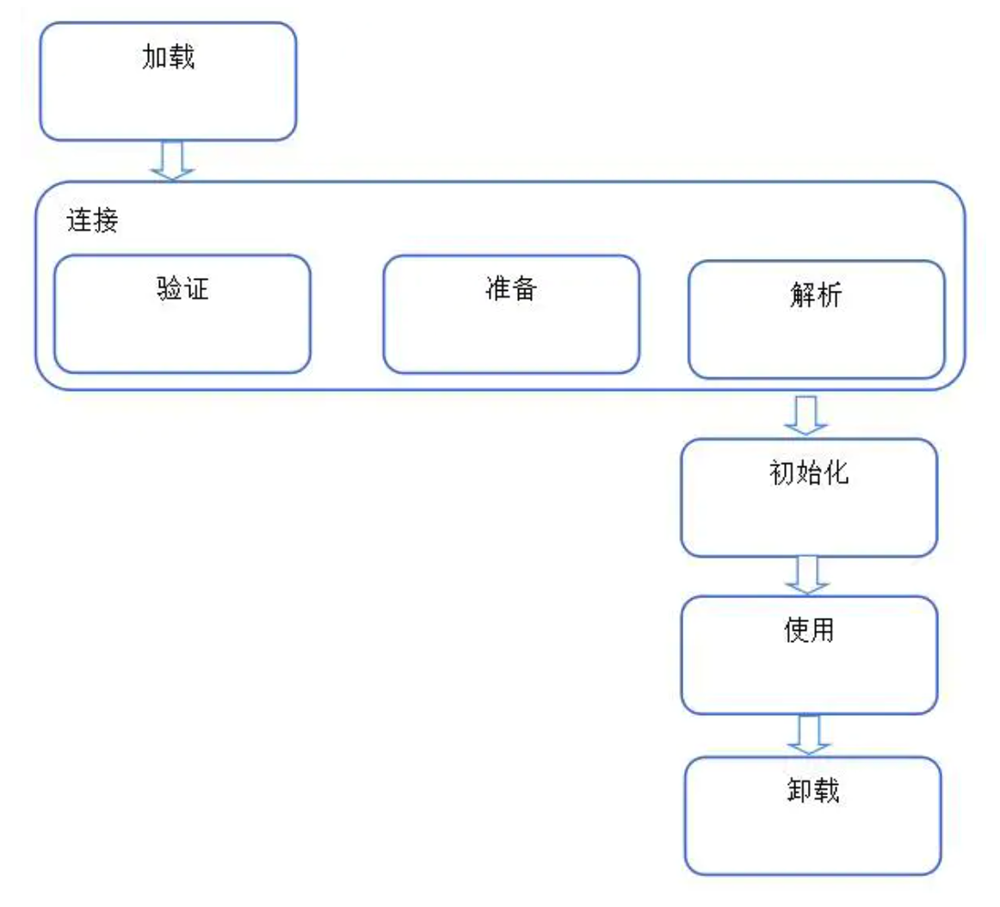

- **加载**
  - 将 class 文件字节码内容加载到内存中，并将这些静态数据转换成方法区中的运行时数据结构，在堆中生成一个代表这个类的 java.lang.Class 对象，作为方法区类数据的访问入口，这个过程需要类加载器参与。
- **链接** 将 java 类的二进制代码合并到 JVM 的运行状态之中的过程
- **验证：** 确保加载的类信息符合 JVM 规范，没有安全方面的问题
  - **准备：** 正式为类变量（static 变量）分配内存并设置类变量初始值的阶段，这些内存都将在方法去中进行分配
  - **解析：** 虚拟机常量池的符号引用替换为字节引用过程
- **初始化**
  - 初始化阶段是执行类构造器 <clinit>（）方法的过程。类构造器 < clinit>（）方法是由编译器自动收藏类中的所有类变量的赋值动作和静态语句块 (static 块) 中的语句合并产生
  - 当初始化一个类的时候，如果发现其父类还没有进行过初始化，则需要先触发其父类的初始化
  - 虚拟机会保证一个类的 <clinit>（）方法在多线程环境中被正确加锁和同步
  - 当范围一个 Java 类的静态域时，只有真正声名这个域的类才会被初始化

**java 装载类使用 `全盘负责委托机制`：** 是指一个 ClassLoader 装载一个类时，除非显示使用另一个 ClassLoader，该类所依赖及引用的类也由这个 ClassLoader 载入。“委托机制” 是指先委托父类装载器寻找目标类，只有在找不到的情况下才从自己的路径中查找并载入。这一点是从安全的方面考虑的，试想一下如果有人写了一个恶意的基础类（如 java.lang.String）并加载到 JVM 将引起严重后果，但是全盘负责制，java.lang.String 永远是由根装载器来装载的，避免以上情况发生

# JVM常量池

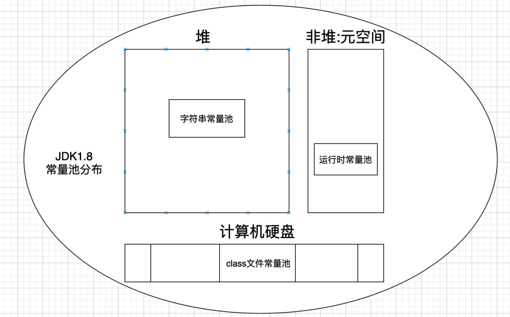

## Class文件常量池

class文件是以字节为单位的二进制数据流,java编译器将java源码文件编译成`.class`字节码文件存放在磁盘上，`.class`中就包含文件常量池(非运行时常量池),在编译期间就确定了,`.class`文件遵循jvm虚拟机规范.

## 什么是常量

### 文本字面量

```
#29 = Utf8 入门
```

### final修饰成员变量(静态变量,实例变量,局部变量)

> 对于基本类型`public Integer id=10;`常量池中只保留了他的字段描述符I和字段名称value,他们的字面量不会存在于常量池。

### 符号引用

> 符号引用主要设涉及编译原理方面的概念，包括下面三类常量:

- 类和接口的全限定名,也就是java/lang/String,将原来的`.`替换成`/`,主要用于在运行时解析得到类的直接引用。

- 字段的名称和描述符:就是类或者接口中声明的变量,包括类级别的变量和实例级的变量

- 方法中的名称和描述符:参数类型+返回值

## 运行时常量池

> 运行时常量池是方法区的一部分，所以也是全局共享的，JVM在执行某个类的时候会经过`加载`,`链接(验证,准备,解析)`,`初始化`，在加载的时候需要做:

- 通过一个类的全类限定名获取此类的二进制字节流。
- 在堆内存生成一个java.lang.Class对象,代表加载这个类,做为这个类的入口。

> `普通对象`和`类对象`的区别:普通对象是通过new创建出来的。类对象是JVM创建的单例对象。

- 将字节流的静态存储结构转化成方法区的运行时数据结构

> class文件常量池进入运行时常量池，所有类共同使用一个运行时常量池，在进入运行时常量的过程中,多个class常量池中相同的字符串，只会在运行时常量池存在一份，这是一种优化。

运行时常量池的作用是存储class文件常量池中的符号引用，同时运行时常量池保存着class文件中描述的符号引用,在类的解析阶段会把这些符号引用转换成直接引用(实例对象的内存地址),翻译出来的直接引用也是存储在运行时常量池中。class文件常量池的大部分数据会被加载到运行时常量池。

运行时常量池相比于class文件常量池具有动态性，运行时常量池的内容不全部来自于class文件常量池,可以通过代码生成的方式加入到里面。如String.intern。

### String.intern()的用法

拿String的内容去Stringtable查找,则返回引用。如果不存在就把该对象的引用存在Stringtable中。

## 字符串常量池

1.字符串创建的两种方式

- String rumenz1=”入门”;
- String rumenz2=new String(“小站”);

`入门`在编译期间就已经确定,会进入字符串常量池,但是字符串常量池只会保存一个引用,最终还是会在堆上创建一个`入门`对象。new String这种方式调用了String类的构造函数,new是创建一个对象实例并初始化该实例,因此这个字符串对象是在运行时才能确定的,创建的实例在堆上。

2.字符串常量的本质

字符串常量池是JVM维护的一个字符串实例引用表,在HotSpot VM中它是叫做一个StringTable的全局表。在字符串常量池中维护的是字符串实例的引用,底层C++维护的就是一个Hashtable。这些被维护引用的字符串实例,被称作`被驻留字符串`或`interned string`或`进入字符串常量池的字符串`。


###### 来源:

https://rumenz.com/rumenbiji/java-jvm-jmm.html

https://rumenz.com/rumenbiji/jvm-object-alive.html

https://rumenz.com/rumenbiji/jvm-memory-model.html

https://rumenz.com/rumenbiji/jvm-runtime-data-area.html

https://www.cnblogs.com/javastack/p/11023044.html

https://rumenz.com/rumenbiji/jvm-memory-structure.html

https://rumenz.com/rumenbiji/jvm-native-method-stack.html

https://rumenz.com/rumenbiji/jvm-counter-stack-local.html

https://rumenz.com/rumenbiji/java-object-access-location.html

https://rumenz.com/rumenbiji/jvm-load-bytecode.html

