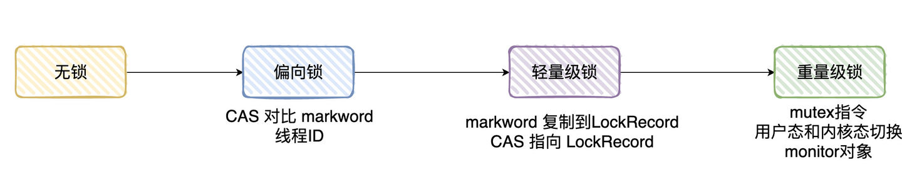

# Lock

## 锁

### 公平和非公平锁

公平锁指的就是：在竞争环境下，先到临界区的线程比后到的线程一定更快地获取得到锁

那非公平就很好理解了：先到临界区的线程未必比后到的线程更快地获取得到锁

### 怎么实现公平和非公平锁？

公平锁可以把竞争的线程放在一个先进先出的队列上

只要持有锁的线程执行完了，唤醒队列的下一个线程去获取锁就好了

非公平锁的概念上面已经提到了：后到的线程可能比前到临界区的线程获取得到锁

那实现也很简单，线程先尝试能不能获取得到锁，如果获取得到锁了就执行同步代码了

如果获取不到锁，那就再把这个线程放到队列呗

所以公平和非公平的区别就是：线程执行同步代码块时，是否会去尝试获取锁。

如果会尝试获取锁，那就是非公平的。如果不会尝试获取锁，直接进队列，再等待唤醒，那就是公平的。

<!-- more -->

### 线程一直尝试获取锁？

一直尝试获取锁，专业点就叫做自旋，需要耗费资源的。

多个线程一直在自旋，而且大多数都是竞争失败的

## AQS

### AQS是什么

AQS全称叫做AbstractQueuedSynchronizer

是可以给我们实现锁的一个「框架」，内部实现的关键就是维护了一个先进先出的队列以及state状态变量

先进先出队列存储的载体叫做Node节点，该节点标识着当前的状态值、是独占还是共享模式以及它的前驱和后继节点等等信息

简单理解就是：AQS定义了模板，具体实现由各个子类完成。

总体的流程可以总结为：会把需要等待的线程以Node的形式放到这个先进先出的队列上，state变量则表示为当前锁的状态。

像ReentrantLock、ReentrantReadWriteLock、CountDownLatch、Semaphore这些常用的实现类都是基于AQS实现的

AQS支持两种模式：独占（锁只会被一个线程独占）和共享（多个线程可同时执行）

## Synchronized

### Synchronized是什么锁

synchronized是一种互斥锁，一次只能允许一个线程进入被锁住的代码块

synchronized是Java的一个关键字，它能够将代码块/方法锁起来

如果synchronized修饰的是实例方法，对应的锁则是对象实例

如果synchronized修饰的是静态方法，对应的锁则是当前类的Class实例

如果synchronized修饰的是代码块，对应的锁则是传入synchronized的对象实例

### Synchronized锁是公平的还是非公平的

**非公平的**。

偏向锁很好理解，如果当前线程ID与markword存储的不相等，则CAS尝试更换线程ID，CAS成功就获取得到锁了

CAS失败则升级为轻量级锁

轻量级锁实际上也是通过CAS来抢占锁资源（只不过多了拷贝Mark Word到Lock Record的过程）

抢占成功到锁就归属给该线程了，但自旋失败一定次数后升级重量级锁

重量级锁通过monitor对象中的队列存储线程，但线程进入队列前，还是会先尝试获取得到锁，如果能获取不到才进入线程等待队列中

综上所述，synchronized无论处理哪种锁，都是先尝试获取，获取不到才升级|| 放到队列上的，所以是非公平的

synchronized的原理呗？**

通过反编译可以发现

当修饰方法时，编译器会生成 ACC_SYNCHRONIZED 关键字用来标识

当修饰代码块时，会依赖monitorenter和monitorexit指令

但前面已经说了，无论synchronized修饰的是方法还是代码块，对应的锁都是一个实例（对象）

在内存中，对象一般由三部分组成，分别是对象头、对象实际数据和对齐填充

重点在于对象头，对象头又由几部分组成，但我们重点关注对象头Mark Word的信息就好了

Mark Word会记录对象关于锁的信息

又因为每个对象都会有一个与之对应的monitor对象，monitor对象中存储着当前持有锁的线程以及等待锁的线程队列

了解Mark Word和monitor对象是理解 synchronized 原理的前提

### Synchronized锁在 JDK 1.6 之后的优化

在JDK 1.6之前是重量级锁，线程进入同步代码块/方法 时

monitor对象就会把当前进入线程的Id进行存储，设置Mark Word的monitor对象地址，并把阻塞的线程存储到monitor的等待线程队列中

它加锁是依赖底层操作系统的 mutex 相关指令实现，所以会有用户态和内核态之间的切换，性能损耗十分明显

而JDK1.6 以后引入偏向锁和轻量级锁在JVM层面实现加锁的逻辑，不依赖底层操作系统，就没有切换的消耗

所以，Mark Word对锁的状态记录一共有4种：无锁、偏向锁、轻量级锁和重量级锁

## ReentrantLock

### ReentrantLock加锁和解锁的过程

以非公平锁为了，我们在外界调用lock方法的时候，源码是这样实现的

1):CAS尝试获取锁，获取成功则可以执行同步代码

2):CAS获取失败，则调用acquire方法，acquire方法实际上就是AQS的模板方法

3):acquire首先会调用子类的tryAcquire方法（又回到了ReentrantLock中）

4):tryAcquire方法实际上会判断当前的state是否等于0，等于0说明没有线程持有锁，则又尝试CAS直接获取锁

5):如果CAS获取成功，则可以执行同步代码

6):如果CAS获取失败，那判断当前线程是否就持有锁，如果是持有的锁，那更新state的值，获取得到锁（这里其实就是处理可重入的逻辑）

7):CAS失败&&非重入的情况，则回到tryAcquire方法执行「入队列」的操作

8):将节点入队列之后，会判断「前驱节点」是不是头节点，如果是头结点又会用CAS尝试获取锁

9):如果是「前驱节点」是头节点并获取得到锁，则把当前节点设置为头结点，并且将前驱节点置空（实际上就是原有的头节点已经释放锁了）

10):没获取得到锁，则判断前驱节点的状态是否为SIGNAL，如果不是，则找到合法的前驱节点，并使用CAS将状态设置为SIGNAL

11):最后调用park将当前线程挂起

### 使用压缩算法压缩下加锁的过程

压缩后：当线程CAS获取锁失败，将当前线程入队列，把前驱节点状态设置为SIGNAL状态，并将自己挂起。

### 解锁的过程

1):外界调用unlock方法时，实际上会调用AQS的release方法，而release方法会调用子类tryRelease方法（又回到了ReentrantLock中）

2):tryRelease会把state一直减（锁重入可使state>1），直至到0，当前线程说明已经把锁释放了

3):随后从队尾往前找节点状态需要 < 0，并离头节点最近的节点进行唤醒

唤醒之后，被唤醒的线程则尝试使用CAS获取锁，假设获取锁得到则把头节点给干掉，把自己设置为头节点

解锁的逻辑非常简单哈，把state置0，唤醒头结点下一个合法的节点，被唤醒的节点线程自然就会去获取锁

### 为什么要设置前驱节点为SIGNAL状态

其实就是表示后继节点需要被唤醒

其实归终结底就是为了判断节点的状态，去做些处理。

Node 中节点的状态有4种，分别是：CANCELLED(1)、SIGNAL(-1)、CONDITION(-2)、PROPAGATE(-3)和0

在ReentrantLock解锁的时候，会判断节点的状态是否小于0，小于等于0才说明需要被唤醒

另外一提的是：公平锁的实现与非公平锁是很像的，只不过在获取锁时不会直接尝试使用CAS来获取锁。

只有当队列没节点并且state为0时才会去获取锁，不然都会把当前线程放到队列中

## 偏向锁、轻量级锁和重量级锁

偏向锁指的就是JVM会认为只有某个线程才会执行同步代码（没有竞争的环境）

所以在Mark Word会直接记录线程ID，只要线程来执行代码了，会比对线程ID是否相等，相等则当前线程能直接获取得到锁，执行同步代码

如果不相等，则用CAS来尝试修改当前的线程ID，如果CAS修改成功，那还是能获取得到锁，执行同步代码

如果CAS失败了，说明有竞争环境，此时会对偏向锁撤销，升级为轻量级锁。

在轻量级锁状态下，当前线程会在栈帧下创建Lock Record，LockRecord 会把Mark Word的信息拷贝进去，且有个Owner指针指向加锁的对象

线程执行到同步代码时，则用CAS试图将Mark Word的指向到线程栈帧的Lock Record，假设CAS修改成功，则获取得到轻量级锁

假设修改失败，则自旋（重试），自旋一定次数后，则升级为重量级锁

简单总结一下

synchronized锁原来只有重量级锁，依赖操作系统的mutex指令，需要用户态和内核态切换，性能损耗十分明显

重量级锁用到monitor对象，而偏向锁则在Mark Word记录线程ID进行比对，轻量级锁则是拷贝Mark Word到Lock Record，用CAS+自旋的方式获取。

引入了偏向锁和轻量级锁，就是为了在不同的使用场景使用不同的锁，进而提高效率。锁只有升级，没有降级

1）只有一个线程进入临界区，偏向锁

2）多个线程交替进入临界区，轻量级锁

3）多线程同时进入临界区，重量级锁

###### 来源：

https://www.zhihu.com/question/527785982/answer/2527820149
