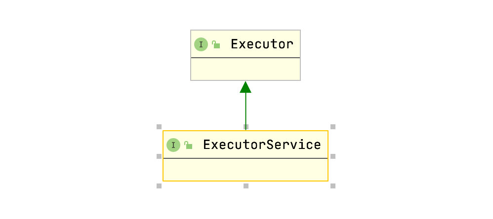
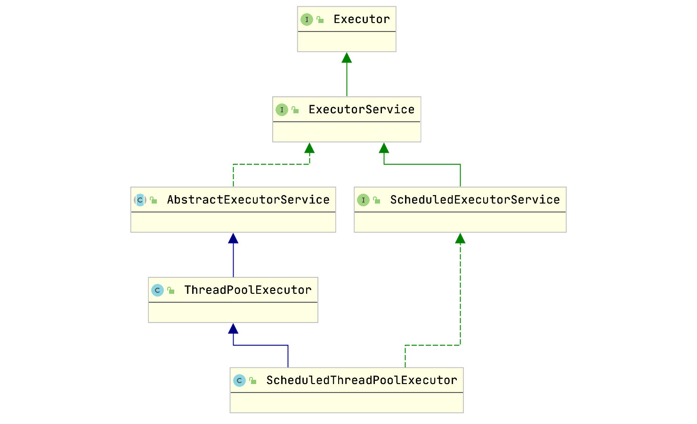
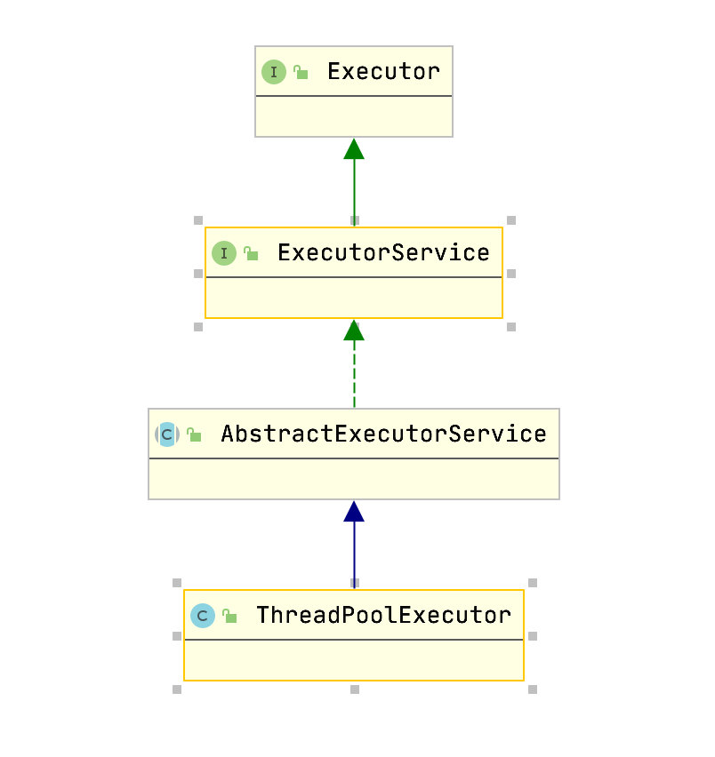

# ThreadPool

>初始化线程池后,把任务丢进去,等待调度就可以了,使用起来比较方便。
>JAVA中`Thread`是线程类,不建议直接使用`Thread`执行任务,在并发数量比较多的情况下,每个线程都是执行一个很短的时间就任务结束了,这样频繁创建线程会大大降低系统的效率,因为频繁的创建和销毁线程需要时间。而线程池可以复用,就是执行完一个任务,并不销毁,而是可以继续执行其它任务。

## Thread的弊端

- 每次`new Thread()` 创建对象,性能差。
- 线程缺乏统一管理,可能无限制创建线程,相互竞争,有可能占用过多系统资源导致死机或OOM。
- 不能多执行,定期执行,线程中断

## 线程池的优点

- 重用存在的线程,减少对象创建,消亡的开销,性能佳,降低资源消耗。
- 可以控制最大并发线程数,提高系统资源利用率,同时避免过多资源竞争,避免阻塞,提高响应速度。
- 提供定时执行,定期执行,单线程,并发数控制等功能,以提高线程的可管理性。

> 阿里发布的 Java 开发手册中强制线程池不允许使用 Executors 去创建，而是通过 ThreadPoolExecutor 的方式，这样的处理方式让写的同学更加明确线程池的运行规则，规避资源耗尽的风险。
>
> Executors利用工厂模式向我们提供了4种线程池实现方式，但是并不推荐使用，原因是使用Executors创建线程池不会传入相关参数而使用默认值所以我们常常忽略了那些重要的参数（线程池大小、缓冲队列的类型等），而且默认使用的参数会导致资源浪费，不可取。

<!-- more -->

## ExecutorService

### 介绍



> `ExecutorService`是`java`线程池定义的一个接口,它在`java.util.concurrent`包中,在这个接口中定义了和后台任务执行相关的方法。
>
> Java API对`ExecutorService`接口实现有两个,所以这两个即是线程池的具体实现。

```java
1. ThreadPoolExecutor
2. ScheduledThreadPoolExecutor
```

> `ExecutorService`还继承了`Executor`接口。
>
> 

### JDK内置线程池`ExecutorService`的创建

- newCachedThreadPool(0,Integer.MAX_VALUE,60s,SyncQueue--不允许超时，超时无限)

  用来创建一个可以无限扩大的线程池，适用于服务器负载较轻，执行很多短期异步任务。

  无限创建线程，可能导致OOM。若线程60s未能消费到任务，则corePoolSize回收至0

- newFixedThreadPool(m,n,mill,LinkedBlockQueue)

  用来创建一个固定大小的线程池，因为采用误解的阻塞队列，所以实际线程数量永远不会变化，适用于可以预测线程数，或服务器资源有限，对当前线程数量进行限制。

- newSingleThreadPool(1,1,mill,LinkedBlockingQueue)

  用来创建一个单线程的线程池，适用于需要保证顺序执行各个任务，并且在任意时间点不会有多个线程是活跃的场景

- newScheduledThreadPool

  可以延迟启动、定时启动的线程池，适用于需要多个后台线程执行周期任务的场景

- newWorkStealingPool

  创建一个拥有多个任务队列的线程池，可以减少连接数，创建当前可用CPU数量的线程来并行执行，适用于大耗时的操作，可以并行来执行

> `Executors`是一个工厂类,它所有的方法返回的都是`ThreadPoolExecutor`和`ScheduledThreadPoolExecutor`这两个类的实例。

### `ExecutorService`的使用

```java
ExecutorService executorService = Executors.newFixedThreadPool(5);
executorService.execute(new Runnable() {
  public void run() {
    System.out.println("run");
  }
});
executorService.shutdown();
```

### `ExecutorService`的执行方法

- execute(Runnable) 无法获取执行结果

  - 接收一个`Runnable`实例,并且异步执行

  - 没有办法获取执行结果。

    ```java
    ExecutorService executorService = Executors.newSingleThreadExecutor();
    executorService.execute(new Runnable() {
      public void run() {
        System.out.println("Asynchronous task");
      }
    });
    executorService.shutdown();
    ```

- submit(Runnable)可以判断任务是否完成

  - `submit(Runnable)`比`execute(Runnable)`多返回一个`Future`,可以用来判断提交的任务是否执行完成。

  - 如果任务完成,`future.get()`会返回null,`future.get`会阻塞。

    ```java
    Future future = executorService.submit(new Runnable() {
      public void run() {
        System.out.println("Asynchronous task");
      }
    });
    future.get();  //returns null if the task has finished correctly.
    ```

- submit(Callable)可以获取返回结果

  - submit(Callable)和submit(Runnable)类似，也会返回一个Future对象，但是除此之外，submit(Callable)接收的是一个Callable的实现，Callable接口中的call()方法有一个返回值，可以返回任务的执行结果，而Runnable接口中的run()方法是void的，没有返回值

  - 如果任务完成,`future.get`会返回`Callable`执行返回的结果,同样`future.get()`会阻塞。

    ```java
    Future future = executorService.submit(new Callable(){
      public Object call() throws Exception {
        System.out.println("Asynchronous Callable");
        return "Callable Result";
      }
    });
    System.out.println("future.get() = " + future.get());
    ```

- invokeAny(…)

  - `invokeAny(...)`方法接收的是一个`Callable`的集合，执行这个方法不会返回Future，但是会返回所有Callable任务中其中一个任务的执行结果。这个方法也无法保证返回的是哪个任务的执行结果，反正是其中的某一个

  - 每次执行都会返回一个结果，并且返回的结果是变化的，可能会返回“Task2”也可是“Task1”或者其它。

    ```java
    ExecutorService executorService = Executors.newSingleThreadExecutor();
    Set<Callable<String>> callables = new HashSet<Callable<String>>();
    callables.add(new Callable<String>() {
      public String call() throws Exception {
        return "Task 1";
      }
    });
    callables.add(new Callable<String>() {
      public String call() throws Exception {
        return "Task 2";
      }
    });
    callables.add(new Callable<String>() {
      public String call() throws Exception {
        return "Task 3";
      }
    });
    String result = executorService.invokeAny(callables);
    System.out.println("result = " + result);
    executorService.shutdown();
    ```

- invokeAll(...)

  - invokeAll(…)与 invokeAny(…)类似也是接收一个Callable集合，但是前者执行之后会返回一个Future的List，其中对应着每个Callable任务执行后的Future对象。

    ```java
    ExecutorService executorService = Executors.newSingleThreadExecutor();
    Set<Callable<String>> callables = new HashSet<Callable<String>>();
    callables.add(new Callable<String>() {
      public String call() throws Exception {
        return "Task 1";
      }
    });
    callables.add(new Callable<String>() {
      public String call() throws Exception {
        return "Task 2";
      }
    });
    callables.add(new Callable<String>() {
      public String call() throws Exception {
        return "Task 3";
      }
    });
    List<Future<String>> futures = executorService.invokeAll(callables);
    for(Future<String> future : futures){
      System.out.println("future.get = " + future.get());
    }
    executorService.shutdown();
    ```

### 线程池ExecutorService的关闭

如果要关闭ExecutorService中执行的线程，我们可以调用ExecutorService.shutdown()方法。在调用shutdown()方法之后，ExecutorService不会立即关闭，但是它不再接收新的任务，直到当前所有线程执行完成才会关闭，所有在shutdown()执行之前提交的任务都会被执行。

如果我们想立即关闭ExecutorService，我们可以调用ExecutorService.shutdownNow()方法。这个动作将跳过所有正在执行的任务和被提交还没有执行的任务。但是它并不对正在执行的任务做任何保证，有可能它们都会停止，也有可能执行完成。


## 为什么不推荐用Executors直接创建线程池

 1.FixedThreadPool和SingleThreadPool：BlockingQueue有两种实现：

1）LinkedBlockingQueue：可以选择不设置容量；

2）ArrayBlockingQueue：必须设置容量

允许请求队列长度为Integer.MAX_VALUE，可能造成大量请求堆积，导致OOM

2.CacheThreadPool和ScheduledThreadPool:

允许创建线程数量为Integer.MAX_VALUE，可能会创建大量线程导致OOM。

解决：通过直接调用ThreadPoolExcutors的构造函数自己创建线程池


# ThreadPoolExecutor

## 介绍



> `java.uitl.concurrent.ThreadPoolExecutor`类是线程池中最核心的一个类。

```java
public class ThreadPoolExecutor extends AbstractExecutorService {
  /** 构造函数 1 */
  public ThreadPoolExecutor(int corePoolSize,
                            int maximumPoolSize,
                            long keepAliveTime,
                            TimeUnit unit,
                            BlockingQueue<Runnable> workQueue) {}
  /** 构造函数 2 */
  public ThreadPoolExecutor(int corePoolSize,
                            int maximumPoolSize,
                            long keepAliveTime,
                            TimeUnit unit,
                            BlockingQueue<Runnable> workQueue,
                            ThreadFactory threadFactory) {}
  /** 构造函数 3 */
  public ThreadPoolExecutor(int corePoolSize,
                            int maximumPoolSize,
                            long keepAliveTime,
                            TimeUnit unit,
                            BlockingQueue<Runnable> workQueue,
                            RejectedExecutionHandler handler) {}
  /** 构造函数 4 */
  public ThreadPoolExecutor(int corePoolSize,
                            int maximumPoolSize,
                            long keepAliveTime,
                            TimeUnit unit,
                            BlockingQueue<Runnable> workQueue,
                            ThreadFactory threadFactory,
                            RejectedExecutionHandler handler) {}

```

> ThreadPoolExecutor类中提供了四个构造方法，在构造函数4中，参数最多，通过观察其他3个构造函数，发现前面三个构造器都是调用的第四个构造器进行的初始化工作。


## 参数

- corePoolSize：核心线程数

  核心线程会一直存活，即使没有任务需要执行

  当线程数小于核心线程数时，即使有线程空闲，线程池也会优先创建新线程来处理

  设置allowCoreThreadTimeOut=true时，核心线程会超时关闭

- maximumPoolSize：最大线程数

  当线程数>=corePoolSize，且任务队列已满时，线程池会创建新线程来处理

  当线程数=maxPoolSize，且任务队列已满时，线程池会决绝处理任务而抛出异常

- keepAliveTime：线程空闲时间

  当线程空闲时间达到keepAliveTime时，线程会退出，直到线程数量=corePoolSize

  如果allowCoreThreadTimeOut=true，则会直到线程数=0

- TimeUnit 

  参数`keepAliveTime`的时间单位

- BlockingQueue workQueue

  - ArrayBlockingQueue:基于数组的先进先出队列,创建时必须指定大小。
  - LinkedBlockingQueue:基于链表的先进先出队列,若果创建时没有指定此队列的大小,则默认为`Integer.MAX_VALUE`。
  - SynchronousQueue:这个队列比较特殊,它不会保存提交的任务,而是直接新建一个线程来执行新的任务。

- ThreadFactory

  线程工厂,主要用来创建线程。线程池最重要的一项工作,就是在满足某些条件情况下创建线程。在`ThreadPoolExecutor`线程池中,创建线程的操作时交给`ThreadFactoty`来完成。使用线程池,就必须要指定`threadFactory`。如果我们的构造器中没有指定使用`ThreadFactory`,这个时候`ThreadPoolExecutor`就会使用默认的`ThreadFactory:DefaultThreadFactory`

- RejectedExecutionHandler 拒绝策略

  - AbortPolicy：丢弃任务并抛出RejectExecutionException异常
  - DiscardPolicy：丢球任务但并不抛出异常
  - DiscardOldestPolicy：丢弃队列最前面的任务，然后重新提交被拒绝的任务
  - CallRunsPolicy：由调用线程（提交任务的线程）处理该任务

- allowCoreThreadTimeOut

  允许核心线程超时

- queueCapacity：任务队列容量（阻塞队列）

  当核心线程数达到最大时，新任务会放在核心队列中排队等待执行

### 执行execute方法4种情况

- 如果当前运行的线程少于`corePoolSize`,则创建新的线程来执行任务(执行这一步骤需要获取全局锁)
- 如果运行的线程等于或者多于`corePoolSize`,则将任务加入到`BlockingQueue`
- 如果无法将任务加入`BlockingQueue`(队列已满),则创建新的线程来处理任务(执行这一步骤需要获取全局锁)
- 如果创建新线程将当前运行的线程超出`maxnumPoolSize`,任务被拒绝,并调用`RejectedExecutionHandler.rejectedExecution()`方法。

## 源码分析

### Executor接口

```java
public interface Executor {
  void execute(Runnable command);
}
```

### ExecutorService接口

> ExecutorService接口继承Executor接口，并增加了submit、shutdown、invokeAll等等一系列方法。

```java
public interface ExecutorService extends Executor {
  void shutdown();
  List<Runnable> shutdownNow();
  boolean isShutdown();
  boolean isTerminated();
  boolean awaitTermination(long timeout, TimeUnit unit) throws InterruptedException;
  <T> Future<T> submit(Callable<T> task);
  <T> Future<T> submit(Runnable task, T result);
  Future<?> submit(Runnable task);
  <T> List<Future<T>> invokeAll(Collection<? extends Callable<T>> tasks) throws InterruptedException;
  <T> List<Future<T>> invokeAll(Collection<? extends Callable<T>> tasks, long timeout, TimeUnit unit)
    throws InterruptedException;
  <T> T invokeAny(Collection<? extends Callable<T>> tasks)
    throws InterruptedException, ExecutionException;
  <T> T invokeAny(Collection<? extends Callable<T>> tasks, long timeout, TimeUnit unit)
    throws InterruptedException, ExecutionException, TimeoutException;
}
```

### AbstractExecutorService抽象类

>AbstractExecutorService抽象类实现ExecutorService接口，并且提供了一些方法的默认实现，例如submit方法、invokeAny方法、invokeAll方法。
>
>像execute方法、线程池的关闭方法（shutdown、shutdownNow等等）就没有提供默认的实现。

```java
public abstract class AbstractExecutorService implements ExecutorService {
  protected <T> RunnableFuture<T> newTaskFor(Runnable runnable, T value) {
    return new FutureTask<T>(runnable, value);
  }
  protected <T> RunnableFuture<T> newTaskFor(Callable<T> callable) {
    return new FutureTask<T>(callable);
  }
  public Future<?> submit(Runnable task) {
    if (task == null) throw new NullPointerException();
    RunnableFuture<Void> ftask = newTaskFor(task, null);
    execute(ftask);
    return ftask;
  }
  public <T> Future<T> submit(Runnable task, T result) {
    if (task == null) throw new NullPointerException();
    RunnableFuture<T> ftask = newTaskFor(task, result);
    execute(ftask);
    return ftask;
  }
  public <T> Future<T> submit(Callable<T> task) {
    if (task == null) throw new NullPointerException();
    RunnableFuture<T> ftask = newTaskFor(task);
    execute(ftask);
    return ftask;
  }
  private <T> T doInvokeAny(Collection<? extends Callable<T>> tasks, boolean timed, long nanos)
    throws InterruptedException, ExecutionException, TimeoutException {...}
  public <T> T invokeAny(Collection<? extends Callable<T>> tasks)
    throws InterruptedException, ExecutionException {... }
  public <T> T invokeAny(Collection<? extends Callable<T>> tasks, long timeout, TimeUnit unit)
    throws InterruptedException, ExecutionException, TimeoutException {...}
  public <T> List<Future<T>> invokeAll(Collection<? extends Callable<T>> tasks)
    throws InterruptedException {...}
  public <T> List<Future<T>> invokeAll(Collection<? extends Callable<T>> tasks,
                                       long timeout, TimeUnit unit)
    throws InterruptedException {...}
}
```

### 构造函数

```java
public ThreadPoolExecutor(int corePoolSize,                             //核心线程数
                          int maximumPoolSize,                      //最大线程数
                          long keepAliveTime,                       //线程存活时间
                          TimeUnit unit,                            //keepAliveTime的单位
                          BlockingQueue<Runnable> workQueue,        //阻塞任务队列
                          ThreadFactory threadFactory,              //创建线程工厂
                          RejectedExecutionHandler handler)         //拒绝任务的接口处理器
{ 
  if (corePoolSize < 0 ||
      maximumPoolSize <= 0 ||
      maximumPoolSize < corePoolSize ||
      keepAliveTime < 0)
    throw new IllegalArgumentException();
  if (workQueue == null || threadFactory == null || handler == null)
    throw new NullPointerException();
  this.acc = System.getSecurityManager() == null ?
    null :
  AccessController.getContext();
  this.corePoolSize = corePoolSize;
  this.maximumPoolSize = maximumPoolSize;
  this.workQueue = workQueue;
  this.keepAliveTime = unit.toNanos(keepAliveTime);
  this.threadFactory = threadFactory;
  this.handler = handler;
}
```

### 线程池状态

> int是4个字节,32位

```java
//记录线程池状态和线程数量（总共32位，前三位表示线程池状态，后29位表示线程数量）
private final AtomicInteger ctl = new AtomicInteger(ctlOf(RUNNING, 0));
//线程数量统计位数29  Integer.SIZE=32 
private static final int COUNT_BITS = Integer.SIZE - 3;
//容量 000 11111111111111111111111111111
private static final int CAPACITY   = (1 << COUNT_BITS) - 1;
//运行中 111 00000000000000000000000000000
private static final int RUNNING    = -1 << COUNT_BITS;
//关闭 000 00000000000000000000000000000
private static final int SHUTDOWN   =  0 << COUNT_BITS;
//停止 001 00000000000000000000000000000
private static final int STOP       =  1 << COUNT_BITS;
//整理 010 00000000000000000000000000000
private static final int TIDYING    =  2 << COUNT_BITS;
//终止 011 00000000000000000000000000000
private static final int TERMINATED =  3 << COUNT_BITS;
//获取运行状态（获取前3位）
private static int runStateOf(int c)     { return c & ~CAPACITY; }
//获取线程个数（获取后29位）
private static int workerCountOf(int c)  { return c & CAPACITY; }
private static int ctlOf(int rs, int wc) { return rs | wc; }
```

```java
RUNNING：接受新任务并且处理阻塞队列里的任务
SHUTDOWN：拒绝新任务但是处理阻塞队列里的任务
STOP：拒绝新任务并且抛弃阻塞队列里的任务同时会中断正在处理的任务
TIDYING：所有任务都执行完（包含阻塞队列里面任务），当前线程池活动线程为0，将要调用terminated方法
TERMINATED：终止状态。terminated方法调用完成以后的状态
线程池状态转换：
RUNNING -> SHUTDOWN：显式调用shutdown()方法, 或者隐式调用了finalize()方法
(RUNNING or SHUTDOWN) -> STOP：显式调用shutdownNow()方法
SHUTDOWN -> TIDYING：当线程池和任务队列都为空的时候
STOP -> TIDYING：当线程池为空的时候
TIDYING -> TERMINATED：当 terminated() hook 方法执行完成时候
```

### submit方法和execute方法的区别

#### submit方法

- 调用submit方法，传入Runnable或者Callable对象
- 判断传入的对象是否为null，为null则抛出异常，不为null继续流程
- 将传入的对象转换为RunnableFuture对象
- 执行execute方法，传入RunnableFuture对象
- 返回RunnableFuture对象

```java
public Future<?> submit(Runnable task) {
  if (task == null) throw new NullPointerException();
  RunnableFuture<Void> ftask = newTaskFor(task, null);
  execute(ftask);
  return ftask;
}
public <T> Future<T> submit(Runnable task, T result) {
  if (task == null) throw new NullPointerException();
  RunnableFuture<T> ftask = newTaskFor(task, result);
  execute(ftask);
  return ftask;
}
public <T> Future<T> submit(Callable<T> task) {
  if (task == null) throw new NullPointerException();
  RunnableFuture<T> ftask = newTaskFor(task);
  execute(ftask);
  return ftask;
}
```


#### execute方法

```java
public void execute(Runnable command) {
  //传进来的线程为null，则抛出空指针异常
  if (command == null)
    throw new NullPointerException();
  //获取当前线程池的状态+线程个数变量
  int c = ctl.get();
  /**
        * 3个步骤
        */
  //1.判断当前线程池线程个数是否小于corePoolSize,小于则调用addWorker方法创建新线程运行,
  //且传进来的Runnable当做第一个任务执行。
  //如果调用addWorker方法返回false，则直接返回
  if (workerCountOf(c) < corePoolSize) {
    //添加一个core线程(核心线程)。此处参数的true，表示添加的线程是core容量下的线程
    if (addWorker(command, true))
      return;
    //刷新数据，乐观锁就是没有锁
    c = ctl.get();
  }
  /*  isRunning方法的定义：
               private static boolean isRunning(int c)
               {return c < SHUTDOWN;}
           2.SHUTDOWN值为0，即如果c小于0，表示在运行；offer用来判断任务是否成功入队*/
  if (isRunning(c) && workQueue.offer(command)) {
    //二次检查
    int recheck = ctl.get();
    //如果当前线程池状态不是RUNNING则从队列删除任务，并执行拒绝策略
    if (! isRunning(recheck) && remove(command))
      //执行拒绝策略
      reject(command);
    //否则如果当前线程池线程空，则添加一个线程
    else if (workerCountOf(recheck) == 0)
      //添加一个空线程进线程池，使用非core容量线程
      //仅有一种情况，会走这步，core线程数为0，max线程数>0,队列容量>0
      //创建一个非core容量的线程，线程池会将队列的command执行
      addWorker(null, false);
  }
  //线程池停止了或者队列已满，添加maximumPoolSize容量工作线程，如果失败，执行拒绝策略
  else if (!addWorker(command, false))
    reject(command);
}
```

### ThreadPoolExecutor.addWorker()

```java
private boolean addWorker(Runnable firstTask, boolean core) {
  retry:
  for (;;) {
    int c = ctl.get(); //获取运行状态和工作数量
    int rs = runStateOf(c); //获取当前线程池运行的状态
    // Check if queue empty only if necessary.
    //条件代表着以下几个场景，直接返回false说明当前工作线程创建失败
    //1.rs>SHUTDOWN 此时不再接收新任务，且所有的任务已经执行完毕
    //2.rs=SHUTDOWN 此时不再接收新任务，但是会执行队列中的任务
    if (rs >= SHUTDOWN &&
        ! (rs == SHUTDOWN &&
           firstTask == null &&
           ! workQueue.isEmpty()))
      return false;
    for (;;) {
      int wc = workerCountOf(c);
      //先判断当前活动的线程数是否大于最大值，如果超过了就直接返回false说明线程创建失败
      //如果没有超过再根据core的值再进行以下判断
      //1. core为true，则判断当前活动的线程数是否大于corePoolSize 
      //2. core为false，则判断当前活动线程数是否大于maximumPoolSize
      if (wc >= CAPACITY ||
          wc >= (core ? corePoolSize : maximumPoolSize))
        return false;
      //比较当前值是否和c相同，如果相同，则改为c+1，并且跳出大循环，直接执行Worker进行线程创建
      if (compareAndIncrementWorkerCount(c))
        break retry;
      c = ctl.get();  // Re-read ctl
      //检查下当前线程池的状态是否已经发生改变
      //如果已经改变了，则进行外层retry大循环，否则只进行内层的循环
      if (runStateOf(c) != rs)
        continue retry;
      // else CAS failed due to workerCount change; retry inner loop
    }
  }
  boolean workerStarted = false;
  boolean workerAdded = false;
  Worker w = null;
  try {
    //Worker的也是Runnable的实现类
    w = new Worker(firstTask);
    //因为不可以直接在Worker的构造方法中进行线程创建  
    //所以要把它的引用赋给t方便后面进行线程创建
    final Thread t = w.thread;
    if (t != null) {
      //上锁
      final ReentrantLock mainLock = this.mainLock;
      mainLock.lock();
      try {
        // Recheck while holding lock.
        // Back out on ThreadFactory failure or if
        // shut down before lock acquired.
        int rs = runStateOf(ctl.get());
        if (rs < SHUTDOWN ||
            (rs == SHUTDOWN && firstTask == null)) {
          if (t.isAlive()) // precheck that t is startable
            throw new IllegalThreadStateException();
          workers.add(w);//将创建的线程添加到workers容器中  
          int s = workers.size();
          if (s > largestPoolSize)
            largestPoolSize = s;
          workerAdded = true;
        }
      } finally {
        mainLock.unlock();
      }
      if (workerAdded) {
        t.start();
        workerStarted = true;
      }
    }
  } finally {
    if (! workerStarted)
      addWorkerFailed(w);
  }
  return workerStarted;
}
```

### Worker方法

```java
private final class Worker extends AbstractQueuedSynchronizer implements Runnable{
  /** Thread this worker is running in.  Null if factory fails. */
  final Thread thread;
  /** Initial task to run.  Possibly null. */
  Runnable firstTask;
  Worker(Runnable firstTask) {
    setState(-1); // inhibit interrupts until runWorker
    this.firstTask = firstTask;
    this.thread = getThreadFactory().newThread(this);
  }
}
```

> Worker在ThreadPoolExecutor为一个内部类实现了Runnable接口。只有一个构造方法，在上面的addWorker()中final Thread t = w.thread;知道其实是获取了线程的对象，因为在构造方法中，线程的引用即是它自己。
>
> 因此在调用t.start()执行的是（Worker类中的方法）：

```java
/** Delegates main run loop to outer runWorker  */
public void run() {
  //这里执行的是ThreadPoolExecutor中的runWorker
  runWorker(this);
}
```

### ThreadPoolExecutor.runWorker()

```java
final void runWorker(Worker w) {
  Thread wt = Thread.currentThread();
  Runnable task = w.firstTask;//获取Worker中的任务
  w.firstTask = null; //将Woeker中的任务置空
  w.unlock(); // allow interrupts
  boolean completedAbruptly = true;
  try {
    //如果当前任务为空  那么就从getTask中获得任务
    /**
             * 如果task不为空，执行完task后则将task置空
             * 继续进入循环，则从getTask中获取任务
             */
    while (task != null || (task = getTask()) != null) {
      w.lock();
      // If pool is stopping, ensure thread is interrupted;
      // if not, ensure thread is not interrupted.  This
      // requires a recheck in second case to deal with
      // shutdownNow race while clearing interrupt
      if ((runStateAtLeast(ctl.get(), STOP) ||
           (Thread.interrupted() &&
            runStateAtLeast(ctl.get(), STOP))) &&
          !wt.isInterrupted())
        wt.interrupt();
      try {
        //任务执行前调用的方法
        beforeExecute(wt, task);
        Throwable thrown = null;
        try {
          task.run();
        } catch (RuntimeException x) {
          thrown = x; throw x;
        } catch (Error x) {
          thrown = x; throw x;
        } catch (Throwable x) {
          thrown = x; throw new Error(x);
        } finally {
          //任务结束后调用的方法
          afterExecute(task, thrown);
        }
      } finally {
        task = null;
        w.completedTasks++;
        w.unlock();
      }
    }
    completedAbruptly = false;
  } finally {
    processWorkerExit(w, completedAbruptly);
  }
}
```

> 执行任务需要进行处理，包括获得任务、任务开始前处理、任务执行、任务执行后处理。但是，关键代码还是里面所调用的一个方法getTask() 。`beforeExecute(Thread t, Runnable r)`与`afterExecute(Runnable r, Throwable t)`并未在类中有处理业务的逻辑，即可以通过继承线程池的方式来重写这两个方法，这样就能够对任务的执行进行监控。

### processWorkerExit

- 从While循环体中可以知道，当线程运行时出现异常，那么都会退出循环，进入到processWorkerExit()
- 从getTask()获得结果为null，则也会进到processWorkerExit()

### getTask()

```java
private Runnable getTask() {
  boolean timedOut = false; // Did the last poll() time out?
  //死循环
  for (;;) {
    int c = ctl.get();
    int rs = runStateOf(c);
    // Check if queue empty only if necessary.
    if (rs >= SHUTDOWN && (rs >= STOP || workQueue.isEmpty())) {
      decrementWorkerCount();
      return null;
    }
    int wc = workerCountOf(c);
    // Are workers subject to culling?
    //如果设置了allowCoreThreadTimeOut(true)
    //或者当前运行的任务数大于设置的核心线程数
    // timed = true
    boolean timed = allowCoreThreadTimeOut || wc > corePoolSize;
    if ((wc > maximumPoolSize || (timed && timedOut))
        && (wc > 1 || workQueue.isEmpty())) {
      if (compareAndDecrementWorkerCount(c))
        return null;
      continue;
    }
    /** ------------------------以上的操作跟之前类似----------------------- */
    /** ------------------------关键在于下面的代码------------------------- */
    /** ------------------------从阻塞队列中获取任务----------------------- */
    try {
      Runnable r = timed ?
        //对于阻塞队列，poll(long timeout, TimeUnit unit) 将会在规定的时间内去任务
        //如果没取到就返回null
        workQueue.poll(keepAliveTime, TimeUnit.NANOSECONDS) :
      //take会一直阻塞，等待任务的添加
      workQueue.take();
      if (r != null)
        return r;
      timedOut = true;
    } catch (InterruptedException retry) {
      timedOut = false;
    }
  }
}
```

### ThreadPoolExecutor.processWorkerExit()

```java
/**
     * @param completedAbruptly
     */
private void processWorkerExit(Worker w, boolean completedAbruptly) {
  if (completedAbruptly) //如果突然被打断，工作线程数不会被减少
    decrementWorkerCount();
  final ReentrantLock mainLock = this.mainLock;
  mainLock.lock();
  try {
    completedTaskCount += w.completedTasks;
    workers.remove(w);
  } finally {
    mainLock.unlock();
  }
  tryTerminate();
  int c = ctl.get();
  //判断运行状态是否在STOP之前
  if (runStateLessThan(c, STOP)) {
    if (!completedAbruptly) {//正常退出，也就是task == null
      int min = allowCoreThreadTimeOut ? 0 : corePoolSize;
      if (min == 0 && ! workQueue.isEmpty())
        min = 1;
      if (workerCountOf(c) >= min)
        return; // replacement not needed
    }
    //新增一个工作线程，代替原来的工作线程
    addWorker(null, false);
  }
}
```


## 线程池关闭

>可以通过调用线程池的shutdown或shutdownNow方法来关闭线程池。它们的原理是遍历线程池中的工作线程， 然后逐个调用线程的interrupt方法来中断线程，所以无法响应中断的任务可能永远无法终止。但是它们存在一定的区别， shutdownNow首先将线程池的状态设置成STOP，然后尝试停止所有的正在执行或暂停任务的线程，并返回等待执行任务的列表，而 shutdown只是将线程池的状态设置成SHUTDOWN状态，然后中断所有没有正在执行任务的线程。
>
>只要调用了这两个关闭方法中的任意一个，isShutdown方法就会返回true。当所有的任务都已关闭后，才表示线程池关闭成功， 这时调用isTerminaed方法会返回true。至于应该调用哪一种方法来关闭线程池，应该由提交到线程池的任务特性决定， 通常调用shutdown方法来关闭线程池，如果任务不一定要执行完，则可以调用shutdownNow方法。

### shutdown

> 当调用shutdown方法时，线程池将不会再接收新的任务，然后将先前放在队列中的任务执行完成

```java
public void shutdown() {
  final ReentrantLock mainLock = this.mainLock;
  mainLock.lock();
  try {
    //检查权限
    checkShutdownAccess();
    //CAS 更新线程池状态
    advanceRunState(SHUTDOWN);
    //中断所有空闲的线程
    interruptIdleWorkers();
    //关闭，此处是do nothing
    onShutdown();
  } finally {
    mainLock.unlock();
  }
  //尝试结束，上面代码已分析
  tryTerminate();
}
```

### shutdownNow

> 立即停止所有的执行任务，并将队列中的任务返回

```java
public List<Runnable> shutdownNow() {
  List<Runnable> tasks;
  final ReentrantLock mainLock = this.mainLock;
  mainLock.lock();
  try {
    checkShutdownAccess();
    advanceRunState(STOP);
    //中断所有线程
    interruptWorkers();
    tasks = drainQueue();
  } finally {
    mainLock.unlock();
  }
  tryTerminate();
  return tasks;
}
```


## 总结

- 线程池优先使用corePoolSize的数量执行工作任务
- 如果超过corePoolSize，队列入队
- 超过队列，使用maximumPoolSize-corePoolSize的线程处理，这部分线程超时不干活就销毁掉。
- 每个线程执行结束的时候，会判断当前的工作线程和任务数，如果任务数多，就会创建空线程从队列拿任务。
- 线程池执行完成，不会自动销毁，需要手工shutdown，修改线程池状态，中断所有线程。

# 线程数的设定的依据

## 考虑维度

- 任务的性质：CPU密集型任务、IO密集型任务和混合型任务。
- 任务的优先级：高、中和低。
- 任务的执行时间：长、中和短。
- 任务的依赖性：是否依赖其他系统资源，如数据库连接。

## 通用公式

线程数=Ncpu/（1-阻塞系数）

IO密集型：2N（CPU核心数）+ 1

CPU密集型：N+1


**或者根据业务 使用有界队列，避免无界队列阻塞任务积压，导致OOM**


## 线程池监控

> 如果在系统中大量使用线程池，则有必要对线程池进行监控，方便在出现问题时，可以根据线程池的使用状况快速定位问题。 可以通过线程池提供的参数进行监控，在监控线程池的时候可以使用以下属性。

- taskCount：线程池需要执行的任务数量。
- completedTaskCount：线程池在运行过程中已完成的任务数量，小于或等于taskCount。
- largestPoolSize：线程池里曾经创建过的最大线程数量。通过这个数据可以知道线程池是否曾经满过。如该数值等于线程池的最大大小， 则表示线程池曾经满过。
- getPoolSize：线程池的线程数量。如果线程池不销毁的话，线程池里的线程不会自动销毁，所以这个大小只增不减。
- getActiveCount：获取活动的线程数。
- 通过扩展线程池进行监控。可以通过继承线程池来自定义线程池，重写线程池的beforeExecute、afterExecute和terminated方法， 也可以在任务执行前、执行后和线程池关闭前执行一些代码来进行监控。例如，监控任务的平均执行时间、最大执行时间和最小执行时间等。 这几个方法在线程池里是空方法。

# 线程池流程

- 核心-->队列-->最大-->拒绝，为什么？

  弹性、鲁棒性，资源有限，通常情况下的使用频率-->突发情况下的极值-->熔断策略


https://rumenz.com/rumenbiji/java-ThreadPoolExecutor.html

https://blog.csdn.net/greemran/article/details/106794668

http://events.jianshu.io/p/c41538da4713

https://rumenz.com/rumenbiji/java-ThreadPoolExecutor-source-code.html
