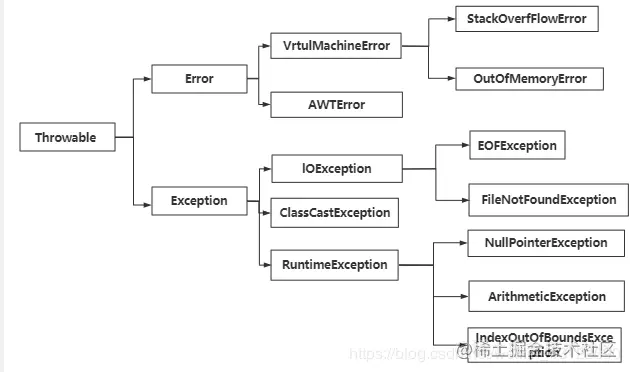

# Java异常机制

作用：使程序中异常处理代码和正常业务代码分离，保证程序代码更加优雅，提高程序健壮性。

## 异常架构

<!-- more -->

### 一 Throwable

1.Throwable是java语言中所有错误和异常的超类。

2.Throwable有两个子类：Error（错误）和Exception（异常）

3.Throwabl包含了其线程创建时线程执行堆栈的快照，提供了printStackTrace()等接口，用于堆栈信息的跟踪

### 二 Error（错误）

定义：程序中无法处理的错误，表示运行程序出现了严重的错误。

特点：一般表示代码运行时JVM出现问题，通常有Virtual MachineError（虚拟机运行错误）、NoClassDefFoundError（类定义错误）等。比如 OutOfMemoryError：内存不足错误；StackOverflowError：栈溢出错误。此类错误发生时，JVM 将终止线程。

这些错误是不受检异常，非代码错误。因此在发生此类错误时，应用程序不应该去处理此类异常。按照java惯例，我们不应实现任何新的Error子类。

### 三 Exception（异常）

程序本身可以捕获并且可以处理的异常。Exception这种异常又分为两类：运行时异常和编译时异常

#### **运行时异常：**

定义：RuntimeException类及其子类，表示JVM在运行期间可能发生的异常

特点：java编译器不会检查它，无论是否声明throws或者try-catch，都会编译通过；比如NullPointerException空指针异常、ArrayIndexOutBoundException数组下标越界异常、ClassCastException类型转换异常、ArithmeticExecption算术异常。此类异常属于不受检异常。一般由程序错误引起。

RuntimeException异常由java虚拟机自动抛出并自动捕获（即使程序中没有写异常捕获语句运行时也会抛出错误！）

#### 编译时异常：

定义：Exception中除了RuntimeException及其子类以外的异常。

特点：java编译器会检查它。如果程序中出现此类异常比如 ClassNotFoundException（没有找到指定的类异常），IOException（IO流异常），要么通过throws在方法中抛出，要么通过try-catch进行异常捕获处理，否则不能编译通过。该类异常是我们在代码中必须捕获和处理的异常。

### 四 受检异常和非受检异常

受检异常：编译器要求必须处理的异常

非受检异常：编译器不会进行检查并且不要求必须处理的异常

### 五 面试题

#### 1.JVM是如何处理异常的

在一个方法中如果发生异常，这个方法会创建一个异常对象，并转交给JVM。该异常对象包含：异常名称，异常描述以及异常发生时应用程序的状态。创建异常对象并交给JVM的过程叫做抛出异常。可能有一系列的方法调用，最终才进入抛出异常的方法，这一系列方法调用的有序列表叫做调用栈。

JVM会顺着调用栈去查找是否有可以处理异常的代码，如果有，则调用异常处理代码。如果没有找到，JVM就会将该异常转交给默认的异常处理器（默认处理器是JVM的一部分）默认异常处理器会打印出异常信息并终止程序运行。

#### 2.finnal、finnally、finalize的区别

finnal可以修饰类、变量、方法；修饰类，则该类不能被继承；修饰变量，则表示该变量是一个常量，不能被重新赋值；修饰方法，表示该方法不能被重写

finnally一般作用在try-catch代码中，在异常处理的时候，通常代码一定要执行的方法写在finnaly代码块中，通常写在finnally中的代码一定会被执行。一般写关闭资源的代码语句

finalize是一个方法，属于Object类，Object类是所有类的父类，java中允许使用finalize()方法**在垃圾收集器将对象从内存中清除出去之前做必要的清理工作**
