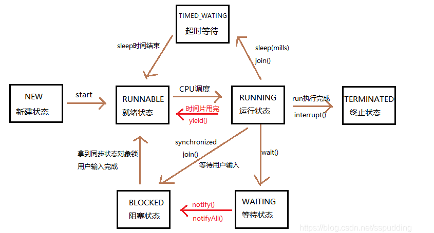

# 线程的生命周期

1.新建状态（**New**）：当程序使用new关键字创建一个线程之后，该线程就处于新建状态，此时jvm为其分配内存，并初始化其成员变量的值

2.就绪状态（**Runnable**）：当线程调用的start()之后，线程就处于继续状态，java虚拟机会为其创建方法调用栈和程序计数器，等待调度运行

3.运行状态（**Running**）：如果处于就绪状态的线程获得了CPU，开始执行run()方法的线程执行体，则该线程处于运行状态

4.阻塞状态（**Blocked**）：当处于运行状态的线程失去所占用的资源后，便进入阻塞状态（获取synchronized锁失败）

4.1.无限等待状态（**Waiting**）：①.调用无参的Object.wait()方法，线程即进入waiting状态

 ②.调用无参的Thread.join()方法，线程即进入waiting状态

 ③.调用LockSupport.park()方法，线程即进入waiting状态

4.2.有限等待状态（**Timed_Waiting**）：①.调用带参的Thread.sleep(long millis)方法

②.获得synchronized锁，调用带超时时间的Object.wait(long millis)方法

③.调用各种带超时时间参数的的方法

5.死亡状态（**Dead**）：线程执行完毕或由于异常退出了run()方法，则该线程的生命周期结束

<!-- more -->

# 线程的状态流转：



join底层方法：调用的就是wait()

```java
public final synchronized void join(long millis) throws InterruptedException {

  long base = System.currentTimeMillis();

  long now = 0;

  if (millis < 0) {

    throw new IllegalArgumentException("timeout value is negative");

  }

  if (millis == 0) {

    while (isAlive()) {

      wait(0);

    }

  } else {

    while (isAlive()) {

      long delay = millis - now;

      if (delay <= 0) {

        break;

      }

      wait(delay);

      now = System.currentTimeMillis() - base;

    }

  }}
```


