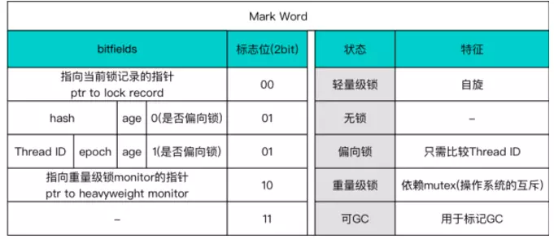
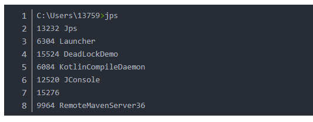
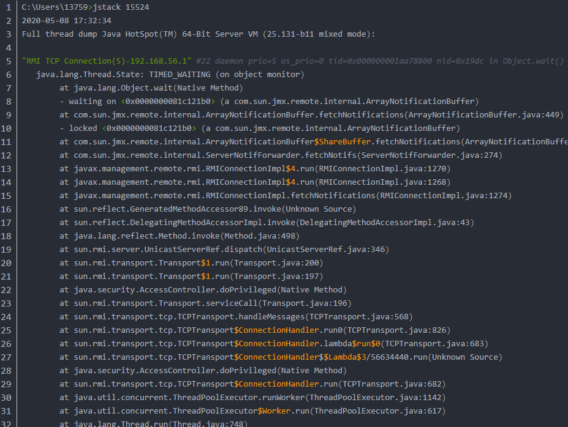

# 锁的分类

- 阻塞性
  - 自旋锁
  - 阻塞锁
- 排他性
  - 共享锁（读锁）
  - 排他锁
- 可重入锁
- 公平性
  - 公平锁
  - 非公平锁
- 中断性
  - 可中断锁
  - 不可中断锁

<!-- more -->

## 重量级锁：

重量级锁会阻塞、唤醒请求加锁的过程

针对场景：多个线程同时竞争一把锁的情况。

java虚拟机采取了自适应自旋，来避免线程在面对非常小的synchronized代码块时扔需要被阻塞唤醒的情况。

## 轻量级锁：

原理：采用CAS操作，将锁对象的标记字段替换为一个指针，指向当前线程栈上的一块空间，存储着锁对象原本的标记字段

针对场景：多个线程在不同时间段申请同一把锁的情况。

## 偏向锁：

只会在第一次请求时采用CAS操作，在对象的标记字段中记录向当前线程的地址，在之后的运行过程中，持有该偏向锁的线程的加锁操作将直接返回。

针对场景：锁仅会被同一线程持有

**锁升级过程**：无锁状态-->偏向锁-->轻量级锁-->重量级锁

### 升级原理：

1.当要保证线程安全而且只有一个线程使用资源，就从无锁状态升级为偏向锁。

2.当偏向锁出现竞争，则升级为轻量级锁

3.轻量级锁出现竞争会自旋等待，如果竞争过大或等待时间过长，就会从轻量级锁升级为重量级锁


#### 锁的状态标识




## 乐观锁和悲观锁

### 悲观锁

在修改数据前先锁定，再修改数据的方式成为“悲观锁”；具有强烈的独占和排他性

1）传统的关系型数据库都是使用这种锁机制，比如行锁，表锁，读锁，写锁都是操作之前上锁

2）java中的synchronized关键字也是悲观锁

### 乐观锁

假设数据一般情况下不会冲突，所以在数据进行更新提交的时候才会正式对数据的冲突与否进行检测（适用于读多写少的场景）

1）CAS实现方式就是乐观锁

2）记录版本号的形式


## 什么是CAS

### 定义

CAS，compare and swap，比较并交换

### 原理

CAS包含三个操作数：内存位置(V)，预期原值（A），新值（B）。如果n内存位置的值与预期原值相匹配，那么处理器会自动将该位置的值更新为新值，否则，处理器不做任何操作

### 通俗理解

“我认为位置V应该包含值A，如果包含该值，则将B放到这个位置；否则不要更换位置，只告诉我这个位置现在的值即可”


## 什么是公平锁和非公平锁

ReentrantLock类有两个构造函数：

```java
// 无参构造函数：默认非公平锁

public ReentrantLock() {
  sync = new NonfairSync();
}

// 根据公平策略参数创建锁

public ReentrantLock(boolean fair){
  sync = fair ? new FairSync() : new NonfairSync();
}
```

如果一个线程没有获得锁，就会进入等待队列，当有线程释放锁时，就需要从等待队列中唤醒一个等待的线程。如果是公平锁，唤醒的策略就是谁等待的时间长，就先唤醒谁；

如果是非公平锁，则不提供这个保证

## ReentrantLock实现公平锁和非公平锁的原理


# 死锁

## 概念

1.概念：一组相互竞争资源的线程互相等待，导致“永久阻塞”的现象

## 产生条件：

1）互斥

2）占有且等待

3）不可抢占

4）循环等待

## 如何避免死锁

四个条件破坏其中一个即可，互斥是无法避免的，因为用锁就是为了互斥，所以破坏其他三个

破坏：1）占有且等待：一次性获取所有资源

​    2）不可抢占：占用部分资源的线程如果无法进一步申请到其他资源，则主动释放已占用的资源

​    3）循环等待：靠申请资源来预防，资源是有顺序的，申请时可以先申请资源号小的，再申请资源号大的

## 死锁的排查：

Java有自带工具JPS、Jstack

- windows win+R -- CMD 输入jps，找到对应的java进程端口号

  

- jstack+端口号查看锁状态和死锁情况

  


参考：

https://www.jianshu.com/p/d2ac26ca6525

https://blog.csdn.net/ls5718/article/details/52563959
