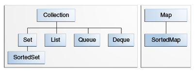
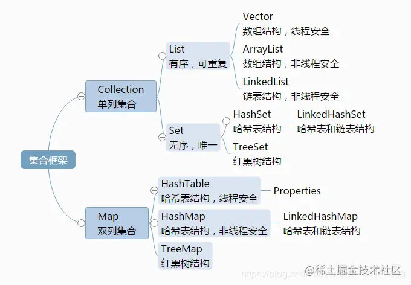

# Collections

## 常用三种集合类：Set、List、Map

### Set

**Sets**表示已**sorted**元素的集合。 集不允许重复的元素。 Set接口不能保证以任何可预测的顺序返回元素。 尽管某些Set实现以natural ordering存储元素并保证该顺序。 

实现`Set`接口的一些有用的类是**EnumSet** ， **CopyOnWriteArraySet**， **EnumSet** ， **HashSet** ， **LinkedHashSet**和**TreeSet** 。

### List

**Lists**表示元素的**ordered**集合。 使用列表，我们可以按元素的整数索引（列表中的位置）访问元素，并在列表中搜索元素。 索引从`0`开始，就像一个数组。 

实现`List`接口的一些有用的类是**ArrayList** ， **CopyOnWriteArrayList** ， **LinkedList** ， **Stack**和**Vector** 。

### Map

**Map**接口使我们能够将数据存储在*key-value pairs* （键应该是不可变的）。 映射不能包含重复的键； 每个键最多可以映射到一个值。

Map界面提供了三个集合视图，这些视图允许将地图的内容视为一组键，一组值或一组键-值映射。 一些地图实现（例如TreeMap类）对其顺序做出特定的保证。 其他的（例如HashMap类）则没有。 

实现`Map`接口的一些有用的类是**ConcurrentHashMap** ， **ConcurrentSkipListMap** ， **EnumMap** ， **HashMap** ， **Hashtable** ， **IdentityHashMap** ， **LinkedHashMap** ， **Properties** ， **TreeMap**和**WeakHashMap** 。

### 非常用集合类

#### Stack

Java **Stack**接口代表经典的堆栈数据结构，其中的元素可以被推入对象的后进先出（LIFO）堆栈。 在堆栈中，我们将元素推到堆栈的顶部，然后再次从堆栈顶部弹出。 

#### Queue

队列数据结构旨在在由使用者线程进行处理之前保存元素（由生产者线程放入）。 除了基本的“收集”操作外，队列还提供其他插入，提取和检查操作。 

队列通常但不一定以FIFO（先进先出）的方式对元素进行排序。 一种这样的例外情况是优先级队列，它根据提供的[Comparator](https://rumenz.com/java-topic/java/collections/java-comparator/index.html)或元素的自然顺序对元素进行排序。

通常，队列不支持阻止插入或检索操作。 阻塞队列实现类实现了**BlockingQueue**接口。

实现`Map`接口的一些有用的类是-ArrayBlockingQueue，ArrayDeque，ConcurrentLinkedDeque，ConcurrentLinkedQueue，DelayQueue，LinkedBlockingDeque，LinkedBlockingQueue，LinkedList，LinkedTransferQueue，PriorityBlockingQueue，PriorityQueue和SynchronousQueue。

#### Deque

一个双端队列（发音为“ ***deck\*** ”），支持在两端插入和删除元素。 当双端队列用作队列时，将导致[FIFO (First-In-First-Out)](https://zh.wikipedia.org/wiki/先进先出（computing_and_electronics）)行为。 当双端队列用作堆栈时，将产生LIFO（后进先出）行为。 

此接口应优先于旧版Stack类使用。 当双端队列用作堆栈时，元素从双端队列的开头被压入并弹出。 

实现此接口的一些常见的已知类是ArrayDeque，ConcurrentLinkedDeque，LinkedBlockingDeque和LinkedList。

## 集合和数组的区别

1.数组是固定长度，集合是可变长度

2.数组可以存储基本类型，也可以存储引用类型；集合只能存储引用类型

3.数组存储的元素必须是同一个数据类型；集合存储的对象可以是不同数据类型

## 三种主要集合类的区别

## equals() and hashCode() Methods

许多集合类提供特定的功能，例如排序的元素，没有重复的元素等。要实现此行为，添加的元素（对象）必须正确实现equals() and hashCode() methods

所有Java包装器类和String类均以其特定实现覆盖这些函数，因此它们在此类集合中的行为正确。 我们还需要确保在用户定义的自定义类中正确覆盖了这些功能。

###### 来源：

https://rumenz.com/java-topic/java-collections/index.html
