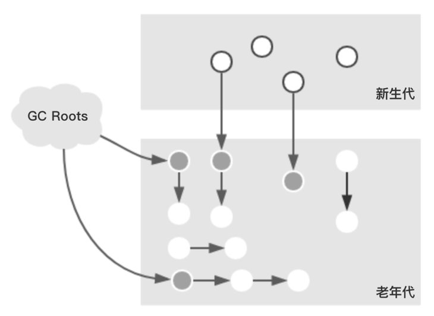
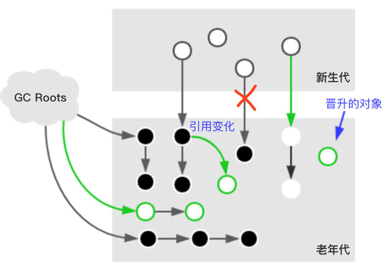
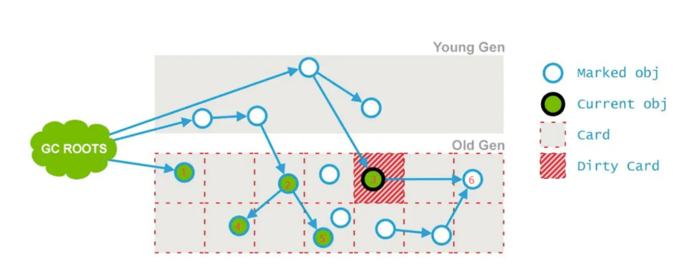
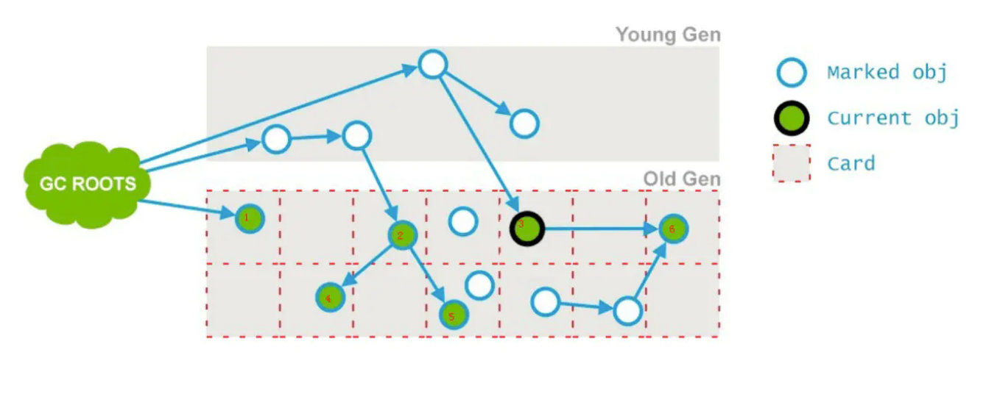

# CMS

ConcurrentMarkSweep（并发标记清除）

`CMS`垃圾收集器从`jdk1.6`中开始应用,是一个老年代垃圾收集器,在`JVM`的发展过程中扮演了重要的历史作用,`jdk1.7`,`jdk1.8`中都可以开启使用。在`jdk9`中已废弃。


<!-- more -->

## 特点

- 追求最短停顿时间

## 标记清除

- 标记清除
- 标记复制
- 标记整理

## 清除步骤

### 初始标记

- SafePoint（安全点/区）
- 标记GC Roots引用对象
  - java虚拟机栈引用对象
  - java native栈引用对象
  - 方法区类静态属性引用的对象
  - 方法区常量引用的对象
  - synchronized锁引用对象
  - 类元
  - JMXBean

> 标记GcRoots直接可达老年对象,新生代存活对象引用的老年代对象.整个过程在JDK1.7中是单线程的在JDK1.8中是多线程的(通过CMSParallelInitialMarkEnabled参数调整)。这个过程会导致STW。
>
> 

### 并发标记

> 从`初始标记`阶段标记过的对象开始,标记其它存活对象,这个阶段垃圾回收线程和应用线程同时运行。由于是同时运行,应用线程还在跑,会导致对象的晋升,对象引用的变化,特殊对象直接分配到老年代。这些受到影响的老年代对象所在的Card会被标记成Dirty,用于重新标记阶段扫描,老年代对象的Card被标记为Dirty的可能原因如下面绿线所示。
>
> 

### 预清理

> 由于上一个阶段是并发执行的未标记的变化对象只是标记成了Dirty对象,还没有处理,`预清理`就是来标记这些`Dirty对象`。如下图:在并发标记阶段3号Card被标志为Dirty。这个阶段是为`重新标记`阶段做准备。
>
> 
>
> 预清理将6号标志为存活对象
>
> 

### 可被终止的预清理

> 这个阶段也是为重新标志阶段做准备,在进入重新标志阶段前,最好能进行一个Minor GC,将年轻代清理一遍, 这样可以清除大部分年轻代的对象(绝大部分年轻代对象朝生夕死),尽量缩短`重新标记`阶段停顿时间,CMS还提供了CMSScavengeBeforeRemark参数，可以在进入重新标记之前强制进行依次Minor gc。

### 重新标记(remark , Stop the world)

`预清理`和`可被终止的预清理`都是为`重新标志`阶段做准备,由于`重新标志`阶段会发生(**STW**),所以要保证尽肯能的停顿时间段,不然就会影响应用程序的用户体验。这个阶段扫描的目标是:年轻代+GC Roots+Dirty老年代对象，这个阶段是多线程的(XX:+CMSParallelRemarkEnabled)。

### 并发清除

> 用户线程被激活，那些未被标志的对象会被清除。’

### 并发重置

> CMS垃圾收集器参数回到初始状态，为下一次垃圾收集做准备。

## 三色标记-清除算法（Tri-Color Mark Sweep）

JVM虚拟机在进行垃圾回收时，把从GC ROOTS开始遍历的对象标记为黑、白、灰三种颜色，但实际上，三色标记和颜色没有任何关系，只与一次扫描状态相关。

- 白色代表未扫描的节点，需要 GC 的对象；
- 黑色代表该节点的子节点也已经被扫描完，**确定**不需要 GC 的对象
- 灰色代表代表已扫描完的节点，该节点的子节点没有被扫描。可能不需要 GC 的对象，但是还未完成标记的任务，也可以认为是增量任务。

在三色标记-清除算法中，一开始所有对象都染成白色。初始化完成后，会启动标记程序。在标记的过程中，是可以暂停标记程序执行 Mutation。

算法需要维护 3 个集合，白色集合、黑色集合、灰色集合。3 个集合是互斥的，对象只能在一个集合中。

- 执行之初，所有对象都放入白色集合
- 第一次执行，算法将 Root 集合能直接引用的对象加入灰色集合
- 接下来算法会不断从灰色集合中取出元素进行标记

### 标记的过程主要分为 3 个步骤

1. 如果对象在白色集合中，那么先将对象放入灰色集合；
2. 然后遍历节点的所有的引用对象，并递归所有引用对象；
3. 当一个对象的所有引用对象都在灰色集合中，就把这个节点放入为黑色集合。

这是一个 DFS 的过程。如果多个线程对不同的 Root Object 并发执行这个算法，我们需要保证 3 个集合都是线程安全的，可以考虑利用 ConcurrentSet（这样性能更好），或者对临界区上锁。并发执行这个算法的时候，如果发现一个灰色节点说明其他线程正在处理这个节点，就忽略这个节点。这样，就解决了标记程序可以并发执行的问题。

当标记算法执行完成的时候，所有不需要 GC 的元素都会涂黑

标记算法完成后，白色集合内就是需要回收的对象。

以上，是类似双色标记-清除算法的全量 GC 程序，我们从 Root 集合开始遍历，完成了对所有元素的标记（将它们放入对应的集合）。

接下来我们来考虑增加 GC（Incremental GC）的实现。首先对用户的修改进行分类，有这样 3 类修改（Mutation）需要考虑：

1. 创建新对象
2. 删除已有对象
3. 调整已有引用

如果用户程序创建了新对象，可以考虑把新对象直接标记为灰色。虽然，也可以考虑标记为黑色，但是标记为灰色可以让 GC 意识到新增了未完成的任务。比如用户创建了新对象之后，新对象引用了之前删除的对象，就需要重新标记创建的部分。

如果用户删除了已有的对象，通常做法是等待下一次全量 Mark 算法处理。下图中我们删除了 Root Object 到 A 的引用，这个时候如果把 A 标记成白色，那么还需要判断是否还有其他路径引用到 A，而且 B,C 节点的颜色也需要重新计算。关键的问题是，虽然可以实现一个基于 A 的 DFS 去解决这个问题，但实际情况是我们并不着急解决这个问题，因为内存空间往往是有富余的。


## CMS收集器中两个致命的问题

### `CMS`是一个很好的并发垃圾收集器,但是使用过程中会产生两个重要的问题。

- promotion failed 晋升失败

  - 黑色标记点 建立新的引用关系

  - 白色节点被灰色节点引用，中途与灰色节点断开，直接被黑色节点引用，黑色不扫描，无法获取新引用

- concurrent mode failure 收集器无法处理浮动垃圾

  - 浮动垃圾：回收时黑色对象已断开引用，但此时已为黑色标记不进行回收

### promotion failed 晋升失败原因

> 该问题发生在`Minor GC`过程中,`Survivor Space`放不下转移的对象,老年代也放不下(promotion failed发生的时候老年代CMS还没有机会进行回收,又放不下转移到老年代的对象,下一步就会产生`concurrent mode fialure`,发生STW降级为Serial Old)
>
> 即使老年代有足够的空间,但是仍然可能导致分配失败,因为没有足够连续的空间,从而触发`Concurrent mode Failure`,会发生`SWT`的`FullGC`。`FullGC`相比于`CMS`这种并发模式的`GC`需要更长的停顿时间才能完成垃圾回收工作。这会导致严重的停顿服务不可用问题
>
> 下面是一条`promotion failed`失败的日志
>
> ```bash
> 106.641: [GC 106.641: [ParNew (promotion failed): 14784K->14784K(14784K), 0.0370328 secs]106.678: [CMS106.715: [CMS-concurrent-mark: 0.065/0.103 secs] [Times: user=0.17 sys=0.00, real=0.11 secs]
> 
> (concurrent mode failure): 41568K->27787K(49152K), 0.2128504 secs] 52402K->27787K(63936K), [CMS Perm : 2086K->2086K(12288K)], 0.2499776 secs] [Times: user=0.28 sys=0.00, real=0.25 secs]
> ```

#### 解决方案

- CMS：**Incremental Update**（**增量更新**）

  该算法从结果入手，判断扫描完结时，是否有白色对象被黑色对象引用，如果被引用，则通过write barrier 写屏障技术，把黑色对象重新标记为灰色，然后重新扫描

- G1：**SATB 算法**（**原始快照**）

  1.该算法从源头入手，GC开始之前拍摄快照，设定所有存在引用的对象都是存活的；

  2.GC扫描完成之后再次拍摄快照，将新引用的存活对象标记。然后将快照叠加。

### concurrent mode failure产生的原因

> concurrent mode failure`是`CMS`特有的错误,`CMS`的垃圾清理线程和用户线程是并行进行的. 老年代正在清理,从年轻代晋升了新对象，或者分配的大对象在新生代放不下,直接在老年代分配内存,这时老年代也放不下,则会抛出`concurrent mode failure
>
> 需要stop-the-wold 降级为GC-Serail Old

### concurrent mode failure的影响

> 老年代的垃圾收集器从`CMS`退化成`Serial Old`,所有用户线程被暂停,停顿时间变长。

### 解决方案

#### CMS触发太晚

> `-XX:CMSInitiatingOccupancyFraction=N` 是指设定CMS在对内存占用率达到N%的时候开始GC(因为CMS会有浮动垃圾,所以一般都较早启动GC);

- 将:`-XX:CMSInitiatingOccupancyFraction=N`调小

#### 空间碎片太多

> 开启空间碎片整理,并将空间碎片整理周期设置在合理范围,-`XX:CMSFullGCsBeforeCompaction`作用：设置在执行多少次Full GC后对内存空间进行压缩整理。

- -XX:+UseCMSCompactAtFullCollection （空间碎片整理）
- -XX:CMSFullGCsBeforeCompaction=n

#### 垃圾产生太快

- 晋升阈值太小
- Survivor空间过小
- Eden区过小,导致晋升速率过快
- 存在大对象


## 使用CMS垃圾收集器要注意的问题

### `重新标记`停顿时间过长

> 80%的时间花在`重新标志`阶段，如果发现`重新标志`阶段停顿时间过长,可尝试添加`-XX:+CMSScavengeBeforeRemark`,在`重新标志`之前做一次`Minor GC`,目的是减少对老年代对象的无效引用，降低`重新标志`的开销。

### 内存碎片问题

> CMS是基于标记-清除算法的,CMS只会删除垃圾对象，不会对内存空间做压缩，会造成内存碎片。我们需要用`-XX:CMSFullGCsBeforeCompaction=n`参数来调整，含义是在上一次CMS并发执行过后,还要执行多少次`Full GC`才做内存压缩.
>
> `CMS`垃圾收集器在回收老年代时,采用的是标记清理(Mark-Sweep)算法,它在垃圾回收时并不会压缩堆,时间久了,导致老年代的碎片化问题越来越严重,直到发生单线程的`Mark-Sweep Compact GC`即`FullGC`,会完全`STW`。如果堆比较大并且老年代占的空间比较大,`STW`的时间会持续几秒,十几秒,几十秒。对于应用程序来说就是长时间的停顿,这对于互联网应用的影响是很大的。

### concurrent mode failure

> 在CMS GC过程中由于应用程序也在跑,当年轻代满了,执行了`Minor GC`这时候,需要将存活对象放入老年代,而此时老年代空间也不足,这时CMS还没有机会回收老年代。可以设置以下两个参数

- -XX:CMSInitiatingOccupancyFraction=75

> CMS对内存的占用率达到75%将启动GC,默认为92%,太高将导致`promotion failed`

- -XX:+UseCMSInitiatingOccupancyOnly

> 如果没有设置`UseCMSInitiatingOccupancyOnly`，只设置了`CMSInitiatingOccupancyFraction`那么JVM只在第一次使用,后续会进行自动调整。
>
> 为什么要设置以上两个参数，在垃圾收集阶段,用户线程还在运行,所以必须要留够空间让用户线程运行。CMS前五个阶段都是标记存活对象的，除了”初始标记”和”重新标记”阶段会stop the word ，其它三个阶段都是与用户线程一起跑的，就会出现这样的情况gc线程正在标记存活对象，用户线程同时向老年代提升新的对象，清理工作还没有开始，old gen已经没有空间容纳更多对象了，这时候就会导致concurrent mode failure， 然后就会使用串行收集器回收老年代的垃圾，导致停顿的时间非常长。
> CMSInitiatingOccupancyFraction参数要设置一个合理的值，设置大了，会增加concurrent mode failure发生的频率，设置的小了，又会增加CMS频率，所以要根据应用的运行情况来选取一个合理的值。如果发现这两个参数设置大了会导致full gc，设置小了会导致频繁的CMS GC，说明你的老年代空间过小，应该增加老年代空间的大小了。

### promotion failed

> 在进行Minor GC时,Survivor space放不下,对象只能放入老年代,而此时老年代也放不下,大多数情况是老年代内存碎片太多，导致没有连续的空间存放对象。

### 过早的晋升和晋升失败

> 发生Minor GC时,如果对象过大(Survivor Space存放不下)基本上会放到老年代,这种现象被称为对象过早晋升,这将导致老年代被中短期对象增张，肯能导致严重的性能问题。如果老年代也满了，会触发Full GC,这将会导致遍历整个堆,晋升失败。

#### 解决方案

- 如果是因为内存碎片导致的大对象提升失败，cms需要进行空间整理压缩；
- 如果是因为提升过快导致的，说明Survivor 空闲空间不足，那么可以尝试调大 Survivor；
- 如果是因为老年代空间不够导致的，尝试将CMS触发的阈值调低。


## 收集器停顿案例

### 分析`CMS`日志

> 启动jvm的时候，增加参数-XX:+PrintGCDetails 和 -XX:+PrintGCTimeStamps可以打印出CMS GC的详细日志。-XX:+PrintHeapAtGC 在进行GC的前后打印出堆的信息,-Xloggc:../logs/gc.log 日志文件的输出路径。
>
> ```bash
> -XX:+PrintGCDetails -XX:+PrintHeapAtGC -XX:+PrintGCTimeStamps -XX:+PrintGCDateStamps and -XX:+PrintGCApplicationStoppedTime -XX:PrintFLSStatistics=2
> ```

```bash
{Heap before GC invocations=7430 (full 24):
parnew generation total 134400K, used 121348K[0x53000000, 0x5c600000, 0x5c600000)
eden space 115200K, 99% used [0x53000000, 0x5a07e738, 0x5a080000)
from space 19200K, 32% used [0x5a080000, 0x5a682cc0, 0x5b340000)
to space 19200K, 0% used [0x5b340000, 0x5b340000, 0x5c600000)
concurrent mark-sweep generation total 2099200K, used 1694466K [0x5c600000, 0xdc800000, 0xdc800000)
concurrent-mark-sweep perm gen total 409600K, used 186942K [0xdc800000, 0xf5800000, 0xfbc00000)
10628.167: [GC Before GC:
Statistics for BinaryTreeDictionary:
------------------------------------
Total Free Space: 103224160
Max Chunk Size: 5486
Number of Blocks: 57345
Av. Block Size: 1800
Tree Height: 36 <---- High fragmentation
Statistics for IndexedFreeLists:
--------------------------------
Total Free Space: 371324
Max Chunk Size: 254
Number of Blocks: 8591 <---- High fragmentation
Av. Block Size: 43
free=103595484
frag=1.0000 <---- High fragmentation
Before GC:
Statistics for BinaryTreeDictionary:
------------------------------------
Total Free Space: 0
Max Chunk Size: 0
Number of Blocks: 0
Tree Height: 0
Statistics for IndexedFreeLists:
--------------------------------
Total Free Space: 0
Max Chunk Size: 0
Number of Blocks: 0
free=0 frag=0.0000
10628.168: [ParNew (promotion failed) Desired survivor size 9830400 bytes, new threshold 1 (max 1)
- age 1: 4770440 bytes, 4770440 total: 121348K->122157K(134400K), 0.4263254secs]
10628,594: [CMS10630.887: [CMS-concurrent-mark: 7.286/8.682 secs] [Times: user=14.81, sys=0.34, real=8.68 secs]
(concurrent mode failure):1698044K->625427K(2099200K), 17.1365396 secs]
1815815K->625427K(2233600K), [CMS Perm : 186942K->180711K(409600K)]
After GC:
Statistics for BinaryTreeDictionary:
------------------------------------
Total Free Space: 377269492
Max Chunk Size:
377269492
Number of Blocks: 1 <---- No fragmentation
Av. Block Size: 377269492
Tree Height: 1 <---- No fragmentation
Statistics for IndexedFreeLists:
--------------------------------
Total Free Space: 0
Max Chunk Size: 0
Number of Blocks: 0
free=377269492
frag=0.0000 <---- No fragmentation
After GC:
Statistics for BinaryTreeDictionary:
------------------------------------
Total Free Space: 0
Max Chunk Size: 0
Number of Blocks: 0
Tree Height: 0
Statistics for IndexedFreeLists:
--------------------------------
Total Free Space: 0
Max Chunk Size: 0
Number of Blocks: 0
free=0 frag=0.0000
, 17.5645589 secs] [Times: user=17.82 sys=0.06, real=17.57 secs]
Heap after GC invocations=7431 (full 25):
parnew generation total 134400K, used 0K [0x53000000, 0x5c600000, 0x5c600000)
eden space 115200K, 0% used [0x53000000, 0x53000000, 0x5a080000)
from space 19200K, 0% used [0x5b340000, 0x5b340000, 0x5c600000)
to space 19200K, 0% used [0x5a080000, 0x5a080000, 0x5b340000)
concurrent mark-sweep generation total 2099200K, used 625427K [0x5c600000, 0xdc800000, 0xdc800000)
concurrent-mark-sweep perm gen total 409600K, used 180711K [0xdc800000, 0xf5800000, 0xfbc00000)
}
Total time for which application threads were stopped: 17.5730653 seconds
```

> 由于碎片率非常高，从而导致promotion failure，然后发生concurrent mode failure，触发的FullGC总计花了17.1365396秒才完成。

### 操作系统内存不够,使用了`swap`,导致`CMS`长时间停顿

> 操作系统使用了`swap`,可能导致GC停顿时间更长，这些停顿可能是几秒，甚至几十秒级别。
>
> 系统配置了允许使用swap空间，操作系统可能把JVM进程的非活动内存页移到swap空间，从而释放内存给当前活动进程（可能是操作系统上其他进程，取决于系统调度）。Swapping由于需要访问磁盘，所以相比物理内存，它的速度慢的令人发指。所以，如果在GC的时候，系统正好需要执行Swapping

```bash
{Heap before GC invocations=132 (full 0):par new generation total 2696384K, used 2696384K [0xfffffffc20010000, 0xfffffffce0010000, 0xfffffffce0010000)eden space 2247040K, 100% used [0xfffffffc20010000, 0xfffffffca9270000, 0xfffffffca9270000)from space 449344K, 100% used [0xfffffffca9270000, 0xfffffffcc4940000, 0xfffffffcc4940000)to space 449344K, 0% used [0xfffffffcc4940000, 0xfffffffcc4940000, 0xfffffffce0010000)concurrent mark-sweep generation total 9437184K, used 1860619K [0xfffffffce0010000, 0xffffffff20010000, 0xffffffff20010000)concurrent-mark-sweep perm gen total 1310720K, used 511451K [0xffffffff20010000, 0xffffffff70010000, 0xffffffff70010000)2020-07-17T03:58:06.601-0700: 51522.120: [GC Before GC: :2696384K->449344K(2696384K), 29.4779282 secs] 4557003K->2326821K(12133568K) ,29.4795222 secs] [Times: user=915.56, sys=6.35, real=29.48 secs]
```

> 最后一行[Times: user=915.56, sys=6.35, real=29.48 secs]中real就是YGC时应用真实的停顿时间。

### `YGC`时 vmstat命令输出

```bash
r b w swap free re mf pi po fr de sr s0 s1 s2 s3 in sy cs us sy id0 0 0 77611960 94847600 55 266 0 0 0 0 0 0 0 0 0 3041 2644 2431 44 8 480 0 0 76968296 94828816 79 324 0 18 18 0 0 0 0 1 0 3009 3642 2519 59 13 281 0 0 77316456 94816000 389 2848 0 7 7 0 0 0 0 2 0 40062 78231 61451 42 6 532 0 0 77577552 94798520 115 591 0 13 13 0 0 13 12 1 0 4991 8104 5413 2 0 98
```

> `YGC`总共花了29.48才完成,从上面看出系统在此期间使用了600多Mb的`swap`分区,这就意味着，在GC的时候，内存中的一些页被移到了swap空间，这个内存页不一定属于JVM进程，可能是其他操作系统上的其他进程。
>
> 操作系统上可用物理内容不足以运行系统上所有的进程，解决办法就是尽可能运行更少的进程，增加RAM从而提升系统的物理内存。在这个例子中，Old区有9G，但是只使用了1.8G（mark-sweep generation total 9437184K, used 1860619K）。我们可以适当的降低Old区的大小以及整个堆的大小，从而减少内存压力，最小化系统上的应用发生swapping的可能。

### 堆空间不足

> 如果应用程序需要的堆内存比我们设定的`Xms`大,也会导致频繁的`GC`,严重的情况会导致`OOM`。由于堆空间不足,对象分配失败,JVM就要调用`GC`尝试回收已经分配的空间,但是`GC`不能释放更多的内存空间,又导致下一次`GC`。
>
> 应用运行时，频繁的FullGC会引起长时间停顿，在下面这个例子中，Perm空间(永久代)几乎是满的，并且在Perm区尝试分配内存也都失败了，从而触发FullGC：
>
> 永久代：这个区域会存储包括类定义、结构、字段、方法（数据及代码）以及常量在内的类相关数据。它可以通过（以下两个是非堆区配置参数）-XX:PermSize及-XX:MaxPermSize来进行调节。若永久代(Perm Gen)空间用完，会导致java.lang.OutOfMemoryError: PermGenspace的异常。而且从JDK8开始，永久代被元空间所取代。

```bash
166687.013: [Full GC [PSYoungGen:126501K->0K(922048K)] [PSOldGen: 2063794K->1598637K(2097152K)]2190295K->1598637K(3019200K) [PSPermGen: 165840K->164249K(166016K)],6.8204928 secs] [Times: user=6.80 sys=0.02, real=6.81 secs]166699.015: [Full GC [PSYoungGen:125518K->0K(922048K)] [PSOldGen: 1763798K->1583621K(2097152K)]1889316K->1583621K(3019200K) [PSPermGen: 165868K->164849K(166016K)],4.8204928 secs] [Times: user=4.80 sys=0.02, real=4.81 secs]
```

> 如果老年代空间不足时,也会导致频繁的`FullGC`,解决方案就是扩大`老年代`和`永久代`的空间。

### 程序中调用了`System.gc`

> System.gc调用，应用中的一些类里，或者第三方模块中调用System.gc调用从而触发STW的FullGC，也可能会引起非常长时间的停顿。如下GC日志所示，Full GC后面的（System）表示它是由调用System.GC触发的FullGC，并且耗时5.75秒：

```bash
164638.058: [Full GC (System) [PSYoungGen: 22789K->0K(992448K)][PSOldGen: 1645508K->1666990K(2097152K)] 1668298K->1666990K(3089600K)[PSPermGen: 164914K->164914K(166720K)], 5.7499132 secs] [Times: user=5.69, sys=0.06, real=5.75 secs]
```

> 如果你要关闭通过调用`System.gc()`触发`FullGC`，配置JVM参数 -`XX:+DisableExplicitGC`即可。


## 常见面试题

### 谈谈对CMS的认知？

> CMS(concurrent mark sweep)在jdk1.5中已经开始使用了,2004年9月30日,JDK1.5发布。CMS设计的目标就是获取最低停顿时间(stop the world停顿时间),它是基于`标记-清除`算法实现的。常用的场景是互联网网站(对服务响应要求较高),它是一个老年代垃圾收集器,可以和`Serial`收集器,`Parallel New`收集器配合使用。当并行模式(concurrent mode failure)失败时CMS会退化成`Serial Old`.

### CMS收集器的工作流程(步骤)是什么样的?

> 主要四个阶段

- 初始标记:只标记和GC Roots能直连的对象,速度快,会发生(stop the world)
- 并发标记:和应用线程并发执行,遍历`初始标记`阶段标记过的对象,标记这些对象的可达对象。
- 重新标记:由于`并发标记`是和应用线程是并发执行的,所以有些标记过的对象发生了变化。这个过程比`初始标记`用时长,但是比`并发标记`阶段用时短。会发生(stop the world)
- 并发清除:和应用线程一起运行。基于标记对象,直接清理对象。

### CMS的缺点?

#### 垃圾碎片问题

- 原因:由于CMS采用的是`标记-清除`算法,所以不可避免会有内存碎片问题。
- 解决:使用`-XX:+CMSFullGCsBeforeCompaction=n`,意思是在上次`CMS`并发`GC`执行过后,到底还要做多少`Full GC`才做压缩。默认是0,也就是说每次`CMS GC`顶不住了转入`Full GC`时都要压缩。

#### 并发模式失败(concurrent mode failure)

- 原因:CMS垃圾清理线程和应用线程是并发执行的,如果在清理过程中老年代空间不足不能容纳新对象。
- 解决:使用`-XX:+UseCMSInitiatingOccupancyOnly`和`-XX:CMSInitiatingOccupancyFraction=60`,指定CMS对内存的占用率到60%时开始GC。

#### 重新标记阶段时间过长

- 解决:使用`-XX:+CMSScavengeBeforeRemark`,在执行`重新标记`之前,先做一次`Young GC`,目的在于较少年轻代对老年代的无效引用,降低`重新标记`的开销。

### 为什么配置了`CMS GC`,却触发了`Full GC`?

- 大对象分配时,年轻代放不下,直接去老年代,结果老年代也放不下。
- 内存碎片问题(使用`标记-清除`算法的缺点)
- `CMS GC`失败(concurrent mode failure导致)
- jmap -histo 人为执行了命令


## CMS总结

- CMS只收集老年代,响应速度优先。

- 重新标记会STW,停顿时间较长,所以在这之前进行一次Minor GC,会减少很多对老年代对象的无效引用。

- 内存碎片问题导致的Full GC,请使用`-XX:CMSFullGCsBeforeCompaction=n`,有规律对内存进行整理减少内存碎片。

- JDK1.7,JDK1.8设置CMS垃圾收集器`XX:+UseConcMarkSweepGC`

- `promotion failed – concurrent mode failure`

  >Minor GC后， Survivor空间容纳不了剩余对象，将要放入老年代，老年代有碎片或者不能容纳这些对象，就产生了concurrent mode failure, 然后进行stop-the-world的Serial Old收集器。
  >
  >解决办法：-XX:UseCMSCompactAtFullCollection -XX:CMSFullGCBeforeCompaction=5 或者调大新生代或者Survivor空间

- `concurrent mode failure`

  >CMS是和业务线程并发运行的，在执行CMS的过程中有业务对象需要在老年代直接分配，例如大对象，但是老年代没有足够的空间来分配，所以导致concurrent mode failure, 然后需要进行stop-the-world的Serial Old收集器。
  >
  >解决办法：+XX:CMSInitiatingOccupancyFraction 触发CMS收集器的内存比例,调大老年带的空间。+XX:CMSMaxAbortablePrecleanTime,+XX:CMSFullGCsBeforeCompaction=5,5次Full GC 后压缩old generation一次

### 几个重要的CMS参数

- `-XX:CMSFullGCsBeforeCompaction=n` `Full GC` n 次后进行内存压缩整理
- `-XX:CMSInitiatingOccupancyFraction=70` `-XX:+UseCMSInitiatingOccupancyOnly` 内存占用70%将触发`CMS GC`
- `-XX:+CMSScavengeBeforeRemark` CMS GC前执行一次Minor GC


###### 来源：

https://www.bilibili.com/video/BV1BL411H7ZX


https://rumenz.com/rumenbiji/cms-garbage-collector.html

https://rumenz.com/rumenbiji/cms-fatal-error.html

https://rumenz.com/rumenbiji/cms-stop-case.html


https://learn.lianglianglee.com/专栏/重学操作系统-完/28%20%20内存回收下篇：三色标记-清除算法是怎么回事？.md

