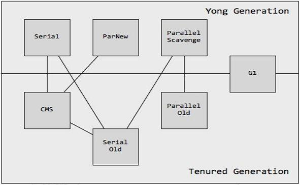
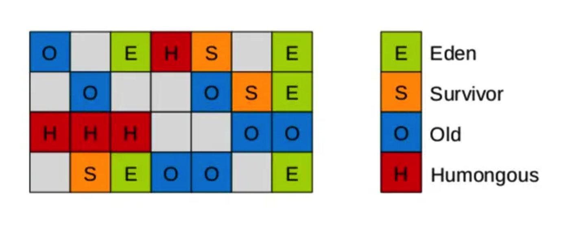

# G1

## G1垃圾收集器简介

>Garbage First(简称:G1)收集器是垃圾收集器技术发展历史上的一个里程碑,它开创了收集器面向局部收集的设计思路和基于Region的内存布局形式.
>
>G1是一款主要面向服务端应用的垃圾收集器,HotSpot开发团队赋予它的期望是未来可以替换掉JDK5中发布的CMS收集器. JDK9发布之日,G1宣布取代了`Parallel Scavenge`加`Parallel Old`的组合,成为服务端模式下默认的垃圾收集器,而CMS则被声明为(Deprecate)使用的收集器.
>
>G1收集器兼顾`低延迟`和`高吞吐`在服务端运行,HotSpot团队期望取代`CMS`收集器。也就是在满足停顿时间的情况下获取最大的吞度量。有两种收集模式`Young GC`和Mixed GC。G1收集器将堆内存划分成大小相等的`Region`,新生代,老年代也就成了逻辑概念。整体上采用的是`标记-整理`算法,局部采用了`复制算法`。
>
>G1实现了可控停顿时间的垃圾收集器,通过`-XX:MaxGCPauseMillis`参数进行设置，默认是200ms。
>
>G1是jdk1.9的默认垃圾收集器,-XX:+UseG1GC开启

<!-- more -->

## Region简介

> G1开创了基于Region的堆内存布局,虽然G1也遵循分代思想,但是堆内存布局和其它垃圾收集的内存布局有着巨大的变化. G1垃圾收集器不再坚持固定大小分代分区,而是把连续的堆内存分成大小一样的独立区域(Region),每一个Region可以根据需要扮演`新生代(Eden)`,`Survivor空间`,`老年代`。 G1垃圾收集器可以根据扮演不同角色的Region采用不同的策略去处理，这样无论是新创建的对象，还是已经存活了一段时间的对象, 或则经历过很多次垃圾收集但是还存活下来的对象,都会有很好的效果。

## G1中五种不同的Region

`新生代`,`老年代`的`Region`不再是一块连续的空间。当然存放大对象的`Region`必须要连续。

- 新生代(Eden Region)
- 年轻代(Survivor Region)
- 老年代(Old Region)
- 巨型对象(Humongous Region)
- 未分配(Free Region)

## 巨型对象区(Humongous Region)

> Region中有一种特殊的`Humongous Region`,专门用来存储大对象。G1收集器规定只要对象的大小超过了`Region`大小的一般就会被认为是巨型对象 。每个Region的大小可以通过`-XX:G1HeapRegionSize`来调整(1MB-32MB,且为2的N次幂)。G1收集器通常把`Humongous Region`看做老年代的一部分。

### 对象划分的规则

- 对象大小小于一半`Region`,直接存储到标记为Eden的Region
- 对象大小大于一半`Region`但是小于一个`Region`,存储到标记为Humongous的Region中
- 对象大小超过一个`Region大小`,存储到标记为Humongous的多个连续Region中

## GC类型

- youngGC:回收Eden区和Survivor区
- MixedGC:回收所有的新生代和部分老年区
- FullGC:回收整个堆

## Remenbered Set,简称RSet

> 由于分代的内存不连续,导致GC搜索垃圾对象时,需要扫描整个堆。为了解决这个问题,G1为每个Region都维护了一个`Remenbered Set`,用来记录对象的引用情况,当GC发生的时候根据`Remenbered Set`的索引情况去搜索。`Rset`是一个空间换时间的数据结构。有了Rset可以避免对整个堆进行扫描。

### Remenbered Set存储的引用关系类型

- 1.分区内引用
- 2.新生代分区Y1引用新生代分区Y2
- 3.新生代分区Y1引用老年代分区O1
- 4.老年代分区O1引用新生代分区Y1
- 5.老年代分区O1引用老年代分区O2

`youngGC`时,GC Root主要是两类,栈空间和老年代到新生代区分的引用(2,3)关系。
`MixedGC`时,由于只收集老年代区,所以老年代分区引用(4,5)关系将被使用。

## G1垃圾收集器执行步骤

### 初始标记(stop the world)

> 比较`GC Roots`直接引用的对象同时标记,同时标记`GC Roots`对象所在的`Region`称为`Root Region`
>
> 标记GC Roots能够直接关联的对象(Root Region),修改`TAMS`指针的值,使的下一阶段用户线程并发运行时,能在正确的Region中分配对象。
>
> 需要停顿用户线程,但耗时很短,且借助`Minor GC`时同步完成。

- TAMS：Top at Mark Start，Region 中的指针，用于并发标记时为对象分配内存空间。

### 根分区扫描

> 拿到初始标记的`Root Region`,扫描整个堆的所有`Region`的`Rset`看是否有`Root Region`,并标记`Region`

### 并发标记

> 遍历上一步标记过的Region对堆中对象进行可达性分析,递归扫描整个堆里的对象图,找到要回收的对象。耗时较长,可以和用户线程并行。
>
> 耗时较长,可遇用户线程并行,当对象扫描完成以后,还要重新处理SATB记录下的在并发时有引用变动的对象。

### 重新标记(stop the world)

> 由于`并发标记`是和应用线程并发执行的,所以不可避免的有些对象会发生变化,G1 GC清空 SATB缓冲区，跟踪未被访问的存活对象，并执行引用处理。
>
> 短暂的暂停用户线程,用于处理`并发标记`阶段遗留下来最后少量的SATB记录。

### 筛选回收(stop the world)

> 负责更新Region的统计数据,对各个Region的回收价值进行排序,根据用户所期待的停顿时间,来制定回收计划,可以自由选择任意组合的`Region`进行回收,然后将需要回收的Region中的对象复制到空的`Region`,再清理掉整个旧的`Region`.这里涉及移动存活对象,所以也要暂停用户线程,由多条收集器线程并行完成。
>
> 评估每个`Region`的垃圾量,选取回收效果最好的若干`Region`收集(取决于-XX:MaxGCPauseMillis设置值,默认是200ms)。在规定停顿时间内,获取最大的吞吐量。

## G1提高效率的有哪些点

- 使用Rset降低了扫描范围
- 重新标记阶段使用SATB速度比CMS的增量更快
- 清理过程中,选择部分回收价值高的`Region`进行清理(MixedGC),而不是所有的`Region`提高了清理效率。

## G1和CMS的区别

- G1采用`标记-整理`算法,CMS采用`标记-清除`算法,所以G1不会产生很多垃圾碎片.
- G1的STW(stop the world)可控,可以使用`-XX:MaxGCPauseMillis`设置默认200ms
- G1的`Young GC`模式可以工作在`年轻代`,而单独的`CMS`只能工作在`老年代`.

## G1的应用场景

- 服务端多核CPU,JVM占用较大的应用(至少大于4G)。
- 应用在运行过程中产生大量的碎片,需要经常压缩。
- 想要更可控,可预期的停顿时间;防止高并发下应用雪崩现象。

###### 来源：

https://rumenz.com/rumenbiji/g1-garbage-collector.html

https://rumenz.com/rumenbiji/g1-interview.html
