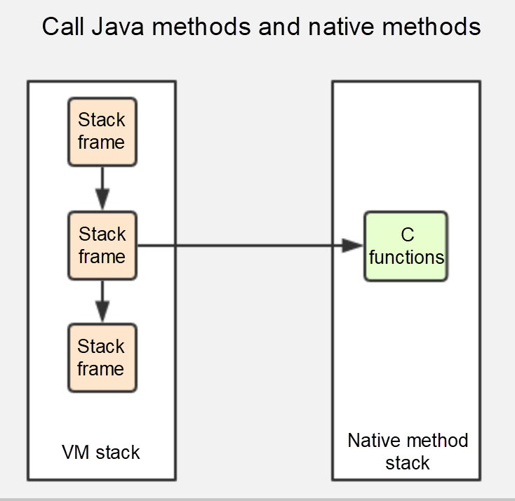

# GC Roots

In Java, there are special objects called **Garbage Collection Roots** (GC roots). They serve as a root objects for Garbage Collection marking mechanism (see picture).

Classloaders, effectively - via other GC roots.

## `GC Root`对象

- java虚拟机栈引用对象

- 方法区类的静态成员引用的对象**static variables**

- 方法区常量引用的对象

- java native方法栈中JNI引用对象**JNI references**

  

  >本地方法就是一个 java 调用非 java 代码的接口，该方法并非 Java 实现的，可能由 C 或 Python等其他语言实现的， Java 通过 JNI 来调用本地方法， 而本地方法是以库文件的形式存放的（在 WINDOWS 平台上是 DLL 文件形式，在 UNIX 机器上是 SO 文件形式）。通过调用本地的库文件的内部方法，使 JAVA 可以实现和本地机器的紧密联系，调用系统级的各接口方法
  >
  >当调用 Java 方法时，虚拟机会创建一个栈桢并压入 Java 栈，而当它调用的是本地方法时，虚拟机会保持 Java 栈不变，不会在 Java 栈祯中压入新的祯，虚拟机只是简单地动态连接并直接调用指定的本地方法。

- synchronized锁引用对象

- 类元

- JMXBean

###### 来源：

https://rumenz.com/rumenbiji/what-is-gc-roots.html

https://stackoverflow.com/questions/27186799/what-are-gc-roots-for-classes
