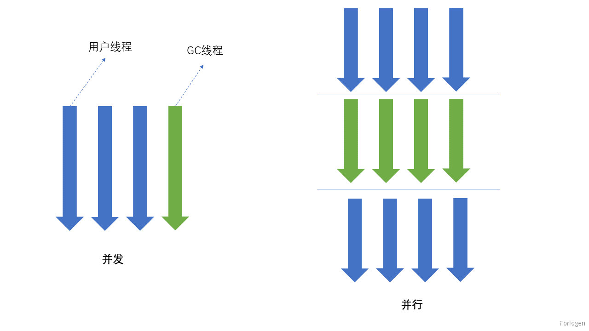

# JVM垃圾回收器概念

## System.gc()

> 默认情况下，如果程序中显式的调用`Sysytem.gc()`或者`Runtime.getRuntime.gc()`可能会触发 Full GC，垃圾收集器会同时新生代和老年代进行垃圾回收操作，尝试释放被丢弃对象占用的内存资源。但是调用`Sysytem.gc()`不一定会发生 Full GC，所以它无法保证对垃圾收集器的调用。

```java
public final class System {
  public static void gc() {
    Runtime.getRuntime().gc();
  }
}

public class Runtime {
  private static Runtime currentRuntime = new Runtime();
  public native void gc();
}
```

> 最终程序调用的是一个本地方法`gc()`，垃圾回收的工作是交给操作系统完成的
>
> Java 中垃圾回收是自动进行的，因此并不推荐通过调用`Sysytem.gc()`来决定 JVM 的 GC 操作。

<!-- more -->

## 内存溢出和内存泄漏

### 内存溢出

> 内存溢出可能出现在堆中，也可能出现在栈和方法区中，但重点关注的区域是堆空间。一般情况下，只有当应用程序消耗内存的速度超过了垃圾回收的速度，程序才可能抛出 OOM 异常。大多数情况下，GC 会进行各个年龄段的垃圾回收，如果分代回收无法满足内存分配需求，此时就会触发 Full GC。
>
> javadoc 中对 OutOfMemoryError 的解释是， 没有空闲内存， 并且垃圾收集器也无法提供更多内存。其中没有空闲内存的原因有：

- Java 虚拟机的堆内存设置不够：例如堆的大小设置不合理、内存泄漏、处理的数据量太大……
- 程序中创建了大量的大对象（Big Object），并且长时间不能被垃圾收集器回收。例如，当不断的往永久代中添加新类型，而 JVM 对永久代回收不积极时，永久代就会出现 OOM；或者使用`intern()`生成的字符串缓存占用了太多的空间，也会导致 OOM
- 对于使用直接内存的元空间来说，当系统内存不够分配时，程序也会抛出 OOM 异常

> 但并不是在任何情况下垃圾收集器都会被触发。比如， 我们去分配一个超大对象， 类似一个超大数组超过堆的最大值， JVM 可以判断出垃圾收集并不能解决这个问题， 所以直接抛出 OutOfMemoryError。

### 内存泄漏

> 内存泄漏（Memory Leak）指只有对象不会再被程序使用到，但垃圾收集器又无法回收它们时，才称为发生了内存泄漏。实际情况中一些操作可能会导致对象的生命周期变得很长甚至导致 OOM，也可以叫做宽泛意义上的 “内存泄漏”。
>
> 尽管内存泄漏并不会立刻引起程序崩溃，但是一旦发生内存泄漏，程序中的可用内存就会被逐步蚕食，直至耗尽所有内存， 最终出现 OutOfMemory 异常，导致程序崩溃。

例如：

- 单例模式：单例的生命周期和应用程序是一样长的，所以单例程序中，如果持有对外部对象的引用的话，那么这个外部对象是不能被回收的，则会导致内存泄漏的产生
- 一些提供 close 的资源未关闭：数据库连接 (data Sourse.getConnection() ) 、 网络连接 (socket) 和 io 连接必须手动 close， 否则是不能被回收的

## STW

> Stop-the-World 简称 STW，它指的是在 GC 操作执行的过程中会产生应用程序的停顿，停顿时整个应用程序线程都会被暂停，没有任何响应。
>
> 例如在可达性分析算法中枚举根节点 (GC Roots) 会导致 STW 现象的发生，此时的分析工作必须在一个能确保一致性的快照中进行一致性指整个分析期间整个执行系统看起来像被冻结在某个时间点上如果出现分析过程中对象引用关系还在不断变化，则分析结果的准确性无法保证。
>
> STW 会出现在每一类的垃圾收集其中，被 STW 中断的应用程序线程会在完成 GC 之后恢复， 但频繁中断会影响用户体验，因此应尽量避免 STW 现象的出现。

## GC 的并发和并行



> 操作系统中的**并发**指的是一个时间段中有几个程序都处于已启动运行到运行完毕之间，且这几个程序都是在同一个处理器上运行。并发不是真正意义上的 “同时进行”， 只是 CPU 把一个时间段划分成几个时间片段 (时间区间) ， 然后在这几个时间区间之间来回切换。只是由于 CPU 处理的速度非常快， 只要时间间隔处理得当，即可让用户感觉是多个应用程序同时在进行。
>
> 当系统有一个以上 CPU 时， 当一个 CPU 执行一个进程时， 另一个 CPU 可以执行另一个进程，两个进程互不抢占 CPU 资源， 可以同时进行， 我们称之为并行 (Parallel) 。因此，并发是一种宏观上的概念，并行是一种微观上的概念。
>
> GC 中的并行指的是多条垃圾收集线程并行工作， 但此时用户线程仍处于等待状态。并发指用户线程与垃圾收集线程同时执行 (但不一定是并行的， 可能会交替执行)，垃圾回收线程在执行时不会停顿用户程序的运行。用户程序在继续运行， 而垃圾收集程序线程运行于另一个 CPU 上。

## 5. 安全点和安全区域

### 安全点

> 安全点（Safe Point）指的是程序可以停下来执行 GC 操作的特定位置。Safe Point 的选择很重要， 如果太少可能导致 GC 等待的时间太长， 如果太频繁可能导致运行时的性能问题。大部分指令的执行时间都非常短暂，通常会根据 “是否具有让程序长时间执行的特征” 为标准。比如：选择一些执行时间较长的指令作为 Safe Point， 如方法调用、循环跳转和异常跳转等。
>
> 一般采用的方式是主动式中断：设置一个中断标志， 各个线程运行到 SafePoint 的时候主动轮询这个标志，如果中断标志为真，则将自己进行中断挂起。

### 安全区域

> 安全区域是指在一段代码片段中，对象的引用关系不会发生变化，在这个区域中的任何位置开始 GC 都是安全的。实际执行时：

- 当线程运行到 Safe Region 的代码时， 首先标识已经进入了 Safe Region，如果这段时间内发生 GC， JVM 会忽略标识为 Safe Region 状态的线程
- 当线程即将离开 Safe Region 时， 会检查 JVM 是否已经完成 GC， 如果完成了， 则继续运行， 否则线程必须等待直到收到可以安全离开 Safe Region 的信号为止

## 引用

> Java 中的引用按照引用的强度可以分为：

- 强引用（**Strong Reference**）：指在程序代码之中普遍存在的引用赋值，即类似 “Object obj=new Object() ” 这种引用关系。无论任何情况下，只要强引用关系还存在，垃圾收集器就永远不会回收掉被引用的对象
- 软引用（**Soft Reference**）：：在系统将要发生内存溢出之前， 将会把这些对象列入回收范围之中进行第二次回收。如果这次回收后还没有足够的内存，才会抛出内存溢出异常
- 弱引用（**Weak Reference**）：：在系统将要发生内存溢出之前， 将会把这些对象列入回收范围之中进行第二次回收。如果这次回收后还没有足够的内存，才会抛出内存溢出异常
- 虚引用（**Phantom Reference**）：：一个对象是否有虚引用的存在， 完全不会对其生存时间构成影响，也无法通过虚引用来获得一个对象的实例。为一个对象设置虚引用关联的唯一目的就是能在这个对象被收集器回收时收到一个系统通知

> 除强引用外， 其他 3 种引用都定义在在 java.lang.ref 包中。

### Java为什么要设计这四种引用

Java的内存分配和内存回收，由JVM去负责，一个对象是否可以被回收，主要看是否有引用指向此对象，即可达性分析。

Java设计这四种引用的主要目的有两个：

1. 可以让程序员通过代码的方式来决定某个对象的生命周期；
2. 有利于垃圾回收。

### 强引用

> 强引用是 Java 程序中最常见的引用类型，同时也是默认的引用类型。当在 Java 语言中使用 new 操作符创建一个新的对象， 并将其赋值给一个变量的时候，这个变量就成为指向该对象的一个强引用。强引用的对象是可触及的，垃圾收集器就永远不会回收掉被引用的对象。相对的，软引用、弱引用和虚引用的对象是软可触及、弱可触及和虚可触及的，在一定条件下， 都是可以被回收的。所以， 强引用是造成 Java 内存泄漏的主要原因之一。
>
> 对于一个普通的对象来说，如果没有其他的引用关系，只要超过了引用的作用域或者显式的将引用赋值为null了，就可以被 GC。
>
> 例如在下面的程序中，str 和 str1 都指向了保存在堆中的 StringBuffer 对象，它们两个都是强引用。

```java
public class StrongReferenceTest {
  public static void main(String[] args) {
    StringBuffer str = new StringBuffer ("Hello, Forlogen");
    StringBuffer str1 = str;
    str = null;
    System.gc();
    try {
      Thread.sleep(3000);
    } catch (InterruptedException e) {
      e.printStackTrace();
    }
    System.out.println(str1);
  }
}
```

> 强引用具备以下特点：

- 强引用可以直接访问目标对象
- 强引用所指向的对象在任何时候都不会被系统回收，虚拟机宁愿抛出 OOM 异常， 也不会回收强引用所指向对象
- 强引用可能导致内存泄漏

### 软引用

> 软引用是用来描述一些还有用、但非必需的对象，只被软引用关联着的对象，在系统将要发生内存溢出异常前，会把这些对象列进回收范围之中进行第二次回收，如果这次回收还没有足够的内存，才会抛出内存溢出异常。
>
> 软引用通常用来实现内存敏感的缓存。比如：高速缓存就有用到软引用。如果还有空闲内存，就可以暂时保留缓存，当内存不足时清理掉，这样就保证了使用缓存的同时，不会耗尽内存。
>
> 垃圾回收器在某个时刻决定回收软可达的对象的时候，会清理软引用，并可选地把引用存放到一个引用队列 (Reference Queue) 。类似弱引用， 只不过 Java 虚拟机会尽量让软引用的存活时间长一些， 迫不得已才清理。

```java
public class SoftReferenceTest {
  public static class User {
    public User(int id, String name) {
      this.id = id;
      this.name = name;
    }
    public int id;
    public String name;
    @Override
    public String toString() {
      return "[id=" + id + ", name=" + name + "] ";
    }
  }
  public static void main(String[] args) {
    //创建对象，建立软引用
    SoftReference<User> userSoftRef = new SoftReference<User>(new User(1, "songhk"));
    //从软引用中重新获得强引用对象
    System.out.println(userSoftRef.get());
    System.gc();
    System.out.println("After GC:");
    //垃圾回收之后获得软引用中的对象
    System.out.println(userSoftRef.get());//由于堆空间内存足够，所有不会回收软引用的可达对象。
    try {
      //让系统认为内存资源紧张、不够
      byte[] b = new byte[1024 * 1024 * 7];
    } catch (Throwable e) {
      e.printStackTrace();
    } finally {
      //再次从软引用中获取数据
      System.out.println(userSoftRef.get());//在报OOM之前，垃圾回收器会回收软引用的可达对象。
    }
  }
}

```

### 弱引用

> 弱引用也是用来描述那些非必需对象，只被弱引用关联的对象只能生存到下一次垃圾收集发生为止。在系统 GC 时，只要发现弱引用，不管系统堆空间使用是否充足，都会回收掉只被弱引用关联的对象。但是，由于垃圾回收器的线程通常优先级很低，因此，并不一定能很快地发现持有弱引用的对象。在这种情况下，弱引用对象可以存在较长的时间。
>
> 弱引用和软引用一样，在构造弱引用时，也可以指定一个引用队列，当弱引用对象被回收时，就会加入指定的引用队列，通过这个队列可以跟踪对象的回收情况。软引用、弱引用都非常适合来保存那些可有可无的缓存数据。如果这么做，当系统内存不足时，这些缓存数据会被回收，不会导致内存溢出。而当内存资源充足时，这些缓存数据又可以存在相当长的时间，从而起到加速系统的作用。

### 虚引用

> 虚引用也称为 “幽灵引用” 或者 “幻影引用”，是所有引用类型中最弱的一个。一个对象是否有虚引用的存在，完全不会决定对象的生命周期。如果一个对象仅持有虚引用，那么它和没有引用几乎是一样的，随时都可能被垃圾回收器回收。它不能单独使用，也无法通过虚引用来获取被引用的对象。当试图通过虚引用的 get() 方法取得对象时， 总是 null。为一个对象设置虚引用关联的唯一目的在于跟踪垃圾回收过程。比如：能在这个对象被收集器回收时收到一个系统通知。
>
> 虚引用必须和引用队列一起使用。虚引用在创建时必须提供一个引用队列作为参数。当垃圾回收器准备回收一个对象时，如果发现它还有虚引用，就会在回收对象后，将这个虚引用加入引用队列，以通知应用程序对象的回收情况。由于虚引用可以跟踪对象的回收时间，因此，也可以将一些资源释放操作放置在虚引用中执行和记录。

### 终结器引用

> 终结器引用用以实现对象的 finalize() 方法， 也可以称为终结器引用。无需手动编码，其内部配合引用队列使用。在 GC 时， 终结器引用入队。由 Finalizer 线程通过终结器引用找到被引用对象并调用它的 finalize() 方法， 第二次 GC 时才能回收被引用对象。


来源：

https://rumenz.com/rumenbiji/jvm-garbage-collection-concept.html

https://www.cnblogs.com/CodeBear/p/12447554.html
