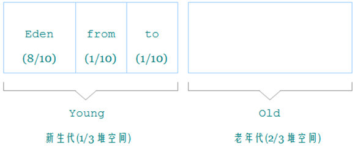

# 思想

枚举根节点，做可达性分析
- 根节点
  类加载器、Thread、虚拟机栈的本地变量表、static 成员、常量引用、本地方法栈的变量等等

# 算法

## 引用计数法

**JVM中没有使用**

在创建对象和将对象赋值给某个变量时，将对象的引用计数+1，在移除对象和某个变量的引用关系时，将对象的运营计数-1，当对象的引用计数变为0时，递归地将该对象引用的子对象的引用计数器减1，并把该对象的内存块加入空闲链表中。在通过增减对象的引用计数器来判别活跃对象和非活跃对象，然后在计数器值为0的时候回收对象，这种做法可以在对象不活跃的时候立即回收它。

- 优点
  - 可以立即回收垃圾。因为每个对象在被引用次数为0的时候，是立即就可以知道的。
  - 没有暂停时间。这个很容易理解，对象的回收根本不需要另外的GC线程专门去做，业务线程自己就搞定了。所以不需要stop the world，当然，在多线程的情况下，必要的同步和互斥操作还是需要的。

- 缺点
  - 在每次赋值操作的时候都要做相当大的计算，尤其这里面还有递归调用。这是比较麻烦的。
  - 一个致命缺陷是循环引用，就是， objA引用了objB，objB也引用了objA，但是除此之外，再没有其他的地方引用这两个对象了，这两个对象的引用计数就都是1。这种情况下，这两个对象是不能被回收的。

<!-- more -->

## 标记清除

当堆中的有效空间被耗尽时,JVM就会停止整个程序(也被称为stop the world),然后开始两项工作.一是:`标记`, 而是:`清除`

作为标记清除的变形，还有一种叫做标记压缩（Mark and Compact）的算法，它不是将被标记的对象清除，而是将它们不断压缩。

### 标记

> 遍历所有GC Roots,将所有GC Roots可达的对象都标记为存活对象.

### 清除

> 遍历堆中所有的对象把没有标记的对象全部清除，然后重新唤醒应用程序.

- 优点

  算法简单

- 缺点

  - 效率低下,需要遍历整个堆.进行GC的时候需要停止应用程序
- 垃圾回收后的内存空间是不连续的,产生碎片，碎片太多会导致提前GC. 为了解决这个问题,JVM不得不维护一个空闲链表,又会导致额外的开销

## 复制收集算法

复制算法使用了两块同等大小的内存空间,每次只用一块,垃圾回收的时候,把存活的对象直接另外一块内存,然后剩余的垃圾对象全部一次性清除.

- 优点

  实现简单，运行高效

- 缺点

  不适用于存活对象较多的场合，如老年代

  空间利用率低

> 现在的虚拟机一般都用复制算法回收新生代,IBM的研究发现,新生代中的对象98%都是朝生夕死,所以并不需要1:1分配对象,而是将内存分为一个大的Eden和两块小的Survivor空间,每次只使用Eden和一块Survivor. 当进行垃圾回收时,将存活对象一次性复制到一块Survivor空间,最后清除掉Eden和使用过的Survivor空间. 
>
> HotSpot虚拟机Eden:Survivor=8:1,也就新生代可用的内存达到90%,只会有10%的浪费.当然98%的对象可被回收只是一般的场景,并没有办法保证每次Survivor都能存放的下存活对象,若Survivor空间不够时,需要依靠老年代进行分配担保.
>
> 

## 标记整理

标记阶段：与“标记-清除”算法一样

整理阶段：将所有的存活对象压缩到内存的一段，之后清理边界外所有的空间

- 优点

  没有内存碎片

  适合用于存活对象较多的场合，如老年代

- 缺点

  整理内存比较耗时

## 分代收集算法

Java堆是JVM管理的最大一块内存空间，主要存放对象实例。

堆被分为两块区域,堆大小=新生代+老年代  （新生代占堆空间的1/3、老年代占堆空间2/3）

Young 区用复制算法
Old 区用标记清除或者标记整理

### 新生代 young

  - 新生代几乎是所有JAVA对象出生的地方，JAVA对象申请的内存和存放都是在这个地方

  - eden、from survivor、to survivor(8:1:1)  

    JVM每次只会使用eden和其中一块survivor来为对象服务，所以无论什么时候，都会有一块survivor空间，因此新生代实际可用空间只有90%

    设置 Survivor 空间的目的是让那些中等寿命的对象尽量在 Minor GC 时被干掉，最终在总体上减少虚拟机的垃圾收集过程 对用户程序的影响。 

  - minor gc -- 指发生在新生代的垃圾回收动作，minor gc非常频繁，使用复制算法快速的回收。

  - 当对象在eden(其中包括一个survivor，假如是from)，当此对象经过一次minor gc后仍然存活，并且能够被另外一块survivor所容纳（这里survivor则是to了），则使用复制算法将这些仍然存活的对象复制到to survior区域中，然后清理掉eden和from survivor区域，并将这些存活的对象年龄+1，以后对象在survivor中每熬过一次gc则增加1，当年龄达到某个值时（默认15，通过设置参数-xx:maxtenuringThreshold来设置），这些对象就会成为老年代。但是当一些较大的对象（需要分配连续的内存空间）则直接进入老年代。

### 老年代old

- major gc -- 指发生在老年代的垃圾回收动作，用的是“标记--整理”算法。

### 为什么不是1个 Survivor 空间

Eden区域清理后，将对象移入Survivor，此刻 Survivor 空间作为对象“出生地”，很容易触发 Minor GC ，不但没能在总体上降低 Minor GC 的频率，还会把 gc 的时间间隔搞得很不平均。

### 为什么2个 Survivor 空间可以达到要求？ 

无论 Eden 和 Survivor 的比例怎么设置，在只有一个 Survivor 的情况下，总体上看在新生代空间满一半的时候就会触发一次 Minor GC 。

Eden : From Survivor : To Survivor 空间大小设成 8 : 1 : 1 ，对象总是在 Eden 区出生， From Survivor 保存当前的幸存对象， To Survivor 为空。一次 gc 发生后： 
​    1）Eden 区活着的对象 ＋ From Survivor 存储的对象被复制到 To Survivor ； 
​    2) 清空 Eden 和 From Survivor ； 
​    3) 颠倒 From Survivor 和 To Survivor 的逻辑关系： From 变 To ， To 变 From 。 

​	只有在 Eden 空间快满的时候才会触发 Minor GC 。而 Eden 空间占新生代的绝大部分，所以 Minor GC 的频率得以降低。当然，使用两个 Survivor 这种方式我们也付出了一定的代价，如 10% 的空间浪费、复制对象的开销等。

###### 来源：

https://blog.csdn.net/kzadmxz/article/details/96574203
