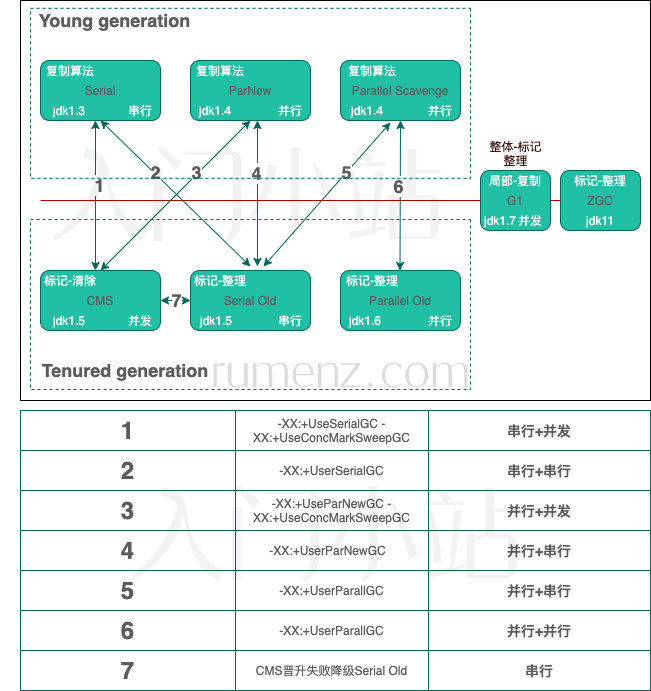
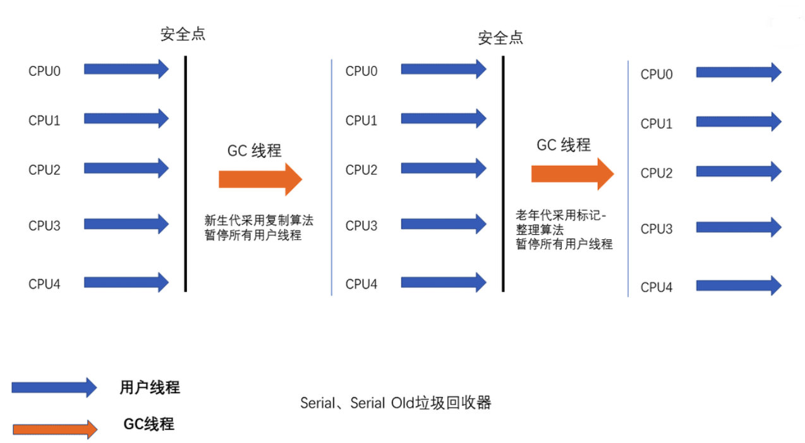
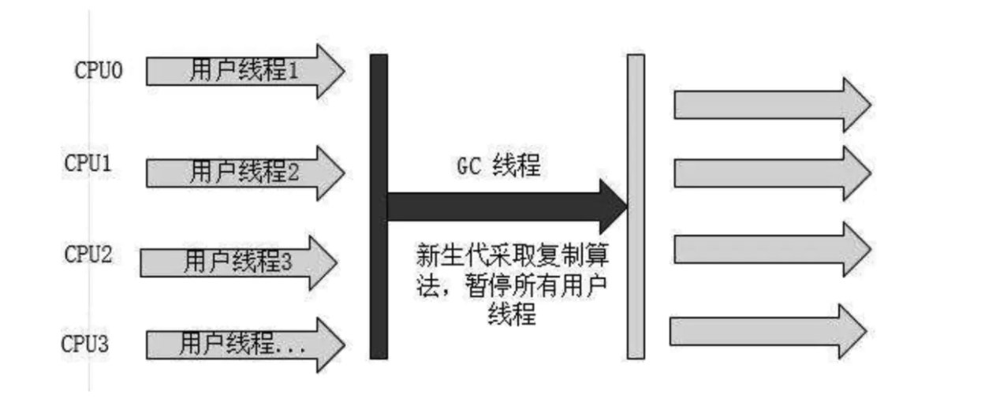
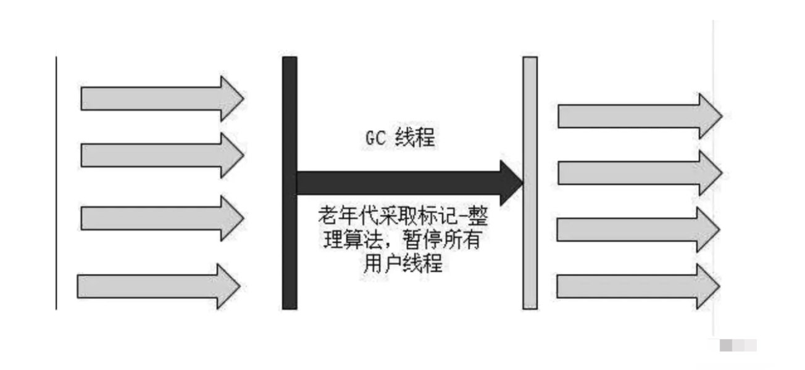
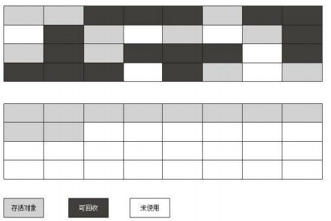
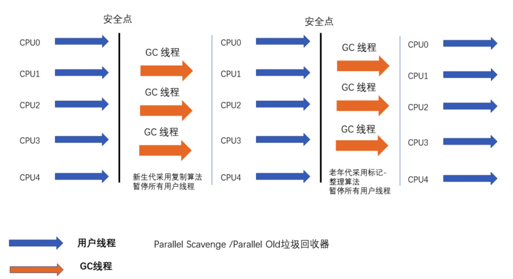
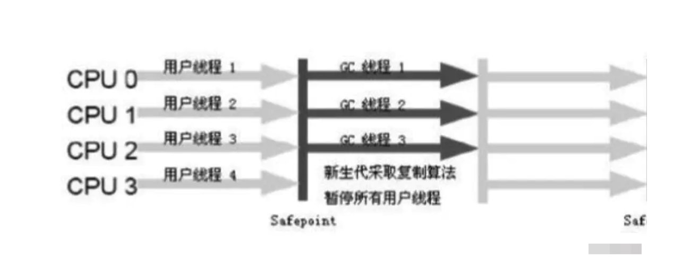
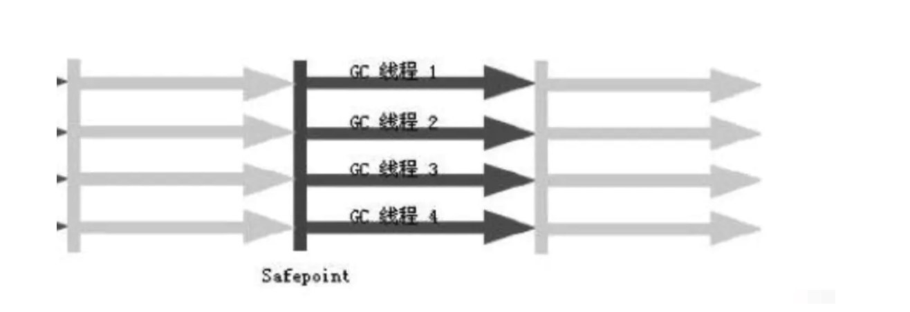
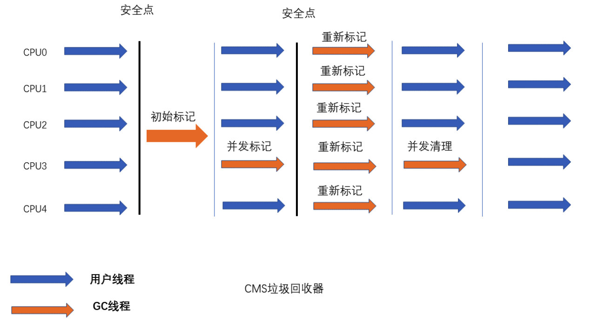

# 垃圾收集器

<!-- more -->

# 串行收集器Serial

> 串行收集器是指同一时间段类只允许一个CPU执行**垃圾回收,此时用户线程被暂停(STW),**直到垃圾回收结束。
>
> - 参数：-XX:+UseSerialGC -XX:+UseSerialOldGC
> - 优点
>   - 简单高效，是Client模式下默认的垃圾收集器；
>   - 对于资源受限的环境，比如单核(例如Docker中设置单核)，单线程效率较高；
>   - 内存小于一两百兆的桌面程序中，交互有限，则有限的STW是可以接受的。
>
> - 缺点
>
>   垃圾回收速度较慢且回收能力有限，频繁的STW会导致较差的使用体验。
>
> - 应用场景
>
>   是HotSpot在Client模式下默认的新生代垃圾收集器
>
>   在用户的桌面应用场景中，可用内存一般不大（几十M至一两百M），可以在较短时间内完成垃圾收集（几十MS至一百多MS）,只要不频繁发生，这是可以接受的
>
> 

## Serial

- 串行
- 新生代
- 复制算法
- 响应速度优先
- 单CPU环境下的Client模式

> Serial是单线程垃圾回收器,当需要执行垃圾回收时,程序会暂停一切工作,然后单线程执行垃圾回收.
>
> 
>
> 单线程的好处就是减少上下文切换,减少系统开销.但是这种方式的缺点也很明显,在GC的过程中,会暂停程序执行. 若GC发生不频繁可以选这个. 对于新声代来说,区域比较小,停顿时间短.

- 优点

  - 简单高效，是Client模式下默认的垃圾收集器；
  - 对于资源受限的环境，比如单核(例如Docker中设置单核)，单线程效率较高；
  - 内存小于一两百兆的桌面程序中，交互有限，则有限的STW是可以接受的。

- 缺点

  - 垃圾回收速度较慢且回收能力有限，频繁的STW会导致较差的使用体验。

- 应用场景

  - 是HotSpot在Client模式下默认的新生代垃圾收集器
  - 在用户的桌面应用场景中，可用内存一般不大（几十M至一两百M），可以在较短时间内完成垃圾收集（几十MS至一百多MS）,只要不频繁发生，这是可以接受的

## Serial Old

- 串行
- 老年代
- 标记-整理
- 响应速度优先
- 单CPU环境下的Client模式、CMS的后备预案

> 老年代垃圾收集器,与Serial一样,是一个单线程垃圾收集器,不同的是用的算法不一样(标记-整理)
>
> 
>
> 根据老年代的特点,有人设计了`标记-整理(Mark Compact)`算法,标记过程和`标记-清除`算法一样,但是后续步骤不是直接对可回收对象进行清理,而是让存活对象向一端移动,然后清除掉边界以外的内存，如下图所示。
>
> 
>
> `复制算法`在对象存活比较高的老年代需要复制大量的对象,效率将会贬低,如果不想浪费50%的内存,就需要有额外的空间进行分配担保,以应对对象100%都存活的极端情况,所以老年代并不适用`复制算法`。

# 并行收集器Parallel

> 指多条垃圾收集线程并行工作，但此时用户线程仍然处于等待状态，但是由于是多CPU同时执行,所以应用程序的吞吐量比较高.
>
> 吞吐量优先:花在垃圾收集的时间和花在应用时间的占比 -XX:GCTimeRatio=, 垃圾收集时间占：1/1+n
>
> - -XX:+UseParallelGC -XX:+UseParallelOldGC
> - Server模式下的默认收集器
>
> 场景：适合科学计算、后台处理等弱交互场景
>
> 

## ParNew

> **ParNew同样用于新生代,是Serial的多线程版本,和CMS配合使用.**
>
> 在参数,算法(同样的复制算法)和Serial相同.
>
> Par是Parallel的缩写,多线程的意思,但是这里的多线程仅仅指垃圾收集多线程并行,并不是垃圾收集和程序并行运行.ParNew也需要暂停一切工作,然后多线程并行垃圾收集.
>
> 
>
> 因为是多线程执行,所以在多CPU环境下,效率比`Serial`高,但是在单CPU环境下,因为线程切换,反而性能比较差.

- 参数
  - “-XX:+UseConcMarkSweepGC”：指定使用CMS后，会默认使用ParNew作为新生代收集器；
  - “-XX:+UseParNewGC”：强制指定使用ParNew； 
  - “-XX:ParallelGCThreads”：指定垃圾收集的线程数量，ParNew默认开启的收集线程与CPU的数量相同；

- 应用场景

> 在Server模式下,ParNew是一个非常重要的收集器,因为除Serial外,目前只有ParNew与CMS收集器配合工作.

## Parallel Scavenge

- 并行
- 新生代
- 复制算法
- 吞吐量优先
- 在后台运算而不需要太多交互的任务

>**可以并行收集的多线程垃圾收集器**
>
>Parallel scavenge是一个新生代垃圾收集器,它是用`复制算法`的垃圾收集器,又是`多线程`并行的垃圾收集器,和ParNew类似.吞吐量优先的垃圾收集器,是Java1.8默认的新生代垃圾收集器.

- 主要特点

> Parallel scavenge收集器的目标是达到一个可控的吞吐量,(吞吐量=运行用户代码时间/(运行用户代码时间+垃圾收集时间))
>
> 但它的对象分配规则与回收策略都与ParNew收集器有所不同，它是以吞吐量最大化（即GC时间占总运行时间最小）为目标的收集器实现，它允许较长时间的STW换取总吞吐量最大化
>
> `吞度量=t1/(t1+t2)`
> `t1运行用户代码的总时间`
> `t2运行垃圾收集的总时间`
> `比如，虚拟机总共运行了100分钟，其中垃圾收集花掉1分钟，那吞吐量就是99%。`

- 参数

  - -XX:MaxGCPauseMillis   控制最大垃圾收集停顿时间

  > 参数的值是一个大于0的毫秒数，收集器将尽可能的保证回收耗费的时间不超过设定的值，但是，并不是越小越好，GC停顿时间缩短是以牺牲吞吐量和新生代空间来换取的，如果设置的值太小，将会导致频繁GC，这样虽然GC停顿时间下来了，但是吞吐量也下来了。比如收集500MB时候，需要每10秒收集一次，每次回收耗时100ms；如果收集300MB的时候，需要每5秒收集一次，每次回收耗时70ms，虽然每次回收耗时更少，但是工作频次提高，导致吞吐量反而降低了。

  - -XX:GCTimeRatio   控制吞吐量大小

  > 参数的值是一个大于0且小于100的整数，也就是垃圾收集时间占总时间的比率，默认值是99，就是允许最大1%（即1/(1+99)）的垃圾收集时间。
  >
  > Parallel Scavenge有个重要的特性，是支持GC自适应的调节策略，使用-XX：UseAdaptiveSizePolicy参数开启，开启之后，虚拟机会根据当前系统运行情况收集监控信息，动态调整新生代的比例、老年大大小等细节参数，以提供最合适的停顿时间或最大的吞吐量。开启这个参数之后，就不需要再设置新生代大小，Eden与S0/S1的比例等等参数。

- 使用场景

> Parallel scavenge收集器的高吞吐量可以最高效率的利用CPU,尽快的完成程序的运算任务,主要适合后台运算而不是太多交互的任务(太多交互的任务,适合用响应时间优先的CMS垃圾收集器)
>
> Parallel scavenge可以精确控制吞吐量,通过两个参数:控制最大垃圾收集停顿时间`-XX:MaxGCPauseills`,设置吞吐量大小`-XX:GCTimeRatio`(GCTimeRatio的默认值为99，因此，GC耗时的占比应为1/（1+99）=1%。使用参数的理论效果：GCTimeRatio越大，吞吐量越大，GC的总耗时越小。有可能导致单次MinorGC耗时变长。适用于高运算场景). 它还可以用`-XX:+UseAdaptiveSizePolicy`参数进行自适应调节(GC Ergonomics),打开后会JVM会根据当前的运行状况动态调整最适合的吞吐量,配合前面两个参数更好.

## Parallel Old

- 并行
- 老年代
- 标记-整理
- 吞吐量优先
- 在后台运算而不需要太多交互的任务

> 老年代收集器,是Parallel Scavenge老年代版本,用的算法是`标记-整理`,在JDK1.6提供,多线程收集
>
> 

# 并发收集器 Concurrent

> 指用户线程与垃圾收集线程同时执行 (但不一定是并行的，可能会交替执行)，垃圾收集线程在执行的时候不会停顿用户程序的执行，适合对响应时间有要求的场景，比如 Web
>
> 停顿时间:垃圾收集器做垃圾回收中断应用执行的时间 -XX:MaxGCPauseMills
>
> 响应时间优先
>
> - CMS:XX:+UseConcMarkSweepGC -XX:+UseParNewGC
> - G1: -XX:+UseG1GC

## CMS（Concurrent Mark Sweep）

- 并发
- 老年代
- 标记-清除
- 响应速度优先
- 集中在互联网站或B/S系统服务端上的Java应用

>垃圾收集线程和用户线程同时工作,**以获取最短停顿时间为目标的垃圾收集器，相对于其他收集器的STW时间更短，可以并行收集，同时它基于标记清除算法**
>
>会有`STW`。它作为老年代的垃圾收集器。新生代的垃圾收集器只能从`ParNew`和`Serial`中二选一。
>
>

#### CMS工作原理

> `CMS`垃圾收集阶段主要分成4个阶段

- 初始标记(Inital Mark) 

  用户线程被`STW`暂停,这个阶段只标记出`GC Roots`能直接关联到的对象,标记完成后恢复用户线程,由于直接关联的对象都比较少,所以速度会很快。

- 并发标记(Concurrent mark) 

  从`GC Roots`直接关联的对象开始遍历整个堆中的对象,耗时比较长,但是此时不会暂停用户线程,可以并发执行。

- 重新标记(Remark) 

  为了修正并发标记期间，因用户程序继续运作而标记产生改变的标记，需要STW。它的执行时间较长,但是比并发标记时间要短,这个过程会发生`STW`,暂停用户线程。

- 并发清除(Concurrent Sweep) 

  清除标记阶段已经死亡的对象,释放内存,它可以和用户线程并发执行。

> 初始标记和重新标记的存在，使得CMS仍在存在STW。但并发标记和并发清除阶段不需要暂停其他的用户线程，因此整体的回收是低停顿的。
>
> 由于垃圾回收阶段用户线程并没有中断，所以在CMS回收过程中还应该确保用户线程有足够的内存可用。因此，CMS不是当老年代完全没有空间可用时才被触发，而是当堆内存的使用率达到一个阈值时，便开始进行回收，确保应用程序在CMS工作过程中依然有足够的空间支持应用程序运行。
> 如果CMS运行期间预留的内存空间不够用户程序使用，那么就会出现一次”Concurrent Mode Failure”失败，此时虚拟机将会临时启用Serial Old作为老年代的垃圾回收器使用，这样停顿时间就长了。

### CMS的优点

- 并发收集
- 低延迟

### CMS不足

- 会产生内存碎片：标记-清除算法不可避免的会产生碎片，此时内存分配只能使用空闲列表法
- 对CPU资源非常敏感：在并发阶段时，它虽然不会导致用户线程暂停，但是也会因为占用一部分线程而导致应用程序变慢，总吞吐量下降
- 无法处理浮动垃圾：在并发标记阶段由于垃圾回收线程和用户线程是同时运行或交叉运行的，那么在并发标记阶段如果产生新的垃圾对象，CMS将无法对这些垃圾进行标记，最终会导致这些新产生的垃圾对象无法被及时回收，只能等到下一次GC时被回收

### CMS重要的参数

- -XX:UseConcMarkSweepGC ：⼿动指定使⽤CMS，此时的组合为ParNew+CMS+Serial OLD（后备⽅
  案）
- -XX:CMSInitiatingOccupanyFraction ：设置堆内存使⽤率的阈值，⼀旦达到该阈值，并开始进
  ⾏回收，默认值为68
- -XX:+UseCMSCompactAtFullCollection ：⽤于指定在执⾏完Full GC后堆内存空间是否进⾏压缩
  整理。避免内存碎⽚的产⽣，它会导致停顿时间变⻓
- -XX:CMSFullGCsBefoerCompaction ：设置在执⾏完多少次Full GC后对内存空间进⾏压缩整理
- -XX:ParallelCMSThreads ：设置CMS的线程数，默认是（ParallelGCThreads + 3） / 4

## G1

- 并发
- both
- 标记-整理+复制算法
- 响应速度优先
- 面向服务端应用，将来替换CMS

>一款面向服务端应用的垃圾回收器，将堆内存划分成一个个Region（1MB-32MB，默认2048个分区）

### 回收过程

除了并发标记，其他所有过程都需要STW

- 初始标记

  仅仅是标记一下GC Roots能直接关联到的对象，并且修改TAMS的值，让下一阶段用户程序并发运行时，能在正确可用的Regin中创建新对象，这一阶段需要停顿线程，但是耗时很短
- 并发标记（**与用户线程并发执行**）

  从GC Roots开始，对堆中对象进行可达性分析，找出存活对象，这一过程时间较长，但是可以与用户线程并发执行

- **最终标记**
  修正在并发标记期间因用户程序继续运作而导致标记产生变动的那一部分标记记录，这一阶段需要停顿线程，但是可以并行执行。

- **筛选回收**

  对各个Regin的回收价值和成本进行排序，根据用户所期望的GC停顿时间来执行回收计划。

### 特点

- 并行与并发
  G1能充分利用CPU、多核环境下的硬件优势，使用多个CPU来缩短stop-the-world停顿时间。

- 分代收集

  不需要与其他垃圾收集器配合，G1自己可以管理年轻代和年老代。

- 空间整合

  由于G1使用了独立区域（Region）概念，G1整体来看还是使用了“标记-整理”算法，从整体（两个Region）上来看是使用了复制算法，这两种算法都意味着G1在垃圾回收时不会产生内存空间碎片。

- 可预测的停顿：这是G1相比于CMS的另一大优势

# 如何选择垃圾收集器

- 优先调整堆的大小让服务器自己来选择
- 如果内存小于100M，使用串行收集器
- 如果是单核，并且没有停顿时间的要求，串行或者JVM自己选
- 如果允许停顿时间超过1秒，选择并行或者JVM自己选
- 如果响应时间最重要，并且不能超过1秒，使用并发收集器

# Parallel GC

## Parallel GC有两种组合

- 使用`-XX:+UseParallelGC`参数来启用`Parallel Scavenge`和`PSMarkSweep(Serial Old)`收集器组合进行垃圾收集
- 使用`-XX:+UserParallelOldGC`参数来启用`Parallel scavenge`和PSCompact(Parallel Old)收集器组合收集

### Parallel Scavenge

### Parallel Old

> `Parallel Old GC`在`Parallel Scavenge`和`Parallel Old`收集器组合中，负责Full GC，是一个并行收集器，其在整理年轻代的时候，使用与Parallel Scavenge GC一样的常规“复制”算法，但是在整理老年代的时候，是使用的基于“标记-整理”算法优化的“Mark–Summary-Compaction”算法。
>
> 算法包含三个部分
>
> - Mark
>
>   首先将老年代的内存，划分为大小固定的多个连续Region，当标记完存活对象之后，统计每个Region的存活对象数量。Mark阶段采用串行标记所有从GC Roots可直达的对象，然后并行标记所有存活的对象。
>
> - Summary
>
>   某个Region的密度 = 存活对象的内存大小 / Region内存大小。因为每次整理会将存活的对象向Old区的左侧移动，而对象存活越久，理论上就越不容易被回收，所以经过多次整理之后，左侧Region中的对象更偏向于稳定、“长寿”，即是左侧Region的密度更大。Summary阶段，算法采用以空间换时间的优化方式，针对一个密度很大的Region，比如95%的空间是存活对象，只有断断续续5%的空间是未使用的，那么算法认为这个Region不值得被整理，即是选择浪费掉这5%的空间，以节省整理操作的时间开销。在Sumamry阶段，首先从左至右计算各个Region的密度，直到找到一个point，这个point左侧的Region都不值得整理，右侧的Region需要整理。point左侧的Region被称为dense prefix，这个区域内的对象都不会被移动。Summary阶段是一个串行执行的阶段。
> - Compaction
> Compaction阶段利用Summary阶段的统计数据，针对需要整理的部分，采用“整理”算法进行并行操作。

## GC策略

- -XX:+ScavengeBeforeFullGC

> `ScavengeBeforeFullGC`是`Parallel GC`套装中（两种组合都生效）的一个参数，默认是开启的，作用是在一次Full GC之前，先触发一次Young GC来清理年轻代，以降低Full GC的STW耗时（Young GC会清理Young GC中非存活的对象，减少Full GC中，标记存活对象的工作量）。

## 内存分配策略

> 对于常规收集器来说，当Eden区无法分配内存时，便会触发一次Young GC，但是对于Parallel GC有点变化：

- 当整个新生代剩余的空间无法存放某个对象时，Parallel GC中该对象会直接进入老年代；
- 而如果整个新生代剩余的空间可以存放但只是Eden区空间不足，则会尝试一次Minor GC。

## 悲观策略

> 绝大多数收集器，都有这么一个策略：在执行Young GC之前，如果估计之前晋升老年代的平均大小，比当前老年代的剩余空间要大的话，则会放弃Young GC，转而触发Full GC。
>
> Parallel GC除了上述策略外，还有另外一个策略：在执行Young GC之后，如果晋升老年代的平均大小，比当前老年代的剩余空间要大的话，则会触发一次Full GC。

## JVM默认老年代回收是 PSMarkSweep(Serial-Old) 还是Parallel Old？

> 这个改进使得HotSpot VM在选择使用`ParallelGC`（-XX:+UseParallelGC 或者是ergonomics自动选择）的时候，会默认开启 `-XX:+UseParallelOldGC` 。这个变更应该是在JDK7u4开始的JDK7u系列与JDK8系列开始生效。
>
> 在这个改变之前，即便选择了ParallelGC，默认情况下ParallelOldGC并不会随即开启，而是要自己通过 -XX:+UseParallelOldGC 去选定。

## 分类

### 按线程分

- 串行垃圾回收

> 串行收集器是指同一时间段类只允许一个CPU执行垃圾回收,此时用户线程被暂停,直到垃圾回收结束。

- 并行垃圾回收

> 并行垃圾收集器是指多个CPU可以同时执行垃圾收集器,此时用户线程也被暂停,但是由于是多CPU同时执行,所以应用程序的吞吐量比较高。

### 按工作模式分

- 独占式垃圾收集器

> 在运行独占式垃圾收集器时,会暂停所有的用户线程,直到垃圾收集完毕。

- 并发式垃圾收集器

> 并发式垃圾收集器在运行的时候,会和用户线程交替执行,尽可能减少用户线程的停顿时间。

### 按碎片处理方式分

- 压缩式垃圾收集器
- 非压缩式垃圾收集器

### 按工作区域分

- 新生代垃圾收集器
- 老年代垃圾收集器

## 性能指标

#### 吞吐量

> 用户线程执行的总时间占CPU总运行时间的比率

#### 垃圾收集开销

> 垃圾收集总时间占CPU总运行时间

#### 暂停时间

> 垃圾收集期间,用户线程被停顿的时间

#### 收集频率

> 相对于用户线程执行的次数,垃圾收集发生频率
>
> 其中最为重要的就是平衡吞吐量和暂停时间。如果以吞吐量优先，那么必然需要降低内存回收的执行效率，但这样会导致需要更长的暂停时间来执行内存回收；如果以低延迟优先为原则，那么为了降低每次执行内存回收时的暂停时间，就只能频繁的执行内存回收，这又引起了年轻代内存的缩减和导致程序吞吐量下降。一般来说是在吞吐量最大的情况下,尽量降低停顿时间。

#### 吞吐量计算方式

> 用户线程执行的总时间占CPU总运行时间的比率
>
> 吞吐量 = 运行用户代码时间 / CPU总耗费时间

### Java已有垃圾收集器

- 串行垃圾收集器:Serial,Serial Old,
- 并行垃圾收集器:ParNew,Parallel Scavenge,Parallel Old
- 并发垃圾收集器:CMS,G1,ZGC

### 按照回收区域分类

- 年轻代垃圾收集器:Serial,ParNew,Parallel Scavenge
- 老年代垃圾收集器:Serial Old,Parallel Old,CMS
- 整堆收集器:G1,ZGC

> 通过`-XX:+PrintCommandLineFlags`查看程序默认只用的`JVM`参数。通过`jinfo -flags pid`查看进程使用的`JVM`参数。

###### 来源：

https://rumenz.com/rumenbiji/jvm-common-garbage-collector.html

https://blog.csdn.net/qq_37325859/article/details/122318578

https://rumenz.com/rumenbiji/jvm-serial-old-parallel-old.html

https://rumenz.com/rumenbiji/jvm-gc-conclusion.html

https://rumenz.com/rumenbiji/java-parallel-gc.html

https://rumenz.com/rumenbiji/jvm-summary.html
