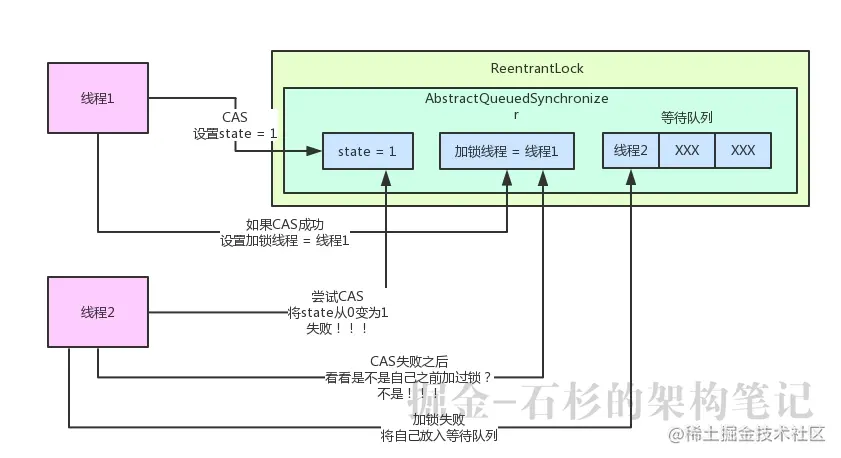
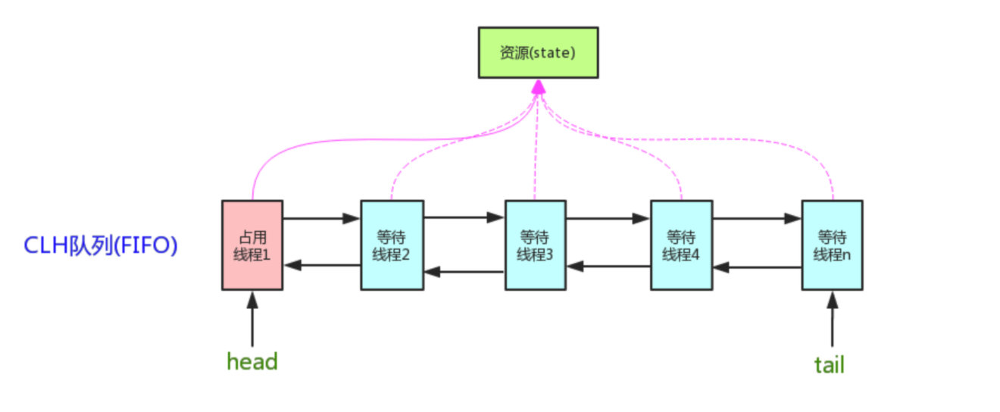
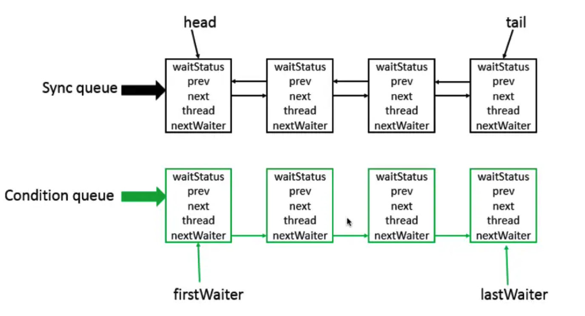
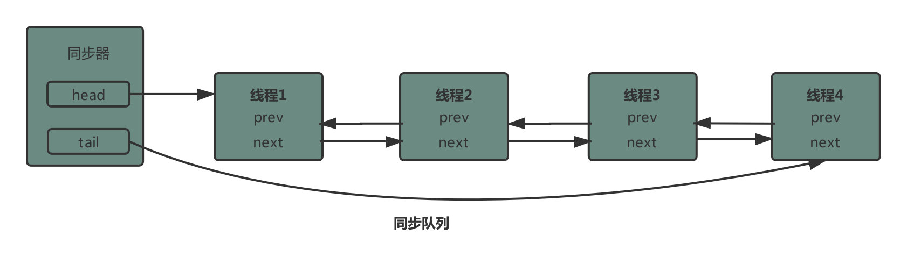
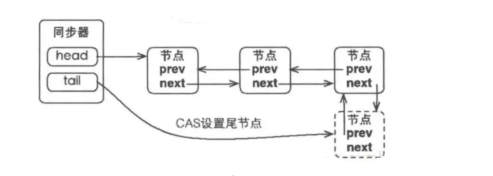
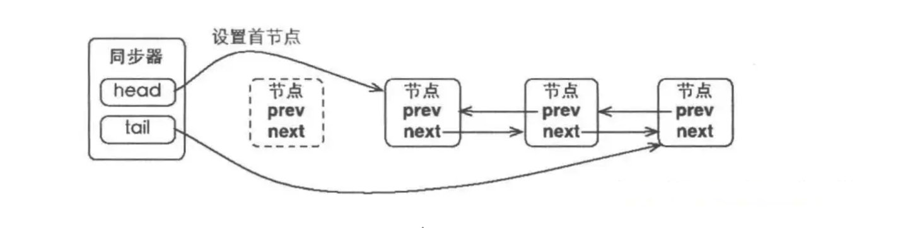

# AQS

## 介绍：

- 用途：是并发包的一个基础组件，用来实现各种锁，各种同步组件。ReentrantLock就是用AQS实现的

  比如，Semaphore用它来表现剩余的许可数，ReentrantLock用它来表现拥有它的线程已经请求了多少次锁；FutureTask用它来表现任务的状态等。

  使用 AQS 来实现一个同步器需要覆盖实现如下几个方法，并且使用`getState`、`setState`和`compareAndSetState`这三个方法来操作状态。

- AQS全称：AbstractQueuedSynchrinizer，抽象队列同步器。

<!-- more -->

## 结构：



- AQS内部维护一个核心变量：**state**，是int类型，代表了**加锁状态**。初始化状态下，state值为0。

- 还有一个关键变量：**加锁线程**，用来记录**当前加锁的线程**，**初始化状态**下这个变量为**null**。

   FIFO 线程等待队列（多线程争用资源被阻塞时会进入此队列，此队列称之为CLH队列）。CLH 队列中的每个节点是对线程的一个封装，包含线程基本信息，状态，等待的资源类型等

- **等待队列**，用来存放未获取到锁的线程



## AbstractQueuedSynchrinizer

### Abstract

- JUC下哪些工具基于AQS

- AQS

  - ReentranctLock

    - CyclicBarrier

  - ReentranctReadWriteLock

  - CountdownLatch
  - Semaphore
  - Worker(ThreadPool)

### Queued:AQS中核心的数据模形就是队列

- prev
- next
- shared

### Synchrinizer

synchronizer = state+acquire+release

### 核心方法：

- acquire
- release

## 底层结构：



> 底层采用双向链表，是队列的一种实现，因此可以当做是一个队列。其中Sync queue即同步队列，它是双向链表，包括hean结点（主要用作后续的调度）与tail结点。Condition queue不是必须的，单向链表，只有在需要使用到condition的时候才会存在这个单向链表，并且可能存在多个Condition queue

- 使用Node实现FIFO队列，可以用于构建锁或者其他同步装置的基础框架
- 利用了一个int类型表示状态。在AQS中，存在一个state成员变量，基于AQS有一个同步组件ReentrantLock，在这个组件中，state表示获取锁的线程数，假如state == 0表示无线程获取锁，state == 1表示已有线程获取锁，state > 1表示锁的数量
- 使用方法是继承。AQS的设计是基于模板方法，使用需要继承AQS，并覆写其中的方法。
- 子类通过继承并通过实现它的方法管理其状态{acquire() 和 release()}的方法操纵状态
- 可以同时实现排它锁和共享锁模式（独占、共享）。它的所有子类中，要么实现并使用它的独占功能API，要么实现共享锁的功能，而不会同时使用两套API。即便是它比较有名的子类ReentrantReadWirteLock也是通过两个内部类读锁和写锁分别使用两套API实现的。AQS在功能上，有独占控制和共享控制两种功能。
- 在LOCK包中的相关锁(常用的有ReentrantLock、 ReadWriteLock)都是基于AQS来构建.然而这些锁都没有直接来继承AQS,而是定义了一个Sync类去继承AQS，因为锁面向的是使用用户,而同步器面向的则是线程控制,那么在锁的实现中聚合同步器而不是直接继承AQS就可以很好的隔离二者所关注的事情.

### 基于以上设计，AQS具体实现的大致思路

> AQS内部维护了一个CLH队列来管理锁，线程首先会尝试获取锁，如果失败，会将当前线程以及等待状态等信息包装成Node结点加入同步队列（Sync queue）中。接着不断循环尝试获取锁，条件是当前结点为head直接后继才会尝试，如果失败则会阻塞自己，直到自己被唤醒；而当持有锁的线程，释放锁的时候，会唤醒队列中后继线程。基于这些基础的设计和思路，JDK提供了许多基于AQS的子类。

### 独占式锁过程总结

> AQS的模板方法acquire通过调用子类自定义实现的tryAcquire获取同步状态失败后->将线程构造成Node节点(创建一个独占式节点 )(addWaiter)->将Node节点添加到同步队列对尾(addWaiter)->节点以自旋的方法获取同步状态(acquirQueued)。在节点自旋获取同步状态时，只有其前驱节点是头节点的时候才会尝试获取同步状态，如果该节点的前驱不是头节点或者该节点的前驱节点是头节点单获取同步状态失败，则判断当前线程需要阻塞，如果需要阻塞则需要被唤醒过后才返回。在释放同步状态时，同步器调用tryRelease(int arg)方法释放同步状态，然后唤醒头节点的后继节点。

### 共享式锁过程总结

> 共享式获取与独占式获取的最主要区别在于同一时刻能否有多个线程同时获取到同步状态。通过调用acquireShared(int arg)方法可以共享式得获取同步状态。
>
> 同步器调用tryAcquireShared(int arg)方法尝试获取同步状态，其返回值为int类型，当返回值大于0时，表示能够获取同步状态。因此，在共享式获取的自旋过程中，成功获取同步状态并且退出自旋的条件就是tryAcquireShared(int arg)方法返回值大于等于0。共享式释放同步状态状态是通过调用releaseShared(int arg)方法
>
> CountDownLatch、ReentrantReadWriteLock、Semaphore等都是共享式获取同步状态的。

## 简单源码分析

```java
public final void acquire(int arg) {
  // 首先尝试获取,不成功的话则将其加入到等待队列，再for循环获取
  if (!tryAcquire(arg) &&
      acquireQueued(addWaiter(Node.EXCLUSIVE), arg))
    selfInterrupt();
}
// 从clh中选一个线程获取占用资源
final boolean acquireQueued(final Node node, int arg) {
  boolean failed = true;
  try {
    boolean interrupted = false;
    for (;;) {
      // 当节点的先驱是head的时候，就可以尝试获取占用资源了tryAcquire
      final Node p = node.predecessor();
      if (p == head && tryAcquire(arg)) {
        // 如果获取到资源，则将当前节点设置为头节点head
        setHead(node);
        p.next = null; // help GC
        failed = false;
        return interrupted;
      }
      // 如果获取失败的话，判断是否可以休息，可以的话就进入waiting状态，直到被unpark()
      if (shouldParkAfterFailedAcquire(p, node) &&
          parkAndCheckInterrupt())
        interrupted = true;
    }
  } finally {
    if (failed)
      cancelAcquire(node);
  }
}
private Node addWaiter(Node mode) {
  // 封装当前线程和模式为新的节点,并将其加入到队列中
  Node node = new Node(Thread.currentThread(), mode);
  // Try the fast path of enq; backup to full enq on failure
  Node pred = tail;
  if (pred != null) {
    node.prev = pred;
    if (compareAndSetTail(pred, node)) {
      pred.next = node;
      return node;
    }
  }
  enq(node);
  return node;
}  
private Node enq(final Node node) {
  for (;;) {
    Node t = tail;
    if (t == null) { 
      // tail为null，说明还没初始化，此时需进行初始化工作
      if (compareAndSetHead(new Node()))
        tail = head;
    } else {
      // 否则的话，将当前线程节点作为tail节点加入到CLH中去
      node.prev = t;
      if (compareAndSetTail(t, node)) {
        t.next = node;
        return t;
      }
    }
  }
}
```


## JUC工具共享模式AQS与独占模式AQS分类

- 支持独占（排他）获取锁的同步器应该实现tryAcquire、 tryRelease、isHeldExclusively；而支持共享获取的同步器应该实现tryAcquireShared、tryReleaseShared、isHeldExclusively

  ```java
  boolean tryAcquire(int arg)
  boolean tryRelease(int arg)
  int tryAcquireShared(int arg)
  boolean tryReleaseShared(int arg)
  boolean isHeldExclusively()
  ```

ReentrantLock  独占模式
ReentrantReadWriteLock 写锁时使用的独占模式，读锁时使用的共享模式 
CountDownLatch 共享模式
Semaphore  共享模式
CyclicBarrier 共享模式

- 例：CountdownLatch

  CountDownLatch用同步状态持有当前计数，countDown方法调用 release从而导致计数器递减；当计数器为 0 时，解除所有线程的等待；await调用acquire，如果计数器为 0，acquire会立即返回，否则阻塞。通常用于某任务需要等待其他任务都完成后才能继续执行的情景

  ```java
  public class CountDownLatch {
      /**
       * 基于AQS的内部Sync
       * 使用AQS的state来表示计数count.
       */
      private static final class Sync extends AbstractQueuedSynchronizer {
          private static final long serialVersionUID = 4982264981922014374L;
          Sync(int count) {
              // 使用AQS的getState()方法设置状态
              setState(count);
          }
          int getCount() {
              // 使用AQS的getState()方法获取状态
              return getState();
          }
          // 覆盖在共享模式下尝试获取锁
          protected int tryAcquireShared(int acquires) {
              // 这里用状态state是否为0来表示是否成功，为0的时候可以获取到返回1，否则不可以返回-1
              return (getState() == 0) ? 1 : -1;
          }
          // 覆盖在共享模式下尝试释放锁
          protected boolean tryReleaseShared(int releases) {
              // 在for循环中Decrement count直至成功;
              // 当状态值即count为0的时候，返回false表示 signal when transition to zero
              for (;;) {
                  int c = getState();
                  if (c == 0)
                      return false;
                  int nextc = c-1;
                  if (compareAndSetState(c, nextc))
                      return nextc == 0;
              }
          }
      }
      private final Sync sync;
      // 使用给定计数值构造CountDownLatch
      public CountDownLatch(int count) {
          if (count < 0) throw new IllegalArgumentException("count < 0");
          this.sync = new Sync(count);
      }
      // 让当前线程阻塞直到计数count变为0，或者线程被中断
      public void await() throws InterruptedException {
          sync.acquireSharedInterruptibly(1);
      }
      // 阻塞当前线程，除非count变为0或者等待了timeout的时间。当count变为0时，返回true
      public boolean await(long timeout, TimeUnit unit)
          throws InterruptedException {
          return sync.tryAcquireSharedNanos(1, unit.toNanos(timeout));
      }
      // count递减
      public void countDown() {
          sync.releaseShared(1);
      }
      // 获取当前count值
      public long getCount() {
          return sync.getCount();
      }
      public String toString() {
          return super.toString() + "[Count = " + sync.getCount() + "]";
      }
  }
  ```

## 同步队列结构

> AQS使用的同步队列是基于一种CLH锁算法来实现。
>
> CLH锁也是一种基于链表的可扩展、高性能、公平的自旋锁，申请线程只在本地变量上自旋，它不断轮询前驱的状态，如果发现前驱释放了锁就结束自旋.		

> 同步器中包含了两个节点类型的引用，一个指向头节点(head)，一个指向尾节点(tail),没有获取到锁的线程，加入到队列的过程必须保证线程安全，因此同步器提供了一个基于CAS的设置尾节点的方法`CompareAndSetTail(Node expect,Node update)`,它需要传递当前线程认为的尾节点和当前节点，只有设置成功后，当前节点才能正式与之前的尾节点建立关联。

> 同步器队列遵循`FIFO`,首节点是获取锁成功的节点,首节点的线程在释放锁时,会唤醒后续节点,而后继节点在成功获取到锁后,会把自己设置成首节点,设置首节点是由获取锁成功的线程来完成的,由于只有一个线程能成功获取到锁,所以设置首节点不需要`CAS`。		

来源:

https://www.bilibili.com/video/BV1bX4y1P7kn
https://rumenz.com/rumenbiji/java-cas-aqs.html
https://rumenz.com/rumenbiji/java-juc-aqs.html
https://rumenz.com/rumenbiji/java-AbstractQueuedSynchronizer.html

