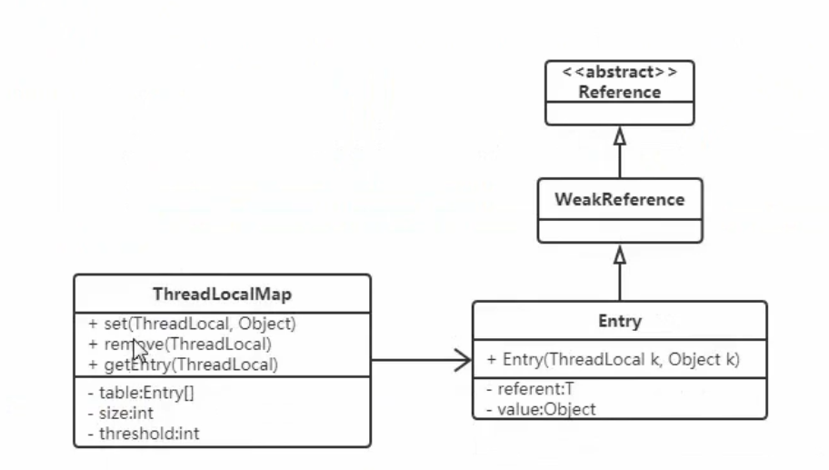
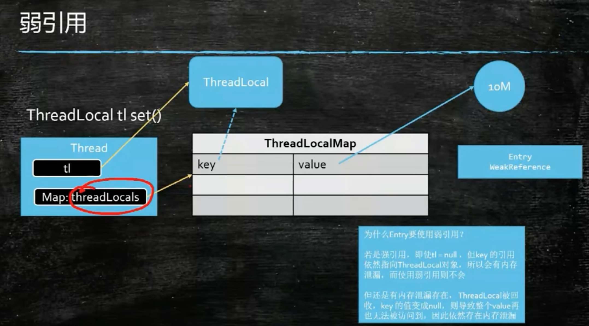

# ThreadLoacl的理解

ThreadLocal提供了线程的局部变量，每个线程都可以通过set()和get()来对这个局部变量进行操作，但不会和其他线程的局部变量发生冲突，**实现了线程的数据隔离**。

简言之：往ThreadLoacl中填充的变量属于当前线程，该变量对其他线程而言是隔离的。

ThreadLocal可以让我们拥有当前线程的变量

## 常用的方法

- set(T value)：设置线程本地变量的内容。
- get()：获取线程本地变量的内容。
- remove()：移除线程本地变量。注意在线程池的线程复用场景中在线程执行完毕时一定要调用remove，避免在线程被重新放入线程池中时被本地变量的旧状态仍然被保存。

<!-- more -->

## 类结构体系

## 内存图

## 原理总结

1.每个Thread维护着一个ThreadLocalMap的引用

2.ThreadLocalMap是ThreadLocal的内部类，用entry来进行存储（K-V形式，Key是reference弱引用）

3.调用ThreadLocal的set()方法时，实际上就是往ThreadLoaclMap中设置值，key是ThreadLocal对象，值是传递的对象

4.调用ThreadLocal的get()方法时，实际上就是从ThreadLocalMap中获取值，Key是ThreadLoca对象

5.ThreadLocal本身并不存储值，他只做为一个key让线程从ThreadLoaclMap中获取值。

## 流程

线程先获取ThreadLocals，包装为Entry，根据当前local作为key进行保存

线程一： ThreadLoacls-Thread-1,包装为Map，以当前变量为key，数据为v存储

线程二：&nbsp;ThreadLoacls-Thread-2,包装为Map，以当前变量为key，数据为v存储

## 为什么使用 WeakReference 作为其 key 的类型

源码中是这样解释的：

> To help deal with very large and long-lived us­ages, the hash table en­tries use WeakRef­er­ences for keys.
> 为了应对大量并且长期地使用 Thread­Lo­cal，哈希表使用了弱应用作为其 key 的类型。

大量使用意味着对应的 key 的数目会很多，而长期使用则是由于 Thread­Lo­cal 的生命周期和线程的生命周期一样长。

如果这里使用普通的 key-value 形式来定义存储结构，实质上就会造成节点的生命周期与线程强绑定，只要线程没有销毁，那么节点在 GC 分析中一直处于可达状态，没办法被回收，而程序本身也无法判断是否可以清理节点。弱引用是 Java 中四档引用的第三档，比软引用更加弱一些，如果一个对象没有强引用链可达，那么一般活不过下一次 GC。当某个 Thread­Lo­cal 已经没有强引用可达，则随着它被垃圾回收，在 Thread­Lo­calMap 里对应的 En­try 的键值会失效，这为 Thread­Lo­calMap 本身的垃圾清理提供了便利。

看起来结局皆大欢喜，引用 Thread­Lo­cal 的对象被回收 -> Thread­Lo­calMap 弱引用 key 被回收，真的没问题了吗？既然是一个 map，那就说明数据结构是 key-value 对，现在仅仅 K 使用了弱引用然后被回收了，那么 value 呢？value 为什么不使用弱引用类型？过期的 value 会被回收吗？

事实上当 Thre­al­Lo­calMap 的 key 被回收之后，对应的 value 会在下一次调用 `set`、`get`、`remove`的时候被清除掉。所以实际上从 `ThreadLocal` 设计角度来说是不会导致**内存泄露**的。

## ThreadLocal与内存泄漏

认为 Thread­Lo­cal 会引起内存泄漏的说法是因为如果一个 Thread­Lo­cal 对象被回收了，我们往里面放的 value 对于**【当前线程 -> 当前线程的 threadLocals (ThreadLocal.ThreadLocalMap 对象）->Entry 数组 -> 某个 entry.value】**这样一条强引用链是可达的，因此 value 不会被回收。
认为 Thread­Lo­cal 不会引起内存泄漏的说法是因为 Thread­Lo­cal.Thread­Lo­calMap 源码实现中自带一套自我清理的机制。

之所以有关于内存泄露的讨论是因为在有线程复用如线程池的场景中，一个线程的寿命很长，大对象长期不被回收影响系统运行效率与安全。如果线程不会复用，用完即销毁了也不会有 Thread­Lo­cal 引发内存泄露的问题。《Ef­fec­tive Java》一书中的第 6 条对这种内存泄露称为 `unintentional object retention`(无意识的对象保留）。

当我们仔细读过 Thread­Lo­calMap 的源码，我们可以推断，如果在使用的 Thread­Lo­cal 的过程中，显式地进行 re­move 是个很好的编码习惯，这样是不会引起内存泄漏。
那么如果没有显式地进行 re­move 呢？只能说如果对应线程之后调用 Thread­Lo­cal 的 get 和 set 方法都有**很高的概率**会顺便清理掉无效对象，断开 value 强引用，从而大对象被收集器回收。

## ThreadLocal建议

1. ThreadLocal应定义为静态成员变量。
2. 能通过传值传递的参数，不要通过ThreadLocal存储，以免造成ThreadLocal的滥用。
3. 在线程池的情况下，在ThreadLocal业务周期处理完成时，最好显式的调用remove()方法，清空”线程局部变量”中的值。
4. 正常情况下使用ThreadLocal不会造成内存溢出，弱引用的只是threadLocal，保存的值依然是强引用的，如果threadLocal依然被其他对象强引用，”线程局部变量”是无法回收的。

## 应用

Spring 项目中我们可能会需要多次使用用户信息，时区，以及某些标识，那么这时候就需要一个线程本地变量存储这些数据，然后当一个请求进入后在不同的业务处理中进行处理能够方便地拿到这些信息。

**注：Tomcat 维护了一个线程池，每一个 HTTP 请求都会从线程池中取一个空闲线程，但是切记在一个线程中再开线程或者使用 Java8 的并行流都会导致无法取到 ThreadLocal！**

###### 来源：

https://chenliny.com/archives/416/

https://blog.csdn.net/weixin_44184990/article/details/122279854
