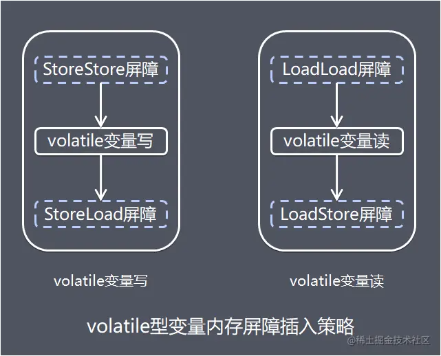

# Volatile

volatile的中文意思是不稳定的、易变的，用volatile修饰的变量是为了**保证变量的可见性**。

- Volatile作用：用来确保将变量的更新操作通知到其他线程

- 原理：

  1）编译器会注意到被volatile修饰的变量是共享的，因此不会将该变量上的操作与其他内存操作一起重新排序

  volatile变量不会被缓存在寄存器中，因此读取volatile变量总会返回最新的值

  2）在访问volatile变量时，不会执行加锁操作，因此也不会阻塞线程，对非volatile变量进行读写时，每个线程先从内存拷贝变量到CPU缓存中

  总结：不会重排、不会缓存（永远是最新值）、不会加锁（因此不会阻塞）

<!-- more -->

## 自身特性

- 原子性

  - 每一步骤是原子性，但总步骤并非原子性

- 可见性

  - 线程写volatile变量的过程：

    1）改变线程工作内存中volatile变量副本的值

    2）将改变后的副本的值从工作内存刷到主内存中

    线程读volatile变量值的过程

    1）从主内存中读取volatile变量的最新值到线程的工作内存中

    2）从工作内存中读取volatile变量的副本

  - Happenes-before

    对一个volatile变量的写，happenes-before对着干volatile的读

    如果前一个操作顺序排在第二个操作之前，那前一个的操作要对第二个可见

- 禁止进行指令重排序

  - 1）当程序执行到volatile变量的**读操作或者写操作时**，在**其前面的操作的更改肯定已经全部进行**，**且结果对后面的操作可见**（happens-before）；在**其后面的操作肯定还没有进行**
  - 2）在进行指令优化时，不能将在对volatile变量访问的语句放在其后面执行，也不能讲volatile变量后面的语句放在其前面执行（不能改变volatile变量前后的语句顺序）

## 汇编-lock前缀

- CPU指令-内存屏障

  在每个volatile写前面插入一个StoreStore屏障

  要前面的写完，对其他处理器可见，后面的才能写。

  在每个volatile写后面插入一个StoreLoad屏障

  要前面的写完，对其他处理器可见，后面的才能读。

  在每个volatile读前面插入一个LoadLoad屏障

  要前面的读取完，后面的才能读

  在每个volatile读后面插入一个LoadStore屏障

  要前面的读取完，后面的才能写

## Volatile对比Synchronized

- 修饰范围
  - volatile修饰变量
  - synchronized修饰方法、代码块
- 内存可见性
  - volatile 写 = 锁释放
  - volatile读 = 锁获取
- 原子性
  - volatile一次操作数原子性
  - synchronized加锁的地方
