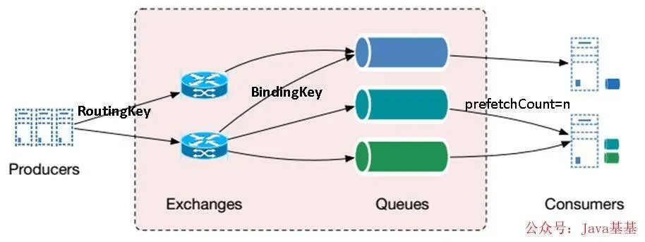
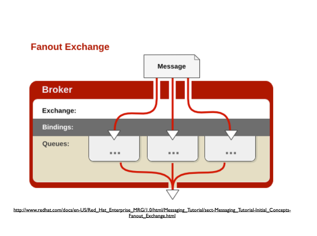
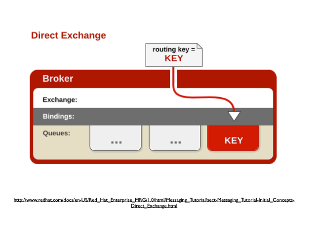
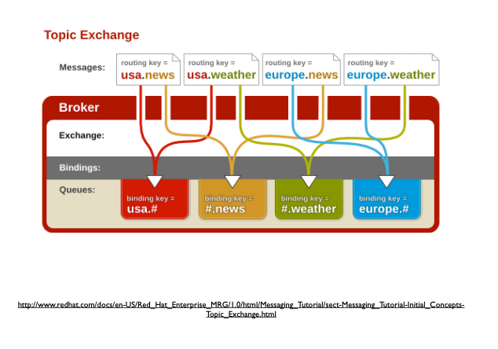
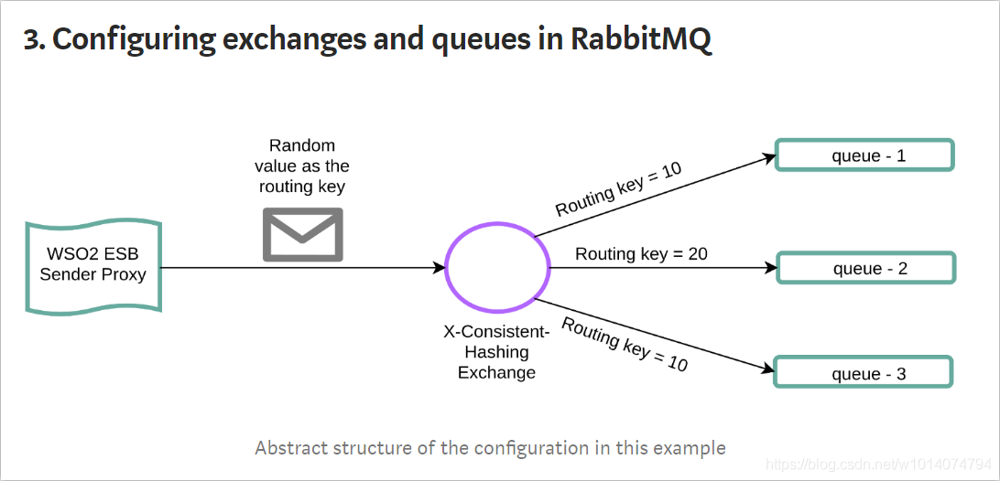
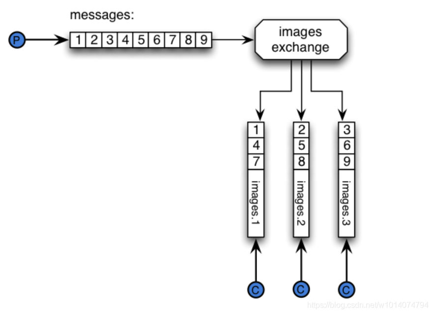
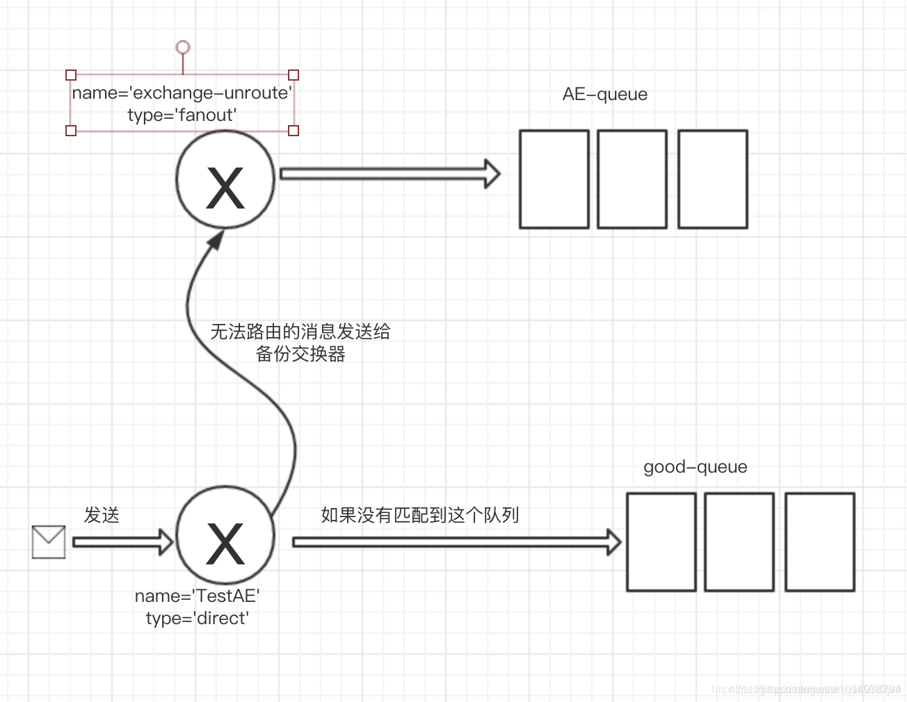

# RabbitMQ

## 简介

RabbitMQ 是流行的开源消息队列系统。RabbitMQ 是 AMQP（Advanced Message Queuing Protocol）的标准实现。

RabbitMQ 采用 Erlang 语言开发。Erlang 是一种面向并发运行环境的通用编程语言。

## RabbitMQ 特点

根据官方介绍，RabbitMQ 是部署最广泛的消息代理，有以下特点：

- 异步消息传递

  支持多种消息传递协议、消息队列、传递确认机制，灵活的路由消息到队列，多种交换类型；

- 开发人员体验

  可在许多操作系统及云环境中运行，并为大多数流行语言提供各种开发工具；

- 分布式部署

  支持集群模式、跨区域部署，以满足高可用、高吞吐量应用场景；

- 企业和云就绪

  可插拔身份认证授权，支持 TLS（Transport Layer Security）和 LDAP（Lightweight Directory Access Protocol）。轻量且容易部署到内部、私有云或公有云中；

- 工具和插件

  支持连续集成、操作度量和集成到其他企业系统的各种工具和插件阵列。可以插件方式灵活地扩展 RabbitMQ 的功能。

- 管理与监控

  有专门用于管理和监督的 HTTP-API、命令行工具和 UI；

综上所述，RabbitMQ 是一个“体系较为完善”的消息代理系统，性能好、安全、可靠、分布式，支持多种语言的客户端，且有专门的运维管理工具。

<!-- more -->

# RabbitMQ 架构

接下来解释几个重要的概念。

- Broker：即消息队列服务器实体。接收和分发消息的应用，这里指的就是RabbitMQ Server
- Virtual host：虚拟主机出于多租户和安全因素设计的，把AMQP的基本组件划分到一个虚拟的分组中，类似于网络中的namespace概念，一个 Broker 里可以开设多个 Vhost，用作不同用户的权限分离。
- `Connection`: 连接。publisher／consumer和broker之间的TCP连接。断开连接的操作只会在client端进行，Broker不会断开连接，除非出现网络故障或broker服务出现问题。
- Channel：消息通道，在客户端的每个连接里，可建立多个 Channel，每个 Channel 代表一个会话任务。
- Exchange：消息交换机/路由。根据分发规则，匹配查询表中的routing key，分发消息到queue中去。
- Queue：消息队列载体，每个消息都会被投入到一个或多个队列。
- Binding：绑定，它的作用是把 Exchange 和 Queue 按照路由规则绑定起来。
- Routing Key：路由关键字，Exchange 根据这个关键字进行消息投递。
- Producer：消息生产者，就是投递消息的程序。
- Consumer：消息消费者，就是接受消息的程序。

消息队列的使用过程如下：

1. 客户端连接到消息队列服务器，打开一个 Channel。
2. 客户端声明一个 Exchange，并设置相关属性。
3. 客户端声明一个 Queue，并设置相关属性。
4. 客户端使用 Routing Key，在 Exchange 和 Queue 之间建立好绑定关系。
5. 客户端投递消息到 Exchange。Exchange 接收到消息后，根据消息的 Key 和已经设置的 Binding，进行消息路由，将消息投递到一个或多个队列里。
6. 有三种类型的 Exchange，即 Direct、Fanout、Topic，每个实现了不同的路由算法（Routing Algorithm）。

`Direct Exchange`：完全根据 Key 投递。如果 Routing Key 匹配，Message 就会被传递到相应的 Queue 中。其实在 Queue 创建时，它会自动地以 Queue 的名字作为 Routing Key 来绑定 Exchange。例如，绑定时设置了 Routing Key 为“abc”，那么客户端提交的消息，只有设置了 Key为“abc”的才会投递到队列中。

`Fanout Exchange`：该类型 Exchange 不需要 Key。它采取广播模式，一个消息进来时，便投递到与该交换机绑定的所有队列中。

`Topic Exchange`：对 Key 进行模式匹配后再投递。比如符号“#”匹配一个或多个词，符号“.”正好匹配一个词。例如“abc.#”匹配“abc.def.ghi”，“abc.”只匹配“abc.def”。

## 消息路由模式

### 广播模式（Fanout）

Fanout交换器不处理路由键，只是简单的将队列绑定到交换器上，每个发送到交换器的消息都会被转发到与该交换器绑定的所有队列上。很像子网广播，每台子网内的主机都获得了一份复制的消息。所以Fanout 类型转发消息是最快的。

广播模式模式**不需要RoutingKey，只需要提前将Exchange与Queue进行绑定**，一个Exchange可以绑定多个Queue，一个Queue可以同多个Exchange进行绑定。但是**如果接受到消息的Exchange没有与任何Queue绑定，则消息会被抛弃。**

但是因为转发到全部绑定的队列上，所以广播模式存在**重复消费**的问题。

### 直接模式（Direct）

消息中的路由键（routing key）如果和 Binding 中的 binding key 一致， 交换器就将消息发到对应的队列中。直接模式是一对一的、单播的模式。

这种模式下**不需要将Exchange进行任何绑定(binding)操作**，**消息传递时需要一个“RoutingKey”**，可以简单的理解为要发送到的队列名字。但是**如果vhost中不存在RoutingKey中指定的队列名，则该消息会被抛弃** 。

### 主题模式（Topic）

任何发送到Topic Exchange的消息都会被转发到所有关心RouteKey中指定话题的Queue上

每个队列都有其关心的主题，所有的消息都带有一个“标题”(RoutingKey路由键)，Exchange会将消息转发到所有关注主题能与RoutingKey模糊匹配的队列。**主题模式需要RoutingKey，也需要提前绑定Exchange与Queue，在进行绑定时，要提供一个该队列关心的主题**。Topic模式有两个关键词#和*。

- “#”表示0个或若干个关键字，如“#.nanju.#”表示该队列关心所有涉及nanju的消息(一个RoutingKey为”asd.MQ.nanju.error”的消息会被转发到该队列)，
- `*`表示一个关键字息，如“`*`.nanju.`*`”(一个RoutingKey为”asd.nanju.error”的消息会被转发到该队列，而”asd.MQ.nanju.error”则不会)

同样，如果Exchange没有发现能够与RoutingKey匹配的Queue，则会抛弃此消息。

### 头交换机（Headers）

有时消息的路由操作会涉及到多个属性，此时使用消息头就比用路由键更容易表达，头交换机（headers exchange）就是为此而生的。头交换机使用多个消息属性来代替路由键建立路由规则。通过判断消息头的值能否与指定的绑定相匹配来确立路由规则。

我们可以绑定一个队列到头交换机上，并给他们之间的绑定使用多个用于匹配的头（header）。这个案例中，消息代理得从应用开发者那儿取到更多一段信息，换句话说，它需要考虑某条消息（message）是需要部分匹配还是全部匹配。上边说的“更多一段消息”就是"x-match"参数。当"x-match"设置为“any”时，消息头的任意一个值被匹配就可以满足条件，而当"x-match"设置为“all”的时候，就需要消息头的所有值都匹配成功。

头交换机可以视为直连交换机的另一种表现形式。头交换机能够像直连交换机一样工作，不同之处在于头交换机的路由规则是建立在头属性值之上，而不是路由键。路由键必须是一个字符串，而头属性值则没有这个约束，它们甚至可以是整数或者哈希值（字典）等

除交换机类型外，在声明交换机时还可以附带许多其他的属性，其中最重要的几个分别是：

- Name
- Durability （消息代理重启后，交换机是否还存在）
- Auto-delete （当所有与之绑定的消息队列都完成了对此交换机的使用后，删掉它）
- Arguments（依赖代理本身）

交换机可以有两个状态：持久（durable）、暂存（transient）。持久化的交换机会在消息代理（broker）重启后依旧存在，而暂存的交换机则不会（它们需要在代理再次上线后重新被声明）。然而并不是所有的应用场景都需要持久化的交换机。

### Others

#### consistent-hash-exchange

git地址：https://github.com/rabbitmq/rabbitmq-consistent-hash-exchange

一致性hash交换器，主要是使用一致性hash算法将消息分发到绑定在交换器上的队列上。

##### 工作原理

当使用“一致性哈希”作为交换类型的情况下，会根据消息属性（最常见的是路由密钥 routing key）计算一个hash值，然后根据这个hash值，将消息分发到绑定在该交换器下的队列中。
因此，如果没有发生绑定更改，具有相同路由关键字的消息将具有相同哈希值将被路由到同一队列。

##### 权重

当队列绑定到Consistent Hash交换时，绑定密钥 binding key会使用一个数字字符串，表示绑定权重：这个桶的数量将与目标队列关联（范围的部分）。
简单的说，就是绑定键的数字越大，那么绑定的队列的权重就越大，分发消息的时候接受到的消息就越多。

请注意，绑定中的routing_keys是数字字符串。 这是因为AMQP 0-9-1指定routing_key字段必须为字符串。

另外，发布消息的时候，路由键routing_key一定要是随机的。

绑定键binding key决定队列的权重
路由键routing_key决定消息的分发

#### x-modulus-hash

git地址：https://github.com/rabbitmq/rabbitmq-sharding
x-modulus-hash路由器对应之前的rabbitmq sharding插件，主要是实现自动对队列进行分区。
也就是说，一旦将一个exchange 定义为x-modulus-hash，就可以在每个集群节点上自动创建支持队列，并在它们之间共享消息。rabbitmq sharding向使用者显示了一个队列，但可能在后台运行了它对应的多个队列。rabbitmq sharding插件为您提供了一个集中的位置，通过向集群中的其他节点添加队列，您可以将消息以及跨多个节点的负载平衡发送到该位置

##### 主要特征

新加节点后，新加自动分片
该插件的主要特性之一是，当将新节点添加到RabbitMQ集群时，该插件将在新节点上自动创建更多分片。假设节点a上有一个带有4个队列的分片，而节点b刚加入集群。该插件将在节点b上自动创建4个队列，并将它们“加入”分片分区。已经传递的消息将不会重新平衡，但是新到达的消息将被划分到新队列中。

##### 两种路由器的选用

如果只需要消息分区，而不需要自动调整分片数量的话，可以使用Consistent Hash Exchange；反之，如果需要根据策略或节点数量，动态调整分片数量的话，则选择x-modulus-hash。

#### Alternate Exchange

生产者在发送消息时不设置mandatory 参数，那么消息达到路由器后匹配不到相应的队列后消息将会丢失。
设置了mandatory 参数，那么需要添加ReturnListener的编程逻辑。
如果既不想复杂化生产者的编程逻辑，又不想消息丢失，那么可以使用备份交换器。

顾名思义 备份交换器就是当第一个交换器未能有效匹配到队列时，路由到备份交换器，再由备份交换器区匹配队列

从模型图中可以看到消息发送到名字为TestAE的路由器中，但是因为没有跟队列匹配，这个时候消息就会被发送到名字为exchange-unroute的备份交换器，这个交换器一般会为fanout型，随后就会被路由到AE-queue队列

#### random-exchange

#### riak-exchange

#### rabbitmq-global-fanout-exchange

#### recent-history-exchange

## Queue

AMQP中的队列（queue）跟其他消息队列或任务队列中的队列是很相似的：它们存储着即将被应用消费掉的消息。队列跟交换机共享某些属性，但是队列也有一些另外的属性。

- Name
- Durable（消息代理重启后，队列依旧存在）
- Exclusive（只被一个连接（connection）使用，而且当连接关闭后队列即被删除）
- Auto-delete（当最后一个消费者退订后即被删除）
- Arguments（一些消息代理用他来完成类似与TTL的某些额外功能）

队列在声明（declare）后才能被使用。如果一个队列尚不存在，声明一个队列会创建它。如果声明的队列已经存在，并且属性完全相同，那么此次声明不会对原有队列产生任何影响。如果声明中的属性与已存在队列的属性有差异，那么一个错误代码为406的通道级异常就会被抛出。

## 工作模式

### 简单模式

一个生产者，一个消费者

#### 流程

- 生产者将消息放入消息队列
- 消息的消费者监听消息队列,如果队列中有消息,就消费掉。消息被消费之后,自动从队列中删除(容易出现消息还没有被消费者正确处理,已经从队列中消失了,造成消息的丢失)

适合场景：

- 简单的聊天系统

### [Work queues](https://www.rabbitmq.com/tutorials/tutorial-two-python.html)

在工作者之间分配任务（[竞争使用者模式](http://www.enterpriseintegrationpatterns.com/patterns/messaging/CompetingConsumers.html))

一个生产者，多个消费者，每个消费者获取到的消息唯一

#### 流程

- 生产者将消息放入消息队列
- 多个消息的消费者同时监听消息队列内容,谁先拿到谁负责消费消息(高并发情况下,默认会产生某一个消息被多个消费者共同使用,可以设置一个开关，保证一条消息只能被一个消费者使用)

适合场景：

- 抢红包
- 随机分派任务

### [Publish/Subscribe](https://www.rabbitmq.com/tutorials/tutorial-three-python.html)

一次向多个消费者发送消息

#### 流程

- 消息产生者将消息放入交换机
- 交换机发布订阅把消息发送到所有消息队列中,对应消息队列的消费者拿到消息进行消费

适合场景：

- 邮件下发
- 场景订阅
- 短信下发

### [Routing](https://www.rabbitmq.com/tutorials/tutorial-four-python.html)

有选择地接收消息。发送消息到交换机并且要指定路由key ，消费者将队列绑定到交换机时需要指定路由key

#### 流程

- 消息生产者将消息发送给交换机
- 交换机根据Routing key,只能匹配上Routing key对应的消息队列,对应的消费者才能消费消息;

路由模式和订阅模式比较相似，只是路由模式模式要求队列在绑定交换机时要指定Routing key，消息会转发到符合Routing key的队列。

适合场景:

- 邮件下发
- 场景订阅
- 短信下发

### [Topics](https://www.rabbitmq.com/tutorials/tutorial-five-python.html)

基于模式接收消息（主题）。将路由键和某模式进行匹配，此时队列需要绑定在一个模式上，“#”匹配一个词或多个词，“*”只匹配一个词

#### 流程

- 1、消息产生者产生消息,把消息交给交换机
- 2、交换机根据key的规则模糊匹配到对应的队列,由队列的监听消费者接收消息消费，每个消费者监听自己的队列，并且设置带统配符的routingkey

适合场景：

- 用户通知的各种情况

### [RPC](https://www.rabbitmq.com/tutorials/tutorial-six-python.html)

[请求/回复模式](http://www.enterpriseintegrationpatterns.com/patterns/messaging/RequestReply.html)

#### 流程

- 当客户端启动时，它会创建一个匿名独占回调队列。
- 对于 RPC 请求，客户端发送一条具有两个属性的消息：reply_to（设置为回调队列）和correlation_id（设置为每个请求的唯一值）。
- 请求将发送到rpc_queue队列。
- RPC 工作线程（也称为：服务器）正在等待该队列上的请求。当出现请求时，它会执行作业，并使用reply_to 字段中的队列将包含结果的消息发送回客户端。
- 客户端等待回调队列上的数据。当出现一条消息时，它会检查correlation_id属性。如果它与请求中的值匹配，则会将响应返回到应用程序。

适合场景：

- 需要在远程计算机上运行函数并等待结果

When in doubt avoid RPC. If you can, you should use an asynchronous pipeline - instead of RPC-like blocking, results are asynchronously pushed to a next computation stage.

### [Publisher Confirms](https://www.rabbitmq.com/tutorials/tutorial-seven-java.html)

发布者确认来确保已发布的消息已安全到达代理

#### 策略

##### #1：单独发布消息

##### #2：批量发布消息

##### #3：处理发布服务器异步确认

- 提供一种将发布序列号与消息相关联的方法。
- 在通道上注册一个确认侦听器，以便在发布者 acks/nacks 到达以执行适当的操作（如日志记录或重新发布 nack-ed 消息）时收到通知。在此步骤中，序列号到消息的关联机制可能还需要进行一些清理。
- 在发布消息之前跟踪发布序列号。

#### 发布者确认总结

确保将已发布的消息发送到代理在某些应用程序中可能是必不可少的。发布者确认是 RabbitMQ 功能，有助于满足此要求。发布者确认本质上是异步的，但也可以同步处理它们。没有明确的方法来实现发布者确认，这通常归结为应用程序和整个系统中的约束。典型的技术有：

- 单独发布消息，同步等待确认：简单，但吞吐量非常有限。
- 批量发布消息，同步等待批处理的确认：简单、合理的吞吐量，但很难推断何时出现问题。
- 异步处理：最佳性能和资源使用，在发生错误时进行良好的控制，但可以参与正确实现。

## RabbitMQ的实战用法

### 保证消息的投递成功

如何保证消息的成功投递？就拿我这次要做的业务来说，涉及到了资金和记账问题，如果消息没有投递成功，一定会出现差错。差错过多，用户体验怎么样emmmmmm

一般的解决方式有这样几种：

- 确认应答机制
- 消息自动补偿机制
- 消息落库，确认消息实际状态
- 消息的延迟投递，做二次检查，回调检查

### 保证消息的消费成功

成功投递出去还只完成了一半，还需要成功的消费消息才能满足我们的需求。

RabbitMQ默认自动确认(ack)消息被正确消费, 即消息投递到消费者后就自动确认消息被处理完毕, 并且会将该消息删除, 即使消费者意外宕机, 或者抛出异常, 如果消费者接收到消息, 还没处理完成就down掉或者抛出异常, 那么, 这条消息就丢失了。

**消息确认模式有:**

- AcknowledgeMode.NONE：自动确认
- AcknowledgeMode.AUTO：根据情况确认
- AcknowledgeMode.MANUAL：手动确认

默认情况下消息消费者是自动ack(确认)消息的, 如果要手动ack(确认), 则需要修改确认模式。同时，手动确认可以被批处理，用以一次性处理大量的内容。

### 消息持久化

消息被投递到RabbitMQ的内存中, 还没投递到消费者实例之前宕机了, 消息不就丢失了?

可以进行消息持久化, 将Exchange、queue和message都持久化到硬盘, 这样, RabbitMQ重启时, 会把持久化的Exchange、queue和message从硬盘重新加载出来, 重新投递消息。

同时还是需要将消息持久化到数据库中。

### 消费端限流

如果RabbitMQ服务器有上万条未处理的消息，我们随便打开一个消费者客户端，会出现巨量的消息瞬间全部推送过来，但我们单个客户端无法同时处理这么多数据，服务器资源耗尽等情况。

RabbitMQ提供一种qos功能，即在非自动确认消息的前提下，如果一定数目的消息未被确认前，不进行消费新的消息。

### 顺序消息

发送顺序消息，必须保障消息投递到同一个队列，且这个消费者只能有一个（独占模式），同时需要统一提交（可能是合并成一个大消息，也可能是拆分为多个消息），并且所有消息的会话ID一致 添加消息属性：顺序标记的序号、和本次顺序消息的SIZE属性，进行落库操作。每次只消费一条信息，处理过后进行手工ACK，然后接收下一条消息。

### 重复消费

重复消费是消息队列中一个非常危险的问题，特别是在多消费者的模式下，如果一条消息被重复消费，又是涉及资金等方面的话，往往容易出现资金风险。所以，解决消息重复消费的问题是必要的。

**保证消息不被重复消费的关键是保证消息队列的幂等性**

**解决方案如下**：

1、唯一主键 你拿到这个消息做数据库的insert操作。那就容易了，给这个消息做一个唯一主键，那么就算出现重复消费的情况，就会导致主键冲突。 

2、redis幂等 你拿到这个消息做redis的set的操作，那就容易了，不用解决，因为你无论set几次结果都是一样的，set操作本来就算幂等操作。 

3、消费介质 准备一个第三方介质,来做消费记录。以redis为例，给消息分配一个全局id，只要消费过该消息，将<id,message>以K-V形式写入redis。那消费者开始消费前，先去redis中查询有没消费记录即可

## RabbitMQ 高可用方案

就分布式系统而言，实现高可用（High Availability，HA）的策略基本一致，即副本思想，当主节点宕机之后，作为副本的备节点迅速“顶上去”继续提供服务。此外，单机的吞吐量是极为有限的，为了提升性能，通常都采用“人海战术”，也就是所谓的集群模式。

RabbitMQ 集群配置方式主要包括以下几种。

- Cluster：不支持跨网段，用于同一个网段内的局域网；可以随意得动态增加或者减少；节点之间需要运行相同版本的 RabbitMQ 和 Erlang。
- Federation：应用于广域网，允许单台服务器上的交换机或队列接收发布到另一台服务器上的交换机或队列的消息，可以是单独机器或集群。Federation 队列类似于单向点对点连接，消息会在联盟队列之间转发任意次，直到被消费者接受。通常使用 Federation 来连接 Internet 上的中间服务器，用作订阅分发消息或工作队列。
- Shovel：连接方式与 Federation 的连接方式类似，但它工作在更低层次。可以应用于广域网。

RabbitMQ 节点类型有以下几种。

- 内存节点：内存节点将队列、交换机、绑定、用户、权限和 Vhost 的所有元数据定义存储在内存中，好处是可以更好地加速交换机和队列声明等操作。
- 磁盘节点：将元数据存储在磁盘中，单节点系统只允许磁盘类型的节点，防止重启 RabbitMQ 时丢失系统的配置信息。

`问题说明`：RabbitMQ 要求集群中至少有一个磁盘节点，所有其他节点可以是内存节点，当节点加入或者离开集群时，必须要将该变更通知给至少一个磁盘节点。如果集群中唯一的一个磁盘节点崩溃的话，集群仍然可以保持运行，但是无法进行操作（增删改查），直到节点恢复。

RabbitMQ 的 Cluster 集群模式一般分为两种，普通模式和镜像模式。

- 普通模式：默认的集群模式，以两个节点（Rabbit01、Rabbit02）为例来进行说明。对于 Queue 来说，消息实体只存在于其中一个节点 Rabbit01（或者 Rabbit02），Rabbit01 和 Rabbit02 两个节点仅有相同的元数据，即队列的结构。当消息进入 Rabbit01 节点的 Queue 后，Consumer 从 Rabbit02 节点消费时，RabbitMQ 会临时在 Rabbit01、Rabbit02 间进行消息传输，把 A 中的消息实体取出并经过 B 发送给 Consumer。所以 Consumer 应尽量连接每一个节点，从中取消息。即对于同一个逻辑队列，要在多个节点建立物理 Queue。否则无论 Consumer 连 Rabbit01 或 Rabbit02，出口总在 Rabbit01，会产生瓶颈。当 Rabbit01 节点故障后，Rabbit02 节点无法取到 Rabbit01 节点中还未消费的消息实体。如果做了消息持久化，那么得等 Rabbit01 节点恢复，然后才可被消费；如果没有持久化的话，就会产生消息丢失的现象。
- 镜像模式：将需要消费的队列变为镜像队列，存在于多个节点，这样就可以实现 RabbitMQ 的 HA，消息实体会主动在镜像节点之间实现同步，而不是像普通模式那样，在 Consumer 消费数据时临时读取。但也存在缺点，集群内部的同步通讯会占用大量的网络带宽。

## RabbitMQ 优缺点

优点主要有以下几点：

- 由于 Erlang 语言的特性，RabbitMQ 性能较好、高并发；
- 健壮、稳定、易用、跨平台、支持多种语言客户端、文档齐全；
- 有消息确认机制和持久化机制，可靠性高；
- 高度可定制的路由；
- 管理界面较丰富，在互联网公司也有较大规模的应用；
- 社区活跃度高，更新快。

缺点主要有：

1. 尽管结合 Erlang 语言本身的并发优势，性能较好，但是不利于做二次开发和维护；
2. 实现了代理架构，意味着消息在发送到客户端之前可以在中央节点上排队。此特性使得 RabbitMQ 易于使用和部署，但使得其运行速度较慢，因为中央节点增加了延迟，消息封装后也比较大；
3. 需要学习比较复杂的接口和协议，学习和维护成本较高。

# 面试问题

**一 RabbitMq的特点**

1.可靠性，rabbitmq使用持久化、传输确认以及发布确认等机制确保可靠性。

2.灵活的路由

3.扩展性，多rabbitMQ节点可以组成一个集群

4.高可用性，队列可以在集群中的机器上设置镜像，使得部分节点出现问题的情况下，附列依然可以用

**二 持久化**

1.持久化消息的时候，durable属性设置true

2.消息已经到达持久化交换机上

3.消息已经到达持久化队列上

工作原理：rabbitmq将持久化消息写入到磁盘，等消息被消费后，rabbitmq会把这条消息标识为等待垃圾回收

**三 消息应答机制**

rabbitmq的消息应答机制分为手动和自动两种

如果消息不重要，丢失也没关系，则可设为自动ACK

如果消息非常重要，不容丢失，那么可以在消息消费完成之后手动ACK，否则如果业务处理失败也会丢失

**四 RabbitMQ的组成**

1.生产者：producer

2.消费者：consumer

3.交换机：exchange，用于接收和分配消息

4.消息：message

5.队列：queue：用于存储生产的消息

6.信道：channel：消息推送使用的通道

7.连接：connections：生产者/消费者与Rabbit建立TCP连接

8.路由键：routingKey：用于把生产者的数据分配到交换机上

9.绑定键：Bindingkey：用于把交换机的消息绑定到队列上

10.服务节点：Broker：一般情况下一个Broker可以看做一个RabbitMq服务器

11.虚拟主机：Vhost：每个RabbitMq服务器都能创建虚拟的消息服务器，也叫虚拟主机，简称vhost。默认为“/”

**五 什么情况下会出现消息堆积**

1.生产者生产消息的速度远大于消费者消费的速度

2.当消费者宕机没有及时重启

如何解决？

1.增加更多的消费者进行处理

2.在消费者处理逻辑内增加线程池

3.扩大队列的容量，提高堆积上限

4.RabbitMQ提供的惰性队列

1）接收到消息后直接存入磁盘而非内存

2）消费者要消费消息时才从磁盘中读取并加载到内存

3）支持百万级的消息存储

**六 延迟队列**

1）死信交换机

2）TTL

###### 来源：

[【进阶之路】消息队列——RabbitMQ原理（二） - 掘金 (juejin.cn)](https://juejin.cn/post/6844904121917505550#heading-2)

[Community Plugins — RabbitMQ](https://www.rabbitmq.com/community-plugins.html)

[RabbitMQ中真的只有四种交换器吗？_斗者_2013的博客-CSDN博客](https://blog.csdn.net/w1014074794/article/details/105984899/)

http://www.redhat.com/docs/en-US/Red_Hat_Enterprise_MRG/1.0/html/Messaging_Tutorial/sect-Messaging_Tutorial-Initial_Concepts-Topic_Exchange.html

[AMQP 0.9.1 模型解析 · RabbitMQ in Chinese (mr-ping.com)](https://rabbitmq.mr-ping.com/AMQP/AMQP_0-9-1_Model_Explained.html)
