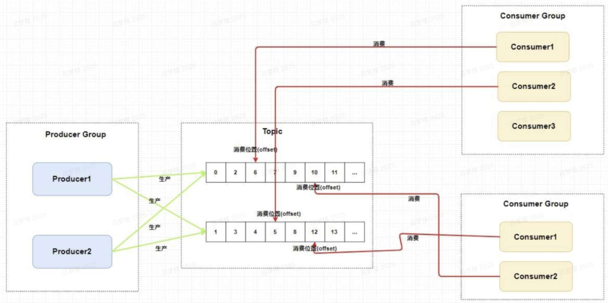
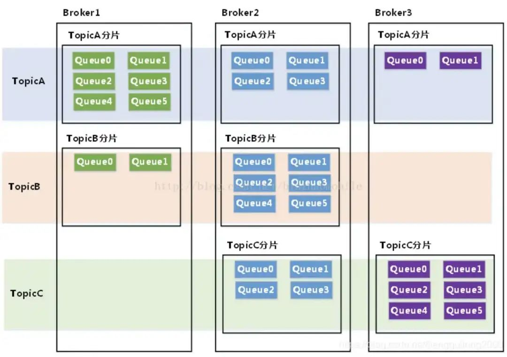
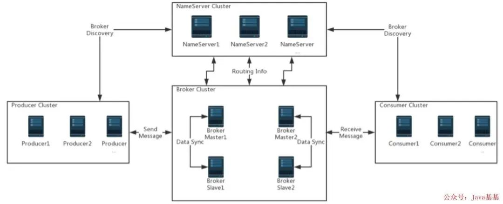

# RocketMQ

RocketMQ 用 Java 语言实现，在设计时参考了 Kafka，并做出了自己的改进，在消息可靠性上比 Kafka 更好，目前最新版本为 4.3.1。RocketMQ 已经被业界多个大型互联网公司采用。

在阿里内部，RocketMQ 很好地服务了集团大大小小上千个应用，在每年的双十一当天，更有不可思议的万亿级消息通过 RocketMQ 流转（在 2017 年的双 11 当天，整个阿里巴巴集团通过 RocketMQ 流转的线上消息达到了万亿级，峰值 TPS 达到 5600 万），在阿里大中台策略上发挥着举足轻重的作用。

## 重要概念

- **Name 服务器（NameServer）：**充当注册中心，类似 Kafka 中的 Zookeeper。
- **Broker：**一个独立的 RocketMQ 服务器就被称为 broker，broker 接收来自生产者的消息，为消息设置偏移量。
- **主题（Topic）：**消息的第一级类型，一条消息必须有一个 Topic。
- **子主题（Tag）：**消息的第二级类型，同一业务模块不同目的的消息就可以用相同 Topic 和不同的 Tag 来标识。
- **分组（Group）：**一个组可以订阅多个 Topic，包括生产者组（Producer Group）和消费者组（Consumer Group）。
- **队列（Queue）：**可以类比 Kafka 的分区 Partition。

<!-- more -->

## 特点

RcoketMQ 是一款低延迟、高可靠、可伸缩、易于使用的消息中间件。具有以下特性：

1. 支持发布/订阅（Pub/Sub）和点对点（P2P）消息模型；
2. 队列中有着可靠的先进先出（FIFO）和严格的顺序传递；
3. 支持拉（Pull）和推（Push）两种消息模式；
4. 单一队列百万消息的堆积能力；
5. 支持多种消息协议，如 JMS、MQTT 等；
6. 分布式高可用的部署架构，满足至少一次消息传递语义；
7. 提供 Docker 镜像用于隔离测试和云集群部署；
8. 提供配置、指标和监控等功能丰富的 Dashboard。

## RocketMQ 工作原理

RockerMQ 中的消息模型就是按照主题模型所实现的，包括 Producer Group、Topic、Consumer Group 三个角色。

为了提高并发能力，一个 Topic 包含多个 Queue，生产者组根据主题将消息放入对应的 Topic，下图是采用轮询的方式找到里面的 Queue。

RockerMQ 中的消费群组和 Queue，可以类比 Kafka 中的消费群组和 Partition：不同的消费者组互不干扰，一个 Queue 只能被一个消费者消费，一个消费者可以消费多个 Queue。

消费 Queue 的过程中，通过偏移量记录消费的位置。

## RocketMQ 架构

RocketMQ 技术架构中有四大角色 NameServer、Broker、Producer 和 Consumer，下面主要介绍 Broker。

Broker 用于存放 Queue，一个 Broker 可以配置多个 Topic，一个 Topic 中存在多个 Queue。

如果某个 Topic 消息量很大，应该给它多配置几个 Queue，并且尽量多分布在不同 broker 上，以减轻某个 broker 的压力。

Topic 消息量都比较均匀的情况下，如果某个 broker 上的队列越多，则该 broker 压力越大。

NameServer 集群

NameServer 是一个功能齐全的服务器，其角色类似 Kafka 中的 ZooKeeper，支持 Broker 的动态注册与发现。主要包括两个功能：

- Broker 管理。NameServer 接受 Broker 集群的注册信息并且保存下来作为路由信息的基本数据。然后提供心跳检测机制，检查 Broker 是否还存活。
- 路由信息管理。每个 NameServer 将保存关于 Broker 集群的整个路由信息和用于客户端查询的队列信息。然后 Producer 和 Conumser 通过 NameServer 就可以知道整个 Broker 集群的路由信息，从而进行消息的投递和消费。

NameServer 通常也是集群的方式部署，各实例间相互不进行信息通讯。Broker 向每一台 NameServer 注册自己的路由信息，所以每一个 NameServer 实例上面都保存一份完整的路由信息。当某个 NameServer 因某种原因下线，Broker 仍然可以向其它 NameServer 同步其路由信息，Produce、Consumer 仍然可以动态感知 Broker 的路由信息。

### Broker 集群

Broker 主要负责消息的存储、投递、查询以及服务高可用保证。为了实现这些功能 Broker 包含了以下几个重要子模块。

- Remoting Module：整个 Broker 的实体，负责处理来自 Clients 端的请求；
- Client Manager：负责管理客户端（Producer、Consumer）和 Consumer 的 Topic 订阅信息；
- Store Service：提供方便简单的 API 接口处理消息存储到物理硬盘和查询功能；
- HA Service：高可用服务，提供 Master Broker 和 Slave Broker 之间的数据同步功能；
- Index Service：根据特定的 Message Key 对投递到 Broker 的消息进行索引服务，以提供消息的快速查询。

### Producer 集群

充当消息生产者的角色，支持分布式集群方式部署。Producers 通过 MQ 的负载均衡模块选择相应的 Broker 集群队列进行消息投递。投递的过程支持快速失败并且低延迟。

### Consumer 集群

充当消息消费者的角色，支持分布式集群方式部署。支持以 Push、pull 两种模式对消息进行消费。同时也支持集群方式和广播形式的消费，它提供实时消息订阅机制，可以满足大多数用户的需求。

### RocketMQ 高可用实现原理

毫无悬念，RocketMQ 实现高可用（HA）的方案仍然是基于最淳朴的“副本思想”，但与 Kafka、Redis、Etcd 采用的副本机制有所不同：RocketMQ 的 Master 和 Slave 没有 Election 机制，也没有 Failover 机制。

RocketMQ 不具备选举功能，在集群模式下，Master、Slave 角色需预先设置，是固定的；Master 与 Slave 配对是通过指定相同的 brokerName 参数来实现，Master 的 BrokerId 必须是 0，Slave 的 BrokerId 必须是大于 0 的数。一个 Master 下面可以挂载多个 Slave，同一个 Master 下的多个 Slave 通过指定不同的 BrokerId 来区分。当 Master 节点宕机后，消费者仍然可以从 Slave 消费，从而保证生产者已经 Push 的消息不丢失；由于该 Master 宕机，生产者将消息 Push 到其它 Master，不影响可用性。RocketMQ 的 Broker 有 4 种部署方式。

1. 单个 Master 模式

除了配置简单，没什么优点。

它的缺点是不可靠。该机器重启或宕机，将导致整个服务不可用，因此，生产环境几乎不采用这种方案。

1. 多个 Master 模式

配置简单，性能最高，是它的优点。

它的缺点是：可能会有少量消息丢失（异步刷盘丢失少量消息，同步刷盘不丢失），单台机器重启或宕机期间，该机器下未被消费的消息在机器恢复前不可订阅，影响消息实时性。

特别说明：当使用多 Master 无 Slave 的集群搭建方式时，Master 的 brokerRole 配置必须为 ASYNC_MASTER。如果配置为 SYNC_MASTER，则 producer 发送消息时，返回值的 SendStatus 会一直是 SLAVE_NOT_AVAILABLE。

1. 多 Master 多 Slave 模式：异步复制

其优点为：即使磁盘损坏，消息丢失得非常少，消息实时性不会受影响，因为 Master 宕机后，消费者仍然可以从 Slave 消费，此过程对应用透明，不需要人工干预，性能同多 Master 模式几乎一样。

它的缺点为：`Master 宕机或磁盘损坏时会有少量消息丢失`。

1. 多 Master 多 Slave 模式：同步双写

其优点为：数据与服务都无单点，Master 宕机情况下，消息无延迟，服务可用性与数据可用性都非常高。

其缺点为：性能比异步复制模式稍低，大约低 10% 左右，发送单个消息的 RT 会稍高，目前主宕机后，备机不能自动切换为主机，后续会支持自动切换功能。

## RocketMQ 优缺点

优点主要包括以下几点。

1. 单机支持 1 万以上持久化队列；
2. RocketMQ 的所有消息都是持久化的，先写入系统 Page Cache，然后刷盘，可以保证内存与磁盘都有一份数据，访问时，直接从内存读取；
3. 模型简单，接口易用（JMS 的接口很多场合并不太实用）；
4. 性能非常好，可以大量堆积消息在 Broker 中；
5. 支持多种消费模式，包括集群消费、广播消费等；
6. 各个环节分布式扩展设计，主从 HA；
7. 社区较活跃，版本更新较快。

缺点主要有：

1. 支持的客户端语言不多，目前是 Java、C++ 和 Go，后两种尚不成熟；
2. 没有 Web 管理界面，提供了 CLI（命令行界面）管理工具来进行查询、管理和诊断各种问题；
3. 没有在 MQ 核心中实现 JMS 等接口。
