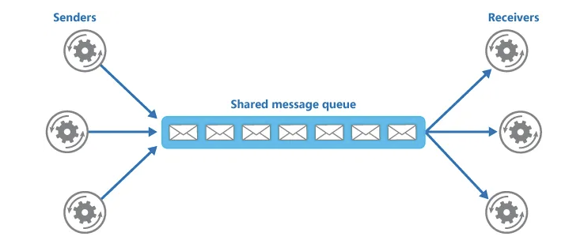
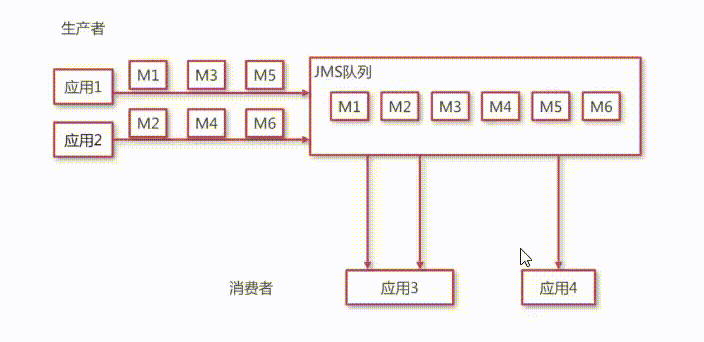
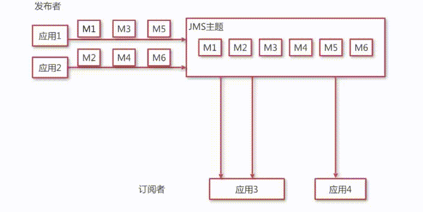
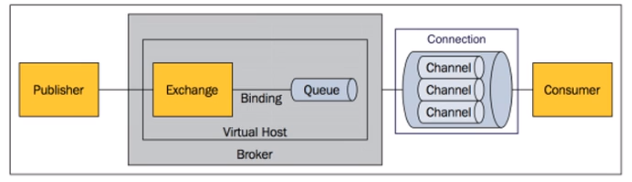
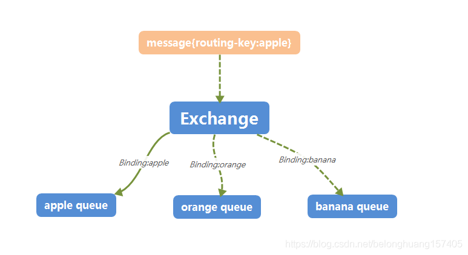
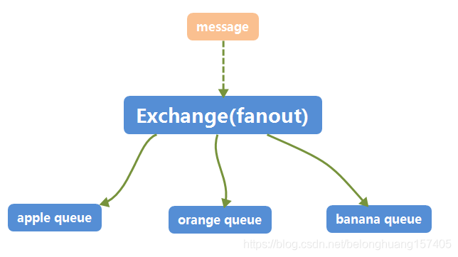
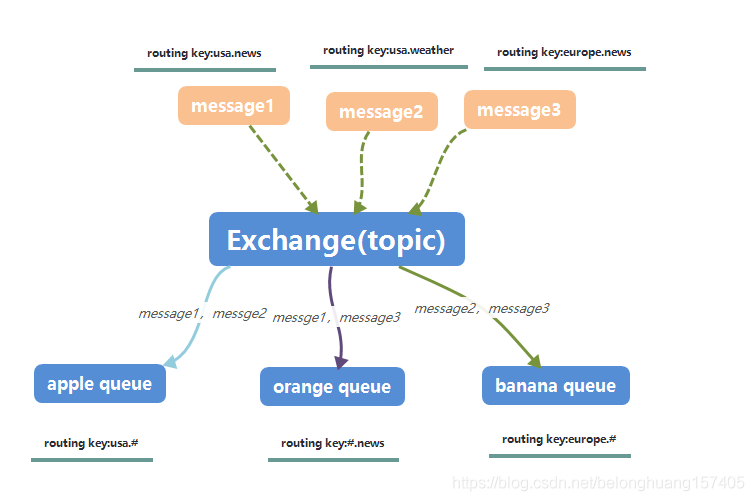

# MessageQueue-基础特性与选型

##  什么是消息队列？

消息队列是在消息的传输过程中保存消息的容器，用于接收消息并以文件的方式存储。

一个消息队列可以被一个也可以被多个消费者消费，包含以下 3 元素：

- **Producer：**消息生产者，负责产生和发送消息到 Broker。
- **Broker：**消息处理中心，负责消息存储、确认、重试等，一般其中会包含多个 Queue。
- **Consumer：**消息消费者，负责从 Broker 中获取消息，并进行相应处理。

<!-- more -->

## MQ模型

### JMS（Java Message Service）

- Point to Point

  使用队列（Queue）作为消息通信载体

  - 每个消息只有一个消费者（Consumer）(即一旦被消费，消息就不再在消息队列中)；
  - 发送者和接收者之间在时间上没有依赖性，也就是说当发送者发送了消息之后，不管接收者有没有正在运行，它不会影响到消息被发送到队列；
  - 接收者在成功接收消息之后需向队列应答成功。

  

  

- Pub/Sub

  发布订阅模型（Pub/Sub） 使用主题（Topic）作为消息通信载体，类似于广播模式,发布者发布一条消息

  - 一个消息可以传递个多个订阅者（即：一个消息可以有多个接受方）
  - 发布者与订阅者具有时间约束，针对某个主题（Topic）的订阅者，**在一条消息广播之后才订阅的用户则是收不到该条消息的**，而且为了消费消息，订阅者必须保持运行的状态。在发布 - 订阅模型中，如果只有⼀个订阅者，那它和队列模型就基本是⼀样的了。所以说，**发布 - 订阅模型在功能层⾯上是可以兼容点到点（P2P）模型的**。
  - 为了缓和这样严格的时间相关性，JMS允许订阅者创建一个可持久化的订阅。这样，即使订阅者没有被激活（运行），它也能接收到发布者的消息。

  `Kafka采用Pub/Sub模型`

  

### AMQP

AMQP（advanced message queuing protocol）是一种binary wire-level protocol（链接协议）。这是其和JMS的本质差别，AMQP不从API层进行限定，而是直接定义网络交换的数据格式。这使得实现了AMQP的provider天然性就是跨平台的。

- 消息（Message）：消息是不具名的，它是有消息头和消息体组成。消息体是不透明的，而消息头是由一系列的可选属性组成，这些属性包括routing-key（路由键）、priority（权重）、delivery-mode（指出该消息可能需要持久化存储）等

- 消息的生成者（Pulisher）：也是一个想交换器发布消息的客户端应用程序

- 交换器（Exchange）：用来接收生产者发送的消息路由给服务器中的队列。它具有四种类型：direct（默认：点对点），fanout，topic，headers

  - **Direct**
    单播，消息中的路由键（routing-key） 如果和Binding中的binding key一致，交换器就发到对应的队列中。
    

  - Fanout
    广播，每个发到fanout类型交换器的消息都会分到所有绑定队列上去。fanout交换器不处理路由键，只是简单的将队列绑定到交换器上，每个发送到交换器的消息都会被转发到与该交换器绑定的所有队列上。很像子网广播，每台子网内的主机都获得了一份复制的消息。fanout类型转发消息是最快的。
    

  - Topic
    有选择的广播，topic交换器通过模式匹配分配消息的路由键属性，将路由键和某个模式进行匹配，此时队列需要绑定到一个模式上。它将路由键和绑定键的字符串分成单词，这些单词用点隔开（a.b）。它同样也会识别两个通配符：符号：# 匹配0或者多个单词，*匹配一个单词。
    

  - headers
    不常用

- 消息队列（Queue）：用来保存消息直到发送给消费者。它是消息的容器，也是消息的终点。一个消息可投入一个或者多个队列、消息一致在队列里面，等待消费者连接到这个队列将其取走。

- 绑定（Binding）：用于消息队列和交换器之间的关联。一个绑定就是基于路由键将交换器和消息队列连接起来的路由规则，所以可以将路由器理解成一个由绑定构成的路由表。Exchange和Queue的绑定可以是多对多的关系。

- 网络连接（Connection）：例如TCP连接。

- 信道（Channel）：多路复用连接中的一条独立的双向庶几乎流通道。信道是建立在真实的TCP连接内的虚拟连接，AMQP命令都是通过信道发出去的，不管是发布消息，订阅队列还是接收消息也都是由信道完成的。因为对于操作系统来说建立和销毁TCP都是非常昂贵的开销，所以引入了信道的概念，以服用一条TCP连接。

- 消息的消费者（Consumer）：白哦是一个从消息队列中取得消息的客户端应用程序。

- 虚拟主机（Virtual Host）：表示一批交换器、消息队列和相关的对象。虚拟主机是共享相同的身份认证和加密环境的独立服务器域。每个virtual host本质上就是一个mini半的RabbitMQ服务器，拥有自己的队列、交换器、绑定和权限机制。virtual host 是AMQP概念的基础，必须在连接时指定，Rabbit MQ默认的Virtual Host是/。

- 实体（Broker）：表示消息队列服务器实体。

| JMS          | AMQP                                                         |                                                              |
| ------------ | ------------------------------------------------------------ | ------------------------------------------------------------ |
| 定义         | Java api                                                     | Wire-protocol                                                |
| 跨语言       | 否                                                           | 是                                                           |
| 跨平台       | 否                                                           | 是                                                           |
| Model        | 提供两种消息模型：（1）、Peer-2-Peer（2）、Pub/sub           | 提供了五种消息模型：（1）、direct exchange（2）、fanout exchange（3）、topic change（4）、headers exchange（5）、system exchange本质来讲，后四种和JMS的pub/sub模型没有太大差别，仅是在路由机制上做了更详细的划分； |
| 支持消息类型 | 多种消息类型：TextMessageMapMessageBytesMessageStreamMessageObjectMessageMessage （只有消息头和属性） | byte[]当实际应用时，有复杂的消息，可以将消息序列化后发送。   |
| 综合评价     | JMS 定义了JAVA API层面的标准；在java体系中，多个client均可以通过JMS进行交互，不需要应用修改代码，但是其对跨平台的支持较差； | AMQP定义了wire-level层的协议标准；天然具有跨平台、跨语言特性。 |

## 消息队列应用场景

- **应用解耦：**消息队列减少了服务之间的耦合性，不同的服务可以通过消息队列进行通信，而不用关心彼此的实现细节。
- **异步处理：**消息队列本身是异步的，它允许接收者在消息发送很长时间后再取回消息。
- **流量削锋：**当上下游系统处理能力存在差距的时候，利用消息队列做一个通用的”载体”，在下游有能力处理的时候，再进行分发与处理。
- **日志处理：**日志处理是指将消息队列用在日志处理中，比如 Kafka 的应用，解决大量日志传输的问题。
- **消息通讯：**消息队列一般都内置了高效的通信机制，因此也可以用在纯的消息通讯，比如实现点对点消息队列，或者聊天室等。
- **消息广播：**如果没有消息队列，每当一个新的业务方接入，我们都要接入一次新接口。有了消息队列，我们只需要关心消息是否送达了队列，至于谁希望订阅，是下游的事情，无疑极大地减少了开发和联调的工作量。

## MQ问题

- **系统可用性降低**：系统可用性在某种程度上降低，在加入MQ之前，不用考虑消息丢失或者说MQ挂掉等等的情况，但是，引入MQ之后就需要去考虑了
- **系统复杂性提高**：加入MQ之后，需要保证**消息没有被重复消费、处理消息丢失的情况、保证消息传递的顺序性**，消息服务器有没有宕机等问题
- **一致性问题**：消息队列可以实现异步，异步确实可以提高系统响应速度。但是，万一消息的真正消费者并没有正确消费消息就会导致数据不一致的情况了。

其实这些问题就是作为一个消息队列中间件所要面对的挑战，这个消息中间件该如何设计才能解决消息框架可能遇到的一系列问题：**故障转移恢复、数据一致性保证、数据可靠性保证**

## 常用消息队列

### Kafka

**kafka，**最初由Linkedin公司设计实现为一个提交日志系统，之后成为apach的一部分。号称大数据的杀手锏，谈到大数据领域内的消息传输，则绕不开kafka，这款为大数据而生的消息中间件，以其**百万级TPS的吞吐量名声大噪**

它是一个分布式的，支持多分区、多副本，基于 Zookeeper 的分布式消息流平台，它同时也是一款开源的基于发布订阅模式的消息引擎系统。

#### 重要概念

- **主题（Topic）：**消息的种类称为主题，可以说一个主题代表了一类消息，相当于是对消息进行分类，主题就像是数据库中的表。
- **分区（partition）：**主题可以被分为若干个分区，同一个主题中的分区可以不在一个机器上，有可能会部署在多个机器上，由此来实现 Kafka 的伸缩性。
- **批次：**为了提高效率， 消息会分批次写入 Kafka，批次就代指的是一组消息。
- **消费者群组（Consumer Group）：**消费者群组指的就是由一个或多个消费者组成的群体。
- **Broker：**一个独立的 Kafka 服务器就被称为 broker，broker 接收来自生产者的消息，为消息设置偏移量，并提交消息到磁盘保存。
- **Broker 集群：**broker 集群由一个或多个 broker 组成。
- **重平衡（Rebalance）：**消费者组内某个消费者实例挂掉后，其他消费者实例自动重新分配订阅主题分区的过程。

### RocketMQ

**RocketMq**，是阿里开源的消息中间件，**他是纯java开发，具有高吞吐量、高可用性、适合大规模分布式系统应用的特点**。RocketMQ思路源于kafka，对消息的可靠传输及事务性做了优化，目前在阿里集团被广泛应用于交易、充值、流计算、消息推送、日志流式处理、binlog分发等场景。

#### 重要概念

- **Name 服务器（NameServer）：**充当注册中心，类似 Kafka 中的 Zookeeper。
- **Broker：**一个独立的 RocketMQ 服务器就被称为 broker，broker 接收来自生产者的消息，为消息设置偏移量。
- **主题（Topic）：**消息的第一级类型，一条消息必须有一个 Topic。
- **子主题（Tag）：**消息的第二级类型，同一业务模块不同目的的消息就可以用相同 Topic 和不同的 Tag 来标识。
- **分组（Group）：**一个组可以订阅多个 Topic，包括生产者组（Producer Group）和消费者组（Consumer Group）。
- **队列（Queue）：**可以类比 Kafka 的分区 Partition。

### RabbitMQ

**RabbitMq**，于2007年发布，使用Erlang语言开发，基于AMQP协议来实现。AMQP的主要特征是面向消息、队列、路由、可靠性、安全。AMQP协议更多用在企业系统内，**对数据一致性，稳定性和可靠性要求很高的场景，对性能和吞吐量要求在其次**。

#### 重要概念

- **信道（Channel）：**消息读写等操作在信道中进行，客户端可以建立多个信道，每个信道代表一个会话任务。
- **交换器（Exchange）：**接收消息，按照路由规则将消息路由到一个或者多个队列；如果路由不到，或者返回给生产者，或者直接丢弃。
- **路由键（RoutingKey）：**生产者将消息发送给交换器的时候，会发送一个 RoutingKey，用来指定路由规则，这样交换器就知道把消息发送到哪个队列。
- **绑定（Binding）：**交换器和消息队列之间的虚拟连接，绑定中可以包含一个或者多个 RoutingKey。

## 消息队列对比

### Kafka

#### 优点

- 高吞吐、低延迟：Kafka 最大的特点就是收发消息非常快，Kafka 每秒可以处理几十万条消息，它的最低延迟只有几毫秒。
- 高伸缩性：每个主题（topic）包含多个分区（partition），主题中的分区可以分布在不同的主机（broker）中。
- 高稳定性：Kafka 是分布式的，一个数据多个副本，某个节点宕机，Kafka 集群能够正常工作。
- 持久性、可靠性、可回溯：Kafka 能够允许数据的持久化存储，消息被持久化到磁盘，并支持数据备份防止数据丢失，支持消息回溯。
- 消息有序：通过控制能够保证所有消息被消费且仅被消费一次。
- 有优秀的第三方 Kafka Web 管理界面 Kafka-Manager，在日志领域比较成熟，被多家公司和多个开源项目使用。

#### 缺点

- Kafka 单机超过 64 个队列/分区，Load 会发生明显的飙高现象，队列越多，load 越高，发送消息响应时间变长。
- 不支持消息路由，不支持延迟发送，不支持消息重试。
- 社区更新较慢。

###  

### RocketMQ

#### 优点

- 高吞吐：借鉴 Kafka 的设计，单一队列百万消息的堆积能力。
- 高伸缩性：灵活的分布式横向扩展部署架构，整体架构其实和 Kafka 很像。
- 高容错性：通过 ACK 机制，保证消息一定能正常消费。
- 持久化、可回溯：消息可以持久化到磁盘中，支持消息回溯。
- 消息有序：在一个队列中可靠的先进先出（FIFO）和严格的顺序传递。
- 支持发布/订阅和点对点消息模型，支持拉、推两种消息模式。
- 提供 docker 镜像用于隔离测试和云集群部署，提供配置、指标和监控等功能丰富的 Dashboard。

#### 缺点

- 不支持消息路由，支持的客户端语言不多，目前是 java 及 c++，其中 c++ 不成熟。
- 部分支持消息有序：需要将同一类的消息 hash 到同一个队列 Queue 中，才能支持消息的顺序，如果同一类消息散落到不同的 Queue中，就不能支持消息的顺序。
- 社区活跃度一般。

###  

### RabbitMQ

#### 优点

- 支持几乎所有最受欢迎的编程语言：Java，C，C ++，C＃，Ruby，Perl，Python，PHP 等等。
- 支持消息路由：RabbitMQ 可以通过不同的交换器支持不同种类的消息路由。
- 消息时序：通过延时队列，可以指定消息的延时时间，过期时间 TTL 等。
- 支持容错处理：通过交付重试和死信交换器（DLX）来处理消息处理故障。
- 提供了一个易用的用户界面，使得用户可以监控和管理消息 Broker。
- 社区活跃度高。

#### 缺点

- Erlang 开发，很难去看懂源码，不利于做二次开发和维护，基本只能依赖于开源社区的快速维护和修复 bug。
- RabbitMQ 吞吐量会低一些，这是因为他做的实现机制比较重。
- 不支持消息有序、持久化不好、不支持消息回溯、伸缩性一般。

##  

## 消息队列选型

**Kafka：**追求高吞吐量，一开始的目的就是用于日志收集和传输，适合产生大量数据的互联网服务的数据收集业务，大型公司建议可以选用，如果有日志采集功能，肯定是首选 Kafka。

**RocketMQ：**天生为金融互联网领域而生，对于可靠性要求很高的场景，尤其是电商里面的订单扣款，以及业务削峰，在大量交易涌入时，后端可能无法及时处理的情况。

RocketMQ 在稳定性上可能更值得信赖，这些业务场景在阿里双 11 已经经历了多次考验，如果你的业务有上述并发场景，建议可以选择 RocketMQ。

**RabbitMQ：**结合 erlang 语言本身的并发优势，性能较好，社区活跃度也比较高，但是不利于做二次开发和维护，不过 RabbitMQ 的社区十分活跃，可以解决开发过程中遇到的 bug。如果你的数据量没有那么大，小公司优先选择功能比较完备的 RabbitMQ。

**ActiveMQ：**官方社区现在对 ActiveMQ 5.x 维护越来越少，较少在大规模吞吐的场景中使用。

###### 来源：

- [JMS与AMQP简述以及比较_做最会吹牛的程序猿的博客-CSDN博客_amqp与jms](https://blog.csdn.net/belonghuang157405/article/details/83184388)

