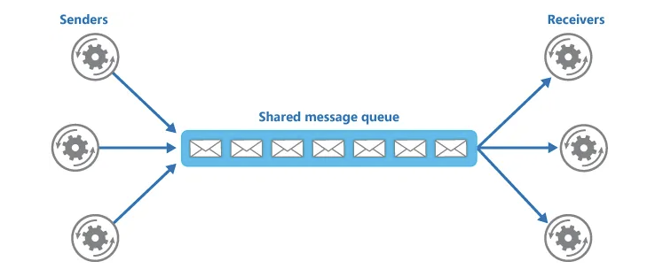
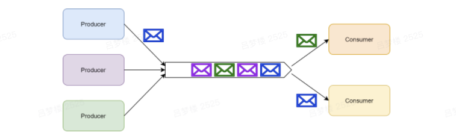
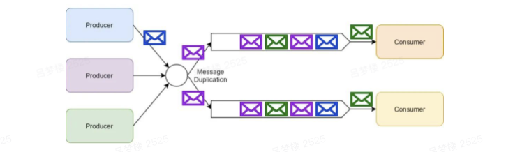

# MessageQueue-选型

##  什么是消息队列？

消息队列是在消息的传输过程中保存消息的容器，用于接收消息并以文件的方式存储。

一个消息队列可以被一个也可以被多个消费者消费，包含以下 3 元素：

- **Producer：**消息生产者，负责产生和发送消息到 Broker。
- **Broker：**消息处理中心，负责消息存储、确认、重试等，一般其中会包含多个 Queue。
- **Consumer：**消息消费者，负责从 Broker 中获取消息，并进行相应处理。

<!-- more -->

## 消息队列模式

- 点对点模式
  多个生产者可以向同一个消息队列发送消息，一个具体的消息只能由一个消费者消费。

  

- 发布/订阅模式

  单个消息可以被多个订阅者并发的获取和处理。

  

## 消息队列应用场景

- **应用解耦：**消息队列减少了服务之间的耦合性，不同的服务可以通过消息队列进行通信，而不用关心彼此的实现细节。
- **异步处理：**消息队列本身是异步的，它允许接收者在消息发送很长时间后再取回消息。
- **流量削锋：**当上下游系统处理能力存在差距的时候，利用消息队列做一个通用的”载体”，在下游有能力处理的时候，再进行分发与处理。
- **日志处理：**日志处理是指将消息队列用在日志处理中，比如 Kafka 的应用，解决大量日志传输的问题。
- **消息通讯：**消息队列一般都内置了高效的通信机制，因此也可以用在纯的消息通讯，比如实现点对点消息队列，或者聊天室等。
- **消息广播：**如果没有消息队列，每当一个新的业务方接入，我们都要接入一次新接口。有了消息队列，我们只需要关心消息是否送达了队列，至于谁希望订阅，是下游的事情，无疑极大地减少了开发和联调的工作量。

## 常用消息队列

### Kafka

**kafka，**最初由Linkedin公司设计实现为一个提交日志系统，之后成为apach的一部分。号称大数据的杀手锏，谈到大数据领域内的消息传输，则绕不开kafka，这款为大数据而生的消息中间件，以其**百万级TPS的吞吐量名声大噪**

它是一个分布式的，支持多分区、多副本，基于 Zookeeper 的分布式消息流平台，它同时也是一款开源的基于发布订阅模式的消息引擎系统。

#### 重要概念

- **主题（Topic）：**消息的种类称为主题，可以说一个主题代表了一类消息，相当于是对消息进行分类，主题就像是数据库中的表。
- **分区（partition）：**主题可以被分为若干个分区，同一个主题中的分区可以不在一个机器上，有可能会部署在多个机器上，由此来实现 Kafka 的伸缩性。
- **批次：**为了提高效率， 消息会分批次写入 Kafka，批次就代指的是一组消息。
- **消费者群组（Consumer Group）：**消费者群组指的就是由一个或多个消费者组成的群体。
- **Broker：**一个独立的 Kafka 服务器就被称为 broker，broker 接收来自生产者的消息，为消息设置偏移量，并提交消息到磁盘保存。
- **Broker 集群：**broker 集群由一个或多个 broker 组成。
- **重平衡（Rebalance）：**消费者组内某个消费者实例挂掉后，其他消费者实例自动重新分配订阅主题分区的过程。

### RocketMQ

**RocketMq**，是阿里开源的消息中间件，**他是纯java开发，具有高吞吐量、高可用性、适合大规模分布式系统应用的特点**。RocketMQ思路源于kafka，对消息的可靠传输及事务性做了优化，目前在阿里集团被广泛应用于交易、充值、流计算、消息推送、日志流式处理、binlog分发等场景。

#### 重要概念

- **Name 服务器（NameServer）：**充当注册中心，类似 Kafka 中的 Zookeeper。
- **Broker：**一个独立的 RocketMQ 服务器就被称为 broker，broker 接收来自生产者的消息，为消息设置偏移量。
- **主题（Topic）：**消息的第一级类型，一条消息必须有一个 Topic。
- **子主题（Tag）：**消息的第二级类型，同一业务模块不同目的的消息就可以用相同 Topic 和不同的 Tag 来标识。
- **分组（Group）：**一个组可以订阅多个 Topic，包括生产者组（Producer Group）和消费者组（Consumer Group）。
- **队列（Queue）：**可以类比 Kafka 的分区 Partition。

### RabbitMQ

**RabbitMq**，于2007年发布，使用Erlang语言开发，基于AMQP协议来实现。AMQP的主要特征是面向消息、队列、路由、可靠性、安全。AMQP协议更多用在企业系统内，**对数据一致性，稳定性和可靠性要求很高的场景，对性能和吞吐量要求在其次**。

#### 重要概念

- **信道（Channel）：**消息读写等操作在信道中进行，客户端可以建立多个信道，每个信道代表一个会话任务。
- **交换器（Exchange）：**接收消息，按照路由规则将消息路由到一个或者多个队列；如果路由不到，或者返回给生产者，或者直接丢弃。
- **路由键（RoutingKey）：**生产者将消息发送给交换器的时候，会发送一个 RoutingKey，用来指定路由规则，这样交换器就知道把消息发送到哪个队列。
- **绑定（Binding）：**交换器和消息队列之间的虚拟连接，绑定中可以包含一个或者多个 RoutingKey。

## 消息队列对比

### Kafka

#### 优点

- 高吞吐、低延迟：Kafka 最大的特点就是收发消息非常快，Kafka 每秒可以处理几十万条消息，它的最低延迟只有几毫秒。
- 高伸缩性：每个主题（topic）包含多个分区（partition），主题中的分区可以分布在不同的主机（broker）中。
- 高稳定性：Kafka 是分布式的，一个数据多个副本，某个节点宕机，Kafka 集群能够正常工作。
- 持久性、可靠性、可回溯：Kafka 能够允许数据的持久化存储，消息被持久化到磁盘，并支持数据备份防止数据丢失，支持消息回溯。
- 消息有序：通过控制能够保证所有消息被消费且仅被消费一次。
- 有优秀的第三方 Kafka Web 管理界面 Kafka-Manager，在日志领域比较成熟，被多家公司和多个开源项目使用。

#### 缺点

- Kafka 单机超过 64 个队列/分区，Load 会发生明显的飙高现象，队列越多，load 越高，发送消息响应时间变长。
- 不支持消息路由，不支持延迟发送，不支持消息重试。
- 社区更新较慢。

###  

### RocketMQ

#### 优点

- 高吞吐：借鉴 Kafka 的设计，单一队列百万消息的堆积能力。
- 高伸缩性：灵活的分布式横向扩展部署架构，整体架构其实和 Kafka 很像。
- 高容错性：通过 ACK 机制，保证消息一定能正常消费。
- 持久化、可回溯：消息可以持久化到磁盘中，支持消息回溯。
- 消息有序：在一个队列中可靠的先进先出（FIFO）和严格的顺序传递。
- 支持发布/订阅和点对点消息模型，支持拉、推两种消息模式。
- 提供 docker 镜像用于隔离测试和云集群部署，提供配置、指标和监控等功能丰富的 Dashboard。

#### 缺点

- 不支持消息路由，支持的客户端语言不多，目前是 java 及 c++，其中 c++ 不成熟。
- 部分支持消息有序：需要将同一类的消息 hash 到同一个队列 Queue 中，才能支持消息的顺序，如果同一类消息散落到不同的 Queue中，就不能支持消息的顺序。
- 社区活跃度一般。

###  

### RabbitMQ

#### 优点

- 支持几乎所有最受欢迎的编程语言：Java，C，C ++，C＃，Ruby，Perl，Python，PHP 等等。
- 支持消息路由：RabbitMQ 可以通过不同的交换器支持不同种类的消息路由。
- 消息时序：通过延时队列，可以指定消息的延时时间，过期时间 TTL 等。
- 支持容错处理：通过交付重试和死信交换器（DLX）来处理消息处理故障。
- 提供了一个易用的用户界面，使得用户可以监控和管理消息 Broker。
- 社区活跃度高。

#### 缺点

- Erlang 开发，很难去看懂源码，不利于做二次开发和维护，基本只能依赖于开源社区的快速维护和修复 bug。
- RabbitMQ 吞吐量会低一些，这是因为他做的实现机制比较重。
- 不支持消息有序、持久化不好、不支持消息回溯、伸缩性一般。

##  

## 消息队列选型

**Kafka：**追求高吞吐量，一开始的目的就是用于日志收集和传输，适合产生大量数据的互联网服务的数据收集业务，大型公司建议可以选用，如果有日志采集功能，肯定是首选 Kafka。

**RocketMQ：**天生为金融互联网领域而生，对于可靠性要求很高的场景，尤其是电商里面的订单扣款，以及业务削峰，在大量交易涌入时，后端可能无法及时处理的情况。

RocketMQ 在稳定性上可能更值得信赖，这些业务场景在阿里双 11 已经经历了多次考验，如果你的业务有上述并发场景，建议可以选择 RocketMQ。

**RabbitMQ：**结合 erlang 语言本身的并发优势，性能较好，社区活跃度也比较高，但是不利于做二次开发和维护，不过 RabbitMQ 的社区十分活跃，可以解决开发过程中遇到的 bug。如果你的数据量没有那么大，小公司优先选择功能比较完备的 RabbitMQ。

**ActiveMQ：**官方社区现在对 ActiveMQ 5.x 维护越来越少，较少在大规模吞吐的场景中使用。
