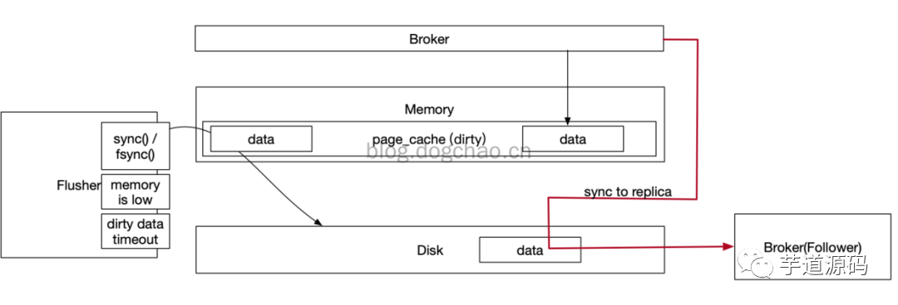
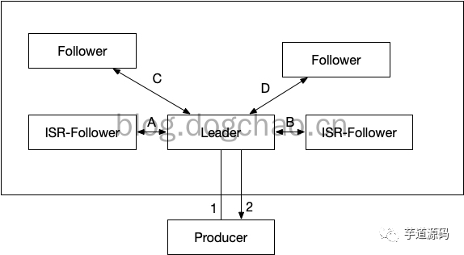
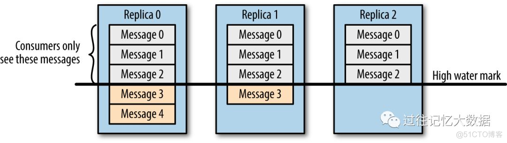
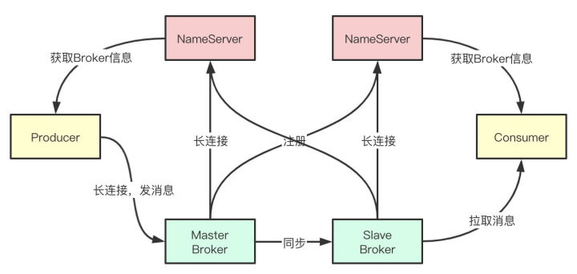
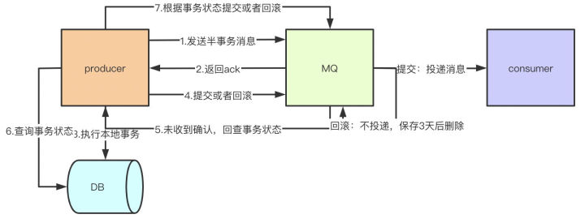

## 为什么使用MQ

- 解耦
- 异步
- 削峰

## MQ选型

**Kafka：**追求高吞吐量，一开始的目的就是用于日志收集和传输，适合产生大量数据的互联网服务的数据收集业务，大型公司建议可以选用，如果有日志采集功能，肯定是首选 Kafka。

**RocketMQ：**天生为金融互联网领域而生，对于可靠性要求很高的场景，尤其是电商里面的订单扣款，以及业务削峰，在大量交易涌入时，后端可能无法及时处理的情况。

RocketMQ 在稳定性上可能更值得信赖，这些业务场景在阿里双 11 已经经历了多次考验，如果你的业务有上述并发场景，建议可以选择 RocketMQ。

**RabbitMQ：**结合 erlang 语言本身的并发优势，性能较好，社区活跃度也比较高，但是不利于做二次开发和维护，不过 RabbitMQ 的社区十分活跃，可以解决开发过程中遇到的 bug。如果你的数据量没有那么大，小公司优先选择功能比较完备的 RabbitMQ。

**ActiveMQ：**官方社区现在对 ActiveMQ 5.x 维护越来越少，较少在大规模吞吐的场景中使用。

<!-- more -->

## Kafka 会不会丢消息

消息丢失会发生在Broker，Producer和Consumer三种

### Producer丢失消息的情况

#### 产生原因

- 生产者(Producer) 调用`send`方法发送消息之后，消息可能因为网络问题并没有发送过去。

- 为了提升效率，减少IO，producer在发送数据时可以将多个请求进行合并后发送。被合并的请求咋发送一线缓存在本地buffer中。

  一旦producer被非法的停止了，那么buffer中的数据将丢失，broker将无法收到该部分数据。又或者，当Producer客户端内存不够时，如果采取的策略是丢弃消息（另一种策略是block阻塞），消息也会被丢失。抑或，消息产生（异步产生）过快，导致挂起线程过多，内存不足，导致程序崩溃，消息丢失。

#### 解决思路

- 为了确定消息是发送成功，我们要判断消息发送的结果。可以采用为其添加回调函数的形式
- 为 Producer 的`retries`（重试次数）设置一个比较合理的值，一般是 3
- 异步发送消息改为同步发送消。或者service产生消息时，使用阻塞的线程池，并且线程数有一定上限。整体思路是控制消息产生速度。
- 扩大Buffer的容量配置。这种方式可以缓解该情况的出现，但不能杜绝。
- service不直接将消息发送到buffer（内存），而是将消息写到本地的磁盘中（数据库或者文件），由另一个（或少量）生产线程进行消息发送。相当于是在buffer和service之间又加了一层空间更加富裕的缓冲层。

### Consumer丢失消息的情况

Consumer消费消息有下面几个步骤：

- 接收消息
- 处理消息
- 反馈“处理完毕”（commited）

Consumer的消费方式主要分为两种：

- 自动提交offset，Automatic Offset Committing
- 手动提交offset，Manual Offset Control

#### 产生原因

Consumer自动提交的机制是根据一定的时间间隔，将收到的消息进行commit。commit过程和消费消息的过程是异步的。也就是说，可能存在消费过程未成功（比如抛出异常），commit消息已经提交了。此时消息就丢失了。

#### 解决办法

手动关闭闭自动提交 offset，每次在真正消费完消息之后之后再自己手动提交 offset 

### Broker丢失消息的情况

Broker丢失消息是由于Kafka本身的原因造成的，kafka为了得到更高的性能和吞吐量，将数据异步批量的存储在磁盘中。消息的刷盘过程，为了提高性能，减少刷盘次数，kafka采用了批量刷盘的做法。即，按照一定的消息量，和时间间隔进行刷盘。这种机制也是由于linux操作系统决定的。将[数据存储](https://cloud.tencent.com/product/cdcs?from=10680)到linux操作系统种，会先存储到页缓存（Page cache）中，按照时间或者其他条件进行刷盘（从page cache到file），或者通过fsync命令强制刷盘。数据在page cache中时，如果系统挂掉，数据会丢失。

Broker在linux服务器上高速读写以及同步到Replica

上图简述了broker写数据以及同步的一个过程。broker写数据只写到PageCache中，而pageCache位于内存。这部分数据在断电后是会丢失的。pageCache的数据通过linux的flusher程序进行刷盘。刷盘触发条件有三：

- 主动调用sync或fsync函数
- 可用内存低于阀值
- dirty data时间达到阀值。dirty是pagecache的一个标识位，当有数据写入到pageCache时，pagecache被标注为dirty，数据刷盘以后，dirty标志清除。

Broker配置刷盘机制，是通过调用fsync函数接管了刷盘动作。从单个Broker来看，pageCache的数据会丢失。

理论上，要完全让kafka保证单个broker不丢失消息是做不到的，只能通过调整刷盘机制的参数缓解该情况。比如，减少刷盘间隔，减少刷盘数据量大小。时间越短，性能越差，可靠性越好（尽可能可靠）。这是一个选择题。

为了解决该问题，kafka通过producer和broker协同处理单个broker丢失参数的情况。一旦producer发现broker消息丢失，即可自动进行retry。除非retry次数超过阀值（可配置），消息才会丢失。此时需要生产者客户端手动处理该情况。那么producer是如何检测到数据丢失的呢？是通过ack机制，类似于http的三次握手的方式。

- acks=0，producer不等待broker的响应，效率最高，但是消息很可能会丢。
- acks=1，leader broker收到消息后，不等待其他follower的响应，即返回ack。也可以理解为ack数为1。此时，如果follower还没有收到leader同步的消息leader就挂了，那么消息会丢失。按照上图中的例子，如果leader收到消息，成功写入PageCache后，会返回ack，此时producer认为消息发送成功。但此时，按照上图，数据还没有被同步到follower。如果此时leader断电，数据会丢失。
- acks=-1，leader broker收到消息后，挂起，等待所有ISR列表中的follower返回结果后，再返回ack。-1等效与all。这种配置下，只有leader写入数据到pagecache是不会返回ack的，还需要所有的ISR返回“成功”才会触发ack。如果此时断电，producer可以知道消息没有被发送成功，将会重新发送。如果在follower收到数据以后，成功返回ack，leader断电，数据将存在于原来的follower中。在重新选举以后，新的leader会持有该部分数据。数据从leader同步到follower，需要2步：
- - 数据从pageCache被刷盘到disk。因为只有disk中的数据才能被同步到replica。
  - 数据同步到replica，并且replica成功将数据写入PageCache。在producer得到ack后，哪怕是所有机器都停电，数据也至少会存在于leader的磁盘内。

上面第三点提到了ISR的列表的follower，需要配合另一个参数才能更好的保证ack的有效性。ISR是Broker维护的一个“可靠的follower列表”，in-sync Replica列表，broker的配置包含一个参数：min.insync.replicas。该参数表示ISR中最少的副本数。如果不设置该值，ISR中的follower列表可能为空。此时相当于acks=1。

如上图中：

- acks=0，总耗时f(t) = f(1)。
- acks=1，总耗时f(t) = f(1) + f(2)。
- acks=-1，总耗时f(t) = f(1) + max( f(A) , f(B) ) + f(2)。

性能依次递减，可靠性依次升高。

## 重复消费

### 产生原因：

**已经消费了数据，但是offset没有成功提交。其中很大一部分原因在于发生了再均衡。**

- 消费者宕机、重启等。导致消息已经消费但是没有提交offset。
- 消费者使用自动提交offset，但当还没有提交的时候，有新的消费者加入或者移除，发生了rebalance。再次消费的时候，消费者会根据提交的偏移量来，于是重复消费了数据。
- 消息处理耗时，或者消费者拉取的消息量太多，处理耗时，超过了max.poll.interval.ms的配置时间，导致认为当前消费者已经死掉，触发再均衡。

### 解决方案

- 乐观锁：每个数据都有一个版本号，和当前版本号相同时进行更新操作
- 去重表（缓存）：唯一索引，如果已存在值，就不进行更新了

## Kafka consumer 是推还是拉？

customer 应该从 brokes 拉取消息还是 brokers 将消息推送到 consumer，也就是 pull 还 push。在这方面，Kafka 遵循了一种大部分消息系统共同的传统的设计：producer 将消息推送到 broker，consumer 从broker 拉取消息。

## Kafka 的设计架构

- Producer
- Consumer
- Topic
- Consumer Group
- Broker 
- Partition
- Offset

## Kafka 分区的目的

实现负载均衡。分区对于消费者来说，可以提高并发度，提高效率。

## Kafka 是如何做到消息的有序性

kafka 中的每个 partition 中的消息在写入时都是有序的，而且单独一个 partition 只能由一个消费者去消费，可以在里面保证消息的顺序性。但是分区之间的消息是不保证有序的。

## ISR、OSR、AR 是什么

ISR：In-Sync Replicas 副本同步队列
OSR：Out-of-Sync Replicas
AR：Assigned Replicas 所有副本

ISR是由leader维护，follower从leader同步数据有一些延迟（具体可以参见 图文了解 Kafka 的副本复制机制），超过相应的阈值会把 follower 剔除出 ISR, 存入OSR（Out-of-Sync Replicas ）列表，新加入的follower也会先存放在OSR中。AR=ISR+OSR。

## Kafka 数据一致性原理

一致性就是说不论是老的 Leader 还是新选举的 Leader，Consumer 都能读到一样的数据。

假设分区的副本为3，其中副本0是 Leader，副本1和副本2是 follower，并且在 ISR 列表里面。虽然副本0已经写入了 Message4，但是 Consumer 只能读取到 Message2。因为所有的 ISR 都同步了 Message2，只有 High Water Mark 以上的消息才支持 Consumer 读取，而 High Water Mark 取决于 ISR 列表里面偏移量最小的分区，对应于上图的副本2，这个很类似于木桶原理。

这样做的原因是还没有被足够多副本复制的消息被认为是“不安全”的，如果 Leader 发生崩溃，另一个副本成为新 Leader，那么这些消息很可能丢失了。如果我们允许消费者读取这些消息，可能就会破坏一致性。试想，一个消费者从当前 Leader（副本0） 读取并处理了 Message4，这个时候 Leader 挂掉了，选举了副本1为新的 Leader，这时候另一个消费者再去从新的 Leader 读取消息，发现这个消息其实并不存在，这就导致了数据不一致性问题。

当然，引入了 High Water Mark 机制，会导致 Broker 间的消息复制因为某些原因变慢，那么消息到达消费者的时间也会随之变长（因为我们会先等待消息复制完毕）。延迟时间可以通过参数 replica.lag.time.max.ms 参数配置，它指定了副本在复制消息时可被允许的最大延迟时间。

## Kafka 消费者是否可以消费指定分区消息

Kafa consumer消费消息时，向broker发出fetch请求去消费特定分区的消息，consumer指定消息在日志中的偏移量（offset），就可以消费从这个位置开始的消息，customer拥有了offset的控制权，可以向后回滚去重新消费之前的消息，这是很有意义的

## Kafka 的再均衡

在Kafka中，当有新消费者加入或者订阅的topic数发生变化时，会触发Rebalance(再均衡：在同一个消费者组当中，分区的所有权从一个消费者转移到另外一个消费者)机制，Rebalance顾名思义就是重新均衡消费者消费。Rebalance的过程如下：
第一步：所有成员都向coordinator发送请求，请求入组。一旦所有成员都发送了请求，coordinator会从中选择一个consumer担任leader的角色，并把组成员信息以及订阅信息发给leader。
第二步：leader开始分配消费方案，指明具体哪个consumer负责消费哪些topic的哪些partition。一旦完成分配，leader会将这个方案发给coordinator。coordinator接收到分配方案之后会把方案发给各个consumer，这样组内的所有成员就都知道自己应该消费哪些分区了。
所以对于Rebalance来说，Coordinator起着至关重要的作用

## kafka 维护消费状态跟踪的方法有什么

Kafka 采用了不同的策略。Topic 被分成了若干分区，每个分区在同一时间只被一个 consumer 消费。这意味着每个分区被消费的消息在日志中的位置仅仅是一个简单的整数：offset。这样就很容易标记每个分区消费状态就很容易了，仅仅需要一个整数而已。这样消费状态的跟踪就很简单了。

这带来了另外一个好处：consumer 可以把 offset 调成一个较老的值，去重新消费老的消息。

## Kafka主从同步

Kafka允许topic的分区拥有若干副本，这个数量是可以配置的，你可以为每个topic配置副本的数量。Kafka会自动在每个个副本上备份数据，所以当一个节点down掉时数据依然是可用的。

Kafka的副本功能不是必须的，你可以配置只有一个副本，这样其实就相当于只有一份数据。

## Zookeeper 对于 Kafka 的作用是什么

Zookeeper 是一个开放源码的、高性能的协调服务，它用于 Kafka 的分布式应用。

Zookeeper 主要用于在集群中不同节点之间进行通信

在 Kafka 中，它被用于提交偏移量，因此如果节点在任何情况下都失败了，它都可以从之前提交的偏移量中获取除此之外，它还执行其他活动，如: leader 检测、分布式同步、配置管理、识别新节点何时离开或连接、集群、节点实时状态等等。

## Kafka数据传输的事务定义有哪三种

和 MQTT 的事务定义一样都是 3 种。

（1）最多一次: 消息不会被重复发送，最多被传输一次，但也有可能一次不传输

（2）最少一次: 消息不会被漏发送，最少被传输一次，但也有可能被重复传输.

（3）精确的一次（Exactly once）: 不会漏传输也不会重复传输,每个消息都传输被一次而且仅仅被传输一次，这是大家所期望的

## Kafka 判断一个节点是否还存活条件

（1）节点必须可以维护和 ZooKeeper 的连接，Zookeeper 通过心跳机制检查每个节点的连接

（2）如果节点是个 follower,他必须能及时的同步 leader 的写操作，延时不能太久

## Kafka 与传统 MQ 消息系统之间有什么区别

(1).Kafka 持久化日志，这些日志可以被重复读取和无限期保留

(2).Kafka 是一个分布式系统：它以集群的方式运行，可以灵活伸缩，在内部通过复制数据提升容错能力和高可用性

(3).Kafka 支持实时的流式处理

## 消费者故障，出现活锁问题如何解决

出现“活锁”的情况，是它持续的发送心跳，但是没有处理。为了预防消费者在这种情况下一直持有分区，我们使用 max.poll.interval.ms 活跃检测机制。 在此基础上，如果你调用的 poll 的频率大于最大间隔，则客户端将主动地离开组，以便其他消费者接管该分区。 发生这种情况时，你会看到 offset 提交失败。这是一种安全机制，保障只有活动成员能够提交 offset。所以要留在组中，你必须持续调用 poll。

## Kafka如何控制消费的位置

kafka 使用 seek(TopicPartition, long)指定新的消费位置。用于查找服务器保留的最早和最新的 offset 的特殊的方法也可用（seekToBeginning(Collection) 和seekToEnd(Collection)）

## Kafka 的高可用机制是什么

多副本冗余的高可用机制 

producer、broker 和 consumer 都会拥有多个

分区选举机制 、 消息确认机制

## Kafka 是如何实现高吞吐率的

Kafka是分布式消息系统，需要处理海量的消息，Kafka的设计是把所有的消息都写入速度低容量大的硬盘，以此来换取更强的存储能力，但实际上，使用硬盘并没有带来过多的性能损失。kafka主要使用了以下几个方式实现了超高的吞吐率：

- 顺序读写；
- 零拷贝
- 文件分段
- 批量发送
- 数据压缩。

## 如何为Kafka集群选择合适的Topics/Partitions数量

## Kafka 分区数可以增加或减少吗

只能增加，不能减少

## 消息如何分发

若该队列⾄少有⼀个消费者订阅，消息将以循环（round-robin）的方式发送给消费者。每条消息只会分发给⼀个订阅的消费者（前提是消费者能够正常处理消息并进行确认）。

## Consumer commit机制是什么

偏移量的确认，在push模式下是通过ack来确定，如果失败进去重试队列，在pull模式下可以自动确认也可手动确认，但是异常就没办法进入重试队列

## RocketMQ实现原理

RocketMQ由NameServer注册中心集群、Producer生产者集群、Consumer消费者集群和若干Broker（RocketMQ进程）组成，它的架构原理是这样的：

1. Broker在启动的时候去向所有的NameServer注册，并保持长连接，每30s发送一次心跳
2. Producer在发送消息的时候从NameServer获取Broker服务器地址，根据负载均衡算法选择一台服务器来发送消息
3. Conusmer消费消息的时候同样从NameServer获取Broker地址，然后主动拉取消息来消费

## 为什么RocketMQ不使用Zookeeper作为注册中心呢？

我认为有以下几个点是不使用zookeeper的原因：

1. 根据CAP理论，同时最多只能满足两个点，而zookeeper满足的是CP，也就是说zookeeper并不能保证服务的可用性，zookeeper在进行选举的时候，整个选举的时间太长，期间整个集群都处于不可用的状态，而这对于一个注册中心来说肯定是不能接受的，作为服务发现来说就应该是为可用性而设计。
2. 基于性能的考虑，NameServer本身的实现非常轻量，而且可以通过增加机器的方式水平扩展，增加集群的抗压能力，而zookeeper的写是不可扩展的，而zookeeper要解决这个问题只能通过划分领域，划分多个zookeeper集群来解决，首先操作起来太复杂，其次这样还是又违反了CAP中的A的设计，导致服务之间是不连通的。
3. 持久化的机制来带的问题，ZooKeeper 的 ZAB 协议对每一个写请求，会在每个 ZooKeeper 节点上保持写一个事务日志，同时再加上定期的将内存数据镜像（Snapshot）到磁盘来保证数据的一致性和持久性，而对于一个简单的服务发现的场景来说，这其实没有太大的必要，这个实现方案太重了。而且本身存储的数据应该是高度定制化的。
4. 消息发送应该弱依赖注册中心，而RocketMQ的设计理念也正是基于此，生产者在第一次发送消息的时候从NameServer获取到Broker地址后缓存到本地，如果NameServer整个集群不可用，短时间内对于生产者和消费者并不会产生太大影响。

## RocketMQ Broker怎么保存数据

RocketMQ主要的存储文件包括commitlog文件、consumequeue文件、indexfile文件。

Broker在收到消息之后，会把消息保存到commitlog的文件当中，而同时在分布式的存储当中，每个broker都会保存一部分topic的数据，同时，每个topic对应的messagequeue下都会生成consumequeue文件用于保存commitlog的物理位置偏移量offset，indexfile中会保存key和offset的对应关系。

## RocketMQ中Master和Slave间怎么同步数据

消息在master和slave之间的同步是根据raft协议来进行的：

1. 在broker收到消息后，会被标记为uncommitted状态
2. 然后会把消息发送给所有的slave
3. slave在收到消息之后返回ack响应给master
4. master在收到超过半数的ack之后，把消息标记为committed
5. 发送committed消息给所有slave，slave也修改状态为committed

## RocketMQ为什么速度快

是因为使用了顺序存储、Page Cache和异步刷盘。

1. 我们在写入commitlog的时候是顺序写入的，这样比随机写入的性能就会提高很多
2. 写入commitlog的时候并不是直接写入磁盘，而是先写入操作系统的PageCache
3. 最后由操作系统异步将缓存中的数据刷到磁盘

## 什么是事务、半事务消息？怎么实现的？

事务消息就是MQ提供的类似XA的分布式事务能力，通过事务消息可以达到分布式事务的最终一致性。

半事务消息就是MQ收到了生产者的消息，但是没有收到二次确认，不能投递的消息。

实现原理如下：

1. 生产者先发送一条半事务消息到MQ
2. MQ收到消息后返回ack确认
3. 生产者开始执行本地事务
4. 如果事务执行成功发送commit到MQ，失败发送rollback
5. 如果MQ长时间未收到生产者的二次确认commit或者rollback，MQ对生产者发起消息回查
6. 生产者查询事务执行最终状态
7. 根据查询事务状态再次提交二次确认

最终，如果MQ收到二次确认commit，就可以把消息投递给消费者，反之如果是rollback，消息会保存下来并且在3天后被删除。

## RabbitMQ消息基于什么传输

RabbitMQ使⽤信道的⽅式来传输数据。信道是建⽴在真实的TCP连接内的虚拟连接，且每条

TCP连接上的信道数量没有限制。

1. RabbitMQ采⽤类似NIO（Non-blocking I/O）做法，选择TCP连接复⽤，不仅可以减少性能开销，同时也便于管理。
2. 每个线程把持⼀个信道，所以信道服⽤了Connection的TCP连接。同时RabbitMQ可以确保每个线程的私密性，就像拥有独立的连接一样。

## RabbitMQ消息怎么路由

从概念上来说，消息路由必须有三部分：交换器、路由、绑定。⽣产者把消息发布到交换器上；绑定决定了消息如何从交换器路由到特定的队列；消息最终到达队列，并被消费者接收。

1. 消息发布到交换器时，消息将拥有⼀个路由键（routing key），在消息创建时设定。
2. 通过队列路由键，可以把队列绑定到交换器上。
3. 消息到达交换器后，RabbitMQ会将消息的路由键与队列的路由键进行匹配（针对不同的交换器有不同的路由规则）。
4. 如果能够匹配到队列，则消息会投递到相应队列中；如果不能匹配到任何队列，消息将进⼊ “⿊洞”。

## RabbitMQ 的高可用性

在镜像集群模式下，你创建的 queue，无论元数据还是 queue 里的消息都会存在于多个实例上，就是说，每个 RabbitMQ 节点都有这个 queue 的一个完整镜像，包含 queue 的全部数据的意思。然后每次你写消息到 queue 的时候，都会自动把消息同步到多个实例的 queue 上。

## RocketMQ 的高可用性

- 多master 模式
- 多master多slave异步复制模式
- 多 master多slave同步双写模式

多master多slave模式通信过程如下

Producer 与 NameServer集群中的其中一个节点（随机选择）建立长连接，定期从 NameServer 获取 Topic 路由信息，并向提供 Topic 服务的 Broker Master 建立长连接，且定时向 Broker 发送心跳。Producer 只能将消息发送到 Broker master，但是 Consumer 则不一样，它同时和提供 Topic 服务的 Master 和 Slave建立长连接，既可以从 Broker Master 订阅消息，也可以从 Broker Slave 订阅消息。

## 顺序消费

### RabbitMQ

拆分多个 queue，每个 queue 一个 consumer，就是多一些 queue 而已，确实是麻烦点；或者就一个 queue 但是对应一个 consumer，然后这个 consumer 内部用内存队列做排队，然后分发给底层不同的 worker 来处理。

### Kafka

- 一个 topic，一个 partition，一个 consumer，内部单线程消费，单线程吞吐量太低，一般不会用这个。
- 写 N 个内存 queue，具有相同 key 的数据都到同一个内存 queue；然后对于 N 个线程，每个线程分别消费一个内存 queue 即可，这样就能保证顺序性。

## 消息积压

- 先修复 consumer 的问题，确保其恢复消费速度，然后将现有 consumer 都停掉。
- 新建一个 topic，partition 是原来的 10 倍，临时建立好原先 10 倍的 queue 数量。
- 然后写一个临时的分发数据的 consumer 程序，这个程序部署上去消费积压的数据，消费之后不做耗时的处理，直接均匀轮询写入临时建立好的 10 倍数量的 queue。
- 接着临时征用 10 倍的机器来部署 consumer，每一批 consumer 消费一个临时 queue 的数据。这种做法相当于是临时将 queue 资源和 consumer 资源扩大 10 倍，以正常的 10 倍速度来消费数据。
- 等快速消费完积压数据之后，得恢复原先部署的架构，重新用原先的 consumer 机器来消费消息。

## RabbitMQ设置过期时间，部分消息丢失

批量重导

## MQ磁盘写满

代表已经积压过度。添加新消费者，或记录SEEK 号后，接入新程序消费后丢弃，空闲时刻重新SEEK消费

## 如何设计MQ

- 首先这个 mq 得支持可伸缩性吧，就是需要的时候快速扩容，就可以增加吞吐量和容量，那怎么搞？设计个分布式的系统呗，参照一下 kafka 的设计理念，broker -> topic -> partition，每个 partition 放一个机器，就存一部分数据。如果现在资源不够了，简单啊，给 topic 增加 partition，然后做数据迁移，增加机器，不就可以存放更多数据，提供更高的吞吐量了？
- 其次你得考虑一下这个 mq 的数据要不要落地磁盘吧？那肯定要了，落磁盘才能保证别进程挂了数据就丢了。那落磁盘的时候怎么落啊？顺序写，这样就没有磁盘随机读写的寻址开销，磁盘顺序读写的性能是很高的，这就是 kafka 的思路。
- 其次你考虑一下你的 mq 的可用性啊？这个事儿，具体参考之前可用性那个环节讲解的 kafka 的高可用保障机制。多副本 -> leader & follower -> broker 挂了重新选举 leader 即可对外服务。
- 能不能支持数据 0 丢失啊？可以的，参考我们之前说的那个 kafka 数据零丢失方案。

## Redis做消息队列与其他消息队列相比有什么不同

### Redis作为消息队列

- 如果你的需求是快产快消的即时消费场景，并且生产的消息立即被消费者消费掉。
- 如果速度是你十分看重的，比如慢了一秒好几千万这种。
- 如果允许出现消息丢失的场景。
- 如果你不需要系统保存你发送过的消息。
- 如果需要处理的数据量并不是那么巨大。

### 其他消息队列

- 如果你想要稳定的消息队列。
- 如果你想要你发送过的消息可以保留一定的时间，并不是无迹可寻的时候。
- 如果你无法忍受数据的丢失。
- 如果速度不需要那么的快。
- 如果需要处理数据量巨大的时候。

### 应用场景分析

Redis：轻量级，高并发，延迟敏感
即时数据分析、秒杀计数器、缓存等。

其他MQ：重量级，高并发，异步
批量数据异步处理、并行任务串行化，高负载任务的负载均衡等。

###### 来源:

https://juejin.cn/post/6844904094021189639

https://cloud.tencent.com/developer/article/1757914

https://www.cnblogs.com/yangyongjie/p/14675119.html

https://zhuanlan.zhihu.com/p/368773517

https://blog.51cto.com/u_15127589/2679155

https://zhuanlan.zhihu.com/p/282993811

https://www.cnblogs.com/helios-fz/p/12119727.html

https://juejin.cn/post/6973662966331736101

