# Buffer Pool

## 什么是Buffer Pool

MySQL以Page页为单位，默认大小16K，会在Buffer Pool中划分出很多的缓存页，并用描述数据（元数据）记录缓存页所在的表空间 数据页编号、Buffer Pool地址等信息，底层采用链表数据结构管理Page

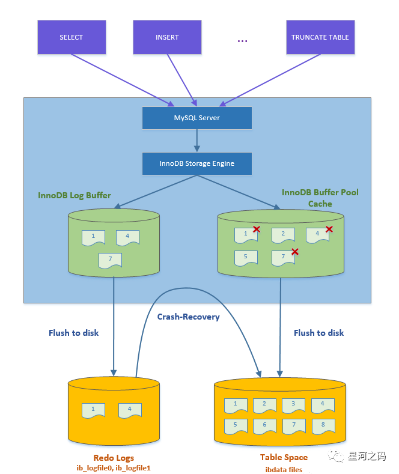

上图描述了Buffer Pool在innoDB中的位置，通过它所在的位置我们可以大概知道它的工作流程：

所有的更新和读取都是在Buffer Pool中进行。并由异步线程不断刷盘。查询数据时通过hash表快速定位到对应的缓存页

- innodb 读操作，先从buffer_pool中查看数据的数据页是否存在，如果不存在，则将page从磁盘读取到buffer pool中。
- innodb 写操作，先把数据和日志写入 buffer pool 和 log buffer，再由后台线程以一定频率将 buffer 中的内容刷到磁盘，**「这个刷盘机制叫做Checkpoint」**。

<!-- more -->

写操作的事务持久性由redo log 落盘保证，buffer pool只是为了提高读写效率。

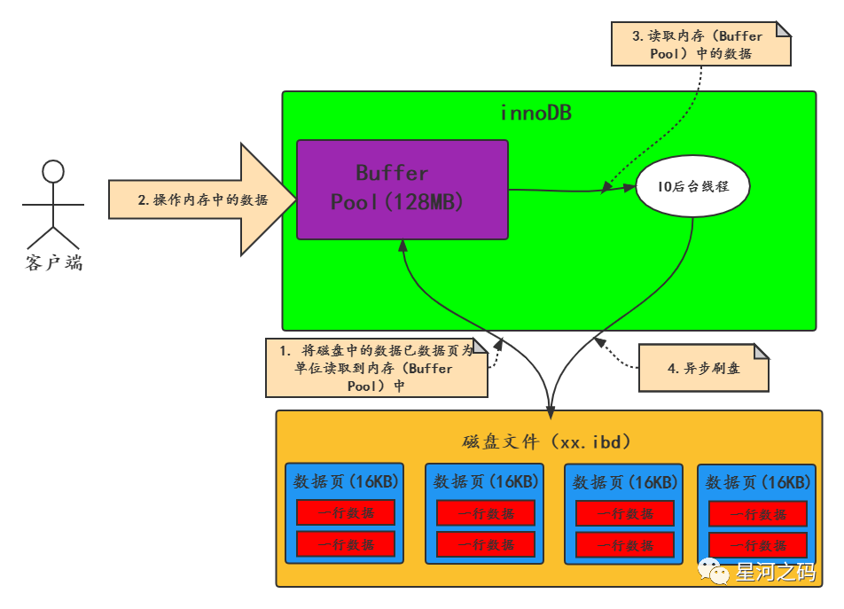

**「Buffer Pool缓存表数据与索引数据，把磁盘上的数据加载到缓冲池，避免每次访问都进行磁盘IO，起到加速访问的作用」**。

- Buffer Pool是一块内存区域，是一种**「降低磁盘访问的机制」**。
- 数据库的读写都是在buffer pool上进行，和undo log/redo log/redo log buffer/binlog一起使用，后续会把数据刷到硬盘上。
- Buffer Pool默认大小 128M，用于缓存数据页（16KB）。

Buffer Pool 是 innodb的数据缓存， 除了缓存「索引页」和「数据页」，还包括了 undo 页，插入缓存、自适应哈希索引、锁信息等。

**「buffer pool绝大多数page都是 data page（包括index page）」**。

**「innodb 还有日志缓存 log buffer，保存redo log」**。

<table>
    <tr>
        <th rowspan="6" style="text-align: center; vertical-align: middle;">Buffer Pool</th><th style="font-weight: normal">数据页</th>
    </tr>
    <tr>
        <td>索引页</td>
    </tr>
      <tr>
        <td>缓存插入页</td>
    </tr>
      <tr>
        <td>UNDO页</td>
    </tr>
      <tr>
        <td>自适应HASH页</td>
    </tr>
      <tr>
        <td>锁信息</td>
    </tr>
</table>

## Buffer Pool的控制块

Buffer Pool中缓存的是数据页，数据页大小跟磁盘默认数据页大小一样（16K），为了更好管理的缓存页，Buffer Pool有一个**「描述数据的区域」** ：

**「InnoDB 为每一个缓存的数据页都创建了一个单独的区域，记录的数据页的元数据信息，包括数据页所属表空间、数据页编号、缓存页在Buffer Pool中的地址，链表节点信息、一些锁信息以及 LSN 信息等，这个区域被称之为控制块」**。

**「控制块和缓存页是一一对应的，它们都被存放到 Buffer Pool 中，其中控制块被存放到 Buffer Pool 的前边，缓存页被存放到 Buffer Pool 后边」**，控制块大概占缓存页大小的5%，16 * 1024 * 0.05 = 819个字节左右。

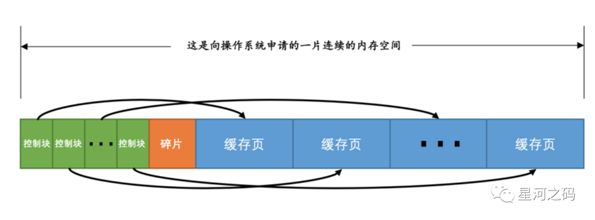

上图展示了控制块与数据页的对应关系，可以看到在控制块和数据页之间有一个碎片空间。

> 这里可能会有疑问，为什么会有碎片空间呢？

上面说到，数据页大小为16KB，控制块大概为800字节，当我们划分好所有的控制块与数据页后，可能会有剩余的空间不够一对控制块和缓存页的大小，这部分就是多余的碎片空间。如果把 Buffer Pool 的大小设置的刚刚好的话，也可能不会产生碎片。

## Buffer Pool的管理

**「Buffer Pool里有三个链表，LRU链表，free链表，flush链表，InnoDB正是通过这三个链表的使用来控制数据页的更新与淘汰的」**。

### Buffer Pool的初始化

**「当启动 Mysql 服务器的时候，需要完成对 Buffer Pool 的初始化过程，即分配 Buffer Pool 的内存空间，把它划分为若干对控制块和缓存页」**。

- **「申请空间」**

  Mysql 服务器启动，就会根据设置的Buffer Pool大小（innodb_buffer_pool_size）超出一些，去操作系统**「申请一块连续内存区域」**作为Buffer Pool的内存区域。

  > 这里之所以申请的内存空间会比innodb_buffer_pool_size大一些，主要是因为里面还要存放每个缓存页的控制块。

- **「划分空间」**

  当内存区域申请完毕之后，数据库就会按照默认的缓存页的16KB的大小以及对应的800个字节左右的控制块的大小，在Buffer Pool中划分**「成若干个【控制块&缓冲页】对」**。

划分空间后Buffer Pool的缓存页是都是空的，里面什么都没有，当要对数据执行增删改查的操作的时候，才会把数据对应的页从磁盘文件里读取出来，放入Buffer Pool中的缓存页中。

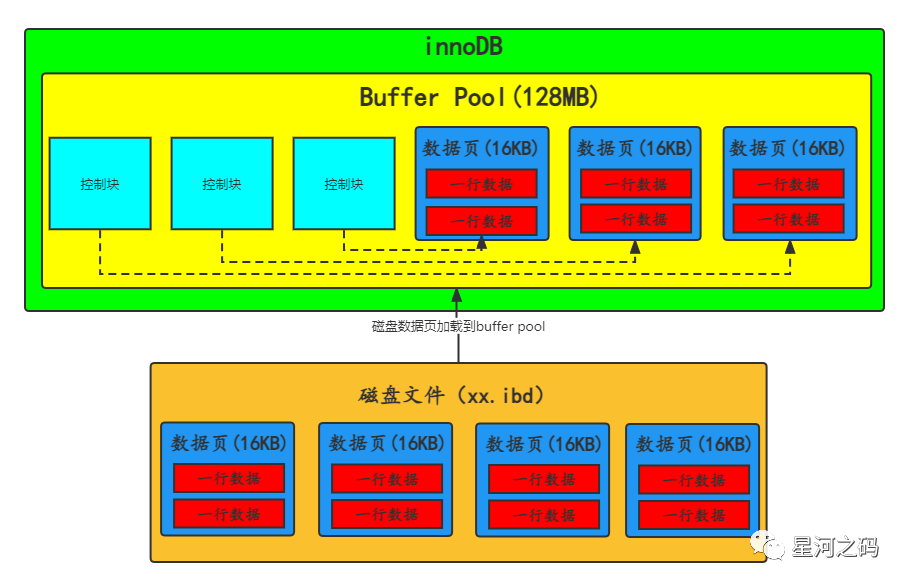

### Free 链表

**「Free链表即空闲链表，是一个双向链表，由一个基础节点和若干个子节点组成，记录空闲的数据页对应的控制块信息」**

- Free链表作用：帮助找到空闲的缓存页

  记录空闲的缓存页。从磁盘加载数据时，通过free链表找到空闲缓存页进行写入

  - **「基节点」**

  - - **「是一块单独申请的内存空间（约占40字节）。并不在Buffer Pool的连续内存空间里」**。
    - 包含链表中子节点中头节点地址，尾节点地址，以及当前链表中节点的数量等信息。

  - **「子节点」**

  - - **「每个节点就是个空闲缓存页的控制块，即只要一个缓存页空闲，那它的控制块就会被放入free链表」**
    - 每个控制块块里都有两个指针free_pre（指向上一个节点），free_next（指向下一个节点）

  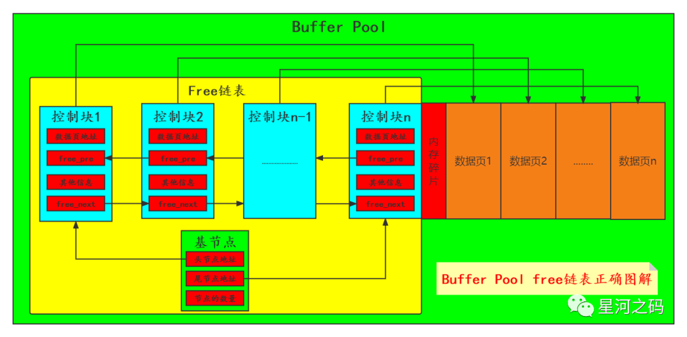

#### 磁盘页加载到BufferPool的缓存页流程

- **「步骤一」**

  *「从free链表中取出一个空闲的控制块以及对应缓冲页」**。

  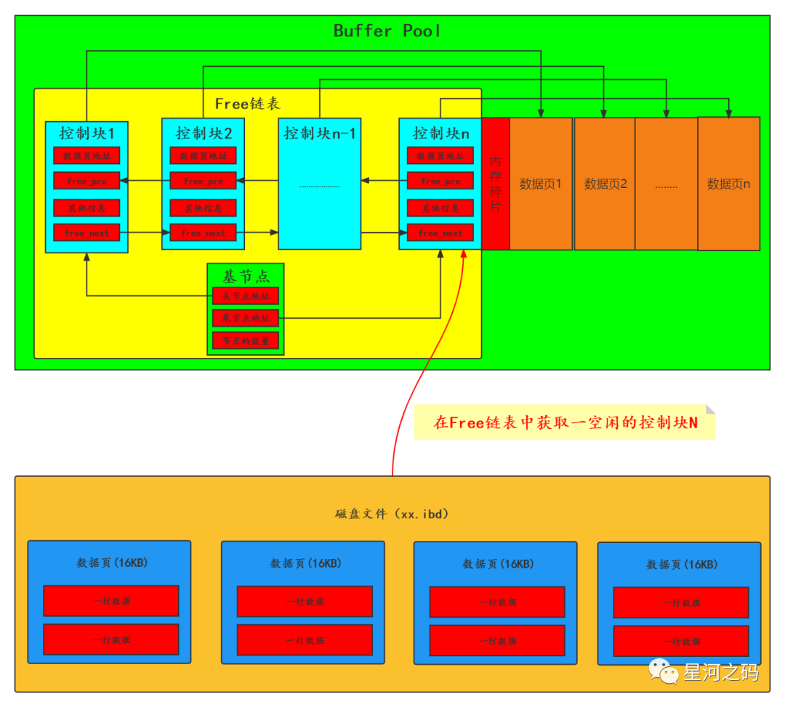

- **「步骤二」**

  **「把磁盘上的数据页读取到对应的缓存页，同时把相关的一些描述数据写入缓存页的控制块（例如：页所在的表空间、页号之类的信息）」**。

  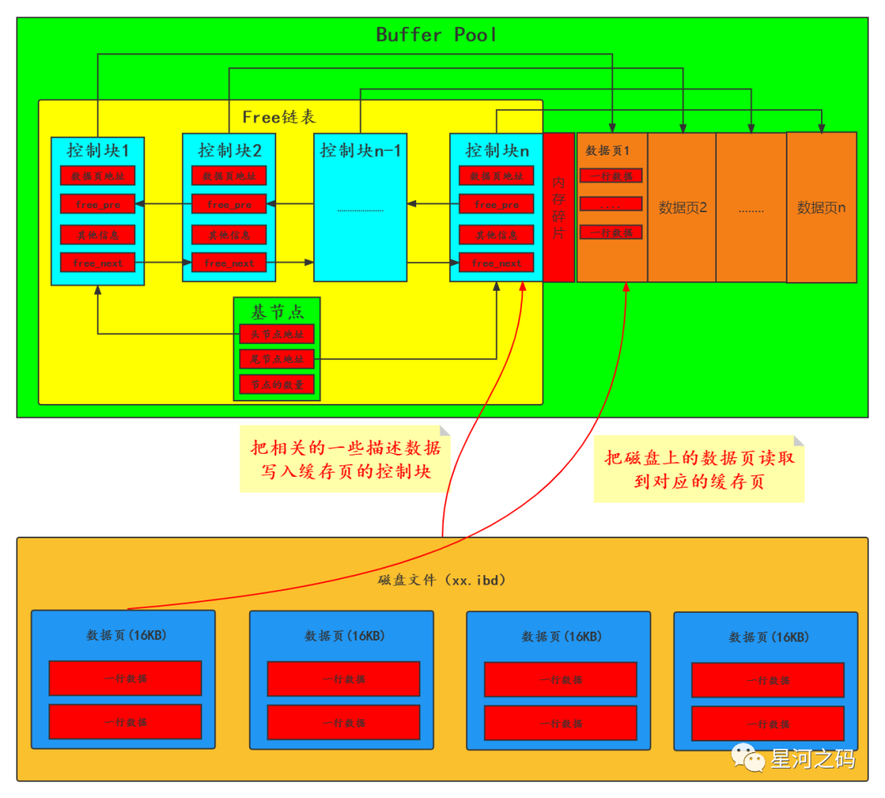

- **「步骤三」**

  **「把该控制块对应的free链表节点从链表中移除，表示该缓冲页已经被使用了」**。

  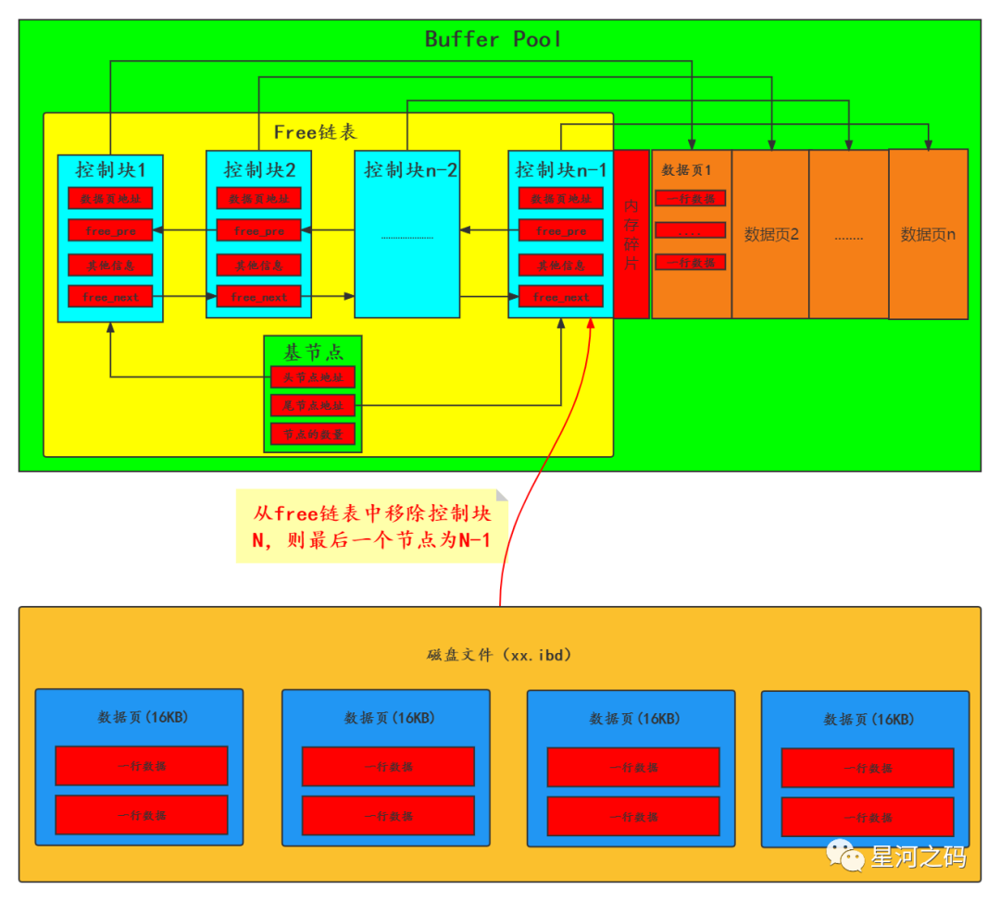

#### 如何确定数据页是否被缓存

### LRU

- 通过LRU(**Least recently used**)淘汰最近最少使用的缓存页，以供新加载的数据进行写入
- 由于读取磁盘数据时会把相邻的页也读入，所以为防止相邻的页没有被访问，但又不位于链表末尾，无法淘汰；或者全表扫描时频繁访问的数据位于了链表末尾被淘汰 这两个问题，LRU又做了冷热分离，划分为young和old区域
  - 数据第一次加载时，先放入冷（old）区域，如果1秒后再次访问到，则会移动到热区域（young）
  - young区域前面的1/4被访问不会移动到链表头部，后面3/4被访问才会，防止区域节点频繁移动

#### LRU链表的写入过程

**「当数据库从磁盘加载一个数据页到Buffer Pool中的时候，会将一些变动信息也写到`控制块`中，并且将控制块从Free链表中脱离加入到LRU链表中」**

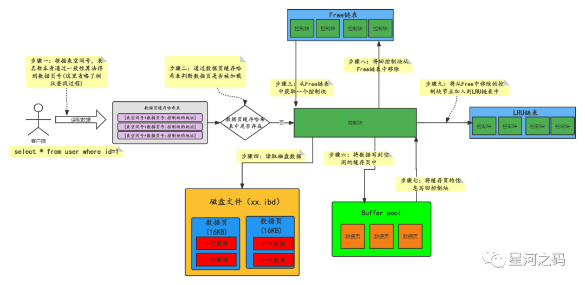

- **「步骤一：根据表空间号，表名称本身通过一致性算法得到数据页号(这里省略了树状查找过程)」**
- **「步骤二：通过数据页缓存哈希表判断数据页是否被加载」**
- **「步骤三：从Free链表中获取一个控制块」**
- **「步骤四：读取磁盘数据」**
- **「步骤六：将数据写到空闲的缓存页中」**
- **「步骤七：将缓存页的信息写回控制块」**
- **「步骤八：将回控制块从Free链表中移除」**
- **「步骤九：将从Free中移除的控制块节点加入到LRU链表中」**

### Flush 链表

- 异步线程刷盘时，不会把所有的缓存页刷盘，只会把flush链表上的脏页刷盘

**「对数据的读写都是先对Buffer Pool中的缓存页进行操作，然后在通过后台线程将脏页写入到磁盘，持久化到磁盘中，即刷脏」**。

**「脏页：当执行写入操作时，先更新的是缓存页，此时缓存页跟磁盘页的数据就会不一致，这就是常说的脏页」**。

**「Flush链表与Free链表的结构很类似，也由基节点与子节点组成」**。

- Flush链表是一个双向链表，链表结点是被修改过的缓存页对应的控制块（更新过的缓存页）

- Flush链表作用：帮助定位脏页，需要刷盘的缓存页

- **「基节点」**：和free链表一样，链接首尾结点，并存储了有多少个描述信息块

- **「子节点」**

- - **「每个节点是脏页对应的控制块，即只要一个缓存页被修改，那它的控制块就会被放入Flush链表」**
  - 每个控制块块里都有两个指针pre（指向上一个节点），next（指向下一个节点）

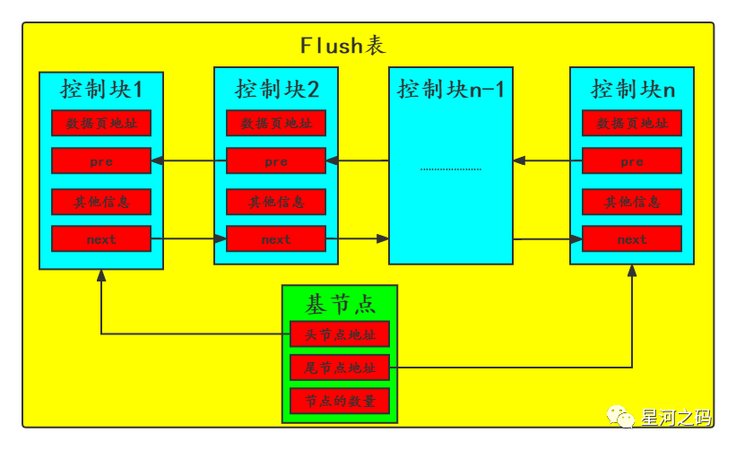

**「前面说了控制块其实是在Buffer Pool中的，控制块是通过上下节点的引用，组成一个链表，所以只需要通过基节点挨个遍历子节点，找到需要刷脏的数据页即可」**

#### Flush链表写入过程

第一步：更新Buffer Pool中的数据页，一次内存操作；

第二步：将更新操作顺序写Redo log，一次磁盘顺序写操作；

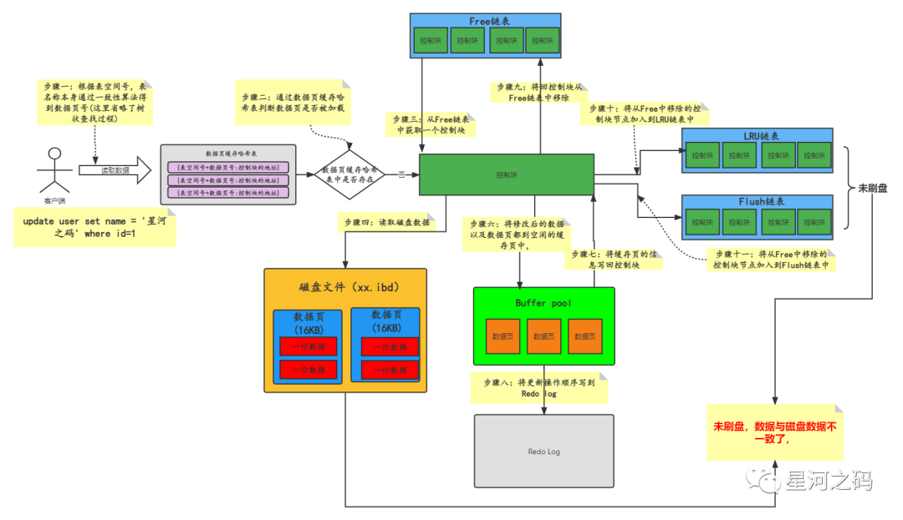

上图中描述了在更新数据页的时候，Flush链表的写入过程，其实这只是在被更新的数据已经别加载到Buffer Pool的前提下，如果我们要更新的数据没有别预先加载，那这个过程是不是会先去读取磁盘呢？实际上并不会，MySQL为了提高性能，减少磁盘IO，做了很多的优化，当数据页不存在Buffer Pool中的时候，会使用写缓冲(change buffer)来做更新操作

**「当控制块被加入到Flush 链表后，后台线程就可以遍历 Flush 链表，将脏页写入到磁盘」**。

### Buffer Pool 的数据页

上述了解了三种链表以及它们的使用方式，我们可以总结一下，**「其实Buffer Pool 里有三种数据页页和链表来管理数据」**。

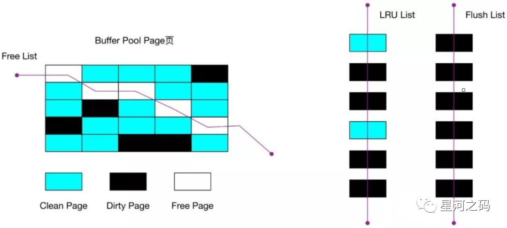

- Free Page（空闲页）

  表示此数据页未被使用，是空的，其控制块位于 Free 链表；

- **「Clean Page（干净页）」**

  表示此数据页已被使用，缓存了数据， 其控制块位于LRU 链表。

- **「Dirty Page（脏页）」**

  表示此数据页【已被使用】且【已经被修改】，数据页中数据和磁盘上的数据已经不一致。

  当脏页上的数据写入磁盘后，内存数据和磁盘数据一致，那么该页就变成了干净页。

  **「脏页的控制块同时存在于 LRU 链表和 Flush 链表」**。

## MySQL对LRU算法的改进

在前文中我们说到了简单的LRU算法会对于MySQL来说会有问题，因此MySQL对LRU算法进行了改进，接下来就来看看LRU算法存在什么问题，MySQL又是怎么改进的。

先来说说LRU 算法存在的问题：

- **「预读失效」**
- **「Buffer Pool  污染」**

### 什么是预读

既然LRU 算法存在预读失效的问题，先来看看什么是预读。

前面说到，为了减少磁盘IO，innoDB会把数据从磁盘读取到内存中使用，一般而言，数据的读取会遵循【集中读写】的原则，也就是当我们使用一些数据的时候，很大概率也会使用附件的数据，即【局部性原理】，它表明提前加载是有效的，能够减少磁盘IO。因此：

**「磁盘数据读取到内存，并不是按需读取，而是按页读取，一次至少读一页数据（16K），如果未来要读取的数据就在页中，直接读取内存即可，不需要磁盘IO，提高效率」**。这也就是常说的**「预读」**。

通过预读我们就可以事先先把数据读取放在内存中，下面来看一下**「buffer pool的工作流程图」**:

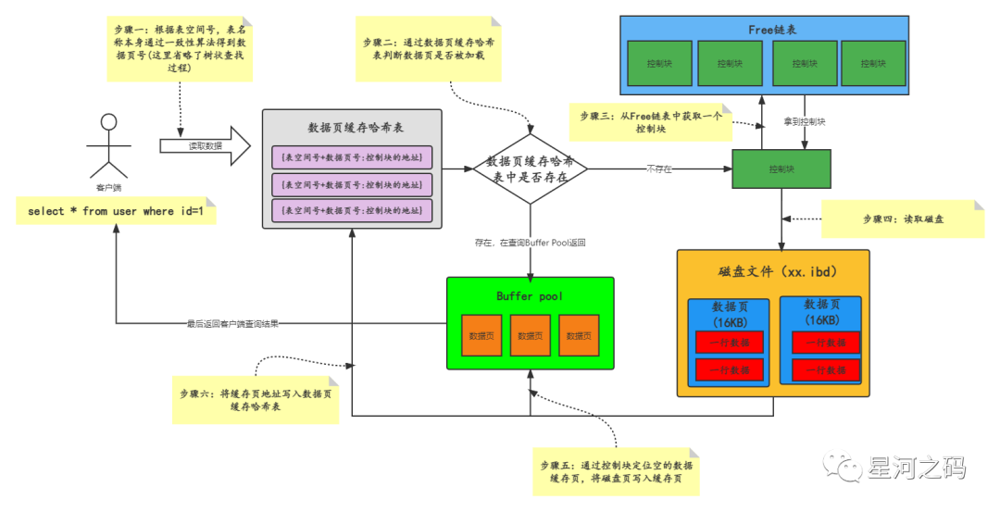

buffer pool的工作流程图中以查询id为1的用户数据为例，大致可以分为三步：

- 第一步：先查询buffer pool是否存在对应的数据页，有的话则直接返回

- 第二步：buffer pool不存在对应的数据页，则去磁盘中查找，并把结果copy一份到buffer pool中，然后返回给客户端

- 第三步：下次有同样的查询，就可以直接查找buffer pool返回数据

  > 例如：当id=1与id=2都在这个数据页中，那么下次查询Id=2的时候，就可以直接通过buffer pool返回。

这个过程看起来，感觉buffer pool跟缓存很类似，实际上它的缓存淘汰机制也跟Redis很类似。

### 什么是预读失效

解释了什么是预读，那预读失效就很好理解了，**「那些被提前加载进来的数据页并一直没有被访问，相当于预读是白费功夫，即预读失效」**。

**「通过简单的LRU链表的实现过程我们知道，预读的数据会被放到 LRU 链表头部，而当  Buffer Pool空间不够的时候，需要把末尾的页淘汰掉。如果这些预读的数据一直没有被使用，而把被使用的数据挤到了链表的尾部，进而被淘汰，那缓存的命中率就会大大降低」**。这样的话，预读就适得其反了。

### 如何提高缓存的命中率

预读的数据被使用到的时候，会减少磁盘IO，但是预读失效的时候，也会降低缓存的命中率，不能因为预读失效，而将预读机制去掉，所以我们要在保留预读这个机制的前提下提高缓存的命中率。

前面将在LRU链表的时候就解释了我们在读到数据之后，把对应的数据页放到LRU链表头部，因此想要提高缓存的命中率，只需要**「让真正被访问的页才移动到 LRU 链表的头部，使其在 Buffer Pool 里停留的时间尽可能长，尽可能缩短预读的页停留在 Buffer Pool 里的时间」**。

- **「提高缓存的命中率」**

  MySQL基于这种设计思路对LRU 算法进行了改进，将 LRU 划分了 2 个区域：

  **「划分old和young两个区域后，预读的页会被加入到 old 区域的头部，当页被真正访问的时候，才将页插入 young 区域的头部」**。

  > 如果预读的页一直没有被访问，会一直存在old 区域，直到被移除，不会影响 young 区域中的热点数据。

- **「old 区域」**：在LRU 链表的后半部分
  
- **「young 区域」**：在 LRU 链表的前半部分

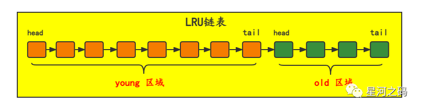

**「old 区域占整个 LRU 链表长度的比例可以通过 `innodb_old_blocks_pc`参数来设置，默认是 37，代表整个 LRU 链表中 young 区域与 old 区域比例是 63:37」**。

### 什么是Buffer Pool  污染

预读失效的问题解决了，接下来看看什么是Buffer Pool  污染。

我们知道当Sql执行的时候，**「会数据加载到Buffer Pool ，而Buffer Pool的大小是有限的，如果加载大量数据，就会将Buffer Pool 里的所有页都替换出去，导致原本的热数据被淘汰」**。下次访问的时候，又要重新去磁盘读取，导致数据库性能下降，这个过程就是**「Buffer Pool  污染」**。

- **「什么时候会加载大量数据呢」**

- - SQL 语句扫描了大量的数据，并返回。

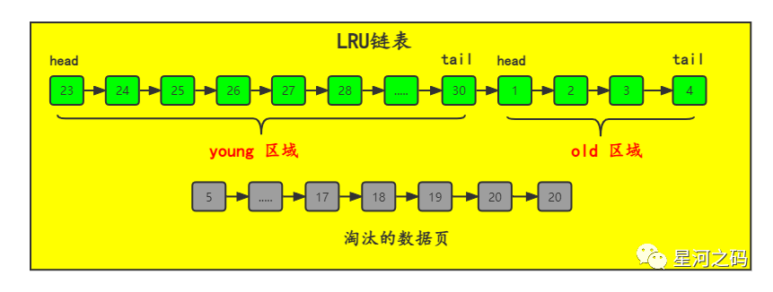

- 从磁盘读取数据页加入到 LRU 链表的 old 区域头部
- 从数据页中读取行记录进行where进行匹配，这个过程会访问数据页，也就会将数据页加入到 young 区域头部。
- 由于是全表扫描，**「因此所有数据都会被按照逐个加入young 区域头部，从而替换淘汰原有的 young 区域数据」**。

### 如何解决Buffer Pool污染

**「Buffer Pool污染跟预读失效都是一样的会导致LRU的热点数据被替换和淘汰」**，接下来看看如何解决Buffer Pool  污染而导致缓存命中率下降的问题？

- **「问题分析」**

  > 其实我们可以针对以上全表扫描的情况进行分析，
  >
  > 全表扫描之所以会替换淘汰原有的LRU链表young 区域数据，主要是因为我们将原本只会访问一次的数据页加载到young 区。
  >
  > 这些数据实际上刚刚从磁盘被加载到Buffer Pool，然后就被访问，之后就不会用，基于此，我们是不是可以将数据放young 区的门槛提高有点，从而吧这种访问一次就不会用的数据过滤掉，把它挡在Old区，这样就不会污染young 区的热点数据了。

- **「解决Buffer Pool污染方案」**

  MySQL 解决方式就是提高了数据从Old区域进入到 young 区域门槛：

  **「先设定一个间隔时间innodb_old_blocks_time，然后将Old区域数据页的第一次访问时间在其对应的控制块中记录下来」**。

  > 这样看，其实**「这个间隔时间innodb_old_blocks_time就是数据页必须在 old 区域停留的时间」**。

- - 如果后续的访问时间与第一次访问的时间**「小于innodb_old_blocks_time」**，则**「不将该缓存页从 old 区域移动到 young 区域」**。
  - 如果后续的访问时间与第一次访问的时间**「大于innodb_old_blocks_time」**，才**「会将该缓存页移动到 young 区域的头部」**。

innodb_old_blocks_time默认是 1s。即：**「当同时满足「数据页被访问」与「数据页在 old 区域停留时间超过 1 秒」两个条件，才会被插入到 young 区域头部」**。

通过这种方式，就过滤了上述那种全表扫描导致的将只会访问一次的数据页加载到young 区造成的Buffer Pool  污染的问题 。

- **「young 区域优化」**

  MySQL为了防止 young 区域节点频繁移动到头部，对 young 区域也做了一个优化：

  **「young 区域前面 1/4 被访问不会移动到链表头部，只有后面的 3/4被访问了才会」**。

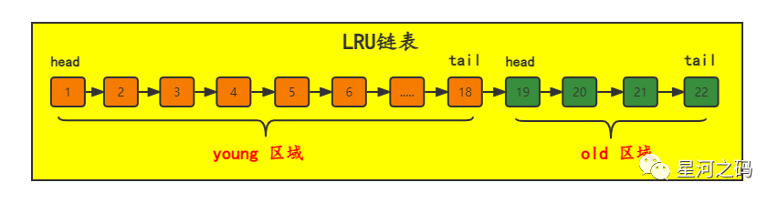

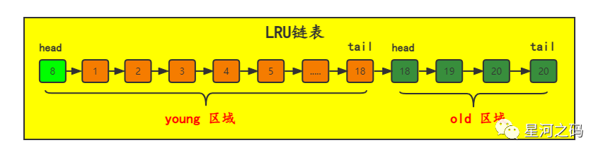

- 当访问前面4个数据页时（比如3号数据页），并不会将数据页移动到young 区的头部
- 当访问8号数据页，由于8数据页在后 3/4的young 区，所以8号会被移动到头部
- 比如访问如下LRU链表，young 区域一共有18个数据页，当我们访问young 区的数据页时：

## 脏页的刷盘时机

通过对上述三种链表的描述，我们知道**「当我们对数据进行修改时，其实修改的是Buffer Pool  中数据所在缓存页，修改后将其设置为脏页，并将脏页的控制块同时存在于 LRU 链表和 Flush 链表」**。然后通过刷脏将修改同步至磁盘。

刷脏不是每次修改都进行的，那样性能会很差，因此刷脏是通过一定的时机触发进行批量刷盘的。

脏页的刷盘时机总的来说就分为以下种：

- redo log 日志满了的情况下，会主动触发脏页刷新到磁盘；
- MySQL 正常关闭之前，会把所有的脏页刷入到磁盘；
- Buffer Pool 空间不足时，会淘汰一部分数据页，如果淘汰的是脏页，需要先将其同步到磁盘。
- MySQL 空闲时，后台线程会定期脏页刷盘

下面主要来看一下Buffer Pool 空间不足和后台线程的脏页刷盘过程

### Buffer Pool内存不足触发刷脏

**「刷脏的目的是将修改的数据同步磁盘，释放Buffer Pool内存空间」**。因此我们肯定是需要将访问的最少的数据页刷会磁盘，释放其数据页内存。

**「基于这样的原则，我们只需要根据LRU链表，将其Old区域尾部节点输盘即可」**。

我们在前面的描述中已经说了**「对于修改的数据页的控制块同时存在于 LRU 链表和 Flush 链表，对于只有读取访问的数据页的控制块存在于 LRU 链表」**。

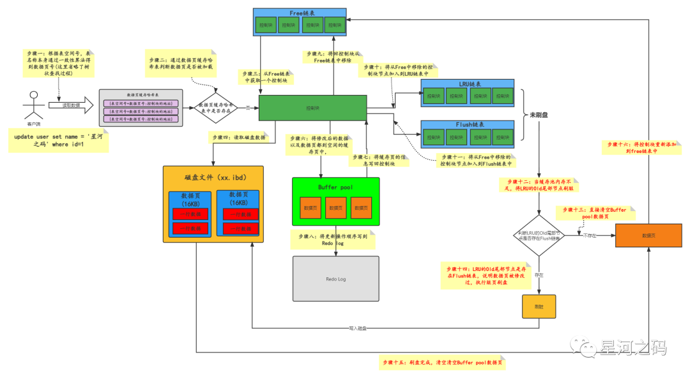

如上图，Buffer Pool内存不足脏页刷盘分为两种情况：

- **「若缓存页同时在flush链表和lru链表中，说明数据被修改过，则需要刷脏，释放掉缓存页的内存，将控制块重新添加到`free链表中`
  」**。
- **「若缓存页只是存在于LRU链表中，说明数据没有被修改过，则不需要刷脏，直接释放掉缓存页的内存，将控制块重新添加到`free链表中`
  」**。

### 后台线程会定期脏页刷盘

为了避免缓冲池内存不够，MySQL在后台有一个定时任务，通过单独的后台线程，不断从LRU链表Old区尾部的缓存页刷回至磁盘中并同时释放缓存页。

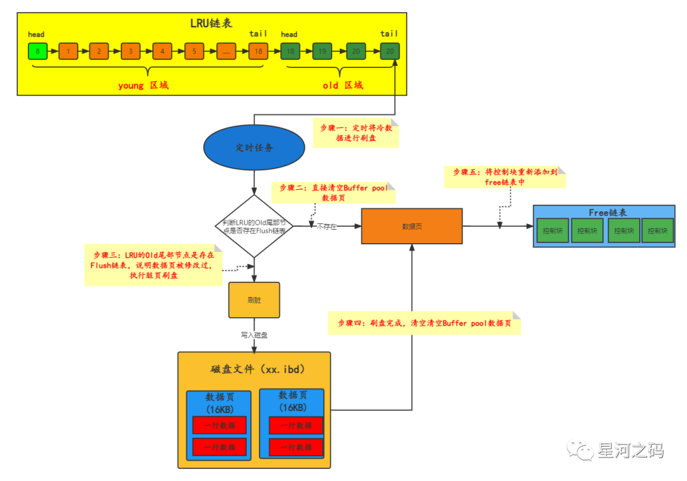

## 多实例Buffer Pool

**「Buffer Pool本质是InnoDB向操作系统申请的一块`连续的内存空间`」**

既然是内存空间，那么在多线程环境下，为保证数据的安全性，访问Buffer Pool中的数据都需要`加锁`处理。

### 什么是多实例Buffer Pool

**「当多线程并发访问量特别高时，单一的Buffer Pool可能会影响请求的处理速度。因此当Buffer Pool的内存空间很大的时候，可以将单一的Buffer Pool`拆分成若干个小的Buffer Pool`
，每个Buffer Pool都称为一个独立的实例，各自去申请内存空间以及管理各种链表」**。以此保证在多线程并发访问时不会相互影响，从而提高并发处理能力。

###### 来源：

https://www.modb.pro/db/412019
