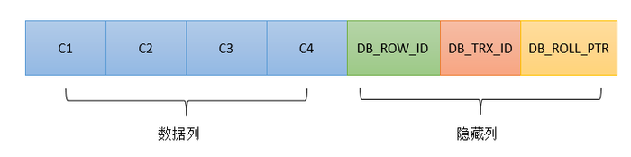
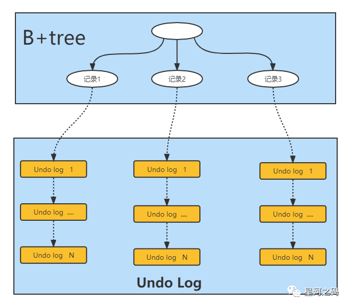
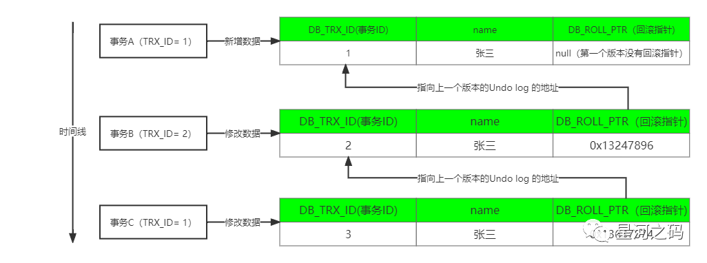

# MVCC

目的：解决不可重复读，用于支持读已提交(RC）和可重复读(RR）隔离级别的实现

MVCC，全称：multiversion concurrency control，多版本并发控制，是innodb实现事务回滚与并发的重要功能

## 数据库的几种并发场景

- 读读：不存在数据安全问题

- 写写：有数据安全问题，更新丢失

- 读写：有线程安全问题，脏读、幻读、不可重复读（MVCC就是为了解决这种问题而存在的）

如果是RC隔离级别，那么每次在进行快照读的时候都会生成一个新的readview

如果是RR隔离级别，那么只有在当前事务第一次进行快照读的时候会生成readview，之后的快照读都会沿用当前的readview

RC和RR之间的区别就在于生成readview的时机不同

- MVCC主要是用来解决【**读-写**】冲突的**无锁并发控制**，可以解决以下问题：

- - **在并发读写数据时，可以做到在读操作时不用阻塞写操作，写操作不用阻塞读操作，提高数据库并发读写的性能**。
  - **可以解决脏读，幻读，不可重复读等事务隔离问题，但不能解决【写-写】引起的更新丢失问题**。

- **MVCC与锁的组合**：

  **一般数据库中都会采用以上MVCC与锁的两种组合来解决并发场景的问题，以此最大限度的提高数据库性能**。

- - **MVCC + 悲观锁**MVCC解决读-写冲突，悲观锁解决写-写冲突。
  - **MVCC + 乐观锁**MVCC解决读-写冲突，乐观锁解决写-写冲突。

通过上述描述，MVCC的作用可以概括为就是为了解决【读写冲突】，提高数据库性能的，而MVCC的实现又依赖于六个概念：【隐式字段】【undo日志】【版本链】【快照读和当前读】【读视图】。

<!-- more -->

具体实现：在数据库的每一行中添加额外的三个字段：

| 隐式字段    | 描述                                                         | 是否必须存在 |
| :---------- | :----------------------------------------------------------- | :----------- |
| DB_TRX_ID   | 事物Id，也叫事物版本号，占用6byte的标识，**事务开启之前，从数据库获得一个自增长的事务ID，用其判断事务的执行顺序，记录插入或更新该行的最后一个事务的事务ID** | 是           |
| DB_ROLL_PTR | 占用7byte，**回滚指针，指向这条记录的上一个版本的undo log记录，存储于回滚段（rollback segment）中** | 是           |
| DB_ROW_ID   | 隐含的自增ID（隐藏主键），如果表中没有主键和非NULL唯一键时，则会生成一个**单调递增的行ID作为聚簇索引** | 否           |




## undo日志

**一种用于撤销回退的日志，在事务开始之前，会先记录存放到 Undo 日志文件里，备份起来，当事务回滚时或者数据库崩溃时用于回滚事务**。

**undo日志的主要作用是事务回滚和实现MVCC快照读**。

**undo log日志分为两种**：

- **insert undo log**

  代表事务在`insert`新记录时产生的`undo log`, 仅用于事务回滚，并且在事务提交后可以被立即丢弃。

- **update undo log**

  **事务在进行`update`或`delete`时产生的`undo log`;**

  **不仅在事务回滚时需要，在实现MVCC快照读时也需要**；所以不能随便删除，只有在快速读或事务回滚不涉及该日志时，对应的日志才会被清理线程统一清除。

MVCC实际上是使用的`update undo log`
实现的快照读。

> **InnoDB 并不会真正地去开辟空间存储多个版本的行记录，只是借助 undo log 记录每次写操作的反向操作。所以B+ 索引树上对应的记录只会有一个最新版本，InnoDB 可以根据 undo log 得到数据的历史版本，从而实现多版本控制。**



## 版本链

> 一致性非锁定读是通过 **MVCC** 来实现的。但是MVCC 没有一个统一的实现标准，所以各个存储引擎的实现机制不尽相同。InnoDB 存储引擎中 MVCC 的实现是通过 **undo log** 来完成的

**当事务对某一行数据进行改动时，会产生一条Undo日志，多个事务同时操作一条记录时，就会产生多个版本的Undo日志，这些日志通过回滚指针（DB_ROLL_PTR）连成一个链表，称为版本链**。



只要有事务写入数据时，就会产生一条对应的 undo log，一条 undo log 对应这行数据的一个版本，当这行数据有多个版本时，就会有多条 undo log 日志，undo log 之间通过回滚指针（DB_ROLL_PTR）连接，这样就形成了一个 undo log 版本链。

## 快照读与当前读

### 快照读

**也叫普通读，读取的是记录数据的可见版本，不加锁，不加锁的普通select语句都是快照读，即不加锁的非阻塞读**。

**快照读的执行方式是生成 ReadView，直接利用 MVCC 机制来进行读取，并不会对记录进行加锁**。

- 【可重复读隔离】级别下，普通的select读都是快照读。读的都是当前快照版本的数据，看不到其他版本的数据，其他事务操作的未提交时，记录的trx_id字段不会更新

  ```sql
  select * from table;
  ```

#### 快照的生成时间根据隔离级别的不同而有所不同

- 在读未提交隔离级别下，快照是什么时候生成的

  没有快照，因为不需要，怎么读都读到最新的。不管是否提交

- 在读已提交隔离级别下，快照是什么时候生成的

  SQL语句开始执行的时候。
- 在可重复读隔离级别下，快照是什么时候生成的

  事务开始的时候

### 当前读

**也称锁定读【Locking Read】，读取的是记录数据的最新版本，并且需要先获取对应记录的锁**

- 除了普通select外的所有操作，如update、insert都会读取最新的数据

  update/delete/insert/select...for update/select lock in share model

  ```sql
  # 共享锁
  SELECT * FROM student LOCK IN SHARE MODE;  
  # 排他锁
  SELECT * FROM student FOR UPDATE; 
  # 排他锁
  INSERT INTO student values ...  
  # 排他锁
  DELETE FROM student WHERE ...  
  # 排他锁
  UPDATE student SET ...  
  ```

  

## 读视图Read View

**Read View提供了某一时刻事务系统的快照，主要是用来做`可见性`
判断, 里面保存了【对本事务不可见的其他活跃事务】**。

**当事务在开始执行的时候，会产生一个读视图（Read View），用来判断当前事务可见哪个版本的数据，即可见性判断**。

**实际上在innodb中，每个SQL语句执行前都会生成一个Read View**。

### 读视图的四个属性

```c++
class ReadView {	
  private:		
  /** The read should not see any transaction with trx id >= this		value. In other words, this is the "high water mark". */		
  trx_id_t	m_low_limit_id;		
  /** The read should see all trx ids which are strictly		smaller (<) than this value.  In other words, this is the		low water mark". */		
  trx_id_t	m_up_limit_id;		
  /** trx id of creating transaction, set to TRX_ID_MAX for free		views. */		
  trx_id_t	m_creator_trx_id;		
  /** Set of RW transactions that was active when this snapshot		was taken */		
  ids_t		m_ids;		
  /** The view does not need to see the undo logs for transactions		whose transaction number is strictly smaller (<) than this value:		they can be removed in purge if not needed by other views */		
  trx_id_t	m_low_limit_no;		
  /** AC-NL-RO transaction view that has been "closed". */		
  bool		m_closed;		
  typedef UT_LIST_NODE_T(ReadView) node_t;		
  /** List of read views in trx_sys */		
  byte		pad1[64 - sizeof(node_t)];		node_t		m_view_list;
};
```

- 事务进行**快照读**的时候会生成一个读视图,格式

  - **creator_trx_id**

    创建当前read view的事务ID

  - **m_ids**

    当前系统中所有的活跃事务的 id，活跃事务指的是当前系统中开启了事务，但还没有提交的事务;

  - **m_low_limit_id**

    表示在生成ReadView时，当前系统中活跃的读写事务中最小的事务id，即m_ids中的最小值。

  - **m_up_limit_id**

    当前系统中事务的 id 值最大的那个事务 id 值再加 1，也就是系统中下一个要生成的事务 id。

ReadView 会根据这 4 个属性，结合 undo log 版本链，来实现 MVCC 机制，决定一个事务能读取到数据那个版本。

### 读视图可见性判断规则


当一个事务读取某条数据时，会**通过DB_TRX_ID【Uodo日志的事务Id】在坐标轴上的位置**来进行可见性规则判断，如下：

- **DB_TRX_ID < m_low_limit_id**

  表示DB_TRX_ID对应这条数据【Undo日志】是在当前事务开启之前，其他的事务就已经将该条数据修改了并提交了事务(事务的 id 值是递增的)，所以当前事务【开启Read View的事务】能读取到。

- **DB_TRX_ID >= m_up_limit_id**

  表示在当前事务【creator_trx_id】开启以后，有新的事务开启，并且新的事务修改了这行数据的值并提交了事务，因为这是【creator_trx_id】后面的事务修改提交的数据，所以当前事务【creator_trx_id】是不能读取到的。

- **m_low_limit_id =< DB_TRX_ID < m_up_limit_id**

- - **DB_TRX_ID  在 m_ids 数组中**

-   表示DB_TRX_ID【写Undo日志的事务】 和当前事务【creator_trx_id】是在同一时刻开启的事务

- - - **DB_TRX_ID  不等于creator_trx_id**

      

      **DB_TRX_ID事务修改了数据的值，并提交了事务，所以当前事务【creator_trx_id】不能读取到。**

      

    - **DB_TRX_ID  等于creator_trx_id**

- ​      表明数据【Undo日志】 是自己生成的，因此是**可见**的

- - **DB_TRX_ID  不在 m_ids 数组中**

    表示的是在当前事务【creator_trx_id】开启之前，其他事务【DB_TRX_ID】将数据修改后就已经提交了事务，所以当前事务能读取到。


## 不同隔离级别MVCC实现原理

### MVCC实现原理

**InnoDB 实现MVCC是通过` Read View与Undo Log`实现的，Undo Log 保存了历史快照，形成版版本链，Read View可见性规则判断当前版本的数据是否可见**。

**InnnoDB执行查询语句的具体步骤为**：

- 执行语句之前获取查询事务自己的事务Id，即事务版本号。
- 通过事务id获取Read View
- 查询存储的数据，将其事务Id与Read View中的事务版本号进行比较
- 不符合Read View的可见性规则，则读取Undo log中历史快照数据
- 找到当前事务能够读取的数据返回

**而在实际的使用过程中，Read View在不同的隔离级别下是得工作方式是不一样**。

### 读已提交（RC）MVCC实现原理

**在读已提交(Read committed)的隔离级别下实现MVCC，同一个事务里面，【每一次查询都会产生一个新的Read View副本】，这样可能造成同一个事务里前后读取数据可能不一致的问题（不可重复读并发问题）**。

- 假设事务A、事务B同时执行，事务B执行update a = 10 操作

  - 事务开启时，Read View 记录情况（如图）：
    事务A的Read View中，它的事务id时是1001，由于与事务B同时执行，所以此时活跃的事务的事务id列表（m_ids）为【1001，1002】，活跃的事务id中最小的为事务A的事务id ：1001；下一事务id为1003
    事务B的Read View中，它的事务id时是1002，由于与事务A同时执行，所以此时活跃的事务的事务id列表（m_ids）为【1001，1002】，活跃的事务id中最小的为事务A的事务id ：1001；下一事务id为1003

    

  - 此时，事务A查询id为1的记录，找到记录后，发现该记录的trx_id 为1000，通过和自己的Read View中的m_ids中的事务id比较，发现该事务id不在活跃的事务id列表中，并且小于事务A的事务id，即该记录早在事务A之前已经提交，因此该记录对事务A可见

  - 事务B通过update操作将字段a的值修改为10，但未提交事务，此时最新的记录的trx_id为1002。如图

    

  - 然后事务A再次读取该记录时，发现记录的trx_id变为1002，比自己的事务id大，并且比下一个事务id 1003小，即事务A读取到的是和自身同时执行的事务B提交的数据。这是事务A并不会读取这条记录，而是沿着undo log的版本链往下寻找，知道找到trx_id 小于等于自身事务id的第一条记录，即a字段值为1的这条记录

  - 此时事务B提交后，事务A再次读取到该记录，发现记录的trx_id比自身的事务id大，并且不在活跃事务的id列表中，则说明事务B已经提交事务，则该记录可以被读取


### 可重复读（RR）MVCC实现原理

**在可重复读(Repeatable read)的隔离级别下实现MVCC，【同一个事务里面，多次查询，都只会产生一个共用Read View】，以此不可重复读并发问题**。

- 假设事务A、事务B同时执行，事务B执行update a = 10 操作

  - 事务开启时，Read View 记录情况（如图）：
    事务A的Read View中，它的事务id时是1001，由于与事务B同时执行，所以此时活跃的事务的事务id列表（m_ids）为【1001，1002】，活跃的事务id中最小的为事务A的事务id ：1001；下一事务id为1003

    

    事务B的Read View中，它的事务id时是1002，由于与事务A同时执行，所以此时活跃的事务的事务id列表（m_ids）为【1001，1002】，活跃的事务id中最小的为事务A的事务id ：1001；下一事务id为1003

  - 此时，事务A查询id为1的记录，找到记录后，发现该记录的trx_id 为1000，通过和自己的Read View中的m_ids中的事务id比较，发现该事务id不在活跃的事务id列表中，并且小于事务A的事务id，即该记录早在事务A之前已经提交，因此该记录对事务A可见

  - 然后，事务B通过update操作将字段a的值修改为10，这是MySQL会记录undo log，并以链表的方式串联起来，形成版本链，如图所示，此前的记录就会变成旧版记录

    

  - 然后事务A再次读取该记录时，发现记录的trx_id变为1002，比自己的事务id大，并且比下一个事务id 1003小，即事务A读取到的是和自身同时执行的事务B提交的数据。这是事务A并不会读取这条记录，而是沿着undo log的版本链往下寻找，知道找到trx_id 小于等于自身事务id的第一条记录，即a字段值为1的这条记录

**案例总结**：

通过上述案例说明，**同一个事务A的两个相同查询，结果相同，因此在可重复读（RR）隔离级别下，解决了不可重复读并发问题**。

> 其实读已经提交与可重复读的可见性判断的区别就在于事务A第二次查询时使用的Read View不通。


###### 来源：

https://www.modb.pro/db/397162

