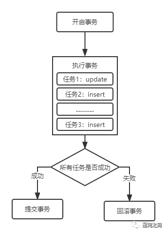
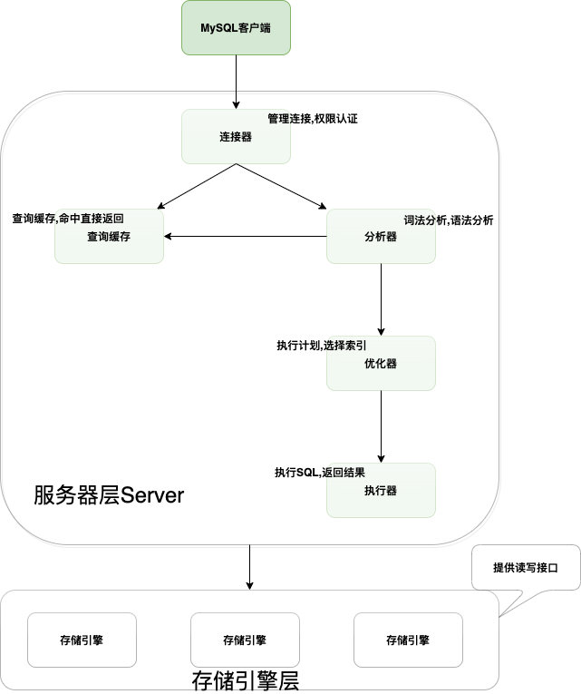

# 事务

事务(Transaction)是访问和更新数据的执行单元。事务中包含有个或者多个sql语句,要么都执行,要么都不执行。

- **开启事务**【开始记录一个事情中的多个任务】
- **执行事务**【正常情况下，一条语句就是一个任务】
- **提交事务**【成功】| **回滚事务**【失败】

事务的作用：**保证数据的最终一致性**。

<!-- more -->

## MySQL的逻辑架构

> MySQL数据库主要分两个层级:服务层和存储引擎层

- 服务层:包含连接器,查询缓存,分析器,优化器,执行器。大多数核心功能和所有的跨存储引擎的功能也在这一层实现,包括存储过程,触发器,视图。
- 存储引擎层:包含了MySQL常见的存储引擎,包括MyISAM,InnoDB和Memory等,最常用的是InnoDB,也是MySQL默认的存储引擎。存储引擎在建表的时候也可以指定。

## SQL语句的执行过程

- 连接器:从MySQL客户端登录,需要连接器来连接用户和MySQL数据库,`mysql -uroot -p123456`进行MySQL登录,在完成TCP握手之后,连接器会根据输入的用户名和密码验证身份,若错误会提示:`Access denied for user`,若账号密码正确,MySQL会根据权限表中的记录来判定权限。
- 查询缓存:MySQL在收到一个请求后,会先去缓存中查找,是否执行过这条SQL语句,之前执行过的SQL语句结果会以key-value的形式直接存储到缓存中,key是查询的语句,value是查询结果集,如果能通过SQL语句直接查询到缓存中的结果集,则直接返回。优点是效率高,但是不建议使用,原因是在MySQL中对表进行了更新操作,缓存就失效了,在频繁更新的系统中,缓存的命中率并不高。在MySQL8.0中查询缓存功能就被删除了,不存在查询缓存的功能了。
- 分析器:分为词法分析和语法分析
  - 词法分析:MySQL会解析sql语句,分词器会先做词法分析,SQL语句一般由字符串和空格组成,MySQL要识别出字符串代表什么。
  - 语法分析:根据词法分析的结果,按照语法规则看看SQL语句是否正确。如果SQL语句语法不正确,就提示:`You have an error in your SQL syntax`
- 优化器:SQL语句语法正确后,优化器会判断你使用了哪种索引,哪种链接,优化器的作用就是确定效率最高的执行方案。
- 执行器:在执行阶段,MySQL会判断有没有执行语句的权限,若没有权限,会返回没有权限的错误,若有权限,则打开表继续执行。打开表时,执行器会根据你使用的存储引擎,去使用该引擎对接的接口。

## 特殊操作

在MySQL中,存在一些图书的命令,如果在事务中执行了这些命令,会马上强制执行commit提交事务;如DDL语句(create table/drop table/alter table)、lock tables语句等等。

DML语句(insert,delete,update,select)等都不会强制提交事务。

## ACID特性

- 原子性 -- undo log 保证
  一个事务的所有操作要么全部成功，要么全部失败，不会再中间环节结束
- 持久性 -- redo log 保证
  事务处理结束之后，对数据库的修改是永久性的，不会因为系统故障等事件发生而丢失
- 一致性 -- 通过undo log 保证
  数据库的完整性不会因为事务的执行而收到破坏。如有种有一个唯一索引约束的字段，一个事务对其进行操作后，使得该字段出现重复记录，则破坏了一致性。
- 隔离性 -- 通过undo log + MVCC保证
  多个事务之间相互隔离。允许多个事务同时进行读写，不会由于交叉执行导致的数据不一致
  - 一个事务写对另一个事务写操作的影响,锁机制保证隔离性
  - 一个事务写对另外一个事务读操作的影响,MVCC保证隔离性

## 事务并发产生的问题

- 脏读
  一个事务读取到另一个事务未提交的数据

  - 如事务A、事务B同时执行。事务A从数据库中获取记录值，并更新，此时事务B也查询该记录值，则事务B查询到的是事务A更新后但未提交的值。如果此时事务A提交时异常需要进行回滚，则事务B得到的记录值就是不正确的值，若基于该记录值进行后续操作，很可能导致数据的不一致。

- 不可重复读
  一个事务内多次读取同一个数据，前后两次读取的结果不一致。更多针对的是update操作
  - 如事务A开始从数据库读取记录值为a，此时事务B更新该记录值为B并提交了事务，当A再次读取该记录值时，前后两次读取的结果是不一致的。

- 幻读
  一个事务内多次查询符合相同条件的记录数量，前后两次查询的记录数量不一致。更多的针对insert 操作
  - 如事务A、事务B同时执行。事务A先查询某个条件下的记录数量，共1条，事务B也按该条件查询，结果为2条。然后事务A插入一条符合该条件的记录并提交事务。此后事务B再按照该条件进行查询，发现符合结果的记录数与第一次查询到记录数量不一致。

1、将事务隔离级别提高到读已提交以上，则可以解决脏读问题
2、将事务隔离级别提高到可重复读以上，则可以解决脏读、不可重读问题
3.将事务隔离几倍提高到串行化以上，则可以解决幻读问题，但一般不会设置为串行化（性能差），InnoDB通过next-key lock （行锁和间隙锁的组合，【锁住记录之间的间隙和记录本身，防止其他事务在这个记录之间插入新的记录）进行解决】

- **总结**

  一般我们再理解幻读与不可重复读的时候，容易混淆，其实只需要分清一点就可以，

  **一般而言：幻读是指查询数据的【条数总量】不一致，不可重复读是指查询数据的数据内容不一致**。

## 事务的四大隔离级别

- 读未提交（read uncommitted）
  一个事务还没提交时，它的变更能被其他事务看到

  读取其他事务未提交的数据，会造成脏读。因此在该种隔离级别下，不能解决脏读、不可重复读和幻读。

  - 事例：老板要给程序员发工资，程序员的工资是3.6万/月。但是发工资时老板不小心按错了数字，按成3.9万/月，该钱已经打到程序员的户口，但是事务还没有提交，就在这时，程序员去查看自己这个月的工资，发现比往常多了3千元，以为涨工资了非常高兴。但是老板及时发现了不对，马上回滚差点就提交了的事务，将数字改成3.6万再提交。

    分析：实际程序员这个月的工资还是3.6万，但是程序员看到的是3.9万。他看到的是老板还没提交事务时的数据。这就是**脏读**

    ------
  
    那怎么解决脏读呢？Read committed！读已提交，能解决脏读问题。
  
    - 当前事务可以读到其它事务未提交的数据(脏数据),这种现象是脏读。
    
    ------
  
- 读已提交（read committed）
  一个事务的变更在事务提交后才能被其他事务看到

  **在读已提交的隔离级别下，所有事务只能读取【其他事务已经提交】的数据**。Oracle和SQL Server的默认的隔离级别。读已提交能够解决脏读的现象，但是还是会有**不可重复读、幻读**的问题
  
  - 事例：程序员拿着信用卡去享受生活（卡里当然是只有3.6万），当他埋单时（程序员事务开启），收费系统事先检测到他的卡里有3.6万，就在这个时候！！程序员的妻子要把钱全部转出充当家用，并提交。当收费系统准备扣款时，再检测卡里的金额，发现已经没钱了（第二次检测金额当然要等待妻子转出金额事务提交完）。程序员就会很郁闷，明明卡里是有钱的…
  
    分析：这就是读提交，若有事务对数据进行更新（UPDATE）操作时，读操作事务要等待这个更新操作事务提交后才能读取数据，可以解决脏读问题。但在这个事例中，出现了一个事务范围内两个相同的查询却返回了不同数据，这就是**不可重复读**。
  
    ------
  
    那怎么解决可能的不可重复读问题？Repeatable read ！
  
    - 不可重复读:在同一个事务中两次读取同一个数据不一样,这种现象被称为不可重复读。脏读可不可重复读的区别在于,脏读读到的是其它事务未提价的数据,而不可重复读读到的是其它事务已经提价的数据
    
    ------
  
- 可重复读（repeatable read）
  
  **在可重复读的隔离级别下，限制了读取数据的时候，不可以进行修改，所有事务前后多次的读取到的数据内容是不变的**。MySQL InnoDB引擎的默认事务隔离级别
  
  这种隔离级别解决了**重复读**的问题，但是读取范围数据的时候，是可以add数据的，所以还是会造成某个事务前后多次读取到的数据总量不一致的现象，从而产生幻读。
  
  - 事例：程序员拿着信用卡去享受生活（卡里当然是只有3.6万），当他埋单时（事务开启，不允许其他事务的UPDATE修改操作），收费系统事先检测到他的卡里有3.6万。这个时候他的妻子不能转出金额了。接下来收费系统就可以扣款了。
  
    分析：重复读可以解决不可重复读问题。写到这里，应该明白的一点就是，不可重复读对应的是修改，即UPDATE操作。但是可能还会有幻读问题。因为幻读问题对应的是插入INSERT操作，而不是UPDATE操作。
  
    **什么时候会出现幻读？**
  
    事例：程序员某一天去消费，花了2千元，然后他的妻子去查看他今天的消费记录（全表扫描FTS，妻子事务开启），看到确实是花了2千元，就在这个时候，程序员花了1万买了一部电脑，即新增INSERT了一条消费记录，并提交。当妻子打印程序员的消费记录清单时（妻子事务提交），发现花了1.2万元，似乎出现了幻觉，这就是**幻读**。
  
    ------
  
    那怎么解决幻读问题？Serializable！
  
    - 一般我们也可以使用**间隙锁**和**临键锁**来解决幻读问题
    - 在一个事务中两次查询查到的数据条数不同,这种现象被称为幻读。不可重复读和幻读的区别在于,不可重复度是数据变了,幻读是数据行数变了。
    
    ------
  
- 串行化（serializable）
  会对记录加上读写锁，在多个事务对这条记录进行读写操作时，如果发生读写重读，后访问的事务必须等到前一个事务执行完成后，才能继续执行

  **事务最高的隔离级别，在串行化的隔离级别下，所有的事务顺序执行，不存在任何冲突，可以避免脏读、不可重复读与幻读所有并发问题**。

  但是串行化的隔离级别，会导致大量的操作超时和锁竞争，从而大大降低数据库的性能，一般不使用这样事务隔离级别。
  
  
  
- 优先级
  串行化 > 可重复读 > 读已提交 > 读未提交

- 实现原理(MVCC)

  - 读未提交级别，因为可以读到未提交的数据，因此直接读取最新的数据即可

  - 串行化级别，通过加读写锁的方式避免并行访问

  - 读已提交和可重复读级别，它们是通过Read View （数据快照）来实现的，它们之间的区别在于创建Read View的时机不同。

    (多版本并发控制)

    读已提交：在每个数据读取前都生成一个快照
    可重复读：启动事务的时候生成一个快照，并在事务期间都使用该快照

**四种隔离级别存在的并发问题如下：**

【 ×】表示未解决，【√】表示已解决

| 隔离级别                   | 脏读 | 不可重复读 | 幻读 |
| :------------------------- | :--- | :--------- | :--- |
| 读未提交(Read uncommitted) | ×    | ×          | ×    |
| 读已提交(Read committed)   | √    | ×          | ×    |
| 可重复读(Repeatable read)  | √    | √          | ×    |
| 串行化(Serializable)       | √    | √          | √    |

## 总结

> InnoDB实现的RR,通过锁机制(包含netxt-key lock),MVCC(包含隐藏数据列,基于undo log的版本链,ReadView)等,实现了一定程度的隔离性,可以满足大多数场景的需要。
>
> RR虽然避免了幻读问题，但是毕竟不是Serializable，不能保证完全的隔离
>
> 如果在事务中第一次读取采用非加锁读，第二次读取采用加锁读，则如果在两次读取之间数据发生了变化，两次读取到的结果不一样，因为加锁读时不会采用MVCC。
>
> 
>
> 出现了幻读问题
>
> RR模式下 日志中记录的是：先commit的记录在前面，后commit的记录在后面，与执行时间点无关；就单个 session 来说，好理解，执行顺序就是记录顺序；多个 session 之间的话，先 commit 的先记录主库对数据库的更改是按执行时间的先后顺序进行的，而 binlog 却是按 commit 的先后顺序记录的。

###### 来源:

https://rumenz.com/rumenbiji/mysql-transaction.html

https://rumenz.com/rumenbiji/mysql-transaction.html

https://www.modb.pro/db/397162
