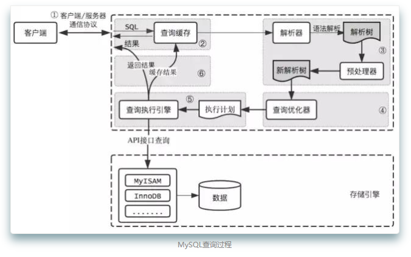

# 优化原理

## 逻辑架构

- 客户端层
- 核心服务层,包括查询解析、分析、优化、缓存、内置函数、存储过程、试图、触发器等
- 存储引擎，负责数据存储和提取

## 查询过程

- 1.客户端向MySQL发送sql查询请求
  半双工通信
- 2.服务器先检查查询缓存，如果命中则立即返回
  MySQL将缓存存放于一个应用表上（HashMap结构），因此两次查询的字符不同也会导致缓存没有命中，同时查询中包含自定义函数、存储过函数等都不会命中缓存
  查询缓存系统会更重查询中涉及的每个表，如果这些表发生任务变化，跟这个表相关的缓存都会失效，因此会带来性能的损耗
- 3.服务器进行SQL解析，预处理、再由优化器生成执行计划
  - MySQL通过关键字进行语句解析，并生成对应的解析树
  - 预处理则是根据规则进一步检查解析树是否合法，如数据表或列是否存在
  - MySQL会由优化器生成执行计划，并选择一个成本最小的执行。一条查询可以有多种执行方式，优化器的作用就是找到最好的执行计划
- 4.根据执行计划，调用存储引擎的API进行查询
  查询执行引擎根据执行计划逐步执行，通过调用存储引擎的接口完成
- 5.将结果返回客户端并缓存
  缓存的前提是查询缓存被打开，结果集的返回是一个增量的过程。有可能MySQL在生成第一条结果时就返回给客户端，这样服务器就不用存储过多的数据消耗内存
