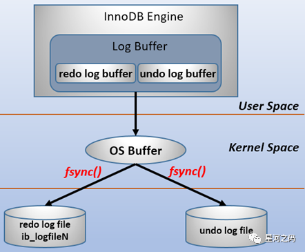
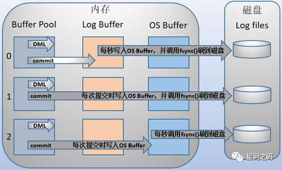
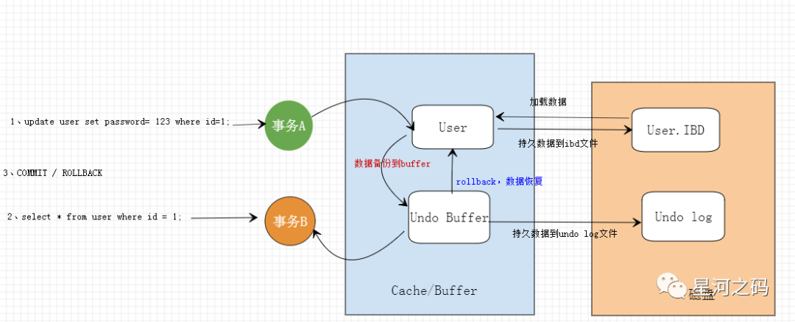
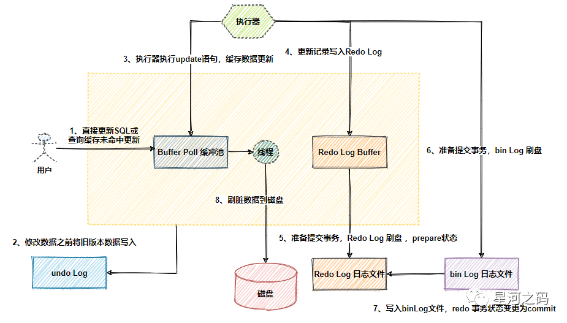

# 日志

- 主要日志
  - 二进制日志
  - 重做日志
  - 撤销日志
- 其他日志
  - 错误日志
  - 查询日志
  - 中继日志

<!-- more -->

## binlog（归档日志）

### 概念

binlog即二进制日志，存储数据库更改的“事件”，创建表、更改表结构、更改表数据的的SQL语句，查询SQL不会存储在里面

Mysql有两层结构，

第一层：server层，里面包含：连接器、查询缓存、解析器、执行器；

第二层：存储引擎层，例如innodb、MyIsam、Memory等多个存储引擎

binlog位于server层

### 内容

binlog文件都有什么

参考：https://www.cnblogs.com/fengtingxin/p/11104758.html

binlog文件包含两种类型：

日志索引文件（文件后缀.index）用于记录所有的二进制文件

日志文件（文件后缀.0000*）记录数据库所有的DDL和DML（除了查询语句）的语句事件

### 场景

在实际应用中， `binlog`的主要使用场景有两个，分别是 **「主从复制」** 和 **「数据恢复」** 。

### 时机

#### 产生时机

- 事务执行时，会写入binlog cache中
- 事务提交后，一次性将事务中的sql语句（一个事物可能对应多个sql语句）写入binlog 文件（Server层）

#### 刷盘时机

- 刷盘时机 -- 可由sync_binlog 控制
  - 设置为0时，由系统自行判断何时调用write，写入page cache 由操作系统调用fsync落盘。机器宕机会造成binlog丢失
  - 设置为1时，每次提交事务都会调用fsync刷盘
  - 设置为N，可在积累N个事务后调用fsync刷盘

**`MySQL 5.7.7`之后版本的 `sync_binlog`默认值是 `1`，配置为1也是数据最不容易丢失的，但是设置一个大一些的值可以提升数据库性能，因此实际情况下也可以将值适当调大，牺牲一定的一致性来获取更好的性能。**

### 格式

- statment
  
  会记录原始的SQL语句，基于`SQL`语句的复制( `statement-based replication, SBR`)，每一条修改数据的sql语句会记录到`binlog`中  。
  
  - 优点：不需要记录每一行数据的变化，减少了 binlog 日志量，节约 IO  , 从而提高了性能；
  
  - 缺点：在某些情况下会导致主从数据不一致，比如执行sysdate() 、  slepp()  等 。
  
    如使用了NOW()函数，从服务器执行的时候，就变成了从服务器的执行时间了
  
- row
  
  以行数据维度记录的日志：行改动前、改动后的数据
  
  记录的是数据
  
  - 优点：记录的内容精确、详细
  - 缺点：数据量大
  
- mixed
  混合模式，会判断是否会造成数据不一致

## redo log（重做日志）

### 基本概念

- **「重做日志是一种基于磁盘的数据结构，用于在崩溃恢复期间修正不完整事务写入的数据」**。
- MySQL以循环方式写入重做日志文件，记录InnoDB中所有对Buffer Pool修改的日志。

> 当出现实例故障，导致数据未能更新到数据文件，则数据库重启时须redo，重新把数据更新到数据文件。读写事务在执行的过程中，都会不断的产生redo log。默认情况下，重做日志在磁盘上由两个名为ib_logfile0和ib_logfile1的文件物理表示。

`redo log`包括两部分

- 一个是内存中的日志缓冲( `redo log buffer`)，临时性
- 一个是磁盘上的日志文件( `redo log file`)，永久性。

### 解决的问题

**「InnoDB作为MySQL的存储引擎，数据是存放在磁盘中的，如果每次读写数据都需要磁盘I/O，效率会很低。」**

为提高读写效率，InnoDB添加了缓存池（Buffer Pool）作为访问数据库的缓冲，其包含了磁盘中部分数据页的映射。

- **「当从数据库读取数据时，会首先从Buffer Pool中读取，如果Buffer Pool中没有，则需要从磁盘中读取然后放入 Buffer Pool；」**
- **「当向数据库写入数据时，会首先写入Buffer Pool，Buffer Pool中修改的数据会定期刷新到磁盘中（即：刷脏）」**。

*Buffer Pool的使用大大提高了读写数据的效率，但是也带了新的问题：如果MySQL宕机，而此时Buffer Pool中修改的数据还没有刷新到磁盘，就会导致数据的丢失，事务的持久性无法保证*。而Redo Log 解决了这个问题。

### 为什么需要redo log

- 事务的四大特性ACID中有一个是 **「持久性」**

  **「只要事务提交成功，那么对数据库做的修改就被永久保存下来了，不可能因为任何原因再回到原来的状态」** 。

- **「`mysql`是如何保证一致性」**

  - 最简单的做法是在每次事务提交的时候，将该事务涉及修改的数据页全部刷新到磁盘中。但是这么做会有性能瓶颈，主要体现在两个方面：
    - 因为 `Innodb`是以 `页`为单位进行磁盘交互的，而一个事务很可能只修改一个数据页里面的几个字节，这个时候将完整的数据页刷到磁盘的话，太浪费资源了！
    - 一个事务可能涉及修改多个数据页，并且这些数据页在物理上并不连续，使用随机I/O写入性能太差

因此 `mysql`设计了 `redo log`， **「redo log是物理日志，只记录事务对数据页做了哪些修改，而不是某一行或某几行修改成什么样，它用来恢复提交后的物理数据页(恢复数据页，且只能恢复到最后一次提交的位置)，相对而言文件更小并且是顺序IO」**。

### 效率为什么快

Redo Log 默认是在事务提交的时候将日志写入磁盘，为什么它比直接将 Buffer Pool中修改的数据写入磁盘要快呢？

- **「磁盘刷脏操作是随机I/O，因为每次修改的数据的位置都是随机的，但是写redo log是追加操作，顺序I/O」**。
- **「磁盘刷脏是以数据页为单位的（Page），MySQL默认页的大小是16KB，一个page上一个小修改都要整页写入；而 redo log中只包含真正修改的部分，不会有无效I/O」**。

### 写盘方式

- 预写式日志（`Write-Ahead Logging`，缩写 WAL）。

  `mysql`每执行一条 `DML`语句，先将记录写入 `redo log buffer`，后续**「某个时间点再一次性将多个操作记录写到 `redo log file`」**

  **「在计算机操作系统中，用户空间( `user space`)下的缓冲区数据是无法直接写入磁盘的，中间必须经过操作系统内核空间( `kernel space`)的缓冲区( `OS Buffer`)」**。因此， `redo log buffer`写入 `redo log file`实际上是**「先写入 `OS Buffer`，然后再通过系统调用 `fsync()`将其刷到 `redo log file`中」**。

  

### 刷盘时机

通过 innodb_flush_log_at_trx_commit配置,同时后台会有一个线程每个1秒将redo log buffer 的日志刷盘

- `innodb_flush_log_at_trx_commit` = 0

  **「延迟写」**，事务提交时不刷盘，**过 InnoDB 的主线程每秒写入 `OS Buffer`并调用 `fsync()`将其刷到 `redo log file`中」**

  只有在「操作系统崩溃或者系统断电」的情况下，上一秒钟所有事务数据才可能丢失。

- `innodb_flush_log_at_trx_commit` = 1

  **「实时写实时刷」**，事务提交时刷盘(默认策略)

  最安全，但也是最慢，即使mysql挂掉也不会丢失数据，但是IO频繁，性能下降。

- `innodb_flush_log_at_trx_commit` = 2

  **「实时写延迟刷」**，事务提交时写入page cache，服务器宕机会有1秒数据损失

  速度最快，不太安全，在mysql挂掉的时候，会丢失一秒钟的数据

### 写入时机

- 事务执行过程中不断写入（存储引擎层）
- 两阶段提交
  - 为防止写入binlog时异常导致主从之间的数据不一致，redo log提交采用两阶段提交的方式，分为prepare和commit阶段，提交binlog时，一起提交redolog​
  - 使用两阶段提交后，写入binlog异常，根据redo log恢复数据时，发现redo log处于prepare阶段，没有相应的binlog，会回滚事务​
  - 当提交redolog时异常，恢复数据时，能根据事务id找到对应的binlog 会继续提交事务

### Redo Log和BinLog的比较

redo log 主要用来恢复的。binlog是用来进行归档的。

**「一个更新的sql先执行到redo log内为预提交状态，binlog写入，写入之后通知redo log改提交状态」**

- **「作用不同」**

- - redo log是用于【崩溃恢复】的，保证MySQL宕机也不会影响持久性。

    > redo log 主要用来数据库宕机恢复数据的

  - binlog是【用于时间点恢复】的，保证服务器可以基于时间点恢复数据或者用于主从复制。

    > binlog是用来进行归档的

- **「层次不同」**

- - redo log是InnoDB存储引擎实现的，innodb独享
  - binlog是MySQL的服务器层实现的服务，全局引擎共享

- **「内容不同」**

- - redo log是物理日志，内容基于磁盘的数据Page，**「记录该数据页更新状态内容」**

    > 比如：「将第6页、第8行、第7个位置改成aaaa」这种

  - bin log是逻辑日志，内容是二进制的，根据binlog＿format参数的不同，分为不同的模式，可能基于SQL 语句、基于数据本身、或者二者的混合，**「记录更新过程」**。

    > 比如：insert into t values (null, 4, '2022-03-24');  也跟bin log日志格式有关

- **「写入时机不同」**

- - bin log是在事务提交完成后进行一次写入
  - redo log的写入时机有三种（具体在上文中有介绍）

- **「写入方式不同」**

- - binlog在写满或者重启之后，会生成新的binlog文件，旧的日志数据会一直保留。
  - redo log是循环使用，会清理旧的日志数据。

## undo log（回滚日志）

### 什么是Undo log

undo log是MVCC实现的一个重要依赖，undo log与redo log一起构成了Mysql事务日志，事务中的每一次修改，innodb都会先记录对应的undo log记录

undo log主要用于数据修改的回滚，undo log记录的是逻辑日志

当delete一条记录时，undo log中会记录一条对应的insert记录，反之亦然，当update一条记录时，它记录一条对应相反的update记录，如果update的是主键，则是对先删除后插入的两个事件的反向逻辑操作的记录。

这样，在事务回滚时，我们就可以从undo log中反向读取相应的内容，同时，我们也可以根据undolog中记录的日志读取到一条被修改后数据的原值

正是依赖undo log，innodb实现了ACID中的C-Consistency，即一致性

### Undo log存储方式

**「Undo log的存储由InnoDB存储引擎实现」**，数据保存在InnoDB的数据文件中，innodb存储引擎对undo的管理采用回滚段（rollback segment）的数据结构。

回滚段（rollback segment）中有1024个undo log segment，

- MySQL5.5版本之前

  只支持1个rollback segment，即只能存储1024个undo log segment

- MySQL5.5版本之后

  支持128个rollback segment（innodb_undo_logs配置项），即能存储128*1024个undo log segment

### Undo log的工作原理

**「undo log在事务开启之前产生，当事务提交后，InnoDB会将事务对应的undo日志保存在删除list中，后台通过清除线程进行回收处理」**。

- 执行update操作，事务A提交时候（事务还没提交），会将数据进行备份，备份到对应的undo buffer，
- Undo Log保存了未提交之前的操作日志，User表数据肯定就是持久保存到InnoDB的数据文件IBD，默认情况。
- 此时事务B进行查询操作，直接读undo buffer缓存，事务A还没提交事务，如需要回滚，不读磁盘，先直接从undo buffer缓存读取

### Undo log作用说明

- **「实现事务的原子性」**undo log可以用于实现事务的原子性， 如果事务处理过程中要执行回滚（rollback）操作，可以利用undo log将数据恢复到事务开始之前
- **「实现多版本并发控制（MVCC）」**Undo Log 在 MySQL InnoDB 存储引擎中用来实现多版本并发控制，事务没提交之前，undo日志可以作为高并发情况下其它并发事务进行快照读。

### Bin log、redo log、Undo 如何协同

#### 日志

Buffer Pool 是MySQL的一个非常重要的组件，因为针对数据库的增删改操作都是在Buffer Pool完成的

Undo log 记录的是数据操作前的样子

Redo log 记录的是数据被操作后的样子

Bin log 记录的是整个操作记录

#### 描述

- 首先执行器根据MySQL的执行计划来查询数据，先是从缓存池(Buffer Pool)中查询数据，如果没有就会去 数据库中查询，如果查询到了就将其放到缓存池中。

- 在数据被缓存到缓存池的同时，会写入 undo log 日志文件

- 更新的动作是在BufferPool中完成的，同时会将更新后的数据添加到redo log buffer中

- 完成以后就可以提交事务，在提交的同时会做以下三件事

- - 将redo log buffer中的数据刷入到redo log 文件中
  - 将本次操作记录写入到bin log文件中
  - 将bin log 文件名字和更新内容在bin log中的位置记录到redo log中，同时在redo log 最后添加 commit 标记

### Undo log的清理

#### Undo log类型

**「在回滚段中，每个 undo log 段都有一个类型字段，共有两种类型」**：

- **「insert undo log」**

  **「代表事务在`insert`新记录时产生的`undo log`, 其回滚段类型为 insert undo logs，仅用于事务回滚，并且在事务提交后可以被立即丢弃」**。

- **「update undo log」**

  **「事务在进行`update`或`delete`时产生的`undo log`，其回滚段类型为 update undo logs; 不仅在事务回滚时需要，在实现MVCC快照读时也需要」**

#### Undo log清理类型

Undo log的清理也分为两种情况

- **「事务 rollback」**

  如果事务rollback，innodb 通过执行 undo log中的所有反向操作，实现事务回滚，随后就会删除该事务关联的所有 undo log 段。

- **「事务 commit」**

- - 对于 insert undo logs，事务回滚后，innodb会直接清除该事务关联的所有 undo log 段。
  - 对于 update undo logs，只有当前没有任何活跃事务存在时，innodb 的 purge 线程才会清理这些 undo log 段

## 错误日志(error log)

「错误日志(error log)：记录mysql服务的启停时正确和错误的信息，还记录启动、停止、运行过程中的错误信息。」

- **「错误日志的产生」**

- - **「MySQL 5.5.7之前」**

    刷新日志操作(如flush logs)会备份旧的错误日志(以_old结尾)，并创建一个新的错误日志文件并打开。

  - **「在MySQL 5.5.7之后」**

    执行刷新日志的操作时，错误日志**「会关闭并重新打开」**，如果错误日志不存在，则会先创建。

  - **「MySQL正在运行状态下」**

    **「在运行状态下删除错误日志后，不会自动创建错误日志，只有在刷新日志的时候才会创建一个新的错误日志文件」**。

## 查询日志

查询日志分为一般查询日志和慢查询日志

- 一般查询日志(general log )

  **「记录了服务器接收到的每一个查询或是命令」**，无论这些查询或是命令是否正确甚至是否包含语法错误，general log 都会将其记录下来 。

- 慢查询日志(slow log)

  **「慢查询日志记录执行时间超过long_query_time和没有使用索引的查询语句，并且只会记录执行成功的语句。」**

  **「查询超出变量 long_query_time 指定时间值的为慢查询。不包含查询获取锁(包括锁等待)的时间」**。

## 中继日志(relay log)

- 「主要作用：主从复制」

  「【从服务器I/O线程】将主服务器的【二进制日志】读取过来记录到从服务器本地文件，然后【从服务器SQL线程】会读取relay-log日志的内容并应用到从服务器，从而使从服务器和主服务器的数据保持一致」

###### 来源:

https://www.modb.pro/db/394991
