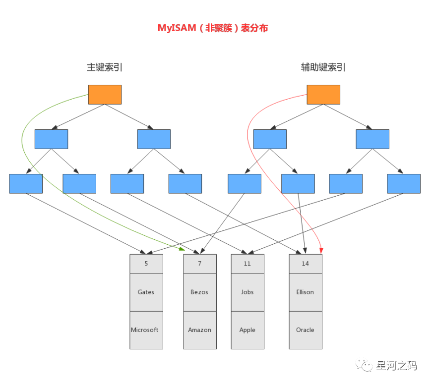

# 索引

概念：索引是为了加快数据查询的一种数据结构

## MySQL存储结构

>表->段->区->页->行
>
>在数据库中,不论读哪一行数据,还是读多行数据,都是将这些行所在的页进行加载。也就是存储空间的基本单位就是页。
>
>一个页就是一颗B+树的节点,数据库I/O操作的最小单位是页,与数据库相关的内容都会存储在页的结构里。

## Mysql为什么使用B+树索引

- 在一棵B+树中,每个节点都是一个页,每次新建节点的时候,就会新建一个页。
- B+数的同一层节点中,通过页的结构构成一个双向链表
- 非叶子节点,包括了多个索引行,每个索引行里面存储了索引键和指向下一页面的指针
- 叶子节点存储了关键字和行记录,在节点内部(也就是页结构的内部)记录的是一个单向链表

### 关键点：高度低、叶子节点是链表、查询稳定

- 和二叉树比，比如平衡二叉树，B+树是多叉树（MySql默认是5叉），同样的数据，高度比二叉树低

- 和B树比，B+树采用双向链表串联所有的叶子节点，形成一个链表，这意味着当我们执行范围查询时，Mysql可以利用这个特性，沿着叶子节点前进,但是B树要通过中序遍历才能完成范围查询。而之所以Nosql数据库会使用B树索引，是因为他不需要像关系型数据库那样大量查询都是范围查询

- B+树叶子节点存放数据，因此和B树比起来查询时间更稳定可预测

  非叶子节点:索引+指针、叶子节点:索引+数据【地址】

- B+树查询数据的磁盘IO更少。B+树内存节点并没有指向具体的数据,因此其内部节点相比B树更小,通常B+树更矮更胖,高度小查询磁盘的IO更少

### 其他结构问题：

- 二叉搜索树

  - 不平衡：左边的子节点比父节点小，右边的子节点比父节点大，查询效率低

- 平衡二叉树(AVL树)

  - 旋转耗时(左旋、右旋)

- 红黑树

  - 树太高

    在数据再内存中的情况，红黑树的表现是非常好的。但是对于数据在磁盘等辅助存储的设备情况中，红黑树并不适用,因为红黑树相对很高。当数据在磁盘中时,磁盘IO会成为性能瓶颈,设计的目标应该是降低IO次数,而树的高度越高,增删改查所需要的IO次数也会越多,会严重影响性能。

- 跳表

  - 写入的效率

    > 跳表是独立插入，且根据随机函数确定层数，没有旋转和维持平衡的开销，因此跳表的写入性能会比B+树要好。

  - - 都是最底层存放数据，上层存索引。
    - 写入数据时，都有可能会更新索引层，甚至增大层高。

  - 查询的效率

  - - 跳表是链表结构，并且通过二分查找的方式去查找数据，索引分散在不同的数据页中，查找数据磁盘IO次数多

  - 结论

  - - 跳表写入效率比B+Tree高。而读取效率主要受限于磁盘IO的效率，因此Redis的有序集合Zset就是基于链表实现的，因为Redis 是纯内存数据库,压根就不需要操作磁盘，B+Tree的低层级、仅3次IO的优势就体现不出来了

- BTree:多路平衡搜索树

  - InnoDB页默认大小16K，存储数据会造成树矮胖，查询更多更慢
  - B-Tree数据分散在每个节点，进行范围、顺序查找困难

- Hash

  - 通过散列算法，不支持范围查询

  - 哈希索引没有办法利用索引完成排序

  - 不能进行多字段查询

  - 在有大量重复键值的情况下,哈希索引的效率也是很低的(哈希碰撞问题)

    

<!-- more -->

## B+ Tree

### 数据存储的形式

#### 聚簇索引树-InnoDB

**又称主键索引树，除此之外，其他的索引树都是二级索引树**

表中数据按索引的顺数来存储，叶子节点即存储了真实的数据行，就是聚簇索引，一张表只能有一个聚簇索引

**叶子节点存储数据自身**

- 数据页（根据页目录和最小最大记录通过二分查找数据）
  
  					
  
  - 文件头File Header -- 表示页的信息， 包含两个指针，分别指向上一页和下一页
  
  - 页头 Page Header -- 表示页的状态
  
  - 最小和最大记录 Infimum + supremum -- 两个虚拟的伪记录，分别表示页中的最小记录和最大记录
  
  - 用户记录 User Records -- 存储的记录内容
  
  - 空闲空间 Free Space -- 页中还没被使用的空间
  
  - 页目录 Page Directory -- 存储用户记录的相对位置，对记录起到索引作用
  
    - 以【数据页】为单位进行读写，读取数据时会将一整页数据进行读取， 默认页大小是【16KB】
  
      
  
  - 文件尾 File Tailer -- 校验页是否完整

  

##### 二级索引树

- 叶子节点存放的是主键值以及索引字段值，不是实际数据，因此需要有一次回表查询，因此可以通过覆盖索引来优化回表查询
- Read View的可见性通过数据也得Page Header 进行判断的

#### 非聚集索引-MyIASM

**存储的是数据的物理地址**

特点:不支持事务、不支持外键约束

##### 二级索引树

在MyISAM中，主索引和辅助索引（Secondary key）在结构上没有任何区别，只是主索引要求key是唯一的，而辅助索引的key可以重复

## 索引分析-EXPLAIN

- id

  「选择标识符」：在一个查询语句中每个【SELECT】关键字都对应一个唯一的 id。两种例外的情况：

  - - **「id相同」**优化器对子查询做了**「半连接（semi-jion）优化」**时，两个查询的 id 是一样的

    - **「id为null」**

      因为**「union会对结果去重，内部创建了一个 <union1,2> 名字的临时表，把查询 1 和查询 2 的结果集都合并到这个临时表中，利用唯一键进行去重，这种情况下查询 id 就为 NULL」**。

- select_type

  | 查询的类型           | 类型含义                                                     |
  | :------------------- | :----------------------------------------------------------- |
  | SIMPLE               | 简单的select查询，不包含子查询或union查询，是最常见的。      |
  | PRIMARY              | 若查询中包含有子查询，最外层查询会别标记为PRIMARY            |
  | UNION                | 若第二个SELECT出现在UNION之后，则被标记为UNION；若UNION包含在FROM子句的子查询中,外层SELECT将被标记为：DERIVED |
  | SUBQUERY             | 在SELECT或WHERE列表中包含了子查询                            |
  | DERIVED              | 在FROM列表中包含的子查询被标记为DERIVED(衍生);MySQL会递归执行这些子查询, 把结果放在临时表里。 |
  | UNION RESULT         | 从UNION表获取结果的SELECT                                    |
  | DEPENDENT SUBQUERY   | 在SELECT或WHERE列表中包含了子查询,子查询基于外层             |
  | UNCACHEABLE SUBQUREY | 无法被缓存的子查询                                           |

- type
  - All < Index < range < ref < ref_eq < const < system
    - ALL：表示全表扫描，性能最差。
    - index：表示基于索引的全表扫描，先扫描索引再扫描全表数据。
    - range：表示使用索引范围查询。使用>、>=、<、<=、in等等。
    - ref：表示使用非唯一索引进行单值查询。
    - eq_ref：一般情况下出现在多表join查询，表示前面表的每一个记录，都只能匹配后面表的一 行结果。
    - const：表示使用主键或唯一索引做等值查询，常量查询。
    - system：表示不用访问表，速度最快。
  
- possible_keys

  表示在某个查询语句中，对某个表执行单表查询时**「可能用到的索引列表」**

- key
	- 使用到的索引
	
- key_len
	
	表示查询使用索引的字节数量。可以判断是否全部使用了组合索引
	
    - 索引的长度，越小越好
    
    - 字符长度*字节数+类型+是否允许为空
       如：varchar(50) = 3 * 50 + 2 + 1
       int(255) 不允许为空，长度为 4 + 0 不与编码、长度相关
       - int 类型4字节，char和varchar的长度是值字符数，一个字符gbk编码为2字节，utf-8编码为3字节 ​
       - int + 0, char + 0, varchar + 2
       - 允许为空 1字节，不为空0字节
  
- ref
  
  当使用索引列等值匹配的条件去执行查询时，ref 列展示**「与索引列作等值匹配的对象」**。
  
- rows
  
  预估扫描的行数
  
  - 如果查询优化器决定使用全表扫描的方式对某个表执行查询时，rows 列就代表预计需要扫描的行数；
  - 如果使用索引来执行查询时，rows 列就代表预计扫描的索引记录行数。
  
- filtered

  按表条件过滤的行百分比

  - 如果是全表扫描，filtered 值代表满足 where 条件的行数占表总行数的百分比
  - 如果是使用索引来执行查询，filtered 值代表从索引上取得数据后，满足其他过滤条件的数据行数的占比。

- Extra
  
  - Using where
  
    表示查询需要通过索引回表查询数据。
  
  - Using index覆盖索引
  
    表示查询需要通过索引，索引就可以满足所需数据。
  
  - Using Index Condition 索引下推
  
  - Using filesort
  
    表示查询出来的结果需要额外排序，
  
  - Using temprorary
  
    查询使用到了临时表，一般出现于去重、分组等操作

## 最左匹配

- mysql联合索引为什么遵循最左匹配原则

  mysql创建联合索引的规则是首先会对联合合索引的最左边的，也就是第一个字段的数据进行排序，在第一个字段的排序基础上，然后再对后面第二个字段进行排序。第一个字段是有序的，第二个字段没法保证有序。

- 数据库表创建（a,b,c）的联合索引，则必须保证where条件里最左边是a字段才能生效
  - 索引生效 (索引下推,索引截断)，如：
    where a = 0
    where a = 0 and  b = 0
    where a = 0 and c = 0
    where a = 0 and c = 0 and b = 0
  - 但 select * from t where b = 0 或 where c = 0 也会走索引 (覆盖索引)
    - 因为表中没有非索引字段，所以 select * 相当于 select id,a,b,c，然后这个查询的内容和条件 都在联合索引树里，因为联合索引树的叶子节点包含「索引列+主键」，所以查联合索引树就能查到全部结果了，这个就是覆盖索引。
    - 如果加了一个非索引字段后，则会进行全表扫描，因为不符合最左匹配，且在索引树上找不到

## 索引类型

### 存储结构维度划分

B Tree索引、Hash索引、B + Tree索引

### 应用层次维度划分

普通索引、唯一索引、主键索引、全文索引，空间索引

> 空间索引基本不使用，这里不做介绍

### 索引键值类型维度划分

主键索引、辅助索引（二级索引）

### 数据存储和索引键值逻辑关系维度划分

聚集索引（聚簇索引）、非聚集索引（非聚簇索引）

### 索引组成维度划分

组合索引（复合索引）、单一索引

## 覆盖索引

- 要查询的字段值都能出现在二级索引树上

## 全文索引

- 用的比较少了一般用ES

## 普通索引

- 仅提高查询效率

## 联合索引

- 多个字段组成索引

## 唯一索引

- 唯一约束+提高查询效率

## 主键索引

- 主键约束+提高查询效率

## hash索引

- 根据key-value 效率非常高

## 前缀索引

- 利用数据前几个字符的索引

## 索引下推

- 遍历索引时，会先对索引包含的字段进行判断，直接过滤掉不满足条件的记录，减少回表。
  如：where a = 0 and c = 0，首先会索引截断，然后截断的字段c会被下推到存储引擎层进行条件判断，因为 c字段值是在联合索引 (a,b,c)中，然后过滤出符合条件的数据返回Server层

## 失效场景

- like子句
  - %xxx 或 %xxx% 【可能】会导致索引失效
  - xxx% 不会导致索引失效
    ​索引树存放的数据是有顺序的，知道前面的，可以在索引树上扫描进行比较。 如果前缀不知道，如 % xxx，前缀不知道，要查的数据可能是Axxx，Bxxx, 就不知道从索引树的哪个节点开始进行扫描，只能全表扫描
- 调用内置函数
  ​索引存储的为数据原始值而非通过函数计算后的数据，因此不会走索引​
- 不满足最左匹配
- 索引隐式转换
  ​MySQL遇到数字和字符串比较时，会自动将【字符串转换为数字】， 如假设字段a为varchar类型，执行 select * from t where a = 1000时， MySQL会进行类型转换，实际相当于执行 select * from t where CAST(a as signed int) = 1000, 相当于对索引字段使用了函数。
  但是反过来，假设a是数字类型， 执行slect * from t where a = "10000",也会进行类型转换 是可以【走索引】的，相当于执行 select * from t where a = CAST("10000" as signed int)
  因此这也可以作为一种优化手段
- not in , !=
- OR
  - wher中包含不是索引的列就会导致索引失效

## count

- 性能排序(InnoDB)：

  count(\*) = count(1) > count(主键字段) > count (字段)
  
  - MySQL会将count(\*)转换为count(0) 
  - MySQL针对count(\*)和count(1)会有一个优化，会优先选择key_len最小的二级索引进行扫描
- 通过count函数统计有多少个记录时，MySQL的server层会维护一个名叫count的变量。
  server层会循环向InnoDB读取一条记录，如果count函数指定的参数不为NULL，那么就会将变量的count加1，直至符合条件的记录全部被读取完。最后将count变量值发送给客户端
  ​如果表里只有主键索引，没有二级索引时，那么InnoDB循环遍历聚簇索引，将读取到的记录返回sever层，然后读取记录中的id值，就会判断id是否为NULL，不为NULL，就将count变量加1。
  如果有二级索引则会遍历二级索引树，因为二级索引存储的是主键以及索引字段，数据比聚簇索引少，遍历二级索引的成本比遍历聚簇索引小
- 如果某个查询语句使用了二级索引，但是查询的数据不是主键值，这时在二级索引找到主键值后，需要去聚簇索引中获得数据行，这个过程就叫作「回表」，也就是说要查两个 B+ 树才能查到数据。不过，当查询的数据是主键值时，因为只在二级索引就能查询到，不用再去聚簇索引查，这个过程就叫作「索引覆盖」，也就是只需要查一个 B+ 树就能找到数据

## 索引与排序

### 排序方式

MySQL查询支持filesort和index两种方式的排序，

- filesort是先把结果查出，然后在缓存或磁盘进行排序 操作，效率较低。
- index是指利用索引自动实现排序，不需另做排序操作，效率会比较高。

### 排序算法

filesort有两种排序算法：双路排序和单路排序。

- 双路排序：需要两次磁盘扫描读取，得到最终数据。第一次将排序字段读取出来，然后排序；第二 次去读取其他字段数据。
- 单路排序：从磁盘查询所需的所有列数据，然后在内存排序将结果返回。
- 如果查询数据超出缓存 sort_buffer，会导致多次磁盘读取操作，并创建临时表，最后产生了多次IO，反而会增加负担。
- 解决方案：少使用select *；增加sort_buffer_size容量和max_length_for_sort_data容量。

###### 来源:

https://rumenz.com/rumenbiji/mysql-index.html

https://www.modb.pro/db/394608

https://www.modb.pro/db/400446

https://cloud.tencent.com/developer/article/1541265

https://dev.mysql.com/doc/refman/5.7/en/index-btree-hash.html

https://segmentfault.com/a/1190000041290817

https://www.cnblogs.com/kerrycode/p/9909093.html

https://www.modb.pro/db/402451

https://www.modb.pro/db/411170
