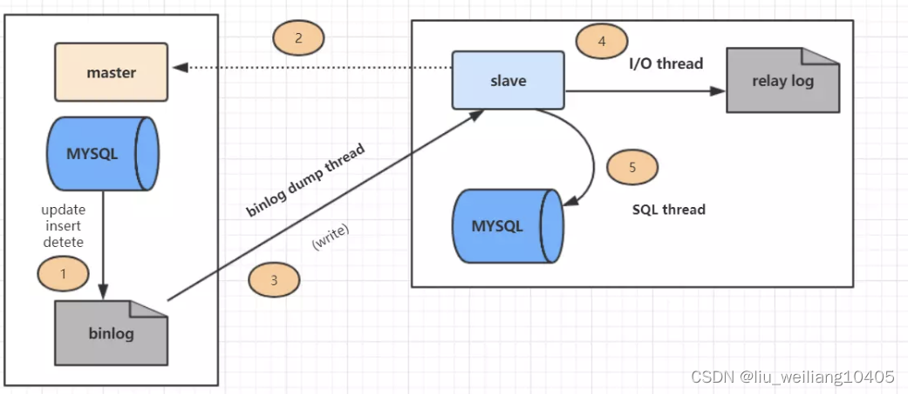
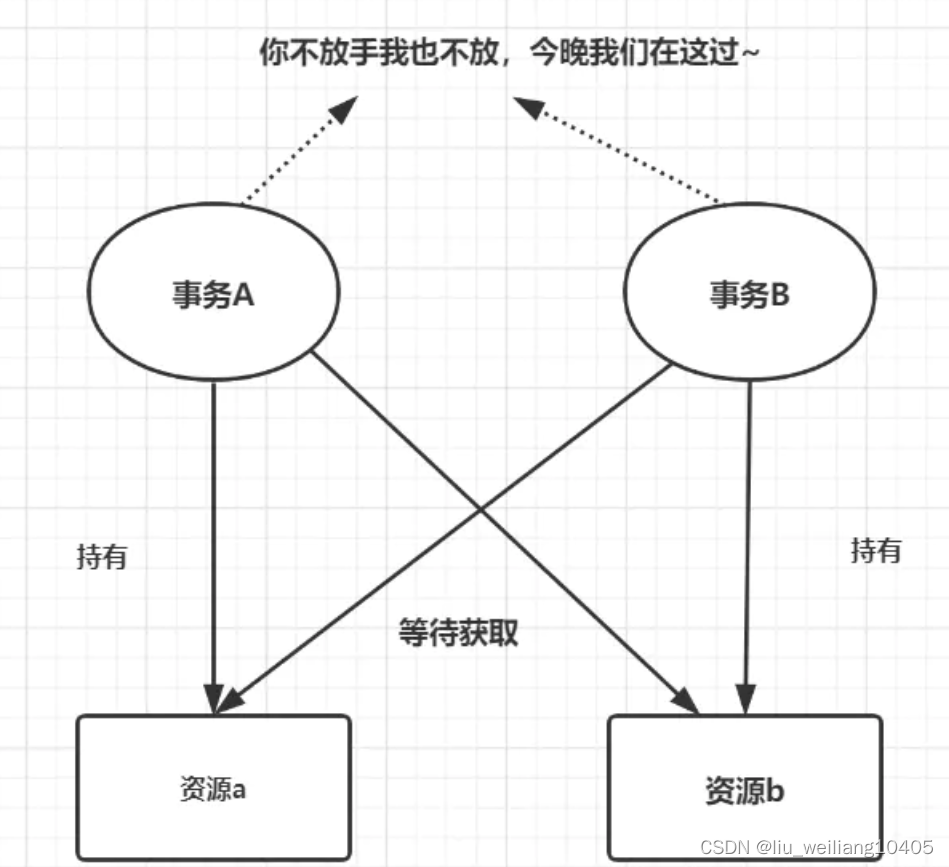
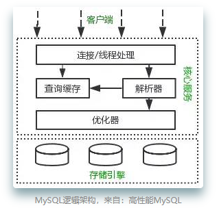
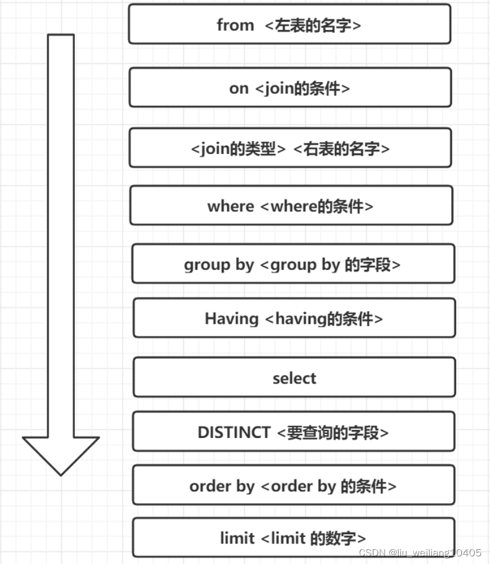
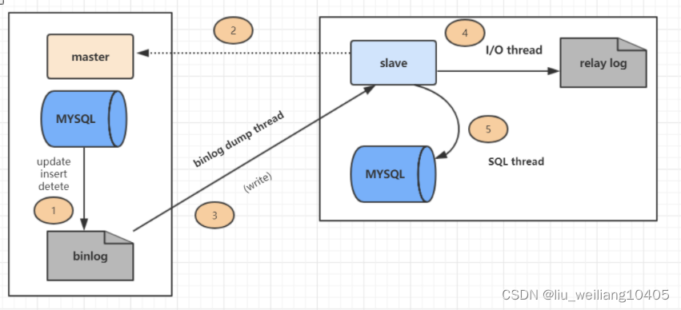

# MySQL-面试题

## InnoDB引擎的索引

使用索引可以加快查询速度，其实上就是将无序的数据变成有序（有序就能加快检索速度）

索引的本质：**索引是数据结构**。

**数据库索引**，是数据库管理系统中一个排序的数据结构，以协助快速查询、更新数据库表中数据。**索引的实现通常使用B树及其变种B+树**。

### 聚集索引与非聚集索引的区别

- 一个表中只能拥有一个聚集索引，而非聚集索引一个表可以存在多个。
- 聚集索引，索引中键值的逻辑顺序决定了表中相应行的物理顺序；非聚集索引，索引中索引的逻辑顺序与磁盘上行的物理存储顺序不同。
- 索引是通过二叉树的数据结构来描述的，我们可以这么理解聚簇索引：索引的叶节点就是数据节点。而非聚簇索引的叶节点仍然是索引节点，只不过有一个指针指向对应的数据块。
- 聚集索引：物理存储按照索引排序；非聚集索引：物理存储不按照索引排序；

### 那为什么不使用红黑树或者B树呢？

MySQL的数据是存储在硬盘的，在查询时一般是不能「一次性」把全部数据加载到内存中

红黑树是「二叉查找树」的变种，一个Node节点只能存储一个Key和一个Value

B和B+树跟红黑树不一样，它们算是「多路搜索树」，相较于「二叉搜索树」而言，一个Node节点可以存储的信息会更多，「多路搜索树」的高度会比「二叉搜索树」更低。

了解了区别之后，其实就很容易发现，在数据不能一次加载至内存的场景下，数据需要被检索出来，选择B或B+树的理由就很充分了（一个Node节点存储信息更多（相较于二叉搜索树），树的高度更低，树的高度影响检索的速度）

B+树相对于B树而言，它又有两种特性。

- 一、B+树非叶子节点不存储数据，在相同的数据量下，B+树更加矮壮。（这个应该不用多解释了，数据都存储在叶子节点上，非叶子节点的存储能存储更多的索引，所以整棵树就更加矮壮）
- 二、B+树叶子节点之间组成一个链表，方便于遍历查询（遍历操作在MySQL中比较常见）

在MySQL InnoDB引擎下，每创建一个索引，相当于生成了一颗B+树。

如果该索引是「聚集(聚簇)索引」，那当前B+树的叶子节点存储着「主键和当前行的数据」

如果该索引是「非聚簇索引」，那当前B+树的叶子节点存储着「主键和当前索引列值」

比如写了一句sql：select * from user where id >=10，那只要定位到id为10的记录，然后在叶子节点之间通过遍历链表(叶子节点组成的链表)，即可找到往后的记录了。

由于B树是会在非叶子节点也存储数据，要遍历的时候可能就得跨层检索，相对麻烦些。

基于树的层级以及业务使用场景的特性，所以MySQL选择了B+树作为索引的底层数据结构。

对于哈希结构，其实InnoDB引擎是「自适应」哈希索引的（hash索引的创建由InnoDB存储引擎引擎自动优化创建，我们是干预不了）

<!-- more -->

### Hash索引和B+树区别是什么？你在设计索引是怎么抉择的？

- B+树可以进行范围查询，Hash索引不能。
- B+树支持联合索引的最左侧原则，Hash索引不支持。
- B+树支持order by排序，Hash索引不支持。
- Hash索引在等值查询上比B+树效率更高。
- B+树使用like 进行模糊查询的时候，like后面（比如%开头）的话可以起到优化的作用，Hash索引根本无法进行模糊查询。

### 索引有哪些优缺点？

优点：

- 唯一索引可以保证数据库表中每一行的数据的唯一性
- 索引可以加快数据查询速度，减少查询时间

缺点：

- 创建索引和维护索引要耗费时间
- 索引需要占物理空间，除了数据表占用数据空间之外，每一个索引还要占用一定的物理空间
- 以表中的数据进行增、删、改的时候，索引也要动态的维护。

### 索引有哪几种类型？

- 主键索引: 数据列不允许重复，不允许为NULL，一个表只能有一个主键。
- 唯一索引: 数据列不允许重复，允许为NULL值，一个表允许多个列创建唯一索引。
- 普通索引: 基本的索引类型，没有唯一性的限制，允许为NULL值。
- 全文索引：是目前搜索引擎使用的一种关键技术，对文本的内容进行分词、搜索。
- 覆盖索引：查询列要被所建的索引覆盖，不必读取数据行

### InnoDB引擎中的索引策略

- 覆盖索引

- 最左前缀原则

- 索引下推

  索引下推优化是 MySQL 5.6 引入的， 可以在索引遍历过程中，对索引中包含的字段先做判断，直接过滤掉不满足条件的记录，减少回表次数。

### 创建索引有什么原则呢？

- 最左前缀匹配原则
- 频繁作为查询条件的字段才去创建索引
- 频繁更新的字段不适合创建索引
- 索引列不能参与计算，不能有函数操作
- 优先考虑扩展索引，而不是新建索引，避免不必要的索引
- 在order by或者group by子句中，创建索引需要注意顺序
- 区分度低的数据列不适合做索引列(如性别）
- 定义有外键的数据列一定要建立索引。
- 对于定义为text、image数据类型的列不要建立索引。
- 删除不再使用或者很少使用的索引

### 组合索引是什么？为什么需要注意组合索引中的顺序？

组合索引，用户可以在多个列上建立索引,这种索引叫做组合索引。

因为InnoDB引擎中的索引策略的最左原则，所以需要注意组合索引中的顺序。

### 如何写sql能够有效的使用到复合索引

复合索引，也叫组合索引，用户可以在多个列上建立索引,这种索引叫做复合索引。

当我们创建一个组合索引的时候，如(k1,k2,k3)，相当于创建了（k1）、(k1,k2)和(k1,k2,k3)三个索引，这就是最左匹配原则。

select * from table where k1=A AND k2=B AND k3=D

有关于复合索引，我们需要关注查询Sql条件的顺序，确保最左匹配原则有效，同时可以删除不必要的冗余索引。

## 回表

### 什么叫做回表

所谓的**回表**其实就是，当我们使用索引查询数据时，检索出来的数据可能包含其他列，但走的索引树叶子节点只能查到当前列值以及主键ID，所以需要根据主键ID再去查一遍数据，得到SQL 所需的列

举个例子，我这边建了给订单号ID建了个索引，但我的SQL 是：select orderId,orderName from orderdetail where orderId = 123

SQL都订单ID索引，但在订单ID的索引树的叶子节点只有orderId和Id，而我们还想检索出orderName，所以MySQL 会拿到ID再去查出orderName给我们返回，这种操作就叫回表

想要避免回表，也可以使用覆盖索引（能使用就使用，因为避免了回表操作）。

所谓的**覆盖索引**，实际上就是你想要查出的列刚好在叶子节点上都存在，比如我建了orderId和orderName联合索引，刚好我需要查询也是orderId和orderName，这些数据都存在索引树的叶子节点上，就不需要回表操作了。

### B+树在满足聚簇索引和覆盖索引的时候不需要回表查询数据？

- 在B+树的索引中，叶子节点可能存储了当前的key值，也可能存储了当前的key值以及整行的数据，这就是聚簇索引和非聚簇索引。 在InnoDB中，只有主键索引是聚簇索引，如果没有主键，则挑选一个唯一键建立聚簇索引。如果没有唯一键，则隐式的生成一个键来建立聚簇索引。
- 当查询使用聚簇索引时，在对应的叶子节点，可以获取到整行数据，因此不用再次进行回表查询。

### 非聚簇索引一定会回表查询吗？

不一定，如果查询语句的字段全部命中了索引，那么就不必再进行回表查询（哈哈，覆盖索引就是这么回事）。

> 举个简单的例子，假设我们在学生表的上建立了索引，那么当进行select age from student where age < 20的查询时，在索引的叶子节点上，已经包含了age信息，不会再次进行回表查询。

## 什么是最左前缀原则

- 最左前缀原则，就是最左优先，在创建多列索引时，要根据业务需求，where子句中使用最频繁的一列放在最左边。
- 先匹配最左边的，索引只能用于查找key是否存在（相等），遇到范围查询 (>、<、between、like左匹配)等就不能进一步匹配了，后续退化为线性查找

## 主键

### 数据库自增主键可能遇到什么问题。

- 使用自增主键对数据库做分库分表，可能出现诸如主键重复等的问题。解决方案的话，简单点的话可以考虑使用UUID哈
- 自增主键会产生表锁，从而引发问题
- 自增主键可能用完问题。

### mysql自增主键用完了怎么办？

自增主键一般用int类型，一般达不到最大值，可以考虑提前分库分表的。

### 不用MySQL自增的主键会有什么问题

首先主键得保证它的唯一性和空间尽可能短，这两块是需要考虑的。

另外，由于索引的特性（有序），如果生成像uuid类似的主键，那插入的的性能是比自增的要差的

因为生成的uuid，在插入时有可能需要移动磁盘块（比如，块内的空间在当前时刻已经存储满了，但新生成的uuid需要插入已满的块内，就需要移动块的数据）

### 自增ID还是UUID

如果是单机的话，选择自增ID；如果是分布式系统，优先考虑UUID，但还是最好自己公司有一套分布式唯一ID生产方案吧。

- 自增ID：数据存储空间小，查询效率高。但是如果数据量过大,会超出自增长的值范围，多库合并，也有可能有问题。
- uuid：适合大量数据的插入和更新操作，但是它无序的，插入数据效率慢，占用空间大。

### 如何选择合适的分布式主键方案

#### 特性与要求

1. 唯一性：生成的 ID 全局唯一，在特定范围内冲突概率极小。
2. 有序性：生成的 ID 按某种规则有序，便于数据库插入及排序。
3. 可用性：可保证高并发下的可用性, 确保任何时候都能正确的生成 ID。
4. 自主性：分布式环境下不依赖中心认证即可自行生成 ID。
5. 安全性：不暴露系统和业务的信息, 如：订单数,用户数等。

#### 方法

- UUID

  - **「优点：」**

  - - 本地生成，没有网络消耗，生成简单，没有高可用风险。

  - **「缺点：」**

  - - 不易于存储：UUID 太长， 16 字节 128 位，通常以 36 长度的字符串表示，很多场景不适用。
    - 信息不安全：基于 MAC 地址生成 UUID 的算法可能会造成 MAC 地址泄露，这个漏洞曾被用于寻找梅丽莎病毒的制作者位置。
    - 无序查询效率低：由于生成的 UUID 是无序不可读的字符串，所以其查询效率低。

- 数据库自增长序列或字段。

  - **「优点」**

    简单，天然有序。

  - **「缺点」**

    - 并发性不好。

    - 数据库写压力大。
    - 数据库故障后不可使用。
    - 存在数量泄露风险。

  - 优化方案 

    - **「数据库水平拆分，设置不同的初始值和相同的自增步长」**

      **「核心思想：将数据库进行水平拆分，每个数据库设置不同的初始值和相同的自增步长 。」**

      - **「可保证每台数据库生成的 ID 是不冲突的，但这种固定步长的方式也会带来扩容的问题」**，很容易想到当扩容时会出现无 ID 初始值可分的窘境。

        解决方案有：

        - **「根据扩容考虑决定步长」**。

        - **「增加其他位标记区分扩容。」**

          这其实都是在需求与方案间的权衡，根据需求来选择最适合的方式。

    - **「批量缓存自增 ID」**

      **「核心思想：如果使用单台机器做 ID 生成，可以避免固定步长带来的扩容问题（方案 1 的缺点）。」**

      具体做法是：

      **「每次批量生成一批 ID 给不同的机器去慢慢消费，这样数据库的压力也会减小到 N 分之一，且故障后可坚持一段时间 。」**

      但这种做法的**「缺点是服务器重启、单点故障会造成 ID 不连续」**。

      **「没有最好的方案，只有最适合的方案。」**

- Twitter的snowflake算法

  - **「优点」**：

  - - 整体上按照时间按时间趋势递增，后续插入索引树的时候性能较好。
    - 整个分布式系统内不会产生 ID 碰撞（由数据中心标识 ID、机器标识 ID 作区分）。
    - 本地生成，且不依赖数据库(或第三方组件)没有网络消耗，所以效率高（每秒能够产生 26 万 ID 左右）。

  - **「缺点：」**

    由于雪花算法是强依赖于时间的，在分布式环境下，如果发生时钟回拨，很可能会引起 ID 重复、 ID 乱序、服务会处于不可用状态等问题。

  - **「解决方案有：」**

  - - 将 ID 生成交给少量服务器，并关闭时钟同步。
    - 直接报错，交给上层业务处理。
    - 如果回拨时间较短，在耗时要求内，比如 5ms，那么等待回拨时长后再进行生成。
    - 如果回拨时间很长，那么无法等待，可以匀出少量位（1~2 位）作为回拨位，一旦时钟回拨，将回拨位加 1，可得到不一样的 ID， 2 位回拨位允许标记 3 次时钟回拨，基本够使用。如果超出了，可以再选择抛出异常。

- Redis的Incr命令获取全局唯⼀ID

  - **「核心思想：Redis 的所有命令操作都是单线程的，本身提供像 incr 和 increby这样的自增原子命令，所以能保证生成的 ID 肯定是唯一有序的。」**

    **「Redis Incr 命令将 key 中储存的数字值增⼀。如果 key 不存在，那么 key 的值会先被初始化为 0，然后再执⾏INCR 操作。」**

    - **「优点：」**

    - - 不依赖于数据库，灵活方便，且性能优于数据库。
      - 数字 ID 天然排序，对分页或者需要排序的结果很有帮助。

    - **「缺点：」**

    - - 如果系统中没有 Redis，还需要引入新的组件，增加系统复杂度。
      - 需要编码和配置的工作量比较大。

    - **「优化方案：」**考虑到单节点的性能瓶颈，可以使用 Redis 集群来获取更高的吞吐量，

      - 库水平拆分，设置不同的初始值和相同的步长；
      - 批量缓存自增 ID

- 利用zookeeper生成唯一ID

- MongoDB的ObjectId

## 事务

### 什么是数据库事务？

事务可以使「一组操作」要么全部成功，要么全部失败

### MySQL事务得四大特性以及实现原理

- 原子性： 事务作为一个整体被执行，包含在其中的对数据库的操作要么全部被执行，要么都不执行。
- 隔离性： 在事务「并发」执行时，他们内部的操作不能互相干扰。如果多个事务可以同时操作一个数据，那么就会产生脏读、重复读、幻读的问题。
- 持久性： 表示事务完成以后，该事务对数据库所作的操作更改，将持久地保存在数据库之中。
- 一致性： 指在事务开始之前和事务结束以后，数据不会被破坏，「隔离性」「原子性」「持久性」均是为了保障「一致性」的手段

事务ACID特性的实现思想

- 原子性：是使用 undo log来实现的，如果事务执行过程中出错或者用户执行了rollback，系统通过undo log日志返回事务开始的状态。
- 持久性：使用 redo log来实现，只要redo log日志持久化了，当系统崩溃，即可通过redo log把数据恢复。
- 隔离性：通过锁以及MVCC,使事务相互隔离开。
- 一致性：通过回滚、恢复，以及并发情况下的隔离性，从而实现一致性。

## 隔离级别

### 事务的隔离级别有哪些？MySQL的默认隔离级别是什么？

- 读未提交（Read Uncommitted）

  事务B读取到了事务A还没提交的数据，这种用专业术语来说叫做「脏读」。

- 读已提交（Read Committed）

  「不可重复读」：一个事务读取到另外一个事务已经提交的数据，也就是说一个事务可以看到其他事务所做的修改。

- 可重复读（Repeatable Read）

  「幻读」指的是指在一个事务内读取到了别的事务插入的数据，导致前后读取不一致。

- 串行化（Serializable）

Mysql默认的事务隔离级别是可重复读(Repeatable Read)

### Innodb的事务与日志的实现方式

有多少种日志

innodb两种日志redo和undo。

日志的存放形式

- redo：在页修改的时候，先写到 redo log buffer 里面， 然后写到 redo log 的文件系统缓存里面(fwrite)，然后再同步到磁盘文件（ fsync）。
- Undo：在 MySQL5.5 之前， undo 只能存放在 ibdata文件里面， 5.6 之后，可以通过设置 innodb_undo_tablespaces 参数把 undo log 存放在 ibdata之外。

事务是如何通过日志来实现的

- 因为事务在修改页时，要先记 undo，在记 undo 之前要记 undo 的 redo， 然后修改数据页，再记数据页修改的 redo。 Redo（里面包括 undo 的修改） 一定要比数据页先持久化到磁盘。
- 当事务需要回滚时，因为有 undo，可以把数据页回滚到前镜像的 状态，崩溃恢复时，如果 redo log 中事务没有对应的 commit 记录，那么需要用 undo把该事务的修改回滚到事务开始之前。
- 如果有 commit 记录，就用 redo 前滚到该事务完成时并提交掉。

### redo log和undo log的区别

 redo log：记录的是物理级别上的页修改操作，比如页号，偏移量，写入的数据，主要是为了保证数据的可靠性。

undo log：记录的是逻辑操作日志，比如对某一行数据进行了insert操作，那么undo log就记录一条与之相反的delete操作。主要用于事务的回滚和一致性非锁定读。

### 隔离级别与锁的关系

#### [Innodb中的事务隔离级别和锁的关系 - 美团技术团队 (meituan.com)](https://tech.meituan.com/2014/08/20/innodb-lock.html)

## 数据库锁

### Mysql中有哪几种锁

- 表锁： 开销小，加锁快；锁定力度大，发生锁冲突概率高，并发度最低;不会出现死锁。

- 行锁： 开销大，加锁慢；会出现死锁；锁定粒度小，发生锁冲突的概率低，并发度高。

  行锁实际上是作用在索引之上的。当我们的SQL命中了索引，那锁住的就是命中条件内的索引节点（这种就是行锁），如果没有命中索引，那我们锁的就是整个索引树（表锁）。

  锁住的是整棵树还是某几个节点，完全取决于SQL条件是否有命中到对应的索引节点。

  - 读锁（共享锁、S锁）

    读锁是共享的，多个事务可以同时读取同一个资源，但不允许其他事务修改

  - 写锁（排它锁、X锁）

    写锁是排他的，写锁会阻塞其他的写锁和读锁。

- 页锁： 开销和加锁速度介于表锁和行锁之间；会出现死锁；锁定粒度介于表锁和行锁之间，并发度一般

### 按照锁的粒度分，数据库锁有哪些呢？锁机制与InnoDB锁算法

 

- 按锁粒度分有：表锁，页锁，行锁
- 按锁机制分有：乐观锁，悲观锁

### 从锁的类别角度讲，MySQL都有哪些锁呢？

从锁的类别上来讲，有共享锁和排他锁。

- 共享锁: 又叫做读锁。当用户要进行数据的读取时，对数据加上共享锁。共享锁可以同时加上多个。
- 排他锁: 又叫做写锁。当用户要进行数据的写入时，对数据加上排他锁。排他锁只可以加一个，他和其他的排他锁，共享锁都相斥。

### 数据库的乐观锁和悲观锁。

悲观锁：

悲观锁只属于当前事务，所以一个事务拥有（获得）悲观锁后，其他任何事务都不能对数据进行修改，只能等待锁被释放才可以执行。

乐观锁：

乐观锁允许多个事务同时对数据进行变动。实现方式：乐观锁一般会使用版本号机制或CAS算法实现。

### MySQL中InnoDB引擎的行锁是怎么实现的？

基于索引来完成行锁的。

select * from t where id = 666 for update;

for update 可以根据条件来完成行锁锁定，并且 id 是有索引键的列，如果 id 不是索引键那么InnoDB将实行表锁。

### 什么是死锁？怎么解决？

死锁是指两个或多个事务在同一资源上相互占用，并请求锁定对方的资源，从而导致恶性循环的现象。看图形象一点，如下：

死锁有四个必要条件：互斥条件，请求和保持条件，环路等待条件，不剥夺条件。

解决死锁思路，一般就是切断环路，尽量避免并发形成环路。

> - 如果不同程序会并发存取多个表，尽量约定以相同的顺序访问表，可以大大降低死锁机会。
> - 在同一个事务中，尽可能做到一次锁定所需要的所有资源，减少死锁产生概率；
> - 对于非常容易产生死锁的业务部分，可以尝试使用升级锁定颗粒度，通过表级锁定来减少死锁产生的概率；
> - 如果业务处理不好可以用分布式事务锁或者使用乐观锁
> - 死锁与索引密不可分，解决索引问题，需要合理优化你的索引

### MySQL 遇到过死锁问题吗，你是如何解决的？

我排查死锁的一般步骤是酱紫的：

- 查看死锁日志show engine innodb status;
- 找出死锁Sql
- 分析sql加锁情况
- 模拟死锁案发
- 分析死锁日志
- 分析死锁结果

### select for update有什么含义，会锁表还是锁行还是其他。

select for update 含义

select查询语句是不会加锁的，但是select for update除了有查询的作用外，还会加锁呢，而且它是悲观锁哦。至于加了是行锁还是表锁，这就要看是不是用了索引/主键啦。

没用索引/主键的话就是表锁，否则就是是行锁。

## MVCC

### MVCC的底层原理？

**MVCC本质上就是对比版本**。

MVCC的主要是通过read view和undo log来实现的

MVCC需要关注这几个知识点：

- 事务版本号

  在读取的时候生成一个”版本号”，等到其他事务commit了之后，才会读取最新已commit的”版本号”数据。

  通过「版本」的概念，这样就解决了脏读的问题，而「版本」其实就是对应快照的数据。

- 表的隐藏列

  在每行数据有两列隐藏的字段，分别是DB_TRX_ID（记录着当前ID）以及DB_ROLL_PTR（指向上一个版本数据在undo log 里的位置指针）

- undo log

- read view

  read view 实际上就是在查询时，InnoDB会生成一个read view，read view 有几个重要的字段，分别是：trx_ids（尚未提交commit的事务版本号集合），up_limit_id（下一次要生成的事务ID值），low_limit_id（尚未提交版本号的事务ID最小值）以及creator_trx_id（当前的事务版本号）

而针对于不同的隔离级别（read commit和repeatable read），无非就是read commit隔离级别下，每次都获取一个新的read view，repeatable read隔离级别则每次事务只获取一个read view

## MySQL调优

调优重点一般是在「开发规范」、「数据库索引」又或者说解决线上慢查询上

### 开发的规范和索引

- 规范上：只要有查询需求，都应该建索引

### 对慢查询都怎么优化？

- 我们平时写Sql时，都要养成用explain分析的习惯。
- 慢查询的统计，运维会定期统计给我们

优化慢查询：

- 分析语句，是否加载了不必要的字段/数据。
- 分析SQl执行句话，是否命中索引等。
- 如果SQL很复杂，优化SQL结构
- 如果表数据量太大，考虑分表

### 如何优化长难的查询语句

- 将一个大的查询分为多个小的相同的查询
- 减少冗余记录的查询。
- 一个复杂查询可以考虑拆成多个简单查询
- 分解关联查询，让缓存的效率更高。

### 优化特定类型的查询语句

- 比如使用select 具体字段代替 select *
- 使用count(*) 而不是count(列名)
- 在不影响业务的情况，使用缓存
- explain 分析SQL

### 日常工作中你是怎么优化SQL的？

- 加索引
- 避免返回不必要的数据
- 适当分批量进行
- 优化sql结构
- 分库分表
- 读写分离

### limit 1000000 加载很慢的话，你是怎么解决的呢？

方案一：如果id是连续的，可以这样，返回上次查询的最大记录(偏移量)，再往下limit

select id，name from employee where id>1000000 limit 10.

方案二：在业务允许的情况下限制页数：

建议跟业务讨论，有没有必要查这么后的分页啦。因为绝大多数用户都不会往后翻太多页。

方案三：order by + 索引（id为索引）

select id，name from employee order by id limit 1000000，10

方案四：利用延迟关联或者子查询优化超多分页场景。（先快速定位需要获取的id段，然后再关联）

SELECT a.* FROM employee a, (select id from employee where 条件 LIMIT 1000000,10 ) b where a.id=b.id

### 一条sql执行过长的时间，你如何优化，从哪些方面入手？

- 查看是否涉及多表和子查询，优化Sql结构，如去除冗余字段，是否可拆表等
- 优化索引结构，看是否可以适当添加索引
- 数量大的表，可以考虑进行分离/分表（如交易流水表）
- 数据库主从分离，读写分离
- explain分析sql语句，查看执行计划，优化sql
- 查看mysql执行日志，分析是否有其他方面的问题

### 百万级别或以上的数据，你是如何删除的？

- 我们想要删除百万数据的时候可以先删除索引
- 然后批量删除其中无用数据
- 删除完成后重新创建索引。

### 某个表有近千万数据，走对了索引，线上查询还是慢，如何优化。

- 索引优化，查看是不是有「字符串」检索的场景导致查询低效。这种查询走Elasticsearch
- 冷热数据分离
- 聚合表，线上的请求就查询聚合表的数据，不走原表。
- 分库分表
  - 分表方案（水平分表，垂直分表，切分规则hash等）
  - 分库分表中间件（Mycat，sharding-jdbc等）
  - 分库分表一些问题（事务问题？跨节点Join的问题）
  - 解决方案（分布式事务等）

### 大表查询的优化方案

- 优化shema、sql语句+索引；
- 可以考虑加缓存，memcached, redis，或者JVM本地缓存；
- 主从复制，读写分离；
- 分库分表；

### 说说分库与分表的设计

分库分表方案，分库分表中间件，分库分表可能遇到的问题

分库分表方案:

- 水平分库：以字段为依据，按照一定策略（hash、range等），将一个库中的数据拆分到多个库中。
- 水平分表：以字段为依据，按照一定策略（hash、range等），将一个表中的数据拆分到多个表中。
- 垂直分库：以表为依据，按照业务归属不同，将不同的表拆分到不同的库中。
- 垂直分表：以字段为依据，按照字段的活跃性，将表中字段拆到不同的表（主表和扩展表）中。

常用的分库分表中间件：

- sharding-jdbc（当当）
- Mycat
- TDDL（淘宝）
- Oceanus(58同城数据库中间件)
- vitess（谷歌开发的数据库中间件）
- Atlas(Qihoo 360)

分库分表可能遇到的问题

- 事务问题：需要用分布式事务啦
- 跨节点Join的问题：解决这一问题可以分两次查询实现
- 跨节点的count,order by,group by以及聚合函数问题：分别在各个节点上得到结果后在应用程序端进行合并。
- 数据迁移，容量规划，扩容等问题
- ID问题：数据库被切分后，不能再依赖数据库自身的主键生成机制啦，最简单可以考虑UUID
- 跨分片的排序分页问题（后台加大pagesize处理？）

### 数据库中间件了解过吗，sharding jdbc，mycat？

- sharding-jdbc目前是基于jdbc驱动，无需额外的proxy，因此也无需关注proxy本身的高可用。
- Mycat 是基于 Proxy，它复写了 MySQL 协议，将 Mycat Server 伪装成一个 MySQL 数据库，而 Sharding-JDBC 是基于 JDBC 接口的扩展，是以 jar 包的形式提供轻量级服务的。

### 分库分表迁移的过程

我们一般采取「双写」的方式来进行迁移，大致步骤就是：

一、增量的消息各自往新表和旧表写一份

二、将旧表的数据迁移至新库

三、迟早新表的数据都会追得上旧表（在某个节点上数据是同步的）

四、校验新表和老表的数据是否正常（主要看能不能对得上）

五、开启双读一部分流量走新表，一部分流量走老表），相当于灰度上线的过程

六、读流量全部切新表，停止老表的写入

七、提前准备回滚机制，临时切换失败能恢复正常业务以及有修数据的相关程序。

## 未分类

### MySQL 索引使用有哪些注意事项呢？

可以从三个维度回答这个问题：索引哪些情况会失效，索引不适合哪些场景，索引规则

索引哪些情况会失效

- 查询条件包含or，可能导致索引失效
- 如何字段类型是字符串，where时一定用引号括起来，否则索引失效
- like通配符可能导致索引失效。
- 联合索引，查询时的条件列不是联合索引中的第一个列，索引失效。
- 在索引列上使用mysql的内置函数，索引失效。
- 对索引列运算（如，+、-、*、/），索引失效。
- 索引字段上使用（！= 或者 < >，not in）时，可能会导致索引失效。
- 索引字段上使用is null， is not null，可能导致索引失效。
- 左连接查询或者右连接查询查询关联的字段编码格式不一样，可能导致索引失效。
- mysql估计使用全表扫描要比使用索引快,则不使用索引。

### Heap 表是什么？

HEAP 表存在于内存中，用于临时高速存储。

BLOB 或 TEXT 字段是不允许的

只能使用比较运算符=，<，>，=>，= <

HEAP 表不支持 AUTO_INCREMENT

索引不可为 NULL

### 最大ID记录

一张表，里面有 ID 自增主键，当 insert 了 17 条记录之后，删除了第 15,16,17 条记录，再把 Mysql 重启，再 insert 一条记录，这条记录的 ID 是 18 还是 15 ？

(1) 如果表的类型是 MyISAM，那么是 18

因为 MyISAM 表会把自增主键的最大 ID 记录到数据文件里，重启 MySQL 自增主键的最大ID 也不会丢失

（2）如果表的类型是 InnoDB，那么是 15

InnoDB 表只是把自增主键的最大 ID 记录到内存中，所以重启数据库或者是对表进OPTIMIZE 操作，都会导致最大 ID 丢失

### InnoDB与MyISAM的区别

- InnoDB支持事务，MyISAM不支持事务
- InnoDB支持外键，MyISAM不支持外键
- InnoDB 支持 MVCC(多版本并发控制)，MyISAM 不支持
- select count(*) from table时，MyISAM更快，因为它有一个变量保存了整个表的总行数，可以直接读取，InnoDB就需要全表扫描。
- Innodb不支持全文索引，而MyISAM支持全文索引（5.7以后的InnoDB也支持全文索引）
- InnoDB支持表、行级锁，而MyISAM支持表级锁。
- InnoDB表必须有主键，而MyISAM可以没有主键
- Innodb表需要更多的内存和存储，而MyISAM可被压缩，存储空间较小，。
- Innodb按主键大小有序插入，MyISAM记录插入顺序是，按记录插入顺序保存。
- InnoDB 存储引擎提供了具有提交、回滚、崩溃恢复能力的事务安全，与 MyISAM 比 InnoDB 写的效率差一些，并且会占用更多的磁盘空间以保留数据和索引

### 在高并发情况下，如何做到安全的修改同一行数据？

要安全的修改同一行数据，就要保证一个线程在修改时其它线程无法更新这行记录。一般有悲观锁和乐观锁两种方案~

使用悲观锁

悲观锁思想就是，当前线程要进来修改数据时，别的线程都得拒之门外~

比如，可以使用select…for update ~

select * from User where name=‘jay’ for update

以上这条sql语句会锁定了User表中所有符合检索条件（name=‘jay’）的记录。本次事务提交之前，别的线程都无法修改这些记录。

使用乐观锁

乐观锁思想就是，有线程过来，先放过去修改，如果看到别的线程没修改过，就可以修改成功，如果别的线程修改过，就修改失败或者重试。实现方式：乐观锁一般会使用版本号机制或CAS算法实现。

### LIKE 和 REGEXP 操作有什么区别

LIKE 和 REGEXP 运算符用于表示^和％。

SELECT * FROM employee WHERE emp_name REGEXP "^b"; 

SELECT * FROM employee WHERE emp_name LIKE "%b";

### mysql中in 和exists的区别。

要选择最外层循环小的，也就是，如果B的数据量小于A，适合使用in，如果B的数据量大于A，即适合选择exists，这就是in和exists的区别。

### MYSQL的主从延迟，你怎么解决？

一个服务器开放Ｎ个链接给客户端来连接的，这样有会有大并发的更新操作, 但是从服务器的里面读取binlog的线程仅有一个，当某个SQL在从服务器上执行的时间稍长 或者由于某个SQL要进行锁表就会导致，主服务器的SQL大量积压，未被同步到从服务器里。这就导致了主从不一致， 也就是主从延迟。

主从同步延迟的解决办法

- 主服务器要负责更新操作，对安全性的要求比从服务器要高，所以有些设置参数可以修改，比如sync_binlog=1，innodb_flush_log_at_trx_commit = 1 之类的设置等。
- 选择更好的硬件设备作为slave。
- 把一台从服务器当度作为备份使用， 而不提供查询， 那边他的负载下来了， 执行relay log 里面的SQL效率自然就高了。
- 增加从服务器喽，这个目的还是分散读的压力，从而降低服务器负载。

### 什么是数据库连接池?为什么需要数据库连接池呢?

连接池基本原理：

数据库连接池原理：在内部对象池中，维护一定数量的数据库连接，并对外暴露数据库连接的获取和返回方法。

应用程序和数据库建立连接的过程：

- 通过TCP协议的三次握手和数据库服务器建立连接
- 发送数据库用户账号密码，等待数据库验证用户身份
- 完成身份验证后，系统可以提交SQL语句到数据库执行
- 把连接关闭，TCP四次挥手告别。

数据库连接池好处：

- 资源重用 (连接复用)
- 更快的系统响应速度
- 新的资源分配手段
- 统一的连接管理，避免数据库连接泄漏

### 数据库存储日期格式时，如何考虑时区转换问题？

- datetime类型适合用来记录数据的原始的创建时间，修改记录中其他字段的值，datetime字段的值不会改变，除非手动修改它。
- timestamp类型适合用来记录数据的最后修改时间，只要修改了记录中其他字段的值，timestamp字段的值都会被自动更新。

- 

### Blob和text有什么区别？

- Blob用于存储二进制数据，而Text用于存储大字符串。
- Blob值被视为二进制字符串（字节字符串）,它们没有字符集，并且排序和比较基于列值中的字节的数值。
- text值被视为非二进制字符串（字符字符串）。它们有一个字符集，并根据字符集的排序规则对值进行排序和比较。

### 高性能MySQL慎用BLOB 与 TEXT

[为什么阿里巴巴不建议MySQL使用Text类型？ - SegmentFault 思否](https://segmentfault.com/a/1190000037765444)

BLOB与TEXT是为了存储极大的字符串而设计的数据类型，采用二进制与字符串方式存储。mysql对待这两个类型可谓煞费苦心，mysql会把这两种类型的值当做一个独立的对象处理，存储引擎在存储时通常会做特殊处理，当BLOB与TEXT的值太大时，InnoDB会使用专门的“外部”存储区域来进行存储，此时每个值在行内会采用1~4个自己存储指针，在外部存储区域存储实际值。

Mysql对BLOB与TEXT类型进行排序的处理上与其他类型不同，只针对最前面的max_sort_length自己进行排序，如果只需要对前面的更少的字节进行排序，那么可以通过设置max_sort_length参数或者substring(value,length)来截取部分字符串。

在实际使用中应该慎用这两个类型，尤其是会创建临时表的情况下，因为如果临时表大小超过max_heap_table_size或者tmp_table_size，就会将临时表存储在磁盘上，进而导致整体速度下降！

### mysql里记录货币用什么字段类型比较好？

- 货币在数据库中MySQL常用Decimal和Numric类型表示，这两种类型被MySQL实现为同样的类型。他们被用于保存与金钱有关的数据。

### mysql 的内连接、左连接、右连接有什么区别？

- Inner join 内连接，在两张表进行连接查询时，只保留两张表中完全匹配的结果集
- left join 在两张表进行连接查询时，会返回左表所有的行，即使在右表中没有匹配的记录。
- right join 在两张表进行连接查询时，会返回右表所有的行，即使在左表中没有匹配的记录。

### MySQL 的基础架构图

[MySQL体系架构图_顺kai的博客-CSDN博客_mysql体系结构图](https://blog.csdn.net/qq_39408435/article/details/118667021)

## 

### 什么是内连接、外连接、交叉连接、笛卡尔积呢？

- 内连接（inner join）：取得两张表中满足存在连接匹配关系的记录。
- 外连接（outer join）：取得两张表中满足存在连接匹配关系的记录，以及某张表（或两张表）中不满足匹配关系的记录。
- 交叉连接（cross join）：显示两张表所有记录一一对应，没有匹配关系进行筛选，也被称为：笛卡尔积。

### 说一下数据库的三大范式

- 第一范式：数据表中的每一列（每个字段）都不可以再拆分。
- 第二范式：在第一范式的基础上，分主键列完全依赖于主键，而不能是依赖于主键的一部分。
- 第三范式：在满足第二范式的基础上，表中的非主键只依赖于主键，而不依赖于其他非主键。

### mysql有关权限的表有哪几个呢？

MySQL服务器通过权限表来控制用户对数据库的访问，权限表存放在mysql数据库里，由mysql_install_db脚本初始化。这些权限表分别user，db，table_priv，columns_priv和host。

- user权限表：记录允许连接到服务器的用户帐号信息，里面的权限是全局级的。
- db权限表：记录各个帐号在各个数据库上的操作权限。
- table_priv权限表：记录数据表级的操作权限。
- columns_priv权限表：记录数据列级的操作权限。
- host权限表：配合db权限表对给定主机上数据库级操作权限作更细致的控制。这个权限表不受GRANT和REVOKE语句的影响。

### Mysql的binlog有几种录入格式？分别有什么区别？

> 有三种格式哈，statement，row和mixed。

- statement，每一条会修改数据的sql都会记录在binlog中。不需要记录每一行的变化，减少了binlog日志量，节约了IO，提高性能。由于sql的执行是有上下文的，因此在保存的时候需要保存相关的信息，同时还有一些使用了函数之类的语句无法被记录复制。
- row，不记录sql语句上下文相关信息，仅保存哪条记录被修改。记录单元为每一行的改动，基本是可以全部记下来但是由于很多操作，会导致大量行的改动(比如alter table)，因此这种模式的文件保存的信息太多，日志量太大。
- mixed，一种折中的方案，普通操作使用statement记录，当无法使用statement的时候使用row。

### InnoDB引擎的4大特性，了解过吗

- 插入缓冲（insert buffer)
- 二次写(double write)
- 自适应哈希索引(ahi)
- 预读(read ahead)

### count(1)、count(*) 与 count(列名) 的区别？

- count(*)包括了所有的列，相当于行数，在统计结果的时候，不会忽略列值为NULL
- count(1)包括了忽略所有列，用1代表代码行，在统计结果的时候，不会忽略列值为NULL
- count(列名)只包括列名那一列，在统计结果的时候，会忽略列值为空（这里的空不是只空字符串或者0，而是表示null）的计数，即某个字段值为NULL时，不统计。

### 超键、候选键、主键、外键分别是什么？

- 超键：在关系模式中，能唯一知标识元组的属性集称为超键。
- 候选键：是最小超键，即没有冗余元素的超键。
- 主键：数据库表中对储存数据对象予以唯一和完整标识的数据列或属性的组合。一个数据列只能有一个主键，且主键的取值不能缺失，即不能为空值（Null）。
- 外键：在一个表中存在的另一个表的主键称此表的外键。

### SQL 约束有哪几种呢？

- NOT NULL: 约束字段的内容一定不能为NULL。
- UNIQUE: 约束字段唯一性，一个表允许有多个 Unique 约束。
- PRIMARY KEY: 约束字段唯一，不可重复，一个表只允许存在一个。
- FOREIGN KEY: 用于预防破坏表之间连接的动作，也能防止非法数据插入外键。
- CHECK: 用于控制字段的值范围。

### 六种关联查询，使用场景。

- 交叉连接
- 内连接
- 外连接
- 联合查询
- 全连接
- 交叉连接

### mysql中int(20)和char(20)以及varchar(20)的区别

- int(20) 表示字段是int类型，显示长度是 20
- char(20)表示字段是固定长度字符串，长度为 20
- varchar(20) 表示字段是可变长度字符串，长度为 20

### drop、delete与truncate的区别

| delete   | truncate                                 | drop                           |                                                      |
| -------- | ---------------------------------------- | ------------------------------ | ---------------------------------------------------- |
| 类型     | DML                                      | DDL                            | DDL                                                  |
| 回滚     | 可回滚                                   | 不可回滚                       | 不可回滚                                             |
| 删除内容 | 表结构还在，删除表的全部或者一部分数据行 | 表结构还在，删除表中的所有数据 | 从数据库中删除表，所有的数据行，索引和权限也会被删除 |
| 删除速度 | 删除速度慢，逐行删除                     | 删除速度快                     | 删除速度最快                                         |

### UNION与UNION ALL的区别？

- Union：对两个结果集进行并集操作，不包括重复行，同时进行默认规则的排序；
- Union All：对两个结果集进行并集操作，包括重复行，不进行排序；
- UNION的效率高于 UNION ALL

### SQL的生命周期？

- 服务器与数据库建立连接
- 数据库进程拿到请求sql
- 解析并生成执行计划，执行
- 读取数据到内存，并进行逻辑处理
- 通过步骤一的连接，发送结果到客户端
- 关掉连接，释放资源

### Sql的执行顺序

### 列值为NULL时，查询是否会用到索引？

null列是可以用到索引的，不管是单列索引还是联合索引，但仅限于`is null`，`is not null`是不走索引的。

MySQL可以在含有null的列上使用索引，但不代表null和其他数据在索引中是一样的。

不建议列上允许为空。最好限制`not null`，并设置一个默认值，比如`0`和`''`空字符串等，如果是datetime类型，可以设置成`'1970-01-01 00:00:00'`这样的特殊值。

对MySQL来说，`null`是一个特殊的值，`Conceptually, NULL means “a missing unknown value” and it is treated somewhat differently from other values`。比如：不能使用`=,<,>`这样的运算符，对`null`做算术运算的结果都是`null`，`count`时不会包括`null`行等，某列可为null比not null可能需要更多的存储空间等。

### 如果要存储用户的密码散列，应该使用什么字段进行存储？

> 密码散列，盐，用户身份证号等固定长度的字符串，应该使用char而不是varchar来存储，这样可以节省空间且提高检索效率。

### MySQL数据库cpu飙升的话，要怎么处理呢？

排查过程：

- 使用top 命令观察，确定是mysqld导致还是其他原因。
- 如果是mysqld导致的，show processlist，查看session情况，确定是不是有消耗资源的sql在运行。
- 找出消耗高的 sql，看看执行计划是否准确， 索引是否缺失，数据量是否太大。

处理：

- kill 掉这些线程(同时观察 cpu 使用率是否下降)，
- 进行相应的调整(比如说加索引、改 sql、改内存参数)
- 重新跑这些 SQL。

### 读写分离常见方案？

- 应用程序根据业务逻辑来判断，增删改等写操作命令发给主库，查询命令发给备库。
- 利用中间件来做代理，负责对数据库的请求识别出读还是写，并分发到不同的数据库中。（如：amoeba，mysql-proxy）

### MySQL的复制原理以及流程

主从复制原理，简言之，就三步曲，如下：

- 主数据库有个bin-log二进制文件，纪录了所有增删改Sql语句。（binlog线程）
- 从数据库把主数据库的bin-log文件的sql语句复制过来。（io线程）
- 从数据库的relay-log重做日志文件中再执行一次这些sql语句。（Sql执行线程）

如下图所示：

上图主从复制分了五个步骤进行：

步骤一：主库的更新事件(update、insert、delete)被写到binlog

步骤二：从库发起连接，连接到主库。

步骤三：此时主库创建一个binlog dump thread，把binlog的内容发送到从库。

步骤四：从库启动之后，创建一个I/O线程，读取主库传过来的binlog内容并写入到relay log

步骤五：还会创建一个SQL线程，从relay log里面读取内容，从Exec_Master_Log_Pos位置开始执行读取到的更新事件，将更新内容写入到slave的db

### 谈谈MySQL的Explain

Explain 执行计划包含字段信息如下：分别是 id、select_type、table、partitions、type、possible_keys、key、key_len、ref、rows、filtered、Extra 等12个字段。

我们重点关注的是type，它的属性排序如下：

system > const > eq_ref > ref > ref_or_null >

index_merge > unique_subquery > index_subquery >

range > index > ALL

###### 来源:

[MySQL中NULL对索引的影响 - 简书 (jianshu.com)](https://www.jianshu.com/p/3cae3e364946)

https://blog.csdn.net/liu_weiliang10405/article/details/123930244

[Innodb中的事务隔离级别和锁的关系 - 美团技术团队 (meituan.com)](https://tech.meituan.com/2014/08/20/innodb-lock.html)

[为什么阿里巴巴不建议MySQL使用Text类型？ - SegmentFault 思否](https://segmentfault.com/a/1190000037765444)

[MySQL体系架构图_顺kai的博客-CSDN博客_mysql体系结构图](https://blog.csdn.net/qq_39408435/article/details/118667021)

https://www.zhihu.com/question/519967710/answer/2383796765
