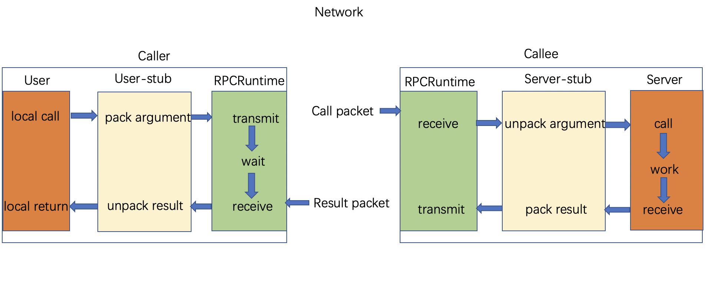
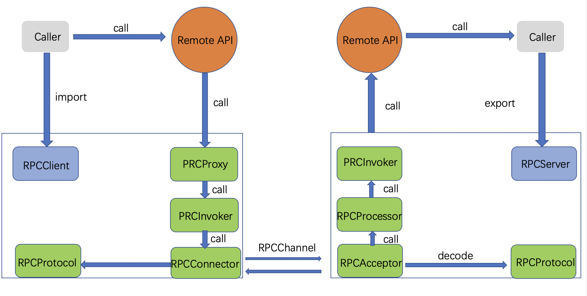
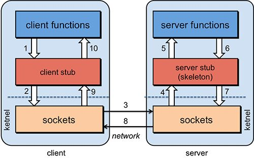

# RPC

RPC-远程过程调用，它是一种通过网络从远程计算机程序上请求服务，而不需要了解底层网络技术的协议。

## 定义

RPC（Remote Procedure Call）—远程过程调用，它是一种通过网络从远程计算机程序上请求服务，而不需要了解底层网络技术的协议。也就是说两台服务器A，B，一个应用部署在A服务器上，想要调用B服务器上应用提供的方法，由于不在一个内存空间，不能直接调用，需要通过网络来表达调用的语义和传达调用的数据。

RPC协议假定某些传输协议的存在，如TCP或UDP，为通信程序之间携带信息数据。在OSI网络通信模型中，RPC跨越了传输层和应用层。RPC使得开发包括网络分布式多程序在内的应用程序更加容易。现在业界有很多开源的优秀 RPC 框架，例如 Spring Cloud、Dubbo、Thrift 等。

<!-- more -->

## 动机

Socket 和 HTTP 编程使用消息传递范式。客户端向服务器发送一个消息，而服务器通常会发送一个消息回来。双方都负责以双方都能理解的格式创建消息，并从这些消息中读出数据。

然而，大多数独立的应用程序并没有那么多地使用消息传递技术。一般来说，首选的机制是函数（或方法或过程）的调用。在这种方式中，程序将调用一个带有参数列表的函数，并在完成函数调用后有一组返回值。这些值可能是函数值，或者如果地址被作为参数传递，那么这些地址的内容可能已经被改变。地址的内容可能已经被改变。

RPC 就是将这种编程方式引入网络世界的一种尝试。因此，客户端将进行在它看来是正常的过程调用。客户端会将其打包成网络消息并传送给服务器。服务器会将其解包，并在服务器端将其转回为过程调用。服务器端的过程调用。这个调用的结果将被打包，以便返回给客户端。

- 简单：RPC 概念的语义十分清晰和简单，这样建立分布式计算就更容易。
- 高效：过程调用看起来十分简单而且高效。
- 通用：在单机计算中过程往往是不同算法部分间最重要的通信机制。

## RPC负责解决的问题

- Call ID映射

  我们怎么告诉远程机器我们要**调用哪个函数呢**？在本地调用中，函数体是直接通过函数指针来指定的，我们调用具体函数，编译器就自动帮我们调用它相应的函数指针。但是在远程调用中，是无法调用函数指针的，因为两个进程的地址空间是完全不一样。所以，在RPC中，**所有的函数都必须有自己的一个ID**。这个ID在所有进程中都是唯一确定的。客户端在做远程过程调用时，必须附上这个ID。然后我们还需要在客户端和服务端分别维护一个 {函数 <--> Call ID} 的对应表。两者的表不一定需要完全相同，但相同的函数对应的Call ID必须相同。当客户端需要进行远程调用时，它就查一下这个表，找出相应的Call ID，然后把它传给服务端，服务端也通过查表，来确定客户端需要调用的函数，然后执行相应函数的代码。

- 序列化和反序列化

  客户端怎么把参数值传给远程的函数呢？在本地调用中，我们只需要把参数压到栈里，然后让函数自己去栈里读就行。但是在远程过程调用时，客户端跟服务端是不同的进程，**不能通过内存来传递参数**。甚至有时候客户端和服务端使用的都**不是同一种语言**（比如服务端用C++，客户端用Java或者Python）。这时候就需要客户端把参数先转成一个字节流，传给服务端后，再把字节流转成自己能读取的格式。这个过程叫序列化和反序列化。同理，从服务端返回的值也需要序列化反序列化的过程。

- 网络传输

  远程调用往往是基于网络的，客户端和服务端是通过网络连接的。所有的数据都需要通过网络传输，因此就需要有一个网络传输层。网络传输层需要把Call ID和序列化后的参数字节流传给服务端，然后再把序列化后的调用结果传回客户端。只要能完成这两者的，都可以作为传输层使用。因此，它所使用的协议其实是不限的，能完成传输就行。尽管大部分RPC框架都使用TCP协议，但其实UDP也可以，而gRPC干脆就用了HTTP2。Java的Netty也属于这层的东西。

## RPC 结构

- RPC 的程序包括 5 个部分
  - User
  - User-stub
  - RPCRuntime
  - Server-stub
  - Server

这里 user 就是 client 端，当 user 想发起一个远程调用时，它实际是通过本地调用 user-stub。user-stub 负责将调用的接口、方法和参数通过约定的协议规范进行编码并通过本地的 RPCRuntime 实例传输到远端的实例。远端 RPCRuntime 实例收到请求后交给 server-stub 进行解码后发起本地端调用，调用结果再返回给 user 端。

以上是粗粒度的 RPC 实现概念结构，接下来我们进一步细化它应该由哪些组件构成，如下图所示。

RPC 服务方通过 RpcServer 去导出（export）远程接口方法，而客户方通过 RpcClient 去引入（import）远程接口方法。客户方像调用本地方法一样去调用远程接口方法，RPC 框架提供接口的代理实现，实际的调用将委托给代理RpcProxy 。代理封装调用信息并将调用转交给RpcInvoker 去实际执行。在客户端的RpcInvoker 通过连接器RpcConnector 去维持与服务端的通道RpcChannel，并使用RpcProtocol 执行协议编码（encode）并将编码后的请求消息通过通道发送给服务方。

RPC 服务端接收器 RpcAcceptor 接收客户端的调用请求，同样使用RpcProtocol 执行协议解码（decode）。解码后的调用信息传递给RpcProcessor 去控制处理调用过程，最后再委托调用给RpcInvoker 去实际执行并返回调用结果。如下是各个部分的详细职责：

| 组件         | 功能                                                         |
| ------------ | ------------------------------------------------------------ |
| RpcServer    | 负责导出（export）远程接口                                   |
| RpcClient    | 负责导入（import）远程接口的代理实现                         |
| RpcProxy     | 远程接口的代理实现                                           |
| RpcInvoker   | 客户方实现：负责编码调用信息和发送调用请求到服务方并等待调用结果返回   服务方实现：负责调用服务端接口的具体实现并返回调用结果 |
| RpcProtocol  | 负责协议编/解码                                              |
| RpcConnector | 负责维持客户方和服务方的连接通道和发送数据到服务方           |
| RpcAcceptor  | 负责接收客户方请求并返回请求结果                             |
| RpcProcessor | 负责在服务方控制调用过程，包括管理调用线程池、超时时间等     |
| RpcChannel   | 数据传输通道                                                 |

## RPC 工作原理

RPC的设计由Client，Client stub，Network ，Server stub，Server构成。 其中Client就是用来调用服务的，Cient stub是用来把调用的方法和参数序列化的（因为要在网络中传输，必须要把对象转变成字节），Network用来传输这些信息到Server stub， Server stub用来把这些信息反序列化的，Server就是服务的提供者，最终调用的就是Server提供的方法。

1. Client像调用本地服务似的调用远程服务；
2. Client stub接收到调用后，将方法、参数序列化
3. 客户端通过sockets将消息发送到服务端
4. Server stub 收到消息后进行解码（将消息对象反序列化）
5. Server stub 根据解码结果调用本地的服务
6. 本地服务执行(对于服务端来说是本地执行)并将结果返回给Server stub
7. Server stub将返回结果打包成消息（将结果消息对象序列化）
8. 服务端通过sockets将消息发送到客户端
9. Client stub接收到结果消息，并进行解码（将结果消息反序列化）
10. 客户端得到最终结果。

RPC 调用分以下两种：

1. 同步调用：客户方等待调用执行完成并返回结果。
2. 异步调用：客户方调用后不用等待执行结果返回，但依然可以通过回调通知等方式获取返回结果。若客户方不关心调用返回结果，则变成单向异步调用，单向调用不用返回结果。

异步和同步的区分在于是否等待服务端执行完成并返回结果。

## RPC 的通常实现方式

有两种常见的实现 RPC 的方式：利用服务规范和自定义 API。

- 第一种是 Sun 的 RPC/ONC 和 CORBA 的典型代表。在这种情况下，服务的规范是用一些抽象语言给出的，如 CORBA IDL（接口定义语言）。然后，这被编译成客户端和服务器的代码。然后，客户写一个正常的程序，其中包含对过程/函数/方法的调用，该程序被链接到生成的客户方代码。服务器端的代码实际上是一个服务器本身，它被链接到你所写的过程实现上。这样一来，客户端的代码在外观上与普通的过程调用几乎是一样的。一般来说，会有 有一点额外的代码来定位服务器。在 Sun 的 ONC 中，必须知道服务器的地址；在 CORBA 中，要调用命名服务来查找服务器的地址。命名服务来查找服务器的地址；在 Java RMI 中，IDL 是 Java 本身，命名服务被用来查找服务器的地址。

  服务来寻找服务的地址。

- 第二种方式，你必须利用一个特殊的客户端API。你在客户端把函数名和它的参数交给这个库。在服务器端，你必须自己明确地编写服务器，以及远程过程的实现。这种方法被许多RPC系统所使用，如 Web 服务。

## RPC使用了哪些关键技术？

> - 1、动态代理 生成Client Stub（客户端存根）和Server Stub（服务端存根）的时候需要用到Java动态代理技术，可以使用JDK提供的原生的动态代理机制，也可以使用开源的：CGLib代理，Javassist字节码生成技术。
> - 2、序列化和反序列化 在网络中，所有的数据都将会被转化为字节进行传送，所以为了能够使参数对象在网络中进行传输，需要对这些参数进行序列化和反序列化操作。 序列化：把对象转换为字节序列的过程称为对象的序列化，也就是编码的过程。反序列化：把字节序列恢复为对象的过程称为对象的反序列化，也就是解码的过程。 目前比较高效的开源序列化框架：如Kryo、FastJson和Protobuf等。
>   反序列化：把字节序列恢复为对象的过程称为对象的反序列化，也就是解码的过程。 目前比较高效的开源序列化框架：如Kryo、FastJson和Protobuf等。
> - 3、NIO通信 出于并发性能的考虑，传统的阻塞式 IO 显然不太合适，因此我们需要异步的 IO，即 NIO。Java 提供了 NIO 的解决方案，Java 7 也提供了更优秀的 NIO.2 支持。可以选择Netty或者MINA来解决NIO数据传输的问题。
> - 4、服务注册中心 可选：Redis、Zookeeper、Consul 、Etcd。一般使用ZooKeeper提供服务注册与发现功能，解决单 点故障以及分布式部署的问题(注册中心)。

## RPC 能干什么

RPC 的主要功能目标是让构建分布式计算（应用）更容易，在提供强大的远程调用能力时不损失本地调用的语义简洁性。为实现该目标，RPC 框架需提供一种透明调用机制，让使用者不必显式的区分本地调用和远程调用，在之前给出的一种实现结构，基于 stub 的结构来实现。下面我们将具体细化 stub 结构的实现。

- 可以做到分布式，现代化的微服务
- 部署灵活
- 解耦服务
- 扩展性强

RPC的目的是让你在本地调用远程的方法，而对你来说这个调用是透明的，你并不知道这个调用的方法是部署哪里。通过RPC能解耦服务，这才是使用RPC的真正目的。

## RPC与其他远程调用协议

- REST

> 可以看着是HTTP协议的一种直接应用，默认基于JSON作为传输格式,使用简单,学习成本低效率高,但是安全性较低。
>
> REST通常以业务为导向，将业务对象上执行的操作映射到HTTP动词，格式非常简单，可以使用浏览器进行扩展和传输，通过JSON数据完成客户端和服务端之间的消息通信，直接支持请求/响应方式的通信。不需要中间的代理，简化了系统的架构，不同系统之间只需要对JSON进行解析和序列化即可完成数据的传递。
>
> 但是REST也存在一些弊端，比如只支持请求/响应这种单一的通信方式，对象和字符串之间的序列化操作也会影响消息传递速度，客户端需要通过服务发现的方式，知道服务实例的位置，在单个请求获取多个资源时存在着挑战，而且有时候很难将所有的动作都映射到HTTP动词。

- SOAP

> SOAP是一种数据交换协议规范,是一种轻量的、简单的、基于XML的协议的规范。而SOAP可以看着是一个重量级的协议，基于XML、SOAP在安全方面是通过使用XML-Security和XML-Signature两个规范组成了WS-Security来实现安全控制的,当前已经得到了各个厂商的支持 。它有什么优点？简单总结为：易用、灵活、跨语言、跨平台。

- SOA

> 面向服务架构，它可以根据需求通过网络对松散耦合的粗粒度应用组件进行分布式部署、组合和使用。服务层是SOA的基础，可以直接被应用调用，从而有效控制系统中与软件代理交互的人为依赖性。SOA是一种粗粒度、松耦合服务架构，服务之间通过简单、精确定义接口进行通讯，不涉及底层编程接口和通讯模型。SOA可以看作是B/S模型、XML（标准通用标记语言的子集）/Web Service技术之后的自然延伸。

### RPC 与 REST 的区别

RPC 与 REST 最大的区别就在于 RPC 提供了更好的抽象，RPC 甚至将网络传输细节彻底隐藏了，而 REST 没有。具体来说，REST 至少要求用于提供 URL 以及请求参数，而 RPC 隐藏了与网络传输的相关实现细节。另一方面，RPC 可以基于任何网络通信协议，而 REST 通常基于 HTTP（或者 HTTPS）协议。RPC 调用者并不会关心具体的协议是：HTTP、TCP 还是其他任何自定义协议。

## RPC 的优缺点

以下是 RPC 为开发人员和应用程序管理员提供的一些优势：

- 帮助客户端通过传统使用高级语言的过程调用与服务器进行通信。
- 可以在分布式环境以及本地环境中使用。
- 支持面向进程和面向线程的模型。
- 对用户隐藏内部消息传递机制。
- 只需极少的努力即可重写和重新开发代码。
- 提供抽象，即对用户隐藏网络通信的消息传递性质。
- 省略许多协议层以提高性能。

另一方面，RPC 的一些缺点包括：

- 客户端和服务器对各自的例程使用不同的执行环境，并且资源（例如，文件）的使用也更加复杂。因此，RPC 系统并不总是适合传输大量数据。
- RPC 非常容易发生故障，因为它涉及通信系统，另一台计算机和另一个进程。
- RPC 没有统一的标准;它可以通过多种方式实现。
- RPC 只是基于交互的，因此，在硬件架构方面，它不提供任何灵活性。

## gRPC

gRPC是谷歌开源的一个 RPC 框架，面向移动和 HTTP/2 设计。

- 序列化支持Protobuf进行数据编码，提高数据压缩率
- 使用HTTP/2.0弥补了HTTP/1.1的不足。支持·双向流、消息头压缩、单 TCP 的多路复用、服务端推送等特性，这些特性使得 gRPC 在移动端设备上更加省电和节省网络流量；
- 同样在调用方和服务方使用协议约定文件，提供参数可选，为版本兼容留下缓冲空间

#### `gRPC` 优点

- `protobuf`是二进制消息，性能好/效率高（空间和时间效率都很不错）
- 通过在服务器和客户端之间共享 `.proto` 文件，可以端到端生成消息和客户端代码。 节约开发时间。并且有严格的规范。
- 基于`HTTP/2`，与 `HTTP 1.x` 相比，`HTTP/2` 具有巨大性能优势。
- 支持流式处理
- 截止时间/超时和取消, `gRPC` 允许客户端指定其愿意等待 `RPC` 完成的时间期限。

#### `gRPC` 缺点

- 浏览器支持受限，无法通过浏览器直接调用`grpc`服务。可以通过`grpc-web`来做，但并不支持所有 `gRPC` 功能。 不支持客户端和双向流式传输，并且对服务器流式传输的支持有限。
- 默认情况下，`gRPC` 消息使用 `Protobuf` 进行编码。 尽管 `Protobuf` 可以高效地发送和接收，但其二进制格式人工不可读。
- `gRPC`尚未提供连接池，需要自行实现
- 尚未提供“服务发现”、“负载均衡”机制

## RPC实践问题

### 耗时和重传

- 依据什么来设置 RPC 超时时间和重试次数
- 如果发生超时重传，怎么区分哪些 RPC 服务可重传，哪些不可重传呢
- 请求超过了 PRC 的重传次数，一般会触发服务降级，这又会对商品详情页造成什么影响

#### 思路

- 请求耗时

  “超时时间设置和重传次数问题”，需要根据每一个微服务的请求耗时，以及业务场景进行综合衡量。

- RPC 调用方式：

  业务场景下，讲清楚网关调用各下游服务的串并行方式，服务之间是否存在上下服务依赖。

- 分析核心服务

  分析出哪些是核心服务，哪些是非核心服务，核心服务是否有备用方案，非核心服务是否有降级策略。

### 原理掌握

### RPC 框架承载请求量优化

- **选型合适的 RPC 序列化方式：** 选择合适的序列化方式，进而提升封包和解包的性能。
- **优化 RPC 的网络通信性能：** 高并发下选择高性能的网络编程 I/O 模型。

#### 思路

- 序列化方式
  - **考虑时间与空间开销，切勿忽略兼容性**
- RPC 的网络通信
  - NIO提高了服务端工作线程的利用率，增加了一个调度者，来实现 Socket 连接与 Socket 数据读写之间的分离
    - Reactor 模型（即反应堆模式），以及 Reactor 的 3 种线程模型，分别是单线程 Reactor 线程模型、多线程 Reactor 线程模型，以及主从 Reactor 线程模型。
    - Java 中的高性能网络编程框架 Netty。

## 常用的RPC框架

- RMI 

  利用java.rmi包实现，基于Java远程方法协议(Java Remote Method Protocol) 和java的原生序列化。

- Dubbo

  Dubbo是一个分布式服务框架，以及SOA治理方案。其功能主要包括：高性能NIO通讯及多协议集成，服务动态寻址与路由，软负载均衡与容错，依赖分析与降级等。 Dubbo是阿里巴巴内部的SOA服务化治理方案的核心框架，Dubbo自2011年开源后，已被许多非阿里系公司使用。

- dubbox

  是当当团队基于dubbo升级的一个版本。是一个分布式的服务架构，可直接用于生产环境作为SOA服务框架。dubbox资源链接

- Spring Cloud

  Spring Cloud由众多子项目组成，如Spring Cloud Config、Spring Cloud Netflix、Spring Cloud Consul 等，提供了搭建分布式系统及微服务常用的工具，如配置管理、服务发现、断路器、智能路由、微代理、控制总线、一次性token、全局锁、选主、分布式会话和集群状态等，满足了构建微服务所需的所有解决方案。Spring Cloud基于Spring Boot, 使得开发部署极其简单。

- gRPC

   一开始由 google 开发，是一款语言中立、平台中立、开源的远程过程调用(RPC)系统。

- Thrift

  是一种轻量级的跨语言 RPC 通信方案，支持多达 25 种编程语言

  Thrift允许你定义一个描述文件，描述数据类型和服务接口。依据该文件，编译器方便地生成RPC客户端和服务器通信代码。底层通讯基于SOCKET

- motan

  是新浪微博开源的一个Java框架。它诞生的比较晚，起于2013年，2016年5月开源。Motan 在微博平台中已经广泛应用，每天为数百个服务完成近千亿次的调用。motan资源链接

- Hessian

  是一个轻量级的remoting onhttp工具，使用简单的方法提供了RMI的功能。 基于HTTP协议，采用二进制编解码。

- protobuf-rpc-pro

  是一个Java类库，提供了基于 Google 的 Protocol Buffers 协议的远程方法调用的框架。基于Netty 底层的 NIO 技术。支持 TCP 重用/keep-alive、SSL加密、RPC 调用取消操作、嵌入式日志等功能。

- Avro

  出自Hadoop之父Doug Cutting, 在Thrift已经相当流行的情况下推出Avro的目标不仅是提供一套类似Thrift的通讯中间件,更是要建立一个新的，标准性的云计算的数据交换和存储的Protocol。支持HTTP，TCP两种协议。

###### 来源：

https://dubbo.apache.org/zh/blog/2019/01/07/浅谈-rpc/

https://grpc.io

https://bbs.huaweicloud.com/blogs/337073

https://www.cnblogs.com/feifeicui/p/10431529.html

https://juejin.cn/post/6989146884807852068

https://juejin.cn/post/7055613735020265479

https://www.jianshu.com/p/7d6853140e13

https://www.jianshu.com/p/959030de7f1c

https://juejin.cn/post/6996991461703041038

https://learn.lianglianglee.com/专栏/架构设计面试精讲/07%20%20RPC：如何在面试中展现出“造轮子”的能力？.md
