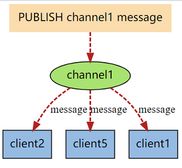
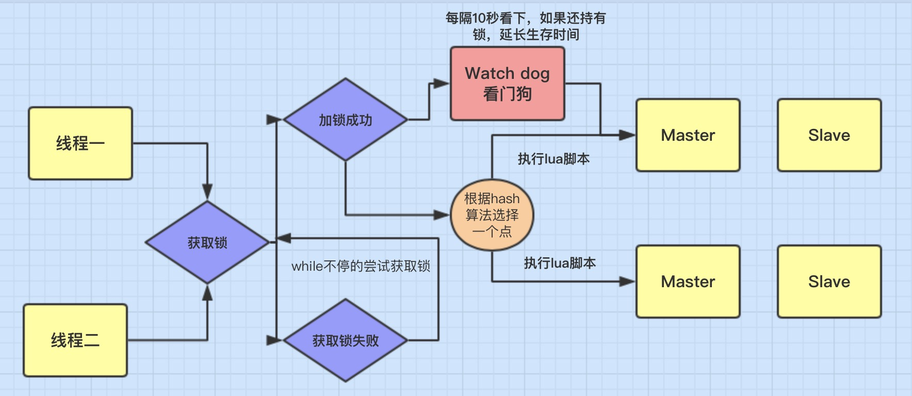
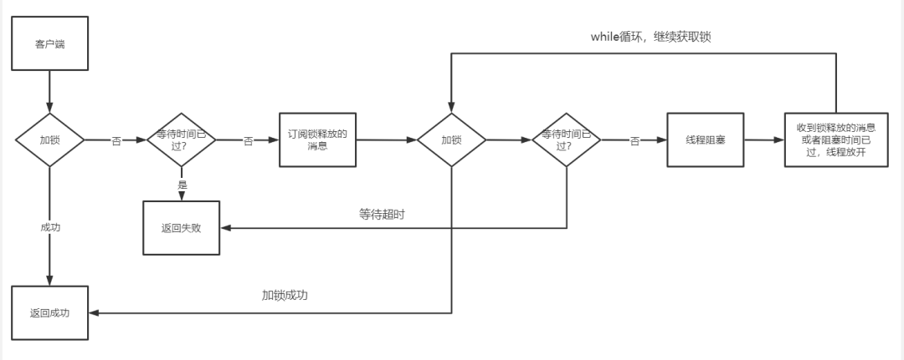
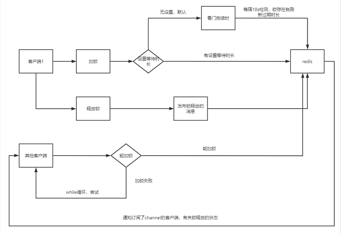

# Redission锁

## Redis 实现分布式锁主要步骤

1. 指定一个 key 作为锁标记，存入 Redis 中，指定一个 **唯一的用户标识** 作为 value。
2. 当 key 不存在时才能设置值，确保同一时间只有一个客户端进程获得锁，满足 **互斥性** 特性。
3. 设置一个过期时间，防止因系统异常导致没能删除这个 key，满足 **防死锁** 特性。
4. 当处理完业务之后需要清除这个 key 来释放锁，清除 key 时需要校验 value 值，需要满足 **只有加锁的人才能释放锁** 。

> 特别注意：以上实现步骤考虑到了使用分布式锁需要考虑的互斥性、防死锁、加锁和解锁必须为同一个进程等问题，**但是锁的续期无法实现**。所以，博主采用 Redisson 实现 Redis 的分布式锁，借助 **Redisson 的 WatchDog 机制** 能够很好的解决锁续期的问题，同样 Redisson 也是 Redis 官方推荐分布式锁实现方案，实现起来较为简单。

## 高效分布式锁

当我们在设计分布式锁的时候，我们应该考虑分布式锁至少要满足的一些条件，同时考虑如何高效的设计分布式锁，这里我认为以下几点是必须要考虑的。

### 互斥

在分布式高并发的条件下，我们最需要保证，同一时刻只能有一个线程获得锁，这是最基本的一点。

### 防止死锁

在分布式高并发的条件下，比如有个线程获得锁的同时，还没有来得及去释放锁，就因为系统故障或者其它原因使它无法执行释放锁的命令,导致其它线程都无法获得锁，造成死锁。

所以分布式非常有必要设置锁的`有效时间`，确保系统出现故障后，在一定时间内能够主动去释放锁，避免造成死锁的情况。

### 性能

对于访问量大的共享资源，需要考虑减少锁等待的时间，避免导致大量线程阻塞。

所以在锁的设计时，需要考虑两点。

- `锁的颗粒度要尽量小`。比如你要通过锁来减库存，那这个锁的名称你可以设置成是商品的ID,而不是任取名称。这样这个锁只对当前商品有效,锁的颗粒度小。
- `锁的范围尽量要小`。比如只要锁2行代码就可以解决问题的，那就不要去锁10行代码了。

### 重入

我们知道ReentrantLock是可重入锁，那它的特点就是：同一个线程可以重复拿到同一个资源的锁。重入锁非常有利于资源的高效利用。

<!-- more -->

## Redis 发布订阅

之前说过，分布式锁的核心功能其实就三个：加锁、解锁、设置锁超时。这三个功能也是我们研究Redisson分布式锁原理的方向。

在学习之前，我们有必要先了解一个知识点，就是有关Redis的发布订阅功能。

Redis 发布订阅 (pub/sub) 是一种消息通信模式：发送者 (pub) 发送消息，订阅者 (sub) 接收消息，发布者可以向指定的渠道 (channel) 发送消息，订阅者如果订阅了该频道的话就能收到消息，从而实现多个客户端的通信效果。



订阅的命令是`SUBSCRIBE channel[channel ...]`
，可以订阅一个或多个频道，当有新消息通过**PUBLISH**命令发送给频道时，订阅者就能收到消息

开启两个客户端，一个订阅了频道**channel1**，另一个通过PUBLISH发送消息后，订阅的那个就能收到了，靠这种模式就能实现不同客户端之间的通信。


## Redisson原理



### 加锁机制

线程去获取锁，获取成功: 执行lua脚本，保存数据到redis数据库。

线程去获取锁，获取失败: 一直通过while循环尝试获取锁，获取成功后，执行lua脚本，保存数据到redis数据库。

```java
if (redis.call('exists', KEYS[1]) == 0) then " +
   "redis.call('hincrby', KEYS[1], ARGV[2], 1); " +
   "redis.call('pexpire', KEYS[1], ARGV[1]); " +
   "return nil; " +
   "end; " +
"if (redis.call('hexists', KEYS[1], ARGV[2]) == 1) then " +
    "redis.call('hincrby', KEYS[1], ARGV[2], 1); " +
    "redis.call('pexpire', KEYS[1], ARGV[1]); " +
    "return nil; " +
    "end; " +
"return redis.call('pttl', KEYS[1]);"
```


这里 `KEYS[1]` 代表的是你加锁的 key，比如你自己设置了加锁的那个锁 key 就是 “myLock”。

```text
// create a lock
RLock lock = redisson.getLock("myLock");
```

`ARGV[1]` 代表的是锁 key 的默认生存时间，默认 30 秒。

`ARGV[2]` 代表的是加锁的客户端的 ID，类似于下面这样：285475da-9152-4c83-822a-67ee2f116a79:52。

至于最后面的一个 1 是为了后面可重入做的计数统计

#### 加锁流程

- 判断是否存在这个加锁的key
- 如果不存在，通过hset命令加锁
- 设置过期时间

### 锁的续期机制

客户端 1 加锁的锁 key 默认生存时间才 30 秒，如果超过了 30 秒，客户端 1 还想一直持有这把锁，怎么办呢？

Redisson 提供了一个续期机制， 只要客户端 1 一旦加锁成功，就会启动一个 Watch Dog。

```java
private <T> RFuture<Long> tryAcquireAsync(long leaseTime, TimeUnit unit, long threadId) {
    if (leaseTime != -1) {
        return tryLockInnerAsync(leaseTime, unit, threadId, RedisCommands.EVAL_LONG);
    }
    RFuture<Long> ttlRemainingFuture = tryLockInnerAsync(commandExecutor.getConnectionManager().getCfg().getLockWatchdogTimeout(), TimeUnit.MILLISECONDS, threadId, RedisCommands.EVAL_LONG);
    ttlRemainingFuture.onComplete((ttlRemaining, e) -> {
        if (e != null) {
            return;
        }

        // lock acquired
        if (ttlRemaining == null) {
            scheduleExpirationRenewal(threadId);
        }
    });
    return ttlRemainingFuture;
}
```

> 注意：从以上源码我们看到 `leaseTime` 必须是 -1 才会开启 Watch Dog 机制，也就是如果你想开启 Watch Dog 机制必须使用默认的加锁时间为 30s。如果你自己自定义时间，超过这个时间，锁就会自定释放，并不会延长。

```java
private void scheduleExpirationRenewal(long threadId) {
    ExpirationEntry entry = new ExpirationEntry();
    ExpirationEntry oldEntry = EXPIRATION_RENEWAL_MAP.putIfAbsent(getEntryName(), entry);
    if (oldEntry != null) {
        oldEntry.addThreadId(threadId);
    } else {
        entry.addThreadId(threadId);
        renewExpiration();
    }
}

protected RFuture<Boolean> renewExpirationAsync(long threadId) {
    return commandExecutor.evalWriteAsync(getName(), LongCodec.INSTANCE, RedisCommands.EVAL_BOOLEAN,
            "if (redis.call('hexists', KEYS[1], ARGV[2]) == 1) then " +
                "redis.call('pexpire', KEYS[1], ARGV[1]); " +
                "return 1; " +
            "end; " +
            "return 0;",
        Collections.<Object>singletonList(getName()),
        internalLockLeaseTime, getLockName(threadId));
}
```

Watch Dog 机制其实就是一个后台定时任务线程，获取锁成功之后，会将持有锁的线程放入到一个 `RedissonLock.EXPIRATION_RENEWAL_MAP`里面，然后每隔 10 秒 `（internalLockLeaseTime / 3）` 检查一下，如果客户端 1 还持有锁 key（判断客户端是否还持有 key，其实就是遍历 `EXPIRATION_RENEWAL_MAP` 里面线程 id 然后根据线程 id 去 Redis 中查，如果存在就会延长 key 的时间），那么就会不断的延长锁 key 的生存时间。

> 注意：这里有一个细节问题，如果服务宕机了，Watch Dog 机制线程也就没有了，此时就不会延长 key 的过期时间，到了 30s 之后就会自动过期了，其他线程就可以获取到锁。

### 为啥要用lua脚本呢？

这个不用多说，主要是如果你的业务逻辑复杂的话，通过封装在lua脚本中发送给redis，而且redis是单线程的，这样就保证这段复杂业务逻辑执行的**原子性**。

### 锁互斥机制

此时，如果客户端 2 来尝试加锁，会如何呢？首先，第一个 if 判断会执行 `exists myLock`，发现 myLock 这个锁 key 已经存在了。接着第二个 if 判断，判断一下，myLock 锁 key 的 hash 数据结构中，是否包含客户端 2 的 ID，这里明显不是，因为那里包含的是客户端 1 的 ID。所以，客户端 2 会执行：

```text
return redis.call('pttl', KEYS[1]);
```

返回的一个数字，这个数字代表了 myLock 这个锁 key 的剩余生存时间。

接下来我们看一下 Redissson tryLock 的主流程：

```java
@Override
    public boolean tryLock(long waitTime, long leaseTime, TimeUnit unit) throws InterruptedException {
        long time = unit.toMillis(waitTime);
        long current = System.currentTimeMillis();
        long threadId = Thread.currentThread().getId();
        // 1.尝试获取锁
        Long ttl = tryAcquire(leaseTime, unit, threadId);
        // lock acquired
        if (ttl == null) {
            return true;
        }

        // 申请锁的耗时如果大于等于最大等待时间，则申请锁失败.
        time -= System.currentTimeMillis() - current;
        if (time <= 0) {
            acquireFailed(threadId);
            return false;
        }

        current = System.currentTimeMillis();

        /**
         * 2.订阅锁释放事件，并通过 await 方法阻塞等待锁释放，有效的解决了无效的锁申请浪费资源的问题：
         * 基于信息量，当锁被其它资源占用时，当前线程通过 Redis 的 channel 订阅锁的释放事件，一旦锁释放会发消息通知待等待的线程进行竞争.
         *
         * 当 this.await 返回 false，说明等待时间已经超出获取锁最大等待时间，取消订阅并返回获取锁失败.
         * 当 this.await 返回 true，进入循环尝试获取锁.
         */
        RFuture<RedissonLockEntry> subscribeFuture = subscribe(threadId);
        // await 方法内部是用 CountDownLatch 来实现阻塞，获取 subscribe 异步执行的结果（应用了 Netty 的 Future）
        if (!subscribeFuture.await(time, TimeUnit.MILLISECONDS)) {
            if (!subscribeFuture.cancel(false)) {
                subscribeFuture.onComplete((res, e) -> {
                    if (e == null) {
                        unsubscribe(subscribeFuture, threadId);
                    }
                });
            }
            acquireFailed(threadId);
            return false;
        }

        try {
            // 计算获取锁的总耗时，如果大于等于最大等待时间，则获取锁失败.
            time -= System.currentTimeMillis() - current;
            if (time <= 0) {
                acquireFailed(threadId);
                return false;

              }

            /**
             * 3.收到锁释放的信号后，在最大等待时间之内，循环一次接着一次的尝试获取锁
             * 获取锁成功，则立马返回 true，
             * 若在最大等待时间之内还没获取到锁，则认为获取锁失败，返回 false 结束循环
             */
            while (true) {
                long currentTime = System.currentTimeMillis();

                // 再次尝试获取锁
                ttl = tryAcquire(leaseTime, unit, threadId);
                // lock acquired
                if (ttl == null) {
                    return true;
                }
                // 超过最大等待时间则返回 false 结束循环，获取锁失败
                time -= System.currentTimeMillis() - currentTime;
                if (time <= 0) {
                    acquireFailed(threadId);
                    return false;
                }

                /**
                 * 6.阻塞等待锁（通过信号量(共享锁)阻塞,等待解锁消息）：
                 */
                currentTime = System.currentTimeMillis();
                if (ttl >= 0 && ttl < time) {
                    //如果剩余时间(ttl)小于wait time ,就在 ttl 时间内，从Entry的信号量获取一个许可(除非被中断或者一直没有可用的许可)。
                    getEntry(threadId).getLatch().tryAcquire(ttl, TimeUnit.MILLISECONDS);
                } else {
                    //则就在wait time 时间范围内等待可以通过信号量
                    getEntry(threadId).getLatch().tryAcquire(time, TimeUnit.MILLISECONDS);
                }

                // 更新剩余的等待时间(最大等待时间-已经消耗的阻塞时间)
                time -= System.currentTimeMillis() - currentTime;
                if (time <= 0) {
                    acquireFailed(threadId);
                    return false;
                }
            }
        } finally {
            // 7.无论是否获得锁,都要取消订阅解锁消息
            unsubscribe(subscribeFuture, threadId);
        }
//        return get(tryLockAsync(waitTime, leaseTime, unit));
    }
```

流程分析：

1. 尝试获取锁，返回 null 则说明加锁成功，返回一个数值，则说明已经存在该锁，ttl 为锁的剩余存活时间。
2. 如果此时客户端 2 进程获取锁失败，那么使用客户端 2 的线程 id（其实本质上就是进程 id）通过 Redis 的 channel 订阅锁释放的事件，。如果等待的过程中一直未等到锁的释放事件通知，当超过最大等待时间则获取锁失败，返回 false，也就是第 **39** 行代码。如果等到了锁的释放事件的通知，则开始进入一个不断重试获取锁的循环。
3. 循环中每次都先试着获取锁，并得到已存在的锁的剩余存活时间。如果在重试中拿到了锁，则直接返回。如果锁当前还是被占用的，那么等待释放锁的消息，具体实现使用了 JDK 的信号量 Semaphore 来阻塞线程，当锁释放并发布释放锁的消息后，信号量的 `release()` 方法会被调用，此时被信号量阻塞的等待队列中的一个线程就可以继续尝试获取锁了。

> 特别注意：以上过程存在一个细节，这里有必要说明一下，也是分布式锁的一个关键点：当锁正在被占用时，等待获取锁的进程并不是通过一个 `while(true)` 死循环去获取锁，而是利用了 Redis 的发布订阅机制,通过 await 方法阻塞等待锁的进程，有效的解决了**无效的锁申请浪费资源的问题**。

### 可重入加锁机制

```java
@Override
public void lock() {
    RLock lock = redissonSingle.getLock("myLock");
    try {
        lock.lock();

        // 执行业务
        doBusiness();

        lock.lock();

    } catch (Exception e) {
        e.printStackTrace();
    } finally {
        // 释放锁
        lock.unlock();
        lock.unlock();
        logger.info("任务执行完毕, 释放锁!");
    }
}
```


Redisson可以实现可重入加锁机制的原因

- Redis存储锁的数据类型是 Hash类型
- Hash数据类型的key值包含了当前线程信息。

Hash类型相当于我们java的 `<key,<key1,value>>` 类型,

key是指 'redisson'

key1值为`078e44a3-5f95-4e24-b6aa-80684655a15a:45`

它的组成是: guid + 当前线程的ID。后面的value是就和可重入加锁有关。

可重入锁的机制，它最大的优点就是相同线程不需要在等待锁，而是可以直接进行相应操作。


### 锁释放机制

执行

```text
lock.unlock()
```

就可以释放分布式锁。我们来看一下释放锁的流程代码：

```java
@Override
public RFuture<Void> unlockAsync(long threadId) {
    RPromise<Void> result = new RedissonPromise<Void>();
    // 1. 异步释放锁
    RFuture<Boolean> future = unlockInnerAsync(threadId);
    // 取消 Watch Dog 机制
    future.onComplete((opStatus, e) -> {
        cancelExpirationRenewal(threadId);

        if (e != null) {
            result.tryFailure(e);
            return;
        }

        if (opStatus == null) {
            IllegalMonitorStateException cause = new IllegalMonitorStateException("attempt to unlock lock, not locked by current thread by node id: "
                    + id + " thread-id: " + threadId);
            result.tryFailure(cause);
            return;
        }

        result.trySuccess(null);
    });

    return result;
}

protected RFuture<Boolean> unlockInnerAsync(long threadId) {
    return commandExecutor.evalWriteAsync(getName(), LongCodec.INSTANCE, RedisCommands.EVAL_BOOLEAN,
            // 判断锁 key 是否存在
            "if (redis.call('hexists', KEYS[1], ARGV[3]) == 0) then " +
                "return nil;" +
            "end; " +
            // 将该客户端对应的锁的 hash 结构的 value 值递减为 0 后再进行删除
            // 然后再向通道名为 redisson_lock__channel publish 一条 UNLOCK_MESSAGE 信息
            "local counter = redis.call('hincrby', KEYS[1], ARGV[3], -1); " +
            "if (counter > 0) then " +
                "redis.call('pexpire', KEYS[1], ARGV[2]); " +
                "return 0; " +
            "else " +
                "redis.call('del', KEYS[1]); " +
                "redis.call('publish', KEYS[2], ARGV[1]); " +
                "return 1; "+
            "end; " +
            "return nil;",
            Arrays.<Object>asList(getName(), getChannelName()), LockPubSub.UNLOCK_MESSAGE, internalLockLeaseTime, getLockName(threadId));
}
```

从以上代码来看，释放锁的步骤主要分三步：

1. 删除锁（这里注意可重入锁，在上面的脚本中有详细分析）。
2. 广播释放锁的消息，通知阻塞等待的进程（向通道名为 `redisson_lock__channel` publish 一条 `UNLOCK_MESSAGE` 信息）。
3. 取消 Watch Dog 机制，即将 `RedissonLock.EXPIRATION_RENEWAL_MAP` 里面的线程 id 删除，并且 cancel 掉 Netty 的那个定时任务线程。

## Redis分布式锁的缺点

Redis分布式锁会有个缺陷，就是在**Redis哨兵模式**下:

`客户端1` 对某个`master节点`写入了redisson锁，此时会异步复制给对应的 slave节点。但是这个过程中一旦发生 master节点宕机，主备切换，slave节点从变为了 master节点。

这时`客户端2` 来尝试加锁的时候，在新的master节点上也能加锁，此时就会导致多个客户端对同一个分布式锁完成了加锁。

这时系统在业务语义上一定会出现问题，**导致各种脏数据的产生**。

`缺陷`在哨兵模式或者主从模式下，如果 master实例宕机的时候，可能导致多个客户端同时完成加锁。


## RedissonLock

### RLock接口

#### 概念

```java
public interface RLock extends Lock, RExpirable, RLockAsync
```

很明显RLock是继承Lock锁，所以他有Lock锁的所有特性，比如lock、unlock、trylock等特性,同时它还有很多新特性：强制锁释放，带有效期的锁,。

#### RLock锁API

这里针对上面做个整理，这里列举几个常用的接口说明

```java
public interface RRLock {
    //----------------------Lock接口方法-----------------------

    /**
     * 加锁 锁的有效期默认30秒
     */
    void lock();
    /**
     * tryLock()方法是有返回值的，它表示用来尝试获取锁，如果获取成功，则返回true，如果获取失败（即锁已被其他线程获取），则返回false .
     */
    boolean tryLock();
    /**
     * tryLock(long time, TimeUnit unit)方法和tryLock()方法是类似的，只不过区别在于这个方法在拿不到锁时会等待一定的时间，
     * 在时间期限之内如果还拿不到锁，就返回false。如果如果一开始拿到锁或者在等待期间内拿到了锁，则返回true。
     *
     * @param time 等待时间
     * @param unit 时间单位 小时、分、秒、毫秒等
     */
    boolean tryLock(long time, TimeUnit unit) throws InterruptedException;
    /**
     * 解锁
     */
    void unlock();
    /**
     * 中断锁 表示该锁可以被中断 假如A和B同时调这个方法，A获取锁，B为获取锁，那么B线程可以通过
     * Thread.currentThread().interrupt(); 方法真正中断该线程
     */
    void lockInterruptibly();

    //----------------------RLock接口方法-----------------------
    /**
     * 加锁 上面是默认30秒这里可以手动设置锁的有效时间
     *
     * @param leaseTime 锁有效时间
     * @param unit      时间单位 小时、分、秒、毫秒等
     */
    void lock(long leaseTime, TimeUnit unit);
    /**
     * 这里比上面多一个参数，多添加一个锁的有效时间
     *
     * @param waitTime  等待时间
     * @param leaseTime 锁有效时间
     * @param unit      时间单位 小时、分、秒、毫秒等
     */
    boolean tryLock(long waitTime, long leaseTime, TimeUnit unit) throws InterruptedException;
    /**
     * 检验该锁是否被线程使用，如果被使用返回True
     */
    boolean isLocked();
    /**
     * 检查当前线程是否获得此锁（这个和上面的区别就是该方法可以判断是否当前线程获得此锁，而不是此锁是否被线程占有）
     * 这个比上面那个实用
     */
    boolean isHeldByCurrentThread();
    /**
     * 中断锁 和上面中断锁差不多，只是这里如果获得锁成功,添加锁的有效时间
     * @param leaseTime  锁有效时间
     * @param unit       时间单位 小时、分、秒、毫秒等
     */
    void lockInterruptibly(long leaseTime, TimeUnit unit);  
}
```

RLock相关接口，主要是新添加了 `leaseTime` 属性字段，主要是用来设置锁的过期时间,避免死锁。


### RedissonLock实现类

```java
public class RedissonLock extends RedissonExpirable implements RLock
```

RedissonLock实现了RLock接口，所以实现了接口的具体方法。这里我列举几个方法说明下

#### void lock()方法

```java
    @Override
    public void lock() {
        try {
            lockInterruptibly();
        } catch (InterruptedException e) {
            Thread.currentThread().interrupt();
        }
    }
```

lock的拿锁过程跟tryLock基本是一致的，区别在于lock没有手动设置锁过期时长的参数，该方法的调用链也是跑到`tryAcquire`
方法来获取锁的，不同的是，lock锁里面进去其实用的是`lockInterruptibly`（中断锁，表示可以被中断）,而且捕获异常后用 Thread.currentThread().interrupt()来真正中断当前线程，其实它们是搭配一起使用的。

接下来执行流程,这里理下关键几步

```java
   /**
     * 1、带上默认值调另一个中断锁方法
     */
    @Override
    public void lockInterruptibly() throws InterruptedException {
        lockInterruptibly(-1, null);
    }
    /**
     * 2、另一个中断锁的方法
     */
    void lockInterruptibly(long leaseTime, TimeUnit unit) throws InterruptedException 
    /**
     * 3、这里已经设置了锁的有效时间默认为30秒  （commandExecutor.getConnectionManager().getCfg().getLockWatchdogTimeout()=30）
     */
    RFuture<Long> ttlRemainingFuture = tryLockInnerAsync(commandExecutor.getConnectionManager().getCfg().getLockWatchdogTimeout(), TimeUnit.MILLISECONDS, threadId, RedisCommands.EVAL_LONG);
    /**
     * 4、最后通过lua脚本访问Redis,保证操作的原子性
     */
    <T> RFuture<T> tryLockInnerAsync(long leaseTime, TimeUnit unit, long threadId, RedisStrictCommand<T> command) {
        internalLockLeaseTime = unit.toMillis(leaseTime);

        return commandExecutor.evalWriteAsync(getName(), LongCodec.INSTANCE, command,
                "if (redis.call('exists', KEYS[1]) == 0) then " +
                        "redis.call('hset', KEYS[1], ARGV[2], 1); " +
                        "redis.call('pexpire', KEYS[1], ARGV[1]); " +
                        "return nil; " +
                        "end; " +
                        "if (redis.call('hexists', KEYS[1], ARGV[2]) == 1) then " +
                        "redis.call('hincrby', KEYS[1], ARGV[2], 1); " +
                        "redis.call('pexpire', KEYS[1], ARGV[1]); " +
                        "return nil; " +
                        "end; " +
                        "return redis.call('pttl', KEYS[1]);",
                Collections.<Object>singletonList(getName()), internalLockLeaseTime, getLockName(threadId));
    }
```

那么void lock(long leaseTime, TimeUnit unit)方法其实和上面很相似了，就是从上面第二步开始的。

#### tryLock(long waitTime, long leaseTime, TimeUnit unit)



重要逻辑

```java
 @Override
    public boolean tryLock(long waitTime, long leaseTime, TimeUnit unit) throws InterruptedException {
        long time = unit.toMillis(waitTime);
        long current = System.currentTimeMillis();
      
        long threadId = Thread.currentThread().getId();
        //1、 尝试获取锁，如果没取到锁，则返回锁的剩余超时时间
        //获取锁同时获取成功的情况下，和lock(...)方法是一样的 直接返回True，获取锁False再往下走
        Long ttl = tryAcquire(leaseTime, unit, threadId);
				// ttl为null，说明可以抢到锁了，返回true
        if (ttl == null) {
            return true;
        }
        //2、如果waitTime已经超时了，就返回false，代表申请锁失败
        time -= System.currentTimeMillis() - current;
        if (time <= 0) {
            acquireFailed(threadId);
            return false;
        }

        // 3、订阅监听redis消息，并且创建RedissonLockEntry，其中RedissonLockEntry中比较关键的是一个 Semaphore属性对象,用来控制本地的锁请求的信号量同步，返回的是netty框架的Future实现。
        final RFuture<RedissonLockEntry> subscribeFuture = subscribe(threadId);
        //  阻塞等待subscribe的future的结果对象，如果subscribe方法调用超过了time，说明已经超过了客户端设置的最大wait time，则直接返回false，取消订阅，不再继续申请锁了。
        //  只有await返回true，才进入循环尝试获取锁
        if (!await(subscribeFuture, time, TimeUnit.MILLISECONDS)) {
            if (!subscribeFuture.cancel(false)) {
                subscribeFuture.addListener(new FutureListener<RedissonLockEntry>() {
                    @Override
                    public void operationComplete(Future<RedissonLockEntry> future) throws Exception {
                        if (subscribeFuture.isSuccess()) {
                            unsubscribe(subscribeFuture, threadId);
                        }
                    }
                });
            }
            acquireFailed(threadId);
            return false;
        }

      try {
        time -= (System.currentTimeMillis() - current);
        if (time <= 0) {
          acquireFailed(threadId);
          return false;
        }
      
       /**
       * 4、如果没有超过尝试获取锁的等待时间，那么通过While一直获取锁，
       * 反复去调用tryAcquire尝试获取锁，跟上面那一段拿锁的逻辑一样
       * 最终只会有两种结果
       * 1)、在等待时间内获取锁成功 返回true。2）等待时间结束了还没有获取到锁那么返回false。
        */
        while (true) {
            long currentTime = System.currentTimeMillis();
            ttl = tryAcquire(leaseTime, unit, threadId);
            // 获取锁成功
            if (ttl == null) {
                return true;
            }
           //   获取锁失败
            time -= System.currentTimeMillis() - currentTime;
            if (time <= 0) {
                acquireFailed(threadId);
                return false;
            }
          // waiting for message
                currentTime = System.currentTimeMillis();
                if (ttl >= 0 && ttl < time) {
                    getEntry(threadId).getLatch().tryAcquire(ttl, TimeUnit.MILLISECONDS);
                } else {
                    getEntry(threadId).getLatch().tryAcquire(time, TimeUnit.MILLISECONDS);
                }

                time -= (System.currentTimeMillis() - currentTime);
                if (time <= 0) {
                    acquireFailed(threadId);
                    return false;
                }
        }finally {
            unsubscribe(subscribeFuture, threadId);
        }
//        return get(tryLockAsync(waitTime, leaseTime, unit));
    }
```

**要么线程拿到锁返回成功；要么没拿到锁并且等待时间还没过就继续循环拿锁，同时监听锁是否被释放。**

##### 拿锁的方法是`tryAcquire`

传入的参数分别是锁的持有时间，时间单位以及代表当前线程的ID，跟进代码查看调用栈，它会调到一个叫做`tryAcquireAsync`
的方法：

```java
private Long tryAcquire(long leaseTime, TimeUnit unit, long threadId) {
    return get(tryAcquireAsync(leaseTime, unit, threadId));
}

private <T> RFuture<Long> tryAcquireAsync(long leaseTime, TimeUnit unit, final long threadId) {
        // 如果有设置锁的等待时长的话，就直接调用tryLockInnerAsync方法获取锁
        if (leaseTime != -1) {
            return tryLockInnerAsync(leaseTime, unit, threadId, RedisCommands.EVAL_LONG);
        }
        // 没有设置等待锁的时长的话，加多一个监听器，也就是调用lock.lock()会跑的逻辑，后面会说
        RFuture<Long> ttlRemainingFuture = tryLockInnerAsync(commandExecutor.getConnectionManager().getCfg().getLockWatchdogTimeout(), TimeUnit.MILLISECONDS, threadId, RedisCommands.EVAL_LONG);
        ttlRemainingFuture.addListener(new FutureListener<Long>() {
            @Override
            public void operationComplete(Future<Long> future) throws Exception {
                if (!future.isSuccess()) {
                    return;
                }

                Long ttlRemaining = future.getNow();
                // lock acquired
                if (ttlRemaining == null) {
                    scheduleExpirationRenewal(threadId);
                }
            }
        });
        return ttlRemainingFuture;
    }
```

##### `tryLockInnerAsync`方法的源码：

```java
<T> RFuture<T> tryLockInnerAsync(long leaseTime, TimeUnit unit, long threadId, RedisStrictCommand<T> command) {
    internalLockLeaseTime = unit.toMillis(leaseTime);

    return commandExecutor.evalWriteAsync(getName(), LongCodec.INSTANCE, command,
              //当前Key不存在，表示锁未被占用
              "if (redis.call('exists', KEYS[1]) == 0) then " +
              //使用Hset写入一个Hash类型数据，其中Key为锁名称(即传入的name参数)，filed为'Redission客户端ID:线程ID'Value为1
                  "redis.call('hset', KEYS[1], ARGV[2], 1); " +
              //执行expire堆该Key设置失效时间
                  "redis.call('pexpire', KEYS[1], ARGV[1]); " +
							//获取锁成功
                  "return nil; " +
              "end; " +
							//当前Hkey已存在，表示已经获取到锁
              "if (redis.call('hexists', KEYS[1], ARGV[2]) == 1) then " +
							//获取锁次数+1 ，属于可重入锁
                  "redis.call('hincrby', KEYS[1], ARGV[2], 1); " +
							//重新设置超时时间
                  "redis.call('pexpire', KEYS[1], ARGV[1]); " +
							//重入锁成功
                  "return nil; " +
              "end; " +
							//获取锁匙包，返回锁剩余的超时时间
              "return redis.call('pttl', KEYS[1]);",
                Collections.<Object>singletonList(getName()), internalLockLeaseTime, getLockName(threadId));
}
String getLockName(long threadId) {
    return id + ":" + threadId;
}
```

这里就是底层的调用栈了，直接操作命令，整合成lua脚本后，调用netty的工具类跟redis进行通信，从而实现获取锁的功能。

LUA脚本解读：

- 先用`exists key`
  命令判断是否锁是否被占据了，没有的话就用`hset`
  命令写入，key为锁的名称，field为“客户端唯一ID:线程ID”，value为1；
- 锁被占据了，判断是否是当前线程占据的，是的话value值加1；
- 锁不是被当前线程占据，返回锁剩下的过期时长；

**用了redis的Hash结构存储数据，如果发现当前线程已经持有锁了，就用`hincrby`命令将value值加1，value的值将决定释放锁的时候调用解锁命令的次数，达到实现锁的可重入性效果。**

这个时长有什么作用呢？我们回到**tryLock**方法中死循环的那个地方

```java
try{
  time -= (System.currentTimeMillis() - current):
  if (time <= 0) {
    acquireFailed(threadId);
    return false;
  }
  while (true){
    long currentlime = System.currentTimeMillis() ;
    ttl = tryAcquire (leaseTime, unit, threadId);
    // lock acquired
    if
      (ttl == null){
      return true;
    }
    time -= (System. currentTimeMillis() - currentTime);
    if (time <= 0){
      acquireFailed(threadId);
      return false;
    }
    // waiting for message
    currentTime = System.currentTimeMillis();
    //    调用信号量的方法来阻塞线程，时长为两者中较小的时间
    if (ttl ›= 0 && ttl < time){
      getEntry(threadId).getLatch().tryAcquire(ttl, TimeUnit.MILLISECONDS):
    } else{
      getEntry(threadId).getLatch().tryAcquire(time, TimeUnit.MILLISECONDS);
    }
```

这里有一个针对waitTime和key的剩余过期时间大小的比较，取到二者中比较小的那个值，然后用Java的Semaphore信号量的tryAcquire方法来阻塞线程。

那么Semaphore信号量又是由谁控制呢，何时才能release呢。这里又需要回到上面来看，各位看官应该还记得，我们上面贴的**tryLock**代码中还有这一段：

```java
current = System.currentTimeMillis();
// 订阅分布式锁, 解锁时进行通知
final RFuture<RedissonLockEntry> subscribeFuture = subscribe(threadId);
```

订阅的逻辑显然是在`subscribe`
方法里，跟着方法的调用链，它会进入到**PublishSubscribe.Java**中：

```java
publac RFuture<E> subscribe( final String entryame, final Strang channeName, final ConnectionManager connectionManager){
  final AtomicReference<Runnable› listenerHolder = new AtomicReference<~>0:
  final AsyncSemaphore semaphore = connectionManager.getSemaphore(channelName):
  final RPromise<E› newPromise = (RedissonPromise) cancel(mayInterruptIfRunning) ->{
    return semaphore.remove (listenerHolder.get()):
  }

  Runnaole listener = new Runnable{
    @Override
    public void run(){
      E entry = entries.get (entryName)
        if(entry != null){
          entry.aquire();
          semaphore.release();
          entry.getPromise().addListener(new TransferListener<E>(newPromise))
            return;
        }
      E value = createEntry(newPromise);
      vaLue.aquire();

      E oldValue = entries.putIfAbsent(entryName, value);
      if(oldValue != null){
        oldValue.aquire();
        semaphore.release();
        oldValue.getPromise().addListener(new TransferListener<E>(newPromise))
          return;
      }
      RedisPubSubListener<Object> listener = createListener(channelName,value);
      connectionManager.subscribe(LongCodec.INSTANCE,channelName,semaphore,listener);
    }
  };
```

这段代码的作用在于将当前线程的**threadId**添加到一个**AsyncSemaphore**中，并且设置一个redis的监听器，这个监听器是通过redis的发布、订阅功能实现的。

一旦监听器收到redis发来的消息，就从中获取与当前thread相关的，如果是锁被释放的消息，就立马通过操作**Semaphore**（也就是调用**release**方法）来让刚才阻塞的地方释放。

```java
    // waiting for message
    currentTime = System.currentTimeMillis();
    //    调用信号量的方法来阻塞线程，时长为两者中较小的时间
    if (ttl ›= 0 && ttl < time){
      getEntry(threadId).getLatch().tryAcquire(ttl, TimeUnit.MILLISECONDS):
    } else{
      getEntry(threadId).getLatch().tryAcquire(time, TimeUnit.MILLISECONDS);
    }
    time -= System.currentTimeMillis() - currentTime;
    if (time <= 0){
      acquireFailed(threadId);
      return false;
    }
}finally{
```

释放后线程继续执行，仍旧是判断是否已经超时。如果还没超时，就进入下一次循环再次去获取锁，拿到就返回true，没有拿到的话就继续流程。

这里说明一下，之所以要循环，是因为锁可能会被多个客户端同时争抢，线程阻塞被释放之后的那一瞬间很可能还是拿不到锁，但是线程的等待时间又还没过，这个时候就需要重新跑循环去拿锁。


#### unlock()



Redisson分布式锁解锁的上层调用方法是unlock()，默认不用传任何参数

```java
@Override
    public void unlock() {
        // 发起释放锁的命令请求
        Boolean opStatus = get(unlockInnerAsync(Thread.currentThread().getId()));
        
        // 2.非锁的持有者释放锁时抛出异常
        if (opStatus == null) {
            throw new IllegalMonitorStateException(
                    "attempt to unlock lock, not locked by current thread by node id: "
                            + id + " thread-id: " + Thread.currentThread().getId());
        }
        // 3.释放锁后取消刷新锁失效时间的调度任务
        if (opStatus) {
            cancelExpirationRenewal();
        }
    }
```

##### opStatus核心逻辑是unlockInnerAsync

```java
Boolean opStatus = commandExecutor.evalWrite(getName(), LongCodec.INSTANCE,
                RedisCommands.EVAL_BOOLEAN,
                "if (redis.call('exists', KEYS[1]) == 0) then " +
                        "redis.call('publish', KEYS[2], ARGV[1]); " +
                        "return 1; " +
                        "end;" +
                        "if (redis.call('hexists', KEYS[1], ARGV[3]) == 0) then " +
                        "return nil;" +
                        "end; " +
                        "local counter = redis.call('hincrby', KEYS[1], ARGV[3], -1); " +
                        "if (counter > 0) then " +
                        "redis.call('pexpire', KEYS[1], ARGV[2]); " +
                        "return 0; " +
                        "else " +
                        "redis.call('del', KEYS[1]); " +
                        "redis.call('publish', KEYS[2], ARGV[1]); " +
                        "return 1; "+
                        "end; " +
                        "return nil;",
                Arrays.<Object>asList(getName(), getChannelName()),
                LockPubSub.unlockMessage, internalLockLeaseTime,
                getLockName(Thread.currentThread().getId()));
```

使用 EVAL 命令执行 Lua 脚本来释放锁：

1. key 不存在，说明锁已释放，直接执行 `publish` 命令发布释放锁消息并返回 `1`。
2. key 存在，但是 field 在 Hash 中不存在，说明自己不是锁持有者，无权释放锁，返回 `nil`。
3. 因为锁可重入，所以释放锁时不能把所有已获取的锁全都释放掉，一次只能释放一把锁，因此执行 `hincrby` 对锁的值**减一**。
4. 释放一把锁后，如果还有剩余的锁，则刷新锁的失效时间并返回 `0`；如果刚才释放的已经是最后一把锁，则执行 `del` 命令删除锁的 key，并发布锁释放消息，返回 `1`。

`注意`这里有个实际开发过程中，容易出现很容易出现上面第二步异常，非锁的持有者释放锁时抛出异常。比如下面这种情况

```java
      //设置锁1秒过去
        redissonLock.lock("redisson", 1);
        /**
         * 业务逻辑需要咨询2秒
         */
        redissonLock.release("redisson");
      /**
       * 线程1 进来获得锁后，线程一切正常并没有宕机，但它的业务逻辑需要执行2秒，这就会有个问题，在 线程1 执行1秒后，这个锁就自动过期了，
       * 那么这个时候 线程2 进来了。在线程1去解锁就会抛上面这个异常（因为解锁和当前锁已经不是同一线程了）
       */
```


## RedLock

命令实现锁的功能，这也是很多Redis分布式锁工具的设计原理。除此之外，Redisson还支持用"RedLock算法"来实现锁的效果，这个工具类就是`RedissonRedLock`

用法也很简单，创建多个Redisson Node, 由这些无关联的Node就可以组成一个完整的分布式锁

```java
RLock lock1 = Redisson.create(config1).getLock(lockKey);
RLock lock2 = Redisson.create(config2).getLock(lockKey);
RLock lock3 = Redisson.create(config3).getLock(lockKey);

RedissonRedLock redLock = new RedissonRedLock(lock1, lock2, lock3);
try {
   redLock.lock();
} finally {
   redLock.unlock();
}
```

能一定程度上能有效防止Redis实例单点故障的问题，但并不完全可靠，不管是哪种设计，光靠Redis本身都是无法保证锁的强一致性的。

## 实践

```java
public interface Locker {


    /**
     * 一直等待直到获取锁，无返回值
     * 默认使用的租期为30秒
     * @param name
     * @param command
     */
    void lock(String name, Runnable command);

    /**
     * 一直等待直到获取锁，有返回值-
     * 默认使用的租期为30秒
     * @param name
     * @param command
     * @return 返回值
     */
    <T> T lock(String name, Supplier<T> command);

    /**
     * 不等待，加锁成功执行command，失败什么也不做
     * @param name
     * @param command
     */
    void lockMutex(String name, Runnable command);

    /**
     * 不等待，加锁成功执行command，失败什么也不做
     * @param name
     * @param command
     * @return 返回值
     */
    <T> T lockMutex(String name, Supplier<T> command);
  
}
```

```java
@Slf4j
@Component
public class RedisLockerImpl implements Locker {

	private final int timeout = 30;

    @Autowired
    private RedissonClient redissonClient;

    /**
     * 一直等待直到获取锁，无返回值
     * 默认使用的租期为30秒
     * @param name
     * @param command
     */
    @Override
    public void lock(String name, Runnable command) {
        RLock lock = redissonClient.getLock(name);
	    try {
		    if (lock.tryLock(timeout, TimeUnit.SECONDS)) {
			    log.debug("get lock, name={}", name);
			    try {
				    command.run();
			    } finally {
				    log.debug("release lock, name={}", name);
				    lock.unlock();
			    }
		    } else {
			    throw new RuntimeException("网络异常，请稍后再试");
		    }
	    } catch (InterruptedException e) {
		    throw new RuntimeException("服务器异常，请稍后再试");
	    }
    }

    /**
     * 一直等待直到获取锁，有返回值
     * 默认使用的租期为30秒
     * @param name
     * @param command
     */
    @Override
    public <T> T lock(String name, Supplier<T> command) {
        RLock lock = redissonClient.getLock(name);
	    try {
		    if (lock.tryLock(timeout, TimeUnit.SECONDS)) {
			    log.debug("get lock, name={}", name);
			    try {
				    return command.get();
			    } finally {
				    log.debug("release lock, name={}", name);
				    lock.unlock();
			    }
		    } else {
			    throw new RuntimeException("网络异常，请稍后再试");
		    }
	    } catch (InterruptedException e) {
		    throw new RuntimeException("服务器异常，请稍后再试");
	    }
    }

	@Override
	public void lockMutex(String name, Runnable command) {
		RLock lock = redissonClient.getLock(name);
		if (lock.tryLock()) {
			log.debug("get lock, name={}", name);
			try {
				command.run();
			} finally {
				log.debug("release lock, name={}", name);
				lock.unlock();
			}
		} else {
			throw new RuntimeException("网络异常，请稍后再试");
		}
	}

	@Override
	public <T> T lockMutex(String name, Supplier<T> command) {
		RLock lock = redissonClient.getLock(name);
		if (lock.tryLock()) {
			log.debug("get lock, name={}", name);
			try {
				return command.get();
			} finally {
				log.debug("release lock, name={}", name);
				lock.unlock();
			}
		} else {
			return null;
		}
	}
}
```

```java
@Component
public class LockUtil {

    private static Locker locker;


    @Autowired
    public void setLocker(Locker locker) {
        LockUtil.locker = locker;
    }

    /**
     * 普通加锁，无返回值
     * @param name
     * @param command
     */
    public static void lock(String name, Runnable command) {
        locker.lock(name, command);
    }

    /**
     * 普通加锁，无返回值,不等待，加锁成功执行command，失败什么也不做
     * @param name
     * @param command
     */
    public static void lockMutex(String name, Runnable command) {
        locker.lockMutex(name, command);
    }

    /**
     * 普通加锁，有返回值
     * @param name
     * @param command
     * @param <T>
     * @return
     */
    public static <T> T lock(String name, Supplier<T> command) {
        return locker.lock(name, command);
    }

    /**
     * 普通加锁，有返回值,不等待，加锁成功执行command，失败什么也不做
     * @param name
     * @param command
     * @param <T>
     * @return
     */
    public static <T> T lockMutex(String name, Supplier<T> command) {
        return locker.lockMutex(name, command);
    }

    /**
     * 加锁，并在内部开启事务，无返回值
     * @param name
     * @param command
     */
    public static void lockWithTx(String name, Runnable command) {
        locker.lock(name, () -> transactionHelper.run(command));
    }


    public static String generateLockName(String ... seps) {
        StringBuilder sb = new StringBuilder();
        for (String sep : seps) {
            sb = sb.append(sep).append("_");
        }
        return sb.substring(0, sb.length() - 1);
    }
}
```


### 三种锁的锁选择

最完美的就是lock锁

- tryLock锁是可能会跳过减库存的操作，因为当过了等待时间还没有获取锁，就会返回false,这显然很致命！
- 注解锁只能用于方法上，颗粒度太大，满足不了方法内加锁。

**1）lock锁**

压测结果 1000个线程平均响应时间为31324。吞吐量 14.7/sec

#### 2）tryLock锁

压测结果 1000个线程平均响应时间为28628。吞吐量 16.1/sec


这里只是单次测试，有很大的随机性。从当前环境单次测试来看，tryLock稍微高点。

#### 2、常见异常 attempt to unlock lock, not ······

在使用RedissonLock锁时，很容易报这类异常，比如如下操作

```java
       //设置锁1秒过去
        redissonLock.lock("redisson", 1);
        /**
         * 业务逻辑需要咨询2秒
         */
        redissonLock.release("redisson");
```

上面在并发情况下就会这样

```java
java. lang. IllegalMonitorStateException: attempt to unlock lock, not locked by current thread by node id: dad1c6d2-c511-416-a30d-14c3a3083dbe thread-id: 80
at org. redisson. RedissonLock. unlock(RedissonLock. java:367)
at com.jincou.redisson.RedissonLock.unlock(RedissonLock.java:95)
at com.jincou.controller.LockController.lockDecreaseStock(LockController.java:38)<13internalcalls>
at javax.servlet.http.HttpServlet.service(HttpServlet.java:634)<1internalcallo
at
javax.servlet.http.HttpServlet.service(HttpServlet.java:741)
at org.apache.catalina.core.ApplicationFilterChain.internalDoFilter(ApplicationFilterChain-lava:231)
at org.apache.catalina.core.ApplicationFilterChain.doFilter(ApplicationFilterChain-java:166)
```

造成异常原因：

- 线程1 进来获得锁后，但它的业务逻辑需要执行2秒，在 线程1 执行1秒后，这个锁就自动过期了，那么这个时候 
- 线程2 进来了获得了锁。在线程1去解锁就会抛上面这个异常（因为解锁和当前锁已经不是同一线程了）

所以需要注意，设置锁的过期时间不能设置太小，一定要合理，宁愿设置大点。

正对上面的异常，可以通过isHeldByCurrentThread()方法，

```java
  //如果为false就说明该线程的锁已经自动释放，无需解锁
  if (redissonLock.isHeldByCurrentThread("lock")) {
            redissonLock.unlock("lock");
        }
```

###### 来源:

https://www.cnblogs.com/qdhxhz/p/11046905.html

https://www.cnblogs.com/qdhxhz/p/11055426.html

https://www.cnblogs.com/qdhxhz/p/11059200.html

https://segmentfault.com/a/1190000039728618

https://zhuanlan.zhihu.com/p/135864820

https://www.modb.pro/db/57921
