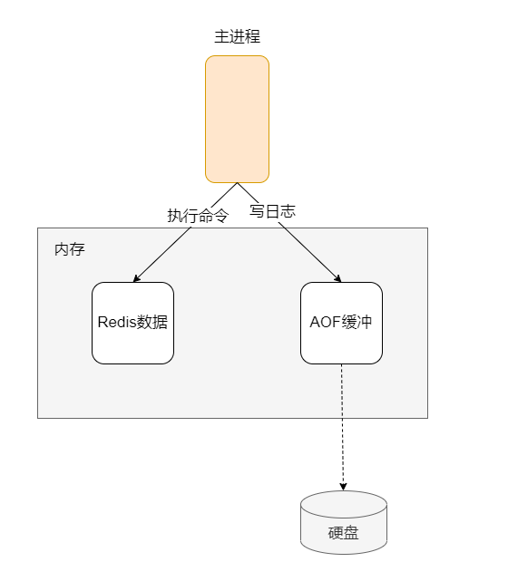
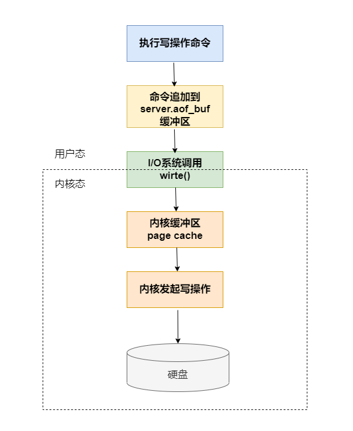
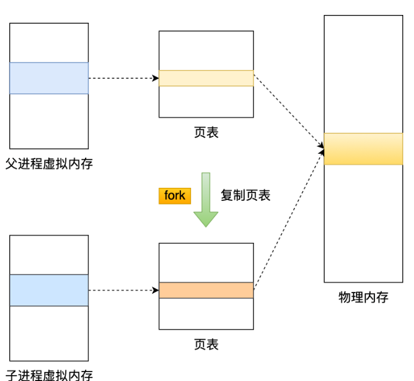
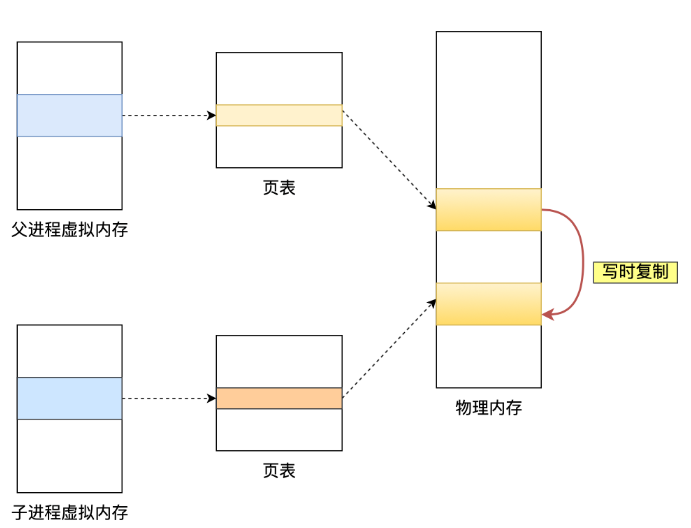
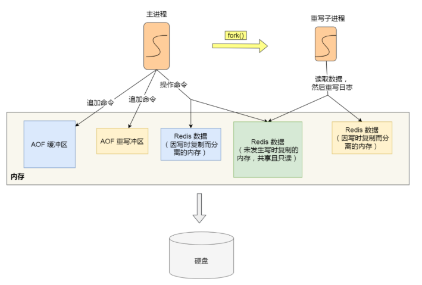

# Redis持久化方案

## AOF

- Append only File，在redis执行写命令的时，会追加该命令到日志文件中。当Redis故障重启后，读取该日志文件的命令即可恢复数据

### 配置：

- 默认不开启，需在配置文件中打开    appendonly = yes

### 策略：



- Redis先执行写命令之后才将命令记录到AOF日志中（主进程执行命令写入内存-Redis数据，再写日志到AOF缓冲，缓冲后落盘）

  - 优势：

    - 避免额外的检查开销。因为如果先记录日志在执行命令的话，如果当前命令语法有问题，那么如果不进行命令语法检查，那么错误的命令就会被记录到日志，Redis在使用日志恢复时可能或出错。
    - 不阻塞当前写操作命令的执行。因为写命令执行成功后才会记录到AOF日志中。

  - 风险（AOF日志回写硬盘的时机有关）：

    - 数据丢失风险

      执行写操作命令和记录日志是两个过程，当Redis还没来得及将命令写入到硬盘时，服务器发生宕机，那么数据就会丢失

    - 给下一个命令带来阻塞风险

      由于写命令执行成功后才会记录AOF日志，所以不会阻塞当前写操作的命令执行，当会给下一个命令带来阻塞风险。写日志时，服务器的硬盘IO压力太大就会导致写硬盘速度很慢进而阻塞住

<!-- more -->

### 日志格式：

- 以 set name 123 为例

  命令:  

  ```bash
  set name 123
  ```

  日志：

  ```
  *3
  
  $3
  
  set
  
  $4
  
  name
  
  $3
  
  123
  ```

  意义：

  【*3】表示命令有三个部分，每个部分都是以【$+数字】开头，后面紧跟具体的命令或key或值，这里的【数字表示】这部分的命令、key或值有多少个字节，例如【$3 set】表示这部分有3个字节

### 回写磁盘流程：

- 写入流程

  - 1.redis执行完写操作命令后，会将命令追加到server.aof_buf缓冲区
  - 2.然后通过write()系统调用，将缓冲区的数据写入AOF文件，此时数据并没有写入磁盘，而是拷贝到了page cache，等待内核将数据写入磁盘
  - 3.具体内核缓冲区的数据什么时候写入磁盘，由内核决定

  

- 写磁盘策略(三种策略都是控制fsync()的调用时机)

  - Always -- 每次写操作命令执行完毕，同步将AOF日志数据写回磁盘

    最大程度保证数据不丢失，但不可避免影响主进程的性能

  - Everysec -- 每次执行完写操作命令，先将命令写入AOF文件的缓冲区，然后每隔一秒将缓冲区的内容写回磁盘

    是一种折中的方式，避免了Always的性能开销，也比No策略更能避免数据丢失，如果上一秒的命令没有写入磁盘，发生了宕机，那就会丢失1秒的数据

  - No -- 不由Redis控制写回磁盘的时机，转交给操作系统控制写回的时机。即每次执行完命令后，将命令写入AOF文件的内核缓冲区，再由操作系统决定何时写到磁盘

    相比Aways性能较好，但操作系统写回磁盘的时机不可预知，如果AOF日志内容没有回写磁盘，一旦服务宕机，就会丢失不定量的数据

### 重写机制：

- AOF是一个文件，随着执行的写操作命令越来越多，AOF文件就会变得越来越大，带来性能问题，比如重启Redis后整个恢复的过程就会很慢。
  所以Redis提供【AOF重写机制】，当AOF文件超过所设定的阈值后，启用AOF重写机制压缩AOF文件

- AOF重写时通过读取当前数据库中的所有键值对，然后将每一个键值对用一条命令记录到【新的AOF文件中】，全部记录完成后，就用新的AOF文件替换旧的。

  - 如：在没有重写机制前，先后执行了 set name 123 和set name 123456，那么AOF文件会记录这两个命令，但使用重写机制后只会记录set name 123456，这样一来就相当于压缩了文件
  - 尽管某个键值对被多条写命令修改，最终也只需要根据这个键值对的最新状态，用一条命令记录，代替了之前记录的多条命令

- 后台重写（bgrewriteaof）-- 会有两个阶段会阻塞父进程

  创建子进程的途中，由于要复制父进程的页表等数据结构，阻塞的时间跟页表的大小有关，页表越大，阻塞时间越长
  创建完子进程后，如果子进程或父进程修改了共享数据，就会发生写时复制，期间会拷贝物理内存，内存越大，阻塞时间越长

  

  - 重写的过程是一个非常耗时的过程，因此Redis的重写AOF过程是由后台子进程【berewriteaof】来完成的。
    因此重写期间，主进程可以继续处理命令请求，从而避免阻塞子进程;
    子进程携带有主进程的数据副本

  - 为什么使用子进程而不是子线程

    如果使用线程，那么多个线程之间会内存共享，在修改共享内存数据时，需要通过加锁等手段保证数据的安全，这样就会降低性能。
    而使用子进程，创建子进程时，父子进程是共享内存数据的，不过这个共享的内存只能以只读的方式，但父子进程的任意一方修改了该共享内存，就会发生【写时复制】，于是父子进程就有了独立副本，不用加锁保证数据安全(写时复制,Copy On Wite)

  - fork 生成子进程

    - 调用fork 时操作系统会把主进程的【页表】复制一份给子进程，这个页表记录着虚拟地址与物理地址的映射关系，而不是复制物理内存。这样一来父子进程就共享物理内存数据了。
    - 当父进程或子进程先这个内存发起写操作时，CPU会触发缺页中断（由于页表是只读的），这是操作系统会在缺页异常处理里进行【物理内存复制】，并重新设置内存映射关系，将父子进程的内存读写权限设置为可读写，最后才会对内存进行操作，这个过程成为【写时复制 Copy On Write】
    - 在重写AOF日志过程中，如果主进程修改了已经存在的key-value，若此时这个key-value数据已经在子进程的内存数据，就会导致子进程内存数据与主进程内存数据不一致，这是要怎么办呢？AOF重写缓冲区

  - 重写缓冲区

    - 在重写AOF期间，当Redis执行完一个写命令后，它会同时将这个写命令写入【AOF缓冲区】以及【AOF重写缓冲区】

    - 当子进程完成AOF重写工作后，会向主进程发送一个信号。主进程收到信号后会：
      1.将AOF重写缓冲区的所有内容追加到新的AOF的文件中，使得新旧文件保持一致
      2.新的AOF文件进行改名，覆盖现有的AOF文件

    - 重写缓冲区满了会发生什么？

      重写缓冲区是边写边分配的，默认大小是10M，通过链表的形式链接起来。当内存资源紧张，申请缓冲区内存失败时，会终止子进程并打印日志


## RDB

- RDB快照就是记录某一瞬间的内存数据，记录的实际数据，恢复数据时直接将文件读入内存即可

### 配置 && 策略：

- save
  执行save命令后，就会在主线程生成RDB文件，由于和执行命令在同一个线程，所以如果写入RDB文件时间太长，会阻塞主线程

- bgsave
  会创建一个子进程来生成RDB文件，这样可以避免主线程的阻塞

- 通过配置文件来实现每隔一段时间执行bgsave命令(Copy On Wite,写时复制)

  ```bash
  save 900 1
  save 300 10
  save 60 10000
  ```

  只要满足其中一个就会执行
  900秒内对数据库进行了至少一次修改
  300秒内对数据库进行了至少十次修改
  60秒内对数据库至少进行了一万次修改

- 在进行生成RDB快照时，如果发生写时复制，那新修改的部分内容将会在下一次bgsave写入RDB文件，因此当执行完RDB生成时，如果宕机，则RDB生成期间修改的数据就会丢失

## 混合模式

- 即RDB与AOF混合持久化
- 尽管RDB比AOF的数据恢复速度快，但是快照的频率不好把握。
  如果频率太低，两次快照期间发生宕机，就可能丢失比较多的数据
  如果频率太高，频繁写入磁盘和创建子进程会带来额外的开销
- aof-use-rdb-preamble yes
  开启混合持久化后，AOF文件的前半部分时RDB格式的全量数据，后半部分时AOF格式的增量数据。
  这样的好处在于重启Redis加载数据时，由于前半部分时RDB内容，这样加载的时候速度会很快。加载完RDB的内容后，才会加载后半部分的AOF内容。
  - 在AOF重写日志时，fork出来的重写子进程会先将与主线程共享的内存数据以RDB的方式写入到AOF文件中，然后主线程处理的操作命令会被记录在重写缓冲区中，重写缓冲区里的增量命令会以AOF方式写入AOF文件，写入完成后通知主进程将新的含有RDB和AOF格式的AOF文件替换旧的AOF文件
- RDB_OPCODE_EOF 分隔

