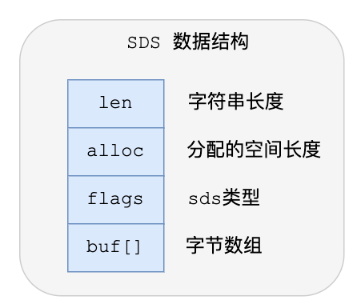
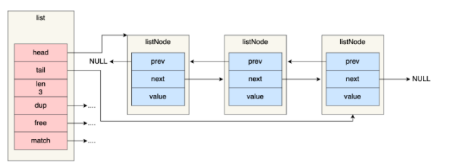
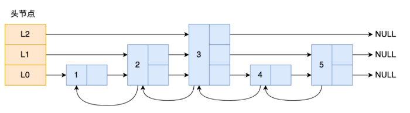
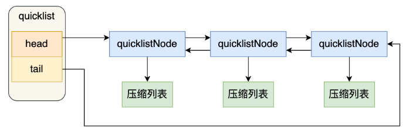
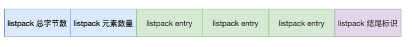

# 数据类型

- 基本类型
  - String（字符串）
  - Hash（哈希）
  - List（列表）
  - Set（集合）
  - Zset（有序集合）
- 特殊的数据结构类型
  - Geospatial
  - Hyperloglog
  - Bitmap

<!-- more -->

# 数据结构

- Object

- SDS
  - 简单动态字符串 simple dynamic string
  - C语言字符串缺陷
    - 以 ’\0‘ 结束。因此字符串包含\0时会提早结束，因此不能保存图片、音频等数据。同时 strlen 获取字符串长度的复杂度为O（N）。
    - 缓冲区溢出。C语言的字符串本身不记录自身缓冲区的大小，当程序执行strcat函数时，C语言假定已经分配好足够的内存，一旦超出这部分内存就可能发生缓冲区溢出从而造成程序终止
    - 对字符串的操作效率不高，需要遍历字符串
  - 数据结构包含字符串长度、分配的空间长度、sds类型、字节数组
    - len, 记录了字符串的长度。这样获取字符串长度直接返回该变量即可，时间复杂度为O(1)
    - alloc, 分配给字符数组的空间长度。这样在修改字符串的时候可以通过减去len计算出剩余空间大小。空间不足时自动扩展
    - flags,用来表示不同类型的SDS。一共有5种，sdshdr5、sdshdr8、sdshdr16、sdsgdr32、sdshdr64
    - buf[], 字符数组，用来保存实际数据
  
- 链表list

  Redis 在listNode结构体基础上又封装了lisy这个数据结构，使得操作起来更方便。list结构为链表提供了链表头指针head、链表尾节点tail，链表节点数量len，以及可自定义实现的dup、free、match函数

  - 优点：

    - listNode链表节点里带有prev和next指针，获取前置和后置节点的时间复杂度只需O(1)
    - list 结构提供了链表头节点head和尾节点tail指针，所以获取链表的头尾节点的时间复杂度为O(1)
    - list 结构体提供了链表节点数量len，所以获取链表中的节点数量时间复杂都为O(1)
    - listNode链表节点使用void* 指针保存节点值，并且可以通过dup、free、match函数指针为节点设置该节点的特殊类型的函数。因此链表节点可以保存不同类型的值

  - 缺点：

    - 节点内存不连续，无法很好利用CPU缓存
    - 保存每一个节点都需要一盒链表节点结构头的分配，内存开销较大。因此Redis3.0的List对象会在数据量较少的情况下使用【压缩列表】

    

- 压缩列表ziplist

  - 它是内存紧凑型的数据结构，占用一块连续的内存空间，不仅可以利用CPU缓存，而且会针对不同长度的数据进行相应的编码
  - 但不能保存过多的元素，否则查询效率就会降低。
    新增或修改某个元素时，压缩列表占用的内存空间需要重新分配，甚至可能引发【连锁更新】
  - 结构设计

    - 压缩列表在表头有三个字段，zlbytes、zltail、zllen、zlend。因此查找第一个元素和最后一个元素可以直接定位，复杂度为O(1),而查找其他元素只能遍历查找，复杂度为O(N)，因此不适合保存过多的元素

      - zlbytes，记录整个压缩列表占用的内存字节数
      - zltail，记录压缩列表尾部节点距离起始地址有多少字节，即偏移量
      - zllen，记录压缩列表包含的节点数量
      - zlend，标记压缩列表的结束点，固定值 0xFF(十进制255)
      - entry，压缩列表的节点，包含三部分内容

        - prevlen，记录前一个节点的长度。
          如果前一个节点长度小于254字节，prevlen需要用1字节来保存长度值；大于等于254字节，则需要5字节
        - encoding，记录当前节点实际数据的类型及长度.
          节点数据是整数,则需要1字节进行编码,如果是字符串,则根据字符串长度使用1/2/5字节进行编码
        - data，记录当前节点的实际数据
      - 当往压缩列表插入数据时，会根据数据是字符串还是整数以及数据的大小，使用不同空间大小的prevlen和encoding这两个元素保存信息
  - 连锁更新
  - 压缩列表新增或修改某个元素时,如果空间不够,压缩列表所占用的空间就需要重新分配.当插入的元素较大时,可能会导致后续元素的prevlen占用的空间都发生变化,从而导致每个元素空间都需要重新分配,造成性能下降

- 哈希表hash

  - 实际上是数组,哈希值相同时通过链表的形式连接起来
  - rehash(负载因子大于等1,且没有执行bgsave或bgrewriteaof命令时,会进行负载因子大于等于5时,强制进行)
    - Redis 设计的时候会使用两个hash表,正常服务请求阶段,插入的数据都会被写到哈希表1,此时哈希表2并没有分配空间
    - 随着数据增多,触发rehash操作后,会:
      1.给哈希表2分配空间,一般是哈希表1的2倍
      2.将哈希表1的数据迁移到哈希表2中
      3.迁移完成后,哈希表1的空间会被释放,并把哈希表2设置为哈希表1,然后创建一个空白的哈希表,为下一次rehash做准备
    - 如果哈希表数据量非常大,则在迁移到哈希表2时会因大数据量的拷贝而造成阻塞
  - 渐进式rehash
    - 分次迁移数据
      1.给哈希表2分配空间
      2.在rehash期间,每次哈希表元素进行新增删除查询或更新操作时,redis除了会执行对应操作外,还会顺序将哈希表1中索引位置上的所有key-value迁移
      3.随着处理客户端发起的哈希表操作请求数量越来越多,最终在某个时间点内,完成迁移

- 跳表zskiplist

  - 跳表是在链表基础上改进的多层有序链表.链表的查找复杂度是O(N),而跳表的查找复杂度是O(logN)
  - 跳表是一个带有层级关系的链表,每一层可以包含多个节点,每一个节点通过指针连接起来
    - 图中头节点有L0 L1 L2三个头指针,分别指向了不同层级的节点,然后每个层级的节点都通过指针连接起来
      L0层级共有5个节点: 节点1 2 3 4 5
      L1层级共有3个节点: 节点2 3 5
      L2层级共有1个节点: 节点3
    - 如果采用链表结构查找节点4需要查找4次,而使用跳表之后,只需查找2次即可,因为可以在头节点L2层级跳到节点3,然后在往前遍历找到节点4
  - 查询过程
    - 查询跳表节点的过程时,跳表会从头节点的最高层开始,逐层遍历.在遍历某一层的跳表节点时,会用跳表节点中的SDS类型元素和权重进行判断
      - 如果当前节点的权重小于要查找元素的权重时,跳表就会访问该层上的下一个节点
      - 如果当前节点的权重等于要查找的权重时,且节点的SDS类型数据小于要查找的数据时,跳表就会访问该层上的下一个节点
    - 如果上面两个条件都不满足,或者下一个节点为空,跳表会使用目前遍历到的节点的level数组里的下一层指针,验证下一层指针继续查找
  - 跳表的相邻两层的节点数量最理想的比例是2:1,查找复杂度可以降低到O(logN)
    - 如果采用新增节点或者删除节点时,来调整跳表节点以维持比例的方法的话,会带来额外开销
    - Redis在跳表创建节点的时候,随机生成每个节点的层数,并没有严格维持相邻两层的比例为2:1
      - 创建节点时,会生成0~1范围的随机数,如果这个随机数小于0.25,那么层数就加1,然后继续生成下一个随机数,直到随机数的结果大于0.25,最终去顶层数.这样相当于每增加一层的概率不超过25%,层数越高,概率越低,最大限制是64层

- 整数集合inset

- quicklist

  - 双向链表 + 压缩列表
    通过控制每个链表节点中的压缩列表的大小或者元素个数来规避连锁更新问题.因为压缩列表元素越少或越小,连锁更新带来的影响就会越小
  - quiclListNode里包含了前一个节点和下一个节点的指针
    - 在向quicklist添加一个元素时,会先检查插入位置的压缩列表是否能够容纳该元素,如果能够容纳就直接保存到该节点的压缩列表中,如果不能容纳则新建一个接待你

- listpack(Redis 5.0)

  - listpack还是用一块连续的内存空间来紧凑地保存数据,但节点会采用不同的编码方式来保存不同大小的数据
  - listpack的节点包含三部分内容
    - encoding,定义该元素的编码类型
    - data,实际存放的数据
    - len,encoding + data的总长度
      - 不在记录前一个节点的长度,当向listpack加入一个新元素时,不会影响其他接待你的长度字段变化,从而避免连锁更新问题
