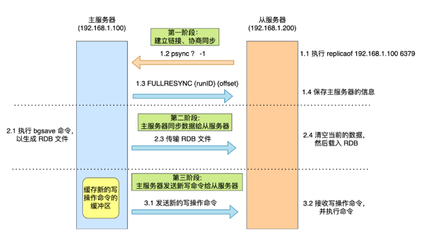
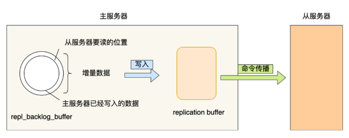

# 高可用

## 主从模式

- 不具备自动容错和恢复功能,需要等机器重启或者手动切换前端IP才能恢复
- 较难支持在线扩容
- 存在数据丢失,以及全量复制时会降低性能

## 哨兵模式

- sentinal,哨兵,主要负责:
  (1) 集群监控,负责监控redis master和salve进程是否正常工作
  (2) 消息通知,如果某个redis有故障,哨兵负责发送消息作为报警通知管理员
  (3) 故障转移,如果master挂掉,自动转移到salve 节点上
  (4) 配置中心.如果故障转移发生,通知客户端新的master地址
- 哨兵本身也可以是分布式的,作为一个哨兵集群,这样当部分哨兵节点挂掉,集群依然可以正常工作
- 数据丢失

  - 主从复制导致丢失

    - 在master节点数据还没同步到slave的时候,master宕机了

  - 集群脑裂导致丢失

    - 某个master所在机器突然脱离了正常的网络,跟其他slave节点不能连接,但实际上master还运行着,此时哨兵可能会认为master宕机,重新选举了master,此时集群里会存在两个master

    - 在某个slave选举成为master之后,客户端还没来得及切换到新的master上面,继续向旧的master写入数据,此时旧master恢复正常,会作为一个slave挂到新的master上面,自己的数据就会被清空,重新复制数据

  - 解决办法
      		min-salves-to-write 
      min-slaves-max-lag
      设置要求最少数量的slave,复制和同步最大延迟不能超过多长时间.超过min-slaves-max-lag指定的时间后未收到ack则master拒绝写请求
- sdown和odown失败状态
      			- sdown是主观宕机,即就一个哨兵自己觉得master宕机了.如果一个哨兵ping一个master,超过is-master-after-milliseconds指定的时间后,没有收到回复则主观认为master宕机了
      - odowm,客观宕机,如果quorum数量的哨兵都觉得master宕机了.如果一个哨兵指定时间内,收到了quorum指定数量的其他哨兵也认为master宕机了,那就是客观宕机
- 自动发现
              	- 哨兵间的相互发现是通过redis的pub/sub机制实现的
          每个哨兵都会往 _sentinel_:hello这个channel发送消息,这个时候其他哨兵可以订阅这个消息感知其他哨兵的存在
        - 每隔两秒钟,哨兵就会往自己监控的某个master+slaves对应的 _sentinel_:hello  channel里发送一个消息,内容是自己的host ip runid 和对这个master的监控配置
- 选举算法
        	- 如果一个master被认为odown了,而且majority哨兵都允许主备涉黄,那么某个哨兵就会执行主备切换操作
        - 首先需要quorum数量的哨兵认为odowm了,然后选举出来一个哨兵来做切换,这个哨兵需得到majority哨兵的授权
          如quorum < majority ,比如有5个哨兵,majority就是3,quorum设置为2,那么需要3个哨兵授权才能执行切换
          如quorum >= majority, 那么必须quorum数量的哨兵授权才能执行
        - 执行切换的那个哨兵会从切换到的新master哪里得到一个 configuration epoch(一个版本包version),进行传播
- 优点
        	- 基于主从模式,具有主从的有点
        - 故障可以转移,可用性好
- 缺点
        	- 配置复杂
        - 在线扩容较难

## Cluster集群

- 16384个槽
- crc16 对 16384 取余
- 有任意一个master挂掉且没有可用的slaves时,集群进入fail状态,不可用

<!-- more -->

# 主从同步

## 第一次同步

- 第一阶段：建立链接、协商同步

  - 执行replicaof命令，从服务器就会发送【psync】命令到主服务器，表示要进行数据同步。
    psync携带两个参数，分别是主服务器的【runID】和复制进度【offset】

    - runID，每个Redis服务器启动时都会自动产生一个随机ID来唯一标识自己。当从服务器和主服务器第一次进行同步时，因为不知道主服务器的runID，所以会设置为 “？”

    - offset表示复制的进度，第一次同步时为 -1
  - 主服务器收到【psync】命令后，会用【FULLRESYNC】命令响应对方
      	- 响应会带上runID和offset参数
- 第二阶段：主服务器同步数据给从服务器
  - 主服务器会执行bgsave命令生成RDB文件，然后将文件发送给从服务器
    - 在生成RDB文件过程中，新的写操作命令会被记录到replication buffer 缓冲区中
    - 当有多个从服务器时，如果都与主服务器进行全量同步，那么主服务就会忙于fork创建子进程，如果主服务器数据非常大，在fork的时候就会阻塞主线程；另外传输RDB文件也会占用主服务器带宽。
      因此可以设置从服务器从从服务器上同步数据，分摊压力
  - 从服务器收到RDB文件后，会清空当前的数据，然后载入RDB文件
- 第三阶段：主服务器发送新写操作命令给从服务器

## 命令传播 -- 基于长连接的命令传播

- 第一次同步完成后，双方之间就维持一个TCP链接。后续主服务器通过该链接将写操作命令传播给从服务器，然后从服务器执行该命令repl_backlog_buffer

## 增量复制

- 当网络断开时，就无法通过基于产量及的命令传播进行同步。当网络从新连接时，会进行增量同步
  - 从服务器在网络恢复后，会发送psync名利给给主服务器，此时psync命令里的offset参数不是-1
  - 然后主服务器将从服务器断线期间所执行的写操作命令发送给从服务器(repl_backlog_bufffer,replication offset,环形缓冲区)
  - 主服务器收到该命令后，然后后用CONTINUE命令响应，告诉从服务器接下来采用增量复制的方式同步数据
- repl_backlog_buffer
  - 一个环形缓冲区，用于主从服务器断连后，从中找到差异数据。缓冲区保持着最近传播的写命令
  - 默认大小为 1M， 写满后会覆盖之前的数据。可通过【repl-backlog-size】进行调节
- replication offset
  - 标记环形缓冲区的同步进度，主从服务器都有各自的偏移量，主服务器使用【master_repl_offset】来记录自己写到的位置，从服务器用【salve_repl_offset】来记录自己读到的位置

从服务器重新连接时，从服务器会通过【psync】命令将自己的复制偏移量【salve_repl_offset】发送给主服务器，主服务器根据自己的【master_repl_offset】与从服务器的复制便宜李兰决定执行哪种操作
当判断出从服务器要读取的数据还在repl_backlog_buffer缓冲区时，采取增量同步
否则采用全量同步
