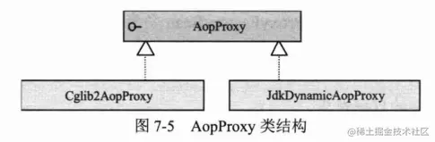

# AOP

AOP，Aspect Oriented Programming，面向切面编程

AOP的理念：**将分散在各个业务逻辑代码中相同的代码通过横向切面的方式，抽取到一个独立的模块中**。

SpringAOP底层原理就是**动态代理**。

代理的意义：增强对象的行为，使用动态代理实质上就是**调用时拦截对象方法**，**对方法进行改造、增强**。

Spring AOP使用纯JAVA实现，它不需要专门的编译过程，也不需要特殊的类装载器，它**在运行期通过代理方式向目标织入增强代码**。

<!-- more -->

来源《Spring 实战 (第4版)》一句话：

SpringAOP构建在动态代理之上，因此，Spring对AOP的支持局限于方法拦截。

在java中动态代理有两种方式：

1.JDK动态代理

2.CGlib动态代理

​    

CGlib代理其生成的动态代理对象是目标类的子类

SpringAOP**默认**是使用J**DK动态代理**，如果**代理的类没有接口则会使用CGlib代理**

那么JDK代理和CGLib代理我们该用哪个呢？？在《精通Spring4.x 企业应用开发实战》给出了建议：

如果是**单例**模式我们最好使用**CGlib**，如果是**多例**最好使用**JDK动态代理**

原因：

1.JDK在创建代理对象时的性能要高于CGlib，而生成代理对象的运行性能却比CGlib低
