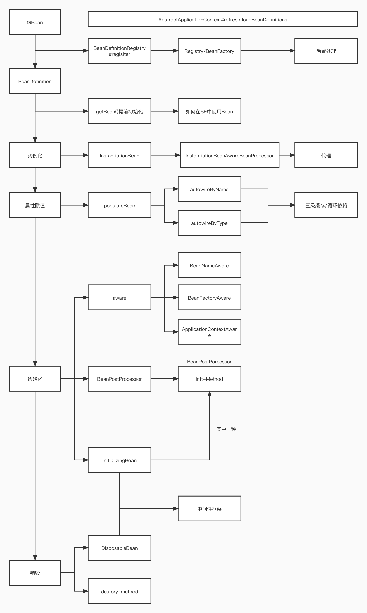
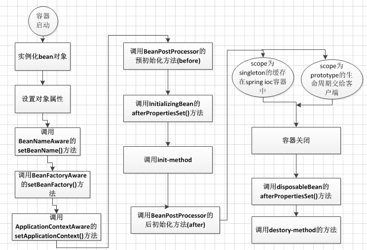
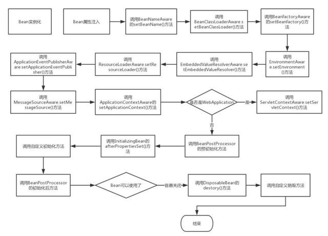

# Spring Bean生命周期



<!-- more -->

## 源头

### \<Bean\> / @Bean 

AbstractApplicationContxt#refresh#refresh方法**loadBeanDefinitions**加载进入容器

#### 原理

BeanDefinitionRegistry.register()加载并进行后置处理

### BeanDefinition

承上启下功能，代表**loadBeanDefinitions**加载的结果，并作为Bean正式初始化的元数据

#### 特殊属性（用于反射生成新的Bean）

- BeanName

-  classType

#### 提前初始化getBean()

Spring在这一步将未配置懒加载的Bean创建


## Bean正式初始化



### `实例化`

#### 主要入参:BeanName

使用BeanName根据BeanDefinition 获取的ClassType进行反射返回一个Object

#### InstantiationBeanAwareBeanPostProcessor

- 源码

  ```java
  org.springframework.beans.factory.support.AbstractAutowireCapableBeanFactory#createBean(java.lang.String, org.springframework.beans.factory.support.RootBeanDefinition, java.lang.Object[])
  
  try {
    // Give BeanPostProcessors a chance to return a proxy instead of the target bean instance.
    Object bean = resolveBeforeInstantiation(beanName, mbdToUse);
    if (bean != null) {
      return bean;
    }
  }
  ```

  用于生成代理类

- 可使用InstantiationBeanAwareBeanPostProcessor功能实现自己的方法进行后续步骤

### `属性赋值`

#### 核心功能populateBean

- 核心方法
  - autowireByName -- @Autowired
  - autowireByType -- @Resource

- Spring三级缓存解决循环依赖
  - 一级缓存
    - 可直接使用的对象
  - 二级缓存
    - 反射的引用对象
  - 三级缓存
    - 工厂
    - AOP代理依靠三级缓存


### `初始化InitialingBean`

1. 请求Aware

   Bean实现Aware接口，在此将Instance set()

   - BeanNameAware
   - BeanFactoryAware
   - ApplicationContextAware

2. BeanPostProcessor

   - org.springframework.beans.factory.config.BeanPostProcessor
   
       ```java
       /**
         	 * Apply this {@code BeanPostProcessor} to the given new bean instance <i>before</i> any bean
         	 * initialization callbacks (like InitializingBean's {@code afterPropertiesSet}
         	 * or a custom init-method). The bean will already be populated with property values.
         	 * The returned bean instance may be a wrapper around the original.
         	 * <p>The default implementation returns the given {@code bean} as-is.
         	 * @param bean the new bean instance
         	 * @param beanName the name of the bean
         	 * @return the bean instance to use, either the original or a wrapped one;
         	 * if {@code null}, no subsequent BeanPostProcessors will be invoked
         	 * @throws org.springframework.beans.BeansException in case of errors
         	 * @see org.springframework.beans.factory.InitializingBean#afterPropertiesSet
         	 */
       @Nullable
       default Object postProcessBeforeInitialization(Object bean, String beanName) throws BeansException {
       return bean;
       }
       
       /**
       	 * Apply this {@code BeanPostProcessor} to the given new bean instance <i>after</i> any bean
       	 * initialization callbacks (like InitializingBean's {@code afterPropertiesSet}
       	 * or a custom init-method). The bean will already be populated with property values.
       	 * The returned bean instance may be a wrapper around the original.
       	 * <p>In case of a FactoryBean, this callback will be invoked for both the FactoryBean
       	 * instance and the objects created by the FactoryBean (as of Spring 2.0). The
       	 * post-processor can decide whether to apply to either the FactoryBean or created
       	 * objects or both through corresponding {@code bean instanceof FactoryBean} checks.
       	 * <p>This callback will also be invoked after a short-circuiting triggered by a
       	 * {@link InstantiationAwareBeanPostProcessor#postProcessBeforeInstantiation} method,
       	 * in contrast to all other {@code BeanPostProcessor} callbacks.
       	 * <p>The default implementation returns the given {@code bean} as-is.
       	 * @param bean the new bean instance
       	 * @param beanName the name of the bean
       	 * @return the bean instance to use, either the original or a wrapped one;
       	 * if {@code null}, no subsequent BeanPostProcessors will be invoked
       	 * @throws org.springframework.beans.BeansException in case of errors
       	 * @see org.springframework.beans.factory.InitializingBean#afterPropertiesSet
       	 * @see org.springframework.beans.factory.FactoryBean
       	 */
       @Nullable
       default Object postProcessAfterInitialization(Object bean, String beanName) throws BeansException {
         return bean;
       }
       ```
   
   - Init-Method
   
  多种初始化方式
   
  - 实现InitalizingBean接口
     - SpringBean 配置Init-Method
  
     

3. InitalizingBean

#### 什么时候使用Aware？什么时候使用PostProcessor

- Aware
  - 上级方法传递数据，用于取数据，读操作
- PostProcessor
  - 写入操作

### `销毁`

- 实现DisposableBean接口
- 调用destroy-method方法


#### InitalizingBean+DisposableBean实现中间件框架


## 完整的生命周期



- BeanNameAware.setBeanName() 在创建此bean的bean工厂中设置bean的名称，在普通属性设置之后调用，在InitializinngBean.afterPropertiesSet()方法之前调用

- BeanClassLoaderAware.setBeanClassLoader(): 在普通属性设置之后，InitializingBean.afterPropertiesSet()之前调用

- BeanFactoryAware.setBeanFactory() : 回调提供了自己的bean实例工厂，在普通属性设置之后，在InitializingBean.afterPropertiesSet()或者自定义初始化方法之前调用

- EnvironmentAware.setEnvironment(): 设置environment在组件使用时调用

- EmbeddedValueResolverAware.setEmbeddedValueResolver(): 设置StringValueResolver 用来解决嵌入式的值域问题

- ResourceLoaderAware.setResourceLoader(): 在普通bean对象之后调用，在afterPropertiesSet 或者自定义的init-method 之前调用，在 ApplicationContextAware 之前调用。

- ApplicationEventPublisherAware.setApplicationEventPublisher(): 在普通bean属性之后调用，在初始化调用afterPropertiesSet 或者自定义初始化方法之前调用。在 ApplicationContextAware 之前调用。

- MessageSourceAware.setMessageSource(): 在普通bean属性之后调用，在初始化调用afterPropertiesSet 或者自定义初始化方法之前调用，在 ApplicationContextAware 之前调用。

- ApplicationContextAware.setApplicationContext(): 在普通Bean对象生成之后调用，在InitializingBean.afterPropertiesSet之前调用或者用户自定义初始化方法之前。在ResourceLoaderAware.setResourceLoader，ApplicationEventPublisherAware.setApplicationEventPublisher，MessageSourceAware之后调用。

- ServletContextAware.setServletContext(): 运行时设置ServletContext，在普通bean初始化后调用，在InitializingBean.afterPropertiesSet之前调用，在 ApplicationContextAware 之后调用

  **注：是在WebApplicationContext 运行时**

- BeanPostProcessor.postProcessBeforeInitialization() : 将此BeanPostProcessor 应用于给定的新bean实例 在任何bean初始化回调方法(像是InitializingBean.afterPropertiesSet或者自定义的初始化方法）之前调用。这个bean将要准备填充属性的值。返回的bean示例可能被普通对象包装，默认实现返回是一个bean。

- BeanPostProcessor.postProcessAfterInitialization() : 将此BeanPostProcessor 应用于给定的新bean实例 在任何bean初始化回调方法(像是InitializingBean.afterPropertiesSet或者自定义的初始化方法)之后调用。这个bean将要准备填充属性的值。返回的bean示例可能被普通对象包装

- InitializingBean.afterPropertiesSet(): 被BeanFactory在设置所有bean属性之后调用(并且满足BeanFactory 和 ApplicationContextAware)。


###### 来源:

https://www.bilibili.com/video/BV1h541197rg

https://www.jianshu.com/p/3944792a5fff

https://baijiahao.baidu.com/s?id=1666448276232778855&wfr=spider&for=pc
