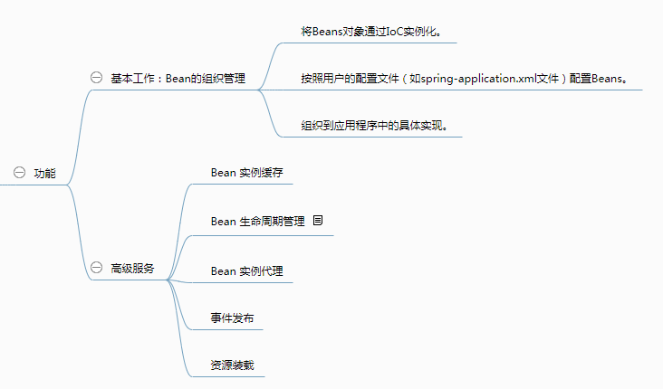
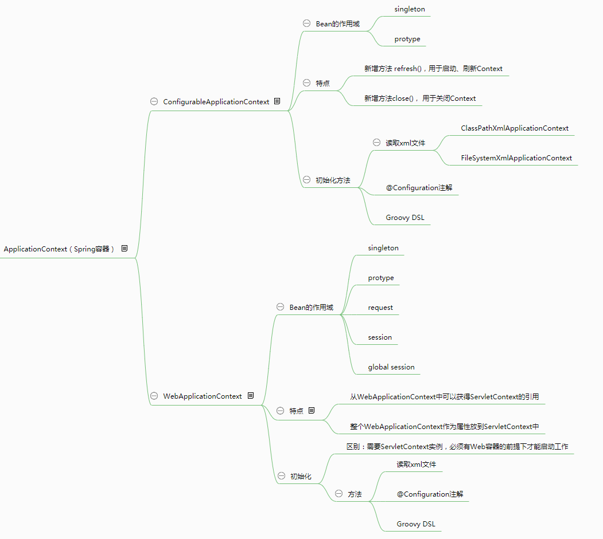

# Spring 容器是什么

Spring容器帮程序员处理了大量繁琐的过程，可以说Spring 容器是 Spring 框架的核心。

## Spring容器到底是什么

### 从概念上讲

Spring 容器是 Spring 框架的核心，是用来管理对象的。容器将创建对象，把它们连接在一起，配置它们，并管理他们的整个生命周期从创建到销毁。

### 从具象化讲

在java项目中，我们使用实现了org.springframework.context.ApplicationContext接口的实现类。在web项目中，我们使用spring.xml——Spring的配置文件。

### 从代码上讲

一个Spring容器就是某个实现了ApplicationContext接口的类的实例。也就是说，从代码层面，Spring容器其实就是一个ApplicationContext（一个实例化对象）。

<!-- more -->

## Spring容器的功能

## Spring容器的类别及其特点

Spring提供了两种不同的类型的容器

- Spring BeanFactory容器

  它是最简单的容器，给 DI 提供了基本的支持

- ApplicationContext容器

  ApplicationContext 容器继承自BeanFactory,它包括 BeanFactory 容器的所有功能，所以通常建议使用。
  

###### 来源：

https://www.jianshu.com/p/6a2100dd6532

https://blog.csdn.net/qq_34598667/article/details/83245753
