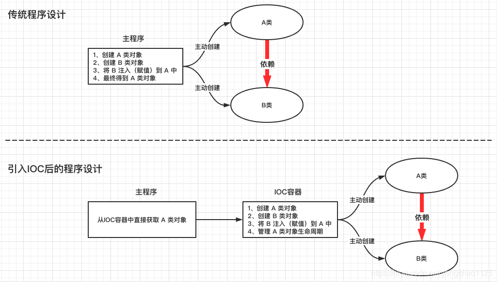
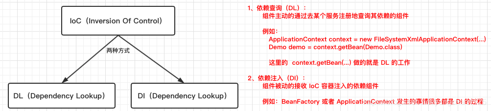
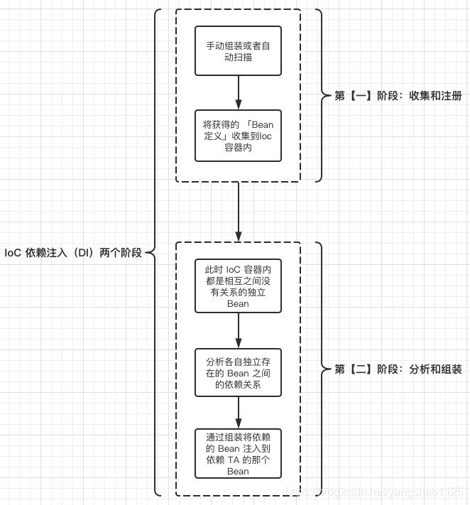

# IOC

Inversion of Control 控制反转

- IOC是一种思想,实现程序的可插拔的核心理念就是控制反转（IoC：Inversion of Control），所谓的控制反转就是将代码的调用权（控制权）从调用放转移给被调用方（服务提供方，容器）。

  所谓的"控制反转"就是对组件对象控制权的转移，从程序代码本身转移到了外部容器，由容器来创建对象并管理对象之间的依赖关系。
  
  

<!-- more -->

# DI

Dependency Injection 依赖注入

- 是组件之间依赖关系由容器在运行期决定，形象的说，即由容器动态的将某个依赖关系注入到组件之中。依赖注入的目的并非为软件系统带来更多功能，而是为了提升组件重用的频率，并为系统搭建一个灵活、可扩展的平台。通过依赖注入机制，我们只需要通过简单的配置，而无需任何代码就可指定目标需要的资源，完成自身的业务逻辑，而不需要关心具体的资源来自何处，由谁实现。

  当应用了IoC，一个对象依赖的其它对象会通过被动的方式传递进来，而不是这个对象自己创建或者查找依赖对象，是容器在对象初始化时不等对象请求就主动将依赖传递给它。通过IOC反转控制DI依赖注入完成各个层之间的注入，使得层与层之间实现完全脱耦，增加运行效率利于维护。

- 本质上 IoC 和 DI 是同一思想下不同维度的表现 , 用通俗的话说就是，IoC 是 bean 的注册，DI 是 bean 的初始化

  

# DL

Dependency Lookup 依赖查找

- 它是控制反转设计原则的一种实现方式。它的大体思路是：容器中的受控对象通过容器的 API 来查找自己所依赖的资源和协作对象。这种方式虽然降低了对象间的依赖，但是同时也使用到了容器的 API，造成了我们无法在容器外使用和测试对象。依赖查找是一种更加传统的 IOC 实现方式。

依赖查找也有两种方式：

- 依赖拖拽：注入的对象如何与组件发生联系，这个过程就是通过依赖拖拽实现；
- 上下文依赖查找：在某些方面跟依赖拖拽类似，但是上下文依赖查找中，查找的过程是在容器管理的资源中进行的，而不是从集中注册表中，并且通常是作用在某些设置点上；（JNDI）

## 依赖注入和依赖查找的区别

- 依赖查找有主动和手动方式,通常需要依赖容器和标准api实现
- 依赖注入通过自动和手动的方式绑定,无需依赖特定的容器和标准api

# IOC与DI-DL

- 同一个概念的不同角度描述

  

###### 来源: 

###### https://rumenz.com/rumenbiji/spring-ioc-di-dl.html

https://www.cnblogs.com/guxia/p/6842647.html